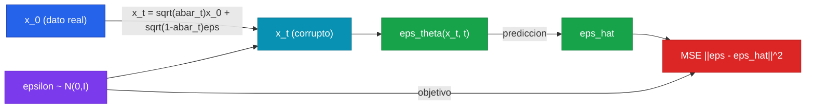

Un modelo de difusión aprende a generar datos invirtiendo, paso a paso, un proceso que los destruye. Suena rebuscado, pero es la idea que destronó a las GAN en generación de imágenes y la que está debajo de Stable Diffusion, DALL-E 2 e Imagen. Lo notable es que el algoritmo central — el de Ho, Jain y Abbeel (2020), el paper que bautizó los **DDPM** — cabe en menos de cien líneas y se entiende de punta a punta sobre un dataset de juguete en 2D. Eso es exactamente lo que vamos a hacer aquí: construir un DDPM mínimo desde cero, en PyTorch, TensorFlow y JAX, sobre una distribución 2D (un *two moons*) que cabe en una figura y entrena en CPU en segundos.

Trabajar en 2D no es una limitación pedagógica: es lo que deja ver el mecanismo sin que la U-Net, las convoluciones y el tamaño del batch tapen la matemática. La red deja de ser una U-Net y se vuelve una MLP diminuta; el "espacio de imágenes" se vuelve el plano $\mathbb{R}^2$, donde podemos graficar literalmente las muestras y comparar la nube generada contra la nube real. La maquinaria — el schedule de $\beta_t$, el forward que añade ruido en un solo paso, la red que predice ruido, el sampling reverse — es idéntica a la de un generador de imágenes de escala completa. Si la entiendes aquí, la entiendes en todas partes.

Este camino asume la intuición del [fundamento de modelos de difusión](/fundamentos/modelos-de-difusion) y formaliza lo que el [paper DDPM (Ho et al., 2020)](/papers/ddpm-ho-2020) propuso. Lo construimos en el contexto de la [Clase 29](/clases/clase-29).

---

## 1. El problema en una imagen: aprender una distribución 2D

Tomamos como distribución objetivo $q(x_0)$ las dos medialunas entrelazadas del clásico *two moons*. Cada dato es un punto $x_0 \in \mathbb{R}^2$. No hay etiquetas, no hay condicionamiento: el modelo solo debe aprender a producir puntos que caigan donde caen los datos reales — recuperar la *forma* de las dos lunas a partir de ruido gaussiano puro.

```python
import numpy as np
from sklearn.datasets import make_moons

def sample_data(n):
    """Distribucion objetivo q(x_0): two moons en R^2, normalizada."""
    x, _ = make_moons(n_samples=n, noise=0.05)   # ignoramos las etiquetas
    x = x.astype(np.float32)
    x = (x - x.mean(0)) / x.std(0)               # centrar y escalar ~ N(0, I) marginal
    return x                                       # shape (n, 2)
```


**Por qué normalizar los datos importa de verdad en difusión.** El proceso forward empuja gradualmente los datos hacia $\mathcal{N}(0, I)$, y el sampling reverse arranca *exactamente* desde $\mathcal{N}(0, I)$. Si los datos no estuvieran centrados y escalados a varianza unitaria, el punto final del forward y el punto inicial del reverse no coincidirían, y el modelo trabajaría contra un desajuste de escala. Centrar y escalar no es cosmética: alinea el "destino" del ruido con el "origen" del muestreo.


---

## 2. El schedule de ruido: $\beta_t$, $\alpha_t$ y $\bar\alpha_t$

El proceso forward es una cadena de Markov de $T$ pasos que añade un poco de ruido gaussiano en cada paso. La cantidad de ruido por paso la fija un **schedule** $\beta_1, \dots, \beta_T$, una secuencia creciente y pequeña (Ho et al. usan un schedule lineal de $\beta_1 = 10^{-4}$ a $\beta_T = 0.02$). Un solo paso del forward es:

$$
q(x_t \mid x_{t-1}) = \mathcal{N}\!\big(x_t;\ \sqrt{1-\beta_t}\,x_{t-1},\ \beta_t I\big)
$$

Aplicar esto $t$ veces seguidas sería lento. La gracia del DDPM es que, definiendo $\alpha_t = 1 - \beta_t$ y el producto acumulado $\bar\alpha_t = \prod_{s=1}^{t}\alpha_s$, el forward de $x_0$ a *cualquier* $x_t$ tiene forma cerrada en **un solo paso**:

$$
q(x_t \mid x_0) = \mathcal{N}\!\big(x_t;\ \sqrt{\bar\alpha_t}\,x_0,\ (1-\bar\alpha_t) I\big)
$$

Por eso precomputamos $\beta_t$, $\alpha_t$ y $\bar\alpha_t$ una sola vez. Todo el algoritmo se apoya en estos tres vectores de largo $T$:

```python
T = 200                                            # numero de pasos de difusion
betas = np.linspace(1e-4, 0.02, T).astype(np.float32)   # schedule lineal
alphas = 1.0 - betas
alpha_bars = np.cumprod(alphas)                    # alpha_bar_t = prod_{s<=t} alpha_s
# verificacion de dimensiones: los tres vectores tienen shape (T,)
assert betas.shape == alphas.shape == alpha_bars.shape == (T,)
```

Intuitivamente: $\bar\alpha_t$ baja monótonamente de $\approx 1$ (en $t=1$, casi todo el dato sobrevive) hacia $\approx 0$ (en $t=T$, queda ruido puro). El término $\sqrt{\bar\alpha_t}$ es cuánto del dato original queda; $\sqrt{1-\bar\alpha_t}$ es cuánto ruido se mezcló. Cuando $\bar\alpha_T \approx 0$, $x_T$ es indistinguible de $\mathcal{N}(0, I)$ — y ahí es donde el muestreo podrá arrancar.

| Símbolo | Definición | Rol |
|---|---|---|
| $\beta_t$ | schedule, de $10^{-4}$ a $0.02$ | ruido añadido en el paso $t$ |
| $\alpha_t = 1-\beta_t$ | señal preservada en el paso $t$ | factor por paso |
| $\bar\alpha_t = \prod_{s\le t}\alpha_s$ | señal acumulada hasta $t$ | habilita el forward de un paso |
| $\sqrt{\bar\alpha_t}$ | amplitud del dato en $x_t$ | "cuánto del original queda" |
| $\sqrt{1-\bar\alpha_t}$ | amplitud del ruido en $x_t$ | "cuánto ruido se añadió" |

---

## 3. El forward (q_sample): añadir ruido en un paso

Gracias a la forma cerrada, generar $x_t$ a partir de $x_0$ es directo. Usando el truco de reparametrización, muestreamos $\varepsilon \sim \mathcal{N}(0, I)$ y componemos:

$$
x_t = \sqrt{\bar\alpha_t}\,x_0 + \sqrt{1-\bar\alpha_t}\,\varepsilon
$$

Esta única ecuación es el corazón del entrenamiento. Nótese qué predeciremos: dado $x_t$ y el paso $t$, la red tendrá que recuperar el $\varepsilon$ que se usó aquí. Por eso guardamos $\varepsilon$ como el *objetivo* de la pérdida.

---

## 4. Qué predice la red y por qué: la pérdida $\lVert \varepsilon - \varepsilon_\theta \rVert^2$

El proceso reverse — el que queremos aprender — también es gaussiano, $p_\theta(x_{t-1}\mid x_t) = \mathcal{N}(x_{t-1}; \mu_\theta(x_t, t), \sigma_t^2 I)$. En principio la red debería predecir la media $\mu_\theta$. La observación central de Ho et al. es que, en vez de eso, conviene **reparametrizar la media en términos del ruido** $\varepsilon$ que se inyectó en el forward. Tras el álgebra (detallada en el [fundamento, sección 3](/fundamentos/modelos-de-difusion#3-el-proceso-reverse-aprendido-predecir-el-ruido)), el objetivo de entrenamiento se simplifica a una MSE limpísima:

$$
\mathcal{L}_{\text{simple}} = \mathbb{E}_{t,\,x_0,\,\varepsilon}\Big[\ \big\lVert \varepsilon - \varepsilon_\theta(\underbrace{\sqrt{\bar\alpha_t}x_0 + \sqrt{1-\bar\alpha_t}\,\varepsilon}_{x_t},\ t)\big\rVert^2\ \Big]
$$

En palabras: muestrea un dato $x_0$, muestrea un paso $t$ uniforme en $\{1,\dots,T\}$, muestrea ruido $\varepsilon$, corrómpelo a $x_t$, y entrena la red $\varepsilon_\theta$ para que *adivine el ruido que se añadió*. Una regresión, nada más. La red $\varepsilon_\theta(x_t, t)$ debe recibir el paso $t$ como entrada, porque la cantidad de ruido a remover depende fuertemente de qué tan avanzado está el proceso.



---

## 5. El sampling reverse (p_sample): de ruido puro a datos

Una vez entrenada $\varepsilon_\theta$, generamos arrancando desde $x_T \sim \mathcal{N}(0, I)$ y deshaciendo el ruido paso a paso, de $t = T$ hasta $t = 1$. Cada paso aplica la regla del DDPM (Algoritmo 2 del paper):

$$
x_{t-1} = \frac{1}{\sqrt{\alpha_t}}\left(x_t - \frac{1-\alpha_t}{\sqrt{1-\bar\alpha_t}}\,\varepsilon_\theta(x_t, t)\right) + \sigma_t z, \qquad z \sim \mathcal{N}(0,I)
$$

donde $\sigma_t = \sqrt{\beta_t}$ (la elección simple del paper) y, crucialmente, en el último paso ($t=1 \to 0$) se omite el ruido $z$ (se pone $z=0$), porque ya no queremos añadir estocasticidad al resultado final. El término entre paréntesis es la **media** $\mu_\theta$: estima dónde estaba $x_{t-1}$ restando el ruido predicho. El $\sigma_t z$ vuelve a inyectar algo de aleatoriedad, lo que mantiene el proceso reverse como un muestreo (y no un colapso determinista a la media).


El sampling es **iterativo y secuencial**: para generar una muestra hay que correr la red $T$ veces, una por paso, sin paralelizar a lo largo de $t$ (cada $x_{t-1}$ depende de $x_t$). Con $T=200$ son 200 forward passes por muestra. Esta es la razón fundamental de que la difusión sea lenta para muestrear comparada con una GAN (un solo forward). Volvemos sobre esto al cierre.


---

## 6. Implementación en PyTorch

El embedding del timestep lo hacemos **sinusoidal** (el mismo de los Transformers): convierte el entero $t$ en un vector denso que la MLP puede usar. Es más expresivo que un one-hot y generaliza mejor entre pasos vecinos. La red $\varepsilon_\theta$ recibe la concatenación de $x_t$ (2 dims) y el embedding de $t$.

```python
import torch
import torch.nn as nn
import numpy as np

device = "cpu"
T = 200
betas = torch.linspace(1e-4, 0.02, T)
alphas = 1.0 - betas
alpha_bars = torch.cumprod(alphas, dim=0)          # shape (T,)

def timestep_embedding(t, dim=32):
    """Embedding sinusoidal de un batch de timesteps. t: (B,) int -> (B, dim)."""
    half = dim // 2
    freqs = torch.exp(-np.log(10000) * torch.arange(half, dtype=torch.float32) / half)
    args = t[:, None].float() * freqs[None, :]     # (B, half)
    return torch.cat([torch.cos(args), torch.sin(args)], dim=-1)   # (B, dim)

class EpsNet(nn.Module):
    """eps_theta(x_t, t): predice el ruido. Entrada (B,2)+(B,emb) -> salida (B,2)."""
    def __init__(self, emb_dim=32, hidden=128):
        super().__init__()
        self.emb_dim = emb_dim
        self.net = nn.Sequential(
            nn.Linear(2 + emb_dim, hidden), nn.SiLU(),
            nn.Linear(hidden, hidden), nn.SiLU(),
            nn.Linear(hidden, hidden), nn.SiLU(),
            nn.Linear(hidden, 2),                  # predice eps en R^2
        )

    def forward(self, x, t):
        emb = timestep_embedding(t, self.emb_dim)  # (B, emb_dim)
        h = torch.cat([x, emb], dim=-1)            # (B, 2+emb_dim)
        return self.net(h)                         # (B, 2)

def q_sample(x0, t, eps):
    """Forward: x_t = sqrt(abar_t) x0 + sqrt(1-abar_t) eps. Todo (B,2), t (B,)."""
    ab = alpha_bars[t][:, None]                    # (B,1), broadcast a (B,2)
    return torch.sqrt(ab) * x0 + torch.sqrt(1 - ab) * eps
```

El **training loop**: muestrear $t$ uniforme, ruido $\varepsilon$, corromper, predecir y MSE.

```python
net = EpsNet().to(device)
opt = torch.optim.Adam(net.parameters(), lr=1e-3)

for step in range(5000):
    x0 = torch.tensor(sample_data(512))            # (512, 2)
    t = torch.randint(0, T, (x0.shape[0],))        # (512,) uniforme en {0..T-1}
    eps = torch.randn_like(x0)                     # (512, 2) ruido objetivo
    xt = q_sample(x0, t, eps)                      # (512, 2) dato corrupto
    eps_pred = net(xt, t)                          # (512, 2) ruido predicho
    loss = ((eps - eps_pred) ** 2).mean()          # MSE ||eps - eps_theta||^2
    opt.zero_grad(); loss.backward(); opt.step()
    if step % 1000 == 0:
        print(f"step {step:5d} | loss {loss.item():.4f}")
```

El **sampling reverse** (`p_sample` loop): de ruido puro a muestras, $T$ pasos.

```python
@torch.no_grad()
def sample(net, n):
    x = torch.randn(n, 2)                          # x_T ~ N(0, I)
    for t in reversed(range(T)):                   # t = T-1, ..., 0
        t_batch = torch.full((n,), t, dtype=torch.long)
        eps_theta = net(x, t_batch)                # (n, 2)
        a = alphas[t]; ab = alpha_bars[t]; b = betas[t]
        # media: mu = 1/sqrt(a) * (x - (1-a)/sqrt(1-ab) * eps_theta)
        mean = (x - (1 - a) / torch.sqrt(1 - ab) * eps_theta) / torch.sqrt(a)
        if t > 0:
            z = torch.randn_like(x)                # ruido salvo en el ultimo paso
            x = mean + torch.sqrt(b) * z           # sigma_t = sqrt(beta_t)
        else:
            x = mean                               # t=0: sin ruido
    return x                                        # (n, 2) muestras generadas

samples = sample(net, 2000).numpy()
# graficar samples vs sample_data(2000): la nube generada recupera las dos lunas
```

Verificación de dimensiones: `x0`, `xt`, `eps`, `eps_pred` son todos `(B, 2)`; `t` es `(B,)`; `alpha_bars[t]` es `(B,)` y al indexar con `[:, None]` se hace `(B, 1)` para broadcast contra `(B, 2)`. En el sampling, `x` es `(n, 2)` en todo momento.

---

## 7. Implementación en TensorFlow

Equivalente exacto. El embedding sinusoidal y la red se escriben con Keras; el training loop usa `GradientTape`.

```python
import tensorflow as tf
import numpy as np

T = 200
betas = tf.linspace(1e-4, 0.02, T)                 # (T,)
alphas = 1.0 - betas
alpha_bars = tf.math.cumprod(alphas)               # (T,)

def timestep_embedding(t, dim=32):
    """t: (B,) int32 -> (B, dim) embedding sinusoidal."""
    half = dim // 2
    freqs = tf.exp(-np.log(10000) * tf.range(half, dtype=tf.float32) / half)
    args = tf.cast(t[:, None], tf.float32) * freqs[None, :]   # (B, half)
    return tf.concat([tf.cos(args), tf.sin(args)], axis=-1)   # (B, dim)

class EpsNet(tf.keras.Model):
    def __init__(self, emb_dim=32, hidden=128):
        super().__init__()
        self.emb_dim = emb_dim
        self.net = tf.keras.Sequential([
            tf.keras.layers.Dense(hidden, activation="swish"),
            tf.keras.layers.Dense(hidden, activation="swish"),
            tf.keras.layers.Dense(hidden, activation="swish"),
            tf.keras.layers.Dense(2),              # eps en R^2
        ])

    def call(self, x, t):
        emb = timestep_embedding(t, self.emb_dim)  # (B, emb_dim)
        h = tf.concat([x, emb], axis=-1)           # (B, 2+emb_dim)
        return self.net(h)                         # (B, 2)

def q_sample(x0, t, eps):
    ab = tf.gather(alpha_bars, t)[:, None]         # (B,1)
    return tf.sqrt(ab) * x0 + tf.sqrt(1 - ab) * eps
```

Training loop y sampling:

```python
net = EpsNet()
opt = tf.keras.optimizers.Adam(1e-3)

@tf.function
def train_step(x0):
    t = tf.random.uniform((tf.shape(x0)[0],), 0, T, dtype=tf.int32)   # (B,)
    eps = tf.random.normal(tf.shape(x0))           # (B,2) objetivo
    with tf.GradientTape() as tape:
        xt = q_sample(x0, t, eps)
        eps_pred = net(xt, t)
        loss = tf.reduce_mean((eps - eps_pred) ** 2)   # MSE
    grads = tape.gradient(loss, net.trainable_variables)
    opt.apply_gradients(zip(grads, net.trainable_variables))
    return loss

for step in range(5000):
    x0 = tf.constant(sample_data(512))
    loss = train_step(x0)
    if step % 1000 == 0:
        print(f"step {step:5d} | loss {float(loss):.4f}")

def sample(net, n):
    x = tf.random.normal((n, 2))                   # x_T ~ N(0,I)
    for t in reversed(range(T)):
        t_batch = tf.fill((n,), t)
        eps_theta = net(x, t_batch)
        a = alphas[t]; ab = alpha_bars[t]; b = betas[t]
        mean = (x - (1 - a) / tf.sqrt(1 - ab) * eps_theta) / tf.sqrt(a)
        if t > 0:
            z = tf.random.normal((n, 2))
            x = mean + tf.sqrt(b) * z
        else:
            x = mean
    return x.numpy()                               # (n, 2)
```

Las diferencias frente a PyTorch son cosméticas: `tf.gather` en vez de indexar con un tensor, `swish` es el nombre de Keras para SiLU, y el ruido sale de `tf.random.normal`. La lógica del schedule, el forward y el reverse es idéntica.

---

## 8. Implementación en JAX

JAX exige dos cosas que hacen el código más explícito: el modelo es una **función pura** de `(params, x, t)`, y toda la aleatoriedad pasa por una `PRNGKey` explícita — no hay generador global. Eso obliga a *hilar* la key a través del training loop y del sampling, splitteándola en cada uso. Usamos una MLP con parámetros en un pytree y `optax` para el optimizador.

```python
import jax, jax.numpy as jnp
from jax import grad, jit, random
import optax
import numpy as np

T = 200
betas = jnp.linspace(1e-4, 0.02, T)                # (T,)
alphas = 1.0 - betas
alpha_bars = jnp.cumprod(alphas)                   # (T,)

def timestep_embedding(t, dim=32):
    """t: (B,) int -> (B, dim) sinusoidal."""
    half = dim // 2
    freqs = jnp.exp(-jnp.log(10000) * jnp.arange(half) / half)
    args = t[:, None].astype(jnp.float32) * freqs[None, :]    # (B, half)
    return jnp.concatenate([jnp.cos(args), jnp.sin(args)], axis=-1)   # (B, dim)

def init_params(key, emb_dim=32, hidden=128):
    """Pesos de una MLP de 4 capas. Entrada 2+emb_dim, salida 2."""
    ks = random.split(key, 4)
    def layer(k, nin, nout):
        w = random.normal(k, (nin, nout)) * jnp.sqrt(2.0 / nin)   # init He
        return {"w": w, "b": jnp.zeros(nout)}
    return [
        layer(ks[0], 2 + emb_dim, hidden),
        layer(ks[1], hidden, hidden),
        layer(ks[2], hidden, hidden),
        layer(ks[3], hidden, 2),
    ]

def eps_theta(params, x, t, emb_dim=32):
    """Funcion PURA eps_theta(x_t, t). x:(B,2), t:(B,) -> (B,2)."""
    emb = timestep_embedding(t, emb_dim)           # (B, emb_dim)
    h = jnp.concatenate([x, emb], axis=-1)         # (B, 2+emb_dim)
    for lyr in params[:-1]:
        h = jax.nn.silu(h @ lyr["w"] + lyr["b"])   # capas ocultas con SiLU
    last = params[-1]
    return h @ last["w"] + last["b"]               # (B, 2), capa lineal final

def q_sample(x0, t, eps):
    ab = alpha_bars[t][:, None]                    # (B,1)
    return jnp.sqrt(ab) * x0 + jnp.sqrt(1 - ab) * eps
```

La pérdida es una función pura; el training step recibe y devuelve la `key`:

```python
def loss_fn(params, x0, t, eps):
    xt = q_sample(x0, t, eps)
    eps_pred = eps_theta(params, xt, t)
    return jnp.mean((eps - eps_pred) ** 2)         # MSE

opt = optax.adam(1e-3)

@jit
def train_step(params, opt_state, key, x0):
    kt, ke = random.split(key)                     # keys para t y para eps
    t = random.randint(kt, (x0.shape[0],), 0, T)   # (B,) uniforme
    eps = random.normal(ke, x0.shape)              # (B,2) objetivo
    loss, grads = jax.value_and_grad(loss_fn)(params, x0, t, eps)
    updates, opt_state = opt.update(grads, opt_state)
    params = optax.apply_updates(params, updates)
    return params, opt_state, loss

key = random.PRNGKey(0)
key, kp = random.split(key)
params = init_params(kp)
opt_state = opt.init(params)

for step in range(5000):
    key, ks, kd = random.split(key, 3)
    x0 = jnp.asarray(sample_data(512))             # (512,2)
    params, opt_state, loss = train_step(params, opt_state, ks, x0)
    if step % 1000 == 0:
        print(f"step {step:5d} | loss {float(loss):.4f}")
```

El sampling reverse hila una key por paso (una para el $z$ de cada nivel de ruido):

```python
def sample(params, key, n):
    key, k0 = random.split(key)
    x = random.normal(k0, (n, 2))                  # x_T ~ N(0,I)
    for t in reversed(range(T)):
        key, kz = random.split(key)
        t_batch = jnp.full((n,), t, dtype=jnp.int32)
        et = eps_theta(params, x, t_batch)         # (n,2)
        a = alphas[t]; ab = alpha_bars[t]; b = betas[t]
        mean = (x - (1 - a) / jnp.sqrt(1 - ab) * et) / jnp.sqrt(a)
        z = jnp.where(t > 0, random.normal(kz, (n, 2)), 0.0)   # sin ruido en t=0
        x = mean + jnp.sqrt(b) * z
    return np.asarray(x)                           # (n, 2)

key, ksamp = random.split(key)
samples = sample(params, ksamp, 2000)
```

Por qué JAX se ve distinto: la `PRNGKey` explícita es lo que hace el muestreo de ruido **reproducible y puro**. Cada `random.split` deriva sub-keys independientes; nunca reusamos una key, porque reusarla daría el mismo ruido dos veces. El `@jit` compila el training step a XLA. El sampling no lo jiteamos como bucle Python por simplicidad — para producción se usaría `jax.lax.scan` sobre los $T$ pasos.

---

## 9. Qué se observa al ejecutar

Tras ~5000 pasos (segundos en CPU para la MLP en 2D), la pérdida MSE baja de $\approx 1.0$ (la varianza del ruido $\mathcal{N}(0,I)$, que es lo que predice una red sin entrenar) hacia $\approx 0.3$-$0.5$. Al graficar `samples` contra `sample_data`:

- La nube generada **recupera las dos medialunas**: arrancando de una gota gaussiana redonda en $x_T$, el reverse loop la moldea progresivamente hasta reproducir la forma de las lunas.
- Con pocos pasos de entrenamiento las muestras son una mancha difusa; al converger, las dos lunas se separan limpiamente.
- Si reduces $T$ (digamos a $T=20$) las muestras empeoran: los saltos por paso son grandes y la aproximación gaussiana del reverse se rompe. Subir $T$ mejora la calidad a costa de más forwards — el trade-off central.

```python
import matplotlib.pyplot as plt
real = sample_data(2000)
fig, ax = plt.subplots(1, 2, figsize=(9, 4))
ax[0].scatter(real[:, 0], real[:, 1], s=4); ax[0].set_title("datos reales q(x_0)")
ax[1].scatter(samples[:, 0], samples[:, 1], s=4, c="C1"); ax[1].set_title("muestras DDPM")
for a in ax: a.set_aspect("equal"); a.set_xlim(-2.5, 2.5); a.set_ylim(-2.5, 2.5)
plt.show()
```

---

## 10. Las tres preguntas conceptuales

### ¿Por qué predecir el ruido $\varepsilon$ y no la imagen $x_0$?

Las dos parametrizaciones son matemáticamente equivalentes — dado $x_t$ y $t$, conocer $\varepsilon$ es conocer $x_0$ vía la ecuación del forward, y viceversa. Pero predecir $\varepsilon$ funciona **mucho mejor en la práctica**, por tres razones. Primero, el objetivo $\varepsilon \sim \mathcal{N}(0,I)$ tiene escala fija y conocida en todo $t$, mientras que $x_0$ tiene la escala (variable) de los datos; un objetivo de varianza constante es más fácil de regresar y mantiene la pérdida bien condicionada a través de los pasos. Segundo, la reparametrización en $\varepsilon$ es la que produce la $\mathcal{L}_{\text{simple}}$ — una MSE simple sin pesos por paso — que Ho et al. encontraron empíricamente superior al ELBO ponderado. Tercero, predecir el ruido equivale (salvo un factor de escala) a predecir el **score** $\nabla_{x_t}\log q(x_t)$, lo que conecta el DDPM con el modelado basado en score (abajo).

### ¿Por qué el sampling es lento?

Porque es **inherentemente secuencial**: $x_{t-1}$ se calcula a partir de $x_t$, así que los $T$ pasos no se pueden paralelizar a lo largo del tiempo. Generar una sola muestra cuesta $T$ forward passes de la red (200 aquí, 1000 en el paper original). Comparado con una GAN, que genera con *un* forward, la difusión es uno a tres órdenes de magnitud más lenta para muestrear. Esto motivó toda una línea de aceleradores de muestreo — DDIM (sampling determinista con menos pasos), destilación, *solvers* de EDO — que reducen $T$ de 1000 a 10-50 sin reentrenar. El [fundamento, sección 8](/fundamentos/modelos-de-difusion#8-el-trade-off-calidad-y-cobertura-altas-pero-muestreo-lento) trata este trade-off en detalle.

### ¿Cuál es la conexión con score matching?

El DDPM y el modelado basado en score de [Song y Ermon (2019)](/papers/score-based-song-2019) son **dos caras de la misma moneda**. El *score* de una distribución es el gradiente del log-densidad, $s(x) = \nabla_x \log q(x)$: apunta hacia las regiones de alta densidad. Song y Ermon entrenan una red para estimar el score a múltiples niveles de ruido y generan con dinámica de Langevin, que sigue el score colina arriba con un poco de ruido. Resulta que el ruido predicho del DDPM y el score están relacionados por una identidad exacta:

$$
s_\theta(x_t, t) = \nabla_{x_t}\log q(x_t) \approx -\frac{\varepsilon_\theta(x_t, t)}{\sqrt{1-\bar\alpha_t}}
$$

Es decir, **predecir el ruido es estimar el score reescalado**. El signo negativo tiene sentido: el ruido apunta *fuera* del dato (lo aleja), y el score apunta *hacia* el dato (lo acerca). Esta equivalencia, formalizada por Song et al. con la perspectiva de ecuaciones diferenciales estocásticas, unifica ambas familias: un DDPM es la discretización de una SDE cuyo proceso reverse se gobierna por el score. El [fundamento, sección 5](/fundamentos/modelos-de-difusion#5-la-perspectiva-score-based-la-otra-cara-de-la-misma-moneda) desarrolla esta dualidad.


La ecuación $s_\theta \approx -\varepsilon_\theta/\sqrt{1-\bar\alpha_t}$ es la que permite leer el mismo modelo entrenado como "predictor de ruido" (lenguaje DDPM) o como "estimador de score" (lenguaje Song-Ermon). No son dos algoritmos rivales: son la misma idea — aprender a deshacer la corrupción gaussiana — escrita en dos notaciones que la comunidad reconcilió en 2021.


---

## 11. Comparación lado a lado de los tres frameworks

| Concepto | PyTorch | TensorFlow | JAX |
|---|---|---|---|
| Schedule precomputado | `torch.cumprod(alphas)` | `tf.math.cumprod(alphas)` | `jnp.cumprod(alphas)` |
| Indexar $\bar\alpha_t$ | `alpha_bars[t][:, None]` | `tf.gather(alpha_bars, t)[:, None]` | `alpha_bars[t][:, None]` |
| Red $\varepsilon_\theta$ | `nn.Module` con estado | `tf.keras.Model` con estado | función pura `eps_theta(params, x, t)` |
| Ruido del forward | `torch.randn_like` | `tf.random.normal` | `random.normal(key, ...)` |
| Pérdida | `((eps-pred)**2).mean()` | `tf.reduce_mean((eps-pred)**2)` | `jnp.mean((eps-pred)**2)` |
| Gradiente | `loss.backward()` | `GradientTape` | `jax.value_and_grad` |
| Aleatoriedad del sampling | RNG global, `torch.randn` | RNG global, `tf.random.normal` | `PRNGKey` hilada y splitteada |
| Compilación | `torch.compile` (opcional) | `@tf.function` | `@jit` |

La lectura: para **entender** el DDPM, PyTorch es el más directo (el training loop se lee como pseudocódigo). TF es casi idéntico salvo el `GradientTape`. JAX obliga a explicitar la aleatoriedad con `PRNGKey` — más verboso, pero es justamente esa explicitud la que hace el muestreo de ruido reproducible y el código apto para `vmap`/`scan`/`jit` sin sorpresas.

---

## 12. Gotchas

**Olvidar pasar $t$ a la red.** Si $\varepsilon_\theta$ no recibe el timestep, no puede saber cuánto ruido remover (en $t$ grande hay casi solo ruido; en $t$ chico, casi nada). El modelo colapsa a predecir un ruido "promedio" y el sampling no converge. El embedding del timestep no es opcional.

**Confundir $\alpha_t$ con $\bar\alpha_t$.** El forward de un paso usa $\alpha_t$; el forward de un salto (q_sample) usa $\bar\alpha_t$ (el producto acumulado). Usar uno por otro es el error silencioso más común: el código corre pero el modelo no aprende la distribución.

**Añadir ruido en el último paso del sampling.** En $t=0$ hay que poner $z=0$. Si añades $\sigma_1 z$ en el último paso, las muestras finales quedan más ruidosas de lo necesario. El `if t > 0` (o el `jnp.where`) no es cosmético.

**No normalizar los datos.** Si $q(x_0)$ no está centrado y escalado, el destino del forward ($\mathcal{N}(0,I)$) no coincide con el origen del reverse, y la calidad cae. Centrar/escalar es obligatorio (sección 1).

**$T$ demasiado bajo.** Con pocos pasos, los $\beta_t$ deben ser grandes para llegar a ruido puro, y la aproximación gaussiana del reverse $p_\theta(x_{t-1}\mid x_t)$ deja de ser válida (solo lo es cuando los pasos son chicos). Las muestras se degradan. Para 2D, $T\in[100, 500]$ funciona bien.

**Reusar la PRNGKey en JAX.** Si pasas la misma key a dos `random.normal`, obtienes ruido idéntico. Hay que splittear (`random.split`) en cada uso. Es el error #1 al portar código de PyTorch/TF a JAX.

---

## 13. Cómo seguir

1. **Sube a una imagen pequeña** (MNIST 28×28): reemplaza la MLP por una U-Net diminuta (conv + downsample + upsample + skip connections) y el resto del algoritmo queda igual. Verás por qué la U-Net es la arquitectura natural — ver [fundamento, sección 4](/fundamentos/modelos-de-difusion#4-la-u-net-como-denoiser).
2. **Implementa DDIM**: un sampler determinista que genera con 20-50 pasos en vez de $T$. Mismo modelo entrenado, distinto loop de muestreo.
3. **Compara schedules**: lineal vs coseno (Nichol-Dhariwal 2021). El schedule de coseno mejora la calidad al gastar menos pasos en el régimen de ruido casi total.
4. **Añade condicionamiento**: pasa una etiqueta de clase a $\varepsilon_\theta$ y muestrea con *classifier-free guidance* — el puente hacia texto-a-imagen ([fundamento, sección 6](/fundamentos/modelos-de-difusion#6-condicionamiento-y-guidance-hacer-que-el-texto-mande)).
5. **Verifica la conexión con el score**: grafica $-\varepsilon_\theta(x_t,t)/\sqrt{1-\bar\alpha_t}$ como campo vectorial en el plano y confirma que apunta hacia las dos lunas.

---

## 14. Cross-links

- [Clase 29](/clases/clase-29): la clase de modelos generativos donde vive este camino.
- [Fundamento: Modelos de difusión](/fundamentos/modelos-de-difusion): la derivación completa del ELBO, la reparametrización en $\varepsilon$, la U-Net, latent diffusion y el trade-off de muestreo.
- [Paper DDPM (Ho et al., 2020)](/papers/ddpm-ho-2020): el paper canónico que implementamos aquí, con $\mathcal{L}_{\text{simple}}$ y los Algoritmos 1 (training) y 2 (sampling).
- [Paper Score-based (Song y Ermon, 2019)](/papers/score-based-song-2019): la otra cara de la moneda — estimar el score y muestrear con Langevin.

---

**Ver también:** [Teoría - Clase 29](/clases/clase-29/teoria) · [Profundización - Clase 29](/clases/clase-29/profundizacion).
