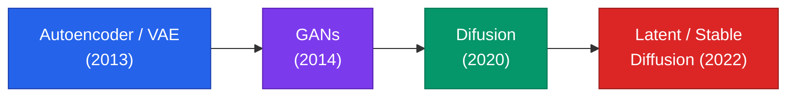
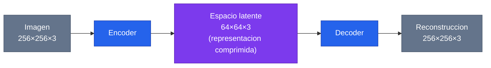
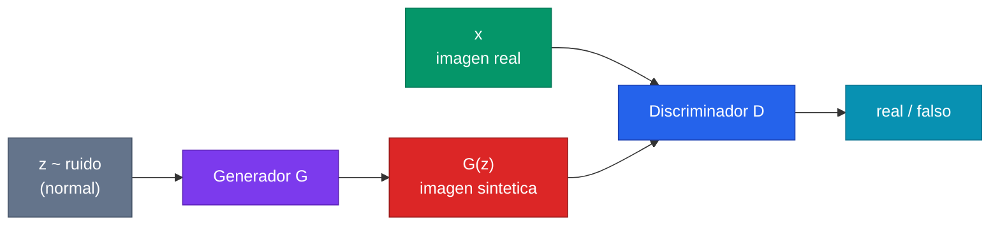
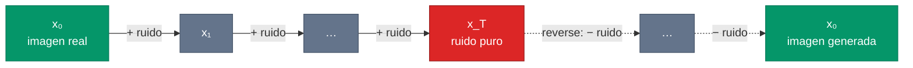
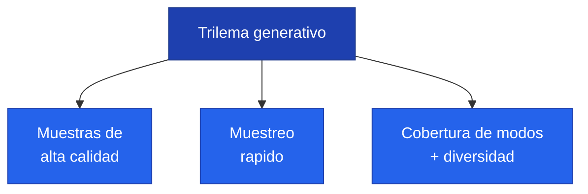
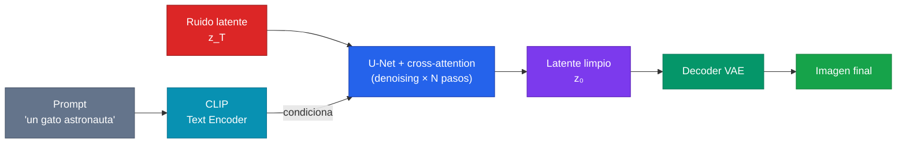

> **Recorrido de las 47 diapositivas** de la clase 29 del Diplomado IA UC (Francisca Cattan, "Modelos Generativos en Visión por Computador"). La clase responde una pregunta distinta a la del reconocimiento clasico: en lugar de *¿a que clase pertenece esta imagen?*, pregunta *¿como genero una imagen nueva que parezca real?* La respuesta atraviesa cuatro familias — **Autoencoders/VAE, GANs, modelos de difusion y Latent/Stable Diffusion** — comparadas por el *trilema generativo* y evaluadas con FID, hasta cerrar con sus usos en la industria y sus limites.

---

## 1. ¿Que hacen los modelos generativos?

### 1.1 Motivacion: aprender la distribucion de los datos

Un modelo generativo persigue un objetivo distinto al de un clasificador. En vez de poner una etiqueta, aprende a **representar la distribucion de probabilidad de los datos** y, una vez que la conoce, puede crear instancias nuevas que pertenecen a ella. La clase lo resume en tres capacidades:

- **Aprenden la distribucion de probabilidad** de los datos de entrenamiento.
- A partir de eso, pueden **muestrear (generar) nuevas instancias realistas** que nunca estuvieron en el dataset.
- Pueden **reconstruir, transformar o interpolar** datos existentes.

La imagen-gancho de la clase es un oleo generado por DALL·E 3 a partir del prompt *"An expressive oil painting of a basketball player dunking, depicted as an explosion of a nebula"*: una escena que jamas existio, pero que es plausible dentro de la distribucion de "oleos expresivos".

Estos modelos no son exclusivos de la vision. La clase enumera su alcance:

- **Generacion de imagenes:** rostros, paisajes, escenas, criaturas imaginarias, situaciones.
- **Creacion de texto:** ChatGPT es el ejemplo emblematico, basado en Transformers.
- **Traduccion automatica** y **conversion de voz**.
- **Generacion de musica**.
- **Modelado de proteinas, quimica y datos cientificos**.

### 1.2 Discriminativo vs generativo

La distincion conceptual que vertebra toda la clase es la diferencia entre los dos grandes tipos de modelo.


Un **modelo de clasificacion (discriminativo)** *reconoce si algo pertenece a una distribucion* — dada una foto, decide "perro". Un **modelo generativo** *aprende a representar la distribucion completa* — y por eso puede producir un perro nuevo que nunca existio. El discriminativo aprende la frontera entre clases; el generativo aprende como se ven los datos por dentro.


Dicho con probabilidades: un clasificador modela $p(y \mid x)$ (la probabilidad de la etiqueta dada la imagen); un modelo generativo modela $p(x)$ — o $p(x \mid y)$ — es decir, **como se distribuyen las imagenes mismas**. Conocer $p(x)$ es mucho mas exigente, pero es lo que habilita el muestreo de instancias nuevas. Profundizamos esta dualidad en [Modelos generativos](/fundamentos/modelos-generativos).

### 1.3 El mapa de la clase

La clase recorre cuatro arquitecturas de modelos generativos para vision, en orden historico y de complejidad creciente:

1. **Autoencoders / Variational Autoencoders (VAE)**
2. **Generative Adversarial Networks (GANs)**
3. **Modelos de difusion**
4. **Latent / Stable Diffusion**

---

## 2. Autoencoders y Variational Autoencoders

### 2.1 El autoencoder: comprimir y reconstruir

Un **autoencoder** es una arquitectura de redes neuronales donde la informacion se **comprime y luego se descomprime**, generando en el medio una representacion intermedia y compacta de los datos: el **espacio latente**.

Tiene dos mitades:

- **Encoder:** toma la entrada (por ejemplo una imagen $256 \times 256 \times 3$) y la comprime a una representacion mucho mas pequeña ($64 \times 64 \times 3$ en el ejemplo de la clase).
- **Decoder:** toma ese codigo latente y **reconstruye** la imagen original ($256 \times 256 \times 3$).

El **espacio latente** es un espacio matematico en el que se representan las **caracteristicas internas o abstractas** de los datos de forma compacta. Se entrena minimizando el error de reconstruccion: el autoencoder aprende a quedarse con la informacion esencial (la que necesita para reconstruir) y descartar lo redundante. Esto lo hace util para compresion, denoising y deteccion de anomalias — pero **no es generativo todavia**: el espacio latente que aprende un autoencoder vanilla puede tener "agujeros", regiones que no corresponden a ninguna imagen real, asi que muestrear un punto al azar no produce algo coherente.

### 2.2 El VAE: volver generativo al autoencoder

El **Variational Autoencoder (VAE)** es una **reformulacion probabilistica** de la arquitectura del autoencoder que permite convertirlo en un modelo generativo.


La diferencia clave: en vez de codificar cada imagen a un **punto** del espacio latente, el VAE la codifica a una **distribucion** (una gaussiana con media $\mu$ y desviacion $\sigma$). Al entrenar, se fuerza a que el espacio latente se parezca a una normal estandar. Asi el espacio queda **continuo y bien poblado**: muestrear un punto cualquiera y pasarlo por el decoder produce una imagen nueva y coherente.


El VAE optimiza el **ELBO** (Evidence Lower Bound), que combina dos terminos: un termino de **reconstruccion** (que la imagen reconstruida se parezca a la original) y un termino de **regularizacion** (una divergencia KL que empuja la distribucion latente hacia una normal $\mathcal{N}(0, I)$):

$$
\mathcal{L}_{\text{VAE}} = \underbrace{\mathbb{E}_{q(z\mid x)}[\log p(x\mid z)]}_{\text{reconstruccion}} - \underbrace{D_{KL}\!\big(q(z\mid x)\,\|\,p(z)\big)}_{\text{regularizacion}}
$$

La idea la introdujo Kingma y Welling en 2013 — ver [VAE (Kingma & Welling, 2013)](/papers/vae-kingma-2013).

### 2.3 Espacio latente continuo: la interpolacion

La gran consecuencia de tener un espacio latente continuo es la **interpolacion**. Si tomo el codigo latente de dos imagenes (digamos, dos rostros) y recorro la linea recta que los une, decodificando puntos intermedios, obtengo una **transicion suave** de un rostro al otro: una cara que gradualmente cambia de edad, de expresion o de identidad. Esto demuestra que el VAE no memoriza imagenes sueltas, sino que aprendio una **variedad (manifold) continua** sobre la cual los conceptos se mueven de forma gradual y semantica.

La continuidad tambien habilita la **aritmetica de atributos**: si la direccion "sonrisa" en el espacio latente es un vector $v_{\text{sonrisa}}$, sumar $\alpha \cdot v_{\text{sonrisa}}$ al codigo de un rostro neutro produce una version sonriente del mismo rostro. Esta estructura semantica del latente es precisamente lo que el autoencoder vanilla no garantiza, y lo que vuelve al VAE un verdadero modelo generativo: no solo reconstruye, sino que organiza el espacio de modo que el muestreo y la edicion sean coherentes.

---

## 3. Generative Adversarial Networks (GANs)

### 3.1 La idea: una competencia entre dos redes

Una **GAN** es una arquitectura de modelo generativo donde se entrenan **en conjunto** dos redes en una **competencia** entre ambas:

- El **generador** $G$: produce imagenes falsas a partir de ruido. Su objetivo es **engañar** al discriminador.
- El **discriminador** $D$: recibe imagenes reales y falsas, y trata de **detectar** cuales son falsas.

La clase lo dramatiza con dos bocadillos: el discriminador dice *"¡Voy a detectar tu falsedad!"* y el generador responde *"¡Te voy a engañar!"*. Es un juego adversarial: cada uno mejora forzando al otro a mejorar. Cuando el equilibrio se alcanza, el generador produce imagenes tan realistas que el discriminador ya no puede distinguirlas de las reales (acierta solo el 50% de las veces, como tirar una moneda).

### 3.2 La funcion de perdida minimax

El entrenamiento se formaliza como un juego **minimax** sobre una sola funcion objetivo. Antes la notacion:

- $z$: **ruido / vector latente**, modelado por una distribucion normal.
- $x$: **datos reales**.
- $G$: el **generador**; $D$: el **discriminador**.
- $G(z)$: los **datos sinteticos** que produce el generador.
- $D(x)$: el discriminador **evaluando datos reales** (idealmente $\to 1$).
- $D(G(z))$: el discriminador **evaluando datos sinteticos** (idealmente $\to 0$ para $D$, $\to 1$ para $G$).

La funcion de perdida es:

$$
\min_{G}\,\max_{D}\;\; \mathbb{E}_{x\sim p_{\text{data}}}\big[\log D(x)\big] \;+\; \mathbb{E}_{z\sim p_z}\big[\log\!\big(1 - D(G(z))\big)\big]
$$


Es un **min-max**: el discriminador $D$ **maximiza** (quiere que $D(x)\to 1$ y $D(G(z))\to 0$), mientras el generador $G$ **minimiza** (quiere que $D(G(z))\to 1$, es decir, engañar). No hay una funcion de perdida que ambos minimicen — compiten por objetivos opuestos. De ese equilibrio inestable nace la dificultad de entrenar GANs (mode collapse, no convergencia).


La idea la propuso Goodfellow et al. en 2014 — ver [GAN (Goodfellow et al., 2014)](/papers/gan-goodfellow-2014). Las GANs dominaron la generacion de imagenes durante casi una decada por su **alta calidad visual**, a costa de un entrenamiento delicado.

---

## 4. Modelos de difusion

### 4.1 La idea: convertir datos en ruido y aprender a invertirlo

Un **modelo de difusion** es un modelo generativo que se construye en dos pasos:

1. Diseñar un procedimiento que **gradualmente convierte datos en ruido** (proceso *forward*): se añade un poco de ruido gaussiano paso a paso, hasta que la imagen original se vuelve ruido puro.
2. Entrenar una red neuronal que **aprenda a invertir ese proceso paso a paso** (proceso *reverse*): partiendo de ruido, quita un poco de ruido en cada paso hasta recuperar una imagen coherente.

La parte de arriba (forward) es **fija**, no se aprende: es matematica conocida (añadir ruido gaussiano). Lo que se aprende es el camino de vuelta. Una vez entrenado, generar una imagen nueva es simplemente: partir de ruido aleatorio y aplicar el proceso reverse hasta el final.

La formulacion canonica la dio Ho et al. en 2020 con los **DDPM** (Denoising Diffusion Probabilistic Models) — ver [DDPM (Ho et al., 2020)](/papers/ddpm-ho-2020) y el fundamento [Modelos de difusion](/fundamentos/modelos-de-difusion).

### 4.2 Aprendiendo el paso inverso: la U-Net

¿Que red aprende el paso inverso? La **U-Net**. En cada paso de denoising, la red recibe la imagen ruidosa actual $x_t$ (y el indice de tiempo $t$) y **predice el ruido** que hay que restar para obtener $x_{t-1}$.


La **U-Net** es ideal para esta tarea porque su arquitectura encoder-decoder con **skip connections** preserva el detalle espacial: el camino de bajada captura el contexto global, el de subida reconstruye la resolucion, y las conexiones laterales recuperan los detalles finos que de otro modo se perderian en la compresion. Originalmente fue diseñada para **segmentacion biomedica** ([U-Net, Ronneberger et al., 2015](/papers/unet-ronneberger-2015)), pero resulto ser el caballo de batalla de los modelos de difusion.


La red se entrena con un objetivo simple: minimizar el error entre el ruido real añadido y el ruido predicho, $\|\epsilon - \epsilon_\theta(x_t, t)\|^2$. Sencillo de entrenar (no hay juego adversarial), estable, pero **lento al generar** porque requiere muchos pasos secuenciales de denoising.

¿Por que la difusion produce imagenes tan superiores a un VAE? Una intuicion: en vez de pedirle a la red que reconstruya toda la imagen de un solo golpe (lo que tiende a promediar detalles y dar resultados borrosos), la difusion **descompone el problema en cientos de pasos pequeños**. Cada paso solo tiene que quitar una pizca de ruido — una tarea facil — y el detalle fino emerge gradualmente a lo largo de la cadena. Es la diferencia entre dibujar un retrato de un trazo versus refinarlo capa sobre capa. El precio de esa fidelidad es el tiempo: donde una GAN genera en un solo *forward pass*, la difusion encadena decenas o cientos de pasadas por la U-Net.

---

## 5. Comparando los modelos

### 5.1 El trilema del aprendizaje generativo

¿Por que existen tantas familias y ninguna "gana"? Porque hay un compromiso fundamental que ninguna logra satisfacer del todo. El paper *Tackling the Generative Learning Trilemma with Denoising Diffusion GANs* lo nombra **trilema del aprendizaje generativo** ([Xiao et al., 2021](/papers/diffusion-gan-xiao-2021)): un modelo generativo idealmente quisiera las **tres** propiedades a la vez, pero tipicamente solo consigue dos.

- **GANs:** alta calidad y muestreo rapido, pero **baja diversidad** (mode collapse — se "olvidan" de partes de la distribucion).
- **VAEs:** muestreo rapido y buena cobertura de la distribucion, pero **calidad mas baja** (imagenes borrosas).
- **Difusion:** alta calidad y buena cobertura, pero **muestreo lento** (muchos pasos).

### 5.2 ¿Como evaluo la calidad? La FID

¿Como medimos objetivamente que tan buenas son las imagenes generadas? La metrica estandar es la **Fréchet Inception Distance (FID)** ([Heusel et al., 2017](/papers/fid-heusel-2017)).

La FID **compara la distribucion de las imagenes generadas con la del dataset original**, usando las representaciones (features) de una **red auxiliar** pre-entrenada — tipicamente Inception, o VGG. No compara pixel a pixel, sino las **estadisticas** (media y covarianza) de los features en ambos conjuntos, midiendo la distancia de Fréchet entre dos gaussianas:

$$
\text{FID} = \|\mu_r - \mu_g\|^2 + \operatorname{Tr}\!\Big(\Sigma_r + \Sigma_g - 2\big(\Sigma_r \Sigma_g\big)^{1/2}\Big)
$$

donde $(\mu_r, \Sigma_r)$ y $(\mu_g, \Sigma_g)$ son la media y covarianza de los features de las imagenes reales y generadas. Detecta overfitting y mide diversidad y realismo a la vez.


**Cuanto menor es la FID, mejor.** Una FID baja indica que las imagenes generadas tienen una distribucion de caracteristicas mas parecida a las reales. **FID = 0** significa distribucion identica (el ideal, practicamente imposible). La clase muestra comparaciones de FID en **ImageNet** y **FFHQ** (rostros), donde los modelos de difusion suelen liderar.


### 5.3 Tabla comparativa

La clase sintetiza las tres familias generativas en tres ejes:

| Familia | Velocidad de generacion | Calidad de imagen | Cobertura de la distribucion |
| --- | --- | --- | --- |
| **VAEs** | Rapida | Baja | Alta |
| **GANs** | Rapida | Alta | Baja |
| **Difusion** | Lenta | Alta | Alta |

Se ve claramente el trilema: cada fila tiene una debilidad. La difusion es la unica con dos "Altas" y una sola debilidad (velocidad), razon por la cual desplazo a las GANs como estado del arte hacia 2021-2022 — siempre que uno pueda pagar el costo de computo del muestreo lento. El reto que resuelve la siguiente seccion es exactamente ese: **conservar la calidad y cobertura de la difusion, pero atacar su lentitud y su costo de computo** moviendo todo el proceso a un espacio comprimido.

---

## 6. Latent Diffusion y Stable Diffusion

### 6.1 Latent Diffusion: difundir en el espacio comprimido

**Latent Diffusion** (abril de 2022) combina las ideas de **autoencoders y difusion** para generar imagenes con **muchos menos recursos**. La observacion clave: aplicar difusion directamente en el espacio de pixeles (alta resolucion) es carisimo, porque cada paso de denoising opera sobre millones de pixeles. La solucion es **aplicar el proceso de difusion en el espacio latente comprimido** de un autoencoder.


El truco de **Latent Diffusion**: un autoencoder comprime la imagen (por ejemplo $512\times512$) a un latente mucho menor (por ejemplo $64\times64$), y **toda la difusion ocurre alli**. Al final, el decoder del autoencoder expande el latente generado a la imagen completa. Como el espacio latente es ~48× mas pequeño, el costo de computo cae drasticamente sin sacrificar la calidad. Ver [Latent Diffusion (Rombach et al., 2022)](/papers/latent-diffusion-rombach-2022).


### 6.2 Stable Diffusion: la arquitectura compuesta

**Stable Diffusion** es la instancia mas famosa de Latent Diffusion: una arquitectura generativa **compuesta** que entrena un modelo de difusion en el espacio latente de un autoencoder que fue pre-entrenado mediante el **esquema competitivo de una GAN**. Es hoy la arquitectura generativa **mas popular y mas usada del mundo**.

Sus tres piezas:

- **VAE** (autoencoder): comprime al latente y reconstruye al final.
- **U-Net con cross-attention**: el modelo de difusion que denoisea en el latente; la **cross-attention** es lo que le permite condicionarse en el texto.
- **Text encoder (CLIP)**: convierte el prompt textual en vectores que guian la generacion ([CLIP, Radford et al., 2021](/papers/clip-radford-2021)).

### 6.3 El flujo de trabajo de Stable Diffusion

La clase detalla el pipeline de generacion texto-a-imagen en cuatro pasos:

1. Un **prompt textual** es codificado como vector por un modelo de lenguaje (el **CLIP Text Encoder**).
2. Se genera un **vector de ruido** en el espacio latente.
3. A traves de **multiples pasos de difusion inversa (denoising)**, el modelo refina ese ruido hacia una representacion latente coherente, **condicionada por el texto** (via cross-attention).
4. Finalmente, el **decoder del VAE** convierte el resultado latente en una imagen.

Stable Diffusion es la sintesis de toda la clase: usa el **VAE** (seccion 2) para comprimir, hereda el **pre-entrenamiento adversarial GAN** (seccion 3) en su autoencoder, corre **difusion** (seccion 4) en el latente, y resuelve el costo del trilema (seccion 5) operando en baja dimension.

---

## 7. Usos en la industria

### 7.1 Data augmentation: el caso de uso estrella

El caso que la clase destaca: *quiero entrenar un clasificador, pero tengo pocos datos, o son de mala calidad*. La solucion es **data augmentation generativa**: un modelo generativo pre-entrenado puede ser **fine-tuneado para generar datos sinteticos de alta calidad**, permitiendo asi entrenar un modelo competente aunque el dataset real sea pequeño.

El ejemplo concreto es **DatasetGAN** ([Zhang et al., 2021](/papers/datasetgan-zhang-2021)): una *"fabrica de datos etiquetados con minimo esfuerzo humano"*, que genera imagenes sinteticas **junto con sus etiquetas de segmentacion** a partir de poquisimas anotaciones manuales.

### 7.2 Usos por familia

Cada familia generativa tiene un nicho donde brilla:

- **Autoencoders y VAEs:** deteccion de **anomalias** en imagenes (detectar defectos en piezas industriales comparando la reconstruccion con la entrada — si el error es alto, hay anomalia); **compresion** de imagenes; **filtro de ruido** (denoising) en imagenes medicas o de camaras; sistemas de recomendacion de contenido visual; **generacion controlable** (variantes de rostros segun atributos: edad, sonrisa, etc.).
- **GANs:** generacion de **arte y contenido visual** (personajes, escenarios, diseños); en videojuegos y cine, texturas y animaciones de rostros; en fotografia, **foto enhancement** (de blanco y negro a color, restaurar fotos antiguas); **imagenes sinteticas medicas** (resonancias, rayos X) para aumentar datos respetando privacidad; sintesis de rostros o voces para asistentes virtuales.
- **Modelos de difusion:** en fotografia y cine, **restauracion** de filmaciones antiguas (remasterizacion) y **face swap** controlado en video; en medicina, sintesis de **datos medicos raros** (por ejemplo, imagenes de tumores poco comunes); editores graficos (GIMP, Photoshop) integrando **plugins de Stable Diffusion** para generar y editar imagenes por texto.


Para quien trabaja en salud, el hilo conductor es claro: los modelos generativos atacan la **escasez de datos** (sintetizar casos de patologias raras), la **privacidad** (imagenes sinteticas que no corresponden a pacientes reales) y el **denoising** de adquisiciones de baja calidad. Son herramientas naturales en imagen medica, donde reunir datos anotados es lento, caro y sensible.


### 7.3 Resumen historico

La clase ordena la evolucion como una escalera:

1. Los **Autoencoders** introdujeron la idea de compresion y reconstruccion. Los **VAEs** añadieron un marco probabilistico para generacion controlada.
2. Las **GANs** llevaron la calidad visual a otro nivel mediante aprendizaje adversarial.
3. Los **modelos de difusion** retomaron principios probabilisticos para lograr aun mejor fidelidad (a costo de computo). Finalmente, los **LDMs (Latent Diffusion Models)** optimizaron la difusion haciendola viable para aplicaciones cotidianas.

Tres ideas para recordar:

- Los modelos generativos **aprenden a representar distribuciones**.
- Es un area de **constante estudio sin una arquitectura "ganadora"**: cada una tiene sus pro y contras (el trilema).
- Es **util cuando tengo pocos datos**: permite aumentar el dataset con datos sinteticos de alta calidad.

### 7.4 Problemas y limites

La clase cierra con tres advertencias honestas:


**Limites de los modelos generativos:**

1. **No sirven para todo tipo de datos** — por ejemplo, datos tabulares, donde otros metodos funcionan mejor.
2. **Requieren muchos recursos** para entrenarse desde cero (mejor usar un modelo ya entrenado por alguna compañia) 💸.
3. **Heredan los sesgos** de los datos de entrenamiento — si el dataset esta sesgado, las imagenes generadas tambien lo estaran.


---

**Ver tambien:** Fundamentos: [Modelos generativos](/fundamentos/modelos-generativos) · [Modelos de difusion](/fundamentos/modelos-de-difusion). Papers: [VAE](/papers/vae-kingma-2013) · [GAN](/papers/gan-goodfellow-2014) · [DDPM](/papers/ddpm-ho-2020) · [U-Net](/papers/unet-ronneberger-2015) · [Diffusion GAN / trilema](/papers/diffusion-gan-xiao-2021) · [FID](/papers/fid-heusel-2017) · [Latent Diffusion](/papers/latent-diffusion-rombach-2022) · [CLIP](/papers/clip-radford-2021) · [DatasetGAN](/papers/datasetgan-zhang-2021).
