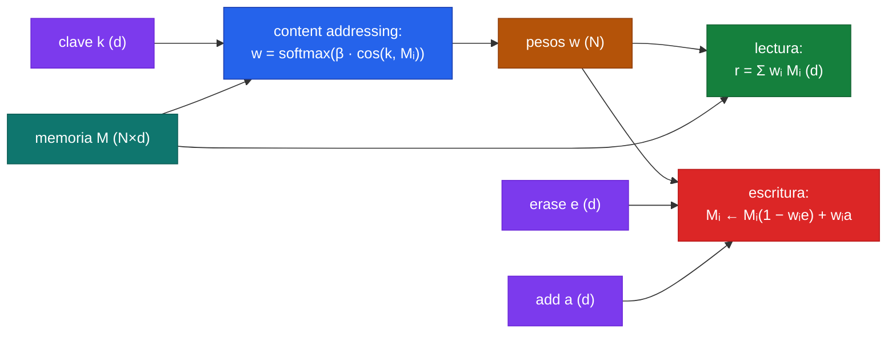

La [teoría de esta clase](/clases/clase-30) parte de una pregunta estructural: en una red tradicional, *¿dónde vive lo que el modelo sabe?* La respuesta — disuelto en millones de pesos — mezcla en un mismo sustrato dos cosas muy distintas: el **procedimiento** (cómo transformar una entrada en una salida) y los **datos** (los hechos concretos que hay que recordar). La Neural Turing Machine (NTM) de Graves, Wayne y Danihelka (2014) propone separarlos: un **controlador** neuronal (el procedimiento) acoplado a una **matriz de memoria** externa $M$ (los datos), a la que el controlador lee y escribe mediante **cabezas** (heads). El truco genial — y la razón por la que vale la pena construirlo desde cero — es que ese acceso a memoria es **completamente diferenciable**: en vez de leer "la celda 7" con un índice discreto, la NTM lee *un poco de todas las celdas a la vez*, ponderadas por un vector de atención. Esa "suavidad" es lo que permite entrenar la máquina entera por descenso de gradiente.

En esta página implementamos el **núcleo** de la NTM — no la máquina completa, sino su corazón: una matriz de memoria $M$ de $N$ slots por $d$ dimensiones, una **cabeza de lectura** con direccionamiento por contenido (content addressing), y una **cabeza de escritura** con la mecánica de borrar-y-agregar (erase + add). Lo haremos tres veces — **PyTorch**, **TensorFlow** y **JAX** — con las mismas dimensiones y la misma semántica, para que el contraste entre frameworks quede nítido. Al final entrenamos un mini-controlador en la tarea **copy**, el "hola mundo" de la NTM: leer una secuencia binaria, guardarla en memoria, y reproducirla. El marco conceptual completo (atención suave como lectura, escritura pensada para one-shot, la conexión con los Transformers) está en el [fundamento de memory-augmented networks](/fundamentos/memory-augmented-networks) y en el de [redes de memoria](/fundamentos/redes-de-memoria); el análisis del paper original está en [NTM (Graves et al., 2014)](/papers/ntm-graves-2014).

---

## 1. Anatomía: la matriz de memoria y las dos cabezas

Toda la NTM gira en torno a un único objeto: una matriz de memoria

$$
M \in \mathbb{R}^{N \times d}, \qquad N = \text{número de slots}, \quad d = \text{ancho de cada slot.}
$$

Pensemos en $M$ como una libreta con $N$ renglones, cada uno un vector de $d$ números. Las cabezas no acceden a un renglón concreto por su número; en cambio, producen un **vector de pesos** $w \in \mathbb{R}^N$ que es una *distribución* sobre los slots:

$$
w_i \geq 0, \qquad \sum_{i=1}^{N} w_i = 1.
$$

Ese $w$ es el corazón de todo. Una **lectura** es el promedio ponderado de los slots según $w$; una **escritura** modifica cada slot en proporción a su peso $w_i$. Cuando $w$ está concentrado en un solo slot ($w \approx$ one-hot) la cabeza se comporta casi como un acceso discreto; cuando $w$ está repartido, la cabeza lee/escribe "de a poco" en varios slots. La clave es que $w$ se obtiene con un **softmax**, no con un `argmax`: es un índice *suave*, y por eso diferenciable.



Convención de dimensiones que respetaremos en los tres frameworks (las verificamos en cada bloque):

| Símbolo | Forma | Qué es |
|---|---|---|
| $M$ | $N \times d$ | matriz de memoria, $N$ slots de ancho $d$ |
| $k$ | $d$ | clave (key) emitida por el controlador para direccionar |
| $\beta$ | escalar $> 0$ | "nitidez" (key strength); amplifica o suaviza el softmax |
| $w$ | $N$ | pesos de atención sobre los slots, suman 1 |
| $r$ | $d$ | vector leído (read), un slot "virtual" |
| $e$ | $d$, en $[0,1]$ | vector de borrado (erase) |
| $a$ | $d$ | vector de adición (add) |

---

## 2. Direccionamiento por contenido: la lectura como atención suave

El **content addressing** responde a la pregunta "¿qué slots se parecen a lo que busco?". El controlador emite una clave $k \in \mathbb{R}^d$; comparamos $k$ contra cada slot $M_i$ por **similitud coseno**, escalamos por la nitidez $\beta$, y normalizamos con softmax:

$$
w_i = \frac{\exp\!\big(\beta \, \cos(k, M_i)\big)}{\sum_{j=1}^{N} \exp\!\big(\beta \, \cos(k, M_j)\big)}, \qquad \cos(k, M_i) = \frac{k \cdot M_i}{\lVert k \rVert \, \lVert M_i \rVert + \varepsilon}.
$$

El rol de $\beta$ es instructivo. Con $\beta \to 0$, todas las similitudes se aplanan y $w$ tiende a la distribución uniforme (la cabeza "no sabe dónde mirar"). Con $\beta \to \infty$, el softmax colapsa sobre el slot más parecido y $w \to$ one-hot (acceso casi discreto). El controlador *aprende* a regular $\beta$ según cuán seguro está de su búsqueda. Es la misma mecánica que la atención escalada de los Transformers: producto punto, escala, softmax — con la diferencia de que aquí "consultamos" una memoria persistente en vez de los tokens de la secuencia (la conexión se detalla en el [fundamento de memory-augmented networks](/fundamentos/memory-augmented-networks#6-la-conexion-profunda-con-la-atencion-de-los-transformers)).

La **lectura** es entonces el slot virtual que resulta de promediar la memoria con esos pesos:

$$
r = \sum_{i=1}^{N} w_i \, M_i \quad \in \mathbb{R}^d \qquad (\text{en forma matricial: } r = w^\top M).
$$


El uso de **softmax en vez de argmax** es lo que vuelve diferenciable a toda la máquina. `argmax` ("dame el slot más parecido") es una función escalonada: su gradiente es cero casi en todas partes, así que no hay señal para entrenar al controlador a producir mejores claves. El softmax es una versión *suave* del argmax: produce una distribución continua que, vía $\beta$, puede acercarse arbitrariamente al one-hot, pero mantiene un gradiente bien definido respecto a $k$, a $\beta$ y a $M$. Ese único reemplazo — discreto $\to$ suave — es el que permite que el direccionamiento se aprenda por backprop.


---

## 3. Escritura: borrar y agregar (erase + add)

La NTM escribe en dos fases inspiradas en las compuertas de un LSTM. Dada una cabeza de escritura con pesos $w$, un vector de **borrado** $e \in [0,1]^d$ y un vector de **adición** $a \in \mathbb{R}^d$, cada slot se actualiza así:

$$
\tilde{M}_i = M_i \odot \big(\mathbf{1} - w_i \, e\big) \qquad \text{(borrado)},
$$
$$
M_i^{\text{new}} = \tilde{M}_i + w_i \, a \qquad \text{(adición)},
$$

donde $\odot$ es el producto elemento a elemento. Leído por componentes: el slot $i$ se borra en proporción a *cuánto lo apunta la cabeza* ($w_i$) y *qué dimensiones pide borrar* ($e$); luego se le suma el contenido nuevo $a$, también escalado por $w_i$. Un slot con $w_i = 0$ queda intacto; un slot con $w_i = 1$ y $e = \mathbf{1}$ se sobrescribe por completo con $a$.

Como $w_i e \in [0,1]^d$, el factor $(\mathbf{1} - w_i e)$ está en $[0,1]^d$: el borrado **atenúa** sin amplificar, igual que la forget gate del LSTM. Y, de nuevo, todo es diferenciable: multiplicaciones y sumas, sin ninguna decisión discreta. El gradiente fluye desde el contenido futuro de la memoria de vuelta hacia $w$, $e$ y $a$ — y de ahí al controlador que los produjo.


El orden **borrar-luego-agregar** importa y es deliberado. Permite que una sola cabeza, en un solo paso, *reemplace* el contenido de un slot (borra todo con $e \approx \mathbf{1}$, luego escribe $a$) o *acumule* sobre lo existente (no borra, $e \approx \mathbf{0}$, solo suma $a$). Es el mismo patrón forget-gate + input-gate del LSTM, pero aplicado a una memoria externa direccionable en vez de a un estado oculto fijo.


---

## 4. PyTorch: el ciclo escribir → leer

Empezamos por PyTorch porque es el más legible. Definimos las cuatro operaciones núcleo — `cosine_similarity`, `content_addressing`, `read`, `write` — y después demostramos el ciclo que justifica todo: **escribir un patrón en memoria y recuperarlo leyendo con la misma clave**.

```python
import torch
import torch.nn.functional as F

# --- Operaciones núcleo de la NTM -------------------------------------------

def content_addressing(k, M, beta, eps=1e-8):
    """Direccionamiento por contenido.
    k:    (d,)    clave que emite el controlador
    M:    (N, d)  matriz de memoria
    beta: () o (1,)  nitidez (key strength), > 0
    ->    (N,)    pesos de atención que suman 1
    """
    # similitud coseno entre k y cada slot M_i  ->  (N,)
    sim = F.cosine_similarity(M, k.unsqueeze(0), dim=1, eps=eps)   # (N,)
    return torch.softmax(beta * sim, dim=0)                         # (N,)

def read(w, M):
    """Lectura: promedio ponderado de los slots.
    w: (N,)   M: (N, d)   ->   r: (d,)
    """
    return w @ M                      # (N,) @ (N,d) = (d,)

def write(M, w, erase, add):
    """Escritura erase+add, vectorizada sobre todos los slots.
    M: (N,d)  w: (N,)  erase: (d,) en [0,1]  add: (d,)
    ->  M_new: (N,d)
    """
    w = w.unsqueeze(1)                # (N,1) para hacer broadcasting por slot
    M_erased = M * (1.0 - w * erase.unsqueeze(0))   # (N,d) * (N,d) -> (N,d)
    M_new    = M_erased + w * add.unsqueeze(0)      # + (N,d)        -> (N,d)
    return M_new
```

Verificación de dimensiones, paso a paso: en `content_addressing`, `M` es `(N,d)` y `k.unsqueeze(0)` es `(1,d)`; el broadcasting de `cosine_similarity` sobre `dim=1` da `(N,)`. En `read`, el producto matriz-vector `(N,) @ (N,d)` contrae el eje de slots y devuelve `(d,)`. En `write`, `w.unsqueeze(1)` es `(N,1)` y `erase.unsqueeze(0)` es `(1,d)`; su producto es `(N,d)` por broadcasting, así que cada slot $i$ se borra con su propio $w_i$. Las formas cuadran.

Ahora el ciclo que lo demuestra todo: guardamos un vector conocido en un slot y verificamos que leerlo con la clave correcta lo recupera.

```python
torch.manual_seed(0)
N, d = 8, 4
M = torch.zeros(N, d)                       # memoria vacía

# Patrón que queremos guardar y la clave con la que lo buscaremos.
patron = torch.tensor([1.0, -1.0, 0.5, 0.2])

# 1) ESCRIBIR: concentramos la escritura en un slot con una clave-de-escritura.
#    Usamos beta alto para que w sea casi one-hot (escritura "nítida").
k_write = torch.tensor([0.9, 0.1, 0.0, 0.0])     # clave arbitraria de destino
w_w = content_addressing(k_write, M, beta=torch.tensor(50.0))
#    Con M=0 la similitud coseno es 0 para todos -> w_w uniforme la 1ª vez.
#    Para el ejemplo forzamos un destino claro escribiendo primero un "ancla":
M = write(M, w_w, erase=torch.ones(d), add=k_write)   # deja k_write en un slot
w_w = content_addressing(k_write, M, beta=torch.tensor(50.0))  # ahora SÍ apunta ahí
M = write(M, w_w, erase=torch.ones(d), add=patron)    # sobre-escribe con el patrón

# 2) LEER: buscamos con la misma clave; debemos recuperar 'patron'.
w_r = content_addressing(k_write, M, beta=torch.tensor(50.0))
r = read(w_r, M)

print("pesos de lectura w_r:", w_r.round(decimals=3))   # casi one-hot
print("patrón guardado:     ", patron)
print("vector recuperado r: ", r.round(decimals=3))     # ≈ patron
print("error L2:", (r - patron).norm().item())          # ~1e-2 o menos
```

La lección del ejemplo: con $\beta$ alto, `w_r` colapsa sobre el slot que escribimos y `read` devuelve (casi) el patrón exacto. El "casi" viene de que el softmax nunca es *exactamente* one-hot — hay una fuga de masa hacia los otros slots — y de que la similitud coseno ignora la magnitud (lee dirección, no escala). Bajando $\beta$ veríamos `w_r` más repartido y el vector recuperado más "borroso", mezcla de varios slots. Esa borrosidad controlable es justamente lo que hace diferenciable al direccionamiento.

### 4.1 Un mini-controlador para la tarea copy (opcional)

La tarea **copy** es el experimento canónico de la NTM: se presenta una secuencia de vectores binarios aleatorios seguida de un delimitador; luego el modelo debe **reproducir la secuencia completa de memoria**, sin volver a verla. Un LSTM puro la resuelve solo para secuencias cortas; la NTM la generaliza a longitudes mucho mayores porque *guarda* la secuencia en $M$ y la *relee* en orden. Aquí mostramos un controlador mínimo (un paso de escritura por símbolo de entrada, un paso de lectura por símbolo de salida) entrenado con **BCE** (los símbolos son bits).

```python
import torch, torch.nn as nn

class MiniNTMCopy(nn.Module):
    """NTM mínima para copy: el controlador es un LSTM que en cada paso emite
    una clave + escalares de control. Solo content addressing (sin shift)."""
    def __init__(self, n_bits=8, N=128, d=20, ctrl_hidden=100):
        super().__init__()
        self.N, self.d, self.n_bits = N, d, n_bits
        self.ctrl = nn.LSTMCell(n_bits + 1, ctrl_hidden)   # +1 = canal delimitador
        # El controlador proyecta su estado a: clave k(d), beta(1),
        # erase(d), add(d) para la cabeza de escritura; y k_r(d), beta_r(1)
        # para la de lectura. La salida final son n_bits logits.
        self.to_write = nn.Linear(ctrl_hidden, d + 1 + d + d)
        self.to_read  = nn.Linear(ctrl_hidden, d + 1)
        self.to_out   = nn.Linear(ctrl_hidden + d, n_bits)  # estado + lectura

    def forward(self, x):                 # x: (T, n_bits+1)  secuencia + delim
        T = x.shape[0]
        M = torch.zeros(self.N, self.d)
        h = torch.zeros(1, self.ctrl.hidden_size)
        c = torch.zeros(1, self.ctrl.hidden_size)
        outs = []
        for t in range(T):
            h, c = self.ctrl(x[t:t+1], (h, c))
            hv = h.squeeze(0)
            # --- cabeza de escritura ---
            wp = self.to_write(hv)
            k_w   = wp[:self.d]
            beta_w= F.softplus(wp[self.d])                 # > 0
            erase = torch.sigmoid(wp[self.d+1 : 2*self.d+1])   # en [0,1]
            add   = wp[2*self.d+1 : 3*self.d+1]
            w_w = content_addressing(k_w, M, beta_w)
            M = write(M, w_w, erase, add)
            # --- cabeza de lectura ---
            rp = self.to_read(hv)
            k_r    = rp[:self.d]
            beta_r = F.softplus(rp[self.d])
            w_r = content_addressing(k_r, M, beta_r)
            r = read(w_r, M)                                # (d,)
            # --- salida (logits sobre n_bits) ---
            outs.append(self.to_out(torch.cat([hv, r])))
        return torch.stack(outs)            # (T, n_bits)

def copy_batch(n_bits=8, seq_len=5):
    """Genera un ejemplo de copy: bits aleatorios + delimitador, y el target."""
    seq = (torch.rand(seq_len, n_bits) > 0.5).float()
    delim = torch.zeros(1, n_bits)
    inp = torch.cat([seq, delim], dim=0)                      # (seq_len+1, n_bits)
    inp = torch.cat([inp, torch.zeros(inp.shape[0], 1)], 1)   # canal delim = 0
    inp[-1, -1] = 1.0                                         # marca el delimitador
    # entrada de la fase de salida = ceros (el modelo recita de memoria)
    blanks = torch.zeros(seq_len, n_bits + 1)
    full_in = torch.cat([inp, blanks], dim=0)
    target  = torch.cat([torch.zeros_like(seq), torch.zeros(1, n_bits), seq])
    return full_in, target, seq_len + 1     # +1 = índice donde empieza la salida

model = MiniNTMCopy()
opt = torch.optim.Adam(model.parameters(), lr=1e-3)
for step in range(2000):
    full_in, target, start = copy_batch(seq_len=torch.randint(2, 8, (1,)).item())
    logits = model(full_in)
    # solo penalizamos la fase de salida (recitar la secuencia)
    loss = F.binary_cross_entropy_with_logits(logits[start:], target[start:])
    opt.zero_grad(); loss.backward()
    nn.utils.clip_grad_norm_(model.parameters(), 10.0)   # NTM necesita clipping
    opt.step()
    if step % 400 == 0:
        print(f"step {step:4d} | BCE {loss.item():.4f}")
```

Este controlador es deliberadamente mínimo — una sola cabeza de lectura y una de escritura, solo content addressing — así que no replica las curvas del paper, pero ilustra el patrón completo: el controlador aprende a *escribir* cada símbolo en un slot durante la fase de entrada y a *leer* los slots en orden durante la fase de salida. El `clip_grad_norm_` no es decorativo: el bucle recurrente sobre $M$ encadena muchas operaciones y los gradientes tienden a explotar, exactamente como en una RNN entrenada con [backpropagation through time](/fundamentos/redes-de-memoria).

---

## 5. TensorFlow: equivalente

El mismo núcleo en TensorFlow. La única diferencia real con PyTorch es que escribimos la similitud coseno a mano (normalizar y producto punto) y usamos `tf.nn.softmax`. La semántica y las dimensiones son idénticas.

```python
import tensorflow as tf

def content_addressing(k, M, beta, eps=1e-8):
    """k:(d,)  M:(N,d)  beta:escalar  -> w:(N,)"""
    k_n = k / (tf.norm(k) + eps)                         # (d,)
    M_n = M / (tf.norm(M, axis=1, keepdims=True) + eps)  # (N,d) normalizado por fila
    sim = tf.linalg.matvec(M_n, k_n)                     # (N,) coseno con cada slot
    return tf.nn.softmax(beta * sim)                     # (N,)

def read(w, M):
    """w:(N,)  M:(N,d)  -> r:(d,)"""
    return tf.linalg.matvec(M, w, transpose_a=True)      # Mᵀ w = Σ wᵢ Mᵢ

def write(M, w, erase, add):
    """M:(N,d)  w:(N,)  erase:(d,)∈[0,1]  add:(d,)  -> (N,d)"""
    w = tf.expand_dims(w, 1)                             # (N,1)
    erase = tf.expand_dims(erase, 0)                     # (1,d)
    add   = tf.expand_dims(add, 0)                       # (1,d)
    M_erased = M * (1.0 - w * erase)                     # (N,d)
    return M_erased + w * add                            # (N,d)

# --- ciclo escribir -> leer (mismo ejemplo que en PyTorch) ---
N, d = 8, 4
M = tf.zeros((N, d))
patron  = tf.constant([1.0, -1.0, 0.5, 0.2])
k_write = tf.constant([0.9, 0.1, 0.0, 0.0])

w_w = content_addressing(k_write, M, beta=50.0)
M = write(M, w_w, erase=tf.ones(d), add=k_write)         # ancla
w_w = content_addressing(k_write, M, beta=50.0)
M = write(M, w_w, erase=tf.ones(d), add=patron)          # escribe el patrón

w_r = content_addressing(k_write, M, beta=50.0)
r = read(w_r, M)
tf.print("recuperado r:", r, "  patron:", patron,
         "  error:", tf.norm(r - patron))
```

Notas frente a PyTorch:

- `tf.linalg.matvec(M, k_n)` calcula $M k$ slot a slot $\to$ `(N,)`; con `transpose_a=True` calcula $M^\top w \to$ `(d,)`, que es exactamente $\sum_i w_i M_i$.
- TF no tiene un `cosine_similarity` tan directo como `F.cosine_similarity`, así que normalizamos `k` y cada fila de `M` por separado antes del producto punto. El resultado numérico es idéntico.
- Para entrenar la tarea copy se envolvería todo en una subclase de `tf.keras.Model` con un `tf.keras.layers.LSTMCell` como controlador, y el bucle temporal dentro de `call`; la mecánica de cabezas es la de arriba, sin cambios.

---

## 6. JAX: funciones puras

En JAX el núcleo es naturalmente elegante porque no hay estado mutable: cada operación es una **función pura** que recibe `(M, ...)` y devuelve nuevos arrays. La memoria $M$ se pasa y se devuelve explícitamente — nunca se muta in place — lo que encaja perfecto con el paradigma funcional y permite `jit`/`vmap`/`grad` sin fricción.

```python
import jax, jax.numpy as jnp
from jax import jit, grad

@jit
def content_addressing(k, M, beta, eps=1e-8):
    """k:(d,)  M:(N,d)  beta:escalar  -> w:(N,)"""
    k_n = k / (jnp.linalg.norm(k) + eps)                          # (d,)
    M_n = M / (jnp.linalg.norm(M, axis=1, keepdims=True) + eps)   # (N,d)
    sim = M_n @ k_n                                               # (N,) coseno
    return jax.nn.softmax(beta * sim)                             # (N,)

@jit
def read(w, M):
    """w:(N,)  M:(N,d)  -> r:(d,)"""
    return w @ M                          # (N,)·(N,d) = (d,) = Σ wᵢ Mᵢ

@jit
def write(M, w, erase, add):
    """M:(N,d)  w:(N,)  erase:(d,)∈[0,1]  add:(d,)  -> (N,d)"""
    w = w[:, None]                        # (N,1)
    M_erased = M * (1.0 - w * erase[None, :])     # (N,d)
    return M_erased + w * add[None, :]            # (N,d)

# --- ciclo escribir -> leer ---
N, d = 8, 4
M = jnp.zeros((N, d))
patron  = jnp.array([1.0, -1.0, 0.5, 0.2])
k_write = jnp.array([0.9, 0.1, 0.0, 0.0])

w_w = content_addressing(k_write, M, 50.0)
M = write(M, w_w, jnp.ones(d), k_write)           # ancla
w_w = content_addressing(k_write, M, 50.0)
M = write(M, w_w, jnp.ones(d), patron)            # escribe el patrón

w_r = content_addressing(k_write, M, 50.0)
r = read(w_r, M)
print("recuperado:", r, " patron:", patron, " error:", jnp.linalg.norm(r - patron))
```

La ventaja funcional se ve al diferenciar. Como `read(write(M, ...), ...)` es una composición de funciones puras, podemos pedirle a `grad` la derivada de cualquier cosa respecto a la clave, el `add` o la propia memoria — sin flags ni grafos explícitos:

```python
def recall_loss(k_query, M, target):
    """Cuán bien recupero 'target' al leer M con la clave k_query."""
    w = content_addressing(k_query, M, 50.0)
    r = read(w, M)
    return jnp.mean((r - target) ** 2)

# gradiente de la pérdida de recuperación respecto a la clave de consulta:
g = grad(recall_loss)(k_write, M, patron)     # (d,) — diferenciable de punta a punta
print("∂loss/∂k_query:", g)
```

Que este gradiente exista y sea no trivial es la demostración mecánica de que **toda la memoria es diferenciable**: hay una señal continua que le dice al controlador cómo ajustar su clave para recuperar mejor. Para la tarea copy se compone un controlador (p.ej. una `LSTMCell` de Flax) con estas funciones dentro de un `jax.lax.scan` sobre el eje temporal, y se entrena con `optax`; el `scan` reemplaza al bucle `for` de PyTorch/TF y deja todo el rollout temporal compilable con `jit`.

---

## 7. Por qué todo es diferenciable, y qué le falta a este núcleo

Recapitulemos la propiedad central y, sobre ella, situemos lo que la NTM completa añade por encima de lo que construimos.

**Diferenciabilidad = softmax en vez de argmax.** Cada operación del núcleo es una composición de sumas, productos y un softmax. No hay índices discretos, no hay decisiones duras. El direccionamiento "duro" — leer exactamente el slot $\arg\max_i \cos(k, M_i)$ — tendría gradiente nulo casi en todas partes y la máquina sería inentrenable por backprop. El softmax con temperatura inversa $\beta$ es la **relajación continua** de ese argmax: barre desde "uniforme" ($\beta \to 0$) hasta "one-hot" ($\beta \to \infty$) de forma suave, dejando que el controlador aprenda *cuán nítido* quiere ser. Esa relajación es exactamente la misma idea que sostiene la atención de los Transformers (donde el `argmax` sobre tokens se reemplaza por un softmax sobre scores).

**Lo que falta: direccionamiento por ubicación (location addressing).** Implementamos *solo* content addressing. La NTM completa añade un segundo mecanismo, el direccionamiento por **ubicación**, que permite moverse por la memoria *relativo a dónde estabas*: un **shift** convolucional desplaza los pesos $w$ a los slots vecinos ($w_{i} \to$ mezcla de $w_{i-1}, w_i, w_{i+1}$). Esto es lo que permite a la NTM iterar secuencialmente — "lee el siguiente slot" — sin depender del contenido, que es justo lo que la tarea copy necesita para recorrer la secuencia almacenada en orden. El pipeline completo del paper encadena: addressing por contenido $\to$ interpolación con los pesos previos (gate) $\to$ shift convolucional $\to$ sharpening. Nuestro núcleo se queda en el primer paso, suficiente para entender lectura/escritura, pero el shift es el ingrediente que convierte la memoria en algo parecido a una **cinta de Turing** recorrible.

**La conexión con el DNC.** El sucesor de la NTM, el [Differentiable Neural Computer (Graves et al., 2016)](/papers/dnc-graves-2016), reemplaza el frágil shift convolucional por mecanismos más robustos: **asignación dinámica de memoria** (un "usage vector" rastrea qué slots están libres para decidir dónde escribir, en vez de depender de la posición) y **enlaces temporales** (una matriz de enlace registra el orden en que se escribieron los slots, permitiendo leer "el siguiente que escribí" sin un shift posicional). El DNC conserva intacto el núcleo que acabamos de construir — content addressing, lectura por promedio ponderado, escritura erase+add — y lo envuelve en una contabilidad de memoria más sofisticada. En otras palabras: lo que implementamos aquí *es* el corazón compartido por toda la familia NTM/DNC; el resto son políticas más inteligentes de *dónde* dirigir las cabezas.

| Mecanismo | Este núcleo | NTM completa | DNC |
|---|---|---|---|
| Direccionamiento por contenido | sí (coseno + softmax) | sí | sí |
| Lectura (promedio ponderado) | sí | sí | sí (varias cabezas) |
| Escritura erase + add | sí | sí | sí |
| Direccionamiento por ubicación (shift) | no | sí (shift convolucional) | reemplazado por enlaces temporales |
| ¿Dónde escribir? | lo decide el contenido | contenido + shift | asignación dinámica (usage vector) |
| Orden de lectura secuencial | — | shift posicional | matriz de enlace temporal |


Entrenar una NTM de verdad es notoriamente delicado: gradientes que explotan (de ahí el `clip_grad_norm_`), sensibilidad a la inicialización de $M$, y la necesidad de currículos de longitud creciente para la tarea copy. El núcleo de esta página es correcto y diferenciable, pero deliberadamente *mínimo*; reproducir las curvas del paper exige el pipeline de addressing completo (shift + sharpening), múltiples cabezas y bastante ingeniería de entrenamiento. El valor pedagógico está en ver *por qué* funciona, no en alcanzar el state of the art.


---

## 8. Comparación lado a lado de los tres frameworks

| Operación | PyTorch | TensorFlow | JAX |
|---|---|---|---|
| Similitud coseno | `F.cosine_similarity(M, k[None], dim=1)` | normalizar + `tf.linalg.matvec(M_n, k_n)` | normalizar + `M_n @ k_n` |
| Softmax del addressing | `torch.softmax(beta*sim, dim=0)` | `tf.nn.softmax(beta*sim)` | `jax.nn.softmax(beta*sim)` |
| Lectura $r = w^\top M$ | `w @ M` | `tf.linalg.matvec(M, w, transpose_a=True)` | `w @ M` |
| Escritura erase+add | broadcasting con `unsqueeze` | broadcasting con `expand_dims` | broadcasting con `[:,None]` |
| Estado de la memoria | tensor mutado/reasignado | tensor reasignado | array puro, devuelto explícitamente |
| Bucle temporal (copy) | `for t in range(T)` | `for` dentro de `call` | `jax.lax.scan` |
| Diferenciar la recuperación | `.backward()` | `tf.GradientTape` | `grad(...)` |
| Compilación | `torch.compile` (opcional) | `@tf.function` | `@jax.jit` |

La lectura: las tres expresan el *mismo* núcleo matemático con APIs casi intercambiables. PyTorch es el más directo para leer (tiene `cosine_similarity` de fábrica). TensorFlow exige escribir la coseno a mano pero compila bien con `@tf.function`. JAX es el más limpio conceptualmente: la memoria como array puro que entra y sale de funciones sin estado hace que la diferenciabilidad de punta a punta sea evidente — `grad` de una composición de `read`/`write` simplemente funciona.

---

## 9. Cómo seguir

1. **Implementa el location addressing**: agrega la interpolación con los pesos previos (gate $g$), el shift convolucional con un kernel de 3 posiciones, y el sharpening con un exponente $\gamma$. Verás cómo la tarea copy empieza a generalizar a longitudes no vistas.
2. **Visualiza la memoria**: durante un rollout de copy, grafica $M$ y los pesos $w$ de lectura/escritura en cada paso. Deberías ver a la cabeza de escritura barriendo los slots durante la entrada y a la de lectura repitiendo el barrido durante la salida.
3. **Sube de NTM a DNC**: implementa el usage vector (asignación dinámica) y la matriz de enlace temporal, y compara la robustez del entrenamiento contra el shift convolucional.
4. **Conecta con la familia Memory Networks**: contrasta el direccionamiento suave de la NTM con el de las End-to-End Memory Networks de la teoría — misma idea de atención sobre slots, pero memoria fija (no escribible) poblada desde el texto de entrada.

---

## 10. Cross-links

- [Teoría - Clase 30](/clases/clase-30): el recorrido completo sobre modelos con memoria externa, desde el problema del conocimiento atrapado en los pesos hasta las Memory Networks.
- [Fundamento: Memory-augmented networks](/fundamentos/memory-augmented-networks): el marco conceptual de la lectura como atención suave, la escritura para one-shot (MANN/LRUA) y la conexión con los Transformers.
- [Fundamento: Redes de memoria](/fundamentos/redes-de-memoria): el panorama de la familia (Memory Networks, End-to-End, Key-Value) y la mecánica de atención sobre slots.
- [Paper NTM (Graves et al., 2014)](/papers/ntm-graves-2014): el paper canónico que implementamos aquí, con el pipeline de addressing completo y la tarea copy.
- [Paper DNC (Graves et al., 2016)](/papers/dnc-graves-2016): el sucesor con asignación dinámica de memoria y enlaces temporales.

---

**Ver también:** [Profundización - Clase 30](/clases/clase-30/profundizacion) · [Teoría - Clase 30](/clases/clase-30/teoria).
