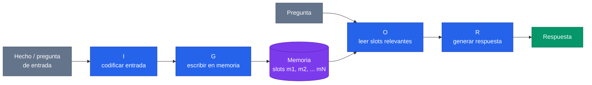
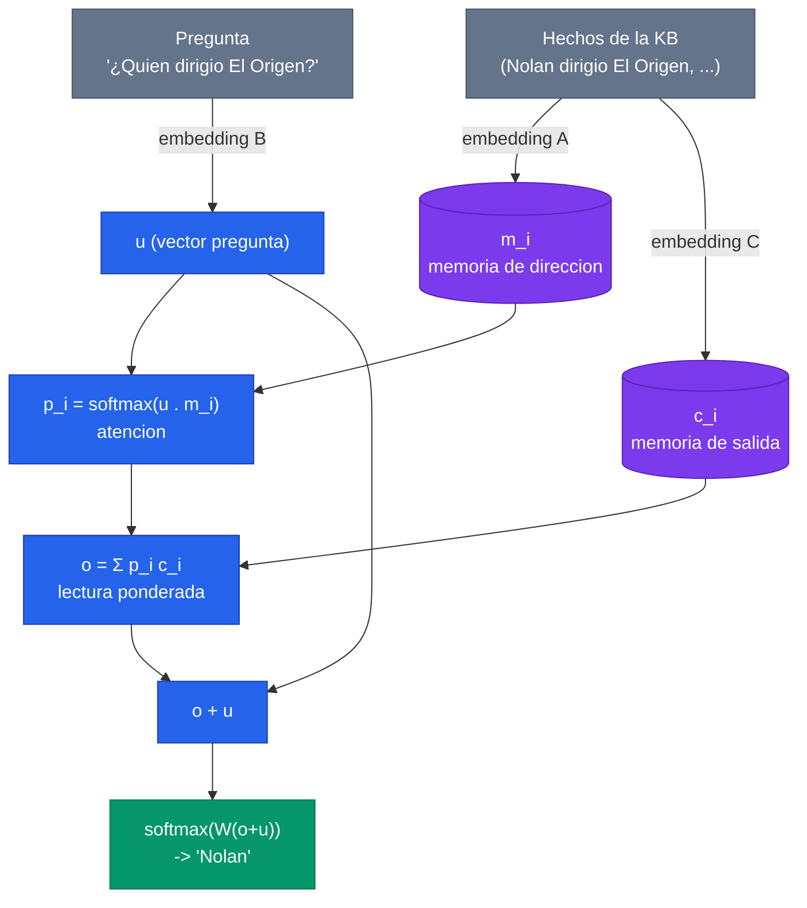
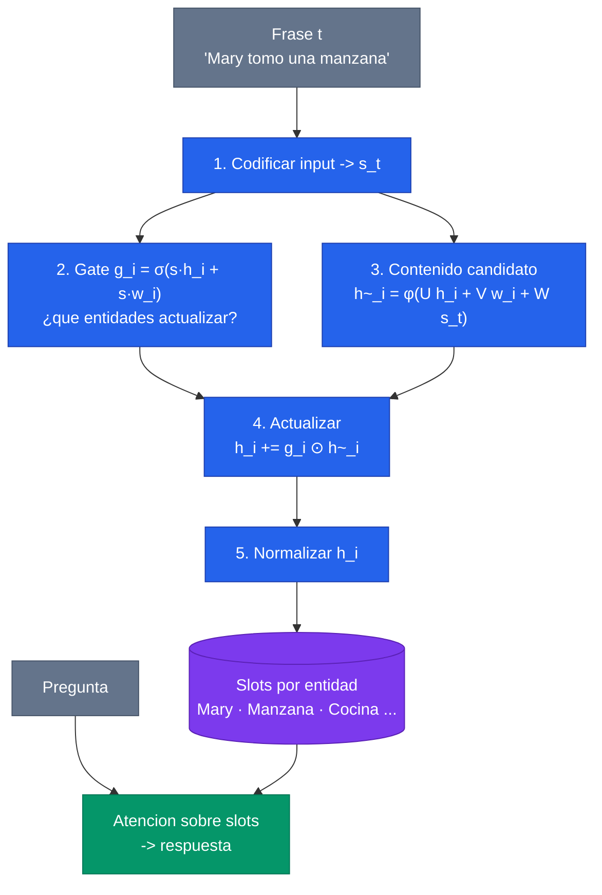

> **Recorrido de las 21 diapositivas** de la clase 30 del Diplomado IA UC (Andres Espinosa, "Topicos de Profundizacion"). La clase parte de una pregunta estructural: en una red neuronal tradicional, *¿donde vive lo que el modelo sabe?* La respuesta — disuelto en los pesos — explica varias de sus limitaciones. A partir de ahi se desarrolla una familia de arquitecturas que separan el **calculo** de la **memoria**, dandole al modelo una memoria **explicita** organizada en slots: las **Memory Networks** y sus descendientes (End-to-End MemNN, Key-Value MemNN, Recurrent Entity Networks), evaluadas sobre los datasets **bAbI** y **WikiMovies**.

---

## 1. El punto de partida: redes tradicionales y su memoria implicita

### 1.1 Toda la memoria esta en los pesos

En una red neuronal clasica — un MLP, una CNN, un LSTM — todo lo que el modelo "sabe" esta codificado **implicitamente en sus pesos**. No hay un lugar donde uno pueda apuntar y decir "aqui guarda que Nolan dirigio El Origen". El conocimiento esta distribuido en millones de parametros, y el aprendizaje consiste en la **optimizacion directa de esos pesos** por descenso de gradiente.

Esto funciona extraordinariamente bien para tareas perceptuales, pero tiene un costo conceptual: el modelo mezcla en un mismo sustrato dos cosas muy distintas — el *procedimiento* (como transformar una entrada en una salida) y los *datos* (los hechos concretos que necesita recordar).

### 1.2 Las limitaciones

De esa fusion se derivan dos problemas que la clase enuncia directamente:

- **Es dificil agregar informacion nueva sin eliminar la anterior.** Si quiero que el modelo aprenda un hecho nuevo, debo re-entrenar (o fine-tunear) ajustando pesos. Ese ajuste no es quirurgico: tocar los pesos para incorporar un dato puede degradar otros que ya estaban bien aprendidos. Es el fenomeno del **olvido catastrofico**.
- **La memoria es dificil de interpretar y poco intuitiva.** No podemos inspeccionar un peso y leer en el un hecho. El conocimiento esta entrelazado, lo que hace casi imposible auditar *que* sabe el modelo o *por que* respondio lo que respondio.


El problema de fondo no es que las redes tradicionales tengan "poca" memoria, sino que su memoria es **implicita**: esta amalgamada con el procedimiento, distribuida en los pesos, y por eso es rigida (cara de editar) y opaca (imposible de inspeccionar).


---

## 2. Memoria explicita: una posible solucion

La propuesta de esta familia de modelos es **sacar la memoria de los pesos** y darle un espacio propio, separado del calculo. Una **memoria explicita** se organiza en **slots** (celdas direccionables), y eso cambia tres cosas:

- **Es mas interpretable:** podemos mirar que se guarda en cada slot. La memoria deja de ser una caja negra distribuida y pasa a ser una estructura legible.
- **Es facil de agregar, quitar y actualizar informacion:** escribir un hecho nuevo es escribir en un slot, no re-optimizar pesos. La edicion es local y no destruye lo demas.

### 2.1 La intuicion: programa vs base de conocimiento

La diapositiva de intuicion (atribuida a una presentacion de Kato Yuzuru) formula la distincion mas util de toda la clase:

| | Memoria **implicita** (pesos) | Memoria **explicita** (slots) |
| --- | --- | --- |
| Que contiene | El **programa / las instrucciones** | Una **base de conocimientos** |
| Su rol | *Como* leer y escribir en la memoria | **Informacion concreta** |
| Analogia | La CPU y su microcodigo | La RAM con los datos |


La analogia es la **arquitectura de von Neumann**: separar el *procesamiento* (la CPU, que sabe *como* operar) de los *datos* (la memoria, que contiene *que* recordar). En estos modelos, los **pesos aprenden el procedimiento** — como direccionar, leer y escribir — mientras que la **memoria explicita guarda los hechos**. El gradiente aprende a usar una memoria; no a memorizar.


Esta separacion es justamente lo que resuelve las dos limitaciones del punto 1: agregar un hecho ya no requiere tocar el "programa", y mirar la memoria nos dice que sabe el modelo.

---

## 3. Estructura de la clase y el dataset bAbI

La clase recorre cuatro arquitecturas (Memory Networks, End-to-End MemNN, Key-Value MemNN, Entity Networks) y dos datasets (bAbI y WikiMovies). Antes de los modelos, conviene fijar el banco de pruebas.

### 3.1 El dataset clasico: bAbI

**bAbI** (Facebook AI Research, [Weston et al. 2015](/papers/babi-weston-2015)) es el benchmark de referencia para razonamiento sobre texto con memoria. Su diseño:

- **20 tareas** distintas, cada una con **1000 ejemplos de entrenamiento y 1000 de prueba**.
- Cada tarea aisla una habilidad de razonamiento: respuesta con un hecho de apoyo, con dos o tres hechos, relaciones de tamaño, conteo, deduccion, induccion, razonamiento espacial/temporal, correferencia, etc.


La gracia de bAbI no es resolver una tarea, sino **entrenar un solo modelo que resuelva las 20**. Eso obliga a que el modelo no memorice un truco por tarea, sino que aprenda un mecanismo general de leer y combinar hechos desde la memoria. Es un test de **razonamiento**, no de patrones superficiales.


Un ejemplo tipico (tarea de un hecho de apoyo):

```text
1 Mary fue a la cocina.
2 John fue al jardin.
3 ¿Donde esta Mary?    cocina   (apoyo: 1)
```

El modelo recibe una **historia** (los hechos), una **pregunta**, y debe producir una **respuesta** apoyandose en los hechos correctos.

---

## 4. Memory Networks: el modelo basico

[Memory Networks](/papers/memory-networks-weston-2014) (Weston, Chopra, Bordes, 2014) introduce la idea fundacional: un modelo con un componente de **memoria de largo plazo** que puede **leerse y escribirse**, y que se usa para predecir.

La arquitectura abstracta se describe con cuatro componentes aprendibles:

- **I (Input):** convierte la entrada (un hecho o una pregunta) en una representacion interna.
- **G (Generalization):** actualiza la memoria con la nueva entrada — tipicamente, escribe el hecho en el siguiente slot libre.
- **O (Output):** dada la pregunta, lee la memoria y selecciona los slots relevantes para producir una representacion de salida.
- **R (Response):** convierte esa salida en la respuesta final (por ejemplo, una palabra).



El limite practico de esta version original: la seleccion de los slots de apoyo se entrena con **supervision fuerte** (hay que decirle al modelo cuales hechos eran los relevantes), lo que la hace dificil de usar cuando esa anotacion no existe. Resolver eso es lo que motiva el siguiente modelo.

---

## 5. End-to-End Memory Networks (Sukhbaatar 2015)

[End-To-End Memory Networks](/papers/e2e-memnn-sukhbaatar-2015) (Sukhbaatar, Szlam, Weston, Fergus, 2015) es el avance clave: hace que **toda** la red — incluyendo la seleccion de que leer de la memoria — sea **diferenciable de extremo a extremo**. Ya no se necesita supervision sobre cuales hechos son relevantes; el modelo lo aprende solo via **atencion suave** (soft attention).

### 5.1 El ejemplo: "¿Quien dirigio El Origen?"

La clase lo ilustra con una base de conocimiento de **tripletas**:

```text
Base de conocimiento:
  - Nolan dirigio El Origen
  - DiCaprio actuo en El Origen
  - Fincher dirigio El Juego

Q: ¿Quien dirigio El Origen?
A: Nolan
```

Cada hecho de la base se guarda en un slot de memoria. La pregunta se codifica en un vector $u$, y el modelo **atiende** sobre los slots para encontrar los relevantes.

### 5.2 El mecanismo: atencion sobre la memoria

Cada hecho $x_i$ se proyecta con **dos** embeddings distintos: uno para *direccionar* (matriz $A$, produce los vectores de memoria $m_i$) y otro para *responder* (matriz $C$, produce los vectores de salida $c_i$). La pregunta se proyecta con una matriz $B$ en un vector $u$.

**Paso 1 — direccionamiento (atencion).** Se mide la afinidad entre la pregunta y cada slot, y se normaliza con softmax para obtener pesos de atencion:

$$
p_i = \operatorname{softmax}\!\big(u^\top m_i\big), \qquad \sum_i p_i = 1
$$

**Paso 2 — lectura.** La salida es la combinacion convexa de los vectores de respuesta, ponderada por la atencion:

$$
o = \sum_i p_i\, c_i
$$

**Paso 3 — respuesta.** Se combina la lectura con la pregunta y se proyecta al vocabulario:

$$
\hat{a} = \operatorname{softmax}\!\big(W (o + u)\big)
$$



### 5.3 Multiples hops: razonamiento en varios pasos

Una sola lectura no basta para preguntas que requieren encadenar hechos ("¿Donde esta la manzana que tomo Mary?"). La solucion son los **hops**: se apilan varias capas de memoria. La salida de un hop se suma a la pregunta y se usa como nueva consulta para el siguiente:

$$
u^{k+1} = o^{k} + u^{k}
$$

Cada hop refina el foco de la atencion sobre la memoria, permitiendo **razonamiento de varios pasos**. Tres hops bastan para la mayoria de las tareas de bAbI.


End-to-End MemNN es el primer modelo donde la **atencion sobre una memoria** se entrena sin supervision intermedia. Esa formula — proyectar una *query*, medir afinidad con *keys*, hacer softmax, y leer una combinacion ponderada de *values* — es exactamente el corazon del mecanismo de atencion que dos años despues definiria a los Transformers. Ver [Self-Attention](/fundamentos/self-attention).


---

## 6. Key-Value Memory Networks (Miller 2016)

[Key-Value Memory Networks](/papers/key-value-memnn-miller-2016) (Miller, Fisch, Dodge, Karimi, Bordes, Weston, 2016) refina la idea con una distincion explicita: cada slot ya no es un solo vector, sino un **par (key, value)**.

- La **key** se usa para **direccionar**: contra ella se calcula la atencion respecto de la pregunta.
- El **value** es lo que se **lee** para construir la respuesta.

$$
p_i = \operatorname{softmax}\!\big(u^\top \, k_i\big), \qquad o = \sum_i p_i\, v_i
$$

Es una generalizacion limpia de End-to-End MemNN: alli las matrices $A$ y $C$ ya cumplian roles de key y value implicitamente; aqui se vuelven un diseño de primera clase. Esto da **libertad para codificar key y value de forma distinta**, adaptandolos a la fuente de conocimiento.

### 6.1 El dataset WikiMovies

El paper introduce **WikiMovies**: preguntas sobre peliculas, como por ejemplo:

```text
What movies are about Ginger Rogers?
The film Dreamcatcher was directed by who?
What does Burt Pugach appear in?
Who was Danika directed by?
What movies did Lorna Heilbron act in?
```

Lo interesante es que la **misma** base de conocimiento (Wikipedia sobre cine) se puede representar en **tres formatos** distintos, lo que permite estudiar como afecta la representacion al desempeño:

- **Triples** (sujeto, relacion, objeto). Ej: *(David Fincher, dirigio, El Juego)* — el formato estructurado clasico de las KB.
- **IE (Information Extraction):** generar triples automaticamente a partir de documentos. Mas ruidoso que una KB curada.
- **Documentos directos:** el texto crudo de Wikipedia, sin estructurar.

### 6.2 El truco de las ventanas

¿Como se convierte un documento de texto plano en pares key-value? Con **ventanas** (windows) de palabras. La clase muestra el ejemplo sobre la frase de El Origen:

| | Key | Value |
| --- | --- | --- |
| Ventana | `__WINDOW__` El Origen Y dirigida por Christopher Nolan y protagonizada por | **Christopher Nolan** |
| Titulo | `__MOVIE__` Y dirigida por Christopher Nolan y protagonizada por | **El Origen** |
| Ventana | `__WINDOW__` El Origen Y protagonizada por Leonardo DiCaprio, Ellen Page, Joseph Gordon-Levitt, Ken Watanabe | **Leonardo DiCaprio** |
| Titulo | `__MOVIE__` Y protagonizada por Leonardo DiCaprio, Ellen Page... | **El Origen** |

La idea: la **key** es la ventana de contexto (las palabras alrededor de la entidad, que sirven para *encontrar* el slot mediante la pregunta), y el **value** es la entidad central (lo que se quiere *recuperar*). Asi, una pregunta "¿Quien dirigio El Origen?" hace match contra la key de la primera ventana y recupera el value "Christopher Nolan".

### 6.3 Resultados

El resultado central del paper: las **Key-Value MemNN reducen la brecha** entre leer documentos crudos y consultar una KB estructurada. Sobre WikiMovies, leer directo de documentos (con la representacion de ventanas) alcanza un desempeño cercano al de usar una KB perfecta — algo muy valioso, porque las KB estructuradas son caras de construir y siempre incompletas, mientras que los documentos abundan.

---

## 7. Recurrent Entity Networks (Henaff 2017)

[Tracking the World State with Recurrent Entity Networks](/papers/entity-networks-henaff-2017) (Henaff, Weston, Szlam, Bordes, LeCun, 2017) cambia el enfoque: en vez de tratar la memoria como una bolsa de hechos, la usa para **rastrear el estado del mundo** (*world state*) a medida que la historia avanza.

### 7.1 Un slot por entidad

La idea central: cada slot de memoria se dedica a **una entidad** del relato (una persona, un objeto, un lugar). El contenido de ese slot representa el **estado actual** de esa entidad, y se actualiza dinamicamente conforme se leen nuevas frases.

La clase lo ilustra con el ejemplo de Mary y la manzana:

```text
Frase leida              -> Slot "Mary"            Slot "Manzana"
"Mary fue a la cocina"   -> "Esta en la cocina"     (vacio)
"Mary tomo una manzana"  -> "Esta en la cocina y    "La tiene Mary"
                            tiene una manzana"
```

A medida que llegan frases, los slots de las entidades involucradas se actualizan: tras "Mary tomo una manzana", el slot de Mary registra que tiene la manzana, y el slot de la manzana registra que la tiene Mary. Cuando llega la pregunta "¿Donde esta la manzana?", la respuesta sale de leer el estado acumulado.

### 7.2 La celda de memoria: los pasos

Cada slot es una pequeña **celda recurrente con compuerta** (gated RNN). Para cada frase de entrada, todas las celdas ejecutan estos pasos. La clase los enumera asi:

1. **Codificar el input.** La frase se convierte en un vector $s_t$ (suma ponderada de embeddings de sus palabras).
2. **Gate de cuales entidades actualizar.** Una compuerta $g_i$ decide *cuanto* actualizar cada slot $i$, en funcion de si la frase es relevante para esa entidad (su key $w_i$) o para su contenido actual $h_i$:
   $$
   g_i = \sigma\!\big(s_t^\top h_i + s_t^\top w_i\big)
   $$
3. **Informacion a agregar.** Se calcula el contenido candidato a escribir en el slot:
   $$
   \tilde{h}_i = \phi\!\big(U h_i + V w_i + W s_t\big)
   $$
4. **Actualizar informacion.** El slot se actualiza solo en la medida que la compuerta lo permite:
   $$
   h_i \leftarrow h_i + g_i \odot \tilde{h}_i
   $$
5. **Normalizar.** Se renormaliza $h_i \leftarrow h_i / \lVert h_i \rVert$ para evitar que la magnitud crezca sin control y para que el slot "olvide" suavemente informacion vieja al llegar nueva.



Al final de la historia, la pregunta se resuelve con un mecanismo de **atencion sobre el contenido de las memorias** (igual que en End-to-End MemNN): se atiende sobre los slots de entidades y se lee el estado relevante. EntNet fue el primer modelo en resolver **todas** las 20 tareas de bAbI en el regimen de 10k ejemplos.


El cambio conceptual de EntNet: la memoria no almacena *hechos del pasado*, sino el *estado presente* del mundo, actualizado incrementalmente. Es una memoria de trabajo dinamica, no un archivo. Mas detalle del mecanismo de escritura con compuertas en [Memory-Augmented Networks](/fundamentos/memory-augmented-networks).


---

## 8. Recapitulacion

### 8.1 Las ventajas de la memoria explicita

La clase cierra recogiendo el hilo del inicio. Las redes con memoria explicita ofrecen ventajas que las tradicionales generalmente no tienen:

- **Mayor interpretabilidad:** podemos inspeccionar que se guarda en cada slot y, via la atencion, *que* hechos uso el modelo para responder.
- **Edicion despues de entrenar:** es mas facil agregar, quitar y actualizar informacion **incluso despues** del entrenamiento, sin re-optimizar pesos ni arriesgar olvido catastrofico.


No hay un modelo "mejor" en abstracto: **el modelo a utilizar depende del caso de uso**. Si la base de conocimiento son tripletas curadas, Key-Value MemNN encaja; si hay que leer documentos crudos, las ventanas ayudan; si lo que importa es seguir el estado de entidades en un relato, Entity Networks es lo natural.


### 8.2 Las dos estirpes y la conexion con los Transformers

| Modelo | Memoria | Lectura | Escritura | Dataset |
| --- | --- | --- | --- | --- |
| Memory Networks | slots de hechos | seleccion (supervisada) | hecho -> slot libre | bAbI |
| End-to-End MemNN | slots de hechos | atencion + hops | hecho -> slot libre | bAbI |
| Key-Value MemNN | pares (key, value) | atencion sobre keys | key/value segun fuente | WikiMovies |
| Recurrent Entity Net | slot por entidad | atencion sobre slots | gated update incremental | bAbI |

Estos modelos forman **una de las dos grandes estirpes** de redes con memoria externa: la que organiza la memoria como una **base de conocimiento direccionable por contenido**. La lectura por atencion que comparten todos — *query, keys, values, softmax* — es directamente el ancestro del mecanismo de [self-attention](/fundamentos/self-attention) de los Transformers, donde cada token atiende sobre todos los demas como si fueran slots de una memoria.

La **otra estirpe** parte de las **Neural Turing Machines** ([Graves et al. 2014](/papers/ntm-graves-2014)) y su sucesora, la Differentiable Neural Computer, que se inspiran en la computadora de von Neumann de forma mas literal: una memoria con direccionamiento por contenido **y** por ubicacion, cabezales de lectura/escritura, y la capacidad de aprender algoritmos (copiar, ordenar, recorrer grafos). Ambas estirpes comparten la misma conviccion de fondo, la que abre la clase: **separar el calculo de la memoria** para ganar interpretabilidad y flexibilidad.

---

**Ver tambien:** Papers: [bAbI (Weston 2015)](/papers/babi-weston-2015) · [Memory Networks (Weston 2014)](/papers/memory-networks-weston-2014) · [End-to-End MemNN (Sukhbaatar 2015)](/papers/e2e-memnn-sukhbaatar-2015) · [Key-Value MemNN (Miller 2016)](/papers/key-value-memnn-miller-2016) · [Recurrent Entity Networks (Henaff 2017)](/papers/entity-networks-henaff-2017) · [Neural Turing Machines (Graves 2014)](/papers/ntm-graves-2014) · Fundamentos: [Memory-Augmented Networks](/fundamentos/memory-augmented-networks) · [Self-Attention](/fundamentos/self-attention).
