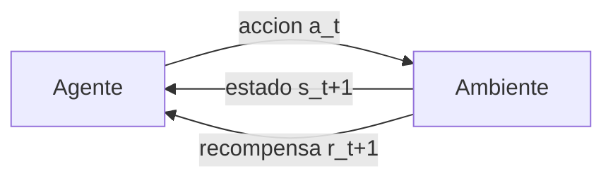
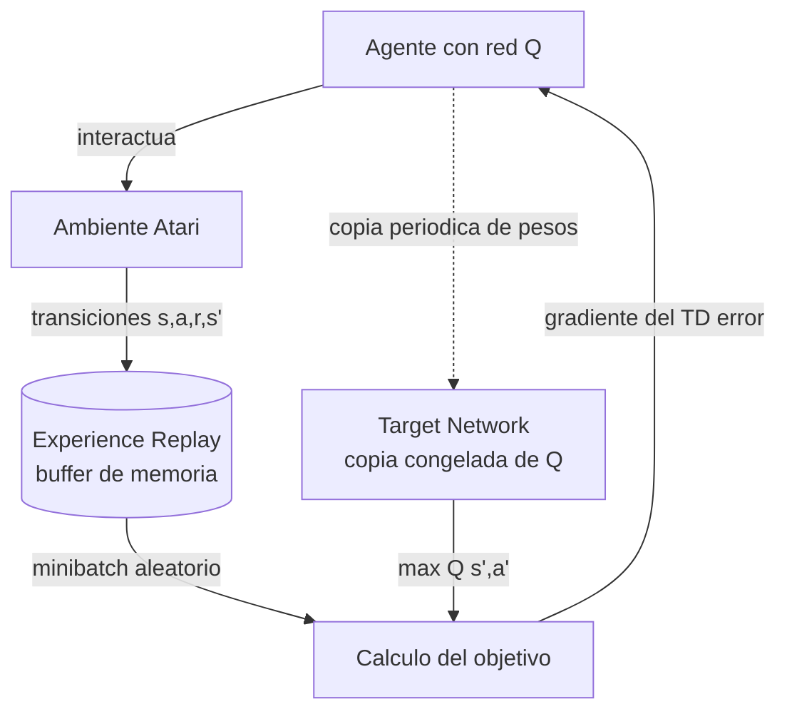

> **Recorrido de la clase 31** del Diplomado IA UC (Carlos Aspillaga, con creditos a Cristobal Eyzaguirre, Alvaro Soto y Rodrigo Toro). Despues de un curso centrado en el aprendizaje supervisado — modelos que aprenden de datos etiquetados estaticos — esta clase introduce un paradigma distinto: el **aprendizaje reforzado** (RL), donde un agente aprende **por ensayo y error**, interactuando con un ambiente y guiandose por recompensas. La clase recorre cuatro etapas: que es RL y por que importa, el paradigma formal ambiente-agente, el algoritmo Q-Learning y su version profunda (DQN), y un trabajo practico. Es la puerta de entrada a la familia de algoritmos detras de AlphaGo, los robots que caminan y el RLHF que afina los modelos de lenguaje.

---

## 1. Introduccion: aprender por ensayo y error

### 1.1 Que es el aprendizaje reforzado


**El aprendizaje reforzado es la rama de la inteligencia artificial que estudia como crear agentes que aprenden a resolver problemas mediante ensayo y error.**


La definicion es engañosamente simple, pero marca una ruptura con todo lo visto hasta ahora en el curso. En el aprendizaje supervisado le mostramos al modelo pares entrada-salida correctos: "esta imagen es un gato", "esta frase resume aquel parrafo". El modelo aprende a imitar esas respuestas. En RL **nadie le dice al agente cual es la accion correcta**. El agente actua, observa que pasa, y recibe una señal numerica de **recompensa** que le indica si lo hizo bien o mal. Aprende, igual que un animal o un niño, probando.

El ejemplo ilustrativo clasico de la clase es un agente que debe alcanzar una galleta en una grilla. El agente no sabe a priori que la galleta es buena; prueba moverse, y cuando finalmente la alcanza recibe **+1 de recompensa**. Esa señal escasa y diferida es todo lo que tiene para aprender que secuencia de movimientos lo lleva al objetivo.

### 1.2 La vida como una sucesion de problemas de decision

La clase enmarca RL con una observacion potente: **la vida esta llena de problemas de decision, y el exito o fracaso de lo que emprendemos depende de la calidad de nuestras decisiones**. Algunos ejemplos planteados:

- ¿Como ruteo los camiones de la empresa?
- ¿Como distribuyo tareas en mi equipo de trabajo?
- ¿Como asigno pacientes a doctores?
- ¿Como invierto mi dinero?
- ¿Como combino ingredientes de origen vegetal para recrear alimentos de origen animal?

Lo que une a estos problemas es que **no se resuelven con una sola decision aislada**, sino con una **secuencia** de decisiones donde cada una afecta las opciones futuras. El aprendizaje reforzado permite resolver problemas de decision de manera **autonoma**, sin que un humano programe explicitamente la estrategia.

### 1.3 Un ejemplo real: edge computing

La clase cita un caso concreto de investigacion (Sanabria et al., 2022, sobre *task scheduling* en *dew computing*): un agente de RL aprendio a **repartir tareas de computo entre dispositivos mejor que los algoritmos diseñados a mano por humanos**, permitiendo ahorrar recursos valiosos. Es la promesa central del paradigma: el agente no copia una solucion conocida, sino que **descubre estrategias nuevas** que pueden superar la intuicion humana — lo mismo que AlphaGo haria celebremente con la jugada 37 contra Lee Sedol.


RL aplica cuando el problema es **secuencial** (una decision tras otra), la señal de exito es una **recompensa numerica** (no una etiqueta), y queremos que el agente **descubra** la estrategia interactuando, no que la imite de ejemplos.


El objetivo principal de la clase es entender los fundamentos teoricos y practicos de RL; los secundarios, saber **identificar cuando un problema puede resolverse con RL** y poder **aplicarlo a un problema nuevo**. Para profundizar en el marco conceptual, ver [Aprendizaje reforzado](/fundamentos/aprendizaje-reforzado).

---

## 2. El paradigma del aprendizaje reforzado

### 2.1 El bucle ambiente-agente

Todo RL gira en torno a un bucle de interaccion entre dos entidades: el **agente** (quien decide y actua) y el **ambiente** (el mundo donde el agente vive). El ciclo se repite paso a paso:

En cada instante de tiempo $t$:

1. El agente observa el **estado** actual $s_t$ del ambiente.
2. El agente elige una **accion** $a_t$.
3. El ambiente responde transicionando a un nuevo estado $s_{t+1}$ y entregando una **recompensa** $r_{t+1}$.
4. El agente usa esa experiencia para mejorar su forma de decidir, y el ciclo se repite.


Los tres elementos que definen cualquier problema de RL son el **estado** (la situacion que el agente observa), la **accion** (lo que el agente puede hacer) y la **recompensa** (la señal escalar que mide cuan buena fue la transicion). El objetivo del agente es **maximizar la recompensa total** que recibe a lo largo del tiempo.


### 2.2 La politica: el comportamiento del agente

El comportamiento del agente se resume en su **politica** $\pi$. Una politica $\pi(a \mid s)$ indica simplemente **la probabilidad con la que el agente elige la accion $a$ cuando se encuentra en el estado $s$**. Es el "cerebro" del agente: dado donde estoy, ¿que hago?

Siguiendo el ejemplo de la grilla, en cierto estado el agente elige la accion "abajo" y la recompensa es 0; en otro estado elige "arriba" y la recompensa es 0; y en un estado contiguo a la galleta elige "abajo" y la recompensa es **1**. El agente debe aprender que en *ese* estado conviene bajar. El objetivo del agente es **ajustar su politica** $\pi(a \mid s)$ para seleccionar acciones que le entreguen mas recompensa.

### 2.3 El ambiente: tres funciones a implementar

Para usar RL hay que **modelar el problema como un ambiente**. En la practica, implementar un ambiente significa programar **tres funciones**:

| Funcion | Que hace |
|---|---|
| `reset()` | Reinicia el ambiente al estado inicial y devuelve $s_0$ (comienza un nuevo episodio) |
| `step(a)` | Recibe una accion, avanza un paso y devuelve `(s', r, done)`: nuevo estado, recompensa y si el episodio termino |
| `render()` | Visualiza el estado actual (util para depurar, opcional) |

Esta interfaz es exactamente la que popularizo OpenAI Gym y que hoy es estandar de facto: cualquier problema que se pueda envolver en `reset`/`step` puede ser atacado con los mismos algoritmos de RL.

### 2.4 Que significa que una politica sea "mejor"

Todo agente intenta aprender una politica **optima** $\pi^*$. Para todo problema interesante existiran politicas mejores que otras, asi que el problema de fondo es: **¿como definimos que una politica es mejor que otra?**

La intuicion ingenua — mirar la recompensa de una sola interaccion — falla. La clase lo ilustra con la asignacion de clientes a empleados: si el empleado $e_1$ tuvo peor resultado que $e_2$ en una ocasion, **no** podemos concluir que $e_2$ es mejor — quizas a $e_1$ le toco un cliente dificil. Solo **promediando sobre muchas interacciones** podemos inferir con confianza que conviene asignar el proximo cliente a $e_1$.

La nocion correcta es el **retorno**: la suma de recompensas futuras a partir de un instante. Y como las recompensas lejanas son mas inciertas (y queremos premiar las que llegan pronto), se introduce un **factor de descuento** $\gamma \in [0,1)$:

$$
G_t = r_{t+1} + \gamma\, r_{t+2} + \gamma^2 r_{t+3} + \cdots = \sum_{k=0}^{\infty} \gamma^k\, r_{t+k+1}
$$

Una politica es mejor que otra si produce un **retorno esperado** mayor. El descuento $\gamma$ tiene dos roles: matematicamente garantiza que la suma converja en horizontes infinitos, y conceptualmente codifica cuanto le importa al agente el futuro lejano frente a la recompensa inmediata.

### 2.5 MDP y la ecuacion de Bellman

Formalmente, un problema de RL se modela como un **Proceso de Decision de Markov** (MDP): la tupla $(S, A, P, R, \gamma)$ de estados, acciones, probabilidades de transicion, recompensas y descuento. La **propiedad de Markov** dice que el futuro depende solo del estado presente, no de toda la historia — lo que hace tratable el problema.

La pieza teorica central es la **ecuacion de Bellman**, que expresa el valor de una situacion de forma **recursiva**: el valor de estar aqui = la recompensa inmediata + el valor descontado de donde quedo despues. Esta auto-referencia es lo que permite resolver el problema por iteracion, y es la base directa de Q-Learning.

---

## 3. Q-Learning y Deep Q-Learning

### 3.1 La funcion Q

El objetivo es encontrar la politica optima $\pi^*$ interactuando con el ambiente. Pero, ¿como? La idea de Q-Learning es no aprender la politica directamente, sino aprender **cuanto vale cada accion en cada estado**.


La **funcion de valor-accion** $Q(s, a)$ estima el **retorno esperado** de tomar la accion $a$ en el estado $s$ y luego seguir actuando de forma optima. Si conocemos $Q$, la politica optima es trivial: en cada estado, **elegir la accion con mayor $Q$**.
$$\pi^*(s) = \arg\max_a Q(s, a)$$


La clase usa una variante del problema de la galleta en la que la galleta **no reaparece** al ser comida, para ilustrar que el valor de una accion depende de lo que viene despues, no solo del paso inmediato.

### 3.2 La ecuacion de Bellman para Q

La $Q$ optima satisface la version de Bellman para valores-accion: el valor de $(s,a)$ es la recompensa inmediata mas el mejor valor posible desde el estado siguiente.

$$
Q^*(s, a) = \mathbb{E}\big[\, r + \gamma \max_{a'} Q^*(s', a') \,\big]
$$

### 3.3 La regla de actualizacion

Q-Learning estima $Q$ sin conocer las probabilidades de transicion del ambiente: aprende de la experiencia directa. Cada vez que el agente vive una transicion $(s, a, r, s')$, actualiza su estimacion **acercandola** un poco al objetivo de Bellman:

$$
Q(s, a) \leftarrow Q(s, a) + \alpha\Big[\, \underbrace{r + \gamma \max_{a'} Q(s', a')}_{\text{objetivo (TD target)}} - \underbrace{Q(s, a)}_{\text{estimacion actual}} \,\Big]
$$

donde $\alpha$ es la **tasa de aprendizaje**. El termino entre corchetes es el **error de diferencia temporal** (TD error): la diferencia entre lo que ahora creemos que vale $(s,a)$ y lo que la experiencia acaba de sugerir. La actualizacion lo reduce gradualmente.

En su forma tabular, $Q$ es literalmente una **tabla** con una celda por cada par $(s, a)$. El agente recorre el ambiente, rellena celdas y converge a $Q^*$. Este algoritmo se debe a Watkins, quien probo su convergencia en [Q-Learning (Watkins & Dayan, 1992)](/papers/q-learning-watkins-1992).

### 3.4 Exploracion vs explotacion

Hay una tension fundamental: si el agente siempre elige la accion que **cree** mejor (explotar), nunca descubrira si habia opciones mejores que aun no probo (explorar). La solucion clasica es la estrategia **$\epsilon$-greedy**:

- Con probabilidad $1 - \epsilon$, **explota**: elige $\arg\max_a Q(s,a)$.
- Con probabilidad $\epsilon$, **explora**: elige una accion al azar.

Tipicamente $\epsilon$ empieza alto (mucha exploracion al inicio, cuando no se sabe nada) y se va reduciendo a medida que la $Q$ se vuelve confiable.

### 3.5 El problema de escalar: Deep Q-Learning

La tabla $Q$ funciona en problemas pequeños, pero **colapsa cuando el espacio de estados es enorme**. El caso emblematico es jugar Atari desde pixeles: el estado es una imagen, y el numero de imagenes posibles es astronomico — imposible de tabular.

La solucion de **Deep Q-Learning (DQN)** es **aproximar la funcion $Q$ con una red neuronal**: en vez de una tabla, una red $Q(s, a; \theta)$ que recibe el estado (los pixeles) y predice el valor de cada accion. La red **generaliza** entre estados parecidos, algo que la tabla nunca podia hacer.

Pero entrenar una red asi de forma ingenua es **inestable**: el objetivo de Bellman se calcula con la misma red que se esta actualizando (un blanco movil), y las experiencias consecutivas estan altamente correlacionadas. DQN introduce **dos trucos** que estabilizan el entrenamiento:

- **Experience replay**: en vez de aprender de cada transicion al vuelo, se guardan en un **buffer de memoria** y se entrena con **minibatches aleatorios**. Esto rompe la correlacion temporal entre muestras y reutiliza cada experiencia muchas veces.
- **Target network**: el objetivo de Bellman se calcula con una **copia congelada** de la red ($\theta^-$) que se actualiza solo cada cierto numero de pasos. Asi el blanco deja de moverse en cada gradiente y el entrenamiento converge.

DQN fue presentado primero en [Playing Atari with Deep RL (Mnih et al., 2013)](/papers/dqn-atari-mnih-2013) y consolidado en el celebre articulo de *Nature* [Human-level control (Mnih et al., 2015)](/papers/dqn-nature-mnih-2015), donde un mismo agente alcanzo o supero el nivel humano en decenas de juegos Atari **a partir de los pixeles crudos**, sin conocimiento especifico de cada juego.

### 3.6 Mejoras y panorama

DQN abrio una linea de investigacion fertil. Entre las mejoras directas sobre DQN:

| Mejora | Idea central | Paper |
|---|---|---|
| **Double DQN** | Desacopla la seleccion y la evaluacion de la accion para corregir la sobreestimacion de $Q$ | [van Hasselt et al., 2015](/papers/double-dqn-van-hasselt-2015) |
| **Dueling DQN** | Separa el valor del estado $V(s)$ de la ventaja $A(s,a)$ de cada accion | [Wang et al., 2015](/papers/dueling-dqn-wang-2015) |
| **Prioritized Experience Replay** | Muestrea del buffer las transiciones mas informativas (mayor TD error), no al azar | [Schaul et al., 2015](/papers/per-schaul-2015) |

Mas alla de los metodos **basados en valor** (como DQN), existe toda una familia de metodos **basados en politica**, que optimizan $\pi$ directamente en lugar de pasar por $Q$ — utiles especialmente con acciones continuas. Entre los mas influyentes:

- **A3C** ([Mnih et al., 2016](/papers/a3c-mnih-2016)): metodo actor-critico asincrono que entrena multiples agentes en paralelo.
- **PPO** ([Schulman et al., 2017](/papers/ppo-schulman-2017)): metodo de gradiente de politica robusto y simple de afinar, hoy el caballo de batalla del RL practico — y el algoritmo detras del **RLHF** que alinea los modelos de lenguaje (ver [RLHF](/fundamentos/rlhf)).

Y el hito que llevo RL a la portada de los diarios: **AlphaGo** ([Silver et al., 2016](/papers/alphago-silver-2016)), que combino redes profundas, busqueda en arbol Monte Carlo y RL para vencer al campeon mundial de Go, un juego que se creia decadas fuera del alcance de las maquinas.

---

## 4. Trabajo practico

La clase cierra con un **laboratorio de Deep Q-Learning**: implementar un agente DQN que aprenda a resolver un ambiente de control (tipicamente con la interfaz Gym vista en la seccion 2.3). El laboratorio integra todas las piezas teoricas — la red que aproxima $Q$, el experience replay, la target network y la politica $\epsilon$-greedy — y permite **ver al agente mejorar episodio a episodio**, pasando de moverse al azar a resolver la tarea con soltura.

Es el momento en que el bucle ambiente-agente deja de ser un diagrama y se vuelve codigo que aprende solo, por ensayo y error, exactamente como prometia la definicion con la que abrio la clase.
