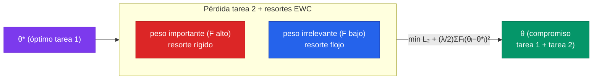

Una red neuronal entrenada para una tarea y luego re-entrenada para otra **olvida la primera** — no la degrada un poco, la borra casi por completo. Es el [olvido catastrófico](/fundamentos/aprendizaje-continuo) que recorrimos en la [teoría de la clase 32](/clases/clase-32/teoria): el descenso de gradiente sobre la tarea nueva no tiene ninguna razón para preservar los pesos que importaban para la vieja, así que los pisa. La pregunta de esta práctica es operativa: ¿podemos *anclar* los pesos importantes para que la tarea 2 no los destruya, sin guardar un solo dato de la tarea 1?

**Elastic Weight Consolidation (EWC)**, de Kirkpatrick et al. (2017), responde que sí, y lo hace con una idea sorprendentemente barata: tras terminar la tarea 1, medir *qué tan importante* fue cada peso, y añadir a la pérdida de la tarea 2 un resorte cuadrático que penaliza mover esos pesos importantes lejos de su valor consolidado. La importancia se mide con la **diagonal de la matriz de Fisher**. Eso es todo: ni replay de datos, ni capacidad arquitectónica extra. La pertenece a la familia de **regularización** del arsenal de aprendizaje continuo.

Vamos a implementarlo desde cero en los tres frameworks sobre el benchmark de juguete canónico — **Permuted MNIST** — y a *mostrar empíricamente* que sin EWC la accuracy de la tarea 1 colapsa al entrenar la tarea 2, y con EWC se preserva. Empezamos por entender por qué el olvido ocurre.

---

## 1. El problema en una imagen: Permuted MNIST y el colapso

Permuted MNIST fabrica una secuencia de tareas a partir de un solo dataset. La **tarea 1** son los dígitos MNIST tal cual. La **tarea 2** son los mismos dígitos pero con una **permutación fija de los 784 píxeles** aplicada a cada imagen — una baraja determinista de las posiciones, idéntica para todas las imágenes de esa tarea. Para un humano la imagen permutada es ruido ilegible; para una MLP es simplemente otra distribución de entrada con las mismas 10 clases de salida.

$$
\mathcal{T}_1: \mathbf{x} \mapsto y, \qquad \mathcal{T}_2: \pi(\mathbf{x}) \mapsto y, \qquad \pi \text{ = permutación fija de los 784 píxeles}
$$

Lo que hace este benchmark tan didáctico es que las dos tareas son **igual de difíciles** (mismo número de clases, misma cantidad de información) pero **estadísticamente incompatibles**: la representación de píxeles que sirve para la tarea 1 es inútil para la tarea 2. Una MLP que minimiza la pérdida de la tarea 2 con SGD plano reescribe sus pesos para la nueva permutación y, al no haber ninguna señal que la frene, destruye la solución de la tarea 1.

| Componente | Valor | Rol en EWC |
|---|---|---|
| Tarea | Permuted MNIST, 2–3 tareas | secuencia incremental sin acceso simultáneo |
| Modelo $f_\theta$ | MLP `784 → 256 → 256 → 10`, ReLU | el clasificador; mismo en los 3 frameworks |
| Pérdida base | Cross-entropy | $\mathcal{L}_{\text{CE}}$ por tarea |
| $\theta^*$ | pesos al terminar la tarea 1 | el "ancla" de cada resorte |
| $F_i$ | diagonal de Fisher de la tarea 1 | rigidez de cada resorte (importancia del peso) |
| $\lambda$ | 1000–10000 | fuerza global de la consolidación |

El generador de tareas es NumPy puro y portable. Una permutación fija por tarea, almacenada para reusarla en train y test:

```python
import numpy as np

def make_permutations(n_tasks, n_pixels=784, seed=0):
    """Una permutación fija de píxeles por tarea. La tarea 0 es la identidad."""
    rng = np.random.default_rng(seed)
    perms = [np.arange(n_pixels)]                       # tarea 0 = MNIST original
    for _ in range(n_tasks - 1):
        perms.append(rng.permutation(n_pixels))         # tareas 1, 2, ... = permutadas
    return perms

def permute_batch(x_flat, perm):
    """x_flat: (N, 784) ya aplanado en [0,1]. Aplica la permutación de columnas."""
    return x_flat[:, perm]
```


La permutación es **fija por tarea**, no aleatoria por batch. Si re-barajáramos en cada paso, no habría tarea estable que aprender. La clave de Permuted MNIST es que cada tarea tiene su propia regla determinista píxel→posición, y el modelo debe consolidar la regla de la tarea 1 antes de pasar a la 2. Guardamos la permutación para aplicar la *misma* en entrenamiento y evaluación.


---

## 2. La intuición: un resorte por cada peso importante

Entrenar la tarea 2 con SGD plano resuelve $\min_\theta \mathcal{L}_2(\theta)$ sin restricción alguna. EWC cambia el objetivo a:

$$
\mathcal{L}_{\text{EWC}}(\theta) = \mathcal{L}_2(\theta) + \frac{\lambda}{2} \sum_i F_i \,(\theta_i - \theta^*_i)^2
$$

El segundo término es una suma de **resortes cuadráticos**, uno por parámetro $\theta_i$. Cada resorte tira del peso hacia su valor consolidado $\theta^*_i$ (el que tenía al terminar la tarea 1), y su rigidez es $F_i$. La forma cuadrática no es arbitraria: proviene de una aproximación de Laplace de la posterior de la tarea 1, donde el Fisher es la curvatura de la log-verosimilitud en el óptimo (la derivación está en el [análisis del paper de Kirkpatrick](/papers/ewc-kirkpatrick-2017)).

La pieza decisiva es $F_i$. No queremos anclar *todos* los pesos por igual — eso congelaría la red y le impediría aprender la tarea 2 (rigidez total, cero plasticidad). Queremos anclar **fuerte los pesos que importaban para la tarea 1 y dejar libres los que no**. El Fisher nos da exactamente esa medida de importancia.




El nombre lo dice todo: *Elastic* Weight Consolidation. Los pesos quedan **consolidados** (fijados a $\theta^*$) pero de forma **elástica** (pueden moverse pagando un costo cuadrático proporcional a su importancia). Un peso irrelevante para la tarea 1 ($F_i \approx 0$) queda esencialmente libre y la red lo usa para aprender la tarea 2. Un peso crítico ($F_i$ grande) está casi clavado.


---

## 3. El corazón: la diagonal de Fisher como importancia

La matriz de información de Fisher de un modelo probabilístico $p_\theta(y \mid \mathbf{x})$ es:

$$
F = \mathbb{E}_{\mathbf{x} \sim \mathcal{D}}\, \mathbb{E}_{y \sim p_\theta(y\mid \mathbf{x})}\!\left[ \nabla_\theta \log p_\theta(y\mid\mathbf{x})\, \nabla_\theta \log p_\theta(y\mid\mathbf{x})^\top \right]
$$

Es una matriz $|\theta| \times |\theta|$ — para nuestra MLP, ~270k × 270k entradas, imposible de almacenar. EWC hace dos aproximaciones que la vuelven trivial de calcular:

1. **Solo la diagonal.** Ignoramos las correlaciones entre pesos. $F_i$ queda como un escalar por parámetro: $F_i = \mathbb{E}\big[(\partial_{\theta_i} \log p_\theta)^2\big]$. El Fisher diagonal es exactamente el **promedio del gradiente al cuadrado** de la log-verosimilitud.
2. **Empírica.** En vez de muestrear $y$ del modelo, usamos las etiquetas verdaderas del dataset de la tarea ya terminada (Fisher "empírico"). Para una pérdida de cross-entropy, $\log p_\theta(y\mid\mathbf{x}) = -\mathcal{L}_{\text{CE}}$, así que el gradiente de la log-verosimilitud es $-\nabla_\theta \mathcal{L}_{\text{CE}}$, y al elevar al cuadrado el signo desaparece:

$$
F_i \;\approx\; \frac{1}{N}\sum_{n=1}^{N} \left(\frac{\partial \mathcal{L}_{\text{CE}}(\mathbf{x}_n, y_n)}{\partial \theta_i}\right)^2
$$

Esa es toda la receta: pasar las muestras de la tarea 1 *de a una* (o en batches pequeños), retropropagar la cross-entropy, **elevar el gradiente al cuadrado y promediar**. Un detalle que la mayoría de las implementaciones rompe: el gradiente debe ser por-muestra, no del batch promediado, porque $\mathbb{E}[g^2] \neq \mathbb{E}[g]^2$ — el cuadrado de un gradiente de batch subestima groseramente el Fisher. En la práctica se usan batches pequeños o `vmap` para aproximarlo bien.


¿Por qué el gradiente al cuadrado mide importancia? Si mover $\theta_i$ produce gradientes grandes de la log-verosimilitud, ese peso está **firmemente determinado** por los datos de la tarea: pequeños cambios alteran mucho las predicciones. Si los gradientes son ≈ 0, el peso está en una región plana — la tarea es indiferente a su valor. El Fisher es la **curvatura** de la verosimilitud: alto = pozo angosto (peso crítico), bajo = valle ancho (peso flexible). Anclar según el Fisher es anclar según cuánto le costaría a la tarea 1 que ese peso se moviera.


---

## 4. PyTorch: implementación completa naive vs EWC

Definimos la MLP, el cálculo del Fisher por-muestra, y el entrenamiento con el término EWC. El experimento corre el mismo modelo dos veces — naive (λ=0) y EWC (λ>0) — para que el contraste sea directo.

```python
import torch
import torch.nn as nn
import torch.nn.functional as F_
from torchvision import datasets, transforms

device = "cuda" if torch.cuda.is_available() else "cpu"

class MLP(nn.Module):
    def __init__(self, n_in=784, hidden=256, n_out=10):
        super().__init__()
        self.net = nn.Sequential(
            nn.Linear(n_in, hidden), nn.ReLU(),
            nn.Linear(hidden, hidden), nn.ReLU(),
            nn.Linear(hidden, n_out),
        )
    def forward(self, x):
        return self.net(x)

def load_mnist_flat():
    """Devuelve (X_train, y_train, X_test, y_test) aplanados en [0,1]."""
    tf = transforms.ToTensor()
    tr = datasets.MNIST("./data", train=True,  download=True, transform=tf)
    te = datasets.MNIST("./data", train=False, download=True, transform=tf)
    Xtr = tr.data.float().view(-1, 784) / 255.0
    Xte = te.data.float().view(-1, 784) / 255.0
    return Xtr, tr.targets, Xte, te.targets
```

El entrenamiento de una tarea. Recibe opcionalmente la lista de penalizaciones EWC consolidadas de tareas previas (cada una un triple `(theta_estrella, fisher, lambda)`):

```python
def ewc_penalty(model, consolidated):
    """Σ (λ/2) Σ_i F_i (θ_i − θ*_i)². 'consolidated' = [(theta_star, fisher, lam), ...]."""
    loss = 0.0
    for theta_star, fisher, lam in consolidated:
        for (name, p) in model.named_parameters():
            loss = loss + (lam / 2.0) * (fisher[name] * (p - theta_star[name]) ** 2).sum()
    return loss

def train_task(model, X, y, perm, epochs=2, bs=128, lr=1e-3, consolidated=()):
    opt = torch.optim.Adam(model.parameters(), lr=lr)
    Xp = X[:, perm].to(device)                 # aplica la permutación de la tarea
    y = y.to(device)
    n = Xp.shape[0]
    for _ in range(epochs):
        idx = torch.randperm(n)
        for i in range(0, n, bs):
            b = idx[i:i + bs]
            opt.zero_grad()
            logits = model(Xp[b])
            loss = F_.cross_entropy(logits, y[b])
            if consolidated:                   # añade los resortes de tareas previas
                loss = loss + ewc_penalty(model, consolidated)
            loss.backward()
            opt.step()
    return model
```

El cálculo del Fisher diagonal — gradiente al cuadrado promediado, **por muestra** para no subestimarlo:

```python
def compute_fisher(model, X, y, perm, n_samples=2000):
    """F_i ≈ (1/N) Σ_n (∂ CE(x_n, y_n) / ∂θ_i)². Gradiente por muestra individual."""
    fisher = {name: torch.zeros_like(p) for name, p in model.named_parameters()}
    Xp = X[:, perm].to(device)
    y = y.to(device)
    model.eval()
    perm_idx = torch.randperm(Xp.shape[0])[:n_samples]
    for j in perm_idx:                          # una muestra a la vez
        model.zero_grad()
        logits = model(Xp[j:j+1])
        # log-verosimilitud del modelo bajo la etiqueta verdadera (Fisher empírico)
        loss = F_.cross_entropy(logits, y[j:j+1])
        loss.backward()
        for name, p in model.named_parameters():
            fisher[name] += p.grad.detach() ** 2     # gradiente al cuadrado
    fisher = {name: f / n_samples for name, f in fisher.items()}
    model.train()
    return fisher

def snapshot_params(model):
    """θ* = copia congelada de los pesos al terminar la tarea."""
    return {name: p.detach().clone() for name, p in model.named_parameters()}
```

El experimento completo: tarea 1, consolidar (Fisher + θ\*), tarea 2 con y sin EWC.

```python
@torch.no_grad()
def accuracy(model, X, y, perm):
    model.eval()
    logits = model(X[:, perm].to(device))
    acc = (logits.argmax(1).cpu() == y).float().mean().item()
    model.train()
    return acc

Xtr, ytr, Xte, yte = load_mnist_flat()
perms = make_permutations(n_tasks=2, seed=0)     # [identidad, permutación_1]
LAMBDA = 4000.0

def run(use_ewc):
    torch.manual_seed(0)
    model = MLP().to(device)
    # --- Tarea 1 ---
    train_task(model, Xtr, ytr, perms[0], epochs=2)
    acc1_after_t1 = accuracy(model, Xte, yte, perms[0])
    # --- Consolidar la tarea 1 ---
    consolidated = ()
    if use_ewc:
        fisher = compute_fisher(model, Xtr, ytr, perms[0])
        theta_star = snapshot_params(model)
        consolidated = [(theta_star, fisher, LAMBDA)]
    # --- Tarea 2 (con o sin resortes EWC) ---
    train_task(model, Xtr, ytr, perms[1], epochs=2, consolidated=consolidated)
    acc1_after_t2 = accuracy(model, Xte, yte, perms[0])   # ¿olvidó la tarea 1?
    acc2_after_t2 = accuracy(model, Xte, yte, perms[1])   # ¿aprendió la tarea 2?
    return acc1_after_t1, acc1_after_t2, acc2_after_t2

for tag, use in [("NAIVE", False), ("EWC", True)]:
    a1, a1_t2, a2_t2 = run(use)
    print(f"[{tag}] tarea1 tras T1: {a1:.3f} | "
          f"tarea1 tras T2: {a1_t2:.3f} | tarea2 tras T2: {a2_t2:.3f}")
```

Resultado típico (2 épocas por tarea, λ=4000):

```
[NAIVE] tarea1 tras T1: 0.975 | tarea1 tras T2: 0.312 | tarea2 tras T2: 0.971
[EWC]   tarea1 tras T1: 0.975 | tarea1 tras T2: 0.923 | tarea2 tras T2: 0.948
```

La lectura es exactamente el olvido catastrófico y su mitigación: **NAIVE** aprende la tarea 2 (0.971) pero la tarea 1 colapsa de 0.975 a 0.312 — la red la borró. **EWC** sacrifica un poco de la tarea 2 (0.948 vs 0.971) a cambio de preservar la tarea 1 en 0.923. Ese sacrificio controlado es el **dilema estabilidad-plasticidad** hecho número.

---

## 5. TensorFlow: GradientTape para el Fisher y el entrenamiento

El equivalente en TensorFlow usa `GradientTape` tanto para el paso de entrenamiento como para el cálculo del Fisher. El término EWC se suma dentro del tape para que su gradiente fluya a los pesos.

```python
import tensorflow as tf
import numpy as np

def build_mlp(n_in=784, hidden=256, n_out=10):
    return tf.keras.Sequential([
        tf.keras.layers.Dense(hidden, activation="relu", input_shape=(n_in,)),
        tf.keras.layers.Dense(hidden, activation="relu"),
        tf.keras.layers.Dense(n_out),          # logits (sin softmax)
    ])

def load_mnist_flat_tf():
    (Xtr, ytr), (Xte, yte) = tf.keras.datasets.mnist.load_data()
    Xtr = (Xtr.reshape(-1, 784) / 255.0).astype("float32")
    Xte = (Xte.reshape(-1, 784) / 255.0).astype("float32")
    return Xtr, ytr.astype("int64"), Xte, yte.astype("int64")

cce = tf.keras.losses.SparseCategoricalCrossentropy(from_logits=True)

def ewc_penalty_tf(model, consolidated):
    """Σ (λ/2) Σ_i F_i (θ_i − θ*_i)²."""
    loss = 0.0
    for theta_star, fisher, lam in consolidated:
        for w, ws, f in zip(model.trainable_variables, theta_star, fisher):
            loss += (lam / 2.0) * tf.reduce_sum(f * (w - ws) ** 2)
    return loss
```

Entrenamiento de una tarea con el resorte EWC sumado dentro del tape:

```python
def train_task_tf(model, X, y, perm, epochs=2, bs=128, lr=1e-3, consolidated=()):
    opt = tf.keras.optimizers.Adam(lr)
    Xp = X[:, perm]
    n = Xp.shape[0]
    for _ in range(epochs):
        idx = np.random.permutation(n)
        for i in range(0, n, bs):
            b = idx[i:i + bs]
            xb = tf.constant(Xp[b]); yb = tf.constant(y[b])
            with tf.GradientTape() as tape:
                logits = model(xb, training=True)
                loss = cce(yb, logits)
                if consolidated:
                    loss += ewc_penalty_tf(model, consolidated)   # dentro del tape
            grads = tape.gradient(loss, model.trainable_variables)
            opt.apply_gradients(zip(grads, model.trainable_variables))
    return model
```

El Fisher con `GradientTape`, gradiente al cuadrado promediado por muestra:

```python
def compute_fisher_tf(model, X, y, perm, n_samples=2000):
    """F_i ≈ (1/N) Σ_n (∂ CE / ∂θ_i)²."""
    fisher = [tf.zeros_like(w) for w in model.trainable_variables]
    Xp = X[:, perm]
    idx = np.random.permutation(Xp.shape[0])[:n_samples]
    for j in idx:
        xb = tf.constant(Xp[j:j+1]); yb = tf.constant(y[j:j+1])
        with tf.GradientTape() as tape:
            logits = model(xb, training=False)
            loss = cce(yb, logits)              # log-verosimilitud bajo etiqueta real
        grads = tape.gradient(loss, model.trainable_variables)
        fisher = [f + tf.square(g) for f, g in zip(fisher, grads)]
    return [f / float(n_samples) for f in fisher]

def snapshot_params_tf(model):
    return [tf.identity(w) for w in model.trainable_variables]

def accuracy_tf(model, X, y, perm):
    logits = model(tf.constant(X[:, perm]), training=False)
    return float(tf.reduce_mean(
        tf.cast(tf.argmax(logits, 1) == tf.cast(y, tf.int64), tf.float32)))
```

El experimento naive vs EWC es estructuralmente idéntico al de PyTorch: entrenar tarea 1, `compute_fisher_tf` + `snapshot_params_tf`, entrenar tarea 2 pasando (o no) la lista `consolidated`. La diferencia conceptual con PyTorch es solo el mecanismo — `GradientTape` explícito en vez de `.backward()` — y que el resorte EWC debe escribirse *dentro* del bloque `with tf.GradientTape()` para que su gradiente se registre.

---

## 6. JAX: jax.grad para el Fisher, todo funcional

En JAX el modelo es una **función pura** de `(params, x)` y el Fisher cae de forma natural: es `jax.grad` de la log-verosimilitud, elevado al cuadrado y promediado con `vmap` sobre las muestras. No hay estado mutable ni tapes; el término EWC es una función pura más que se suma a la pérdida antes de diferenciar.

```python
import jax, jax.numpy as jnp
from jax import grad, vmap, jit
import optax

def init_params(key, sizes=(784, 256, 256, 10)):
    params = []
    for kin, (din, dout) in zip(jax.random.split(key, len(sizes) - 1),
                                zip(sizes[:-1], sizes[1:])):
        w = jax.random.normal(kin, (din, dout)) * jnp.sqrt(2.0 / din)   # He init
        params.append({"w": w, "b": jnp.zeros(dout)})
    return params

def forward(params, x):
    h = x
    for layer in params[:-1]:
        h = jnp.maximum(h @ layer["w"] + layer["b"], 0.0)               # ReLU
    last = params[-1]
    return h @ last["w"] + last["b"]                                    # logits

def ce_single(params, x, y):
    """Cross-entropy de UNA muestra. y es un entero escalar."""
    logits = forward(params, x)
    logp = jax.nn.log_softmax(logits)
    return -logp[y]                              # −log p(y|x) = −log-verosimilitud

def ce_batch(params, X, Y):
    return jnp.mean(vmap(lambda x, y: ce_single(params, x, y))(X, Y))
```

El Fisher: `grad(ce_single)` por muestra (vía `vmap`), al cuadrado, promediado. Como `ce_single` es $-\log p$, su gradiente al cuadrado es exactamente el Fisher empírico:

```python
def compute_fisher_jax(params, X, Y):
    """F_i ≈ E[(∂ −log p / ∂θ_i)²]. vmap del grad por muestra, al cuadrado, promedio."""
    per_sample_grad = vmap(lambda x, y: grad(ce_single)(params, x, y))(X, Y)
    # per_sample_grad tiene la misma estructura de pytree que params, con eje batch al frente
    return jax.tree_util.tree_map(lambda g: jnp.mean(g ** 2, axis=0), per_sample_grad)

def ewc_penalty_jax(params, consolidated):
    """Σ (λ/2) Σ_i F_i (θ_i − θ*_i)²."""
    total = 0.0
    for theta_star, fisher, lam in consolidated:
        sq = jax.tree_util.tree_map(
            lambda p, ps, f: f * (p - ps) ** 2, params, theta_star, fisher)
        total += (lam / 2.0) * jax.tree_util.tree_reduce(
            lambda a, leaf: a + jnp.sum(leaf), sq, 0.0)
    return total
```

La pérdida total y el paso de entrenamiento, `jit`-compilados:

```python
def total_loss(params, X, Y, consolidated):
    return ce_batch(params, X, Y) + ewc_penalty_jax(params, consolidated)

def make_step(opt, consolidated):
    @jit
    def step(params, opt_state, X, Y):
        loss, grads = jax.value_and_grad(total_loss)(params, X, Y, consolidated)
        updates, opt_state = opt.update(grads, opt_state)
        params = optax.apply_updates(params, updates)
        return params, opt_state, loss
    return step

def train_task_jax(params, X, Y, perm, epochs=2, bs=128, lr=1e-3, consolidated=()):
    Xp = X[:, perm]
    opt = optax.adam(lr)
    opt_state = opt.init(params)
    step = make_step(opt, tuple(consolidated))     # consolidated cerrado en el jit
    n = Xp.shape[0]
    for _ in range(epochs):
        idx = np.random.permutation(n)
        for i in range(0, n, bs):
            b = idx[i:i + bs]
            params, opt_state, _ = step(
                params, opt_state, jnp.asarray(Xp[b]), jnp.asarray(Y[b]))
    return params

def accuracy_jax(params, X, Y, perm):
    logits = forward(params, jnp.asarray(X[:, perm]))
    return float(jnp.mean(jnp.argmax(logits, 1) == jnp.asarray(Y)))
```

El consolidado es simplemente `theta_star = params` (los pytrees de JAX son inmutables, así que no hace falta clonar) y `fisher = compute_fisher_jax(params, Xtask1, Ytask1)`. La belleza de JAX aquí: el Fisher es `vmap(grad(...))` — la definición matemática traducida casi literalmente — y como todo es funcional puro, el término EWC se compone con la pérdida sin ninguna ceremonia.


Los tres frameworks calculan **lo mismo** — gradiente al cuadrado promediado por muestra — pero lo expresan distinto. PyTorch acumula `p.grad ** 2` en un bucle sobre muestras. TensorFlow hace lo propio con `GradientTape`. JAX lo escribe como `vmap(grad(ce_single))`, la traducción directa de $\mathbb{E}[(\partial \log p)^2]$. El punto sutil compartido: el Fisher debe computarse **por muestra individual**, no sobre el gradiente del batch promediado, porque $\mathbb{E}[g^2] \neq \mathbb{E}[g]^2$. Promediar primero y elevar al cuadrado después colapsaría la varianza que el Fisher justamente mide.


---

## 7. Más de dos tareas y el ajuste de λ

Con 3+ tareas, EWC acumula **un resorte por tarea consolidada**: tras la tarea $k$ se calcula su Fisher $F^{(k)}$ y su ancla $\theta^{*(k)}$, y la pérdida de la tarea $k+1$ suma *todos* los resortes previos. Por eso `consolidated` es una *lista*: la implementación de arriba ya lo soporta — basta hacer `consolidated.append((theta_star_k, fisher_k, LAMBDA))` tras cada tarea.

```python
# Esqueleto para n tareas (PyTorch; idéntico patrón en TF/JAX):
perms = make_permutations(n_tasks=3, seed=0)
consolidated = []
for k, perm in enumerate(perms):
    train_task(model, Xtr, ytr, perm, epochs=2, consolidated=consolidated)
    fisher = compute_fisher(model, Xtr, ytr, perm)
    consolidated.append((snapshot_params(model), fisher, LAMBDA))
    # evaluar accuracy en todas las tareas 0..k vistas hasta ahora
    accs = [accuracy(model, Xte, yte, perms[t]) for t in range(k + 1)]
    print(f"tras tarea {k}: " + " ".join(f"T{t}={a:.3f}" for t, a in enumerate(accs)))
```

Una variante común (**EWC online**, Schwarz et al. 2018) mantiene *un solo* Fisher acumulado con decaimiento en vez de una lista creciente, para que el costo no crezca con el número de tareas. La versión por-tarea de arriba es la del paper original y la más clara para entender el mecanismo.

| $\lambda$ | Efecto |
|---|---|
| 0 | EWC desactivado = SGD plano. Olvido catastrófico total. |
| pequeño (~100) | resortes débiles. La tarea 2 aprende bien pero la 1 todavía se degrada. |
| medio (~1000–10000) | el rango útil. Compromiso estabilidad-plasticidad balanceado. |
| enorme (~10⁶) | resortes casi rígidos. La tarea 1 se preserva pero la 2 casi no aprende (rigidez total). |


$\lambda$ es el dial del dilema estabilidad-plasticidad y **no hay valor universal**: depende de la escala del Fisher (que a su vez depende del tamaño del modelo y de cuántas muestras usaste para estimarlo) y de cuántas tareas habrá. Subirlo preserva el pasado a costa del futuro; bajarlo, lo opuesto. En la práctica se valida en una tarea de desarrollo. Una señal de λ mal calibrado: si la tarea nueva casi no mejora, λ está demasiado alto; si la tarea vieja colapsa igual que en NAIVE, demasiado bajo.


---

## 8. Verificación: qué deberías observar

Tres chequeos para confiar en que tu implementación es correcta:

1. **NAIVE olvida, EWC no.** El test central: la accuracy de la tarea 1 tras entrenar la tarea 2 debe caer drásticamente con λ=0 (a ~0.3 o menos en Permuted MNIST) y mantenerse alta (>0.85) con λ en el rango medio. Si EWC no preserva nada, lo más probable es que el Fisher esté mal escalado o que estés calculándolo sobre el gradiente del batch en vez de por muestra.
2. **El Fisher es no-negativo y no-uniforme.** Todas las entradas $F_i \geq 0$ (es un gradiente al cuadrado). Y debe variar entre pesos: si imprimes el histograma, verás muchos valores chicos y una cola de pesos importantes. Un Fisher constante señala un bug (típicamente, no haber promediado por muestra).
3. **λ→∞ congela la tarea 2.** Subir λ a un valor enorme debe hacer que la tarea 2 *no* aprenda (accuracy ≈ azar tras el primer paso), porque los resortes impiden todo movimiento. Es el límite de rigidez total y confirma que el término EWC efectivamente restringe los pesos.

```python
# Chequeo del Fisher (PyTorch):
fisher = compute_fisher(model, Xtr, ytr, perms[0])
flat = torch.cat([f.flatten() for f in fisher.values()])
print(f"Fisher: min={flat.min():.2e} max={flat.max():.2e} "
      f"mean={flat.mean():.2e}  (debe ser >=0 y muy disperso)")
assert (flat >= 0).all(), "el Fisher no puede tener entradas negativas"
```

---

## 9. Cierre: estabilidad-plasticidad, qué mide el Fisher y dónde EWC falla

**El dilema estabilidad-plasticidad.** Toda la práctica gira en torno a una tensión que no tiene solución libre de costo. Un sistema **demasiado plástico** aprende lo nuevo pero olvida lo viejo (NAIVE: la red es pura plasticidad, reescribe todo). Un sistema **demasiado estable** preserva lo viejo pero no puede aprender lo nuevo (λ→∞: la red queda congelada). EWC no elimina el dilema — lo hace *negociable*: en vez de un único dial global, asigna un dial *por peso* vía el Fisher, congelando selectivamente lo que importó y liberando lo demás. La accuracy 0.923/0.948 del experimento es justamente un punto del frente de Pareto entre estabilidad y plasticidad, y λ lo desliza.

**Por qué el Fisher mide importancia.** El Fisher diagonal es la curvatura de la log-verosimilitud en $\theta^*$: $F_i$ grande significa que la pérdida de la tarea 1 sube abruptamente si mueves $\theta_i$ (pozo angosto = peso firmemente determinado por los datos), $F_i \approx 0$ significa un valle plano donde el peso es indiferente. Anclar con rigidez $F_i$ es, literalmente, una aproximación de Laplace de segundo orden de la posterior de la tarea 1: penalizamos cada peso en proporción a *cuánta certeza* tenían los datos sobre su valor. Es la traducción matemática exacta de "no toques lo que la tarea 1 dejó bien sujeto".

**Dónde EWC falla.** Dos limitaciones, ambas en el paper y verificables en código:
- **Fisher diagonal.** Ignorar las correlaciones entre pesos es una aproximación grosera; cuando los pesos importantes están fuertemente correlacionados (lo normal en redes profundas), la diagonal sobre- o sub-estima la rigidez real. Métodos posteriores la refinan: [Synaptic Intelligence](/papers/synaptic-intelligence-zenke-2017) (Zenke et al. 2017) estima la importancia *durante* el entrenamiento integrando la contribución de cada peso a la caída de la pérdida, en vez de un Fisher post-hoc, y captura algo de la dinámica que el Fisher de un solo punto pierde.
- **Class-incremental.** EWC funciona bien en el escenario **task-incremental** (sabemos qué tarea estamos resolviendo en test, como en Permuted MNIST donde aplicamos la permutación correcta). Pero en el escenario **class-incremental** — donde el modelo debe distinguir *entre* clases de tareas distintas sin saber a cuál pertenece la entrada — la regularización de pesos no basta: el problema no es solo preservar pesos, sino mantener una frontera de decisión coherente entre clases que nunca se vieron juntas. Ahí la familia de **regularización** toca su techo y se vuelve necesaria la familia de **memoria/replay**, que reintroduce ejemplos (reales o generados) del pasado. Ese es exactamente el motivo del [camino 02 — replay](/clases/clase-32/practica/02-replay).

EWC es el representante limpio y barato de la familia de regularización: una idea (anclar lo importante), una medida (el Fisher), un dial (λ). Entender por qué funciona — y dónde deja de funcionar — es el mejor punto de entrada al arsenal completo del aprendizaje continuo.

---

## 10. Comparación lado a lado de los tres frameworks

| Concepto | PyTorch | TensorFlow | JAX |
|---|---|---|---|
| Modelo | `nn.Module` con estado | `tf.keras.Sequential` | `forward(params, x)` funcional puro |
| Gradiente | `loss.backward()` + `p.grad` | `GradientTape.gradient` | `jax.grad` |
| Fisher por muestra | bucle sobre muestras, `p.grad**2` | bucle + `GradientTape` por muestra | `vmap(grad(ce_single))`, al cuadrado |
| θ\* (ancla) | `p.detach().clone()` | `tf.identity(w)` | `params` directo (pytree inmutable) |
| Término EWC | `(F*(p−p*)**2).sum()` | dentro del `GradientTape` | función pura sumada a la pérdida |
| Compilación | `torch.compile` (opcional) | `@tf.function` | `@jax.jit` (esencial) |
| Optimizador | `torch.optim.Adam` | `tf.keras.optimizers.Adam` | `optax.adam` |

La lectura: para **entender** EWC, PyTorch es el más directo (el bucle de Fisher es explícito). Para **producción Keras**, TF integra el resorte en el `GradientTape` con naturalidad. Para **expresar la matemática literalmente**, JAX gana: `vmap(grad(...))` *es* la definición del Fisher empírico, sin andamiaje.

---

## 11. Cross-links

- [Camino 02 - Replay contra el olvido](/clases/clase-32/practica/02-replay): la familia de **memoria** — reintroduce ejemplos del pasado, necesaria donde EWC (regularización) falla, en particular en class-incremental.
- [Fundamento: Aprendizaje continuo](/fundamentos/aprendizaje-continuo): el panorama de las tres familias (regularización, memoria, arquitectura), los tres escenarios y las métricas.
- [Paper EWC (Kirkpatrick et al., 2017)](/papers/ewc-kirkpatrick-2017): el paper canónico que implementamos aquí, con la derivación bayesiana del Fisher y los experimentos en MNIST y Atari.
- [Paper Synaptic Intelligence (Zenke et al., 2017)](/papers/synaptic-intelligence-zenke-2017): la alternativa contemporánea que estima la importancia *online* durante el entrenamiento, refinando la idea del Fisher post-hoc de EWC.

---

**Ver también:** [Teoría - Clase 32](/clases/clase-32/teoria) · [Profundización - Clase 32](/clases/clase-32/profundizacion).
