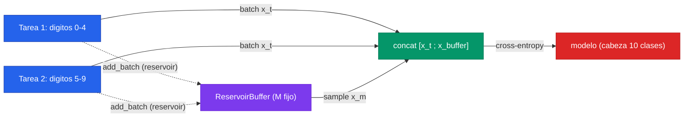

El [fundamento de aprendizaje continuo](/fundamentos/aprendizaje-continuo) deja un veredicto incómodo: en el escenario **class-incremental** —el más realista, donde el modelo en inferencia no sabe a qué tarea pertenece la entrada y debe elegir entre *todas* las clases acumuladas— las técnicas de regularización (EWC, SI) **colapsan al nivel del azar**. En split MNIST con cinco tareas binarias, EWC alcanza 98.6% en Task-IL pero exactamente 20.0% en Class-IL: lo mismo que el fine-tuning ingenuo, lo mismo que tirar una moneda de cinco caras. Y sin embargo el **replay** supera el 90% en ese mismo régimen. Esta página construye desde cero la técnica más simple de la familia de memoria —**Experience Replay**, también llamado *rehearsal*— para ver con las manos por qué funciona donde la regularización falla.

La idea es casi insultantemente sencilla: guardar un pequeño *buffer* de ejemplos de las tareas pasadas y **mezclarlos** en cada mini-batch de la tarea actual. Eso es todo. No hay penalización cuadrática, no hay matriz de Fisher, no hay máscaras por tarea. Reproducir un puñado de dígitos viejos mientras se aprenden los nuevos recrea —de forma aproximada y barata— el régimen *multitask* que elimina el olvido por construcción. Lo que vamos a implementar y medir es: (1) un benchmark de juguete de continual learning, **split MNIST class-incremental**; (2) un `ReplayBuffer` de tamaño fijo poblado por **reservoir sampling**; (3) un *training loop* que concatena cada batch de la tarea actual con una muestra del buffer; y (4) la comparación directa de la *accuracy* final con replay y sin replay (naive). Lo escribimos en los tres frameworks —**PyTorch, TensorFlow y JAX**— porque el patrón de gestión de memoria externa al grafo es revelador en cada uno.

---

## 1. El benchmark de juguete: split MNIST class-incremental

Para estudiar el olvido necesitamos un flujo de tareas, no un dataset estático. El benchmark canónico —el mismo que usan [van de Ven y Tolias (2019)](/papers/three-scenarios-van-de-ven-2019)— es **split MNIST**: se parten los diez dígitos en tareas secuenciales y se entrena una tras otra, *sin volver a ver* los datos de las tareas previas. Usaremos la variante de dos tareas, la más didáctica:

$$
\mathcal{T}_1 = \{0, 1, 2, 3, 4\}, \qquad \mathcal{T}_2 = \{5, 6, 7, 8, 9\}
$$

El modelo entrena primero solo con $\mathcal{T}_1$ (dígitos 0–4) y luego solo con $\mathcal{T}_2$ (dígitos 5–9). La pregunta del olvido catastrófico es: tras aprender $\mathcal{T}_2$, ¿cuánto recuerda de $\mathcal{T}_1$?

Lo que convierte esto en **class-incremental** (Class-IL) y no en algo más fácil es la cabeza de salida y la regla de evaluación. Mantenemos una **única cabeza de 10 clases** (*single-head*) durante todo el experimento, y en test el modelo debe elegir entre los diez dígitos **sin que nadie le diga si la imagen viene de la tarea 1 o de la 2**. Esa es la condición que hace fracasar a la regularización.


La diferencia entre los tres escenarios está **enteramente en la cabeza y la evaluación**, no en los datos. Con una cabeza *multi-head* (una salida por tarea) y diciéndole al modelo en test qué tarea resolver, esto sería **Task-IL** y hasta el fine-tuning ingenuo daría ~99%. Lo que medimos aquí —single-head, 10 logits, sin task-ID— es Class-IL, y por eso es brutal: aprender los dígitos 5–9 empuja a la red a predecir esas clases para *todo*, sepultando los 0–4. Ver los [tres escenarios de van de Ven](/papers/three-scenarios-van-de-ven-2019).


El cargador de datos es idéntico en los tres frameworks; lo dejamos en NumPy puro para que sea portable. Cargamos MNIST una vez y lo partimos por tarea:

```python
import numpy as np

def load_split_mnist():
    """Carga MNIST y lo parte en dos tareas class-incremental.
    Tarea 1 = digitos 0-4, Tarea 2 = digitos 5-9.
    Las imagenes se aplanan a 784 y se normalizan a [0,1].
    """
    # Cualquier loader sirve; usamos keras solo para bajar los bytes crudos.
    from tensorflow.keras.datasets import mnist
    (x_tr, y_tr), (x_te, y_te) = mnist.load_data()
    x_tr = (x_tr.reshape(-1, 784) / 255.0).astype(np.float32)
    x_te = (x_te.reshape(-1, 784) / 255.0).astype(np.float32)
    y_tr = y_tr.astype(np.int64)
    y_te = y_te.astype(np.int64)

    def split(x, y, digits):
        mask = np.isin(y, digits)
        return x[mask], y[mask]

    tasks = [(0, 1, 2, 3, 4), (5, 6, 7, 8, 9)]
    train = [split(x_tr, y_tr, list(d)) for d in tasks]
    test  = [split(x_te, y_te, list(d)) for d in tasks]
    return train, test  # listas de (x, y) por tarea

def iterate_minibatches(x, y, batch_size=128, shuffle=True, seed=0):
    """Generador de mini-batches sobre los datos de UNA tarea."""
    idx = np.arange(len(x))
    if shuffle:
        np.random.RandomState(seed).shuffle(idx)
    for start in range(0, len(idx), batch_size):
        b = idx[start:start + batch_size]
        yield x[b], y[b]
```

Las etiquetas se conservan en su valor global 0–9 (no se re-mapean): la cabeza de 10 clases predice el dígito real, que es lo que exige Class-IL.

---

## 2. El buffer de memoria y el reservoir sampling

El corazón de Experience Replay es el buffer: una colección de **tamaño fijo** $M$ que retiene una muestra representativa de *todo* lo visto. El reto es poblarlo en un único pase sobre el flujo de datos, sin saber de antemano cuántos ejemplos llegarán y manteniendo que **cada ejemplo visto tenga la misma probabilidad de estar en el buffer al final**. La solución clásica es el **reservoir sampling** (algoritmo R de Vitter, 1985).

El algoritmo es elegante. Mantén $M$ ranuras. Para el $n$-ésimo ejemplo del flujo (contando desde 1):

$$
\begin{cases}
\text{si } n \le M: & \text{guárdalo en la ranura } n \\
\text{si } n > M: & \text{con probabilidad } \tfrac{M}{n} \text{ reemplaza una ranura al azar; si no, descártalo}
\end{cases}
$$

La garantía: tras procesar $n$ ejemplos, **cada uno de los $n$ tiene probabilidad exactamente $M/n$ de estar en el buffer**, sin importar el orden de llegada ni necesitar conocer $n$ por adelantado. La prueba por inducción es de una línea, pero la intuición basta: los ejemplos tempranos tienen muchas oportunidades de ser expulsados, los tardíos pocas oportunidades de entrar, y ambos efectos se cancelan exactamente.

```python
class ReservoirBuffer:
    """Buffer de memoria de tamaño fijo M poblado por reservoir sampling.
    Framework-agnostico: guarda numpy arrays. Lo comparten PyTorch, TF y JAX.
    """
    def __init__(self, capacity, x_dim=784, rng_seed=0):
        self.capacity = capacity
        self.x = np.zeros((capacity, x_dim), dtype=np.float32)
        self.y = np.zeros((capacity,), dtype=np.int64)
        self.n_seen = 0          # cuantos ejemplos del flujo hemos visto en total
        self.size = 0            # cuantas ranuras estan ocupadas
        self.rng = np.random.RandomState(rng_seed)

    def add_batch(self, x_batch, y_batch):
        """Ofrece un batch al reservoir. Cada ejemplo se acepta o descarta
        de forma independiente segun la regla de Vitter."""
        for xi, yi in zip(x_batch, y_batch):
            self.n_seen += 1
            if self.size < self.capacity:
                # fase de llenado: las primeras M muestras entran directo
                self.x[self.size] = xi
                self.y[self.size] = yi
                self.size += 1
            else:
                # fase de reemplazo: con prob M/n_seen sustituye una ranura al azar
                j = self.rng.randint(0, self.n_seen)  # 0 .. n_seen-1
                if j < self.capacity:
                    self.x[j] = xi
                    self.y[j] = yi

    def sample(self, batch_size):
        """Muestra (con reemplazo si hace falta) un batch del buffer."""
        if self.size == 0:
            return None, None
        idx = self.rng.randint(0, self.size, size=batch_size)
        return self.x[idx], self.y[idx]
```


El reservoir sampling es lo que mantiene el footprint **acotado**: con $M = 200$ guardamos 200 imágenes pase lo que pase, aunque el flujo traiga un millón. Es la diferencia esencial entre la familia de memoria (footprint que no crece con el número de *ejemplos*) y "reentrenar con todo" (footprint que crece sin límite). El precio de un buffer pequeño es el sobreajuste a esos pocos ejemplos guardados —volveremos a este *trade-off* en el cierre.


---

## 3. El bucle de entrenamiento con replay (la receta)

La estrategia es la misma en los tres frameworks; solo cambia la maquinaria del paso de gradiente. Para cada tarea, y para cada mini-batch $(x_t, y_t)$ de la tarea actual:

1. **Muestrear** un batch $(x_m, y_m)$ del buffer (vacío en la primera tarea).
2. **Concatenar**: $x = [x_t; x_m]$, $y = [y_t; y_m]$.
3. **Un paso de gradiente** sobre el batch combinado (cross-entropy sobre la cabeza de 10 clases).
4. **Ofrecer** el batch actual $(x_t, y_t)$ al reservoir *después* de usarlo para entrenar.

El paso 4 va *después* del paso de gradiente para no contaminar la muestra del paso 1 con datos que el modelo acaba de ver; y solo se ofrece la tarea actual, porque los ejemplos viejos ya están (o ya tuvieron su oportunidad de estar) en el buffer.



El experimento de control —el **naive**, fine-tuning secuencial— es exactamente este bucle con el paso 1 y 2 desactivados: entrena cada tarea solo con sus datos. Es la cota inferior. Lo implementamos como un *flag* `use_replay` para que la comparación sea limpia: mismo modelo, misma inicialización, mismos hiperparámetros, única diferencia el replay.

---

## 4. PyTorch

Una MLP sencilla, cross-entropy, y el buffer en NumPy convertido a tensores en cada paso.

```python
import numpy as np
import torch
import torch.nn as nn
import torch.nn.functional as F

torch.manual_seed(0); np.random.seed(0)
device = "cuda" if torch.cuda.is_available() else "cpu"

class MLP(nn.Module):
    """MLP 784 -> 256 -> 256 -> 10. Cabeza UNICA de 10 clases (class-incremental)."""
    def __init__(self):
        super().__init__()
        self.net = nn.Sequential(
            nn.Linear(784, 256), nn.ReLU(),
            nn.Linear(256, 256), nn.ReLU(),
            nn.Linear(256, 10),          # 10 logits: predice el digito real 0-9
        )
    def forward(self, x):
        return self.net(x)

def evaluate(model, test_tasks):
    """Accuracy por tarea sobre la cabeza completa de 10 clases (Class-IL)."""
    model.eval()
    accs = []
    with torch.no_grad():
        for x, y in test_tasks:
            xt = torch.from_numpy(x).to(device)
            logits = model(xt)                       # argmax sobre las 10 clases
            pred = logits.argmax(dim=1).cpu().numpy()
            accs.append((pred == y).mean())
    return accs

def train_pytorch(use_replay, buffer_capacity=200, replay_bs=128,
                  epochs_per_task=3, lr=1e-3):
    train_tasks, test_tasks = load_split_mnist()
    model = MLP().to(device)
    opt = torch.optim.Adam(model.parameters(), lr=lr)
    buffer = ReservoirBuffer(buffer_capacity) if use_replay else None

    for t, (x_task, y_task) in enumerate(train_tasks):
        for ep in range(epochs_per_task):
            for xb, yb in iterate_minibatches(x_task, y_task, 128, seed=ep):
                xb_t = torch.from_numpy(xb).to(device)
                yb_t = torch.from_numpy(yb).to(device)

                if use_replay and buffer.size > 0:
                    xm, ym = buffer.sample(replay_bs)        # batch del pasado
                    xb_t = torch.cat([xb_t, torch.from_numpy(xm).to(device)])
                    yb_t = torch.cat([yb_t, torch.from_numpy(ym).to(device)])

                opt.zero_grad()
                loss = F.cross_entropy(model(xb_t), yb_t)    # batch combinado
                loss.backward()
                opt.step()

                if use_replay:
                    buffer.add_batch(xb, yb)                 # reservoir DESPUES del step
    return evaluate(model, test_tasks)

print("PyTorch")
acc_naive  = train_pytorch(use_replay=False)
acc_replay = train_pytorch(use_replay=True)
print(f"  naive   -> T1 (0-4): {acc_naive[0]:.3f} | T2 (5-9): {acc_naive[1]:.3f}")
print(f"  replay  -> T1 (0-4): {acc_replay[0]:.3f} | T2 (5-9): {acc_replay[1]:.3f}")
```

El patrón esperado tras entrenar las dos tareas:

| Configuración | Accuracy T1 (0–4) | Accuracy T2 (5–9) | Promedio |
|---|---|---|---|
| **Naive** (fine-tuning) | ~0.00–0.10 | ~0.97 | catastrófico |
| **Replay** ($M=200$) | ~0.85–0.95 | ~0.96 | preservado |

El naive **borra** la tarea 1: tras entrenar 5–9 con una cabeza única, la red predice casi siempre un dígito del segundo grupo (los logits 0–4 nunca recibieron señal en la segunda fase y quedaron sepultados). El replay, con apenas 200 imágenes viejas mezcladas, mantiene ambas tareas vivas. Ese contraste —de ~5% a ~90% en T1 cambiando una sola línea de lógica— es la lección entera de la familia de memoria.

---

## 5. TensorFlow

Equivalente con Keras y `tf.GradientTape`. El buffer es el mismo objeto NumPy; solo convertimos a tensores `tf.constant` al concatenar.

```python
import numpy as np
import tensorflow as tf

tf.random.set_seed(0); np.random.seed(0)

def build_mlp():
    """MLP 784 -> 256 -> 256 -> 10, cabeza unica."""
    return tf.keras.Sequential([
        tf.keras.layers.Dense(256, activation="relu", input_shape=(784,)),
        tf.keras.layers.Dense(256, activation="relu"),
        tf.keras.layers.Dense(10),               # logits crudos (from_logits=True)
    ])

loss_fn = tf.keras.losses.SparseCategoricalCrossentropy(from_logits=True)

def evaluate_tf(model, test_tasks):
    accs = []
    for x, y in test_tasks:
        logits = model(x, training=False)
        pred = tf.argmax(logits, axis=1).numpy()
        accs.append((pred == y).mean())
    return accs

def train_tensorflow(use_replay, buffer_capacity=200, replay_bs=128,
                     epochs_per_task=3, lr=1e-3):
    train_tasks, test_tasks = load_split_mnist()
    model = build_mlp()
    opt = tf.keras.optimizers.Adam(learning_rate=lr)
    buffer = ReservoirBuffer(buffer_capacity) if use_replay else None

    @tf.function
    def train_step(xb, yb):
        with tf.GradientTape() as tape:
            loss = loss_fn(yb, model(xb, training=True))
        grads = tape.gradient(loss, model.trainable_variables)
        opt.apply_gradients(zip(grads, model.trainable_variables))
        return loss

    for t, (x_task, y_task) in enumerate(train_tasks):
        for ep in range(epochs_per_task):
            for xb, yb in iterate_minibatches(x_task, y_task, 128, seed=ep):
                xb_c, yb_c = xb, yb
                if use_replay and buffer.size > 0:
                    xm, ym = buffer.sample(replay_bs)
                    xb_c = np.concatenate([xb, xm], axis=0)     # concat en numpy
                    yb_c = np.concatenate([yb, ym], axis=0)
                train_step(tf.constant(xb_c), tf.constant(yb_c))
                if use_replay:
                    buffer.add_batch(xb, yb)                     # reservoir DESPUES
    return evaluate_tf(model, test_tasks)

print("TensorFlow")
acc_naive  = train_tensorflow(use_replay=False)
acc_replay = train_tensorflow(use_replay=True)
print(f"  naive   -> T1 (0-4): {acc_naive[0]:.3f} | T2 (5-9): {acc_naive[1]:.3f}")
print(f"  replay  -> T1 (0-4): {acc_replay[0]:.3f} | T2 (5-9): {acc_replay[1]:.3f}")
```

Nota de detalle: concatenamos en NumPy *antes* de cruzar a TF, así el `@tf.function` recibe un tensor de forma fija por iteración. Si el tamaño del batch combinado variara (por ejemplo, en la primera tarea sin buffer es 128, y luego 256), `tf.function` re-traza el grafo —no es un error, pero conviene saberlo. El resultado cualitativo es idéntico al de PyTorch: naive olvida 0–4, replay los preserva.

---

## 6. JAX

Equivalente funcional con `jax.grad` y Optax. El buffer vive en NumPy —**fuera** del grafo JIT, exactamente donde debe estar el estado mutable e impuro en JAX—; solo los arrays que entran al `train_step` son `jnp`.

```python
import numpy as np
import jax
import jax.numpy as jnp
from jax import grad, jit
import optax

def init_params(key):
    """MLP 784 -> 256 -> 256 -> 10. Pesos como dict de arrays JAX."""
    k1, k2, k3 = jax.random.split(key, 3)
    def layer(k, n_in, n_out):
        W = jax.random.normal(k, (n_in, n_out)) * np.sqrt(2.0 / n_in)
        return W, jnp.zeros(n_out)
    W1, b1 = layer(k1, 784, 256)
    W2, b2 = layer(k2, 256, 256)
    W3, b3 = layer(k3, 256, 10)
    return {"W1": W1, "b1": b1, "W2": W2, "b2": b2, "W3": W3, "b3": b3}

def forward(params, x):
    h = jnp.maximum(x @ params["W1"] + params["b1"], 0.0)
    h = jnp.maximum(h @ params["W2"] + params["b2"], 0.0)
    return h @ params["W3"] + params["b3"]              # 10 logits

def loss_fn(params, x, y):
    logits = forward(params, x)
    # cross-entropy con log-softmax estable
    logp = logits - jax.scipy.special.logsumexp(logits, axis=1, keepdims=True)
    return -jnp.mean(logp[jnp.arange(y.shape[0]), y])

opt = optax.adam(1e-3)

@jit
def train_step(params, opt_state, x, y):
    loss, grads = jax.value_and_grad(loss_fn)(params, x, y)
    updates, opt_state = opt.update(grads, opt_state)
    params = optax.apply_updates(params, updates)
    return params, opt_state, loss

def evaluate_jax(params, test_tasks):
    accs = []
    for x, y in test_tasks:
        pred = np.array(jnp.argmax(forward(params, jnp.asarray(x)), axis=1))
        accs.append((pred == y).mean())
    return accs

def train_jax(use_replay, buffer_capacity=200, replay_bs=128,
              epochs_per_task=3):
    train_tasks, test_tasks = load_split_mnist()
    params = init_params(jax.random.PRNGKey(0))
    opt_state = opt.init(params)
    buffer = ReservoirBuffer(buffer_capacity) if use_replay else None

    for t, (x_task, y_task) in enumerate(train_tasks):
        for ep in range(epochs_per_task):
            for xb, yb in iterate_minibatches(x_task, y_task, 128, seed=ep):
                xb_c, yb_c = xb, yb
                if use_replay and buffer.size > 0:
                    xm, ym = buffer.sample(replay_bs)
                    xb_c = np.concatenate([xb, xm], axis=0)     # buffer en numpy
                    yb_c = np.concatenate([yb, ym], axis=0)
                params, opt_state, _ = train_step(
                    params, opt_state, jnp.asarray(xb_c), jnp.asarray(yb_c))
                if use_replay:
                    buffer.add_batch(xb, yb)                     # reservoir DESPUES
    return evaluate_jax(params, test_tasks)

print("JAX")
acc_naive  = train_jax(use_replay=False)
acc_replay = train_jax(use_replay=True)
print(f"  naive   -> T1 (0-4): {acc_naive[0]:.3f} | T2 (5-9): {acc_naive[1]:.3f}")
print(f"  replay  -> T1 (0-4): {acc_replay[0]:.3f} | T2 (5-9): {acc_replay[1]:.3f}")
```


En JAX la separación es naturalísima: el `train_step` es una **función pura** compilada con `@jit`, y el buffer es **estado impuro** que vive afuera, en NumPy. Esto refleja una verdad de diseño del continual learning: la memoria de replay *no es parte del modelo* —es infraestructura de entrenamiento que orquesta qué datos ve el grafo. PyTorch y TF la podrían meter en tensores, pero mantenerla en NumPy (como aquí) es lo más limpio y portable en los tres frameworks.


---

## 7. Comparación lado a lado de los tres frameworks

| Concepto | PyTorch | TensorFlow | JAX |
|---|---|---|---|
| Modelo (MLP 784→256→256→10) | `nn.Sequential` | `tf.keras.Sequential` | dict de pesos + `forward` puro |
| Cross-entropy | `F.cross_entropy` | `SparseCategoricalCrossentropy(from_logits=True)` | `logsumexp` manual |
| Paso de gradiente | `loss.backward()` + `opt.step()` | `GradientTape` + `apply_gradients` | `value_and_grad` + `optax.apply_updates` |
| Concatenar batch + buffer | `torch.cat` (tras `from_numpy`) | `np.concatenate` antes de `tf.constant` | `np.concatenate` antes de `jnp.asarray` |
| Buffer de memoria | `ReservoirBuffer` (NumPy) | `ReservoirBuffer` (NumPy) | `ReservoirBuffer` (NumPy) |
| Compilación | `torch.compile` (opcional) | `@tf.function` | `@jit` |

La lectura: la lógica de continual learning —el buffer, el reservoir, la concatenación, el orden train-luego-add— es **idéntica** en los tres. Lo único que cambia es el dialecto del paso de gradiente. El `ReservoirBuffer` no toca ningún framework: es NumPy puro, y eso es exactamente correcto, porque la memoria de replay es ortogonal al motor de autodiff.

---

## 8. Cierre: trade-offs, reservoir, y la conexión con GEM e iCaRL

### El trade-off tamaño de buffer vs olvido

El único hiperparámetro que importa de verdad en Experience Replay es **$M$, el tamaño del buffer**. Es una perilla directa del dilema estabilidad-plasticidad:

- **$M$ grande** → más ejemplos viejos por mini-batch → menos olvido, pero más memoria y más cómputo. En el límite $M \to$ todos los datos, recuperamos el *multitask* ideal (cota superior, sin olvido).
- **$M$ pequeño** → footprint mínimo, pero el modelo **sobreajusta** los pocos ejemplos guardados. El fundamento lo advierte: "reentrenar directamente sobre pocos ejemplos guardados tiende a sobreajustarlos". Con $M=20$ por clase, la red memoriza esas 20 imágenes en vez de retener la *distribución* de la tarea.

Un experimento didáctico que vale la pena correr: barrer $M \in \{0, 50, 200, 1000, 5000\}$ y graficar la accuracy de T1 al final. La curva sube monótona y se aplana —hay rendimientos decrecientes, y el codo de esa curva es el presupuesto de memoria sensato. $M=0$ es el naive (~5%), y ya con un par de cientos de ejemplos se recupera el grueso del desempeño.

### Por qué el reservoir sampling es la elección correcta

Con un flujo largo y muchas tareas, **no podemos guardar todo ni decidir a priori cuántos ejemplos por tarea**. El reservoir resuelve esto sin conocer el largo del flujo y manteniendo $M/n$ de probabilidad uniforme por ejemplo. Su sesgo natural —tras muchas tareas, las primeras quedan sub-representadas porque hubo más oportunidades de expulsarlas— es justamente lo que variantes como *class-balanced reservoir* corrigen, forzando cuotas por clase. Para dos tareas, el reservoir simple basta y es el más honesto pedagógicamente.

### La conexión con GEM: gradientes como restricciones

[GEM — Gradient Episodic Memory (Lopez-Paz y Ranzato, 2017)](/papers/gem-lopez-paz-2017) usa el mismo buffer episódico, pero de forma **más sofisticada**: en vez de mezclar los ejemplos viejos en el batch y dejar que el gradiente promedio decida, los usa como **restricciones de desigualdad sobre el gradiente**. En cada paso, proyecta el gradiente propuesto para que no forme un ángulo obtuso con los gradientes de ninguna tarea pasada —$\langle g, g_k\rangle \ge 0$ para todo $k$—, garantizando que la actualización **no aumente la pérdida** en las tareas viejas. Si el gradiente ya cumple, se aplica tal cual; si no, resuelve un pequeño programa cuadrático para hallar el gradiente factible más cercano. Lo notable: como permite que la pérdida pasada *baje*, GEM habilita **transferencia positiva hacia atrás** (aprender lo nuevo mejora lo viejo). Experience Replay es a GEM lo que el SGD ingenuo es a la optimización con restricciones: misma materia prima (el buffer), control mucho más fino del gradiente.

### La conexión con iCaRL: herding + distillation

[iCaRL — Incremental Classifier and Representation Learning (Rebuffi et al., 2017)](/papers/icarl-rebuffi-2017) es el *baseline* de facto del class-incremental, y mejora nuestro replay ingenuo en dos ejes. Primero, **qué guardar**: en vez de reservoir aleatorio, selecciona exemplars por *herding* —un greedy que elige ejemplos cuya media de features aproxima la media de la clase—, conservando los más representativos bajo el mismo presupuesto $M$. Segundo, **cómo entrenar y clasificar**: combina la cross-entropy con una pérdida de **destilación** estilo LwF (para que las salidas viejas no deriven) y reemplaza el softmax por una regla de **nearest-mean-of-exemplars**, robusta a que la representación se mueva. En split MNIST class-incremental, iCaRL llega a ~94.6% —por encima del replay genérico— precisamente por esos dos refinamientos. Nuestro Experience Replay es el esqueleto desnudo; iCaRL es la versión de producción.

### Por qué replay es la familia que escala a class-incremental

El argumento es el del fundamento, ahora con código que lo demuestra. La regularización (EWC, SI) penaliza el *cambio de pesos*, pero en class-incremental el problema no es solo no olvidar *cómo* clasificar 0–4: es que los logits de 0–4 deben seguir **compitiendo** con los de 5–9 en una única cabeza, y penalizar pesos no le enseña a la red a *separar* clases que nunca vio juntas. Por eso EWC se queda en 20.0% (=1/5) en Class-IL: igual que el azar. El replay rompe esa barrera porque al reproducir ejemplos de 0–4 **junto con** los de 5–9, el modelo sí ve las diez clases en un mismo batch —recrea, gota a gota, el régimen multitask donde las clases compiten directamente. Esa es la razón estructural por la que la memoria es la única familia que supera el 90% en el escenario más realista, y por la que el campo se reorientó hacia ella tras el resultado de [van de Ven y Tolias](/papers/three-scenarios-van-de-ven-2019).

---

## 9. Cómo seguir

1. **Barre el tamaño del buffer** $M \in \{0, 50, 200, 1000, 5000\}$ y grafica accuracy de T1 al final. Observa el codo de rendimientos decrecientes.
2. **Pasa a cinco tareas** (split MNIST con $\mathcal{T}_i = \{2i, 2i+1\}$) y mide la accuracy promedio sobre las cinco. El olvido del naive se vuelve aún más dramático; el sesgo del reservoir hacia las tareas tardías empieza a notarse.
3. **Compara reservoir vs ring-buffer** (FIFO) vs *class-balanced reservoir*. Verás cómo la estrategia de qué guardar afecta el olvido tanto como cuánto guardar.
4. **Implementa A-GEM** sobre el mismo buffer: una sola restricción de gradiente promedio con fórmula cerrada. Es el puente práctico entre nuestro replay y el GEM completo.
5. **Añade distillation** (registra los logits del modelo viejo sobre el buffer y agrégalos a la pérdida) para acercarte a iCaRL sin implementar el herding.

---

## 10. Cross-links

- [Clase 32 - Olvido catastrófico y aprendizaje continuo](/clases/clase-32): la clase que motiva toda esta práctica.
- [Fundamento: Aprendizaje continuo y olvido catastrófico](/fundamentos/aprendizaje-continuo): las tres familias (regularización, memoria, arquitectura), los tres escenarios y por qué la regularización colapsa en Class-IL.
- [Paper GEM (Lopez-Paz y Ranzato, 2017)](/papers/gem-lopez-paz-2017): el buffer episódico como restricciones de gradiente, con transferencia positiva hacia atrás.
- [Paper iCaRL (Rebuffi et al., 2017)](/papers/icarl-rebuffi-2017): herding + destilación + nearest-mean-of-exemplars, el baseline class-incremental.
- [Paper Tres escenarios (van de Ven y Tolias, 2019)](/papers/three-scenarios-van-de-ven-2019): la taxonomía Task/Domain/Class-IL y el hallazgo de que solo el replay supera el azar en Class-IL.

---

**Ver también:** [Hub de práctica - Clase 32](/clases/clase-32/practica) · [Teoría - Clase 32](/clases/clase-32/teoria) · [Profundización - Clase 32](/clases/clase-32/profundizacion).
