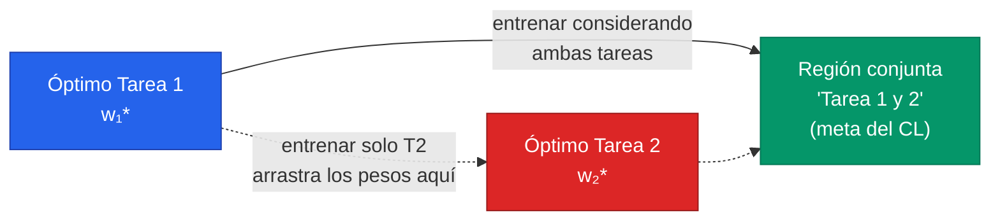
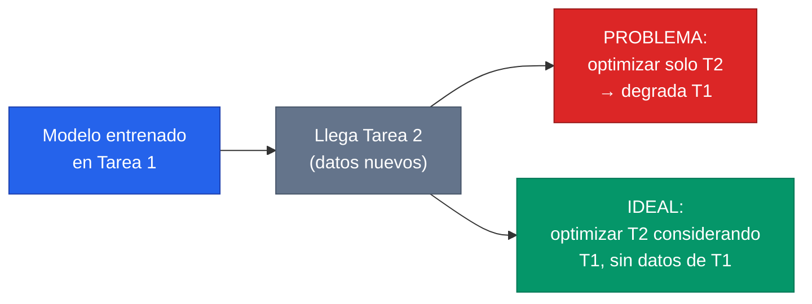
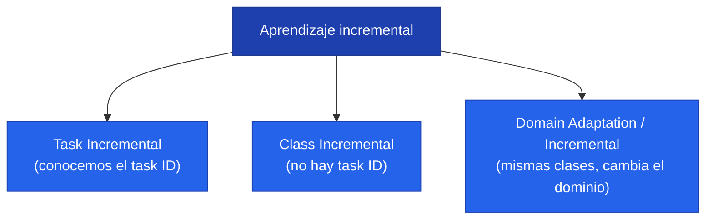
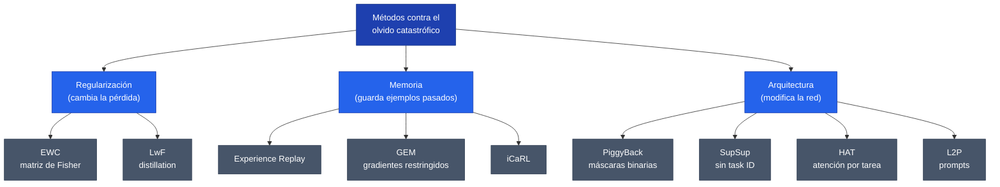

```mermaid
graph LR
    X["Input"]:::data --> Q["Query<br/>(repr. del modelo estático)"]:::q
    Q -->|"query–key"| POOL["Pool de N prompts<br/>(keys + tokens aprendidos)"]:::pool
    POOL --> SEL["Selección de prompts<br/>relevantes"]:::sel
    SEL --> CAT["Tokens de prompt<br/>concatenados al input"]:::sel
    X --> CAT
    CAT --> TF["Transformer<br/>CONGELADO"]:::frozen
    TF --> AVG["Promedio de vectores<br/>de prompts"]:::sel
    AVG --> CLS["Clasificador final<br/>(entrenable)"]:::out
    CLS --> Y["Output"]:::out
    classDef data fill:#64748b,color:#fff,stroke:#475569
    classDef q fill:#2563eb,color:#fff,stroke:#1e40af
    classDef pool fill:#7c3aed,color:#fff,stroke:#5b21b6
    classDef sel fill:#0891b2,color:#fff,stroke:#0e7490
    classDef frozen fill:#334155,color:#fff,stroke:#1e293b
    classDef out fill:#059669,color:#fff,stroke:#047857
```

> **Recorrido de las 51 diapositivas** de la clase 32 del Diplomado IA UC (Alain Raymond, *"Olvido Catastrófico y Aprendizaje Continuo: un problema real en el uso continuo de modelos"*). La clase ataca una grieta del deep learning clásico: una red entrenada para una tarea, al re-entrenarse en una tarea nueva, **olvida** lo aprendido. El recorrido va de la motivación (qué significa que lleguen datos nuevos) al **aprendizaje incremental** y la definición de **olvido catastrófico**, pasando por los **tres escenarios** (task / class / domain) y cerrando con el **arsenal de métodos** organizados en tres familias: regularización, memoria y arquitectura.

---

## 1. Motivación del problema

### 1.1 ¿Qué significa que lleguen datos nuevos?

Un modelo desplegado en producción no vive en un mundo congelado: el flujo de datos cambia con el tiempo. La clase distingue **tres maneras** en que llegan "datos nuevos":

1. **Datos de una nueva clase.** Aparece una categoría que el modelo nunca vio (un diagnóstico nuevo, un producto nuevo, una especie nueva).
2. **Datos de un contexto o dominio diferente.** Las mismas clases, pero capturadas en condiciones distintas (otro hospital, otra cámara, otro idioma).
3. **Los datos de las clases actuales cambian.** La distribución de una clase ya conocida deriva en el tiempo (lo que significa "fraude" hoy no es lo que significaba hace cinco años).


Los tres casos comparten una misma tensión: el modelo fue optimizado para una distribución de datos que **ya no es la única** que enfrentará. La pregunta operativa es qué hacemos cuando ese flujo nuevo aparece.


### 1.2 ¿Qué podemos hacer cuando llegan datos nuevos?

Hay tres respuestas ingenuas, y la clase insiste en que **las tres tienen ventajas, desventajas y problemas**:

- **Entrenar con todos los datos** (los viejos + los nuevos, desde cero o re-entrenando).
- **Entrenar solo con los datos nuevos** (seguir optimizando el mismo modelo).
- **Entrenar modelos nuevos** (uno por tarea, sin tocar los anteriores).

Ninguna es gratis. El siguiente cuadro resume los *trade-offs* que la clase pone sobre la mesa:

| Criterio | Entrenar con todos los datos | Entrenar solo con los nuevos | Entrenar modelos nuevos |
| --- | --- | --- | --- |
| **Espacio en disco** | Alto (hay que guardar todo el histórico) | Bajo (no se guarda el pasado) | Alto (crece con cada tarea: N modelos) |
| **Transferencia** | Buena (todo se ve junto) | Posible, pero degradada | Nula entre tareas (modelos aislados) |
| **Tiempo de entrenamiento** | Alto (crece con el dataset acumulado) | Bajo (solo datos nuevos) | Medio (un modelo a la vez) |
| **Acceso a datos** | Requiere acceso permanente al pasado | No requiere datos pasados | No requiere datos pasados |
| **Olvido** | Sin olvido (el ideal) | Olvido catastrófico | Sin olvido (pero sin transferencia) |


"Entrenar con todos los datos" es el **gold standard** en rendimiento (no hay olvido), pero suele ser **inviable**: privacidad (no se pueden retener datos clínicos), costo de almacenamiento, costo de re-entrenamiento, o simplemente porque los datos antiguos ya no están disponibles. El aprendizaje continuo nace de querer el rendimiento del primer caso con las restricciones del segundo.


### 1.3 ¿Qué significa "olvidar"? La superficie de pérdida

La clase entrega la intuición geométrica más importante de todo el tema usando la **superficie de pérdida** sobre el espacio de pesos $W$. La idea se construye en cuatro capas:

1. La **Tarea 1** tiene su propia función de pérdida sobre $W$, con un valle (un óptimo) en cierto punto $w_1^*$.
2. La **Tarea 2** tiene **otra** función de pérdida, con un óptimo en otro punto $w_2^*$.
3. Si las dibujamos juntas, sus óptimos **no coinciden**: minimizar una no minimiza la otra.
4. Existe una región **"Tarea 1 y 2"**: un conjunto de pesos que sirve *razonablemente bien* a ambas. El objetivo del aprendizaje continuo es **encontrar y permanecer** en esa región.

**Olvidar**, en este lenguaje, es dejar que la optimización de la Tarea 2 arrastre los pesos desde el valle de la Tarea 1 hasta el valle de la Tarea 2, abandonando la región donde ambas funcionaban. Ese es el corazón geométrico del problema. Para el marco general, ver [Aprendizaje continuo](/fundamentos/aprendizaje-continuo).

---

## 2. Aprendizaje incremental y olvido catastrófico

### 2.1 La secuencia del problema

El aprendizaje incremental modela la realidad como una **secuencia de tareas que llegan en el tiempo**. La clase lo narra en cuatro momentos:

1. **Entrenamos con los datos disponibles (Tarea 1).** Optimizamos los pesos para la única tarea que tenemos. El modelo queda en $w_1^*$.
2. **Llegan datos nuevos (Tarea 2).** El modelo **no está preparado** para estas clases nuevas — su clasificador no las contempla.
3. **El problema: optimizar solo para la Tarea 2.** Si entrenamos con los datos de la Tarea 2 sin más cuidado, el modelo **pierde rendimiento en la Tarea 1**. Los pesos se desplazan hacia $w_2^*$ y la Tarea 1 se degrada.
4. **El ideal: optimizar considerando tareas anteriores.** Quisiéramos ajustar los pesos a la Tarea 2 **teniendo en cuenta** la Tarea 1, *sin requerir los datos de la Tarea 1*. Esta es la restricción dura que hace difícil el problema.

### 2.2 Definición: olvido catastrófico


**Olvido catastrófico** *(catastrophic forgetting)*: cuando un modelo, al aprender una tarea nueva, **pierde el rendimiento** en tareas que previamente sabía resolver. El objetivo del aprendizaje continuo es que el modelo **mantenga su rendimiento en tareas en las que fue entrenado antes**, mientras aprende las nuevas.


**¿Por qué ocurre?** La causa es directa:

- El modelo optimiza sus pesos **pensando solo en la tarea actual**: olvida lo aprendido en el pasado para acomodar la tarea nueva.
- La **modificación de los pesos causa interferencia entre tareas**: los mismos parámetros que codificaban la Tarea 1 son sobreescritos por la Tarea 2.


El **olvido es el síntoma**, no la enfermedad. El problema real del *continual learning* es la **interferencia** entre tareas en un conjunto compartido de pesos. Todos los métodos de la sección 4 son, en el fondo, formas distintas de controlar esa interferencia.


### 2.3 Los objetivos del aprendizaje incremental

Formalmente, el aprendizaje incremental persigue tres objetivos simultáneos:

1. **Aprender la nueva tarea.**
2. **Retener información de tareas anteriores** → eliminar o disminuir la interferencia.
3. **Mejorar el rendimiento en tareas pasadas y futuras** → **transferencia positiva** (que aprender la Tarea 2 incluso ayude a la Tarea 1, y viceversa).

Y todo eso **bajo restricciones**: solo con datos de la tarea actual; con una memoria acotada en disco; quizás con (o sin) un identificador de tarea; entre otras. Es la combinación de objetivos ambiciosos y restricciones duras lo que hace interesante el problema. La transferencia positiva conecta con [Transfer Learning](/fundamentos/transfer-learning), del cual el aprendizaje continuo es el caso secuencial y con restricción de memoria.

### 2.4 ¿Cómo definimos una tarea?

Una **tarea** agrupa un subconjunto de clases. Si un dataset tiene clases $C_1,\dots,C_6$, podemos partirlas: la Tarea 1 son $\{C_1,C_2\}$, la Tarea 2 son $\{C_3,C_4\}$, la Tarea 3 son $\{C_5,C_6\}$. Cómo se agrupan las clases y qué información tenemos en cada momento es precisamente lo que define los **escenarios** de la sección siguiente.

---

## 3. Escenarios de aprendizaje incremental

Dependiendo de las restricciones del problema —en particular, **qué sabemos en el momento de predecir**— la literatura define **tres escenarios** canónicos. La taxonomía sigue a [van de Ven & Tolias (2019)](/papers/three-scenarios-van-de-ven-2019), referencia obligada para no confundir resultados que se miden en escenarios distintos.

### 3.1 Task Incremental

- Cada **tarea es un dataset nuevo**, con una cantidad de clases independientes.
- Cada tarea tiene su **propio identificador** (*task ID*), y lo conocemos **a priori** también en inferencia.

Es la **versión más sencilla** del problema: como sabemos con qué tarea estamos lidiando, podemos usar un clasificador (o "cabeza") distinto por tarea — el modelo solo debe elegir entre las clases de *esa* tarea. La contraparte: es un escenario **poco frecuente en el mundo real** (rara vez nos avisan a qué tarea pertenece un input). Aun así, hay problemas cuyas particularidades lo hacen factible.

> Recuerda que el aprendizaje tradicional tiene **un** clasificador con la cantidad de clases del dataset; en *task incremental* tenemos múltiples cabezas y un selector que nos dice cuál usar.

### 3.2 Class Incremental

- Llegan **nuevas clases** al problema en el tiempo, y reservamos espacio en el clasificador para ellas.
- Tarea 1 = $\{C_1,C_2\}$, Tarea 2 añade $\{C_3,C_4\}$, Tarea 3 añade $\{C_5,C_6\}$ — y al final el clasificador debe distinguir entre **todas** las clases vistas, $C_1 \cap C_2 \cap \dots \cap C_n$ en un único espacio de salida.

Es la **versión más realista**: como conceptualmente es siempre "la misma tarea" (clasificar entre todo lo conocido), **no necesitamos un identificador de tarea**. A cambio, surge una dificultad nueva: es **necesario darse cuenta de cuándo llegan elementos nuevos** (detección de novedad), y el clasificador debe discriminar entre clases de tareas distintas que nunca se vieron juntas durante el entrenamiento.

### 3.3 Domain Adaptation / Incremental

- El **dominio del problema cambia** en el tiempo. **No se agregan clases nuevas**, *¡pero sí cambia lo que significan!* (las mismas etiquetas, otra distribución de inputs).
- Hay **dos posturas** posibles:
  - **Mantener** el conocimiento adquirido de la clase en el pasado.
  - **Olvidar** deliberadamente el conocimiento del pasado (a veces el pasado ya no aplica).

El cambio suele ser un **drift sutil en la distribución de datos**, y el primer desafío es *darse cuenta* de que está ocurriendo. No hace falta agregar clasificadores ni clases nuevas; la decisión de diseño es **si queremos guardar la representación de tareas pasadas**.


Ejemplo de la clase — **reconocimiento de caras**: una cara cambia con los años. Para **seguridad** quizás quiero recordar la cara antigua (verificar identidad histórica); para **Facebook** quizás prefiero olvidarla y quedarme con la apariencia actual. El mismo *drift* de dominio admite respuestas opuestas según el objetivo de negocio.


### 3.4 ¿Existe una solución al problema?

**Por ahora, no.** El aprendizaje continuo es un **problema abierto de investigación**. Existen soluciones que **alivianan** el olvido catastrófico, pero **no son perfectas** y su utilidad **depende del problema y el contexto**.

Para medir progreso, la clase nombra dos **métricas** estándar:

- **Mean Accuracy:** ¿qué tanto estamos aprendiendo, promediando todas las tareas?
- **Backwards Transfer (BWT):** ¿qué tanto estamos olvidando? (cuánto cambia el rendimiento en tareas viejas tras aprender nuevas; idealmente positivo = transferencia hacia atrás).

El aprendizaje continuo es **un área en desarrollo**: el [survey de Mundt et al. (2020)](/papers/continual-survey-mundt-2020) ofrece una visión "holística" del campo y de su puente hacia el *active* y *open-world learning*.

---

## 4. Métodos para lidiar con el olvido catastrófico

La clase organiza el arsenal en **tres familias**, según *dónde* intervienen:

| Familia | Qué cambia | Métodos representativos |
| --- | --- | --- |
| **Regularización** | Cambio en la **función de pérdida** | EWC, LwF |
| **Memoria** | Usa un **subconjunto de ejemplos** de tareas pasadas | Experience Replay, GEM, iCaRL |
| **Arquitectura** | Cambio en la **arquitectura** del modelo | PiggyBack, SupSup, HAT, L2P |

### 4.1 Regularización: cambiar la función de pérdida

La idea es **penalizar** los cambios en los pesos que dañarían tareas anteriores, añadiendo términos a la pérdida.

**Elastic Weight Consolidation (EWC)** — [Kirkpatrick et al. (2017)](/papers/ewc-kirkpatrick-2017).

- **Intuición:** limitar la interferencia entre tareas **desincentivando que se muevan los pesos importantes** de una tarea cuando se aprende una nueva.
- Usan la **matriz de Fisher** para determinar la **importancia** de cada peso para cada tarea (aproximada con la primera derivada). Los pesos importantes se vuelven "rígidos" (elásticos: tiran de vuelta a su valor anterior); los irrelevantes quedan libres para aprender lo nuevo.
- La pérdida queda, esquemáticamente:

$$
\mathcal{L}(\theta) = \mathcal{L}_{B}(\theta) + \sum_i \frac{\lambda}{2}\, F_i\,(\theta_i - \theta_{A,i}^*)^2
$$

donde $\mathcal{L}_B$ es la pérdida de la tarea nueva, $\theta_{A}^*$ son los pesos óptimos de la tarea anterior, $F_i$ es la importancia (Fisher) del peso $i$ y $\lambda$ pondera cuánto pesa el pasado.

✅ Regularización ❌ Memoria ❌ Arquitectura

**Learning Without Forgetting (LwF)** — [Li & Hoiem (2016)](/papers/lwf-li-2016).

- Usa funciones de **distillation** (destilación de conocimiento): se busca que la red, **para los datos nuevos**, se comporte como **se comportaba antes** de entrenar con ellos (preservando las salidas viejas), *y* a la vez aprenda a clasificar los datos nuevos.
- Se entrena minimizando **ambas** pérdidas a la vez: una de *destilación* (no te alejes de tus respuestas antiguas) y una de *clasificación* (aprende lo nuevo). La gracia: **no requiere datos antiguos**, solo las salidas que el modelo viejo produce sobre los datos nuevos.

✅ Regularización ❌ Memoria ❌ Arquitectura

### 4.2 Memoria: guardar un subconjunto del pasado

Estos métodos **guardan elementos de tareas anteriores** (todos o un subconjunto) y los reusan al entrenar. Esto **viola** parcialmente la idea de "no acceder a datos pasados", de modo que la selección busca ser **representativa** de las tareas anteriores. Se eligen de forma **aleatoria, greedy u otra** — y la clase remarca que **aleatorio suele ser suficientemente bueno**.

**Experience Replay (ER)** — la idea base [(Lin, 1992)](/papers/continual-survey-mundt-2020).

- El método **más sencillo** basado en memoria: al aprender una tarea nueva, **agregamos al batch** de entrenamiento elementos de la memoria de tareas pasadas. Sencillo y sorprendentemente efectivo.

✅ Regularización (no) ✅ **Memoria** ❌ Arquitectura

**Gradient Episodic Memory (GEM)** — [Lopez-Paz & Ranzato (2017)](/papers/gem-lopez-paz-2017).

- En lugar de mezclar ejemplos, usa los datos en memoria para **modificar los gradientes** de la tarea nueva.
- Mantiene una **memoria $M_k$ para cada tarea $k$**. Se busca que el gradiente de la tarea nueva **no interfiera** con el de los datos de tareas antiguas: si el paso propuesto **aumentaría** la pérdida en una tarea vieja, se **proyecta** el gradiente al cono factible más cercano.
- Logra **transferencia positiva**, con una condición práctica: *si solo un gradiente es bajo, el valor sigue siendo bajo* (basta que una tarea vieja se vea perjudicada para frenar el paso).

$$
\min_{\tilde{g}} \tfrac{1}{2}\lVert g - \tilde{g}\rVert^2 \quad \text{s.t.}\quad \langle \tilde{g},\, g_k\rangle \ge 0 \;\; \forall k < t
$$

✅ Regularización (no) ✅ **Memoria** ❌ Arquitectura


**Limitaciones de la memoria.** (1) Hay que **guardar datos** de tareas anteriores, lo que **no siempre es factible** (privacidad, regulación). (2) Algunos trabajos guardan **descriptores/features** en vez de datos crudos — más eficiente y sin problemas de seguridad. (3) La memoria **crece con cada tarea**, o tiene un **límite de elementos por clase**: con cuota fija, alguna clase puede quedar **subrepresentada**.


**iCaRL** — [Rebuffi et al. (2017)](/papers/icarl-rebuffi-2017) es un clásico *class-incremental* que combina memoria (un conjunto de *exemplars* por clase, seleccionados por *herding*), destilación y clasificación por **nearest-mean-of-exemplars**. Es la referencia híbrida que une las ideas de memoria y regularización en un solo sistema.

### 4.3 Arquitectura: modificar la red

Aquí se hacen **cambios a la arquitectura** del modelo: máscaras, funciones de atención, prompts. Suelen **depender de un identificador de tarea** que permite alterar la arquitectura para adaptarse a la tarea particular, y se apoyan en **funciones externas** para limitar el aprendizaje de las tareas nuevas (evitando pisar lo viejo).

**PiggyBack** — [Mallya et al. (2018)](/papers/piggyback-mallya-2018).

- Asume una red **pre-entrenada** en un dataset distinto (p. ej. ResNet-18) y la deja **fija**.
- Entrena **máscaras binarias** que se aplican sobre los parámetros de la red, **una máscara por tarea**.
- En inferencia, usamos la máscara binaria correspondiente a la tarea para "activar" la sub-red adecuada.
- Ventaja de espacio: una máscara binaria requiere **32 a 64 veces menos espacio** que el modelo completo (1 bit por peso en vez de 32).

✅ Regularización (no) ❌ Memoria ✅ **Arquitectura**

**SupSup (Supermasks in Superposition)** — [Wortsman et al. (2020)](/papers/supsup-wortsman-2020).

- **Versión generalizada de PiggyBack** que puede funcionar **sin conocer el task ID**.
- Establece un **criterio de incerteza** en la predicción por cada tarea: en inferencia, prueba las máscaras y se queda con la que produce la predicción **más confiada** (menor entropía).
- Durante el entrenamiento, ese mismo criterio ayuda a **detectar si estamos cambiando de tarea** — un avance hacia el escenario realista *class-incremental* sin etiquetas de tarea.

✅ Regularización (no) ❌ Memoria ✅ **Arquitectura**

**Hard Attention to the Task (HAT)** — [Serrà et al. (2018)](/papers/hat-serra-2018).

- Usa **atención por tarea**: cada tarea tiene sus **propias funciones de atención** (máscaras casi-binarias aprendidas, una por unidad).
- Esas máscaras determinan la **importancia de los pesos** para la tarea, y "protegen" las unidades importantes de tareas pasadas frente a la actualización de gradiente al aprender tareas nuevas.

✅ Regularización (no) ❌ Memoria ✅ **Arquitectura**

**Learning to Prompt for Continual Learning (L2P)** — [Wang et al. (2022)](/papers/l2p-wang-2022).

- En esencia, **aprende a consultar un modelo estático** (un Transformer **congelado**) para resolver tareas nuevas. Pensado para **Transformers**.
- Mantiene un **pool de N prompts**. Al predecir una entrada, se determina **qué combinación de prompts** corresponde a ese ejemplo. Solo se entrenan **los prompts y el clasificador final** — el backbone no se toca.
- Los prompts se **concatenan como tokens al inicio** de la secuencia. *Intuición:* le estamos dando **instrucciones** al modelo estático sobre qué hacer.

El mecanismo **query–key**, paso a paso:

1. El input entra → vía **query–key** se le asignan N prompts (la query puede ser la representación del modelo estático o una función aprendida).
2. Esos prompts están asociados a **tokens aprendidos** que se concatenan al inicio del ejemplo.
3. El modelo estático procesa el input **con** los tokens concatenados.
4. Para predecir, se **promedian** los vectores asociados a los tokens de prompt.
5. Ese promedio pasa por la **capa de clasificación final** → ¡output!

Además, se agrega una **pérdida** para que las **keys** se parezcan a las **queries**: queremos que todo input se parezca a alguna llave, para asignarle la tarea/prompt correcto.

**Resultados de L2P:** reutiliza conocimiento entre tareas, obtiene **mejor exactitud promedio** que sus competidores **junto con menor olvido**, y —crucial— **no requiere un task ID**. Es el puente entre el aprendizaje continuo y la era de los grandes modelos pre-entrenados.

✅ Regularización (no) ❌ Memoria ✅ **Arquitectura**

---

## 5. Resumen y takeaways


**Las ideas que hay que llevarse de la clase:**

1. Cuando llegan datos nuevos, **no podemos entrenar solo en ellos** y esperar que todo salga bien: aparece el olvido catastrófico.
2. Varias consideraciones (espacio, privacidad, tiempo, acceso a datos) hacen que **entrenar con todos los datos** —el ideal— **no sea factible**.
3. **Olvido catastrófico** = perder rendimiento en tareas que el modelo **ya sabía** resolver, por interferencia en los pesos compartidos.
4. Existen **tres familias de técnicas** para paliarlo: **regularizadores** (EWC, LwF), **memoria** (ER, GEM, iCaRL) y **estructurales/arquitectura** (PiggyBack, SupSup, HAT, L2P).
5. **¡No es un problema resuelto!** Es un área abierta de investigación; las soluciones alivianan, no eliminan, el olvido.


El hilo conductor para quien despliega modelos en producción —especialmente en salud, donde los datos no pueden retenerse y los dominios cambian entre instituciones y en el tiempo— es directo: el aprendizaje continuo es el marco para **mantener un modelo vivo** sin re-entrenarlo desde cero ni traicionar sus tareas pasadas.

---

**Ver también:** Fundamentos: [Aprendizaje continuo](/fundamentos/aprendizaje-continuo) · [Transfer Learning](/fundamentos/transfer-learning). Papers: [Tres escenarios (van de Ven 2019)](/papers/three-scenarios-van-de-ven-2019) · [EWC (Kirkpatrick 2017)](/papers/ewc-kirkpatrick-2017) · [LwF (Li 2016)](/papers/lwf-li-2016) · [GEM (Lopez-Paz 2017)](/papers/gem-lopez-paz-2017) · [iCaRL (Rebuffi 2017)](/papers/icarl-rebuffi-2017) · [PiggyBack (Mallya 2018)](/papers/piggyback-mallya-2018) · [SupSup (Wortsman 2020)](/papers/supsup-wortsman-2020) · [HAT (Serrà 2018)](/papers/hat-serra-2018) · [L2P (Wang 2022)](/papers/l2p-wang-2022) · [Survey de aprendizaje continuo (Mundt 2020)](/papers/continual-survey-mundt-2020).
