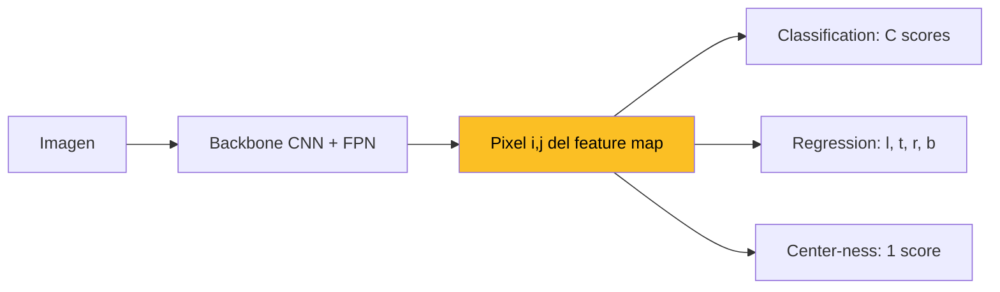
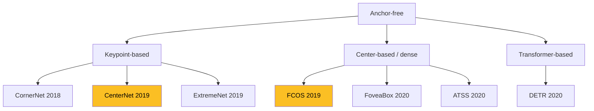
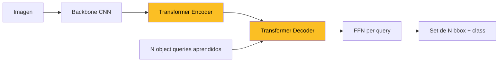

La **deteccion anchor-free** es un paradigma de deteccion de objetos que elimina los **anchor boxes** pre-definidos (familias de cajas de referencia con escalas y aspect ratios fijos) y predice **directamente** la ubicacion y la clase de cada objeto a partir de cada posicion del feature map. En lugar de "regredir desde un anchor", la red responde la pregunta "que objeto, si alguno, esta centrado en este pixel".

Este fundamento extiende y complementa [Deteccion de Objetos](/fundamentos/deteccion-de-objetos). Aqui no se redefine IoU, NMS, mAP, FPN ni RPN: se asume conocido todo eso. El foco esta en **el subset anchor-free** y en por que reemplazo a la generacion anchor-based en buena parte de la literatura post-2018.

---

## 1. Introduccion

La era 2015-2018 de deteccion estuvo dominada por **anchors**: cajas de referencia plantadas en cada celda del feature map, sobre las cuales se predicen offsets. Faster R-CNN (Ren et al. 2015), SSD (Liu et al. 2016), YOLOv2/v3 (Redmon 2016-2018) y RetinaNet (Lin et al. 2017) comparten esa receta.

A partir de 2018, una serie de trabajos demostraron que **los anchors no son necesarios**:

- **CornerNet** (Law y Deng, ECCV 2018): detecta cajas como pares de keypoints.
- **CenterNet** (Zhou et al. arXiv 2019): predice el centro del objeto como heatmap.
- **FCOS** (Tian et al. ICCV 2019): regresion per-pixel directa, con center-ness para suprimir predicciones lejos del centro.

El argumento es economico y arquitectonico. Los anchors agregan **hyperparams sensibles** (escalas, ratios, IoU thresholds positivos/negativos), generan **memoria explosiva** (decenas de miles de cajas por imagen), provocan **imbalance foreground/background severo**, y limitan los formatos de salida (siempre cajas axis-aligned). Anchor-free reemplaza todo eso por **prediccion densa**: cada pixel del feature map produce su propia caja, sin referencia geometrica externa.


Anchor-free no es lo mismo que **proposal-free**. Faster R-CNN tambien tiene una etapa de proposals, pero esos proposals provienen de **regresar offsets desde anchors**. Anchor-free elimina el anchor, no el proposal: el pixel mismo es el proposal.


---

## 2. Recap rapido: la era anchor-based

Repaso minimo (detalle completo en [Deteccion de Objetos](/fundamentos/deteccion-de-objetos)):

- **Faster R-CNN** (Ren 2015): RPN con $k = 9$ anchors por posicion (3 escalas x 3 aspect ratios).
- **SSD** (Liu 2016): 6 niveles del feature map, ~8732 anchors totales para imagen 300x300.
- **YOLOv2/v3** (Redmon 2016/2018): 5-9 anchors aprendidos via k-means sobre el dataset.
- **RetinaNet** (Lin 2017): 9 anchors por nivel del FPN, 5 niveles. Resuelve imbalance con **focal loss**.

El conteo tipico para RetinaNet en COCO:

$$\underbrace{5}_{\text{niveles FPN}} \times \underbrace{H \cdot W}_{\text{posiciones}} \times \underbrace{9}_{\text{anchors}} \approx 10^5 \text{ anchors por imagen}$$

De esos ~100k, **menos del 0.1%** son positivos. El resto es ruido de fondo que debe ser ignorado, supresado o procesado.

Problemas reconocidos del paradigma:

1. **Hyperparam sensitivity**: cambiar escalas o ratios cambia mAP por varios puntos.
2. **Memoria**: enumerar y matchear ~100k anchors es caro.
3. **Imbalance FG/BG**: requiere hard negative mining o focal loss.
4. **Aspect ratio**: anchors rectangulares no encajan bien con objetos no-rectangulares (texto curvado, manos articuladas, instancias muy alargadas como cuchillos o esquis).

---

## 3. El cambio de paradigma

La intuicion central es simple. La salida de una CNN sobre una imagen es un tensor $(C, H, W)$. Cada posicion $(i, j)$ del feature map corresponde a un parche de la imagen original via el stride efectivo. **En vez de plantar anchors en $(i, j)$ y predecir offsets**, basta preguntar:

> Dado este pixel del feature map, **a que objeto pertenece** (clase) y **cuales son los bordes** del bbox que lo contiene?

Esto es deteccion **per-pixel**, y se parece superficialmente a segmentacion semantica. La diferencia:

- **Segmentacion semantica**: cada pixel recibe **una clase**. No hay instancias separadas. Dos personas adyacentes se funden en un blob "persona".
- **Deteccion anchor-free**: cada pixel **dentro de un objeto** predice **el bbox completo** de su instancia. Dos personas adyacentes producen dos cajas distintas porque cada pixel sabe a que instancia pertenece (via label assignment en training).

La salida por pixel es:

- **Classification**: $C$ scores (uno por clase, sigmoid).
- **Regression**: $4$ offsets a left/top/right/bottom del bbox que contiene a ese pixel.
- **Opcional**: centerness, IoU score, embedding, mask features, etc.




La transicion es **conceptual**, no solo arquitectonica. Anchor-based piensa "una caja de referencia y un delta". Anchor-free piensa "este pixel **es** el objeto y aqui estan sus bordes". El feature map deja de ser una grilla de anchors candidatos y pasa a ser una **mascara densa** de predicciones.


---

## 4. Familia anchor-free: taxonomia

La literatura agrupa los metodos en tres familias.

### 4.1 Keypoint-based

Predecir keypoints individuales (corners, centers, extremes) y reconstruir cajas a partir de ellos.

- **CornerNet** (Law y Deng, ECCV 2018): predice dos heatmaps (top-left corner, bottom-right corner) + embeddings para hacer grouping de corners pertenecientes al mismo objeto. Introduce **corner pooling**, una operacion direccional especifica para detectar esquinas.
- **CenterNet** (Zhou et al. arXiv 2019, "Objects as Points"): predice un heatmap del **centro** del objeto + size $(w, h)$ + offset sub-pixel. Sin necesidad de grouping: cada peak del heatmap es ya un objeto.
- **ExtremeNet** (Zhou et al. CVPR 2019): predice los 4 puntos extremos (top, bottom, left, right) y construye la caja.

### 4.2 Center-based / dense

Cada posicion del feature map produce una prediccion. Sin keypoint grouping.

- **FCOS** (Tian et al. ICCV 2019, paper [aqui](/papers/fcos-tian-2019)): regresion per-pixel de $(l, t, r, b)$ + center-ness branch.
- **FoveaBox** (Kong et al. TIP 2020): similar a FCOS, usa una "foveal area" (region central del objeto) como zona positiva.
- **ATSS** (Zhang et al. CVPR 2020, **A**daptive **T**raining **S**ample **S**election): muestra que la brecha entre anchor-free y anchor-based se cierra casi por completo con un esquema adaptativo de seleccion de muestras positivas. Aplicable a ambos paradigmas.

### 4.3 Transformer-based (post-2020)

- **DETR** (Carion et al. ECCV 2020): set prediction con encoder-decoder Transformer + Hungarian matching. Sin anchors, sin NMS.
- **Deformable DETR, DAB-DETR, DINO, Mask2Former**: refinan DETR para acelerar convergencia y mejorar AP.



---

## 5. FCOS: el ejemplar canonico

FCOS (Fully Convolutional One-Stage detector) es la referencia obligada del paradigma center-based. Su arquitectura es minima y su impacto en la literatura posterior (ABCNet para texto curvado, BlendMask para segmentacion, CondInst para mascaras condicionales) es enorme.

### 5.1 Heads en cada nivel del FPN

Sobre cada nivel $P_3, P_4, P_5, P_6, P_7$ del FPN, FCOS coloca **tres ramas convolucionales** que comparten pesos entre niveles:

- **Classification head**: 4 conv 3x3 + 1 conv $C$ channels (sigmoid). Predice probabilidad por clase, entrenado con **focal loss**.
- **Regression head**: 4 conv 3x3 + 1 conv 4 channels. Predice $(l, t, r, b)$ = distancias del pixel a los lados left/top/right/bottom del bbox GT que lo contiene. Activacion final $\exp(\cdot)$ para garantizar positividad.
- **Center-ness head**: 1 conv 1x1 sobre la regression branch. Predice un escalar en $[0, 1]$ que indica que tan cerca del centro del objeto esta este pixel.

### 5.2 Multi-level assignment y resolucion de ambiguity

Si un pixel cae dentro de dos bboxes GT solapados, a cual asignarlo? FCOS resuelve esto via **multi-level assignment**:

Cada nivel del FPN atiende un rango de tamanos $[m_{i-1}, m_i]$:

| Nivel | Stride | Rango de tamano (max side) |
| --- | --- | --- |
| $P_3$ | 8 | $[0, 64]$ |
| $P_4$ | 16 | $[64, 128]$ |
| $P_5$ | 32 | $[128, 256]$ |
| $P_6$ | 64 | $[256, 512]$ |
| $P_7$ | 128 | $[512, \infty)$ |

Un pixel solo es positivo para una GT si el lado maximo $\max(l, t, r, b)$ cae en el rango del nivel. **Esto elimina la mayoria de los conflictos** porque dos cajas que solapan suelen tener tamanos distintos. Si dos cajas del mismo rango siguen solapando, FCOS asigna al pixel la **GT con menor area** (tiebreaker).

### 5.3 Center-ness target

La intuicion: predicciones de pixeles cerca del **borde** del bbox son menos confiables (la regresion suele ser peor cerca de los bordes). Center-ness penaliza esto en inferencia.

Target durante training:

$$\text{centerness}^*(l, t, r, b) = \sqrt{\frac{\min(l, t, r, b) \cdot \min(t, b)}{\max(l, t, r, b) \cdot \max(t, b)}}$$

Forma simplificada mas usada en la literatura:

$$\text{centerness}^* = \sqrt{\frac{\min(l, r)}{\max(l, r)} \cdot \frac{\min(t, b)}{\max(t, b)}}$$

Esta cantidad es **1.0 en el centro exacto del bbox** y **decrece hacia los bordes**. Entrenada con BCE loss.

### 5.4 Loss total

$$\mathcal{L} = \frac{1}{N_{pos}} \sum_{x,y} \mathcal{L}_{cls}^{focal}(\hat{p}_{x,y}, c_{x,y}^*) + \frac{\lambda}{N_{pos}} \sum_{x,y} \mathbb{1}_{c^* > 0} \cdot \mathcal{L}_{reg}^{IoU}(\hat{t}_{x,y}, t_{x,y}^*) + \frac{1}{N_{pos}} \sum_{x,y} \mathbb{1}_{c^* > 0} \cdot \mathcal{L}_{ctr}^{BCE}$$

Con $\lambda = 1$. La regression usa **IoU loss** (no smooth L1), porque al regresionar distancias positivas $(l, t, r, b)$ podemos reconstruir el bbox y calcular IoU directamente, lo que es mas estable y consistente con la metrica de evaluacion.

### 5.5 Inferencia: classification x centerness

Para producir scores finales:

$$\text{score}_{final} = \sqrt{\hat{p}_{cls} \cdot \hat{c}_{centerness}}$$

(O simplemente el producto sin raiz, dependiendo de la implementacion.)

Despues del scoring se decodifica el bbox y se aplica **NMS por clase**. Sin la center-ness, los detectores anchor-free generan muchas predicciones de baja calidad cerca de los bordes que sobreviven al NMS. Con center-ness, esas predicciones se suprimen antes incluso de llegar a NMS.

```python
# FCOS forward simplificado
for level in fpn_levels:
    feat = level_features  # (N, 256, H, W)
    cls_logits = cls_head(feat)         # (N, C, H, W)
    bbox_reg   = reg_head(feat).exp()   # (N, 4, H, W), valores positivos l,t,r,b
    centerness = ctr_head(feat).sigmoid()  # (N, 1, H, W)

# Inferencia
scores = cls_logits.sigmoid() * centerness  # ponderacion
# Decode: para pixel (x, y), bbox = (x - l, y - t, x + r, y + b)
# Top-k por nivel, concatenar niveles, NMS por clase
```


FCOS pasa de ~100k anchors x score a $H \cdot W$ predicciones x score x centerness. **Mismo orden de magnitud de candidatos**, pero sin la maquinaria de anchor matching. El paper original reporta **+0.5 a +2.0 AP** sobre RetinaNet con el mismo backbone, demostrando que los anchors no eran responsables del performance.


---

## 6. CenterNet: "Objects as Points"

CenterNet (Zhou et al. 2019, no confundir con un trabajo homonimo de keypoint triplets del mismo ano) reduce la deteccion a una **prediccion de heatmap del centroide**.

### 6.1 Arquitectura

- **Backbone**: encoder-decoder con upsampling (Hourglass-104, DLA-34, ResNet-FPN). Salida con stride **4** (mucha mayor resolucion que FCOS).
- **Heatmap head**: $C$ canales (uno por clase). Cada canal predice donde estan los **centros** de objetos de esa clase.
- **Size head**: 2 canales, predice $(w, h)$ del bbox.
- **Offset head**: 2 canales, predice subpixel offset para compensar la cuantizacion del stride.

### 6.2 Training del heatmap

Target: una **Gaussiana** centrada en cada GT center, con sigma proporcional al tamano del objeto. Loss: **focal loss penalizada** que asigna menos peso a pixeles cerca de un peak verdadero (para no penalizar predicciones casi-correctas).

$$\mathcal{L}_{k} = -\frac{1}{N} \sum_{x,y,c} \begin{cases} (1 - \hat{Y}_{xyc})^\alpha \log(\hat{Y}_{xyc}) & Y_{xyc} = 1 \\ (1 - Y_{xyc})^\beta (\hat{Y}_{xyc})^\alpha \log(1 - \hat{Y}_{xyc}) & \text{en otro caso} \end{cases}$$

con $\alpha = 2, \beta = 4$.

### 6.3 Inferencia

1. Detectar local maxima del heatmap (NMS via 3x3 max-pool, ni siquiera bbox-NMS).
2. Para cada peak, leer $(w, h)$ del size head y offset del offset head.
3. Construir bbox.

**Sin NMS basado en IoU.** El "NMS" es una operacion de max-pool sobre el heatmap, que se ejecuta en GPU casi gratis.

### 6.4 Aplicacion masiva

CenterNet es la base de muchos detectores especializados:

- **Pose estimation**: agregar un head que predice offsets a keypoints desde el centro.
- **3D detection**: agregar heads para depth, rotation, 3D dimensions.
- **Monocular depth**: similar.
- **Tracking**: CenterTrack usa el mismo backbone para asociar centros entre frames.

El framework "everything center" propone que cualquier tarea de localizacion puede formularse como prediccion centrada + offsets.

---

## 7. CornerNet: keypoint + embedding

CornerNet (Law y Deng 2018) inauguro el paradigma. Su receta:

### 7.1 Heatmaps de corners

Dos heatmaps de $C$ canales cada uno: top-left y bottom-right. Cada peak en el top-left heatmap es candidato de **corner superior-izquierdo**.

### 7.2 Corner pooling

Una corner no es facil de detectar porque rara vez hay un pixel "obvio" en la esquina del objeto (los objetos suelen tener bordes redondeados o estar inscritos en cajas mas grandes que la silueta). **Corner pooling** transforma el feature map:

$$\text{TLPool}(x, y) = \max_{y' \geq y} f(x, y') + \max_{x' \geq x} f(x', y)$$

Recorre la imagen verticalmente hacia abajo y horizontalmente hacia la derecha desde $(x, y)$, tomando max. Asi, un corner top-left "ve" hacia el interior del objeto y puede activarse mirando features lejanos.

### 7.3 Grouping via embeddings

Cada corner predice un **embedding vector**. Dos corners pertenecen al mismo objeto si sus embeddings son similares. Loss tipo "pull" (acercar corners del mismo objeto) + "push" (alejar corners de objetos distintos).

### 7.4 Limitaciones

Compute pesado (Hourglass network grande), grouping a veces falla en objetos solapados, y resulto en menor mAP que CenterNet/FCOS con backbones equivalentes. **Abre el camino** pero rara vez se usa hoy en produccion.

---

## 8. DETR: anchor-free + set-based

DETR (Carion et al. 2020) lleva la eliminacion de heuristicas al limite: **sin anchors y sin NMS**.

### 8.1 Arquitectura



- **Backbone CNN** (ResNet-50/101) produce feature map de baja resolucion.
- **Encoder Transformer** lo procesa con self-attention global.
- **Decoder Transformer** recibe $N$ **object queries** (embeddings aprendidos), uno por slot de salida. $N$ suele ser 100, mucho mas que el numero tipico de objetos por imagen.
- **FFN** por query produce $(bbox, class)$ o $\varnothing$ (no-object).

### 8.2 Hungarian matching

Durante training, hay que matchear las $N$ predicciones con los $M \leq N$ GTs. DETR usa **bipartite matching** (algoritmo Hungarian) que minimiza el costo total:

$$\hat{\sigma} = \arg\min_{\sigma \in \mathfrak{S}_N} \sum_i \mathcal{L}_{match}(y_i, \hat{y}_{\sigma(i)})$$

con $\mathcal{L}_{match}$ combinando classification log-prob + L1 + GIoU. **Cada GT se asigna a exactamente una prediccion**, las demas predicciones reciben target "no-object". El resultado: **no hay multiples predicciones por objeto**, por lo que NMS es innecesario.

### 8.3 Convergence

DETR original entrena lento (~500 epochs sobre COCO). Refinamientos posteriores (Deformable DETR, DAB-DETR, DN-DETR, DINO) introducen attention dispersa, anchor-box queries, denoising training y reducen el tiempo a ~12-50 epochs con mejor AP.


Anchor-free y set-based son conceptos **ortogonales**. FCOS es anchor-free pero **usa NMS** (multiples pixeles del mismo objeto producen predicciones). DETR es anchor-free **y** set-based (Hungarian matching elimina duplicados). El siguiente paso conceptual seria una FCOS con set prediction; algunos trabajos (Sparse R-CNN, OneNet) exploran esto.


---

## 9. Anchor-free vs anchor-based: tradeoffs

ATSS (Zhang et al. 2020) demostro experimentalmente que la **brecha entre paradigmas se cierra casi por completo** con una seleccion adaptativa de muestras positivas. Esto reabrio el debate sobre que importa realmente. Tabla comparativa:

| Aspecto | Anchor-based | Anchor-free |
| --- | --- | --- |
| Hyperparams | Escalas, ratios, IoU thresholds (~5-10 hyperparams) | Stride, FPN ranges (~1-3 hyperparams) |
| Memoria | ~100k anchors per imagen | Mismo orden, sin enumeration |
| Imbalance FG/BG | Requiere focal loss o sampling | Requiere center-ness o focal loss |
| Accuracy | ~38-42 AP en COCO | ~38-43 AP en COCO (comparable) |
| Convergence speed | Mas rapida (warm start con anchor matching) | Mas lenta al inicio |
| Generalizacion a formatos no-bbox | Limitada | Excelente (polygon, curve, mask) |
| Codigo | Mas pesado | Mas simple |

### 9.1 Hyperparam sensitivity

Anchor-based tiene multiples hyperparams correlacionados:

- Escalas (ej. $\{32, 64, 128, 256, 512\}$).
- Ratios (ej. $\{0.5, 1, 2\}$).
- IoU positivo (ej. $\geq 0.7$ en RPN, $\geq 0.5$ en RetinaNet).
- IoU negativo (ej. $< 0.3$).

Cambios moderados en cualquiera de estos pueden cambiar AP por **2-3 puntos**. Anchor-free reduce el espacio de hyperparams: solo el stride, los rangos de tamano por nivel FPN, y el threshold de centerness (si se usa).

### 9.2 Generalizacion a formatos no-bbox

Esta es la ventaja **mas potente** de anchor-free, y la razon principal por la que domina en tareas especializadas:

- **Texto curvado** (escena, manuscritos): el bbox axis-aligned no representa bien la forma; anchor-free permite regresion de control points de **curvas de Bezier** o **polylines**. ABCNet (Liu 2020) y TextSnake (Long 2018) usan exactamente esto.
- **Pose estimation**: los keypoints articulados no son cajas. CenterNet generaliza directamente.
- **Instance segmentation**: la mascara no es una caja. CondInst, SOLOv2 y BlendMask construyen sobre FCOS.
- **3D detection** y **monocular depth**: los outputs son 3D bbox o depth maps, mucho mas naturales sobre center heatmaps.

### 9.3 Cuando elegir cada uno

| Caso | Recomendacion |
| --- | --- |
| Deteccion estandar COCO/OpenImages, deploy con torchvision | Anchor-based (Faster R-CNN/RetinaNet) o FCOS — ambos OK |
| Pose, scene text, instance seg, 3D | Anchor-free (CenterNet, FCOS) — claramente mejor |
| Pipelines existentes con anchor matching, training corto | Anchor-based (warm start) |
| Codebase nuevo, formato de annotation flexible | Anchor-free + DETR para SOTA |

---

## 10. Conexion con Scene Text Recognition

Un caso de uso paradigmatico de anchor-free es **deteccion de texto en escena** ([Scene Text Recognition](/fundamentos/scene-text-recognition)).

**ABCNet** (Liu et al. CVPR 2020, paper [aqui](/papers/abcnet-liu-2020)) usa **FCOS como detector backbone** porque:

1. **Texto curvado** (logos, letreros publicitarios, manuscritos) no encaja en anchor boxes axis-aligned. Un anchor rectangular sobre texto en arco mete demasiado fondo y pierde precision.
2. **Per-pixel regression generaliza directamente** a regresion de **8 control points de dos curvas de Bezier cubicas** (una superior, una inferior). Es el mismo loss + arquitectura de FCOS, solo cambiando "4 sides del bbox" por "8 puntos de control".
3. **Center-ness funciona** sorprendentemente bien para texto: el centro de la palabra tiene features mas estables que los bordes (donde el texto puede confundirse con fondo o caracteres adyacentes).

Otros metodos de text detection anchor-free relevantes:

- **EAST** (Zhou et al. CVPR 2017): predice per-pixel score + 5 offsets (4 lados + rotacion). Anchor-free **antes** de que existiera el termino formal.
- **TextSnake** (Long et al. ECCV 2018): representa texto como secuencia de **discos solapantes** con radio y orientacion. Permite formas arbitrariamente curvadas.
- **DBNet** (Liao et al. AAAI 2020): "Differentiable Binarization" — predice mapas de probabilidad y threshold de forma diferenciable, dense prediction puro.
- **PSENet** (Wang et al. CVPR 2019): predice kernels progresivamente expandidos para separar instancias adyacentes.

Todos comparten la filosofia anchor-free: predecir per-pixel, sin cajas de referencia, con formatos de salida flexibles.

---

## 11. Implementacion practica

Snippet pseudocodigo de FCOS forward pass + decode:

```python
import torch
import torch.nn as nn

class FCOSHead(nn.Module):
    def __init__(self, in_channels=256, num_classes=80):
        super().__init__()
        # 4 conv 3x3 compartidas en ambas ramas
        self.cls_tower = nn.Sequential(*[
            nn.Conv2d(in_channels, in_channels, 3, padding=1) for _ in range(4)
        ])
        self.reg_tower = nn.Sequential(*[
            nn.Conv2d(in_channels, in_channels, 3, padding=1) for _ in range(4)
        ])
        self.cls_logits = nn.Conv2d(in_channels, num_classes, 3, padding=1)
        self.bbox_pred = nn.Conv2d(in_channels, 4, 3, padding=1)
        self.centerness = nn.Conv2d(in_channels, 1, 3, padding=1)

    def forward(self, feature):
        cls_feat = self.cls_tower(feature)
        reg_feat = self.reg_tower(feature)
        cls_logits = self.cls_logits(cls_feat)            # (N, C, H, W)
        bbox_pred = self.bbox_pred(reg_feat).exp()        # (N, 4, H, W), l,t,r,b > 0
        centerness = self.centerness(reg_feat)            # (N, 1, H, W)
        return cls_logits, bbox_pred, centerness


def decode_fcos(cls_logits, bbox_pred, centerness, stride, score_thresh=0.05, topk=1000):
    """Decode predicciones de un nivel FPN a bboxes."""
    N, C, H, W = cls_logits.shape
    # Coordenadas del centro de cada pixel en la imagen original
    ys = torch.arange(H, device=cls_logits.device) * stride + stride // 2
    xs = torch.arange(W, device=cls_logits.device) * stride + stride // 2
    yy, xx = torch.meshgrid(ys, xs, indexing='ij')        # (H, W)

    scores = cls_logits.sigmoid() * centerness.sigmoid()  # (N, C, H, W)
    scores = scores.permute(0, 2, 3, 1).reshape(N, -1, C) # (N, HW, C)
    l, t, r, b = bbox_pred.unbind(dim=1)                  # cada uno (N, H, W)
    x1 = (xx - l).flatten()
    y1 = (yy - t).flatten()
    x2 = (xx + r).flatten()
    y2 = (yy + b).flatten()
    boxes = torch.stack([x1, y1, x2, y2], dim=-1)         # (HW, 4)
    # Top-k por imagen + filtro por score_thresh + NMS por clase (no mostrado)
    return boxes, scores
```

**Puntos clave del codigo**:

1. `bbox_pred.exp()` garantiza positividad sin requerir clipping.
2. Las coordenadas de pixel `xs, ys` viven en el **espacio de la imagen original**, no del feature map. El centro del pixel del feature map en stride $s$ es $i \cdot s + s/2$.
3. El bbox se decode con la formula simple $(x - l, y - t, x + r, y + b)$ porque $l, t, r, b$ son distancias.
4. La fusion classification x centerness ocurre **antes** del top-k para que pixeles de borde no consuman slots de candidatos.

---

## 12. Limitaciones reconocibles

Anchor-free no es panacea. Las limitaciones documentadas en la literatura:

### 12.1 Convergencia inicial lenta

Sin anchor matching como warm start, las primeras epochs entrenan con mucha incertidumbre sobre que pixel deberia predecir que objeto. FCOS y CenterNet suelen requerir **mas epochs** que RetinaNet para converger con backbones equivalentes. ATSS y DETR exhiben patrones similares.

### 12.2 Overlap ambiguity

Cuando dos objetos del mismo rango de tamano solapan severamente, el pixel comparte ambos GT bboxes. FCOS asigna al **menor area** como tiebreaker, pero esto es heuristico. En escenas densas (multitudes, frutas en bandeja, libros en estante) el problema se manifiesta como **false negatives** sobre el objeto mayor.

### 12.3 Objetos muy alargados

Bbox con aspect ratio $> 5:1$ (cuchillos, postes, jabalinas, esquis) tienen un area "fina" donde caen pocos pixeles positivos. El centerness puede penalizar incorrectamente predicciones validas porque el centro geometrico de un rectangulo finito esta muy cerca de varios bordes.

### 12.4 Center-ness peakiness

Si el centerness se entrena demasiado bien (target Gaussiano muy estrecho), termina **sobre-suprimiendo** predicciones legitimas de objetos descentrados (parcialmente ocluidos, parcialmente fuera de frame). Workarounds: target Gaussiano mas suave, o reemplazar centerness por IoU prediction.

### 12.5 Sensibilidad al label assignment

ATSS demostro que **el factor dominante de performance no es anchors vs anchor-free, sino como se asignan muestras positivas/negativas durante training**. Esto es una espada de doble filo: anchor-free es libre del bagaje anchor, pero hereda la fragilidad del label assignment.

---

## 13. Conexiones con el curso

Anchor-free es un tema transversal que cruza varias clases y otros fundamentos:

- [Clase 09 - CNN Backbones](/clases/clase-09/): ResNet, FPN, las backbones tipicas tambien se usan aqui.
- [Clase 15 - Deteccion de Objetos](/clases/clase-15/): cubre la era anchor-based; este fundamento extiende a la era anchor-free.
- [Clase 17 - Pose Recognition](/clases/clase-17/): comparte filosofia de dense prediction (heatmaps de keypoints, PifPaf usa pair fields, OpenPose usa PAFs sobre dense prediction).
- [Clase 21 - Scene Text Recognition](/clases/clase-21/): ABCNet usa FCOS como detector backbone.

Fundamentos relacionados:

- [Deteccion de Objetos](/fundamentos/deteccion-de-objetos): fundamento padre (IoU, NMS, mAP, anchors, FPN, RoIAlign).
- [Scene Text Recognition](/fundamentos/scene-text-recognition): aplicacion en texto curvado.
- [Redes Convolucionales](/fundamentos/redes-convolucionales): backbones.

Papers relevantes en el site:

- [FCOS (Tian 2019)](/papers/fcos-tian-2019): el ejemplar canonico.
- [ABCNet (Liu 2020)](/papers/abcnet-liu-2020): FCOS aplicado a texto curvado.
- [FPN (Lin 2017)](/papers/fpn-lin-2017): feature pyramid, dependencia tipica.
- [Faster R-CNN (Ren 2015)](/papers/faster-rcnn-ren-2015): el contraste anchor-based.
- [Mask R-CNN (He 2017)](/papers/mask-rcnn-he-2017): RoIAlign, contraste two-stage anchor-based.

---

## 14. Resumen

1. **Anchor-free elimina los anchor boxes** y predice directamente clase + offsets desde cada pixel del feature map.
2. Nacio para resolver hyperparam sensitivity, memoria explosiva e imbalance severo de los metodos anchor-based.
3. **Tres familias**: keypoint-based (CornerNet, CenterNet), center-based dense (FCOS, FoveaBox), y transformer-based (DETR).
4. **FCOS** es el ejemplar canonico: per-pixel regression de $(l, t, r, b)$ + center-ness + multi-level FPN assignment.
5. **CenterNet** "Objects as Points" reduce todo a heatmap de centros + size + offset, base de muchas tareas especializadas (pose, 3D, tracking).
6. **DETR** combina anchor-free con set prediction via Hungarian matching, eliminando ademas el NMS.
7. **ATSS** demostro que la brecha anchor-based vs anchor-free se cierra con label assignment adaptativo; **el assignment importa mas que el paradigma**.
8. La **ventaja decisiva** de anchor-free no es accuracy, sino **flexibilidad de output**: regresion de curvas de Bezier (texto), keypoints (pose), mascaras (segmentacion), 3D bboxes.
9. **Limitaciones**: convergencia mas lenta, ambiguity sobre objetos solapados del mismo tamano, objetos muy alargados, peakiness del centerness.
10. **Conexion clave en este curso**: ABCNet (Clase 21) usa FCOS para detectar texto curvado via regresion de Bezier control points, imposible de hacer naturalmente con anchors rectangulares.

---

## Referencias

- [FCOS (Tian et al. 2019)](/papers/fcos-tian-2019) - El ejemplar canonico anchor-free dense.
- [ABCNet (Liu et al. 2020)](/papers/abcnet-liu-2020) - FCOS aplicado a texto curvado.
- [Faster R-CNN (Ren et al. 2015)](/papers/faster-rcnn-ren-2015) - Contraste anchor-based.
- [FPN (Lin et al. 2017)](/papers/fpn-lin-2017) - Backbone tipica.
- [Mask R-CNN (He et al. 2017)](/papers/mask-rcnn-he-2017) - Contraste two-stage.

Para el contexto completo de deteccion (anchor-based + anchor-free), ver el fundamento padre [Deteccion de Objetos](/fundamentos/deteccion-de-objetos). Para la aplicacion en texto curvado, ver [Scene Text Recognition](/fundamentos/scene-text-recognition) y la [Clase 21](/clases/clase-21).
