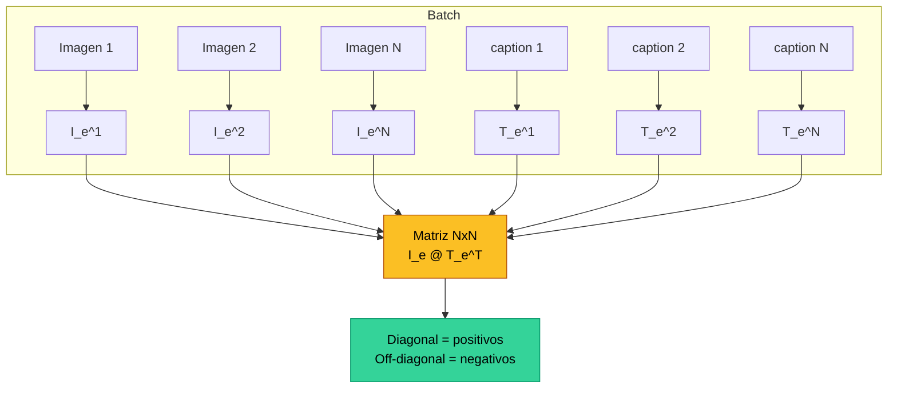
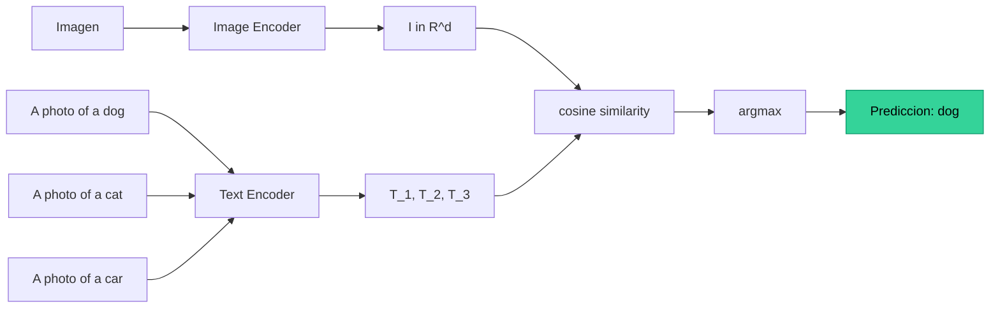

El **aprendizaje contrastivo** es un paradigma de representacion en el que el modelo aprende a **acercar** en el espacio de embedding pares relacionados (positivos) y a **alejar** pares no relacionados (negativos), todo sin requerir etiquetas categoricas tradicionales. Su materializacion mas influyente es **CLIP** (Radford et al., OpenAI 2021), que aplico la idea a pares **imagen-texto** raspados de internet y obtuvo un clasificador zero-shot que rivaliza con modelos supervisados especializados.

CLIP cambio dos cosas: (1) hizo posible **clasificar imagenes en categorias arbitrarias** sin reentrenar, simplemente describiendo las clases en lenguaje natural; y (2) aporto el **text encoder** que hoy condiciona modelos generativos como Stable Diffusion. Es la pieza clave del puente entre vision y lenguaje.

---

## 1. Motivacion: Aprender Sin Etiquetas

El paradigma supervisado clasico necesita pares (imagen, etiqueta) curados manualmente. ImageNet costo anos y millones de dolares para anotar 1.2M imagenes en 1000 clases. Escalar mas alla es prohibitivo, y las etiquetas resultantes son rigidas: un modelo entrenado en 1000 clases no sabe que es un "akita" si nunca lo vio.

Pregunta clave: **¿podemos aprender representaciones utiles usando la estructura del data como senal?**

Idea central: si dos vistas describen el mismo concepto (dos crops de la misma imagen, una imagen y su caption, una frase en ingles y su traduccion), sus representaciones deberian ser **cercanas**. Si describen conceptos distintos, deberian ser **lejanas**. Esto se llama **aprendizaje contrastivo**.


El aprendizaje contrastivo convierte el problema de "aprender que es esto" en uno mas facil: "aprender **cuales pares van juntos**". La etiqueta deja de ser una clase categorica y se vuelve una **relacion** entre datos.


---

## 2. Formulacion General

Dado un par positivo $(x, x^+)$ y un conjunto de negativos $\{x_i^-\}_{i=1}^{N}$, queremos un encoder $f$ tal que:

$$\text{sim}(f(x), f(x^+)) \gg \text{sim}(f(x), f(x_i^-)) \quad \forall i$$

donde la similitud $\text{sim}$ es tipicamente la **similitud coseno** sobre vectores L2-normalizados:

$$\text{sim}(u, v) = \frac{u^\top v}{\|u\|\,\|v\|}$$

Si los vectores estan ya L2-normalizados, esto se reduce al producto punto $u^\top v \in [-1, 1]$.

**Que cuenta como positivo** depende del dominio:

| Dominio | Positivo | Negativo |
|---|---|---|
| SimCLR (vision SSL) | dos augmentaciones de la misma imagen | otras imagenes del batch |
| Word2Vec (lenguaje) | palabra y su contexto | palabras aleatorias |
| CLIP (multimodal) | imagen y su caption real | imagen con caption de otra imagen del batch |
| MoCo | query y key del mismo crop | banco de keys historicas |

---

## 3. InfoNCE Loss

El objetivo dominante en aprendizaje contrastivo es **InfoNCE** (van den Oord et al. 2018, popularizada por SimCLR de Chen et al. 2020):

$$\mathcal{L}_{\text{InfoNCE}} = -\log \frac{\exp(\text{sim}(z, z^+) / \tau)}{\sum_{j=0}^{N} \exp(\text{sim}(z, z_j) / \tau)}$$

Componentes:

- **Numerador**: similitud con el positivo $z^+$.
- **Denominador**: suma sobre **todos los candidatos** (positivo + $N$ negativos).
- **Temperatura $\tau$**: hiperparametro (frecuentemente aprendible) que controla la "dureza" del softmax. $\tau$ pequeno → distribucion peaked → penaliza mucho los falsos positivos. $\tau$ grande → distribucion suave.

Equivalencia: InfoNCE es exactamente **cross-entropy** sobre $N+1$ clases donde el positivo es la "clase correcta". Por eso se implementa con `cross_entropy` directo sobre la matriz de logits.

**Cota inferior de mutual information**: van den Oord 2018 demuestra que minimizar InfoNCE maximiza una **cota inferior** de la informacion mutua $I(X, X^+)$ entre las dos vistas. Por eso se llama "Noise-Contrastive Estimation" para Mutual Information.

---

## 4. CLIP: Contrastive Language-Image Pre-training

**CLIP** (Radford et al., OpenAI 2021) escala el principio contrastivo a **400 millones** de pares imagen-texto raspados de internet.

### 4.1 Arquitectura

Dos encoders independientes:

- **Image encoder**: ViT (varios tamanos: ViT-B/32, ViT-B/16, ViT-L/14) o ResNet modificada.
- **Text encoder**: Transformer decoder-only, 63M parametros, vocab BPE de 49,152 tokens.

Cada uno produce un feature vector que se proyecta a un **espacio compartido** $\mathbb{R}^{d_e}$ (tipicamente $d_e = 512$ o $768$) mediante una proyeccion lineal aprendida, y luego se **L2-normaliza**:

$$I_e = \frac{W_i \cdot \text{ImageEncoder}(I)}{\|\cdot\|_2}, \quad T_e = \frac{W_t \cdot \text{TextEncoder}(T)}{\|\cdot\|_2}$$

### 4.2 Matriz de similitudes

Dado un batch de $N$ pares $\{(I_k, T_k)\}_{k=1}^{N}$, calculamos todos los $N \times N$ productos punto:

$$L_{ij} = (I_e^{(i)})^\top T_e^{(j)} \cdot \exp(t)$$

donde $\exp(t)$ es una temperatura aprendible (clamp para no explotar). Solo los **$N$ pares de la diagonal** son positivos; los $N(N-1)$ restantes son negativos.



---

## 5. WIT: el Dataset de 400M

Para entrenar a esta escala, OpenAI construyo **WIT** (WebImageText), 400 millones de pares (imagen, texto).

Procedimiento:

1. Lista de queries: palabras o bigramas que aparecen $\geq 100$ veces en Wikipedia ingles → ~500k queries.
2. Por cada query, hasta **20,000** pares (imagen, texto alternativo) raspados de la web publica.
3. Balance aproximado entre queries para evitar sesgos por popularidad.

Comparacion con datasets prevvios:

| Dataset | Pares | Anotacion |
|---|---|---|
| MSCOCO Captions | 330k | manual |
| Visual Genome | 5.4M | manual |
| YFCC100M | 100M | filtrado de uploads de Flickr |
| **WIT (CLIP)** | **400M** | raspado web + filtrado por queries |
| ALIGN (Google 2021) | 1.8B | raspado mas ruidoso |

Un modelo CLIP grande tarda **12 dias en 256 GPUs V100** en hacer 32 epochs sobre WIT.

---

## 6. Pseudocodigo (Figura 3 del Paper)

```
# image_encoder - ResNet o ViT
# text_encoder  - Text Transformer
# I[n,h,w,c]    - imagenes batch
# T[n,l]        - textos batch (token ids)
# W_i[d_i, d_e] - proyeccion imagen
# W_t[d_t, d_e] - proyeccion texto
# t             - temperatura aprendida (log)

I_f = image_encoder(I)                      # [n, d_i]
T_f = text_encoder(T)                       # [n, d_t]

I_e = l2_normalize(I_f @ W_i, axis=1)       # [n, d_e]
T_e = l2_normalize(T_f @ W_t, axis=1)       # [n, d_e]

logits = (I_e @ T_e.T) * exp(t)             # [n, n]
labels = arange(n)                          # [0,1,...,n-1]

loss_i = cross_entropy(logits, labels, axis=0)  # imagen -> texto
loss_t = cross_entropy(logits, labels, axis=1)  # texto -> imagen
loss   = (loss_i + loss_t) / 2
```

Tres detalles clave:

1. **Diagonal-as-labels**: las etiquetas son simplemente $\{0, 1, \ldots, n-1\}$ porque el par positivo $i$ esta en la posicion $(i, i)$.
2. **Symmetric loss**: se promedia la perdida en ambas direcciones (ver seccion siguiente).
3. **Temperatura aprendible $t$**: se entrena $t$ directamente y se usa $\exp(t)$ para garantizar positividad. Suele clamparse en $\exp(t) \leq 100$ para estabilidad.

---

## 7. Por Que la Perdida es Simetrica

La matriz $L \in \mathbb{R}^{N \times N}$ se puede leer en dos direcciones:

- **Imagen $\to$ texto** (fila $i$): "para la imagen $i$, ¿cual de los $N$ textos es el correcto?". Se aplica softmax sobre la fila → cross-entropy con label $i$.
- **Texto $\to$ imagen** (columna $j$): "para el texto $j$, ¿cual de las $N$ imagenes es la correcta?". Softmax sobre la columna → cross-entropy con label $j$.

Promediar ambos terminos fuerza que el espacio compartido sea util **bidireccionalmente**. Si solo se usara la direccion imagen$\to$texto, el modelo podria colapsar sus embeddings de texto sin penalidad. La simetria evita ese atajo.

---

## 8. Zero-Shot Classification: el Resultado Magico

El logro mas espectacular de CLIP no es el contrastive training en si, sino la **transferencia zero-shot a clasificacion**.

### 8.1 Procedimiento

Para clasificar una imagen entre $K$ clases sin fine-tuning:

1. Construir prompts: por cada clase $c_k$, formar un texto como `"A photo of a {c_k}"`.
2. Codificar todos los prompts: $T_1, \ldots, T_K \in \mathbb{R}^{d_e}$, L2-normalizados.
3. Codificar la imagen: $I \in \mathbb{R}^{d_e}$, L2-normalizada.
4. Predecir: $\hat{k} = \arg\max_k I^\top T_k$.



### 8.2 Por que esto es radical

- **Sin fine-tuning**, sin labels especificas del dataset target.
- El modelo nunca vio explicitamente las clases del benchmark.
- CLIP-RN50 logra **76.2%** zero-shot en ImageNet → comparable a un ResNet-50 supervisado entrenado *con* ImageNet.
- CLIP-ViT-L/14 alcanza **76.2 → 83.1%** con prompt engineering + ensembling.


"Zero-shot" aqui significa **zero-shot transfer**: el modelo se entreno en un objetivo (alinear pares imagen-texto) y se evalua en otro (clasificar entre clases predefinidas) sin ver ningun ejemplo etiquetado del segundo. NO significa que CLIP nunca vio imagenes de perros — las vio millones, solo no en el formato de "imagen + label `dog`".


---

## 9. Resultados Zero-Shot

Tabla 4 del paper Radford 2021 reporta resultados en **27 datasets** de clasificacion. Algunos highlights:

| Dataset | Zero-shot CLIP-ViT-L/14 | Linear probe ResNet-50 supervised |
|---|---|---|
| ImageNet | 76.2% | 76.0% |
| Food101 | 90.1% | 86.4% |
| SUN397 | 67.7% | 60.5% |
| Stanford Cars | 65.6% | 51.5% |
| OxfordPets | 93.5% | 91.5% |
| Country211 | 31.2% | 22.6% |
| FER2013 (emotions) | 56.0% | 64.2% |

CLIP **supera** a un linear probe sobre features ResNet-50 supervisadas en 16/27 datasets, sin haber visto ninguna etiqueta de esos datasets.

### 9.1 Robustez a Distribution Shift

El resultado **mas importante** quizas: CLIP es notablemente robusto a cambios de distribucion.

| Benchmark | ResNet-101 (sup.) | CLIP-ViT-L/14 |
|---|---|---|
| ImageNet | 76.2% | 76.2% (empate) |
| ImageNet-V2 | 64.3% | 70.1% |
| ImageNet-Sketch | 25.2% | 60.2% |
| ImageNet-R (renditions) | 37.7% | 88.9% |
| ImageNet-A (adversarial) | 2.7% | 77.2% |
| ObjectNet | 32.6% | 72.3% |

Mientras un ResNet supervisado **colapsa** en ImageNet-Sketch (dibujos en lapiz) y ImageNet-A (imagenes adversariales naturales), CLIP mantiene precision alta. La diversidad del training en web data le da exposicion a estilos que un modelo supervisado en ImageNet jamas vio.

---

## 10. Prompt Engineering y Ensembling

CLIP es **muy sensible al prompt**. Pasar solo `"dog"` al text encoder funciona peor que `"A photo of a dog"`.

### 10.1 Templates

Tipicos:

- `"A photo of a {class}"` — generico, suele subir +1.3% sobre el class label crudo.
- `"A photo of a {class}, a type of pet"` — agregar el dominio (pets, food, vehicle) sube otro punto en datasets como Oxford Pets, Food101.
- `"A satellite photo of {class}"` para datasets aereos como EuroSAT.
- `"A pixelated photo of {class}"` para CIFAR.

### 10.2 Prompt Ensembling

En lugar de un prompt, usar **80 plantillas distintas** y promediar sus embeddings:

$$T_k = \frac{1}{P} \sum_{p=1}^{P} \text{normalize}(\text{TextEncoder}(\text{prompt}_p(c_k)))$$

Sube ImageNet zero-shot otro **+3.5%** aproximado. La intuicion: distintos prompts disparan distintas dimensiones del espacio de texto; promediarlos da una representacion mas estable de la clase.

---

## 11. Limitaciones

CLIP no es magia. Limitaciones documentadas:

- **No supera a modelos supervisados especializados** en tareas estrechas: detecccion fina (CUB-200 birds), satellite/medical imaging, OCR de texto largo.
- **Tareas que requieren reasoning fino** son su talon de Aquiles: counting (`"3 dogs"` vs `"4 dogs"` confunde a CLIP), spatial reasoning (`"left of"`, `"above"`), abstract concepts.
- **Sesgos del dataset**: WIT viene de la web abierta → hereda sesgos de genero (asociaciones automaticas hombre↔CEO, mujer↔nurse), raza, edad. La seccion 7 del paper documenta estos sesgos extensivamente.
- **Costo computacional masivo**: 400M pares, 12 dias en 256 GPUs V100 (~$1M USD en compute). No es replicable en ambientes academicos pequenos.
- **Vulnerabilidad a typographic attacks**: una imagen de manzana con un papel pegado que dice "iPod" hace que CLIP la clasifique como iPod. La sensibilidad al texto en imagenes puede ser explotada.
- **Performance en lenguajes no-ingles** muy inferior, ya que WIT es predominantemente anglocentrico.

---

## 12. Familia CLIP / Multimodal

CLIP catalizo una explosion de modelos multimodales contrastivos:

| Modelo | Innovacion | Ano |
|---|---|---|
| **CLIP** (OpenAI) | Contrastive image-text en 400M pares | 2021 |
| **ALIGN** (Google) | 1.8B pares ruidosos, escalando aun mas | 2021 |
| **OpenCLIP** (LAION) | Reentrenamiento abierto sobre LAION-400M/2B | 2022 |
| **DeCLIP** | Contrastive + self-supervision adicional para data eficiencia | 2022 |
| **BLIP** | Combina contrastive + image captioning + matching | 2022 |
| **FLAVA** (Meta) | Image, text, image+text en un solo encoder | 2022 |
| **SigLIP** (Google) | Reemplaza softmax por **sigmoid** loss → mas estable, escala mejor a batches grandes | 2023 |
| **SigLIP 2** | Mejoras en multilingual y dense features | 2025 |
| **EVA-CLIP** | Mejoras en arquitectura y mask-based pretraining | 2023 |

### 12.1 Aplicaciones Downstream

- **Stable Diffusion**, DALL-E 2 usan el text encoder de CLIP para condicionar generacion. El espacio CLIP es la "interfaz" entre lenguaje y vision generativa.
- **Open-vocabulary detection** (OWL-ViT, GLIP) reemplaza el clasificador final de un detector por similitudes CLIP, permitiendo detectar cualquier categoria descrita en texto.
- **Open-vocabulary segmentation** (LSeg, OpenSeg) hace lo mismo a nivel de pixel.
- **Video** (VideoCLIP, X-CLIP) extiende a temporal.
- **Retrieval** semantic image search en producto: "show me red shoes with white sole".

---

## 13. Implementacion en 3 Frameworks

### 13.1 InfoNCE Simetrica + Modelo Esqueleto



```python
import torch
import torch.nn as nn
import torch.nn.functional as F

def contrastive_loss(image_features, text_features, temperature):
    """InfoNCE simetrica estilo CLIP.

    image_features, text_features: (batch, d_e), L2-normalizados.
    temperature: escalar > 0.
    """
    logits = (image_features @ text_features.T) / temperature  # (n, n)
    n = logits.size(0)
    labels = torch.arange(n, device=logits.device)
    loss_i = F.cross_entropy(logits, labels)        # imagen -> texto
    loss_t = F.cross_entropy(logits.T, labels)      # texto -> imagen
    return (loss_i + loss_t) / 2


class CLIPModel(nn.Module):
    def __init__(self, image_encoder, text_encoder,
                 d_image, d_text, d_embed=512):
        super().__init__()
        self.image_encoder = image_encoder
        self.text_encoder = text_encoder
        self.W_i = nn.Linear(d_image, d_embed, bias=False)
        self.W_t = nn.Linear(d_text, d_embed, bias=False)
        # log-temperatura aprendible, init log(1/0.07)
        self.log_t = nn.Parameter(torch.tensor(2.659))

    def encode_image(self, images):
        f = self.image_encoder(images)              # (n, d_image)
        e = self.W_i(f)                             # (n, d_embed)
        return F.normalize(e, dim=-1)

    def encode_text(self, tokens):
        f = self.text_encoder(tokens)               # (n, d_text)
        e = self.W_t(f)                             # (n, d_embed)
        return F.normalize(e, dim=-1)

    def forward(self, images, tokens):
        I_e = self.encode_image(images)
        T_e = self.encode_text(tokens)
        # clamp por estabilidad (paper: <= 100)
        t = self.log_t.exp().clamp(max=100.0)
        loss = contrastive_loss(I_e, T_e, 1.0 / t)
        return loss


@torch.no_grad()
def zero_shot_classify(model, image, class_prompts, tokenizer):
    """class_prompts: list[str], p.ej. ['A photo of a dog', ...]."""
    tokens = tokenizer(class_prompts).to(image.device)
    T_e = model.encode_text(tokens)                 # (K, d_embed)
    I_e = model.encode_image(image.unsqueeze(0))    # (1, d_embed)
    sims = (I_e @ T_e.T).squeeze(0)                 # (K,)
    return sims.softmax(dim=-1), sims.argmax().item()
```


```python
import jax
import jax.numpy as jnp
import flax.linen as nn
import optax

def l2_normalize(x, axis=-1, eps=1e-8):
    return x / (jnp.linalg.norm(x, axis=axis, keepdims=True) + eps)

def contrastive_loss(image_features, text_features, temperature):
    logits = (image_features @ text_features.T) / temperature
    n = logits.shape[0]
    labels = jnp.arange(n)
    loss_i = optax.softmax_cross_entropy_with_integer_labels(logits, labels).mean()
    loss_t = optax.softmax_cross_entropy_with_integer_labels(logits.T, labels).mean()
    return (loss_i + loss_t) / 2


class CLIPModel(nn.Module):
    image_encoder: nn.Module
    text_encoder: nn.Module
    d_embed: int = 512

    def setup(self):
        self.W_i = nn.Dense(self.d_embed, use_bias=False)
        self.W_t = nn.Dense(self.d_embed, use_bias=False)
        self.log_t = self.param('log_t', lambda key: jnp.array(2.659))

    def encode_image(self, images):
        f = self.image_encoder(images)
        return l2_normalize(self.W_i(f))

    def encode_text(self, tokens):
        f = self.text_encoder(tokens)
        return l2_normalize(self.W_t(f))

    def __call__(self, images, tokens):
        I_e = self.encode_image(images)
        T_e = self.encode_text(tokens)
        t = jnp.clip(jnp.exp(self.log_t), 0.0, 100.0)
        return contrastive_loss(I_e, T_e, 1.0 / t)


def zero_shot_classify(params, model, image, class_prompts_tokens):
    I_e = model.apply(params, image[None, ...], method=model.encode_image)
    T_e = model.apply(params, class_prompts_tokens, method=model.encode_text)
    sims = (I_e @ T_e.T).squeeze(0)
    return jax.nn.softmax(sims), jnp.argmax(sims)
```


```python
import tensorflow as tf

def contrastive_loss(image_features, text_features, temperature):
    logits = tf.matmul(image_features, text_features, transpose_b=True) / temperature
    n = tf.shape(logits)[0]
    labels = tf.range(n)
    loss_i = tf.keras.losses.sparse_categorical_crossentropy(labels, logits, from_logits=True)
    loss_t = tf.keras.losses.sparse_categorical_crossentropy(labels, tf.transpose(logits), from_logits=True)
    return (tf.reduce_mean(loss_i) + tf.reduce_mean(loss_t)) / 2


class CLIPModel(tf.keras.Model):
    def __init__(self, image_encoder, text_encoder, d_embed=512):
        super().__init__()
        self.image_encoder = image_encoder
        self.text_encoder = text_encoder
        self.W_i = tf.keras.layers.Dense(d_embed, use_bias=False)
        self.W_t = tf.keras.layers.Dense(d_embed, use_bias=False)
        self.log_t = tf.Variable(2.659, trainable=True, dtype=tf.float32)

    def encode_image(self, images):
        f = self.image_encoder(images)
        e = self.W_i(f)
        return tf.math.l2_normalize(e, axis=-1)

    def encode_text(self, tokens):
        f = self.text_encoder(tokens)
        e = self.W_t(f)
        return tf.math.l2_normalize(e, axis=-1)

    def call(self, inputs):
        images, tokens = inputs
        I_e = self.encode_image(images)
        T_e = self.encode_text(tokens)
        t = tf.clip_by_value(tf.exp(self.log_t), 0.0, 100.0)
        return contrastive_loss(I_e, T_e, 1.0 / t)


def zero_shot_classify(model, image, class_prompts_tokens):
    T_e = model.encode_text(class_prompts_tokens)               # (K, d)
    I_e = model.encode_image(tf.expand_dims(image, 0))          # (1, d)
    sims = tf.squeeze(tf.matmul(I_e, T_e, transpose_b=True), 0) # (K,)
    return tf.nn.softmax(sims), tf.argmax(sims)
```



### 13.2 Notas de Implementacion

- **Inicializacion de la temperatura**: $\log(1/0.07) \approx 2.659$ es el default del paper.
- **Mixed precision**: CLIP se entrena en FP16/BF16; la matriz de logits es FP32 para evitar overflow en el softmax.
- **Gradient accumulation**: para batches de 32k que CLIP usa, se necesita gather entre GPUs (`all_gather`) para construir la matriz NxN completa antes del cross-entropy.
- **Data augmentation**: solo random resized crop en imagenes (mas augmentation degrada CLIP, contrario a SimCLR puramente visual).

---

## 14. Resumen

- **Aprendizaje contrastivo** = aprender embeddings tales que pares relacionados (positivos) esten cerca y no relacionados (negativos) esten lejos. Pierde la necesidad de etiquetas categoricas.
- **InfoNCE loss** es cross-entropy sobre $N+1$ candidatos donde el positivo es la clase correcta. Cota inferior de mutual information.
- **CLIP** (Radford 2021) escala la idea a 400M pares imagen-texto (WIT). Dos encoders (imagen + texto) proyectan a un espacio compartido L2-normalizado.
- **Perdida simetrica** (imagen→texto + texto→imagen) evita atajos y produce un espacio bidireccionalmente util.
- **Zero-shot classification**: codificar prompts `"A photo of a {class}"`, codificar la imagen, tomar el argmax de similitudes coseno. CLIP-ViT-L/14 alcanza 76.2-83.1% en ImageNet sin fine-tuning.
- **Robustez a distribution shift**: CLIP cae mucho menos que modelos supervisados en ImageNet-Sketch, ImageNet-A, ObjectNet.
- **Prompt engineering** + **prompt ensembling** suben varios puntos sin tocar el modelo.
- **Limitaciones**: tareas con reasoning fino (counting, spatial), sesgos de la web, costo de entrenar.
- **Familia**: ALIGN, OpenCLIP, SigLIP, BLIP, EVA-CLIP. El text encoder de CLIP condiciona Stable Diffusion y otros modelos generativos.

Ver tambien: [Transformer](transformer) · [Vision Transformer](vision-transformer) · [Self-Attention](self-attention) · [Transfer Learning](transfer-learning) · [Paper CLIP (Radford 2021)](/papers/clip-radford-2021) · [Clase 14](/clases/clase-14).
