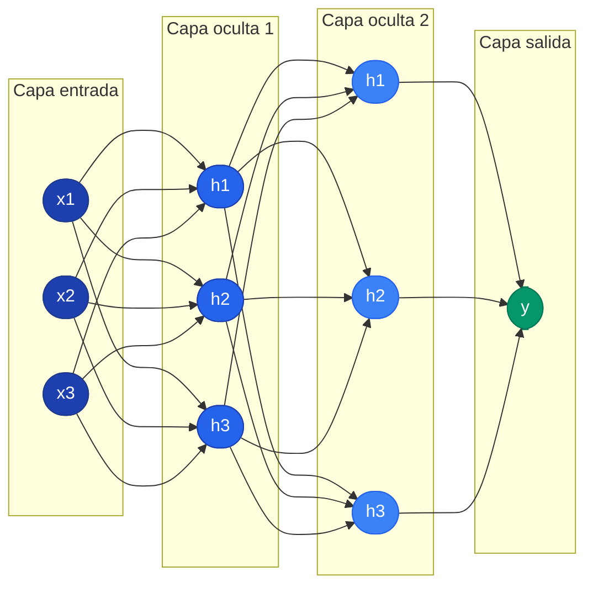

Una red neuronal es un sistema de funciones compuestas, organizado en **capas**, que transforma datos de entrada en predicciones. Esta pagina cubre el modelo matematico de la neurona, las funciones de activacion y como se combinan en redes profundas.

---

## 1. El Modelo de la Neurona

Una neurona artificial recibe multiples entradas, las combina linealmente y aplica una funcion de activacion no-lineal:


y = f\left(\sum_{i=1}^{n} w_i x_i + b\right) = f(W^T x + b)


Donde:
- $x_i$ son las entradas
- $w_i$ son los **pesos** (parametros aprendibles)
- $b$ es el **bias**
- $f$ es la **funcion de activacion**

Sin la funcion de activacion, multiples capas lineales colapsarian en una sola transformacion lineal. La no-linealidad es lo que permite a las redes profundas aproximar funciones arbitrariamente complejas.


**Teorema de Aproximacion Universal (Cybenko, 1989):** Una red con una sola capa oculta y suficientes neuronas puede aproximar cualquier funcion continua con precision arbitraria. Sin embargo, la profundidad permite representaciones exponencialmente mas compactas.


### Ejemplo: Implementacion de una neurona



```python
import torch
import torch.nn as nn

# Definir una neurona: 3 entradas, 1 salida + activacion sigmoid
neurona = nn.Sequential(
    nn.Linear(3, 1),  # combinacion lineal: w^T x + b
    nn.Sigmoid()       # funcion de activacion
)

# Entrada de ejemplo (batch de 2 muestras, 3 features)
x = torch.randn(2, 3)
salida = neurona(x)
print(f"Entrada: {x}")
print(f"Salida: {salida}")

# Acceder a los pesos y bias aprendibles
print(f"Pesos: {neurona[0].weight.data}")
print(f"Bias: {neurona[0].bias.data}")
```


```python
import tensorflow as tf

# Definir una neurona: 3 entradas, 1 salida + activacion sigmoid
neurona = tf.keras.Sequential([
    tf.keras.layers.Dense(1, activation='sigmoid', input_shape=(3,))
])

# Entrada de ejemplo (batch de 2 muestras, 3 features)
x = tf.random.normal((2, 3))
salida = neurona(x)
print(f"Entrada: {x.numpy()}")
print(f"Salida: {salida.numpy()}")

# Acceder a los pesos y bias aprendibles
pesos, bias = neurona.layers[0].get_weights()
print(f"Pesos: {pesos}")
print(f"Bias: {bias}")
```


```python
import jax
import jax.numpy as jnp

# Inicializar pesos y bias para una neurona con 3 entradas
key = jax.random.PRNGKey(0)
w = jax.random.normal(key, (3, 1)) * 0.01  # pesos pequenos
b = jnp.zeros((1,))                         # bias en cero

# Definir la neurona: combinacion lineal + sigmoid
def neurona(params, x):
    w, b = params
    z = x @ w + b          # combinacion lineal
    return jax.nn.sigmoid(z)  # activacion

# Entrada de ejemplo (batch de 2 muestras, 3 features)
x = jax.random.normal(jax.random.PRNGKey(1), (2, 3))
salida = neurona((w, b), x)
print(f"Entrada: {x}")
print(f"Salida: {salida}")
```



---

## 2. Capas y Arquitectura

### Perceptron Multicapa (MLP)

Un MLP organiza las neuronas en capas completamente conectadas:



### Forward Pass

El forward pass es la evaluacion secuencial de cada capa:

$$z^{(l)} = W^{(l)} a^{(l-1)} + b^{(l)}, \quad a^{(l)} = f(z^{(l)})$$

Donde $a^{(0)} = x$ es la entrada y $a^{(L)}$ es la salida de la red.

### Ejemplo: Construir un MLP con 2 capas ocultas



```python
import torch
import torch.nn as nn

# MLP: 4 entradas -> 128 -> 64 -> 10 salidas (clasificacion)
mlp = nn.Sequential(
    nn.Linear(4, 128),   # primera capa oculta
    nn.ReLU(),
    nn.Linear(128, 64),  # segunda capa oculta
    nn.ReLU(),
    nn.Linear(64, 10),   # capa de salida (logits)
)

# Forward pass con datos de ejemplo
x = torch.randn(32, 4)  # batch de 32 muestras, 4 features
logits = mlp(x)
print(f"Forma de salida: {logits.shape}")  # [32, 10]

# Contar parametros totales
total = sum(p.numel() for p in mlp.parameters())
print(f"Parametros totales: {total}")
```


```python
import tensorflow as tf

# MLP: 4 entradas -> 128 -> 64 -> 10 salidas (clasificacion)
mlp = tf.keras.Sequential([
    tf.keras.layers.Dense(128, activation='relu', input_shape=(4,)),  # primera capa oculta
    tf.keras.layers.Dense(64, activation='relu'),                     # segunda capa oculta
    tf.keras.layers.Dense(10),                                        # capa de salida (logits)
])

# Forward pass con datos de ejemplo
x = tf.random.normal((32, 4))  # batch de 32 muestras, 4 features
logits = mlp(x)
print(f"Forma de salida: {logits.shape}")  # (32, 10)

# Contar parametros totales
mlp.summary()
```


```python
import jax
import jax.numpy as jnp
from jax import random

# Inicializar pesos para cada capa del MLP
def init_mlp(key, capas):
    """Inicializar MLP con capas [4, 128, 64, 10]."""
    params = []
    for fan_in, fan_out in zip(capas[:-1], capas[1:]):
        key, subkey = random.split(key)
        w = random.normal(subkey, (fan_in, fan_out)) * jnp.sqrt(2.0 / fan_in)
        b = jnp.zeros(fan_out)
        params.append((w, b))
    return params

# Forward pass: aplicar capas con ReLU (excepto la ultima)
def forward(params, x):
    for w, b in params[:-1]:
        x = jax.nn.relu(x @ w + b)
    w, b = params[-1]
    return x @ w + b  # salida sin activacion (logits)

# Crear red y ejecutar
params = init_mlp(random.PRNGKey(0), [4, 128, 64, 10])
x = random.normal(random.PRNGKey(1), (32, 4))
logits = forward(params, x)
print(f"Forma de salida: {logits.shape}")  # (32, 10)
```



---

## 3. Funciones de Activacion

### Sigmoide

$$\sigma(x) = \frac{1}{1 + e^{-x}}, \quad \sigma'(x) = \sigma(x)(1 - \sigma(x))$$

- Rango: $(0, 1)$. Util como salida para clasificacion binaria.
- **Problema:** Gradiente maximo de 0.25, causa vanishing gradient en redes profundas.

### Tangente Hiperbolica (Tanh)

$$\tanh(x) = \frac{e^x - e^{-x}}{e^x + e^{-x}} = 2\sigma(2x) - 1$$

- Centrada en cero (mejora sobre Sigmoide), pero aun sufre vanishing gradient.

### ReLU (Rectified Linear Unit)


\text{ReLU}(x) = \max(0, x), \quad \text{ReLU}'(x) = \begin{cases} 1 & x > 0 \\ 0 & x \leq 0 \end{cases}



**ReLU es la activacion por defecto** para capas ocultas. Converge hasta 6x mas rapido que Sigmoide (Krizhevsky et al., 2012) porque su gradiente es constante (1) en la zona positiva. Su unico problema: neuronas que reciben siempre entradas negativas "mueren" permanentemente.


### Leaky ReLU / PReLU

$$\text{PReLU}(x) = \max(\alpha x, x)$$

Con $\alpha$ pequeno (ej. 0.01), las neuronas nunca dejan de aprender.

### Softmax

$$\text{softmax}(z_i) = \frac{e^{z_i}}{\sum_j e^{z_j}}$$

Convierte logits en probabilidades que suman 1. Se usa en la capa de salida para clasificacion multiclase.

### Tabla Comparativa

| Funcion | Rango | Centrada en 0 | Vanishing Gradient | Uso tipico |
|---------|-------|---------------|-------------------|------------|
| Sigmoide | $(0, 1)$ | No | Si | Salida binaria |
| Tanh | $(-1, 1)$ | Si | Si | Capas ocultas (RNN) |
| ReLU | $[0, +\infty)$ | No | Solo negativos | Capas ocultas (CNN, MLP) |
| Leaky ReLU | $(-\infty, +\infty)$ | No | No | Capas ocultas |
| Softmax | $(0, 1)$ | N/A | N/A | Salida multiclase |

### Ejemplo: Comparar funciones de activacion



```python
import torch
import matplotlib.pyplot as plt

x = torch.linspace(-5, 5, 200)

# Calcular cada activacion
activaciones = {
    'Sigmoid': torch.sigmoid(x),
    'Tanh': torch.tanh(x),
    'ReLU': torch.relu(x),
    'Leaky ReLU': torch.nn.functional.leaky_relu(x, 0.01),
}

# Graficar todas las funciones
fig, ax = plt.subplots(figsize=(8, 5))
for nombre, y in activaciones.items():
    ax.plot(x.numpy(), y.numpy(), label=nombre, linewidth=2)
ax.axhline(0, color='gray', linewidth=0.5)
ax.axvline(0, color='gray', linewidth=0.5)
ax.legend(fontsize=12)
ax.set_title("Funciones de Activacion")
plt.tight_layout()
plt.show()
```


```python
import tensorflow as tf
import matplotlib.pyplot as plt
import numpy as np

x = np.linspace(-5, 5, 200).astype(np.float32)

# Calcular cada activacion
activaciones = {
    'Sigmoid': tf.nn.sigmoid(x).numpy(),
    'Tanh': tf.nn.tanh(x).numpy(),
    'ReLU': tf.nn.relu(x).numpy(),
    'Leaky ReLU': tf.nn.leaky_relu(x, alpha=0.01).numpy(),
}

# Graficar todas las funciones
fig, ax = plt.subplots(figsize=(8, 5))
for nombre, y in activaciones.items():
    ax.plot(x, y, label=nombre, linewidth=2)
ax.axhline(0, color='gray', linewidth=0.5)
ax.axvline(0, color='gray', linewidth=0.5)
ax.legend(fontsize=12)
ax.set_title("Funciones de Activacion")
plt.tight_layout()
plt.show()
```


```python
import jax.numpy as jnp
import jax
import matplotlib.pyplot as plt

x = jnp.linspace(-5, 5, 200)

# Calcular cada activacion
activaciones = {
    'Sigmoid': jax.nn.sigmoid(x),
    'Tanh': jnp.tanh(x),
    'ReLU': jax.nn.relu(x),
    'Leaky ReLU': jax.nn.leaky_relu(x, negative_slope=0.01),
}

# Graficar todas las funciones
fig, ax = plt.subplots(figsize=(8, 5))
for nombre, y in activaciones.items():
    ax.plot(x, y, label=nombre, linewidth=2)
ax.axhline(0, color='gray', linewidth=0.5)
ax.axvline(0, color='gray', linewidth=0.5)
ax.legend(fontsize=12)
ax.set_title("Funciones de Activacion")
plt.tight_layout()
plt.show()
```



---

## 4. Inicializacion de Pesos

En redes profundas, una mala inicializacion produce vanishing o exploding signals:

$$y = W^{[L]} \cdot W^{[L-1]} \cdots W^{[1]} \cdot x$$

Si los pesos son consistentemente $< 1$, la senal se desvanece. Si son $> 1$, explota.


\text{Var}(W) = \frac{2}{\text{fan\_in} + \text{fan\_out}}


| Inicializacion | Formula | Activacion recomendada |
|---|---|---|
| **Xavier/Glorot** (2010) | $\text{Var} = 2/(\text{fan\_in} + \text{fan\_out})$ | Sigmoid, Tanh |
| **He/Kaiming** (2015) | $\text{Var} = 2/\text{fan\_in}$ | ReLU y variantes |

### Ejemplo: Xavier vs He inicializacion



```python
import torch
import torch.nn as nn

capa_xavier = nn.Linear(256, 128)
capa_he = nn.Linear(256, 128)

# Aplicar inicializacion Xavier (para Sigmoid/Tanh)
nn.init.xavier_normal_(capa_xavier.weight)
nn.init.zeros_(capa_xavier.bias)

# Aplicar inicializacion He/Kaiming (para ReLU)
nn.init.kaiming_normal_(capa_he.weight, nonlinearity='relu')
nn.init.zeros_(capa_he.bias)

# Comparar la varianza de los pesos
print(f"Xavier - varianza: {capa_xavier.weight.var().item():.6f}")
print(f"He     - varianza: {capa_he.weight.var().item():.6f}")
print(f"Esperada Xavier: {2 / (256 + 128):.6f}")
print(f"Esperada He:     {2 / 256:.6f}")
```


```python
import tensorflow as tf
import numpy as np

# Crear capas con inicializacion Xavier (Glorot) y He
capa_xavier = tf.keras.layers.Dense(
    128, kernel_initializer='glorot_normal', input_shape=(256,)
)
capa_he = tf.keras.layers.Dense(
    128, kernel_initializer='he_normal', input_shape=(256,)
)

# Forzar la creacion de pesos con un forward pass
x = tf.random.normal((1, 256))
_ = capa_xavier(x)
_ = capa_he(x)

# Comparar la varianza de los pesos
w_xavier = capa_xavier.get_weights()[0]
w_he = capa_he.get_weights()[0]
print(f"Xavier - varianza: {np.var(w_xavier):.6f}")
print(f"He     - varianza: {np.var(w_he):.6f}")
print(f"Esperada Xavier: {2 / (256 + 128):.6f}")
print(f"Esperada He:     {2 / 256:.6f}")
```


```python
import jax
import jax.numpy as jnp
from jax.nn.initializers import glorot_normal, he_normal

key = jax.random.PRNGKey(0)
k1, k2 = jax.random.split(key)

# Inicializacion Xavier/Glorot (para Sigmoid/Tanh)
init_xavier = glorot_normal()
w_xavier = init_xavier(k1, (256, 128))

# Inicializacion He/Kaiming (para ReLU)
init_he = he_normal()
w_he = init_he(k2, (256, 128))

# Comparar la varianza de los pesos
print(f"Xavier - varianza: {jnp.var(w_xavier):.6f}")
print(f"He     - varianza: {jnp.var(w_he):.6f}")
print(f"Esperada Xavier: {2 / (256 + 128):.6f}")
print(f"Esperada He:     {2 / 256:.6f}")
```



---

## 5. El Pipeline Completo

Una red neuronal tipica sigue estos pasos:

```text
1. DATOS:        Cargar + normalizar + armar batches
2. RED:          Definir capas (Linear, Conv2d, etc.)
3. LOSS:         Funcion que mide el error
4. OPTIMIZADOR:  Algoritmo que ajusta pesos
5. ENTRENAR:     forward -> loss -> backward -> update
6. EVALUAR:      Probar con datos nunca vistos
```

Cada uno de estos componentes se cubre en detalle en las paginas siguientes de esta seccion.

---

## Para Profundizar

- [Clase 06 - Grafos de Computo, Activaciones e Inicializacion](/clases/clase-06/) -- Funciones de activacion, Xavier, grafos
- [Clase 07 - Conceptos y Definiciones](/clases/clase-07/) -- Frameworks, normalizations, CNN pipelines
