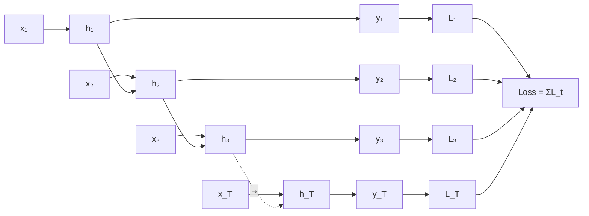
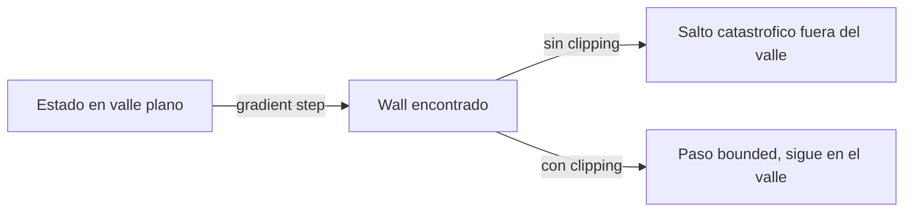
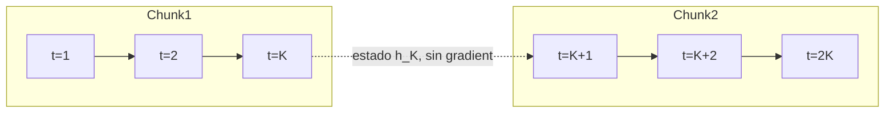

**Backpropagation Through Time** (BPTT) es la generalizacion del algoritmo de backpropagation a redes neuronales recurrentes. La idea central es **desplegar la red en el tiempo** convirtiendola en una red feedforward profunda con pesos compartidos, y luego aplicar backprop estandar. Este fundamento cubre el algoritmo, su derivacion, los problemas numericos que provoca (vanishing y exploding gradient) y las soluciones practicas.

---

## 1. Recordatorio: BPTT es Backprop sobre la Red Desplegada

Una RNN procesa una secuencia $x_1, x_2, \ldots, x_T$ produciendo estados $h_1, h_2, \ldots, h_T$ y salidas $y_1, \ldots, y_T$. Cada paso usa los **mismos pesos** $W_{xh}, W_{hh}, W_{hy}$.

Si "desplegamos" la RNN, obtenemos una red feedforward de profundidad $T$ donde cada capa corresponde a un paso temporal:



La perdida total es $\mathcal{L} = \sum_{t=1}^{T} L_t(y_t, \hat{y}_t)$. BPTT propaga el gradiente de $\mathcal{L}$ hacia atras a traves de toda la secuencia desplegada.

---

## 2. Forward Pass

Para cada $t = 1, \ldots, T$:

$$
\begin{aligned}
h_t &= \tanh(W_{hh} \, h_{t-1} + W_{xh} \, x_t + b_h) \\
y_t &= W_{hy} \, h_t + b_y \\
L_t &= \ell(y_t, \hat{y}_t)
\end{aligned}
$$

Necesitamos **almacenar todos los $h_t$ y $x_t$** para el backward pass -- por eso BPTT consume memoria $O(T \cdot d_h)$.

---

## 3. Backward Pass: Derivacion

### 3.1 Gradiente respecto a $W_{hy}$ (output)

$$\frac{\partial \mathcal{L}}{\partial W_{hy}} = \sum_{t=1}^{T} \frac{\partial L_t}{\partial y_t} \cdot \frac{\partial y_t}{\partial W_{hy}} = \sum_{t=1}^{T} \frac{\partial L_t}{\partial y_t} \, h_t^T$$

Suma de las contribuciones individuales en cada paso. Es exactamente backprop estandar.

### 3.2 Gradiente respecto a $h_t$

El estado $h_t$ contribuye a $L_t$ directamente y a todos los $L_{t+1}, \ldots, L_T$ a traves de la cadena recurrente:

$$\frac{\partial \mathcal{L}}{\partial h_t} = \underbrace{\frac{\partial L_t}{\partial h_t}}_{\text{directo}} + \underbrace{\frac{\partial \mathcal{L}}{\partial h_{t+1}} \cdot \frac{\partial h_{t+1}}{\partial h_t}}_{\text{recurrente}}$$

Esto se calcula recursivamente desde $t = T$ hacia atras.

### 3.3 Gradiente respecto a $W_{hh}$ (recurrente)

Aqui aparece la propiedad fundamental: como $W_{hh}$ se usa en cada paso, su gradiente acumula contribuciones de **todos** los pasos:

$$\frac{\partial \mathcal{L}}{\partial W_{hh}} = \sum_{t=1}^{T} \frac{\partial \mathcal{L}}{\partial h_t} \cdot \frac{\partial h_t}{\partial W_{hh}}$$

Pero $\frac{\partial h_t}{\partial W_{hh}}$ depende de $h_{t-1}$, que tambien depende de $W_{hh}$, asi que la regla de la cadena se desenrolla:

$$\frac{\partial h_t}{\partial W_{hh}} = \sum_{k=1}^{t} \left( \prod_{j=k+1}^{t} \frac{\partial h_j}{\partial h_{j-1}} \right) \frac{\partial^+ h_k}{\partial W_{hh}}$$

donde $\frac{\partial^+ h_k}{\partial W_{hh}}$ es la derivada **inmediata** (tratando $h_{k-1}$ como constante).

### 3.4 El factor critico

El producto $\prod_{j=k+1}^{t} \frac{\partial h_j}{\partial h_{j-1}}$ es el **transporte temporal del error** del paso $t$ al paso $k$. Cada factor es una matriz Jacobiana:

$$\frac{\partial h_j}{\partial h_{j-1}} = W_{hh}^T \cdot \text{diag}(\sigma'(z_j))$$

donde $z_j = W_{hh} h_{j-1} + W_{xh} x_j$ y $\sigma$ es la no linealidad.


El gradiente que vuelve $t-k$ pasos atras se multiplica por **$t-k$ matrices Jacobianas iguales** (mismo $W_{hh}$). Este producto crece o decae **exponencialmente** con $t-k$, dependiendo del mayor valor singular de $W_{hh}$. **Aqui es donde nacen vanishing y exploding gradient.**


---

## 4. Vanishing y Exploding Gradient

### 4.1 Analisis (Pascanu, Mikolov, Bengio 2013)

Sea $\lambda_1$ el mayor valor singular de $W_{hh}$ y $\gamma$ una cota del valor absoluto de $\sigma'$:

- $\gamma = 1$ para $\tanh$
- $\gamma = 1/4$ para sigmoide
- $\gamma = 1$ para ReLU (cuando activa)

Resultados de Pascanu et al.:

| Condicion sobre $\lambda_1$ | Consecuencia |
|---|---|
| $\lambda_1 < \frac{1}{\gamma}$ | **Suficiente** para vanishing gradient |
| $\lambda_1 > \frac{1}{\gamma}$ | **Necesario** para exploding gradient |

En la practica: con tanh y $W_{hh}$ inicializado con valores pequenos, **vanishing es lo mas comun**. Con valores grandes o tras varias epocas, exploding aparece como picos en la loss y NaN.

### 4.2 Vista geometrica

En el espacio de parametros, exploding gradients corresponden a **paredes empinadas** ("walls") en la superficie de error, donde un paso de SGD normal te lanza fuera del valle. Pascanu mostro que este fenomeno es comun cerca de **bifurcaciones** del sistema dinamico que la RNN representa.



---

## 5. Soluciones Practicas

### 5.1 Gradient Norm Clipping (para exploding)

La solucion mas simple y efectiva, propuesta en Pascanu 2013:

```text
g ← ∂L/∂θ
if ||g|| ≥ threshold:
    g ← (threshold / ||g||) · g
θ ← θ - η · g
```

El umbral tipico es entre 1 y 10. **Preserva la direccion** del gradiente, solo escala su magnitud cuando excede el umbral.



```python
import torch.nn.utils as utils

# Despues de loss.backward(), antes de optimizer.step()
loss.backward()
utils.clip_grad_norm_(model.parameters(), max_norm=5.0)
optimizer.step()
```


```python
import jax
import jax.numpy as jnp
import optax

# Optax provee clipping como transformacion componible
optimizer = optax.chain(
    optax.clip_by_global_norm(max_norm=5.0),
    optax.adam(learning_rate=1e-3),
)

# En el training step
grads = jax.grad(loss_fn)(params, batch)
updates, opt_state = optimizer.update(grads, opt_state, params)
params = optax.apply_updates(params, updates)

# O manual:
def clip_by_global_norm(grads, max_norm):
    g_norm = jnp.sqrt(sum(jnp.sum(g**2) for g in jax.tree_util.tree_leaves(grads)))
    scale = jnp.minimum(1.0, max_norm / (g_norm + 1e-6))
    return jax.tree_util.tree_map(lambda g: g * scale, grads)
```


```python
# En tf.keras
optimizer = tf.keras.optimizers.Adam(learning_rate=1e-3, clipnorm=5.0)

# O manual con tf.GradientTape
with tf.GradientTape() as tape:
    loss = compute_loss(...)
grads = tape.gradient(loss, model.trainable_variables)
grads, _ = tf.clip_by_global_norm(grads, clip_norm=5.0)
optimizer.apply_gradients(zip(grads, model.trainable_variables))
```



### 5.2 Arquitecturas con compuertas (para vanishing)

LSTM y GRU resuelven vanishing reemplazando el producto matricial recurrente por un **flujo aditivo** del cell state controlado por la forget gate:

$$\frac{\partial c_t}{\partial c_{t-1}} = f_t \quad \text{(elementwise, no matricial)}$$

Si $f_t \approx 1$, el gradiente fluye sin atenuacion. Ver [LSTM y GRU](lstm-gru).

### 5.3 Inicializacion ortogonal de $W_{hh}$

Inicializar $W_{hh}$ como una matriz **ortogonal** garantiza que todos los valores singulares sean exactamente 1, retrasando vanishing/exploding al inicio del entrenamiento:

```python
# PyTorch
nn.init.orthogonal_(rnn.weight_hh_l0)
```

### 5.4 Identity initialization + ReLU (IRNN, Le et al. 2015)

Inicializar $W_{hh} = I$ con activacion ReLU. Sorprendentemente competitivo con LSTM en algunas tareas, sin necesidad de compuertas.

### 5.5 Skip connections en el tiempo

Anadir conexiones que saltan $K$ pasos atras crea atajos para el gradiente:

$$h_t = f(h_{t-1}, h_{t-K}, x_t)$$

Es la idea detras de Clockwork RNN (Koutnik 2014) y Hierarchical RNN.

---

## 6. Truncated BPTT

Para secuencias muy largas (miles de pasos), backprop sobre toda la secuencia es prohibitivo en memoria. **Truncated BPTT** divide la secuencia en chunks de longitud $K$:

1. Forward los primeros $K$ pasos.
2. Backward dentro de esa ventana.
3. Actualizar pesos.
4. Continuar el forward del paso $K+1$ usando $h_K$ como estado inicial **sin propagar gradientes mas alla** del chunk anterior.



Trade-off: **menor memoria** y entrenamiento mas rapido, pero **no aprende dependencias mas largas que $K$**. Tipico: $K = 35$ a $200$ para language modeling.



```python
hidden = None
for chunk in chunks(sequence, chunk_size=35):
    if hidden is not None:
        # detach evita propagar gradientes al chunk anterior
        hidden = hidden.detach()
    output, hidden = model(chunk, hidden)
    loss = criterion(output, targets)
    loss.backward()
    utils.clip_grad_norm_(model.parameters(), 5.0)
    optimizer.step()
    optimizer.zero_grad()
```


```python
import jax
import jax.numpy as jnp

# En JAX "detach" se logra con jax.lax.stop_gradient
def truncated_step(params, hidden, chunk, targets):
    # Bloquea el gradiente hacia chunks anteriores
    hidden = jax.lax.stop_gradient(hidden)
    output, new_hidden = model.apply(params, chunk, hidden)
    loss = loss_fn(output, targets)
    return loss, new_hidden

hidden = jnp.zeros((batch_size, hidden_size))
for chunk, targets in chunks(sequence, chunk_size=35):
    (loss, hidden), grads = jax.value_and_grad(truncated_step, has_aux=True)(
        params, hidden, chunk, targets
    )
    # Clip global + update con optax (ver ejemplo de clipping)
    updates, opt_state = optimizer.update(grads, opt_state, params)
    params = optax.apply_updates(params, updates)
```


```python
hidden = None
for chunk, targets in chunks(sequence, chunk_size=35):
    with tf.GradientTape() as tape:
        if hidden is not None:
            # tf.stop_gradient equivale a detach
            hidden = tf.stop_gradient(hidden)
        output, hidden = model(chunk, initial_state=hidden)
        loss = loss_fn(targets, output)
    grads = tape.gradient(loss, model.trainable_variables)
    grads, _ = tf.clip_by_global_norm(grads, 5.0)
    optimizer.apply_gradients(zip(grads, model.trainable_variables))
```



---

## 7. Variantes del Algoritmo

| Algoritmo | Idea | Trade-off |
|---|---|---|
| **BPTT (full)** | Backprop sobre toda la secuencia | Exacto, memoria $O(T)$ |
| **Truncated BPTT** | Backprop en ventana de tamano $K$ | Memoria $O(K)$, no captura dependencias > $K$ |
| **RTRL** (Real-Time Recurrent Learning) | Mantiene jacobianos del estado actuales en forward | Memoria $O(d_h \cdot \lVert \theta \rVert)$ -- prohibitivo |
| **Echo State Networks** | $W_{hh}$ aleatoria fija, solo entrena $W_{hy}$ | Sin BPTT, rapido, expresividad limitada |
| **Synthetic gradients** (Jaderberg 2017) | Aproxima gradientes futuros con una red auxiliar | Permite asincronia, complejo |

---

## 8. Costo Computacional

Por cada paso de BPTT en una RNN con dimension oculta $d$ y vocabulario $V$:

| Paso | FLOPs |
|---|---|
| Forward $h_t$ | $O(d^2 + d \cdot d_x)$ |
| Forward $y_t$ | $O(d \cdot V)$ |
| Backward $\partial h_t / \partial h_{t-1}$ | $O(d^2)$ |
| Total por paso | $O(d^2 + d \cdot V)$ |

Total por secuencia: $O(T \cdot (d^2 + d \cdot V))$. Memoria: $O(T \cdot d)$ para almacenar activaciones.

---

## 9. Resumen

- **BPTT** = backprop sobre la red recurrente desplegada en el tiempo.
- El gradiente de $W_{hh}$ acumula contribuciones de **todos** los pasos via productos de Jacobianas.
- El producto de Jacobianas $\prod W_{hh}^T \, \text{diag}(\sigma')$ explota o se anula exponencialmente segun el mayor valor singular de $W_{hh}$.
- **Exploding gradient** -> **gradient clipping** (Pascanu 2013).
- **Vanishing gradient** -> arquitecturas con compuertas (**LSTM**, **GRU**), inicializacion ortogonal o skip connections.
- **Truncated BPTT** maneja secuencias largas a costa de no capturar dependencias mas alla del chunk.

Ver tambien: [Redes Recurrentes](redes-recurrentes) · [LSTM y GRU](lstm-gru) · [Backpropagation (general)](backpropagation) · [Paper Pascanu 2013](/papers/difficulty-training-rnns-pascanu-2013).
