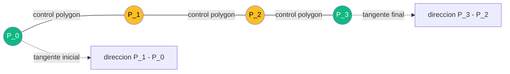

Una **curva de Bezier** es una curva parametrica suave definida por un numero finito de **puntos de control**. La curva no necesariamente pasa por todos esos puntos, pero su forma queda completamente determinada por ellos: mover un punto de control deforma la curva de manera predecible. Esa combinacion de **control intuitivo** + **representacion compacta** + **propiedades matematicas limpias** las convirtio en el lenguaje universal para describir formas curvas en computacion.

Esta pagina cubre el aparato matematico (polinomios de Bernstein, algoritmo de De Casteljau, derivadas), los casos practicos (lineal, cuadratica, cubica), las composiciones (splines, B-splines, NURBS), y la aplicacion central en ML moderno: **representar texto curvado en escenas naturales con ABCNet** (Liu et al. 2020), donde dos curvas Bezier cubicas reemplazan a polygons de 14-16 vertices anotados a mano.

---

## 1. Origen Historico y Motivacion

A finales de los anos 50, la industria automotriz europea enfrentaba un problema concreto: las carrocerias de los autos tenian formas curvas complejas que **no se podian describir** con las herramientas matematicas estandar (lineas, arcos, conicas). El diseno se hacia con plantillas fisicas (regletas elasticas llamadas "splines") y artesanos que copiaban a mano. Pasar de la maqueta al CAD era una pesadilla.

Dos ingenieros, trabajando en paralelo y sin conocer el trabajo del otro, llegaron a la misma idea:

- **Paul de Casteljau** (Citroen, 1959): desarrollo el algoritmo recursivo de interpolacion lineal que hoy lleva su nombre. Citroen mantuvo el trabajo como secreto industrial varios anos.
- **Pierre Bezier** (Renault, 1962): publico la formulacion basada en polinomios de Bernstein. Renault libero el trabajo y por eso la familia de curvas lleva el nombre de Bezier.

Hoy, casi todas las formas curvas en software pasan por Bezier en algun nivel:

- **Tipografias**: PostScript (Adobe 1984) usa Bezier cubicas; TrueType (Apple/Microsoft 1991) usa cuadraticas; OpenType combina ambas.
- **Graficos vectoriales**: SVG, PDF, Illustrator, Inkscape, Figma.
- **Animacion**: motion paths en After Effects, easing curves en CSS.
- **CAD/CAM**: superficies de carrocerias, fuselajes de aviones, cascos de barcos.
- **Machine Learning moderno**: representacion de **texto curvado** (ABCNet 2020), trayectorias suaves en imitation learning, **superficies parametricas** en mesh modeling 3D.


La curva de Bezier es el **lenguaje franco** entre disenadores y maquinas. Su formulacion matematica es lo suficientemente simple para ser estable numericamente, lo suficientemente expresiva para describir formas naturales, y lo suficientemente intuitiva para que un humano pueda "esculpirla" arrastrando puntos.


---

## 2. Polinomios de Bernstein

Las curvas de Bezier estan construidas sobre una familia de polinomios descubierta por Sergei Bernstein en 1912 (decadas antes de su uso grafico). Estos polinomios tienen propiedades muy convenientes para combinar puntos de control.

### 2.1 Definicion

Para un grado $n$ fijo y $t \in [0, 1]$, el **polinomio de Bernstein** $B_{i,n}(t)$ con $i \in \{0, 1, \ldots, n\}$ se define como:


B_{i,n}(t) = \binom{n}{i} t^i (1 - t)^{n-i}


Donde $\binom{n}{i} = \frac{n!}{i!(n-i)!}$ es el coeficiente binomial. Hay $n + 1$ polinomios de grado $n$ y juntos forman una **base** del espacio de polinomios de grado $\leq n$.

### 2.2 Propiedades clave

**Particion de la unidad**. Para todo $t \in [0, 1]$:

$$\sum_{i=0}^{n} B_{i,n}(t) = \sum_{i=0}^{n} \binom{n}{i} t^i (1-t)^{n-i} = (t + (1-t))^n = 1^n = 1$$

por el teorema del binomio. Esto significa que los $B_{i,n}(t)$ funcionan como **pesos** que siempre suman 1: cualquier combinacion $\sum_i P_i B_{i,n}(t)$ es una **combinacion convexa** de los puntos $P_i$.

**No-negatividad**. Para $t \in [0, 1]$, todos los terminos $t^i$, $(1-t)^{n-i}$ y $\binom{n}{i}$ son no-negativos, por lo tanto $B_{i,n}(t) \geq 0$.

**Simetria**. Sustituyendo $t \to 1 - t$:

$$B_{i,n}(1 - t) = \binom{n}{i} (1-t)^i t^{n-i} = \binom{n}{n-i} t^{n-i} (1-t)^{n-(n-i)} = B_{n-i,n}(t)$$

Es decir: $B_{i,n}(t) = B_{n-i,n}(1 - t)$. Si invertimos el sentido de la curva ($t \to 1-t$), los pesos de los puntos de control se invierten ($P_i \to P_{n-i}$).

**Recurrencia**. Cada Bernstein de grado $n$ se puede escribir como combinacion de dos de grado $n-1$:

$$B_{i,n}(t) = (1 - t) B_{i,n-1}(t) + t \, B_{i-1,n-1}(t)$$

Esta recurrencia es la base del algoritmo de De Casteljau (seccion 5).

**Maximo en $t = i/n$**. Derivando, se ve que cada $B_{i,n}$ alcanza su pico justo en $t = i/n$. Esto da una intuicion clara: el punto de control $P_i$ "domina" la curva alrededor del parametro $t = i/n$.

### 2.3 Tabla de Bernstein para grados bajos

| $n$ | $i=0$ | $i=1$ | $i=2$ | $i=3$ |
|-----|-------|-------|-------|-------|
| 0   | $1$   | -     | -     | -     |
| 1   | $1-t$ | $t$   | -     | -     |
| 2   | $(1-t)^2$ | $2t(1-t)$ | $t^2$ | - |
| 3   | $(1-t)^3$ | $3t(1-t)^2$ | $3t^2(1-t)$ | $t^3$ |

En cada fila, los coeficientes binomiales son los del **triangulo de Pascal**: $\{1\}$, $\{1, 1\}$, $\{1, 2, 1\}$, $\{1, 3, 3, 1\}$.

---

## 3. Definicion de Curva de Bezier

Dada una secuencia ordenada de puntos de control $P_0, P_1, \ldots, P_n$ en el plano (o en $\mathbb{R}^d$ general), la **curva de Bezier de grado $n$** es:


c(t) = \sum_{i=0}^{n} P_i \, B_{i,n}(t), \quad t \in [0, 1]


Es decir: la curva en el parametro $t$ es la **combinacion convexa** de los puntos de control con pesos dados por los polinomios de Bernstein.

### 3.1 Propiedades geometricas fundamentales

**Endpoints exactos**. En $t = 0$:

$$B_{0,n}(0) = (1-0)^n = 1, \quad B_{i,n}(0) = \binom{n}{i} 0^i (1-0)^{n-i} = 0 \text{ para } i \geq 1$$

Por lo tanto $c(0) = P_0$. Analogamente $c(1) = P_n$. **La curva pasa exactamente por el primer y ultimo punto de control**, pero generalmente **no** por los intermedios.

**Convex hull property**. Como los $B_{i,n}(t)$ son no-negativos y suman 1, $c(t)$ es una combinacion convexa de los $P_i$. Por lo tanto:

$$c(t) \in \text{conv}(P_0, P_1, \ldots, P_n) \quad \forall t \in [0, 1]$$

La curva esta siempre contenida en el **polygon convexo de los puntos de control**. Practicamente: si quieres acotar donde puede ir la curva, basta con acotar los puntos de control. Esto es vital para algoritmos de **clipping** y **bounding-box** rapidos.

**Invarianza afin**. Si aplicas una transformacion afin $T$ (rotacion, escala, traslacion, shear) a los puntos de control, la curva nueva es $T(c(t))$. **No hace falta** re-evaluar la curva en muchos $t$: transformar los $n+1$ puntos de control basta. Esto es enorme para graficos vectoriales: zoom, pan, rotaciones se aplican en tiempo constante respecto a la complejidad de la curva.

**Control local aproximado**. Mover $P_i$ afecta la curva en todas las $t$, pero el efecto esta concentrado alrededor de $t = i/n$ (donde $B_{i,n}$ tiene su maximo). En la practica el control se siente local, aunque tecnicamente sea global.

### 3.2 Diagrama del control

```mermaid
graph LR
    P0[P_0 ENDPOINT] -.->|peso 1-t cubico| C(curva c-t)
    P1[P_1 control] -.->|peso 3t(1-t)^2| C
    P2[P_2 control] -.->|peso 3t^2(1-t)| C
    P3[P_3 ENDPOINT] -.->|peso t cubico| C
    style P0 fill:#10b981,color:#fff
    style P3 fill:#10b981,color:#fff
    style P1 fill:#fbbf24,color:#000
    style P2 fill:#fbbf24,color:#000
    style C fill:#3b82f6,color:#fff
```

Los **endpoints** (verde) estan en la curva. Los **controles intermedios** (amarillo) tiran de la curva pero no le pertenecen.

---

## 4. Casos Importantes: Grados 1, 2 y 3

### 4.1 Bezier lineal ($n = 1$)

$$c(t) = (1 - t) P_0 + t P_1$$

Es la **interpolacion lineal** entre dos puntos. Un segmento de recta. No tiene puntos de control intermedios.

### 4.2 Bezier cuadratica ($n = 2$)

$$c(t) = (1-t)^2 P_0 + 2 t (1-t) P_1 + t^2 P_2$$

Una parabola en general (o un segmento de recta si $P_0$, $P_1$, $P_2$ son colineales). Tres puntos de control: dos endpoints + un control intermedio que "tira" de la curva. Es el formato usado por **TrueType fonts**, porque permite definir glifos eficientemente con menos puntos que cubicas.

### 4.3 Bezier cubica ($n = 3$)

$$c(t) = (1-t)^3 P_0 + 3 (1-t)^2 t P_1 + 3 (1-t) t^2 P_2 + t^3 P_3$$

Cuatro puntos de control. Es **el caballo de batalla** de la computacion grafica:

- **PostScript** (Adobe 1984): comando `curveto` define una Bezier cubica.
- **SVG**: el comando `C x1 y1, x2 y2, x y` es una Bezier cubica.
- **OpenType**: combina cuadraticas (TrueType) y cubicas (CFF/PostScript).
- **ABCNet** (2020): el texto curvado en escenas se representa con **dos** Bezier cubicas (top + bottom boundary).

### 4.4 Por que la cubica es "el sweet spot"

La cubica tiene exactamente 4 puntos de control, lo cual permite:

1. **Dos cambios de curvatura** (la segunda derivada cambia de signo hasta dos veces). Esto cubre la mayoria de formas naturales: una "S", un loop suave, un arco simple, una espiral parcial.
2. **C2 continuity entre segmentos**: con cubicas se puede componer trayectorias suaves hasta la curvatura. Cuadraticas solo dan C1 (tangentes), no curvatura continua.
3. **Costo de evaluacion bajo**: 4 multiplicaciones + 3 sumas por coordenada por evaluacion del polinomio expandido.
4. **Numero de parametros razonable**: 4 puntos $\times$ 2 coordenadas = 8 valores. Por glifo de fuente o por segmento de texto curvado, es manejable de almacenar y predecir.

Grados mayores ($n \geq 4$) introducen **complejidad sin beneficio**:

- Mayor oscilacion (efecto Runge-like).
- Mas parametros redundantes para describir formas razonables.
- Costo de De Casteljau $O(n^2)$.
- En la practica, formas complejas se obtienen **componiendo cubicas** (ver seccion 8).

---

## 5. Algoritmo de De Casteljau

Evaluar una curva Bezier expandiendo directamente la formula polinomial es **numericamente inestable** para $n$ grande: los $t^i (1-t)^{n-i}$ involucran productos de numeros pequenos que pueden underflow, y la suma puede tener cancelaciones catastroficas.

El **algoritmo de De Casteljau** (1959) evalua $c(t)$ via **interpolaciones lineales sucesivas**, usando la recurrencia de Bernstein. Es estable, simple y geometricamente intuitivo.

### 5.1 Idea

Para un $t$ fijo, interpola linealmente entre cada par de puntos de control consecutivos. Eso da $n$ puntos nuevos (uno menos). Repite con esos. Sigue hasta quedarte con **un solo punto**: ese es $c(t)$.

### 5.2 Pseudocodigo

```text
funcion de_casteljau(P_0, P_1, ..., P_n, t):
    Q = [P_0, P_1, ..., P_n]    # nivel 0: puntos de control originales
    para nivel desde 1 hasta n:
        Q_nuevo = []
        para i desde 0 hasta (n - nivel):
            Q_nuevo[i] = (1 - t) * Q[i] + t * Q[i+1]
        Q = Q_nuevo
    retornar Q[0]               # unico punto restante = c(t)
```

Cada nivel reduce el numero de puntos en uno. Tras $n$ niveles queda un solo punto: $c(t)$.

### 5.3 Visualizacion para $n = 3$

Partiendo de 4 puntos de control $P_0, P_1, P_2, P_3$ y un $t$ dado (por ejemplo $t = 0.5$):

```text
Nivel 0:   P_0 ----- P_1 ----- P_2 ----- P_3       (puntos originales)
            \       /  \      /  \       /
             \     /    \    /    \     /
              Q_0       Q_1        Q_2              (3 puntos interpolados)
Nivel 1:    Q_0 ------- Q_1 ------- Q_2
              \         /  \         /
               \       /    \       /
                R_0           R_1                   (2 puntos interpolados)
Nivel 2:    R_0 ------- R_1
                  \   /
                   c(t)                             (resultado final)
Nivel 3:    c(t)
```

Cada $Q_i = (1-t) P_i + t P_{i+1}$, cada $R_i = (1-t) Q_i + t Q_{i+1}$, y finalmente $c(t) = (1-t) R_0 + t R_1$.

### 5.4 Subdivision: regalo del algoritmo

De Casteljau no solo evalua $c(t)$: el conjunto de puntos intermedios genera dos curvas Bezier que **subdividen** la curva original:

- Los puntos $\{P_0, Q_0, R_0, c(t)\}$ son los controles de la Bezier que va de $c(0)$ a $c(t)$.
- Los puntos $\{c(t), R_1, Q_2, P_3\}$ son los controles de la Bezier que va de $c(t)$ a $c(1)$.

Esta propiedad es la base de algoritmos de **rendering** (subdividir recursivamente hasta que cada sub-curva sea aproximadamente recta y dibujar segmentos), **interseccion** (bounding-box recursivo), y **flattening** (convertir Bezier a polylines).

---

## 6. Derivada de la Curva

Derivar la curva Bezier respecto al parametro $t$ da otra curva Bezier de un grado menor. Esto es elegante y muy util:


c'(t) = n \sum_{i=0}^{n-1} (P_{i+1} - P_i) \, B_{i,n-1}(t)


Es decir: la derivada es una Bezier de grado $n - 1$ cuyos puntos de control son las **diferencias** $n(P_{i+1} - P_i)$, que son vectores (no posiciones).

**Tangentes en los endpoints**:

$$c'(0) = n (P_1 - P_0), \quad c'(1) = n (P_n - P_{n-1})$$

Significa: la tangente al inicio apunta de $P_0$ a $P_1$, y la tangente al final apunta de $P_{n-1}$ a $P_n$. **Por eso los puntos de control intermedios "tiran" en una direccion: la direccion en la que tira $P_1$ determina la orientacion inicial de la curva.**

Esta propiedad es la base de la **continuidad** entre segmentos compuestos: para que dos Beziers se conecten suavemente en una junta, los puntos de control que rodean la junta deben ser **colineales** (con razon de magnitudes adecuada para C2).

---

## 7. Visualizacion del Polygon de Control y la Curva

Para una Bezier cubica con $P_0 = (0, 0)$, $P_1 = (1, 3)$, $P_2 = (3, 3)$, $P_3 = (4, 0)$:

```text
              P_1 . . . . . . . . . . . P_2
              .                            .
              .       .--curva--.           .
              .     /             \          .
              .   /                 \        .
              . /                     \      .
              ./                       \    .
            P_0                          P_3
```

- Los segmentos punteados forman el **polygon de control** $P_0 \to P_1 \to P_2 \to P_3$.
- La **curva** comienza en $P_0$, sigue inicialmente la direccion hacia $P_1$, termina en $P_3$ llegando desde la direccion de $P_2$, y queda contenida en el polygon convexo de los 4 puntos.



---

## 8. Composiciones: Splines, B-Splines, NURBS

Una sola Bezier no es suficiente para formas complejas (firma cursiva, contorno de letra, perfil de carroceria). La solucion: **componer** muchos segmentos.

### 8.1 Niveles de continuidad entre segmentos

| Nivel | Que coincide | Resultado visual |
|-------|--------------|------------------|
| $C^0$ | Solo posicion ($c_a(1) = c_b(0)$) | Pueden formar esquinas |
| $C^1$ | Posicion + tangente ($c_a'(1) = c_b'(0)$) | Curva suave, sin esquinas, posible cambio de curvatura |
| $C^2$ | Posicion + tangente + curvatura | Curvatura continua, ideal para autos y trayectorias fisicas |

Para Beziers cubicas, $C^1$ requiere que el punto $P_3$ del primer segmento, el $P_0$ del segundo (que es el mismo), y los puntos $P_2$ del primero y $P_1$ del segundo sean **colineales** con la misma direccion. $C^2$ agrega restricciones sobre las magnitudes.

### 8.2 B-Splines

Los **B-splines** (Basis Splines) generalizan Bezier para multiples segmentos automaticamente. En vez de definir muchas Beziers y forzar continuidad, los B-splines parten de un **vector de nodos** (knot vector) y construyen los polinomios de base ya con la continuidad incorporada.

- Control **local** explicito: mover un punto de control afecta solo ~$k$ segmentos vecinos (donde $k$ es el grado del B-spline).
- Continuidad $C^{k-1}$ automatica entre segmentos.
- Convergen a Bezier cuando todos los nodos son 0 o 1 (caso degenerado).

### 8.3 NURBS

**NURBS** = Non-Uniform Rational B-Splines. Generalizacion adicional con:

- **Pesos racionales**: cada punto de control tiene un peso $w_i$. La curva es $\sum w_i P_i B / \sum w_i B$. Esto permite representar **exactamente** conicas (circulos, elipses, parabolas, hiperbolas) que las Beziers polinomiales solo aproximan.
- **Nodos no-uniformes**: las "duraciones" de cada segmento son ajustables.

NURBS es **el estandar de facto** en CAD industrial (SolidWorks, Rhino, AutoCAD), en animacion 3D (Maya, Blender en modo NURBS), y en modelado naval/aeronautico. La belleza: una unica formulacion cubre Bezier, B-spline, circulos exactos, y formas arbitrariamente complejas.

---

## 9. Bezier en Computer Vision y Machine Learning

Las Beziers entraron en ML por la puerta grande con un dominio especifico: **representar formas curvas que un polygon de pocos vertices no captura bien y un mask pixel-level es demasiado costoso de anotar**.

### 9.1 Aplicaciones clasicas

- **Font rendering**: cada glifo se renderiza evaluando sus Beziers en una grilla de pixeles. Es la razon por la que un mismo .otf se ve nitido en cualquier tamano.
- **Trayectorias en robotica e imitation learning**: imitar el movimiento humano demanda trayectorias suaves; Beziers cubicas dan suavidad C2 con pocos parametros.
- **Optical flow regularization**: imponer suavidad en el campo de flujo via priors Bezier-like.
- **3D mesh modeling**: superficies parametricas $S(u, v) = \sum_{i,j} P_{ij} B_{i,m}(u) B_{j,n}(v)$ (tensor-product Bezier patches).

### 9.2 Scene Text Recognition: el problema

Detectar texto en imagenes naturales (carteles, vidrieras, etiquetas en productos) es radicalmente distinto de OCR en documentos escaneados. El texto puede aparecer:

- Curvado siguiendo el borde de una taza.
- Rotado arbitrariamente.
- En perspectiva pronunciada.
- En arcos de letreros circulares.
- Inclinado, ondulado, deformado por la superficie.

Representar este texto requiere mas que una caja eje-alineada o un quadrilatero. Tradicionalmente:

- **Polygons** con 14, 16 o mas vertices: flexibles pero **costosos de anotar** y de predecir (sin orden canonico claro).
- **Centerline + radii** (TextSnake, Long et al. 2018): bueno para texto "snake-like" pero asume forma tubular.
- **Mascaras pixel-level** (Mask R-CNN style): muy generales pero anotacion costosa y prediccion ineficiente.

### 9.3 ABCNet: el avance

**ABCNet** (Adaptive Bezier-Curve Network, Liu et al. CVPR 2020) propuso representar cada instancia de texto curvado con **dos curvas Bezier cubicas**:

- Una para el **boundary superior** del texto.
- Otra para el **boundary inferior**.
- $4 + 4 = 8$ puntos de control en total $\Rightarrow$ 16 coordenadas $(x, y)$ por palabra.

```text
              P1_top --- P2_top
            /                    \
        P0_top                     P3_top      <- curva superior
        ___________ T E X T O ___________
        P0_bot                     P3_bot      <- curva inferior
            \                    /
              P1_bot --- P2_bot
```

Comparativa de costos de representacion para una palabra curvada:

| Representacion | Parametros | Anotacion | Flexibilidad |
|----------------|-----------|-----------|--------------|
| Bounding box eje-alineada | 4 | trivial | nula para curvado |
| Quadrilatero rotado | 8 | facil | solo afin |
| Polygon de 14 vertices | 28 | costosa | alta |
| **Bezier doble cubica** | **16** | **media** | **alta para texto** |
| Mask pixel-level | $H \times W$ | muy costosa | maxima |

**Bezier es el punto medio dorado**: 16 parametros bien estructurados que cubren la mayoria de formas naturales del texto en escenas.

### 9.4 BezierAlign: la otra contribucion

ABCNet generaliza **RoIAlign** (de Mask R-CNN) a curvas. Dado un feature map y los 8 puntos de control predichos:

1. Se evalua la curva interna (promedio de top y bottom) en una grilla regular de parametros $t$.
2. En cada punto evaluado, se calcula la normal a la curva.
3. Se muestrean puntos a lo largo de esa normal, dentro de la banda entre top y bottom.
4. Cada muestreo usa interpolacion bilineal del feature map.

El resultado: una matriz "rectificada" de features donde el texto curvado se ve como **texto recto y horizontal**. Esa matriz se alimenta a la rama de reconocimiento (CRNN, attention-based decoder). Sin BezierAlign, la rama de reconocimiento tendria que aprender a leer texto curvado en cualquier orientacion, lo cual es mucho mas dificil.

---

## 10. Conexion Detallada con la Clase 21: ABCNet en Detalle


ABCNet trata la deteccion de texto curvado como **regresion de 16 numeros** (8 puntos de control), no como segmentacion. Eso hace la tarea de la red **muy similar a la regresion de bounding boxes** de Faster R-CNN, pero con expresividad muchisimo mayor.


### 10.1 Anotacion

Cada instancia de texto en el dataset (Total-Text, CTW1500, ICDAR ArT) viene con un polygon de muchos vertices (14, 16, variable). El paper provee un **algoritmo de ajuste**: dado el polygon, encuentra los 8 puntos de control que mejor lo aproximan minimizando un error de muestreo. Esto convierte datasets existentes a la representacion Bezier sin re-anotar.

### 10.2 Cabeza de regresion

La red predice, en cada candidato de region:

- Score de clasificacion (texto / no texto).
- 16 valores reales (8 puntos $\times$ 2 coordenadas).

El loss para los 16 valores es **Smooth L1** (ver [Funciones de Perdida](/fundamentos/funciones-perdida)), el mismo que Faster R-CNN usa para regresion de cajas. Combina robustez a outliers y suavidad cerca de cero.

### 10.3 Inferencia

1. La red propone candidatos de region (anchors o anchor-free).
2. Para cada candidato sobreviviente al filtro de score, se obtienen los 8 puntos de control.
3. Se evalua cada curva Bezier en una grilla densa (por ejemplo 20 puntos por curva) para obtener un polygon denso renderizable.
4. Se aplica NMS sobre polygons (no sobre cajas) para eliminar duplicados.
5. Para cada deteccion sobreviviente: BezierAlign $\to$ features rectificados $\to$ rama de reconocimiento $\to$ string de texto.

### 10.4 Pseudocodigo: muestrear puntos a lo largo de una Bezier cubica

```python
import numpy as np

def cubic_bezier(t, P0, P1, P2, P3):
    """Evalua la Bezier cubica en parametro t."""
    return ((1 - t) ** 3 * P0 +
            3 * (1 - t) ** 2 * t * P1 +
            3 * (1 - t) * t ** 2 * P2 +
            t ** 3 * P3)


def sample_bezier(P0, P1, P2, P3, num_points=7):
    """Muestrea num_points puntos uniformes en t."""
    ts = np.linspace(0.0, 1.0, num_points)
    return np.stack([cubic_bezier(t, P0, P1, P2, P3) for t in ts])


# ABCNet: dado top y bottom curves, construye un polygon de 2*num_points vertices
def bezier_polygon(top_ctrl, bot_ctrl, num_points=7):
    top = sample_bezier(*top_ctrl, num_points)
    bot = sample_bezier(*bot_ctrl, num_points)
    # Recorrer top de izquierda a derecha y bottom de derecha a izquierda
    return np.concatenate([top, bot[::-1]], axis=0)


# Centerline (para BezierAlign): promedio punto-a-punto de top y bottom
def bezier_centerline(top_ctrl, bot_ctrl, num_points=20):
    top = sample_bezier(*top_ctrl, num_points)
    bot = sample_bezier(*bot_ctrl, num_points)
    return 0.5 * (top + bot)
```

Para detalles del paper completo (arquitectura, training, datasets, ablations) ver la ficha [ABCNet (Liu 2020)](/papers/abcnet-liu-2020) y la [Clase 21](/clases/clase-21).

---

## 11. Representaciones Competidoras: Cuando NO Usar Bezier

Bezier no es universal. Para cada tarea, conviene preguntarse si otra representacion es mas adecuada.

| Representacion | Ventaja | Desventaja | Cuando preferirla |
|----------------|---------|------------|-------------------|
| **Polygons densos** (14-16+ vertices) | Maxima flexibilidad geometrica | Anotacion cara, sin orden canonico, prediccion sin estructura | Formas irregulares que no son "texto-like" |
| **Centerline + radii** (TextSnake) | Natural para formas tubulares | Asume topologia "snake-like" sin bifurcaciones | Texto largo y delgado, formas tubo |
| **Masks pixel-level** (Mask R-CNN) | Maxima generalidad, cualquier forma | Memoria O(HW), prediccion costosa | Segmentacion semantica fina |
| **Implicit representations** (SDF, neural fields) | Forma continua arbitraria | Costo de training y evaluation alto | 3D shape generation, NeRF, geometric deep learning |
| **Bezier double cubic** | 16 params, control intuitivo, BezierAlign | Limitado a 2 cambios de curvatura por boundary | Texto curvado, trayectorias suaves, fonts |

La eleccion correcta depende de la **estructura del dominio**. Texto en escenas tiene boundaries suaves y unimodales: Bezier es ideal. Una mancha biologica con bordes fractales: mejor mask. Una superficie 3D compleja: SDF o NURBS.

---

## 12. Implementacion Practica

### 12.1 Evaluacion de una Bezier cubica

```python
import numpy as np

def cubic_bezier(t, P0, P1, P2, P3):
    """t puede ser escalar o array. Pi son arrays de dimension d."""
    t = np.asarray(t)
    one_minus_t = 1 - t
    return (one_minus_t[..., None] ** 3 * P0 +
            3 * one_minus_t[..., None] ** 2 * t[..., None] * P1 +
            3 * one_minus_t[..., None] * t[..., None] ** 2 * P2 +
            t[..., None] ** 3 * P3)
```

### 12.2 Algoritmo de De Casteljau (numericamente estable)

```python
def de_casteljau(control_points, t):
    """control_points: array (n+1, d). t escalar en [0, 1]."""
    points = control_points.copy().astype(float)
    n = len(points) - 1
    for level in range(n):
        for i in range(n - level):
            points[i] = (1 - t) * points[i] + t * points[i + 1]
    return points[0]
```

### 12.3 Derivada (tangente en t)

```python
def cubic_bezier_derivative(t, P0, P1, P2, P3):
    """Derivada c'(t) - vector tangente sin normalizar."""
    one_minus_t = 1 - t
    return (3 * one_minus_t ** 2 * (P1 - P0) +
            6 * one_minus_t * t * (P2 - P1) +
            3 * t ** 2 * (P3 - P2))


def cubic_bezier_tangent_unit(t, P0, P1, P2, P3):
    """Tangente normalizada."""
    d = cubic_bezier_derivative(t, P0, P1, P2, P3)
    return d / (np.linalg.norm(d) + 1e-9)
```

### 12.4 Smooth L1 loss (igual que Faster R-CNN y ABCNet)

```python
import torch
import torch.nn.functional as F

# pred: (B, 16) - 8 puntos de control predichos
# target: (B, 16) - 8 puntos de control GT
loss = F.smooth_l1_loss(pred, target, beta=1.0, reduction='mean')
```

### 12.5 BezierAlign (esquema simplificado)

```python
def bezier_align_sample(feature_map, top_ctrl, bot_ctrl,
                        out_h=8, out_w=32):
    """
    feature_map: tensor (C, H, W) del backbone.
    top_ctrl, bot_ctrl: 4 puntos de control de cada curva.
    Devuelve: tensor (C, out_h, out_w) "rectificado".
    """
    ts = np.linspace(0, 1, out_w)
    top = sample_bezier(*top_ctrl, out_w)   # (out_w, 2)
    bot = sample_bezier(*bot_ctrl, out_w)   # (out_w, 2)

    # Para cada columna, interpolar entre top y bot
    alphas = np.linspace(0, 1, out_h)[:, None, None]
    sample_pts = (1 - alphas) * top[None] + alphas * bot[None]
    # sample_pts: (out_h, out_w, 2)

    # Bilinear sampling del feature_map en sample_pts
    return bilinear_sample(feature_map, sample_pts)
```

---

## 13. Resumen

1. Una **curva Bezier de grado $n$** es $c(t) = \sum_i P_i B_{i,n}(t)$ con $t \in [0, 1]$.
2. Los **polinomios de Bernstein** $B_{i,n}(t) = \binom{n}{i} t^i (1-t)^{n-i}$ son no-negativos, suman 1, y satisfacen una recurrencia que da pie al algoritmo de De Casteljau.
3. La curva pasa por $P_0$ y $P_n$ (endpoints) pero generalmente **no** por los intermedios.
4. **Convex hull property**: la curva esta siempre dentro del polygon convexo de los puntos de control.
5. **Invarianza afin**: transformar los puntos de control y evaluar es equivalente a transformar la curva entera.
6. **Bezier cubica** ($n = 3$) es el sweet spot: 4 puntos de control, dos cambios de curvatura, base de PostScript, SVG, OpenType, y ABCNet.
7. **De Casteljau** evalua $c(t)$ via interpolaciones lineales sucesivas: estable y subdivide la curva como subproducto.
8. **Composiciones**: splines, B-splines y NURBS extienden Bezier para multiples segmentos con continuidad C0, C1, C2.
9. **ABCNet** (2020) usa **dos Beziers cubicas** (16 parametros) para representar texto curvado, y **BezierAlign** rectifica el feature map muestreando a lo largo de la curva.
10. **Bezier compite** con polygons densos, centerline+radii, masks pixel-level e implicit representations. Es el punto medio dorado para formas curvas estructuradas como texto, trayectorias y fonts.

---

## Referencias y Conexiones

**Papers**:

- [ABCNet (Liu 2020)](/papers/abcnet-liu-2020) — Representacion de texto curvado con dos Bezier cubicas + BezierAlign.

**Clases**:

- [Clase 21 — Scene Text Recognition](/clases/clase-21) — ABCNet en contexto, comparativa con TextSnake y EAST.

**Fundamentos relacionados**:

- [Deteccion de Objetos](/fundamentos/deteccion-de-objetos) — IoU, NMS, anchors, RoIAlign, smooth L1 loss (todos directamente reutilizados por ABCNet).
- [Funciones de Perdida](/fundamentos/funciones-perdida) — Smooth L1 que se usa sobre los 16 valores de los puntos de control.

**Lecturas adicionales (sin ficha aun)**:

- Farin, G. (2001), *Curves and Surfaces for CAGD: A Practical Guide* — el libro clasico sobre curvas y superficies en CAD.
- De Casteljau, P. (1959), notas internas Citroen — algoritmo original.
- Bezier, P. (1962), *Definition numerique des courbes et surfaces* — formulacion con Bernstein.
- Liu, Y. et al. (2020), *ABCNet: Real-time Scene Text Spotting with Adaptive Bezier-Curve Network*, CVPR.
- Long, S. et al. (2018), *TextSnake: A Flexible Representation for Detecting Text of Arbitrary Shapes*, ECCV.
