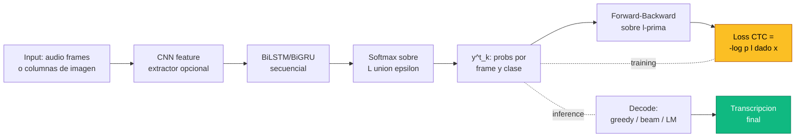

La **Connectionist Temporal Classification** (CTC) es una funcion de perdida disenada para entrenar redes recurrentes sobre **problemas seq2seq donde no se conoce el alineamiento** entre los frames de la entrada y los simbolos de la salida. Es la pieza que vuelve viable el reconocimiento end-to-end de voz, texto escrito a mano, escenas con texto (STR), gestos y partituras musicales, sin necesidad de alinear cada frame a un fonema o caracter por separado.

Fue introducida por Graves, Fernandez, Gomez y Schmidhuber en **ICML 2006** (ver paper [Connectionist Temporal Classification](/papers/ctc-graves-2006)). Antes de CTC, los sistemas state-of-the-art en ASR dependian de HMM-DNN hibridos con **forced alignment** -- un paso costoso que requeria datos etiquetados a nivel de frame. CTC fue uno de los primeros casos en que una red neuronal pura, sin componentes generativos clasicos, logro competir con sistemas HMM tradicionales en tareas de secuencia.

---

## 1. El Problema que Resuelve

Supongamos que tenemos un audio de 1000 frames y queremos transcribir "hola mundo" (10 caracteres). ¿Como entrena una RNN cuando:

- La entrada tiene $T = 1000$ pasos.
- La salida tiene $U = 10$ caracteres.
- **No conocemos** en que frame ocurre cada caracter.
- Distintas grabaciones del mismo texto producen $T$ muy diferentes (habla rapido/lento).

Existen tres enfoques historicos:

**1) HMM con forced alignment (pre-CTC)**. Un sistema HMM-GMM se entrena primero, alinea cada frame con un fonema, y luego una red neuronal aprende a predecir fonemas frame-a-frame. Funciona, pero requiere:
- Diccionarios fonetic (lexicon).
- Modelos GMM pre-entrenados.
- Re-alineamiento iterativo.
- Decoders complejos (WFST, Kaldi).

**2) Clasificacion directa por frame**. Predice un caracter por frame y luego colapsa repetidos. Imposible sin etiquetas per-frame, que son carisimas de anotar (~10x el tiempo de la transcripcion).

**3) CTC (Graves 2006)**. Entrena la red sobre la **transcripcion completa**, sin alinear frames a caracteres. Internamente, suma la probabilidad sobre **todas las alineaciones posibles** y deja que la red descubra cual prefiere. La idea fue revolucionaria: una RNN bidireccional, un softmax con una clase extra ($\epsilon$), y una loss basada en dynamic programming -- nada mas. No hace falta GMM, ni lexicon, ni decoder externo durante el entrenamiento.


CTC marginaliza sobre las alineaciones latentes. El usuario solo provee pares `(audio, transcripcion)` o `(imagen, texto)` -- ninguna anotacion por frame. La red aprende implicitamente donde colocar cada caracter dentro de la secuencia de entrada.


---

## 2. El Blank Symbol y el Alphabet Aumentado

CTC introduce un simbolo especial $\epsilon$ (blank) que **no aparece** en la transcripcion final pero si en las predicciones por frame. El alphabet aumentado es:

$$\mathcal{L}' = \mathcal{L} \cup \{\epsilon\}$$

Por ejemplo, si $\mathcal{L} = \{a, b, c, \ldots, z, \text{ }\}$, entonces $|\mathcal{L}'| = 28$ (27 caracteres + blank).

La red produce en cada frame $t$ una distribucion softmax $y^t \in \mathbb{R}^{|\mathcal{L}'|}$ sobre el alphabet aumentado. La componente $y^t_k$ es la probabilidad de que la clase $k$ aparezca en el frame $t$.

### ¿Por que necesitamos blank?

Sin blank, no podriamos distinguir:

- `"hello"` -- una `l` doble real.
- `"helo"` -- una sola `l` que se sostuvo varios frames.

Con blank, las dos secuencias se diferencian:

- `"hello"` -> path tipico `h-eeee-l-l-oo` (blank entre las dos `l`).
- `"helo"` -> path tipico `h-eeee-lll-oo` (sin blank entre las `l` repetidas).

El blank funciona como **separador explicito** de boundaries entre caracteres y como token de "silencio" o "nada que decir aqui". En audio corresponde tipicamente a silencios, transiciones entre fonemas o regiones de baja energia. En STR corresponde a espacios verticales entre caracteres o regiones de fondo. La red **decide por si misma** que significa blank -- no se le dice explicitamente, solo emerge como subproducto del entrenamiento.

Detalle de implementacion: por convencion casi universal se reserva la clase **0** para blank. Las librerias como `torch.nn.CTCLoss` asumen `blank=0` por defecto, lo que implica que el rango valido de targets es $[1, C-1]$. Pasar un target con valor 0 produce un error o comportamiento indefinido.

---

## 3. Paths y el Mapping $\mathcal{B}$

### 3.1 Definiciones

Un **path** $\pi \in \mathcal{L}'^T$ es una secuencia de $T$ simbolos del alphabet aumentado, uno por frame. Por ejemplo, con $T = 9$ y alphabet $\{a, b, c, \epsilon\}$:

$$\pi = (a, a, \epsilon, a, b, b, \epsilon, c, c)$$

El **mapping** $\mathcal{B}: \mathcal{L}'^T \to \mathcal{L}^{\leq T}$ proyecta el path al texto final mediante dos pasos:

1. **Collapse de repetidos**: caracteres consecutivos identicos se colapsan en uno solo.
2. **Remove blanks**: todos los $\epsilon$ se eliminan.

### 3.2 Ejemplo paso a paso

Path: $\pi = (\epsilon, a, a, \epsilon, b, b, \epsilon, c, c, \epsilon)$ con $T = 10$.

```text
Paso 1 - Collapse de repetidos consecutivos:
  (-, a, a, -, b, b, -, c, c, -)  ->  (-, a, -, b, -, c, -)

Paso 2 - Remove blanks:
  (-, a, -, b, -, c, -)  ->  (a, b, c)
```

Resultado: $\mathcal{B}(\pi) = \text{"abc"}$.

### 3.3 Multiples paths para la misma label

La pre-imagen $\mathcal{B}^{-1}(\text{"abc"})$ contiene **muchos** paths distintos, todos validos:

| Path | Tras collapse | Tras remove blanks |
|---|---|---|
| `aaabbbccc` | `abc` | `abc` |
| `-a-b-c-` | `-a-b-c-` | `abc` |
| `aabbcc--` | `abc--` | `abc` |
| `a-bcc--c` | `a-bc-c` | `abcc` X |
| `a-b-cc-` | `a-b-c-` | `abc` |

Cuidado con el cuarto ejemplo: dos `c` separadas por blank **no** colapsan, asi que sobreviven dos `c` al final -> "abcc", no "abc". El blank es lo unico que **separa** repeticiones del mismo caracter.

### 3.4 Restriccion de longitud

Como cada caracter de $\mathbf{l}$ necesita al menos un frame en el path, se cumple:

$$|\mathbf{l}| + \#\text{repeticiones-consecutivas-de-} \mathbf{l} \leq T$$

En particular, $|\mathbf{l}| \leq T$ siempre. Si la transcripcion es "aa" y $T = 1$, no existe path valido -- CTC requiere $T \geq |\mathbf{l}'|$ con $\mathbf{l}'$ el extended sequence (siguiente seccion).

---

## 4. Likelihood: La Suma sobre Alineaciones

### 4.1 Asuncion de independencia condicional

CTC asume que la probabilidad de cada path se factoriza en el tiempo:

$$p(\pi \mid \mathbf{x}) = \prod_{t=1}^{T} y^t_{\pi_t}$$

Esto es: dado el input $\mathbf{x}$, los simbolos en distintos frames son condicionalmente independientes. La red usa una RNN bidireccional para que cada $y^t$ sea informado por toda la secuencia, pero la **factorizacion sobre $\pi$** es independiente. Esta es la asuncion clave de CTC -- la criticaremos en la seccion 9.

### 4.2 Probabilidad de la label

La probabilidad de una transcripcion $\mathbf{l}$ se obtiene **sumando sobre todos los paths que mapean a ella**:


p(\mathbf{l} \mid \mathbf{x}) = \sum_{\pi \in \mathcal{B}^{-1}(\mathbf{l})} p(\pi \mid \mathbf{x}) = \sum_{\pi \in \mathcal{B}^{-1}(\mathbf{l})} \prod_{t=1}^{T} y^t_{\pi_t}


### 4.3 Loss CTC

Dado un dataset $\mathcal{S} = \{(\mathbf{x}^{(n)}, \mathbf{l}^{(n)})\}_{n=1}^N$, la loss es la log-likelihood negativa:

$$\mathcal{L}_{\text{CTC}} = -\sum_{(\mathbf{x}, \mathbf{l}) \in \mathcal{S}} \log p(\mathbf{l} \mid \mathbf{x})$$

Minimizar $\mathcal{L}_{\text{CTC}}$ equivale a maximizar la probabilidad de cada transcripcion verdadera, sumada sobre todas las alineaciones posibles. La red queda libre de **elegir su propia alineacion** -- mientras el agregado sea consistente con $\mathbf{l}$, cualquier path interno es valido.


El numero de paths en $\mathcal{B}^{-1}(\mathbf{l})$ crece exponencialmente con $T$. Para $T = 100$ y $|\mathbf{l}| = 5$, hay $\binom{T}{2U+1} \cdot \text{(combinaciones internas)}$ paths. Calcular la suma directamente es intratable. CTC usa **dynamic programming** (forward-backward) para hacerlo en $O(T \cdot U)$.


---

## 5. El Algoritmo Forward-Backward

El truco para sumar eficientemente sobre paths es identico al algoritmo Baum-Welch de HMMs.

### 5.1 Extended sequence

Primero se construye la **secuencia extendida** $\mathbf{l}'$ insertando blanks alrededor de cada caracter:

$$\mathbf{l}' = (\epsilon, l_1, \epsilon, l_2, \epsilon, \ldots, l_U, \epsilon)$$

Su longitud es $2U + 1$. Por ejemplo, para $\mathbf{l} = \text{"cat"}$:

$$\mathbf{l}' = (\epsilon, c, \epsilon, a, \epsilon, t, \epsilon), \quad |\mathbf{l}'| = 7$$

Esta forma garantiza que toda transicion valida del DP se enumere correctamente: entre dos caracteres siempre cabe un blank (opcional), y entre dos caracteres **identicos consecutivos** un blank es **obligatorio** para que no colapsen.

### 5.2 Forward variable

Se define $\alpha_t(s)$ como la **suma de las probabilidades de todos los paths de longitud $t$** que terminan en la posicion $s$ de $\mathbf{l}'$:

$$\alpha_t(s) = \sum_{\substack{\pi_{1:t} \, : \, \mathcal{B}(\pi_{1:t}) = \mathbf{l}'_{1:s} \\ \pi_t = l'_s}} \prod_{t'=1}^{t} y^{t'}_{\pi_{t'}}$$

**Inicializacion** ($t = 1$): solo se puede empezar en blank o en el primer caracter de $\mathbf{l}$:

$$\alpha_1(1) = y^1_{\epsilon}, \quad \alpha_1(2) = y^1_{l_1}, \quad \alpha_1(s) = 0 \text{ para } s > 2$$

**Recurrencia**. En el paso $t$, la posicion $s$ puede haber llegado desde $s$ (quedarse), $s-1$ (avanzar al siguiente simbolo) o $s-2$ (saltar un blank intermedio, solo si no se rompe el agrupamiento). La regla es:


\alpha_t(s) = y^t_{l'_s} \cdot \begin{cases}
\alpha_{t-1}(s) + \alpha_{t-1}(s-1) & \text{si } l'_s = \epsilon \text{ o } l'_s = l'_{s-2} \\
\alpha_{t-1}(s) + \alpha_{t-1}(s-1) + \alpha_{t-1}(s-2) & \text{caso general}
\end{cases}


El caso de excepcion previene dos saltos consecutivos cuando hay caracteres repetidos: para $\mathbf{l} = \text{"aa"}$, $\mathbf{l}' = (\epsilon, a, \epsilon, a, \epsilon)$ -- el segundo `a` solo puede alcanzarse pasando por el blank intermedio, sino las dos `a` colapsarian.

### 5.3 Backward variable

Simetricamente, $\beta_t(s)$ es la suma de probabilidades de los suffixes $\pi_{t:T}$ que comienzan en posicion $s$ y completan correctamente $\mathbf{l}'$:

$$\beta_T(|\mathbf{l}'|) = y^T_{\epsilon}, \quad \beta_T(|\mathbf{l}'| - 1) = y^T_{l_U}$$

con recurrencia analoga hacia atras.

### 5.4 Probabilidad total

Sumando los dos finales validos (terminar en el ultimo caracter de $\mathbf{l}$ o en el blank final):

$$p(\mathbf{l} \mid \mathbf{x}) = \alpha_T(|\mathbf{l}'|) + \alpha_T(|\mathbf{l}'| - 1)$$

Equivalentemente, **para cualquier $t$**:

$$p(\mathbf{l} \mid \mathbf{x}) = \sum_{s=1}^{|\mathbf{l}'|} \frac{\alpha_t(s) \, \beta_t(s)}{y^t_{l'_s}}$$

Esta ultima identidad es la base del calculo del gradiente.

### 5.5 Complejidad

- **Tiempo**: $O(T \cdot |\mathbf{l}'|) = O(T \cdot U)$ por ejemplo.
- **Memoria**: $O(T \cdot U)$ para almacenar $\alpha$ y $\beta$.
- **Estabilidad numerica**: se trabaja en log-space o con escalamiento por $t$ para evitar underflow (los productos de probabilidades son astronomicamente pequenos).

La estructura es identica a Baum-Welch en HMMs, lo cual no es coincidencia: CTC es un HMM con topologia restringida (forward-only sobre el extended sequence) y sin transition probabilities aprendibles.

### 5.6 Ejemplo numerico minimo

Para ilustrar, considera la transcripcion $\mathbf{l} = \text{"ab"}$, alphabet $\{a, b, \epsilon\}$ y $T = 4$ frames. La secuencia extendida es:

$$\mathbf{l}' = (\epsilon, a, \epsilon, b, \epsilon), \quad |\mathbf{l}'| = 5$$

Asumimos salidas softmax constantes en cada frame (caso ilustrativo):

$$y^t_\epsilon = 0.5, \quad y^t_a = 0.3, \quad y^t_b = 0.2 \quad \forall t \in \{1, 2, 3, 4\}$$

**Forward** (mostrando solo posiciones validas):

```text
t=1:  alpha(1)=0.5 (epsilon)
      alpha(2)=0.3 (a)
      alpha(s>2)=0

t=2:  alpha(1) = 0.5 * alpha_1(1) = 0.25
      alpha(2) = 0.3 * (alpha_1(1) + alpha_1(2)) = 0.3 * 0.8 = 0.24
      alpha(3) = 0.5 * (alpha_1(2) + alpha_1(1)) = 0.5 * 0.8 = 0.40  (l'_3=epsilon)
      alpha(4) = 0.2 * (alpha_1(2) + alpha_1(3) + alpha_1(1)) = 0.2 * 0.8 = 0.16

t=3:  alpha(1) = 0.5 * 0.25 = 0.125
      alpha(2) = 0.3 * (0.25 + 0.24) = 0.147
      alpha(3) = 0.5 * (0.24 + 0.40) = 0.320
      alpha(4) = 0.2 * (0.24 + 0.40 + 0.16) = 0.160
      alpha(5) = 0.5 * (0.16 + 0.40) = 0.280

t=4:  alpha(4) = 0.2 * (alpha_3(4) + alpha_3(3) + alpha_3(2)) = 0.2 * 0.627 = 0.1254
      alpha(5) = 0.5 * (alpha_3(5) + alpha_3(4)) = 0.5 * 0.44 = 0.220

p(l|x) = alpha_T(5) + alpha_T(4) = 0.220 + 0.1254 ~ 0.345
```

Comparacion con greedy: el path $(a, a, b, b)$ tiene probabilidad $0.3^2 \cdot 0.2^2 = 0.0036$, varias ordenes de magnitud por debajo de la suma total -- ilustra por que sumar sobre paths captura mucha mas masa de probabilidad que cualquier path individual.

---

## 6. El Gradiente

Diferenciando $-\log p(\mathbf{l} \mid \mathbf{x})$ con respecto a las salidas pre-softmax $z^t_k$ y usando la identidad de la seccion 5.4:


\frac{\partial \mathcal{L}_{\text{CTC}}}{\partial y^t_k} = -\frac{1}{p(\mathbf{l} \mid \mathbf{x})} \sum_{s \, : \, l'_s = k} \frac{\alpha_t(s) \, \beta_t(s)}{y^t_k}


La suma $\sum_{s : l'_s = k}$ recorre todas las posiciones de la secuencia extendida donde aparece el simbolo $k$. Si $k$ no aparece en $\mathbf{l}'$, esta derivada es cero -- ese caracter no recibe senal directa, solo a traves de la normalizacion softmax (los demas caracteres compiten contra el).

Combinado con la derivada del softmax ($\partial y / \partial z = \text{diag}(y) - y y^T$), el gradiente respecto a los logits $z^t_k$ se simplifica a:

$$\frac{\partial \mathcal{L}_{\text{CTC}}}{\partial z^t_k} = y^t_k - \frac{1}{p(\mathbf{l} \mid \mathbf{x})} \sum_{s \, : \, l'_s = k} \alpha_t(s) \, \beta_t(s)$$

Es decir: **gradiente = prediccion - alineamiento posterior esperado**. La forma es identica a la combinacion softmax + cross-entropy ($\hat{y} - y$, ver [funciones de perdida](/fundamentos/funciones-perdida)), pero con la "etiqueta" $y$ reemplazada por la responsabilidad posterior calculada via forward-backward. Desde aqui se hace backprop estandar a traves de la RNN (BiLSTM en el paper original).

---

## 7. Decoding (Inference)

Durante inference no se evalua una etiqueta conocida -- se busca **la mejor transcripcion** dada la salida de la red. Cuatro estrategias:

### 7.1 Greedy / best path

$$\pi^* = \left( \arg\max_k y^t_k \right)_{t=1}^{T}, \quad \mathbf{l}^* = \mathcal{B}(\pi^*)$$

Toma el simbolo mas probable en cada frame y aplica el mapping. Complejidad $O(T \cdot |\mathcal{L}'|)$. **Simple, rapido, NO optimo**: maximiza $p(\pi)$ pero no $p(\mathbf{l})$, porque distintos paths pueden colapsar al mismo label (la suma sobre ellos podria superar la masa del best path).

### 7.2 Best label (exacto)

$$\mathbf{l}^* = \arg\max_{\mathbf{l}} p(\mathbf{l} \mid \mathbf{x})$$

Optimo, pero **NP-hard** en general. Inviable.

### 7.3 Beam search con prefix tracking

Mantiene los $B$ prefixes mas probables y, para cada nuevo frame, expande considerando que distintos extensions pueden colapsar al mismo prefix. La estructura del algoritmo, debida a Graves y Jaitly (2014), distingue para cada prefix dos cantidades:

- $p_b(\ell, t)$: probabilidad de que el prefix $\ell$ termine en blank en el frame $t$.
- $p_{nb}(\ell, t)$: probabilidad de que termine en un caracter no-blank.

La separacion es necesaria porque al extender con un caracter $c$ debemos saber si el caracter actual repite o no el ultimo del prefix (si repite, solo se puede transicionar desde el estado terminado en blank, sino las dos copias colapsarian). En cada paso se actualizan ambas, se suma $p(\ell, t) = p_b + p_{nb}$ y se conservan los top-$B$ prefixes. Con beam $B \in [50, 500]$ se obtiene una buena aproximacion al argmax exacto. Es la estrategia estandar en produccion (DeepSpeech, wav2vec, EasyOCR).

### 7.4 Lexicon-constrained y LM fusion

- **Lexicon-constrained decoding**: restringe $\mathbf{l}$ a estar en un vocabulario cerrado (ej. STR con SVT 50-word lexicon). Eleva drasticamente la accuracy en datasets con vocabulario conocido.
- **Shallow fusion con language model**:

$$\hat{\mathbf{l}} = \arg\max_{\mathbf{l}} \left[ \log p(\mathbf{l} \mid \mathbf{x}) + \alpha \log p_{\text{LM}}(\mathbf{l}) + \beta |\mathbf{l}| \right]$$

con $\alpha$ peso del LM y $\beta$ termino de longitud (word insertion bonus). Es como ASR clasica integra n-gram LMs externos.

---

## 8. Diagrama del flujo CTC



---

## 9. Propiedades y Criticas

### 9.1 Conditional independence

La asuncion $p(\pi \mid \mathbf{x}) = \prod_t y^t_{\pi_t}$ **ignora la dependencia entre caracteres**. Si el modelo predice "cat" en los primeros frames, nada en CTC obliga a que los siguientes frames sean coherentes con esa eleccion. La consistencia global proviene solo del encoder (BiLSTM ve todo el input), no del decoder.

Esto explica por que CTC se beneficia tanto del **language model externo**: el LM provee la dependencia output-output que CTC no modela. Las arquitecturas posteriores (RNN-Transducer, Listen-Attend-Spell) abandonan esta asuncion.

### 9.2 Peaky behavior

Redes entrenadas con CTC tipicamente producen distribuciones **muy picudas en blank** (>90% de los frames predicen blank con confianza alta) y picos cortos para cada caracter real. El fenomeno ha sido estudiado formalmente por Zeyer et al. (Interspeech 2021) y por Liu et al. (ICML 2018), que demostraron que la optimizacion CTC tiene un **bias estructural** hacia soluciones peaky: el gradiente premia mover masa a blank cuando hay ambiguedad porque blank "siempre puede ser correcto" sin riesgo de romper el alineamiento monotonico. Las consecuencias practicas son:

- Hace el decoding facil (el best path domina y el greedy decode es razonable).
- Pero produce **calibracion mala**: las probabilidades por frame no son interpretables como confidence.
- Frames intermedios reciben poca senal de gradiente -- la red no aprende donde "no esta diciendo nada".
- Dificulta tareas downstream que requieren **timing preciso** (subtitulado, sincronizacion labial, alignment forzado para diarization). Hay que usar Viterbi alignment como post-proceso.
- Mitigaciones reportadas: **label smoothing** sobre la salida, **entropy regularization** explicita ($+\lambda H(y^t)$) y **CTC con guided attention** (CTC + auxiliary attention loss).

### 9.3 Length constraint

$|\mathbf{l}| \leq T$ -- si la transcripcion es mas larga que la entrada, CTC no puede entrenar. Soluciones:

- **Upsample del input**: stride 1 en convoluciones de la columna espectral.
- **Sub-word units**: BPE/WordPiece reduce $|\mathbf{l}|$.
- **Character-level**: requiere $T$ suficientemente largo.

### 9.4 Monotonic alignment

CTC asume que el alineamiento avanza **monotonamente** en el tiempo: si el caracter $l_i$ se alinea con el frame $t$, entonces $l_{i+1}$ se alinea con $t' \geq t$. Esto sirve bien para:

- ASR (el audio se reproduce en orden).
- STR horizontal (las letras estan de izquierda a derecha).
- Handwriting (escritura secuencial).

Pero **NO sirve** para tareas con reordenamiento, como **traduccion** (orden de palabras distinto en lenguas), o STR con texto curvo/vertical. Para esos casos se usa attention-based decoder (ver [mecanismo de atencion](/fundamentos/mecanismo-atencion)).

---

## 10. Variantes y Extensiones

### 10.1 RNN-Transducer (Graves 2012)

Anade una **prediction network** (en esencia, un language model interno) que toma como input los outputs anteriores. La probabilidad de un alineamiento se factoriza ahora como $p(\pi \mid \mathbf{x}, \mathbf{l}_{<u})$, eliminando la conditional independence sobre los outputs. La loss se calcula con un forward-backward 2D sobre la grilla $(t, u)$ -- complejidad $O(T \cdot U)$ pero con constante mayor. Las salidas pueden emitir un caracter sin avanzar en $t$, lo cual hace al RNN-T mas flexible en alineamiento que CTC puro. Es la base de los sistemas streaming de Google Assistant, Amazon Alexa y Apple Siri, donde la baja latencia es critica.

### 10.2 Hybrid CTC-Attention (Watanabe et al. 2017)

Suma la loss CTC y la loss de un seq2seq con attention:

$$\mathcal{L} = \lambda \mathcal{L}_{\text{CTC}} + (1 - \lambda) \mathcal{L}_{\text{Att}}$$

con $\lambda \in [0.2, 0.5]$. La rama CTC fuerza alineamiento monotonico y la rama attention modela dependencias output-output. Mejor que cualquiera por separado en ASR. ESPnet implementa este esquema por defecto.

### 10.3 Gumbel-CTC y variantes diferenciables

Permiten muestrear alineamientos con straight-through gradient para tareas tipo joint speech-text.

### 10.4 MMI training

Maximum Mutual Information sobre paths -- refinement de la era HMM-DNN, todavia se usa en Kaldi.

---

## 11. Aplicaciones Masivas

| Sistema | Ano | Tarea | Comentario |
|---|---|---|---|
| **DeepSpeech** (Hannun et al., Baidu) | 2014 | ASR end-to-end | Primer sistema CTC competitivo con HMM-DNN |
| **DeepSpeech 2** | 2015 | ASR ingles/mandarin | Bidireccional + lookahead |
| **Mozilla DeepSpeech** | 2018 | ASR open-source | Modelo CTC + KenLM externo |
| **CRNN** (Shi et al.) | 2017 | Scene Text Recognition | CNN + BiLSTM + CTC. Ver paper [CRNN](/papers/crnn-shi-2017) |
| **EasyOCR** | 2020 | OCR multi-lengua | Backbone CRNN |
| **Wav2Vec 2.0** (Baevski et al.) | 2020 | ASR self-supervised | Pre-training contrastivo + CTC head para fine-tuning |
| **Whisper** (OpenAI) | 2022 | ASR + traduccion | Encoder-decoder attention, pero variantes CTC |
| **PaddleOCR PP-OCRv4** | 2023 | OCR producccion | Recognition head con CTC |

CTC sigue vivo en 2025 como **head ligero** sobre encoders pre-entrenados (wav2vec, HuBERT, ViT). Pocas lineas de codigo, training rapido, decoding paralelo. La receta moderna es:

1. **Pre-train** el encoder con objetivo self-supervised (contrastive en wav2vec, masked en HuBERT, image-text en CLIP variants).
2. **Fine-tune** anadiendo una capa lineal `hidden -> |alphabet|+1` y minimizando CTC loss sobre datos etiquetados.
3. **Decode** con beam search + LM externo (n-gram KenLM, o transformer-LM mediante shallow fusion).

Este pipeline alcanzo state-of-the-art en LibriSpeech en 2020-2021 con apenas **10 minutos de audio etiquetado** (Baevski et al. 2020), gracias a que el encoder hace casi todo el trabajo y CTC actua como un puente eficiente al espacio simbolico.

---

## 12. Implementacion Practica

### 12.1 PyTorch

```python
import torch
import torch.nn as nn

# CTCLoss espera log-probabilidades, no logits crudos
ctc_loss = nn.CTCLoss(blank=0, zero_infinity=True, reduction='mean')

# Input: log-probs de shape (T, N, C)
#   T = frames de salida (largo de la secuencia tras la RNN)
#   N = batch size
#   C = numero de clases (incluye blank)
T, N, C = 50, 16, 28      # 27 caracteres + 1 blank
log_probs = torch.randn(T, N, C).log_softmax(dim=2).requires_grad_()

# Targets: concatenados (flat) y longitudes
# Ejemplo: 16 transcripciones, cada una de largo variable 5-15
target_lengths = torch.randint(5, 15, (N,))
total = target_lengths.sum().item()
targets = torch.randint(1, C, (total,))   # 0 reservado para blank

# Lengths del input por sample (todos T en este caso)
input_lengths = torch.full((N,), T, dtype=torch.long)

loss = ctc_loss(log_probs, targets, input_lengths, target_lengths)
loss.backward()
print(f"CTC loss: {loss.item():.4f}")
```

**Detalles criticos**:

- **`blank=0`**: por convencion, la clase 0 es el blank. Los targets no pueden contener 0.
- **`log_softmax(dim=2)`** antes de pasar a CTCLoss -- nunca probabilidades crudas (problema numerico) ni logits sin normalizar.
- **`zero_infinity=True`**: cuando una muestra no tiene path valido (target mas largo que input), la loss seria infinita; este flag la pone en 0 con gradiente 0 para no romper el batch.
- **Shape `(T, N, C)`** -- la libreria espera time-major, no batch-first.
- **Targets flat**: se concatenan todas las transcripciones del batch y se pasan las longitudes en un tensor separado. Mas eficiente que padding.

### 12.2 Pipeline completo para STR

```python
import torch
import torch.nn as nn

class CRNN(nn.Module):
    """CNN -> BiLSTM -> Linear -> log_softmax. Salida para CTCLoss."""
    def __init__(self, num_classes, hidden=256):
        super().__init__()
        # CNN reduce H a 1 y W a T (frames de salida)
        self.cnn = nn.Sequential(
            nn.Conv2d(1, 64, 3, padding=1), nn.ReLU(), nn.MaxPool2d(2),
            nn.Conv2d(64, 128, 3, padding=1), nn.ReLU(), nn.MaxPool2d(2),
            nn.Conv2d(128, 256, 3, padding=1), nn.ReLU(),
            nn.Conv2d(256, 256, 3, padding=1), nn.ReLU(),
            nn.MaxPool2d((2, 1)),  # reduce solo en altura
        )
        self.rnn = nn.LSTM(256, hidden, num_layers=2,
                           bidirectional=True, batch_first=False)
        self.fc = nn.Linear(hidden * 2, num_classes)  # +1 blank incluida

    def forward(self, x):
        # x: (N, 1, H=32, W)
        feat = self.cnn(x)             # (N, 256, 1, T)
        feat = feat.squeeze(2)         # (N, 256, T)
        feat = feat.permute(2, 0, 1)   # (T, N, 256)
        rnn_out, _ = self.rnn(feat)    # (T, N, 2*hidden)
        logits = self.fc(rnn_out)      # (T, N, num_classes)
        return logits.log_softmax(dim=2)

model = CRNN(num_classes=37)  # 26 letras + 10 digitos + blank
ctc = nn.CTCLoss(blank=0, zero_infinity=True)

# Training step
images = torch.randn(16, 1, 32, 128)
log_probs = model(images)  # (T, 16, 37)
T = log_probs.size(0)
input_lengths = torch.full((16,), T)
target_lengths = torch.randint(3, 10, (16,))
targets = torch.randint(1, 37, (target_lengths.sum().item(),))
loss = ctc(log_probs, targets, input_lengths, target_lengths)
```

Este patron `CNN + BiLSTM + CTC head` es exactamente la arquitectura **CRNN** de Shi et al. 2017 (paper [CRNN](/papers/crnn-shi-2017)), que sigue siendo competitiva en STR regular.

### 12.3 Decoding greedy

```python
def greedy_decode(log_probs, blank=0):
    """log_probs: (T, N, C). Devuelve lista de listas de indices."""
    best = log_probs.argmax(dim=2)       # (T, N)
    best = best.transpose(0, 1)           # (N, T)
    results = []
    for seq in best:
        decoded, prev = [], -1
        for k in seq.tolist():
            if k != prev and k != blank:
                decoded.append(k)
            prev = k
        results.append(decoded)
    return results
```

Para beam search con LM, usar libraries como `pyctcdecode` o `torchaudio.models.decoder.ctc_decoder`.

### 12.4 Warp-CTC y kernels GPU

Antes de que PyTorch tuviera `nn.CTCLoss` nativa, Baidu publico **warp-ctc** (2016) -- implementacion CUDA optimizada del forward-backward. Hoy las librerias frameworks incluyen kernels propios suficientemente buenos.

---

## 13. CTC vs Attention para Scene Text Recognition

| Aspecto | CTC | Attention seq2seq |
|---|---|---|
| **Alineamiento** | Monotonico forzado | Aprendido libre |
| **Inference** | Paralelizable | Secuencial autoregresivo |
| **Velocidad** | Rapida | Lenta |
| **Texto regular horizontal** | Excelente | Excelente |
| **Texto curvo/irregular** | Limitado | Mejor |
| **Texto rotado o vertical** | Falla | Funciona con rectificacion |
| **Dependencia output-output** | No (asuncion CI) | Si (autoregresivo) |
| **Estabilidad de entrenamiento** | Alta | Mas delicada |
| **Modelos representativos** | CRNN, EasyOCR | SAR, ASTER, ABCNet |

**Caso ilustrativo**: el paper [ABCNet (Liu et al. 2020)](/papers/abcnet-liu-2020) usa explicitamente un recognizer **attention-based** y no CTC, porque ABCNet detecta texto curvo via BezierAlign y el alineamiento monotonico ya no se mantiene en el espacio de la curva.

**Practica moderna**: arquitecturas hibridas y permutation-based (PARSeq 2022, MGP-STR 2022, ABINet 2021) superan tanto a CTC puro como a attention puro en irregular STR. CTC sigue vigente cuando se prioriza **latencia de inference** (mobile OCR, real-time ASR).

---

## 14. Conexiones con el Resto del Curso

CTC se apoya en y conecta con:

- **[Funciones de perdida](/fundamentos/funciones-perdida)** -- CTC es una loss especifica para seq2seq sin alineamiento; el gradiente conserva la forma "prediccion menos target" del par softmax+CE.
- **[Redes recurrentes](/fundamentos/redes-recurrentes)** y **[LSTM/GRU](/fundamentos/lstm-gru)** -- la arquitectura tipica CTC tiene BiLSTM como backbone (Clases 10 y 13).
- **[Backpropagation through time](/fundamentos/backpropagation-through-time)** -- el gradiente CTC se propaga via BPTT.
- **[Mecanismo de atencion](/fundamentos/mecanismo-atencion)** -- alternativa principal a CTC para seq2seq, especialmente cuando el alineamiento no es monotonico (Clase 15).
- **[Redes convolucionales](/fundamentos/redes-convolucionales)** -- backbone CNN extractor para STR (Clase 09).
- **Clase 21** -- Scene Text Recognition usa CTC en el recognizer de CRNN y compite con attention en arquitecturas modernas.

Papers de referencia en el site:

- [CTC original (Graves et al. 2006)](/papers/ctc-graves-2006) -- formulacion fundacional.
- [CRNN (Shi et al. 2017)](/papers/crnn-shi-2017) -- aplicacion canonica a STR.
- [ABCNet (Liu et al. 2020)](/papers/abcnet-liu-2020) -- contraste con recognizer attention-based.

---

## 15. Resumen

- **CTC entrena seq2seq sin alineamiento** sumando sobre todas las alineaciones posibles entre frames de entrada y caracteres de salida.
- Introduce un **blank symbol** $\epsilon$ que separa caracteres y representa "nada que decir".
- Un **mapping $\mathcal{B}$** colapsa repetidos consecutivos y elimina blanks para obtener la transcripcion final.
- La probabilidad de una label $\mathbf{l}$ es la **suma sobre todos los paths** que mapean a ella, calculada en $O(T \cdot U)$ via **forward-backward**.
- El **gradiente toma la forma** $y^t_k - \text{posterior}(s, t)$, identica en espiritu al gradiente de softmax+CE pero con etiqueta blanda calculada por DP.
- Decoding va de **greedy** (rapido, sub-optimo) a **beam search con LM** (lento, mejor accuracy).
- Limitaciones: **conditional independence**, **peaky outputs**, **alineamiento monotonico**, $|\mathbf{l}| \leq T$.
- Sigue siendo el head estandar para ASR (DeepSpeech, wav2vec) y STR regular (CRNN, EasyOCR). En texto irregular y traduccion se prefiere attention.

Ver tambien: [funciones de perdida](funciones-perdida) · [redes recurrentes](redes-recurrentes) · [LSTM y GRU](lstm-gru) · [mecanismo de atencion](mecanismo-atencion) · [paper CTC original](/papers/ctc-graves-2006) · [paper CRNN](/papers/crnn-shi-2017) · [paper ABCNet](/papers/abcnet-liu-2020).
