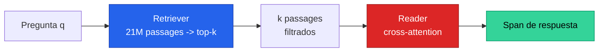
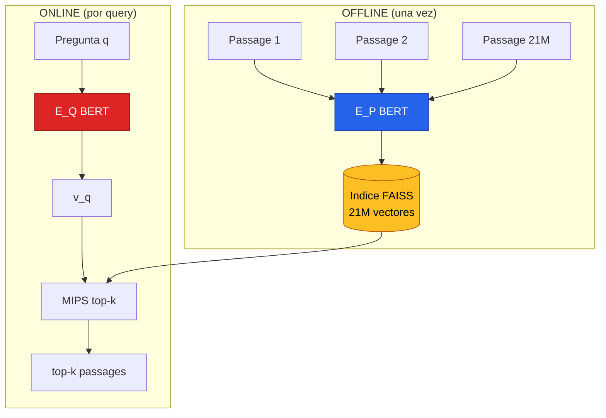
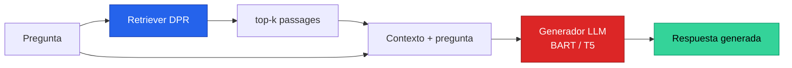

El **dense retrieval** es la tecnica de recuperar documentos relevantes mapeando consultas y documentos a **vectores densos** en un espacio donde la cercania geometrica equivale a relevancia semantica. Es la pieza que, desde 2020, transformo el **open-domain question answering** (responder preguntas sobre colecciones gigantes de texto sin saber de antemano donde esta la respuesta) y que hoy sostiene a casi todos los sistemas de **RAG** (retrieval-augmented generation) que alimentan LLMs con conocimiento externo.

Su materializacion canonica es **DPR** (Dense Passage Retrieval, Karpukhin et al., Facebook AI, EMNLP 2020), que demostro algo contraintuitivo: un par de encoders BERT entrenados con el **regimen correcto** supera ampliamente al venerable BM25, usando sorprendentemente pocos pares pregunta-passage etiquetados. Este fundamento desarrolla la idea desde el problema original hasta sus descendientes (ColBERT, ANCE, RAG) y la conecta con el **matching/blocking** que aparece en entity matching y patient matching.

---

## 1. El Problema: Retriever + Reader

El **open-domain QA** responde preguntas factoides (*"Who first voiced Meg on Family Guy?"*, *"Where was the 8th Dalai Lama born?"*) usando una coleccion grande de documentos. El reto: la respuesta es un **span** de texto que vive en algun lugar de un corpus de **millones** de documentos, y no sabemos cual de antemano.

Pasar todos los documentos por un modelo de lectura comprensiva en cada pregunta es inviable: el corpus de Wikipedia que usa DPR tiene **21,015,324 passages** (~21M). La solucion, consolidada por DrQA (Chen et al. 2017), es una **arquitectura de dos etapas**:

1. **Retriever** $R: (q, C) \to C_F$ — toma una pregunta $q$ y un corpus $C = \{p_1, \ldots, p_M\}$, y devuelve un subconjunto pequeno $C_F \subset C$ con $|C_F| = k \ll |C|$ (tipicamente $k = 20$ o $100$). Resuelve el problema de **escala** y **recall**.
2. **Reader** — un modelo de machine reading comprehension (tipicamente BERT con cross-attention) que examina solo esos $k$ passages e identifica el span exacto de respuesta. Resuelve la **precision fina**.


El retriever NO necesita encontrar la respuesta, solo **acotar el espacio de busqueda** sin perder el passage correcto (alto recall). El reader hace el trabajo fino. Esta division de labores es identica a la de **blocking + scoring** en entity matching: un componente barato reduce candidatos, uno caro decide.


El paper de DPR valida empiricamente la segunda mitad de la promesa: **mayor precision de retrieval se traduce en mayor accuracy end-to-end**. Mejorar el retriever mejora todo el pipeline.

---

## 2. Retrieval Sparse Clasico: TF-IDF y BM25

El retriever tradicional era **TF-IDF** o **BM25** (Robertson y Zaragoza, 2009): representan pregunta y documento como vectores **sparse de altisima dimension** (una dimension por termino del vocabulario, casi todas en cero) y emparejan keywords eficientemente con un **indice invertido**.

**BM25** es la funcion de scoring de facto. Para una consulta $q$ con terminos $t_1, \ldots, t_n$ y un documento $D$:

$$\text{BM25}(q, D) = \sum_{i=1}^{n} \text{IDF}(t_i) \cdot \frac{f(t_i, D) \cdot (k_1 + 1)}{f(t_i, D) + k_1 \cdot \left(1 - b + b \cdot \frac{|D|}{\text{avgdl}}\right)}$$

Componentes:

- $f(t_i, D)$ — **frecuencia** del termino $t_i$ en el documento $D$. Mas apariciones suben el score, pero con **saturacion**: el termino $k_1 + 1$ en el numerador y $f + k_1(\cdots)$ en el denominador hacen que pasar de 1 a 2 ocurrencias importe mas que pasar de 20 a 21.
- $\text{IDF}(t_i)$ — **inverse document frequency**, $\log \frac{N - n(t_i) + 0.5}{n(t_i) + 0.5}$, donde $N$ es el numero de documentos y $n(t_i)$ los que contienen $t_i$. Pondera mas los terminos **raros y discriminativos** ("Sauron") sobre los comunes ("the").
- $\frac{|D|}{\text{avgdl}}$ — **normalizacion por longitud**: documentos largos acumulan terminos por azar; este factor los penaliza.
- $k_1 \in [1.2, 2.0]$ controla la saturacion de frecuencia; $b \in [0, 1]$ (tipico $0.75$) controla cuanto pesa la normalizacion de longitud.

**Ventajas de BM25**: funciona *out-of-the-box* sin entrenamiento sobre cualquier corpus, es interpretable, computacionalmente barato (el indice invertido se construye en ~30 min para 21M passages) y es **exacto** para coincidencias lexicas raras.

**Su limitacion estructural**: el matching es **lexico**, sobre tokens. No captura sinonimos ni parafrasis. Es el problema del **vocabulary mismatch**.


El ejemplo canonico de DPR: la pregunta *"Who is the bad guy in lord of the rings?"* debe recuperar *"Sala Baker is best known for portraying the villain Sauron in the Lord of the Rings trilogy."* Pero **"bad guy" y "villain" no comparten ningun token**. BM25 no puede emparejarlos; un retriever denso, que los mapea a vectores cercanos, si.


---

## 3. La Idea de Dense Retrieval

Dense retrieval ataca el vocabulary mismatch cambiando la representacion: en lugar de vectores sparse de keywords, se aprende un mapeo a **vectores densos** $\mathbb{R}^d$ (tipicamente $d = 768$) donde la **cercania geometrica equivale a relevancia semantica**.

La consulta y los documentos viven en el **mismo espacio**. Recuperar relevantes se vuelve un problema de **vecinos mas cercanos por producto interno**: dado el vector de la pregunta, devolver los passages cuyos vectores tienen mayor producto punto con el.

Dos propiedades hacen esto poderoso:

1. **Es semantico, no lexico.** "bad guy" y "villain" caen cerca porque el encoder aprendio que significan lo mismo, sin compartir tokens.
2. **Es aprendible.** A diferencia de BM25 (esquema fijo de pesos), la funcion de embedding se **afina** para la tarea. Esta es la ventaja que ORQA (Lee et al. 2019) y luego DPR explotaron.

El obstaculo historico era una creencia: que aprender buenas representaciones densas exigia **muchisimos** pares etiquetados. Por eso, antes de 2019, ningun metodo denso habia superado a TF-IDF/BM25 en open-domain QA. DPR demolio esa creencia.

Esta idea es la misma del [aprendizaje contrastivo](aprendizaje-contrastivo): aprender un espacio donde pares relacionados (pregunta-passage correcto) estan cerca y no relacionados estan lejos. DPR es, esencialmente, aprendizaje contrastivo aplicado a retrieval.

---

## 4. Bi-encoder / Dual-encoder

DPR usa dos encoders **separados**:

- $E_P(\cdot)$ — encoder de passage, mapea cualquier texto a un vector de $d$ dimensiones. Se aplica a los $M$ passages para construir el indice.
- $E_Q(\cdot)$ — encoder de pregunta, mapea la consulta a un vector de $d$ dimensiones.

Ambos son **dos redes BERT independientes** (base, uncased) que toman la representacion del token `[CLS]` como salida, de modo que $d = 768$. La **similitud** es el producto punto:

$$\mathrm{sim}(q, p) = E_Q(q)^\top E_P(p)$$

### Por que dos torres y no un cross-encoder

Esta es **la decision arquitectonica clave**, y la mas relevante para quien trabaja en matching. Existen formas mas expresivas de medir similitud: un **cross-encoder** concatena pregunta y passage y los procesa juntos con multiples capas de cross-attention, calculando una funcion conjunta no factorizable $f(q, p)$. Es mas preciso porque deja que cada token de la pregunta atienda a cada token del passage.

Pero el cross-encoder **no escala a retrieval**:

> la funcion de similitud necesita ser **descomponible** para que las representaciones de la coleccion de passages puedan precomputarse.

Con un cross-encoder, puntuar requiere pasar pregunta y passage juntos por la red. Para responder una query habria que ejecutar el modelo $M$ veces, una por passage. Con 21M passages, inviable en tiempo real.

El bi-encoder **factoriza** el computo: $E_P(p)$ no depende de $q$.

El passage encoder corre **offline** (indexacion previa); el question encoder corre **online** (una sola pasada de BERT por query). Esa asimetria temporal es la razon de ser de las dos torres separadas. El cross-encoder se relega al **re-ranking** de los pocos candidatos que el bi-encoder ya filtro (ver seccion 9).

---

## 5. Entrenamiento Contrastivo

Entrenar los encoders para que el producto punto sea una buena funcion de ranking es **metric learning**: construir un espacio donde los pares relevantes pregunta-passage tengan mayor similitud que los irrelevantes.

### La loss: negative log-likelihood del positivo

Los datos de entrenamiento son $m$ instancias, cada una con una pregunta $q_i$, un passage positivo $p_i^+$ y $n$ negativos $p_{i,j}^-$:

$$D = \{\langle q_i, p_i^+, p_{i,1}^-, \cdots, p_{i,n}^- \rangle\}_{i=1}^{m}$$

Se optimiza la **negative log-likelihood del passage positivo**:

$$L(q_i, p_i^+, p_{i,1}^-, \cdots, p_{i,n}^-) = -\log \frac{e^{\mathrm{sim}(q_i, p_i^+)}}{e^{\mathrm{sim}(q_i, p_i^+)} + \sum_{j=1}^{n} e^{\mathrm{sim}(q_i, p_{i,j}^-)}}$$

Esto es exactamente un **softmax sobre los scores de similitud** con la cross-entropy concentrada en el positivo, un objetivo contrastivo. Es la misma estructura que la [InfoNCE](aprendizaje-contrastivo) de CLIP: el numerador empuja la pregunta hacia su passage correcto; el denominador la aleja de los negativos.

### In-batch negatives: el truco de eficiencia

El problema de los negativos: los positivos vienen etiquetados, pero los negativos hay que sacarlos de un pool gigantesco. La solucion elegante son los **in-batch negatives**.

Supongase un mini-batch de $B$ preguntas, cada una con su passage relevante. Sean $Q$ y $P$ las matrices $(B \times d)$ de embeddings de preguntas y passages del batch. Entonces:

$$S = Q P^\top$$

es una matriz $(B \times B)$ de scores donde cada fila empareja una pregunta con los $B$ passages del batch. Cualquier par $(q_i, p_j)$ es **positivo cuando $i = j$ y negativo cuando $i \neq j$**. Esto genera $B$ instancias de entrenamiento, cada una con $B-1$ negativos, todo con **un solo producto matricial**.

La elegancia: los embeddings de passage ya se computaron como positivos de *sus* preguntas; reusarlos como negativos de las *demas* no cuesta nada. Por eso la accuracy **mejora consistentemente al crecer el batch size** (Top-5 sube de 51.1% con 7 negativos in-batch a 55.8% con 127).

### Hard negatives de BM25

Los in-batch negatives son abundantes pero mayormente **faciles**: un passage aleatorio rara vez se parece a la pregunta. El salto cualitativo viene de agregar **hard negatives**: passages que BM25 devuelve como top pero que *no* contienen la respuesta — lexicamente parecidos pero incorrectos.

El hallazgo mas transferible del paper: **agregar un solo hard negative de BM25** dispara la accuracy (Top-5 salta a 65.0-65.8%), pero **agregar dos no ayuda mas**. El hard negative fuerza al modelo a discriminar contra distractores plausibles, justo donde un retriever ingenuo falla. La configuracion ganadora: **gold in-batch negatives (gratis, volumen) + 1 hard negative de BM25 (caro, informativo)**.


La leccion de los negativos es general en metric learning: **la calidad importa mas que la cantidad**. Un hard negative bien elegido ensena mas que cien faciles. En patient matching, los hard negatives serian near-duplicates que NO son la misma persona (mismo nombre, distinta fecha de nacimiento) — los casos limite donde el blocker debe afinar la frontera.


---

## 6. Busqueda Eficiente: MIPS y FAISS

Una vez entrenado $E_P$, se aplica a los 21M passages y se indexan **offline**. En tiempo de query se computa $v_q = E_Q(q)$ y se recuperan los top-$k$ passages cuyos embeddings tienen **mayor producto interno** con $v_q$. Esto es **Maximum Inner Product Search (MIPS)**:

$$\text{top-}k = \arg\max_{p \in C}^{(k)} \; v_q^\top E_P(p)$$

Hacer MIPS exacto sobre 21M vectores de 768 dimensiones por cada query seria lento. La solucion es **FAISS** (Johnson et al. 2017), libreria open-source de busqueda de similitud que escala a miles de millones de vectores usando indices de **Approximate Nearest Neighbor (ANN)** como **HNSW** (Hierarchical Navigable Small World graphs).

El ANN sacrifica una fraccion minima de recall por una aceleracion masiva. Resultados de DPR (servidor Xeon, indice HNSW en memoria):

| Metrica | DPR (FAISS) | BM25 (Lucene) |
|---|---|---|
| Throughput de query | **995 preguntas/s** (top-100) | 23.7 preg/s por thread |
| Construccion del indice | 8.5h FAISS + 8.8h embeddings (8 GPUs) | ~30 min |

El trade-off es claro: **DPR es ~42x mas rapido en query**, pero la **indexacion es mucho mas cara** (computar 21M embeddings en GPU + construir el grafo HNSW). El costo de indexacion es unico y amortizable, pero **re-indexar tras re-entrenar el passage encoder** es oneroso — razon por la cual variantes con joint-training *congelan* el passage encoder para evitarlo.

---

## 7. Resultados de DPR

DPR supera a BM25 en **top-k accuracy** (porcentaje de los top-k passages que contienen la respuesta) en casi todos los datasets. Extracto de la Tabla 2 del paper (top-20 accuracy):

| Retriever | NQ | TriviaQA | WQ | TREC | SQuAD |
|---|---|---|---|---|---|
| BM25 | 59.1 | 66.9 | 55.0 | 70.9 | **68.8** |
| DPR (single) | **78.4** | **79.4** | **73.2** | 79.8 | 63.2 |
| BM25+DPR (hibrido) | 76.6 | 79.8 | 71.0 | **85.2** | 71.5 |

Y la cadena se propaga al **QA end-to-end** (Exact Match, Tabla 4):

| Modelo | NQ | TriviaQA | WQ | TREC |
|---|---|---|---|---|
| BM25 | 32.6 | 52.4 | 29.9 | 24.9 |
| ORQA (con pre-entrenamiento ICT) | 33.3 | 45.0 | 36.4 | 30.1 |
| **DPR** | **41.5** | **56.8** | 34.6 | 25.9 |

Lecturas clave:

- DPR supera a BM25 en **4 de 5 datasets**, con la mayor brecha cuando $k$ es pequeno (78.4% vs. 59.1% en top-20 NQ): ordena mejor los primeros resultados.
- **Sample efficiency**: la Figura 1 muestra que DPR entrenado con solo **1,000 ejemplos ya supera a BM25** en NQ, desmintiendo la creencia historica.
- **SQuAD es la excepcion**: BM25 gana. Razon conjeturada: los anotadores escribieron las preguntas *despues* de leer el passage, generando alto solapamiento lexico que favorece a BM25, y los datos vienen de solo ~500 articulos (distribucion sesgada).
- DPR supera a **ORQA y REALM** pese a que estos usan pre-entrenamiento adicional costoso (ICT). El pre-entrenamiento extra solo ayuda cuando los datasets objetivo son muy pequenos.


DPR y BM25 son **complementarios**, no sustitutos. DPR gana en variacion semantica ("body of water" empareja "sea", "channel"); BM25 gana en keywords raros y selectivos ("Thoros of Myr", un RUT, un numero de ficha). El hibrido $\text{BM25}(q,p) + \lambda \cdot \mathrm{sim}(q,p)$ captura ambos mundos.


---

## 8. RAG: Retrieval-Augmented Generation

DPR resuelve el retrieval, pero la respuesta sigue siendo un **span extractivo**. El paso natural siguiente es conectar el retriever con un **generador** (un LLM seq2seq como BART o T5): el **RAG** (Lewis et al. 2020b, con coautores compartidos con DPR).

El pipeline RAG:

1. El **retriever** (DPR) recupera los top-$k$ passages relevantes a la pregunta.
2. Esos passages se **concatenan al prompt** del generador como contexto.
3. El **generador** produce una respuesta en lenguaje natural condicionada en el contexto recuperado, no solo en su memoria parametrica.

Por que RAG importa tanto hoy:

- **Reduce alucinaciones.** El LLM cita un texto recuperado real en lugar de inventar; la respuesta queda *anclada* (grounded) en evidencia.
- **Conocimiento actualizable sin reentrenar.** Para incorporar informacion nueva basta re-indexar el corpus; los parametros del LLM no se tocan. Esto separa el *conocimiento* (en el indice) del *razonamiento* (en el modelo).
- **Trazabilidad.** Se puede mostrar al usuario de donde salio la respuesta.

RAG es hoy la arquitectura dominante para QA empresarial, asistentes sobre documentacion y busqueda conversacional. El [QA](question-answering) moderno es, en gran medida, RAG sobre un dense retriever.

---

## 9. Mas Alla de DPR

DPR es el punto de partida de una familia de mejoras al retrieval neuronal:

| Metodo | Innovacion | Trade-off |
|---|---|---|
| **DPR** (2020) | Bi-encoder + in-batch + hard negatives BM25 | Baseline denso, simple y escalable |
| **ColBERT** (2020) | **Late interaction**: un vector por token, similitud = suma de max-sim por token de query | Mas preciso que bi-encoder, indice mas pesado |
| **ANCE** (2020) | Hard negatives **dinamicos**: el modelo de la iteracion previa genera negativos nuevos | Mejor que negativos estaticos, mas costoso de entrenar |
| **Hybrid sparse+dense** | Combina score BM25 + score denso ($\lambda$-weighted) | Cubre lexico raro + semantico, dos indices |
| **Cross-encoder re-ranker** | Re-puntua los top-$k$ del bi-encoder con cross-attention | Maxima precision, solo sobre pocos candidatos |

La pieza conceptual mas interesante es **ColBERT** (Khattab y Zaharia 2020): un punto medio entre bi-encoder y cross-encoder. En lugar de un solo vector `[CLS]` por texto, guarda **un vector por token**. La similitud es la suma, sobre cada token de la query, de su maxima similitud con algun token del passage (**late interaction**):

$$S(q, p) = \sum_{i \in q} \max_{j \in p} \; E_q(i)^\top E_p(j)$$

Esto recupera parte de la expresividad token-a-token del cross-encoder manteniendo la indexabilidad (los vectores de passage siguen precomputandose), a costa de un indice mucho mas grande.

El patron general que consolida toda la familia es un **pipeline de cascada**: bi-encoder barato para **recall** (millones → cientos), re-ranker caro (cross-encoder o late interaction) para **precision** (cientos → decenas). Es el mismo principio retriever-reader, recursivo.

---

## 10. Conexion con Matching y Blocking

Para quien trabaja en **entity matching** o **patient matching**, DPR no es solo QA: es la prueba de concepto de que un **bi-encoder es un blocker de primera categoria a escala de decenas de millones de items**. Las analogias son precisas:

- **Bi-encoder = blocker.** En matching, el embedding bi-encoder reduce el espacio de candidatos de millones a un top-$k$ manejable, exactamente como DPR reduce 21M passages a top-20/100. No resuelve el matching fino — eso lo hace el scorer (un GBM/XGBoost), que es el analogo del reader con cross-attention.
- **In-batch negatives, tal cual.** Entrenar un bi-encoder de pacientes con pares positivos (registros que son la misma persona): los demas del batch sirven gratis como negativos. El $QP^\top$ del paper es el mismo truco.
- **Hard negatives.** El hallazgo de que **un solo hard negative** importa mas que muchos faciles transfiere directo: en patient matching, los hard negatives son los near-duplicates que NO son la misma persona, justo la frontera donde un blocker ingenuo falla.
- **Complementariedad densa/sparse.** El analisis cualitativo de DPR (gana en variacion semantica, pierde en tokens raros salientes) refleja el dilema de matching: los embeddings capturan variantes de escritura y abreviaturas, pero un identificador exacto raro (un RUT, un numero de ficha) lo maneja mejor un match lexico/deterministico. El hibrido BM25+DPR es el argumento a favor de un **pipeline de matching de tiers** (deterministico + probabilistico/embedding).
- **Costo de re-indexacion.** La leccion de congelar el passage encoder aplica a cualquier indice vectorial de embeddings de pacientes: re-entrenar el encoder obliga a re-embeber todo el corpus, un costo operacional real.

En sintesis, dense retrieval es **aprendizaje contrastivo de representaciones + busqueda por vecinos cercanos**, y ese patron trasciende QA: es el mismo en busqueda semantica, recomendacion, deduplicacion y entity matching. DPR le dio el regimen de entrenamiento que lo hizo competitivo, y RAG le dio el rol protagonico en la era de los LLMs.

---

## 11. Resumen

- **Open-domain QA** = encontrar la respuesta en millones de documentos. Se resuelve con **retriever (recall, escala) + reader (precision fina)**.
- **Retrieval sparse** (TF-IDF, BM25): exacto, sin entrenamiento, interpretable; pero **lexico** → sufre **vocabulary mismatch** (no captura sinonimos).
- **Dense retrieval**: mapea pregunta y passage a **vectores densos** en un espacio donde cercania = relevancia semantica; recupera por **producto interno**.
- **Bi-encoder** ($E_Q$, $E_P$ separados): permite **indexar passages offline**. El cross-encoder es mas preciso pero no escala a retrieval; se relega al re-ranking.
- **Entrenamiento contrastivo**: NLL del positivo contra negativos. **In-batch negatives** ($QP^\top$) dan volumen gratis; **un hard negative de BM25** da el salto de calidad.
- **Busqueda eficiente**: MIPS via FAISS con indices ANN (HNSW). ~42x mas rapido en query que BM25, pero indexacion cara.
- **Resultados DPR**: supera a BM25 en 4/5 datasets, ya con 1,000 ejemplos; complementario a BM25 (hibrido gana).
- **RAG**: conecta el retriever con un generador (LLM) para QA grounded → reduce alucinaciones, conocimiento actualizable.
- **Familia**: ColBERT (late interaction), ANCE (hard negatives dinamicos), hybrid, re-ranking en cascada.
- **Conexion**: bi-encoder = blocker en entity/patient matching; mismo patron que retriever-reader → blocker-scorer.

---

## Recursos relacionados

- [Clase 24 — Question Answering](/clases/clase-24)
- [Question Answering (fundamento)](question-answering)
- [Aprendizaje Contrastivo (CLIP)](aprendizaje-contrastivo)
- [BERT](bert)
- [Metricas de Evaluacion de QA](qa-evaluation-metrics)
- [Seq2Seq](seq2seq)
- Paper: [DPR — Karpukhin et al. 2020](/papers/dpr-karpukhin-2020)
- Paper: [MS MARCO — Nguyen et al. 2016](/papers/ms-marco-nguyen-2016)
- Paper: [BERT — Devlin et al. 2018](/papers/bert-devlin-2018)

*Ultima actualizacion: 2026-06-07.*
