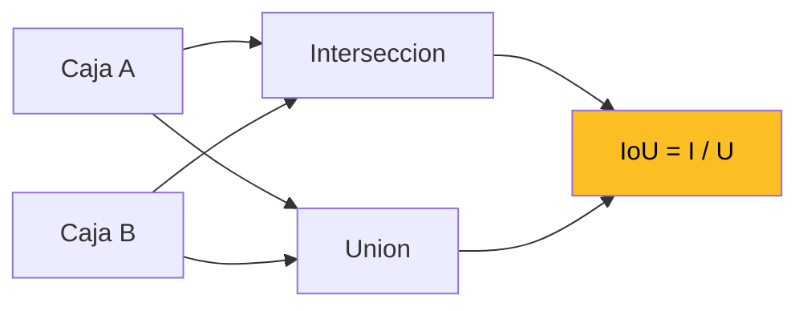
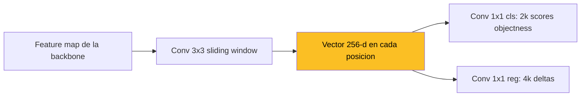
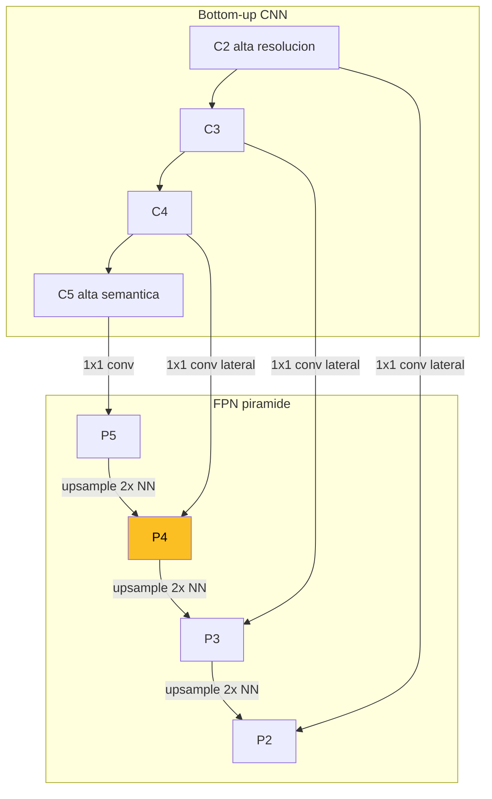
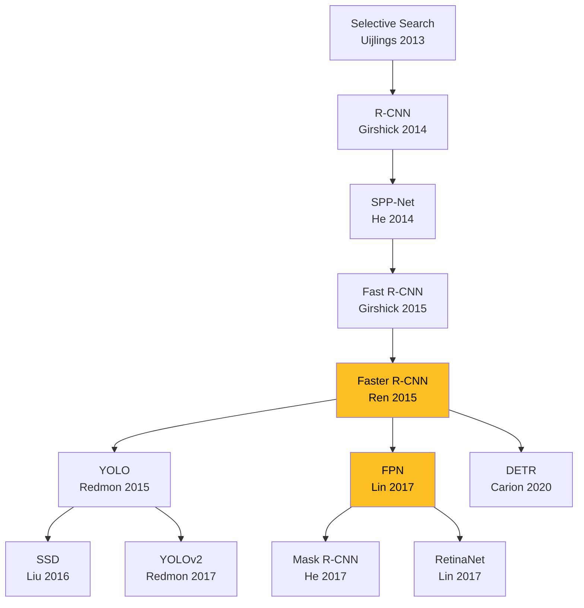

La **deteccion de objetos** generaliza la clasificacion de imagenes a un escenario mas realista: las imagenes contienen multiples objetos a distintas escalas, y queremos **localizar** y **clasificar** cada uno. La salida es una lista variable de tuplas (clase, bounding box, score).

Esta pagina consolida los conceptos transversales del area: bounding boxes, IoU, NMS, mAP, anchors, RPN, RoI extraction, FPN, y la evolucion historica de los detectores.

---

## 1. El Problema

Una CNN clasica (AlexNet, VGG, ResNet) responde **una sola etiqueta** por imagen. Esto falla cuando:

1. La imagen contiene **multiples objetos** (calle con autos, peatones, semaforos).
2. Los objetos aparecen en **distintas escalas** (una persona a 20 px vs 500 px).
3. La **cardinalidad** del output no se conoce a priori (1 objeto? 5? 30?).

Necesitamos **deteccion region-based**: predecir una lista de objetos, cada uno con caja delimitadora + clase + score de confianza.


Deteccion = **localizacion + clasificacion + cardinalidad variable**. La estructura del output es fundamentalmente distinta de la clasificacion holistica.


---

## 2. Bounding Boxes

Rectangulo alineado con los ejes que envuelve un objeto. Dos parametrizaciones equivalentes:

- **Esquinas**: $(x_1, y_1, x_2, y_2)$ donde $(x_1, y_1)$ es esquina superior-izquierda y $(x_2, y_2)$ inferior-derecha. Es la convencion de torchvision.
- **Centro + tamano**: $(x_c, y_c, w, h)$. Es la convencion de YOLO y COCO (formato $[x, y, w, h]$).

Conversion:

$$x_c = \frac{x_1 + x_2}{2}, \quad y_c = \frac{y_1 + y_2}{2}$$
$$w = x_2 - x_1, \quad h = y_2 - y_1$$

---

## 3. Intersection over Union (IoU)

Metrica de **solapamiento** entre dos cajas $A$ y $B$:

$$\text{IoU}(A, B) = \frac{|A \cap B|}{|A \cup B|} \in [0, 1]$$



### Calculo de la interseccion

La interseccion de dos cajas eje-alineadas es una caja cuyos limites son:

$$x_1^I = \max(x_1^A, x_1^B), \quad y_1^I = \max(y_1^A, y_1^B)$$
$$x_2^I = \min(x_2^A, x_2^B), \quad y_2^I = \min(y_2^A, y_2^B)$$

Si $x_2^I < x_1^I$ o $y_2^I < y_1^I$: las cajas no se solapan, $\text{IoU} = 0$.

$$|A \cap B| = \max(0, x_2^I - x_1^I) \cdot \max(0, y_2^I - y_1^I)$$
$$|A \cup B| = |A| + |B| - |A \cap B|$$

Restamos la interseccion porque sino la **estariamos contando dos veces** en la suma de areas.

### Umbrales tipicos

| Umbral | Uso |
| --- | --- |
| $\text{IoU} \geq 0.5$ | Deteccion correcta (TP) en VOC y COCO@0.5 |
| $\text{IoU} \geq 0.7$ | Anchor positivo en RPN |
| $\text{IoU} < 0.3$ | Anchor negativo en RPN |
| $0.3 \leq \text{IoU} \leq 0.7$ | Zona de ignore (anchors ambiguos) |

### Variantes diferenciables

IoU clasico **no es diferenciable** en regiones sin solape (gradiente = 0). Variantes que arreglan esto:

- **GIoU** (Generalized): penaliza ademas el tamano de la caja envolvente minima.
- **DIoU** (Distance): agrega distancia entre centros.
- **CIoU** (Complete): agrega ademas consistencia de aspect ratio.

Usadas como **loss directo** en YOLOv4+ y otros detectores modernos.

---

## 4. Non-Maximum Suppression (NMS)

Las redes producen **muchas cajas redundantes** sobre el mismo objeto (en Faster R-CNN, ~20k anchors -> ~2k propuestas). NMS las colapsa a una por objeto:

```
candidatos = sorted(detecciones, key=score, reverse=True)
resultado = []
mientras candidatos:
    mejor = candidatos.pop(0)
    resultado.append(mejor)
    candidatos = [c for c in candidatos if IoU(c, mejor) < threshold]
return resultado
```

### Threshold de NMS

| Threshold | Comportamiento |
| --- | --- |
| 0.3 | Muy agresivo, elimina cajas levemente solapadas |
| **0.5** | Tipico en deteccion |
| **0.7** | Tipico en RPN (antes del detector) |
| 0.9 | Casi no elimina nada |

### NMS por clase vs NMS global

⚠️ Detalle clave: el NMS final de un detector debe hacerse **por clase**.

Imagina un perro y un gato muy cerca con cajas que se solapan al 80%. Un NMS global eliminaria la del gato porque solapa con la del perro. **Pero son objetos distintos**. La solucion: aplicar NMS independientemente para cada clase, en silos separados.

En `torchvision.ops` hay `nms` (global) y `batched_nms` (por clase via offsets). Faster R-CNN de torchvision usa `batched_nms` internamente.

### Variantes diferenciables

- **Soft-NMS**: en lugar de eliminar cajas solapadas, **decrementa su score** proporcional al IoU. Permite recuperar cajas validas que solapan con falsos positivos de mayor score.
- **DIoU-NMS, GIoU-NMS**: usan las metricas IoU mejoradas como criterio de eliminacion.

---

## 5. Average Precision (AP) y mean AP (mAP)

### Precision y Recall

Para un umbral de IoU dado (ej. 0.5):

- **TP**: deteccion con IoU $\geq$ umbral con una GT no asignada.
- **FP**: deteccion sin GT correspondiente, o con GT ya asignada a otra deteccion de mayor score.
- **FN**: GT no detectada por ninguna prediccion.

$$\text{Precision} = \frac{TP}{TP + FP}, \quad \text{Recall} = \frac{TP}{TP + FN}$$

### Curva Precision-Recall y AP

Ordenando las detecciones por score descendente y calculando precision/recall acumulados, se traza $P(R)$. **AP es el area bajo esa curva**:

$$\text{AP} = \int_0^1 P(R) \, dR$$

Aproximaciones practicas:

- **VOC 11-point**: promedio de $P(R)$ en $R \in \{0, 0.1, \ldots, 1.0\}$.
- **COCO 101-point**: promedio en $R \in \{0, 0.01, \ldots, 1.0\}$.

### mAP

**mean Average Precision**: promedio de AP sobre todas las clases:

$$\text{mAP} = \frac{1}{K} \sum_{c=1}^{K} \text{AP}_c$$

### La metrica COCO: mAP@[.5:.95]

COCO promedia ademas sobre **multiples umbrales de IoU**:

$$\text{mAP}_{[.5:.95]} = \frac{1}{10} \sum_{\tau \in \{0.5, 0.55, \ldots, 0.95\}} \text{mAP}_\tau$$

**Mucho mas estricta** que mAP@0.5: penaliza imprecision en la caja, no solo en la clase. Un detector con IoU=0.6 cuenta menos que uno con IoU=0.9.

Ademas COCO reporta:

- **AP_S**: AP para objetos pequenos (area < $32^2$).
- **AP_M**: AP para objetos medianos.
- **AP_L**: AP para objetos grandes.

Permite analizar **donde** falla un detector. FPN nacio para mejorar AP_S.

---

## 6. Anchors

Cajas de referencia **fijas a priori** (no aprendidas) plantadas en cada posicion del feature map. La red predice **offsets** respecto a cada anchor, no coordenadas absolutas.

### Por que anchors

Predecir $(x_c, y_c, w, h)$ desde cero es muy dificil: la red tendria que aprender la distribucion completa de tamanos. Con anchors, la red solo aprende **perturbaciones pequenas** desde plantillas razonables.

### Parametrizacion de offsets (Faster R-CNN)

$$t_x = (x - x_a) / w_a, \quad t_y = (y - y_a) / h_a$$
$$t_w = \log(w / w_a), \quad t_h = \log(h / h_a)$$

Donde $(x_a, y_a, w_a, h_a)$ son las coordenadas del anchor.

**Para los centros**: normalizar por $w_a, h_a$ da invarianza a escala.

**Para los tamanos**: usar log es clave. Razones:

1. La red predice valores en $\mathbb{R}$ sin restricciones (no necesita activacion exp/softplus).
2. **Simetria**: $t_w = +\log 2$ duplica el tamano, $t_w = -\log 2$ lo reduce a la mitad. Distancias iguales en el espacio de offsets.
3. **Inicializacion**: con $t_w \approx 0$ al inicio, $w \approx w_a$. La red empieza prediciendo "el anchor original".

### Asignacion de etiquetas a anchors

Faster R-CNN usa **tres categorias**:

| Condicion | Etiqueta |
| --- | --- |
| IoU > 0.7 con alguna GT **o** maximo IoU para esa GT | Positivo |
| IoU < 0.3 con todas las GT | Negativo |
| $0.3 \leq \text{IoU} \leq 0.7$ | Ignorado |

La regla del "maximo IoU para esa GT" es un **salvavidas**: garantiza que toda GT tenga al menos un anchor positivo, incluso si es un objeto raro de escala atipica.

---

## 7. Region Proposal Network (RPN)

Innovacion central de Faster R-CNN (Ren et al. 2015). Una pequena red convolucional que **aprende a proponer regiones** en vez de usar algoritmos externos como Selective Search.

### Arquitectura



Tres convoluciones:

1. **Conv 3x3** para integrar el vecindario.
2. **Conv 1x1 cls**: predice **objectness** (objeto vs fondo) para cada anchor.
3. **Conv 1x1 reg**: predice **4 deltas** $(t_x, t_y, t_w, t_h)$ para cada anchor.

### Salida

Para $k$ anchors por celda y un feature map $W \times H$: total $W \cdot H \cdot k$ anchors. En Faster R-CNN tipico (~60x40 con k=9): ~20.000 anchors. Tras NMS interno: ~2.000 propuestas.

### Loss (multi-task)

$$L_{RPN} = \frac{1}{N_{cls}} \sum_i L_{cls}(p_i, p_i^*) + \lambda \frac{1}{N_{reg}} \sum_i p_i^* L_{reg}(t_i, t_i^*)$$

- $L_{cls}$: binary cross-entropy (objeto vs fondo).
- $L_{reg}$: **smooth L1** sobre los 4 deltas. Solo se aplica a anchors **positivos** (factor $p_i^*$).

### Smooth L1 (Huber loss)

$$\text{smooth}_{L_1}(x) = \begin{cases} 0.5 x^2 & |x| < 1 \\ |x| - 0.5 & |x| \geq 1 \end{cases}$$

Combina lo mejor de L1 y L2:

- Cerca de 0: cuadratica (suave, buena convergencia local).
- Lejos de 0: lineal (gradiente acotado, robusta a outliers).
- $C^1$: derivada continua en $|x| = 1$.

---

## 8. RoI Extraction: de propuestas a features fijos

Las propuestas de la RPN tienen **tamanos variables**, pero las cabezas finales esperan tensores de tamano fijo. Tres operaciones historicamente:

### RoI Pool (Fast R-CNN, 2015)

1. Mapear la propuesta al feature map dividiendo por el stride.
2. **Cuantizar** coordenadas a enteros.
3. Dividir en grilla 7x7.
4. **Cuantizar** bordes de cada bin.
5. Max pool dentro de cada bin.

**Dos cuantizaciones perdiendo precision sub-pixel.** Con stride 32, errores de hasta 32 px en la imagen original. Aceptable para clasificacion, fatal para segmentacion de mascaras.

### RoI Align (Mask R-CNN, 2017)

**No cuantiza nada.** Usa interpolacion bilineal:

1. Mapear la propuesta a feature map: coordenadas float.
2. Dividir en grilla 7x7 con bordes float.
3. Para cada bin, 4 puntos de muestreo (sampling_ratio=2 -> 2x2).
4. Cada punto: interpolacion bilineal de los 4 pixeles vecinos del feature map.
5. Promediar (o max pool) los 4 puntos.

```
   feature map (dashed grid, valores enteros)
   ┌───┬───┬───┬───┐
   │   │   │   │   │
   ├───┼───┼───┼───┤
   │   │ ╋ │ ╋ │   │    ← 4 puntos de muestreo
   ├───┼───┼───┼───┤
   │   │ ╋ │ ╋ │   │
   ├───┼───┼───┼───┤
   │   │   │   │   │
   └───┴───┴───┴───┘
       └─ RoI (solid, coords flotantes) ─┘
       └─ 1 bin de los 7×7 ─┘
```

**Impacto**: +3.3 mask AP en COCO, +1.3 box AP "gratis". Indispensable para Mask R-CNN.

### Interpolacion bilineal

Para punto $(x, y)$ con vecinos enteros $(x_0, y_0), (x_1, y_0), (x_0, y_1), (x_1, y_1)$ y pesos $\alpha = x - x_0$, $\beta = y - y_0$:

$$f(x, y) = (1-\alpha)(1-\beta) f_{00} + \alpha(1-\beta) f_{10} + (1-\alpha)\beta f_{01} + \alpha\beta f_{11}$$

Diferenciable respecto a $x, y$ y a los $f_{ij}$. Permite backprop suave.

---

## 9. Feature Pyramid Network (FPN)

Soluciona el problema de **deteccion multi-escala**: objetos pequenos necesitan alta resolucion, objetos grandes necesitan alta semantica. Las CNNs producen una jerarquia natural ($C_2, C_3, C_4, C_5$ con strides 4, 8, 16, 32) pero los niveles altos tienen poca semantica y los bajos poca resolucion.

### Idea: combinar bottom-up con top-down + laterales



Construccion:

1. **Bottom-up**: pasada normal de la CNN.
2. **Top-down**: empezar de $C_5$, **upsample 2x nearest neighbor** descendiendo.
3. **Lateral connections**: conv 1x1 sobre cada $C_i$ para igualar canales (todos a 256) y **suma elemento a elemento** con el top-down upsampleado.
4. **Conv 3x3 final** para suavizar artefactos del upsampling.

Resultado: piramide $\{P_2, P_3, P_4, P_5\}$ con **256 canales uniformes** y semantica fuerte en todos los niveles.

### Asignacion de propuestas a niveles

Para una propuesta de tamano $w \times h$:

$$k = \lfloor k_0 + \log_2(\sqrt{wh} / 224) \rfloor$$

Con $k_0 = 4$. Propuestas pequenas -> niveles superficiales ($P_2$, alta resolucion); propuestas grandes -> niveles profundos ($P_5$, alta semantica).

### Impacto

- **+8 AR@1k** sobre RPN single-scale.
- **+12.9 AR_s** (objetos pequenos).
- **+4.3 mAP** en Faster R-CNN-50.

FPN es componente estandar de **Faster R-CNN, Mask R-CNN, RetinaNet, EfficientDet, YOLOv4+**.

---

## 10. Family Tree de Detectores



### Two-stage vs One-stage

**Two-stage** (R-CNN family, RPN + detector):
- Mas precisos.
- Tipicamente mas lentos (~5 fps con FPN).
- Faster R-CNN, Mask R-CNN, Cascade R-CNN.

**One-stage** (predicen clases + cajas en un pase):
- Mas rapidos (real-time).
- Historicamente menos precisos, pero la brecha se cerro con focal loss (RetinaNet) y mejoras posteriores.
- YOLO, SSD, RetinaNet, FCOS.

### Class imbalance y Focal Loss

Single-shot detectors generan **decenas de miles** de anchors por imagen, la mayoria fondo facil. Cross-entropy clasico se ve dominado por estos negativos.

**Focal Loss** (RetinaNet, Lin et al. 2017):

$$L_{\text{focal}} = -(1 - p_t)^\gamma \log p_t$$

con $\gamma \approx 2$. Para ejemplos faciles ($p_t \to 1$), el factor $(1 - p_t)^\gamma \to 0$ -> loss casi nulo. Para dificiles, loss completo. Permite single-shot competitivo sin sampling explicito.

### Anchor-free y Transformer-based

**FCOS** (Tian et al. 2019): predice center-ness + bbox sin anchors.

**DETR** (Carion et al. 2020): trata deteccion como **set prediction** con un Transformer encoder-decoder. **Sin anchors, sin NMS** — usa bipartite matching (algoritmo Hungaro) para asignar predicciones a GTs.

---

## 11. Recursos Practicos: torchvision

PyTorch via `torchvision.models.detection` provee detectores pre-entrenados:

| Modelo | Backbone | Pre-entrenado en |
| --- | --- | --- |
| `fasterrcnn_resnet50_fpn` | ResNet-50 + FPN | COCO 2017 |
| `fasterrcnn_mobilenet_v3_large_fpn` | MobileNetV3 | COCO 2017 |
| `maskrcnn_resnet50_fpn` | ResNet-50 + FPN | COCO 2017 |
| `keypointrcnn_resnet50_fpn` | ResNet-50 + FPN | COCO 2017 |
| `retinanet_resnet50_fpn` | ResNet-50 + FPN | COCO 2017 |
| `ssd300_vgg16` | VGG16 | COCO 2017 |
| `fcos_resnet50_fpn` | ResNet-50 + FPN | COCO 2017 |

Tambien `torchvision.ops` con primitivas optimizadas: `nms`, `batched_nms`, `box_iou`, `roi_align`, `MultiScaleRoIAlign`.

### Patron de fine-tuning

```python
from torchvision.models.detection import fasterrcnn_resnet50_fpn
from torchvision.models.detection.faster_rcnn import FastRCNNPredictor

# 1. Cargar modelo COCO pre-entrenado
model = fasterrcnn_resnet50_fpn(pretrained=True)

# 2. Leer tamano de entrada del clasificador
in_features = model.roi_heads.box_predictor.cls_score.in_features

# 3. Reemplazar clasificador (N+1 clases: incluye background)
num_classes = N + 1
model.roi_heads.box_predictor = FastRCNNPredictor(in_features, num_classes)

# 4. Mover a GPU
model.to(device)
```

Solo entrenas ~10k parametros nuevos (las dos `Linear` del predictor). El resto del modelo viene pre-entrenado.

---

## 12. Resumen

1. **Deteccion = localizacion + clasificacion + cardinalidad variable**.
2. **IoU** mide solapamiento; **mAP** integra precision-recall por clase y promedia.
3. **NMS** elimina detecciones duplicadas; **NMS por clase** evita eliminar objetos distintos cercanos.
4. **Anchors** con parametrizacion log son referencias geometricas que estabilizan la regresion de cajas.
5. **RPN** aprende a proponer regiones en vez de usar Selective Search externo (el avance clave de Faster R-CNN).
6. **Smooth L1** combina robustez de L1 con suavidad de L2 para la regresion de offsets.
7. **RoI Align** elimina la cuantizacion de RoI Pool via interpolacion bilineal -> +3 mask AP en COCO.
8. **FPN** combina top-down + lateral para piramide multi-escala con semantica fuerte en todos los niveles.
9. **Two-stage vs one-stage**: trade-off de precision vs velocidad, cerrado parcialmente por focal loss.
10. **Frontera**: DETR elimina anchors y NMS via set prediction con Transformers.

---

## Referencias

- [Faster R-CNN (Ren 2015)](/papers/faster-rcnn-ren-2015) - RPN end-to-end.
- [FPN (Lin 2017)](/papers/fpn-lin-2017) - Piramide top-down.
- [Mask R-CNN (He 2017)](/papers/mask-rcnn-he-2017) - RoIAlign + segmentacion.
- [ResNet (He 2015)](/papers/resnet-he-2015) - Backbone canonica.
- [Microsoft COCO (Lin 2014)](/papers/coco-lin-2014) - Dataset estandar.

Para el recorrido teorico completo ver [Clase 15](/clases/clase-15) y [profundizacion](/clases/clase-15/profundizacion). Para el codigo aplicado, ver [Lab 15](/laboratorios/lab-15).
