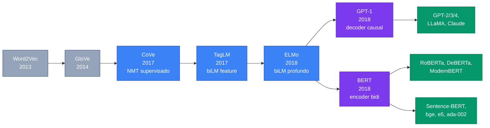
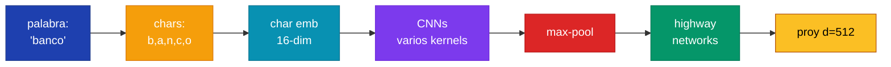
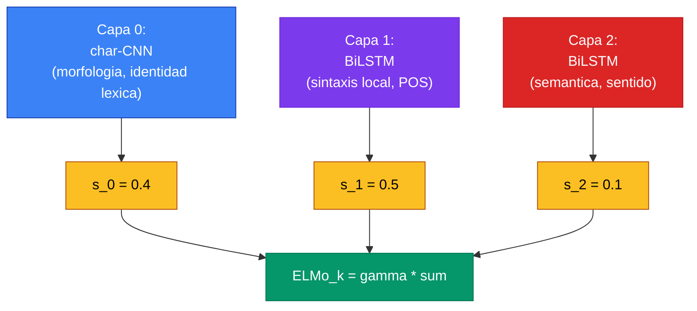

Los **embeddings contextualizados** son la generacion de representaciones vectoriales donde el vector de una palabra **depende de la oracion en que aparece**, no solo de la palabra en si misma. La transicion de embeddings estaticos (Word2Vec, GloVe, FastText) a embeddings contextualizados (CoVe, ELMo, BERT, GPT) es uno de los saltos mas importantes en la historia reciente del NLP: paso de "una palabra = un vector" a "una palabra en un contexto = un vector", lo cual resolvio polisemia, capturo sintaxis local y se volvio el cimiento de toda la era del Transformer.

En 2026, todos los sistemas de produccion de busqueda semantica, retrieval, re-ranking, clustering y clasificacion ligera usan algun encoder contextual descendiente de esa linea: Sentence-Transformers, OpenAI text-embedding-3, Cohere embed, jina-embeddings, bge, e5, voyage. Conocer la mecanica subyacente es lo que permite leer benchmarks de MTEB, decidir si usar pooling de `[CLS]`, mean-pooling, o ultima capa, y entender por que el espacio de embeddings de un decoder grande es asimetrico respecto al de un encoder.

---

## 1. El Problema de la Polisemia

Los embeddings estaticos asignan **un vector por tipo de palabra**, sin importar el contexto. La matriz $E \in \mathbb{R}^{V \times d}$ devuelve la misma fila para `arm` en cualquier oracion.

Esto rompe ante palabras polisemicas. Considera estos ejemplos en ingles:

| Palabra | Sentido 1 | Sentido 2 | Sentido 3 |
|---|---|---|---|
| `arm` | extremidad ("my left arm") | rama del gobierno ("the executive arm") | armar ("to arm a device") |
| `fall` | caer ("she fell") | otono ("autumn / fall") | caida ("a hard fall") |
| `clip` | sujetapapeles ("paper clip") | recortar ("clip a video") | golpe seco ("a clip on the chin") |
| `drop` | caer ("drop the ball") | gota ("a drop of water") | reducir ("drop in sales") |
| `play` | jugar (verbo) | obra teatral (sustantivo) | tocar (musica) |

Y en espanol la situacion es identica:

| Palabra | Sentido 1 | Sentido 2 | Sentido 3 |
|---|---|---|---|
| `banco` | institucion financiera | asiento de plaza | banco de peces |
| `planta` | vegetal | piso de un edificio | fabrica industrial |
| `llama` | animal andino | flama de fuego | tercera persona del verbo llamar |
| `cura` | sacerdote | remedio | accion de curar |
| `vela` | de barco | de cera | verbo velar |

En Word2Vec, GloVe o FastText, el vector de `banco` es **una mezcla diluida** de los tres sentidos, ponderada por su frecuencia en el corpus de entrenamiento. Si el sentido financiero domina (como suele ocurrir en Wikipedia o noticias), el modelo "no sabe" que `banco` puede ser un asiento. Esta limitacion es estructural: por construccion, no hay forma de que un vector unico capture significados ortogonales.


La polisemia no es una rareza: en corpora reales del ingles, una alta fraccion de los tokens son polisemicos en sentido fuerte (WordNet lista 5+ sentidos para verbos comunes como `run`, `make`, `take`, `set`). Embeddings estaticos pierden esta senal sistematicamente. La medicion experimental clasica: en analogias semanticas que requieren desambiguacion, Word2Vec falla en 30-40% mas de casos que ELMo.


Otros problemas heredados del paradigma estatico:

- **No hay composicion no lineal**: `hot dog` no es `hot + dog`. La fraseologia, expresiones idiomaticas (`break a leg`, `kick the bucket`), nombres propios multi-palabra (`New York`, `Estados Unidos`) requieren composicion dependiente del contexto.
- **Sintaxis ignorada**: en "Juan ama a Maria" vs "Maria ama a Juan", los embeddings de `Juan` y `Maria` son los mismos en ambos casos. El rol sintactico no se refleja.
- **Sin actualizacion dinamica**: `Apple` en "Apple anuncio el iPhone" deberia estar cerca de `Microsoft, Google, Samsung`, mientras que en "comi una apple para el desayuno" deberia estar cerca de `pera, manzana, fruta`. W2V entrega el mismo vector en ambos casos.

---

## 2. El Salto a Contextualizado: Definicion Formal

Un **embedding contextualizado** es una funcion:

$$\vec{v}_{w, c} = f(w \mid c)$$

donde $w$ es un token y $c$ es la **secuencia completa** en que ese token aparece. La funcion $f$ es tipicamente una red neuronal profunda (BiLSTM, Transformer) cuyos parametros estan entrenados sobre miles de millones de tokens via algun objetivo auto-supervisado (language modeling, masked language modeling, contrastive).

La diferencia clave respecto al modelo estatico es subtle pero fundamental:

| Aspecto | Estatico (W2V, GloVe) | Contextualizado (ELMo, BERT, GPT) |
|---|---|---|
| Entidad con vector | **Tipo** de palabra | **Instancia** de palabra en una secuencia |
| Vector de `banco` | Uno solo en todo el corpus | Uno distinto por cada oracion |
| Cardinalidad | $V$ vectores en total | $V \times \text{cantidad de oraciones}$ en principio |
| Almacenamiento | Diccionario $V \times d$ | Funcion $f$ + computo en runtime |
| Composicion | Aritmetica fija | Emergente, dependiente del contexto |


**El vector NO es propiedad del token; es propiedad de la posicion en una secuencia especifica.** Si quieres "el embedding de la palabra X", la pregunta esta mal formulada en el mundo contextualizado: necesitas decir "el embedding de X **en la oracion S**". Esto cambia toda la mecanica de comparacion, indexacion y almacenamiento.


Equivalentemente: el embedding contextualizado es lo que se obtiene al **propagar la secuencia entera por una red neuronal** y extraer el hidden state asociado a la posicion del token. La matriz de embeddings de entrada $E$ sigue existiendo (la capa lookup inicial), pero el "embedding util" para downstream tasks es el output despues de varias capas de procesamiento contextual.

---

## 3. Trayectoria Historica

La idea de representaciones contextuales no surgio de golpe. Hay una linea evolutiva clara entre 2017 y 2018 donde tres papers consecutivos fueron probando el concepto antes que BERT lo consolidara.



### 3.1 CoVe (McCann et al. 2017)

**Contextualized Word Vectors** fue el primer intento serio de generar embeddings contextualizados via deep learning supervisado. La idea: entrenar un encoder-decoder LSTM para **traduccion automatica** (English -> German) sobre el dataset WMT, y luego extraer los hidden states del encoder como representacion contextual.

$$\text{CoVe}(w) = \text{MT-LSTM-Encoder}(w_1, \ldots, w_n)[i]$$

Estos vectores se **concatenaron** con embeddings GloVe estaticos para alimentar tareas downstream (sentiment analysis, NLI, QA). Mejoraron el estado del arte en varias tareas.

Limitaciones:

- Requiere un corpus paralelo grande (traduccion supervisada), lo cual es caro y limita el dominio.
- El objetivo (traduccion) introduce sesgos especificos: enfatiza informacion relevante para mapear ingles a aleman, no captura toda la riqueza del lenguaje.
- La calidad esta acotada por el dataset paralelo disponible.

### 3.2 TagLM (Peters et al. 2017)

**TagLM** (de los mismos autores que despues harian ELMo) propuso una variante mas barata: usar un **biLM** (modelo de lenguaje bidireccional preentrenado de forma auto-supervisada) como **feature extractor** para tareas de etiquetado secuencial como NER y chunking.

La arquitectura: un BiLSTM entrenado como language model forward + backward sobre 1 billon de palabras del 1B Word Benchmark. Las representaciones del biLM se concatenaron a los inputs de un modelo NER especifico:

$$\text{input}_{NER} = [\vec{w}_{\text{token}}; \vec{w}_{\text{char}}; \vec{h}_{biLM}]$$

Resultados: mejoras sustanciales en CoNLL 2003 NER (+1.2 F1) y CoNLL 2000 chunking. Limitacion principal: solo usaba la **ultima capa** del biLM, descartando informacion intermedia.

### 3.3 ELMo (Peters et al. 2018)

**ELMo** (Embeddings from Language Models) fue la solucion que pego. Tres ideas clave que diferenciaron a ELMo de sus predecesores:

1. **Combinacion ponderada de TODAS las capas**, no solo la ultima. ELMo aprende pesos task-specific sobre las representaciones de cada capa del biLM.
2. **Char-CNN** como input layer, eliminando OOV de raiz.
3. **Plug-and-play**: ELMo se anade como feature a cualquier modelo existente sin re-arquitectura.

ELMo establecio el record en 6 benchmarks NLP simultaneos (SQuAD, SNLI, SRL, coref, NER, sentiment) y demostro que pre-training auto-supervisado a gran escala con embeddings contextuales transferia mejor que cualquier paradigma anterior. Mas detalle en seccion 4. Ver tambien [Paper ELMo Peters 2018](/papers/elmo-peters-2018) para analisis completo.

### 3.4 GPT-1 (Radford et al. 2018) y BERT (Devlin et al. 2018)

Apenas meses despues de ELMo, OpenAI publico **GPT-1** y Google publico **BERT**. Ambos abandonaron las BiLSTMs por **Transformers** y cambiaron el paradigma de "embeddings como feature" a "modelo completo como punto de partida para fine-tuning".

- **GPT-1**: Transformer decoder con atencion causal, pre-entrenado con next-token prediction sobre BookCorpus. Embeddings contextualizados unidireccionales (solo izquierda).
- **BERT**: Transformer encoder con atencion bidireccional, pre-entrenado con Masked Language Modeling (MLM) + Next Sentence Prediction (NSP) sobre Wikipedia + BookCorpus. Embeddings contextualizados bidireccionales profundos.

BERT supero a ELMo en GLUE por +4-7 puntos en multiples tareas. La diferencia clave: **bidireccionalidad profunda**, no solo en la ultima capa como ELMo. Cada capa del Transformer-encoder de BERT integra contexto izquierdo y derecho desde el principio. Ver [BERT](/fundamentos/bert/) y [Pre-training BERT](/fundamentos/pretraining-bert/) para detalles.

### 3.5 GPT-2, GPT-3 y descendientes decoder-only

A partir de 2019 (GPT-2) y 2020 (GPT-3), la familia decoder-only escalo a parametros y datos masivos. Aunque su objetivo principal era generacion, sus **hidden states intermedios** funcionan tambien como embeddings contextualizados (asimetricos, ver seccion 9).

Los embeddings de OpenAI `text-embedding-ada-002` (2022) y `text-embedding-3-small/large` (2024) son productos derivados de modelos GPT, pero entrenados especificamente para retrieval con objetivo contrastivo encima del pre-training de lenguaje.

---

## 4. Mecanica de ELMo

ELMo merece un tratamiento detallado porque su arquitectura ilustra patrones que luego volvieron en BERT y modernos encoders. Para el analisis exhaustivo del paper original, ver [Paper ELMo Peters 2018](/papers/elmo-peters-2018).

### 4.1 Char-CNN Input Layer

ELMo no usa una matriz de embeddings de palabras. En su lugar, cada palabra se representa como una secuencia de caracteres procesada por una **CNN convolucional de caracteres**:



Ventajas del enfoque char-based:

- **No hay OOV**: cualquier palabra se descompone en caracteres conocidos.
- **Captura morfologia**: prefijos (`un-`, `pre-`), sufijos (`-ing`, `-mente`), camelCase, dipositivos como `COVID-19`.
- **Eficiente en parametros**: una CNN char-based es mucho mas pequena que una matriz de embeddings palabra-level de 30k entradas.

El output de la char-CNN es la representacion contextual-INDEPENDIENTE de la palabra. Es el equivalente a Word2Vec pero generado dinamicamente desde caracteres.

### 4.2 BiLSTM de Dos Capas

Sobre la representacion char-CNN se apilan **dos capas BiLSTM**. Pero la implementacion es sutil: NO son BiLSTMs estandar (que concatenan forward y backward en cada paso). Son **dos LMs separados**:

- **Forward LM**: predice $t_{k+1}$ dado $t_1, \ldots, t_k$. Procesa la oracion de izquierda a derecha.
- **Backward LM**: predice $t_{k-1}$ dado $t_k, t_{k+1}, \ldots, t_T$. Procesa la oracion de derecha a izquierda.

Cada LM tiene sus propios parametros LSTM, y sus respectivas heads de prediccion sobre el vocabulario. El objetivo de pre-training es la suma de las log-likelihoods de ambos LMs:

$$\mathcal{L}_{ELMo} = \sum_{k=1}^{T} \left[ \log P(t_k \mid t_1, \ldots, t_{k-1}; \Theta_{fwd}) + \log P(t_k \mid t_{k+1}, \ldots, t_T; \Theta_{bwd}) \right]$$

Los parametros del char-CNN y del softmax final se comparten entre ambas direcciones; solo los LSTMs son separados.


**ELMo NO es bidireccional profundo**, a pesar de su nombre. Las dos direcciones se entrenan **independientemente** y solo se mezclan en la capa de output al combinar representaciones. Cada token, en una capa intermedia, **solo conoce** el contexto de un lado. Esta es la limitacion que BERT resuelve con MLM: al enmascarar tokens, BERT puede usar atencion bidireccional sin "ver el futuro" trivialmente.


### 4.3 Combinacion Task-Specific de Capas

ELMo no usa una capa unica. Para cada token $k$, despues del pre-training, hay $2L + 1$ representaciones disponibles (donde $L$ es el numero de capas LSTM, tipicamente 2):

- 1 representacion del char-CNN (capa 0, contextual-independiente).
- $L$ representaciones del forward LSTM (una por capa).
- $L$ representaciones del backward LSTM (una por capa).

Para usarlas en una tarea downstream, ELMo aprende **pesos task-specific** que combinan las representaciones de cada capa:

$$\text{ELMo}_k^{task} = \gamma^{task} \sum_{j=0}^{L} s_j^{task} \, \mathbf{h}_{k,j}^{LM}$$

donde:

- $\mathbf{h}_{k,j}^{LM}$ es la representacion del token $k$ en la capa $j$ (concatenacion de forward y backward para $j > 0$).
- $s_j^{task}$ son pesos softmax-normalizados sobre las $L+1$ capas, aprendidos por tarea.
- $\gamma^{task}$ es un escalar que escala todo el vector ELMo, tambien aprendido.

Esto es lo que permite que **distintas tareas usen capas distintas**: NER puede aprender que la capa 0 (char-CNN) y la capa 1 (sintaxis baja) son utiles; entailment puede preferir la capa 2 (semantica alta).



### 4.4 Uso en Tareas Downstream

ELMo se utiliza como **feature**: el vector $\text{ELMo}_k$ se concatena con los embeddings del modelo base (tipicamente GloVe + char-CNN):

$$\text{input}_k = [\vec{w}_k^{GloVe}; \text{ELMo}_k]$$

El modelo downstream (BiLSTM para NER, etc.) se entrena con estos inputs aumentados, mientras los pesos del biLM **quedan congelados**. Solo $s_j^{task}$ y $\gamma^{task}$ se aprenden por tarea.

Resultados del paper original:

| Tarea | SOTA previo | + ELMo | Mejora |
|---|---|---|---|
| SQuAD (F1) | 81.1 | 85.8 | +4.7 |
| SNLI (acc) | 88.6 | 88.7 | +0.7 (sobre el ya alto baseline) |
| SRL (F1) | 81.7 | 84.6 | +3.2 |
| Coref (F1) | 67.2 | 70.4 | +3.2 |
| NER (F1) | 91.93 | 92.22 | +0.29 |
| SST-5 (acc) | 53.7 | 54.7 | +1.0 |

La leccion: con un mismo biLM preentrenado y solo dos escalares por tarea, ELMo mejoraba el estado del arte simultaneamente en 6 tareas muy distintas. Es lo que sello el concepto de "feature de proposito general derivada de pre-training auto-supervisado".

---

## 5. Mecanica de BERT y GPT como Embeddings Contextualizados

Tanto BERT como GPT producen embeddings contextualizados via **self-attention**. La mecanica es estructuralmente similar pero difiere en direccionalidad.

### 5.1 Self-Attention como Mecanismo de Contextualizacion

En cada capa Transformer, el embedding de un token se **recalcula** como una combinacion ponderada de los embeddings de todos los tokens (o, en el caso causal, los previos):

$$\mathbf{h}_i^{(l+1)} = \sum_{j} \alpha_{ij}^{(l)} \, W_V^{(l)} \mathbf{h}_j^{(l)}$$

donde $\alpha_{ij}$ son los pesos de atencion softmax-normalizados:

$$\alpha_{ij} = \frac{\exp(\mathbf{q}_i \cdot \mathbf{k}_j / \sqrt{d_k})}{\sum_{j'} \exp(\mathbf{q}_i \cdot \mathbf{k}_{j'} / \sqrt{d_k})}$$

Despues de $L$ capas (12 en BERT-base, 96 en GPT-3), el embedding final de cada token integra informacion de **toda la secuencia** filtrada por atencion. Esa es la version "industrial" del embedding contextualizado, mucho mas potente que la combinacion lineal de 3 capas de ELMo.

### 5.2 BERT: Bidireccional via MLM

BERT no aplica mascara causal: cada token atiende a todos los demas. Para evitar trivializacion del language modeling, BERT enmascara el 15% de tokens y los predice usando el contexto bilateral:

$$\mathcal{L}_{MLM} = -\sum_{i \in M} \log P(x_i \mid x_{\setminus M})$$

Cada capa del encoder es genuinamente bidireccional: el token en posicion $i$ depende de tokens en $j < i$ Y $j > i$. Esto produce embeddings mucho mas ricos para tareas de comprension, clasificacion y retrieval. Detalles en [BERT](/fundamentos/bert/).

### 5.3 GPT: Causal (Solo Izquierda)

GPT mantiene la mascara causal: el token en posicion $i$ solo atiende a $j \leq i$. El objetivo es next-token prediction:

$$\mathcal{L}_{NTP} = -\sum_{i=1}^{T} \log P(x_i \mid x_1, \ldots, x_{i-1})$$

Los embeddings resultantes son **asimetricos**: el embedding del primer token solo ve un token, el del ultimo ve toda la secuencia. Esto los hace ideales para generacion pero subooptimos para representacion completa de oracion.

### 5.4 Como Extraer Embeddings de un Modelo Transformer

Hay multiples formas de extraer un embedding contextualizado de BERT, GPT u otro encoder/decoder. Ninguna es universalmente mejor; depende de la tarea.

| Estrategia | Como | Cuando usarla |
|---|---|---|
| `last_hidden_state[i]` | El hidden state de la ultima capa para la posicion del token $i$ | Token-level tasks: NER, QA, POS |
| `[CLS]` token | El hidden state de la ultima capa en posicion 0 (token `[CLS]`) | Clasificacion oracion-level con BERT, segun convencion del paper original |
| `pooler_output` | `[CLS]` proyectado por un Dense + tanh, entrenado en NSP | Pasable, pero NSP es ruidoso. RoBERTa elimino esta capa |
| Mean-pooling | Promedio de `last_hidden_state` sobre todos los tokens (excluyendo padding) | Sentence-Transformers default. Funciona mejor que `[CLS]` en BERT-base sin fine-tuning contrastivo |
| Max-pooling | Maximo componente-wise sobre tokens | Captura features sobresalientes. Menos comun |
| Promedio de las ultimas $k$ capas | Promediar `hidden_states[-k:]` antes del pool | Captura mas niveles linguisticos. ~+1-2 puntos en algunos benchmarks |
| Ultimo token (decoder) | Para GPT/LLaMA: el hidden state del ultimo token de la secuencia | Estandar en LLMs decoder-only, ya que es el unico que vio todo el contexto |

```python
from transformers import AutoTokenizer, AutoModel
import torch

tok = AutoTokenizer.from_pretrained("bert-base-uncased")
model = AutoModel.from_pretrained("bert-base-uncased")
inputs = tok("the bank charged a fee", return_tensors="pt")

with torch.no_grad():
    out = model(**inputs, output_hidden_states=True)

# Opcion 1: [CLS]
cls = out.last_hidden_state[:, 0, :]                # (1, 768)

# Opcion 2: mean-pooling sobre tokens validos
mask = inputs["attention_mask"].unsqueeze(-1).float()
mean = (out.last_hidden_state * mask).sum(1) / mask.sum(1)  # (1, 768)

# Opcion 3: promedio de las ultimas 4 capas
last4 = torch.stack(out.hidden_states[-4:]).mean(0)   # (1, T, 768)
sentence_emb = (last4 * mask).sum(1) / mask.sum(1)     # (1, 768)
```


La eleccion del pooling **importa mas de lo que parece**. Para BERT vanilla sin fine-tuning contrastivo, el embedding `[CLS]` es mediocre en tareas de similitud (Sentence-BERT 2019 reporta un STS-B Spearman de 16.5 con `[CLS]` vs 76+ con mean-pooling fine-tuneado). Esto es porque `[CLS]` fue entrenado para NSP, no para representacion semantica. Si vas a hacer retrieval semantico, casi siempre debes usar un modelo entrenado contrastivamente (Sentence-Transformers) y mean-pooling.


---

## 6. Analisis por Capa: Que Aprende Cada Nivel

Una pregunta natural cuando se tienen 12-96 capas de embeddings contextualizados: ¿que aprende cada capa? La literatura de **probing** intento responder esto entre 2018 y 2020.

### 6.1 Probing Studies

La metodologia: entrenar un clasificador lineal (o MLP shallow) sobre las representaciones de cada capa para predecir una propiedad linguistica. La accuracy del probe indica que tanta informacion sobre esa propiedad esta presente en esa capa.

Trabajos seminales:

- **Tenney et al. (2019) "BERT Rediscovers the NLP Pipeline"**: probearon BERT capa por capa con tareas POS, parsing, NER, coref, SRL, relaciones. Encontraron una **jerarquia consistente** que se alinea con un pipeline NLP clasico.
- **Belinkov & Glass (2019) "Analysis Methods in NLP"**: review extensivo de probing en BERT, ELMo y modelos NMT. Confirmaron que capas bajas codifican rasgos superficiales (caracteres, morfologia, POS) y capas altas codifican rasgos semanticos abstractos.
- **Hewitt & Manning (2019) "A Structural Probe"**: mostraron que las representaciones de BERT contienen **arboles de dependencia sintactica** codificados como distancias euclideanas en un subespacio lineal.
- **Liu et al. (2019) "Linguistic Knowledge and Transferability"**: estudiaron como el conocimiento se distribuye en ELMo, GPT y BERT.

### 6.2 La Jerarquia Capa-Linguistica

El patron emergente, con variantes segun modelo:

| Capa | Que codifica (BERT-base, 12 capas) | Probe util |
|---|---|---|
| 0 | Embeddings de subword + position. Identidad lexica pura | Word identity, frecuencia |
| 1-3 | Morfologia, sintaxis local. POS tags emergen rapidamente | POS tagging, surface features |
| 4-7 | Sintaxis global, dependencias, constituents | Dependency parsing, constituency |
| 8-10 | Semantica oracion-level, SRL, coref | Semantic role labeling, coreference |
| 11-12 | Pragmatica, inferencia, contexto de tarea | NLI, entailment, embeddings de oracion para downstream |

Las capas finales en modelos pre-entrenados estan **sesgadas hacia el objetivo de pre-training** (MLM en BERT, NTP en GPT). Esto significa que la ultima capa no es siempre la mejor para tareas de representacion semantica: a veces capas intermedias funcionan mejor.

### 6.3 Implicaciones Practicas

Esta estructura tiene tres consecuencias practicas inmediatas:

1. **No siempre uses la ultima capa**. Para retrieval, prueba mean-pool sobre capas $L/2$ a $L$, no solo $L$. Para POS tagging, capas 1-4 pueden bastar.

2. **Fine-tuning afecta principalmente las capas altas**. Cuando fine-tuneas BERT para una tarea de clasificacion, las capas finales cambian mucho mas que las bajas. Esto motiva tecnicas como **layer-wise learning rate decay** (capas altas LR alto, capas bajas LR bajo) o **parameter-efficient fine-tuning** (LoRA, adapters) que solo modifican subspacios pequenos.

3. **La eleccion de capa es una hiperparametro de modelo**. En Sentence-Transformers, el pooling se hace sobre la ultima capa por convencion, pero esto **no es optimo** para todas las tareas. Existen modelos como `nomic-embed-text-v1.5` que exponen multiples niveles de granularidad via Matryoshka Representation Learning.

---

## 7. Variantes Modernas

Despues de BERT, el espacio de embeddings contextualizados explotó. Hoy en 2026, los modelos relevantes para uso practico se agrupan en tres familias.

### 7.1 Sentence-Transformers (Reimers & Gurevych 2019)

**Sentence-BERT (SBERT)** introdujo el siguiente paso necesario: BERT vanilla produce embeddings de tokens, pero las tareas reales (similitud, retrieval, clustering) necesitan embeddings de **oraciones o documentos enteros**.

La solucion: fine-tunear BERT con una arquitectura **siamese** y objetivo contrastivo. Dos copias del mismo encoder procesan dos oraciones; la similitud coseno de sus mean-pooled embeddings se entrena con triplet loss o multiple-negatives ranking loss:

$$\mathcal{L} = -\log \frac{\exp(\text{sim}(\mathbf{a}, \mathbf{p}) / \tau)}{\exp(\text{sim}(\mathbf{a}, \mathbf{p}) / \tau) + \sum_n \exp(\text{sim}(\mathbf{a}, \mathbf{n}) / \tau)}$$

donde $\mathbf{a}$ es anchor, $\mathbf{p}$ positivo (par semantico similar), $\mathbf{n}$ negativos (no relacionados), $\tau$ temperatura.

Resultados: BERT vanilla daba STS-B Spearman 16.5; Sentence-BERT da 76+. Ver [Aprendizaje Contrastivo](/fundamentos/aprendizaje-contrastivo/) para fundamentos.

Modelos canonicos derivados:

| Modelo | Dim | Capas | Caracteristica |
|---|---|---|---|
| `all-MiniLM-L6-v2` | 384 | 6 | Rapidisimo. Default para demos |
| `all-mpnet-base-v2` | 768 | 12 | Equilibrio calidad/velocidad |
| `bge-large-en-v1.5` | 1024 | 24 | SOTA en MTEB 2023-2024 |
| `e5-large-v2` | 1024 | 24 | Entrenado en consultas/documentos asimetrico |
| `gte-large` | 1024 | 24 | General Text Embeddings de Alibaba |

### 7.2 Encoders de Modelos Multimodales

**CLIP** (Radford et al. 2021) entreno un text encoder con objetivo contrastivo imagen-texto. El text encoder de CLIP es un Transformer encoder con `[EOT]` (end of text) token como representacion final de oracion. Ver [Paper CLIP Radford 2021](/papers/clip-radford-2021).

Hoy se usa para:
- Busqueda imagen-por-texto y texto-por-imagen.
- Filtrado de datasets multimodales (laion-5b).
- Como text encoder en modelos de generacion (Stable Diffusion).

**SigLIP** (Zhai et al. 2023) y **EVA-CLIP** son sucesores. **BGE-M3** y **jina-embeddings-v3** son tri-modales (texto, image patches, audio).

### 7.3 Embeddings de Modelos Propietarios

Los principales proveedores ofrecen API de embeddings basadas en encoders/decoders entrenados a escala industrial:

| Proveedor | Modelo | Dim | Notas |
|---|---|---|---|
| OpenAI | `text-embedding-3-small` | 1536 (recortable) | Matryoshka, multilingual |
| OpenAI | `text-embedding-3-large` | 3072 (recortable) | Mejor MTEB |
| OpenAI | `text-embedding-ada-002` | 1536 | Legacy, todavia usado en muchos sistemas RAG |
| Cohere | `embed-english-v3.0` | 1024 | Compress mode disponible |
| Cohere | `embed-multilingual-v3.0` | 1024 | 100+ idiomas |
| Voyage AI | `voyage-3-large` | 1024 | Dominio-especifico (code, law, medical) |
| Anthropic | (via Voyage) | -- | No tiene API directa de embeddings |
| Jina AI | `jina-embeddings-v3` | 1024 | Open source, 8192 contexto |
| BAAI | `bge-m3` | 1024 | Multilingual, hybrid retrieval |


**Matryoshka Representation Learning (MRL)** es la tecnica detras de los embeddings "recortables" de OpenAI 3-small/3-large, Nomic Embed y otros. Permite truncar el vector a 64, 128, 256 dims sin reentrenar, manteniendo la mayor parte de la calidad. Util para indexar millones de documentos en memoria limitada.


---

## 8. Casos de Uso Practicos

Los embeddings contextualizados son el insumo de buena parte de la infraestructura NLP moderna. Cuatro aplicaciones canonicas:

### 8.1 Busqueda Semantica y RAG

El pipeline tipico de **Retrieval-Augmented Generation**:


Fases tipicas:

1. **Indexacion offline**: pasar cada documento por un encoder de oraciones (bi-encoder), guardar el vector y un puntero al texto en un vector store.
2. **Recuperacion online**: embeddear la query con el mismo encoder, buscar los $K$ vecinos mas cercanos por coseno o producto interno.
3. **Re-ranking**: pasar los $K$ candidatos por un cross-encoder BERT-like que ve query y documento juntos, mucho mas preciso pero $O(K)$ veces mas caro que el bi-encoder.
4. **Generacion**: armar el prompt con los $N$ mejores documentos y delegar al LLM.

### 8.2 Re-ranking en Pipelines de Retrieval

Un **cross-encoder** procesa `[CLS] query [SEP] documento [SEP]` como una sola secuencia, permitiendo que cada token de la query atienda a cada token del documento bidireccionalmente. La salida es un score escalar (regresion sobre `[CLS]`).

Comparacion bi-encoder vs cross-encoder:

| Aspecto | Bi-encoder (retrieval) | Cross-encoder (re-ranking) |
|---|---|---|
| Procesa | Query y documento por separado | Query y documento juntos |
| Embedding por documento | Si (precomputable) | No (depende de la query) |
| Complejidad | $O(N + 1)$ encodings | $O(K)$ encodings por query, sobre top-K candidatos |
| Calidad | Buena | Mejor (10-20% sobre bi-encoder) |
| Latencia (1M docs) | ~10 ms con FAISS | ~500 ms con K=100 |

Modelos canonicos cross-encoder: `cross-encoder/ms-marco-MiniLM-L-12-v2`, `BAAI/bge-reranker-large`, `cohere/rerank-english-v3.0`.

### 8.3 Clustering de Documentos

Embedear $N$ documentos y aplicar K-means, HDBSCAN o UMAP + DBSCAN sobre los vectores. Util para:

- Topic discovery sin labels.
- Deduplicacion (clusters de 1 elemento son unicos).
- Analisis exploratorio de corpus grandes.

Pipeline tipico con `sentence-transformers` + `umap-learn` + `hdbscan`: lo usa **BERTopic** como backbone.

### 8.4 Few-shot Classification

Para datasets pequenos (10-1000 ejemplos), el patron mas robusto es:

1. Embedear cada ejemplo con un encoder contextual congelado.
2. Entrenar un clasificador ligero (regresion logistica, SVM, MLP) sobre los vectores.

Esto evita el riesgo de catastrophic forgetting del fine-tuning end-to-end y suele superar al modelo zero-shot en accuracy. SetFit (Hugging Face 2022) sistematizo este enfoque para clasificacion few-shot.

Variante medica relevante (FHIR Patient Matching): usar embeddings de modelos clinicos preentrenados (BioBERT, ClinicalBERT, PubMedBERT) como blocker en un MDM, antes de pasar al GBM scorer. El embedding captura similaridad textual nominal/demografica, el GBM combina con reglas duras.

---

## 9. Pitfalls

Los embeddings contextualizados tienen suficientes sutilezas para causar bugs silenciosos en produccion. Tres categorias principales.

### 9.1 Anisotropia del Espacio (Cone Collapse)

Un descubrimiento empirico inquietante (Ethayarajh 2019, Li et al. 2020): los embeddings contextualizados de BERT, GPT y similares **no estan uniformemente distribuidos en el espacio**. La mayoria de los vectores se concentra en un **cono estrecho**, lejos del origen, con direcciones dominadas por unos pocos componentes principales.

Sintomas:

- La similitud coseno promedio entre **dos oraciones aleatorias** es muy alta (0.6-0.8 en BERT vanilla), mientras que en un espacio isotropico seria cercana a 0.
- Las similitudes coseno discriminan poco: el rango efectivo de scores es estrecho.
- El primer componente principal explica una fraccion desproporcionada de varianza.

Causas: principalmente el sesgo de frecuencia del language modeling. Tokens raros tienden a estar lejos del centro del cono; tokens frecuentes se aglomeran en el centro, "tirando" de todas las representaciones hacia esa zona.

**Mitigaciones**:

- **Whitening**: aplicar transformacion lineal (centrar + decorrelacionar) sobre los embeddings antes de calcular similitud. Funciona bien pero requiere estadisticos del corpus.
- **SimCSE (Gao et al. 2021)**: entrenamiento contrastivo con dropout como augmentation. Pasa la misma oracion dos veces por el encoder con dropout activo; los dos embeddings deben ser similares. Pares de oraciones distintas son negativos. Resultado: el espacio se vuelve mas isotropico y la calidad en STS mejora dramaticamente.
- **DiffCSE, ConSERT, PromptBERT**: variantes con augmentations mas sofisticados.
- **Entrenamiento contrastivo end-to-end** (Sentence-Transformers, bge, e5): por defecto en los modelos modernos.


Si extraes embeddings de un modelo NO entrenado contrastivamente (BERT vanilla, GPT vanilla, LLaMA vanilla), la similitud coseno entre dos textos sera **ruidosa y comprimida**. Para retrieval semantico serio, siempre usa un modelo etiquetado como `sentence-transformers/*`, `bge-*`, `e5-*` o un embedding endpoint comercial. Pasar a BERT vanilla por `model.encode()` es un error comun y caro.


### 9.2 Tokenizacion Determina Granularidad

Los embeddings contextualizados se calculan a **nivel de subword token**, no de palabra. Esto tiene consecuencias practicas:

- **Word-level embedding requiere agregar**: para obtener el embedding de "embeddings" cuando se tokeniza como `em`, `##bed`, `##ding`, `##s`, hay que decidir si promediar, sumar, tomar el primer subword, o el ultimo. Cada eleccion da resultados ligeramente distintos.
- **Tokenizers diferentes producen embeddings incomparables**: el vector de "Bahdanau" sale distinto en BPE vs WordPiece vs SentencePiece, simplemente por como se segmenta.
- **OOV vs raro**: tokens muy raros se descomponen en subwords muy pequenos (a veces caracteres), lo cual produce embeddings de baja calidad. Esto afecta sobre todo a nombres propios, terminos tecnicos o palabras en idiomas con baja representacion en el corpus de pretraining.
- **Multilingual subtle bias**: en mBERT, palabras en idiomas de baja representacion (quechua, mapudungun, yoruba) tienen tokens mucho mas largos y embeddings mas ruidosos que en ingles.

### 9.3 Encoder vs Decoder Embeddings: Asimetria

Los embeddings extraidos de un decoder (GPT, LLaMA, Mistral) **no son intercambiables** con los de un encoder (BERT, RoBERTa):

- **Asimetria por posicion**: en un decoder, el embedding del token $i$ solo "vio" tokens $\leq i$. El primer token vio 1 token, el ultimo vio toda la secuencia. Si pooleas con `[CLS]` (que en un decoder no existe naturalmente), o con el primer token, pierdes informacion.
- **Convencion en decoders**: tomar el **ultimo token** (o el token EOS si existe) como representacion de la secuencia. Es lo que hace LLM2Vec, una tecnica para "adaptar" un decoder pre-entrenado a producir embeddings de oracion.
- **Calidad por dolar**: para embeddings densos, los encoders bidireccionales pequenos suelen superar a decoders mucho mas grandes en MTEB. Un `bge-small-en` (33M params) supera a `LLaMA-7B` mean-pooled en retrieval, a menos que el LLaMA haya sido fine-tuneado contrastivamente.

### 9.4 Dimension, Distancia y Espacios Comparables

Otros tropiezos comunes:

- **Mezclar modelos**: nunca compares un embedding de OpenAI ada-002 con uno de bge-large. Son **espacios distintos** y la similitud coseno entre ellos es ruido.
- **Normalizacion**: muchos modelos asumen vectores normalizados ($\|v\| = 1$) antes de calcular similitud. Si tu vector store usa producto interno y los vectores no estan normalizados, los resultados estaran sesgados hacia documentos largos (que tienden a tener norma mayor).
- **Choices de pooling**: mean vs cls vs ultimo token vs cls de pooler. Decisiones distintas, espacios distintos, NO comparables entre si.

---

## 10. Resumen

- Los **embeddings estaticos** (Word2Vec, GloVe, FastText) sufren de polisemia: una palabra = un vector, sin importar el contexto. Ejemplos: `banco, planta, llama, arm, fall`.
- Un **embedding contextualizado** se define como $\vec{v}_{w,c} = f(w \mid c)$: el vector es propiedad de la **instancia en una secuencia**, no del tipo.
- **Trayectoria historica**: CoVe (2017) -> TagLM (2017) -> ELMo (2018) -> GPT-1 y BERT (2018) -> GPT-2/3/4, LLaMA, Claude, Sentence-Transformers, bge, ada-002.
- **ELMo**: char-CNN + dos LSTMs separados (forward, backward) + combinacion task-specific con pesos $s_j$ y $\gamma$. NO es bidireccional profundo, las direcciones se entrenan independientes.
- **BERT**: encoder Transformer con MLM, bidireccional profundo en todas las capas.
- **GPT**: decoder Transformer con NTP, causal (solo izquierda). Embeddings asimetricos.
- **Extraccion de embeddings**: `last_hidden_state`, `[CLS]`, mean-pooling, promedio de ultimas k capas. Para retrieval serio, usar modelo entrenado contrastivamente (Sentence-Transformers).
- **Analisis por capa** (Tenney, Belinkov, Hewitt): capas bajas codifican morfologia y sintaxis; capas medias codifican dependencias y constituents; capas altas codifican semantica y pragmatica.
- **Variantes modernas**: Sentence-Transformers, CLIP text encoder, OpenAI text-embedding-3, jina, bge, e5, voyage, Matryoshka Representation Learning.
- **Usos**: busqueda semantica/RAG, re-ranking cross-encoder, clustering, few-shot classification.
- **Pitfalls**: anisotropia del espacio (mitigado por SimCSE y entrenamiento contrastivo), tokenizacion determina granularidad de embedding, asimetria de embeddings decoder vs encoder, no se pueden mezclar espacios de modelos distintos.

---

Ver tambien: [Embeddings Distribuidos](/fundamentos/embeddings-distribuidos/) | [BERT](/fundamentos/bert/) | [Pre-training BERT](/fundamentos/pretraining-bert/) | [Transformer](/fundamentos/transformer/) | [Self-Attention](/fundamentos/self-attention/) | [Aprendizaje Contrastivo](/fundamentos/aprendizaje-contrastivo/) | [Foundation Models](/fundamentos/foundation-models/) | [Paper ELMo Peters 2018](/papers/elmo-peters-2018/) | [Paper BERT Devlin 2018](/papers/bert-devlin-2018/) | [Paper CLIP Radford 2021](/papers/clip-radford-2021/) | [Clase 14](/clases/clase-14/) | [Clase 16](/clases/clase-16/) | [Clase 20](/clases/clase-20/).
