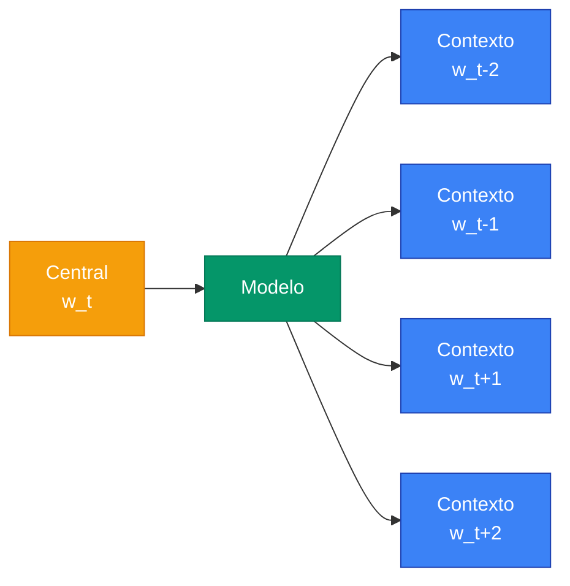
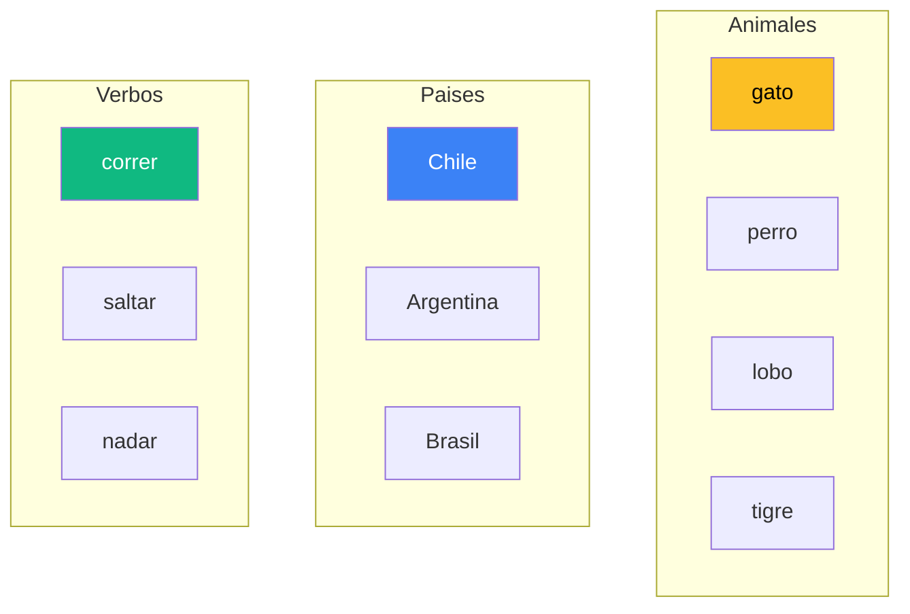

Los **embeddings distribuidos** son la forma en que las redes neuronales representan tokens discretos (palabras, subwords, caracteres, items, nodos de grafo) como **vectores densos en un espacio continuo de baja dimension**. A diferencia del one-hot encoding -- que asigna a cada palabra un vector ortogonal, gigante y sin estructura -- los embeddings ubican tokens semanticamente similares **cerca** en $\mathbb{R}^d$, lo cual habilita generalizacion, aritmetica vectorial y todas las arquitecturas modernas de NLP.

Son la primera capa de practicamente cualquier modelo de lenguaje (Word2Vec, GloVe, ELMo, BERT, GPT, Llama) y, mas alla del texto, aparecen en sistemas de recomendacion, biologia computacional (protein embeddings), grafos (node2vec) y vision (patch embeddings).

---

## 1. Por que Embeddings: el Costo del One-Hot

Considera un vocabulario de **50 000 palabras**. En one-hot encoding cada palabra es un vector de 50 000 dimensiones con un solo 1:

$$\vec{v}_{\text{gato}} = [0, 0, \ldots, 1, \ldots, 0] \in \{0, 1\}^{50000}$$

Tres problemas graves:

1. **Memoria y computo**: vectores enormes y dispersos. Multiplicar one-hot por una matriz de pesos $W \in \mathbb{R}^{50000 \times h}$ es ineficiente (aunque pueda optimizarse con indexing).
2. **Sin estructura semantica**: el producto punto entre `gato` y `perro` es 0, igual que entre `gato` y `tornillo`. **Todas las palabras son equidistantes** en one-hot space ($\|v_i - v_j\|^2 = 2$ para todo par).
3. **No hay generalizacion**: si el modelo aprende algo sobre `gato`, no transfiere nada a `felino`, `gatito` ni `cat`.

La solucion: representar cada palabra como un vector **denso** $e \in \mathbb{R}^d$ con $d \ll V$ (tipicamente $d = 128, 256, 512, 768, 1024$). La matriz completa de embeddings es:

$$E \in \mathbb{R}^{V \times d}$$

Cada fila $E_i$ es el vector de la palabra $i$. Total de parametros: $V \cdot d$ (ej. 50 000 x 512 = 25.6M). Mucho mas manejable, y -- lo crucial -- los vectores aprenden estructura.


**Hipotesis distribucional** (Harris 1954, Firth 1957): "una palabra esta caracterizada por la compania que mantiene". Palabras que aparecen en contextos similares tienen significados similares. Los embeddings distribuidos operacionalizan esta hipotesis -- aprender vectores tales que palabras de contextos similares queden cerca en el espacio.


---

## 2. Embedding Layer como Lookup

Formalmente, una capa de embedding es una funcion:

$$E: \{1, 2, \ldots, V\} \to \mathbb{R}^d$$

implementada como una **matriz de parametros** $E \in \mathbb{R}^{V \times d}$ donde la fila $i$-esima es el embedding del token $i$.

Dada una sequence de IDs $[t_1, t_2, \ldots, t_T]$ con $t_i \in \{1, \ldots, V\}$, la salida de la capa es:

$$X = E[t_1, t_2, \ldots, t_T] \in \mathbb{R}^{T \times d}$$

es decir, **seleccionar las filas correspondientes** por indice (gather/lookup).

### Equivalencia con multiplicacion por one-hot

Si $\mathbf{1}_t \in \{0, 1\}^V$ es el vector one-hot de $t$, entonces:

$$\mathbf{1}_t^T E = E[t]$$

Lookup y multiplicacion por one-hot son **matematicamente equivalentes**, pero el lookup es mucho mas eficiente: $O(d)$ memoria de salida vs $O(Vd)$ del producto matricial completo. Por eso los frameworks (PyTorch `nn.Embedding`, TF `tf.keras.layers.Embedding`, Flax `nn.Embed`) implementan el lookup como un kernel especializado de gather.


---

## 3. Inicializacion y Entrenamiento

### Inicializacion

La matriz $E$ se inicializa **aleatoriamente** -- tipicamente con una Gaussiana de varianza pequena:

$$E_{ij} \sim \mathcal{N}(0, \sigma^2), \quad \sigma^2 = \frac{1}{d}$$

o uniforme en $[-\sqrt{1/d}, \sqrt{1/d}]$. Otras opciones:
- **Xavier/Glorot**: $\sigma^2 = 2 / (V + d)$
- **Inicializacion desde pre-entrenado**: cargar Word2Vec/GloVe y opcionalmente fine-tunear.

### Entrenamiento

Los embeddings se entrenan **junto con el resto de la red** por gradient descent. No requieren supervision especifica: el gradiente de la loss final fluye hasta $E$ via la regla de la cadena.

Para cada token $t$ usado en el batch, $E[t]$ recibe gradiente $\partial \mathcal{L} / \partial E[t]$. Tokens **no usados** en un batch no se actualizan -- por eso el entrenamiento es sparse (solo unas pocas filas se modifican por step).


**No necesitas un objetivo de "embeddings"** para entrenarlos. Word2Vec y GloVe usan objetivos especiales (preview en seccion 5-6), pero en un Transformer moderno los embeddings se entrenan con la **misma loss** que el resto del modelo (cross-entropy del language modeling). El espacio semantico **emerge como subproducto** de aprender a predecir tokens.


---

## 4. Espacios Semanticos: la Magia de los Embeddings

Despues del entrenamiento, los embeddings exhiben **propiedades sorprendentes**: capturan estructura linguistica sin haber sido programados explicitamente para hacerlo.

### 4.1 Aritmetica vectorial

El ejemplo canonico (Mikolov et al. 2013, Word2Vec):

$$\vec{king} - \vec{man} + \vec{woman} \approx \vec{queen}$$

La interpretacion: existe una **direccion en el espacio** que codifica el concepto "genero". Sumar/restar a lo largo de esa direccion cambia esa propiedad mientras conserva otras (realeza, en este caso).

Otros ejemplos clasicos:

- $\vec{Paris} - \vec{France} + \vec{Italy} \approx \vec{Rome}$ (capital-pais)
- $\vec{walked} - \vec{walking} + \vec{swimming} \approx \vec{swam}$ (tiempo verbal)
- $\vec{biggest} - \vec{big} + \vec{small} \approx \vec{smallest}$ (superlativo)

### 4.2 Direcciones semanticas

Las "direcciones" no son ejes coordenados: son **subespacios lineales emergentes**. Restar pares como `(king, queen), (man, woman), (actor, actress)` y promediar produce una aproximacion al "vector genero". Proyectar palabras sobre ese vector revela sesgo: profesiones como "doctor", "engineer" caen en el lado masculino; "nurse", "teacher" en el femenino. Esto es la base de toda la literatura sobre **bias** en embeddings (Bolukbasi 2016).

### 4.3 Clusters semanticos

Sin entrenamiento supervisado, palabras se agrupan por categoria:

- **Animales**: `gato, perro, lobo, tigre, leon` aparecen juntos.
- **Paises**: `Chile, Argentina, Brasil, Peru` forman un cluster.
- **Verbos de movimiento**: `correr, caminar, saltar, nadar`.

Esto se visualiza con t-SNE/UMAP/PCA (seccion 10).

### 4.4 Similitud por coseno

La metrica natural en espacios de embedding es el **coseno**:

$$\text{sim}(u, v) = \frac{u^T v}{\|u\| \|v\|} \in [-1, 1]$$

Mas robusto que la distancia euclideana, porque ignora la **magnitud** de los vectores (solo importa la direccion).

---

## 5. Word2Vec (Mikolov 2013) -- Preview a Clase 17

**Word2Vec** popularizo embeddings entrenables a gran escala. Dos arquitecturas:

### 5.1 Skip-gram

Dado una palabra central $w$, predecir las palabras del contexto $c$ en una ventana de tamano $k$.



### 5.2 CBOW (Continuous Bag of Words)

Lo contrario: dado el contexto, predecir la palabra central. Mas rapido pero menos preciso para palabras infrecuentes.

### 5.3 Negative sampling

Computar softmax sobre todo el vocabulario es prohibitivo ($O(V)$ por step). Negative sampling reemplaza el problema multiclase por **clasificacion binaria**: distinguir pares reales `(w, c)` de pares aleatorios `(w, c')` con $c'$ muestreado de una distribucion de ruido $P_n$:

$$\log \sigma(v_c^T v_w) + \sum_{i=1}^{k} \mathbb{E}_{w_i \sim P_n} \log \sigma(-v_{w_i}^T v_w)$$

El primer termino empuja vectores de pares reales a tener producto punto **alto**; el segundo empuja pares falsos a producto punto **bajo** (sigmoid de negativo).

Tipicamente $k = 5$ a $20$ negativos por positivo. $P_n$ se elige como $P(w) \propto f(w)^{3/4}$ (frecuencia unigram suavizada), que mejora la calidad sobre uniforme o frecuencia pura.

---

## 6. GloVe (Pennington 2014)

**GloVe** (Global Vectors) toma un enfoque distinto: en lugar de aprender por sliding window, factoriza directamente la **matriz de co-ocurrencia** $X \in \mathbb{R}^{V \times V}$, donde $X_{ij}$ es el numero de veces que la palabra $j$ aparece en el contexto de la palabra $i$.

Funcion objetivo:

$$J = \sum_{i, j = 1}^{V} f(X_{ij}) \, (v_i^T \tilde{v}_j + b_i + \tilde{b}_j - \log X_{ij})^2$$

donde:
- $v_i$ y $\tilde{v}_j$ son embeddings de palabra y contexto (al final se promedian).
- $b_i, \tilde{b}_j$ son sesgos.
- $f(X_{ij})$ es una funcion de ponderacion que reduce el peso de pares muy frecuentes y muy raros:

$$f(x) = \begin{cases} (x / x_{\max})^{\alpha} & \text{si } x < x_{\max} \\ 1 & \text{si no} \end{cases}$$

con $x_{\max} = 100, \alpha = 0.75$.

GloVe combina lo mejor de dos mundos: la **estructura local** de Word2Vec (predecir contextos) y la **estructura global** de count-based methods (factorizacion de matriz). Pre-trained GloVe vectors (300d, entrenados sobre Common Crawl 840B tokens) fueron el embedding default en NLP entre 2014-2018.

---

## 7. Embeddings Estaticos vs Contextuales

Hasta aqui hemos hablado de embeddings **estaticos**: cada palabra tiene **un solo vector** independientemente del contexto.

Problema: la palabra `play` tiene significados muy distintos en:
- "I **play** guitar" (verbo, accion)
- "The **play** was great" (sustantivo, obra de teatro)
- "Children at **play**" (sustantivo, juego)

En W2V/GloVe, los tres comparten el mismo vector -- una mezcla promedio de todos los significados. Esto es la **polisemia** y es una limitacion fundamental.

### Embeddings contextuales

ELMo (Peters 2018), BERT (Devlin 2018), GPT (Radford 2018) introdujeron **embeddings contextuales**: el vector de cada palabra depende de **toda la oracion**. Pasan los embeddings estaticos por **capas de self-attention** que los recombinan en funcion del contexto.

| Modelo | Tipo | Embedding de "play" |
|---|---|---|
| Word2Vec | Estatico | Mismo vector siempre |
| GloVe | Estatico | Mismo vector siempre |
| ELMo | Contextual (BiLSTM) | Distinto por oracion |
| BERT | Contextual (Transformer encoder) | Distinto por oracion |
| GPT | Contextual (Transformer decoder) | Distinto por oracion |

En BERT/GPT, lo que llamamos "embedding" tiene dos niveles:

1. **Token embedding** (la matriz $E$ tradicional): un vector por token type.
2. **Contextual representation** (output de las capas Transformer): un vector por token instance, dependiente de la oracion completa.

El segundo es lo que se usa para tareas downstream (clasificacion, NER, similitud de oraciones).

---

## 8. Subword Tokenization

Vocabularios de palabras completas tienen problemas:

- **OOV (out-of-vocabulary)**: palabras nuevas (`COVID-19`, nombres propios, neologismos) no tienen embedding.
- **Lenguas morfologicamente ricas**: en finlandes una palabra puede tener docenas de formas conjugadas; tener un embedding por forma es desperdicio.
- **Tamano de vocabulario explota**: para cubrir bien un corpus en multiples idiomas necesitas $V > 1M$.

### Solucion: subword tokenization

Tokenizar en **unidades sub-palabra** -- piezas frecuentes que pueden combinarse para formar cualquier palabra (incluso nuevas).

| Algoritmo | Modelo | Idea |
|---|---|---|
| **BPE** (Byte Pair Encoding) | GPT, Llama | Merge iterativo de pares mas frecuentes |
| **WordPiece** | BERT | BPE con criterio de likelihood |
| **SentencePiece** | T5, mBERT | Trabaja directo sobre bytes/Unicode, maneja chino/japones sin pre-tokenizacion |
| **Unigram LM** | XLNet | Optimiza un modelo unigram, podando subwords |

### Ejemplo (BERT WordPiece)

```
"playing" → ["play", "##ing"]
"unhappiness" → ["un", "##happi", "##ness"]
"COVID-19" → ["co", "##vid", "-", "19"]
```

El prefijo `##` indica que la subword **continua** la palabra previa. Cada subword tiene su propio embedding en $E$. La palabra completa se reconstruye sumando o concatenando.

Tamano tipico de vocabulario subword: 30k-50k tokens. Cubre cualquier texto sin OOV (en el peor caso cae a bytes individuales).

---

## 9. Tied Embeddings

En modelos de lenguaje tipicos hay **dos** matrices de embedding:

1. **Input embedding** $E \in \mathbb{R}^{V \times d}$: convierte token IDs a vectores al inicio.
2. **Output projection** $W_{\text{out}} \in \mathbb{R}^{d \times V}$: convierte hidden state final a logits sobre el vocabulario.

Total: $2 V d$ parametros, que en modelos grandes domina (ej. Llama 7B: $V = 32000, d = 4096$ → 262M solo en embeddings, 4% del modelo).

### Weight tying (Press & Wolf 2017, Inan et al. 2017)

**Compartir pesos**: usar $W_{\text{out}} = E^T$. La distribucion sobre el vocabulario es:

$$P(\text{token}_t = v) = \text{softmax}(h_t E^T)_v = \frac{\exp(h_t \cdot E_v)}{\sum_{v'} \exp(h_t \cdot E_{v'})}$$

Interpretacion intuitiva: el logit de la palabra $v$ es el **producto punto** entre el hidden state final $h_t$ y el embedding $E_v$. Si $h_t$ "apunta hacia" $E_v$ en el espacio, $v$ es probable.

### Beneficios

- **Reduce parametros** a la mitad en la capa de embeddings: $V d$ en lugar de $2 V d$.
- **Mejora perplexity** consistentemente en LM (Press 2017 reporta ~2-3 puntos).
- **Coherencia semantica**: el espacio de input y output es el mismo.

Se usa en Transformer original (Vaswani 2017), GPT-2, T5, y muchos otros. Llama y modelos modernos a veces lo evitan para mas flexibilidad.

---

## 10. Visualizacion de Embeddings

Embeddings viven en $\mathbb{R}^d$ con $d = 128, 256, 512, \ldots$ -- imposibles de visualizar directamente. Tres tecnicas estandar de **reduccion de dimensionalidad**:

| Metodo | Tipo | Pros | Contras |
|---|---|---|---|
| **PCA** | Lineal | Rapido, deterministico, preserva varianza global | Mala calidad para clusters no lineales |
| **t-SNE** | No-lineal | Excelentes clusters locales | No preserva distancias globales, lento |
| **UMAP** | No-lineal | Mas rapido que t-SNE, preserva mas estructura global | Hiperparametros sensibles |

### Patrones esperables

Al proyectar embeddings de Word2Vec/GloVe a 2D con t-SNE, suelen aparecer:

- **Clusters por categoria**: animales, paises, colores, verbos.
- **Estructura jerarquica**: mamiferos cerca, dentro de animales, cerca de seres vivos.
- **Pares analogicos** alineados en proyecciones especificas (la direccion "genero", "tiempo verbal", "plural").



---

## 11. Implementacion

### 11.1 Token Embedding con escalado $\sqrt{d_{\text{model}}}$

En el Transformer original (Vaswani 2017), los embeddings se **escalan** por $\sqrt{d_{\text{model}}}$ antes de sumar el positional encoding. Esto mantiene la magnitud comparable a la del positional encoding (que tiene componentes en $[-1, 1]$).



```python
import torch
import torch.nn as nn
import math

class TokenEmbedding(nn.Module):
    """Embedding con escalado sqrt(d_model) (convencion Transformer)."""

    def __init__(self, vocab_size: int, d_model: int):
        super().__init__()
        self.embedding = nn.Embedding(vocab_size, d_model)
        self.d_model = d_model
        # Inicializacion: Gaussiana con std=d_model^-0.5
        nn.init.normal_(self.embedding.weight, mean=0.0, std=d_model ** -0.5)

    def forward(self, token_ids: torch.Tensor) -> torch.Tensor:
        # token_ids: (batch, seq_len)
        # output: (batch, seq_len, d_model)
        return self.embedding(token_ids) * math.sqrt(self.d_model)


class TiedLMHead(nn.Module):
    """Output projection que comparte pesos con la matriz de embedding."""

    def __init__(self, embedding: nn.Embedding):
        super().__init__()
        self.embedding = embedding  # referencia compartida

    def forward(self, hidden: torch.Tensor) -> torch.Tensor:
        # hidden: (batch, seq_len, d_model)
        # output: (batch, seq_len, vocab_size)
        return hidden @ self.embedding.weight.T


# Uso
vocab_size, d_model = 30_000, 512
tok_emb = TokenEmbedding(vocab_size, d_model)
lm_head = TiedLMHead(tok_emb.embedding)

ids = torch.randint(0, vocab_size, (4, 16))
x = tok_emb(ids)              # (4, 16, 512)
logits = lm_head(x)           # (4, 16, 30000)
print(x.shape, logits.shape)
```


```python
import jax
import jax.numpy as jnp
from flax import linen as nn
import math

class TokenEmbedding(nn.Module):
    vocab_size: int
    d_model: int

    @nn.compact
    def __call__(self, token_ids):
        # Inicializacion: Gaussiana con std=d_model^-0.5
        emb = self.param(
            "embedding",
            nn.initializers.normal(stddev=self.d_model ** -0.5),
            (self.vocab_size, self.d_model),
        )
        x = emb[token_ids]                       # gather
        return x * math.sqrt(self.d_model), emb  # devolvemos emb para tying


def tied_lm_head(hidden, embedding):
    """Output projection compartiendo la matriz de embedding."""
    return hidden @ embedding.T


# Uso
vocab_size, d_model = 30_000, 512
model = TokenEmbedding(vocab_size, d_model)
key = jax.random.PRNGKey(0)
ids = jax.random.randint(key, (4, 16), 0, vocab_size)
params = model.init(key, ids)
(x, emb), _ = model.apply(params, ids, mutable=[]), None
logits = tied_lm_head(x, emb)
print(x.shape, logits.shape)
```


```python
import tensorflow as tf
import math

class TokenEmbedding(tf.keras.layers.Layer):
    """Embedding con escalado sqrt(d_model) (convencion Transformer)."""

    def __init__(self, vocab_size: int, d_model: int, **kwargs):
        super().__init__(**kwargs)
        self.d_model = d_model
        self.embedding = tf.keras.layers.Embedding(
            vocab_size, d_model,
            embeddings_initializer=tf.keras.initializers.RandomNormal(
                stddev=d_model ** -0.5
            ),
        )

    def call(self, token_ids):
        return self.embedding(token_ids) * math.sqrt(self.d_model)


class TiedLMHead(tf.keras.layers.Layer):
    """Output projection compartiendo pesos con TokenEmbedding."""

    def __init__(self, token_embedding: TokenEmbedding, **kwargs):
        super().__init__(**kwargs)
        self.token_embedding = token_embedding

    def call(self, hidden):
        weight = self.token_embedding.embedding.embeddings  # (V, d)
        return tf.matmul(hidden, weight, transpose_b=True)


# Uso
vocab_size, d_model = 30_000, 512
tok_emb = TokenEmbedding(vocab_size, d_model)
lm_head = TiedLMHead(tok_emb)

ids = tf.random.uniform((4, 16), 0, vocab_size, dtype=tf.int32)
x = tok_emb(ids)              # (4, 16, 512)
logits = lm_head(x)           # (4, 16, 30000)
print(x.shape, logits.shape)
```



### 11.2 Aritmetica vectorial con embeddings entrenados

Mini ejemplo conceptual usando vectores aleatorios (en la practica se cargarian Word2Vec/GloVe pre-entrenados):

```python
import torch
import torch.nn.functional as F

# Vocabulario muy chico (en la practica V = 30k+)
vocab = ["king", "queen", "man", "woman", "prince", "princess"]
vocab_size, d = len(vocab), 64
torch.manual_seed(0)

# Simulamos embeddings con estructura: queen ~ king - man + woman
E = torch.randn(vocab_size, d)
gender = torch.randn(d) * 0.3
royalty = torch.randn(d) * 0.3
E[0] += royalty;             # king
E[1] += royalty - gender     # queen = royalty + female
E[2] += torch.zeros(d)       # man
E[3] -= gender               # woman = -gender
E[4] += royalty * 0.5        # prince
E[5] += royalty * 0.5 - gender # princess

def cosine_sim(a, b):
    return F.cosine_similarity(a.unsqueeze(0), b.unsqueeze(0)).item()

# Aritmetica: king - man + woman ~ queen?
v = E[0] - E[2] + E[3]
sims = {w: cosine_sim(v, E[i]) for i, w in enumerate(vocab)}
print(sorted(sims.items(), key=lambda x: -x[1])[:3])
```

En modelos reales (W2V, GloVe), esta aritmetica funciona "a ojo cerrado" en pares como (king, queen), (Paris, France), (walk, walked).

---

## 12. Limitaciones de Embeddings Estaticos

A pesar de la magia, los embeddings estaticos (W2V, GloVe, fastText) tienen **limites fundamentales** que motivan al Transformer:

### 12.1 Polisemia no resuelta

Una palabra = un vector. `bank` (rio) y `bank` (financiero) comparten embedding, que termina siendo una mezcla diluida. Lo mismo con `play, run, table, light, lie...`

### 12.2 No hay composicion

`hot dog` no es la suma de `hot` + `dog`. La fraseologia, expresiones idiomaticas (`break a leg`), nombres propios multi-palabra (`New York`) requieren composicion **dependiente del contexto**.

### 12.3 No actualiza con contexto

`apple` en "Apple anuncio el iPhone" vs "comi una apple" deberia ser distinto, pero W2V/GloVe entrega el mismo vector.

### 12.4 No captura sintaxis profunda

Embeddings capturan **similitud semantica** (gato ~ perro) pero no **rol sintactico** (sujeto vs objeto), que cambia segun la oracion.

### 12.5 Sesgos heredados

El espacio refleja sesgos del corpus de entrenamiento: `nurse` cerca de `she`, `engineer` cerca de `he`, asociaciones raciales/etnicas problematicas (Bolukbasi 2016, Caliskan 2017).


**El Transformer resuelve (1)-(4) con embeddings contextuales**: la representacion de cada token se actualiza en cada capa via self-attention, dependiendo de **todos** los demas tokens de la oracion. Asi, "play" en "I play guitar" y "the play was great" termina con vectores muy distintos despues de pasar por 12-96 capas Transformer. La limitacion (5) sigue siendo un problema abierto y motiva tecnicas de debiasing y RLHF.


---

## 13. Resumen

- **One-hot** es ineficiente y sin estructura semantica. Los **embeddings densos** $E \in \mathbb{R}^{V \times d}$ con $d \ll V$ ubican palabras similares cerca en un espacio continuo.
- **Embedding layer** = matriz $V \times d$ + lookup por indice. Equivalente (pero mas eficiente) a multiplicar one-hot por $E$.
- Se entrena con **gradient descent end-to-end**. No requiere objetivo especial (aunque W2V y GloVe definen uno).
- Espacios entrenados exhiben **aritmetica vectorial** (`king - man + woman ~ queen`), **clusters semanticos** y **direcciones interpretables**.
- **Word2Vec** (skip-gram, CBOW, negative sampling) y **GloVe** (factorizacion de co-ocurrencia) son los embeddings estaticos clasicos.
- **Embeddings contextuales** (ELMo, BERT, GPT) actualizan el vector segun la oracion completa via self-attention.
- **Subword tokenization** (BPE, WordPiece, SentencePiece) elimina OOV y maneja morfologia compleja con vocabularios fijos de 30-50k.
- **Tied embeddings** comparten input embedding y output projection: reduce parametros y mejora perplexity.
- **Limitaciones de estaticos** (polisemia, composicion, contexto, sesgos) son la motivacion directa al **Transformer**.

---

Ver tambien: [Self-Attention](/fundamentos/self-attention/) · [Transformer](/fundamentos/transformer/) · [Representacion de Datos](/fundamentos/representacion-datos/) · [Redes Recurrentes](/fundamentos/redes-recurrentes/) · [Mecanismo de Atencion](/fundamentos/mecanismo-atencion/) · [Clase 14](/clases/clase-14/).
