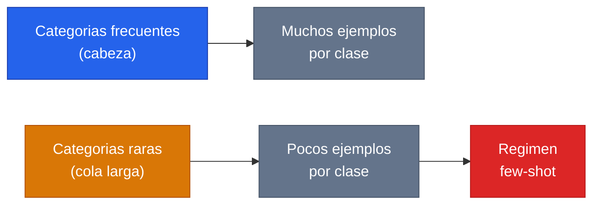
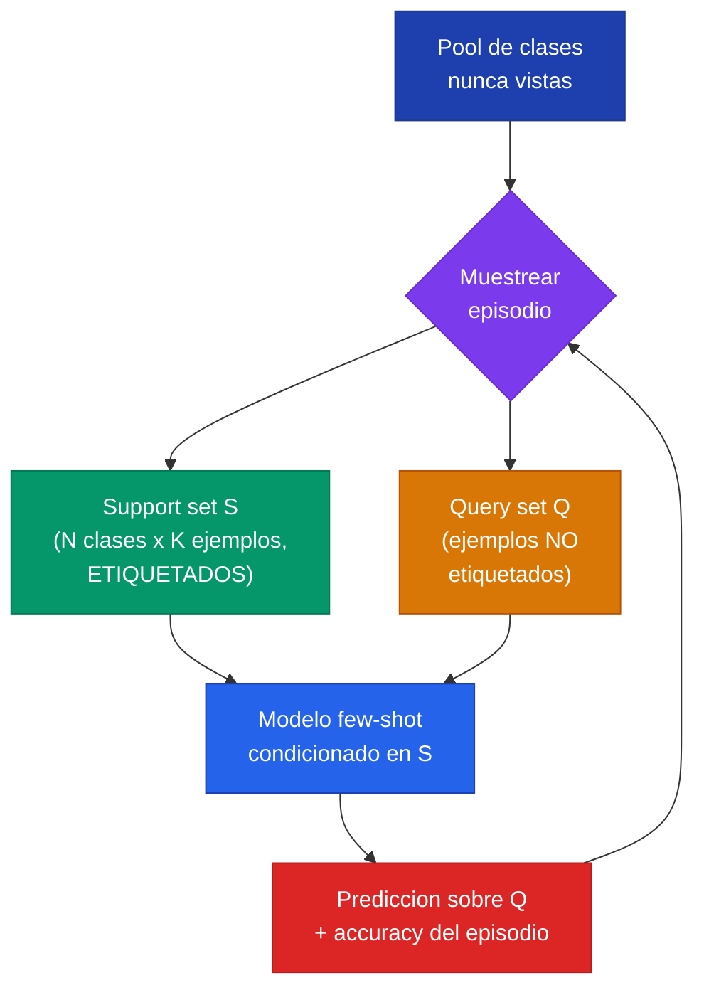
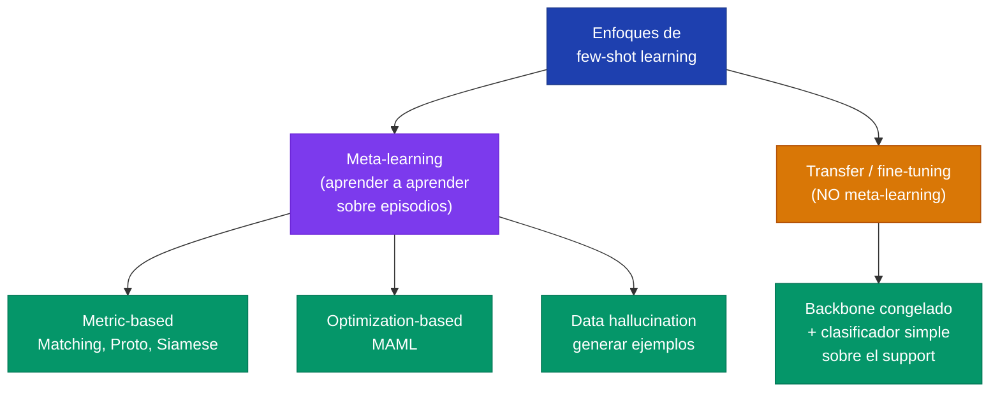

Few-shot learning es el planteamiento de un problema: aprender a reconocer una categoria nueva a partir de **muy pocos ejemplos etiquetados** —a veces uno solo, a veces ninguno. Es el regimen opuesto al de ImageNet (millones de imagenes, miles por clase) y, sin embargo, es el regimen en el que viven la mayoria de los problemas reales: enfermedades raras, idiomas con pocos recursos, fallas industriales infrecuentes. Conviene separar desde el inicio dos ideas que se confunden a menudo: few-shot learning es **el problema** (aprender de pocos datos), mientras que [meta-aprendizaje](meta-aprendizaje) es **una estrategia** para resolverlo (aprender a aprender).

---


**Few-shot learning** describe el *que*: clasificar a partir de un punado de ejemplos por clase. **Meta-learning** describe un *como*: entrenar sobre muchas tareas pequenas para que el modelo adquiera la habilidad de adaptarse rapido a una tarea nueva. No son sinonimos. Se puede hacer few-shot sin meta-learning (por ejemplo, fine-tuning de un modelo preentrenado, o un simple nearest-neighbor sobre features) y el meta-learning es solo una de las familias de soluciones. La confusion es comun porque el meta-learning resulto ser la estrategia dominante en los benchmarks academicos de few-shot.


---

## 1. El Problema: Aprender de Pocos Ejemplos

Un nino que ve **una sola foto** de una jirafa en un libro reconoce jirafas en el zoologico, en dibujos animados y de perfil al dia siguiente. Brenden Lake y colegas, en el paper de [Omniglot](/papers/omniglot-lake-2015), lo formulan como el desafio central: las personas aprenden conceptos ricos desde uno o un punado de ejemplos (*one-shot learning*), mientras que los mejores sistemas de deep learning de la epoca eran **los mas hambrientos de datos**, requiriendo decenas, cientos o miles de ejemplos por clase.

La tension es teorica, no solo practica. Bajo la teoria clasica del aprendizaje (el dilema sesgo-varianza, PAC learning), **ajustar un modelo mas complejo requiere mas datos, no menos**, para generalizar bien. Una red profunda con millones de parametros, expuesta a 5 ejemplos de una clase nueva, sobreajusta de inmediato: memoriza esos 5 puntos en vez de extraer el concepto.

Por que los humanos pueden y las redes hambrientas no? La respuesta de Lake es que el cerebro **no parte de cero**: trae un sesgo inductivo fortisimo, priors acumulados de toda la experiencia previa con conceptos relacionados, que reduce drasticamente el espacio de hipotesis plausibles. La eficiencia de datos no es magia; es **estructura y conocimiento previo transferido**. Esta observacion es la semilla de las dos grandes estrategias de few-shot: transferir representaciones (transfer learning) y transferir la habilidad de adaptarse (meta-learning).

### La cola larga

El problema de few-shot no es academico. Casi cualquier distribucion del mundo real tiene una **cola larga**: unas pocas categorias frecuentes (con muchos ejemplos) y una multitud de categorias raras (con poquisimos). En vision: unas pocas razas de perro comunes, miles de especies de insectos raras. En salud: unos pocos diagnosticos frecuentes, una larga cola de patologias raras donde cada hospital ve un punado de casos al ano.

Un modelo entrenado solo sobre la cabeza ignora la cola. Pero la cola, sumada, suele ser donde estan los casos mas valiosos o criticos. Few-shot learning es la disciplina de hacer que un modelo funcione **en la cola**, donde recolectar miles de ejemplos por clase es imposible por definicion.

---

## 2. El Protocolo N-way K-shot

El protocolo estandar para definir y evaluar few-shot learning fue formalizado por Vinyals et al. en [Matching Networks](/papers/matching-networks-vinyals-2016), y su vocabulario es hoy universal. Una tarea few-shot se llama un **episodio** y se construye con dos conjuntos disjuntos:

- **Support set $S$**: los pocos ejemplos etiquetados que el modelo puede "mirar" para aprender las clases del episodio. Contiene $N$ clases con $K$ ejemplos cada una, es decir $N \times K$ puntos. Formalmente $S = \{(x_i, y_i)\}_{i=1}^{N \cdot K}$.
- **Query set $Q$**: los ejemplos **no etiquetados** que el modelo debe clasificar en una de las $N$ clases del support. La accuracy sobre $Q$ es la metrica del episodio.

La notacion **$N$-way $K$-shot** resume la dificultad: $N$ es el numero de clases entre las que decidir (cuantas "vias"), $K$ es el numero de ejemplos por clase (cuantos "shots"). El rendimiento aleatorio (chance) es exactamente $1/N$.

La clave del protocolo es que las clases de un episodio de **test son clases nunca vistas en entrenamiento**. El modelo no aprende "gato" y "perro"; aprende a clasificar dadas pocas referencias, sea cual sea la clase. Esto es lo que Vinyals condensa en su principio rector: *"test and train conditions must match"* —si en produccion vas a ver pocos ejemplos de clases nuevas, entrena exactamente en ese regimen.

### Ejemplo concreto: 5-way 1-shot

Es el regimen mas citado. Se muestrean **5 clases** nunca vistas (por ejemplo 5 caracteres de un alfabeto que el modelo no entreno). De cada clase se da **1 solo ejemplo** etiquetado: el support set tiene $5 \times 1 = 5$ imagenes. Luego se presentan imagenes de query y, para cada una, el modelo debe decidir a cual de las 5 clases pertenece, usando como unica guia esas 5 imagenes de referencia. Chance = $1/5 = 20\%$.

| Parametro | Valor en 5-way 1-shot |
|---|---|
| $N$ (clases por episodio) | 5 |
| $K$ (ejemplos por clase) | 1 |
| Tamano del support set | $5 \times 1 = 5$ |
| Chance (accuracy aleatoria) | $20\%$ |
| Origen de las clases | Disjuntas de las de entrenamiento |

El objetivo de entrenamiento episodico (Ecuacion 2 de Matching Networks) maximiza la log-verosimilitud de las etiquetas del query condicionado al support, promediando sobre muchos episodios:


\theta = \arg\max_\theta\; \mathbb{E}_{L\sim T}\Bigg[\, \mathbb{E}_{S\sim L,\, Q\sim L}\bigg[ \sum_{(x,y)\in Q} \log P_\theta(y\mid x, S) \bigg]\Bigg]


donde $T$ es la distribucion de tareas, $L$ un conjunto de etiquetas muestreado, y $S$, $Q$ el support y query del episodio. El modelo no aprende clases; aprende **el acto de clasificar dado un support**.

---

## 3. One-shot y Zero-shot Learning

El numero de shots $K$ define un espectro de dificultad:

| Regimen | $K$ | Que recibe el modelo de la clase nueva | Como infiere |
|---|---|---|---|
| **Few-shot** | $K$ pequeno (2-20) | Un punado de ejemplos etiquetados | Generalizar desde los pocos ejemplos del support |
| **One-shot** | $K = 1$ | Un solo ejemplo etiquetado | Comparar el query contra esa unica referencia |
| **Zero-shot** | $K = 0$ | Ningun ejemplo; solo una **descripcion** | Puente via informacion auxiliar (atributos, texto, embedding semantico) |

**One-shot learning** es el caso extremo de few-shot con $K=1$. Es el regimen del experimento estrella de Omniglot (20-way 1-shot) y de la mayoria de las tablas de Matching Networks. Con un solo ejemplo no hay forma de estimar la varianza intra-clase desde los datos del episodio: toda la nocion de "que tanto puede variar esta clase" debe venir del conocimiento transferido. Por eso one-shot estresa al maximo la calidad del prior aprendido.

**Zero-shot learning** es cualitativamente distinto: $K=0$ significa que el modelo **nunca ve un ejemplo** de la clase objetivo, ni siquiera uno. La unica forma de clasificar es a traves de un **canal de informacion auxiliar** que conecta clases vistas y no vistas: vectores de atributos ("tiene rayas", "es un mamifero"), descripciones en lenguaje natural, o embeddings semanticos de la etiqueta. El modelo aprende a mapear ejemplos a ese espacio auxiliar; en test, dado solo la descripcion de una clase nueva, ubica el query en ese espacio y elige la clase mas cercana. El paper de Matching Networks menciona el trabajo de zero-shot sobre ImageNet (Norouzi et al., 2013, combinacion convexa de embeddings semanticos) como precedente.


La diferencia esencial: en **one-shot** la informacion sobre la clase nueva es un *ejemplo visual* (una imagen); en **zero-shot** es una *descripcion simbolica* (atributos o texto). One-shot generaliza desde un punto en el espacio de entrada; zero-shot generaliza cruzando dos espacios (entrada y descripcion). El zero-shot moderno de los LLMs —responder sobre una tarea descrita solo en el prompt, sin ejemplos— es heredero directo de esta idea.


---

## 4. La Taxonomia de Enfoques

Las soluciones a few-shot se agrupan en cuatro familias. Las tres primeras son variantes de meta-learning (aprender a aprender sobre muchos episodios); la cuarta no lo es.

### 4.1 Metric-based (basados en metrica)

Aprenden un **espacio de embedding** donde la clasificacion se reduce a comparar distancias. La idea: si proyectamos las imagenes a un espacio donde los ejemplos de la misma clase quedan cerca y los de clases distintas lejos, entonces clasificar un query es tan simple como ver a que ejemplo del support se parece mas. Es metric learning aplicado a episodios.

- **[Siamese Networks](/papers/siamese-networks-koch-2015)** (Koch et al., 2015): dos torres con pesos compartidos entrenadas en una tarea de "igual o distinto". En test, la red mide similitud y se hace nearest-neighbor. Fue el baseline neuronal mas fuerte de la epoca (8.0% error en Omniglot 20-way 1-shot).
- **[Matching Networks](/papers/matching-networks-vinyals-2016)** (Vinyals et al., 2016): clasifican el query como una **suma ponderada por atencion** de las etiquetas del support, $\hat{y} = \sum_i a(\hat{x}, x_i)\, y_i$, donde $a$ es un softmax sobre similitud coseno entre embeddings. Subsume kNN y kernel density estimation como casos particulares.
- **[Prototypical Networks](/papers/prototypical-networks-snell-2017)** (Snell et al., 2017): simplifican Matching Networks promediando los embeddings de cada clase en un **prototipo** $c_n = \frac{1}{|S_n|}\sum g(x_i)$ y clasificando por distancia euclidiana al prototipo mas cercano. Mas simple y a menudo mas preciso.

### 4.2 Optimization-based (basados en optimizacion): MAML

En lugar de aprender un espacio fijo, aprenden una **inicializacion de pesos** tal que pocos pasos de descenso de gradiente sobre el support basten para adaptarse a la tarea nueva. El representante es **[MAML](/papers/maml-finn-2017)** (Model-Agnostic Meta-Learning, Finn et al., 2017).

La idea es un bucle de dos niveles. En el **inner loop**, para cada tarea muestreada, se parte de los pesos meta-aprendidos $\theta$ y se dan unos pocos pasos de gradiente sobre el support, obteniendo $\theta_i'$:


\theta_i' = \theta - \alpha\, \nabla_\theta\, \mathcal{L}_{\mathcal{T}_i}(f_\theta)


En el **outer loop**, se actualiza $\theta$ para minimizar la perdida de los $\theta_i'$ adaptados sobre el query, a traves de todas las tareas. El resultado es una $\theta$ que no resuelve ninguna tarea en particular, pero esta **a pocos pasos** de resolver cualquiera. Es "model-agnostic" porque solo requiere que el modelo se entrene por gradiente: sirve para clasificacion, regresion o RL.

### 4.3 Data augmentation / hallucination

Atacan el problema generando datos sinteticos para las clases con pocos ejemplos. En vez de cambiar el clasificador, **agrandan el support** "alucinando" nuevos ejemplos plausibles: aplicando transformaciones aprendidas, transfiriendo modos de variacion intra-clase de clases ricas a clases pobres, o usando modelos generativos. BPL, el modelo de [Omniglot](/papers/omniglot-lake-2015), es un caso extremo de esta filosofia: aprende el proceso generativo causal (la mano que dibuja) y puede generar instancias nuevas de un concepto visto una sola vez.

### 4.4 Transfer / fine-tuning baselines

La familia que **no es meta-learning**: tomar un modelo preentrenado sobre un dataset grande, congelar el backbone como extractor de features, y sobre esas features entrenar un clasificador simple (regresion logistica, nearest-neighbor) usando solo el support. Es [transfer learning](transfer-learning) clasico aplicado al regimen de pocos datos. No hay entrenamiento episodico ni bucle de adaptacion; solo se aprovecha una representacion ya aprendida. Como veremos en la seccion 5, esta familia "aburrida" resulta sorprendentemente competitiva.

---

## 5. Por Que los Baselines Simples Son Sorprendentemente Fuertes

Durante 2017-2019 la narrativa del campo era que el meta-learning episodico era necesario para hacer few-shot bien. Una serie de papers criticos —el mas famoso, *"A Closer Look at Few-shot Classification"* (Chen et al., ICLR 2019), seguido de *"A Baseline for Few-shot Image Classification"* y *"Rethinking Few-Shot Image Classification"* (Tian et al., 2020)— desafiaron esa narrativa con un hallazgo incomodo:

> Un baseline de transfer learning bien implementado —entrenar un buen backbone sobre **todas** las clases base con clasificacion estandar, y luego ajustar solo un clasificador lineal o nearest-neighbor sobre el support de cada episodio— **iguala o supera** a muchos metodos de meta-learning sofisticados.

El mensaje central: gran parte de la ganancia atribuida al meta-learning provenia en realidad de **la calidad de la representacion aprendida (el embedding)**, no del mecanismo episodico en si. Un backbone mas profundo (de Conv-4 a ResNet) reducia la brecha entre metodos meta-learned y baselines casi hasta cero. Y cuando el backbone es muy bueno, "aprender un buen embedding" mediante clasificacion supervisada estandar resulta ser tanto o mas efectivo que el complejo bucle de dos niveles.


El debate del *"closer look"* dejo tres lecciones que sobreviven hoy:

1. **El embedding domina.** La eleccion de backbone importa mas que la eleccion de meta-learner. Esto resuena con la evidencia de [Yosinski et al.](/papers/transferable-features-yosinski-2014) sobre transferibilidad de features.
2. **Reporta baselines fuertes.** Muchos papers de meta-learning se comparaban contra baselines debiles. Un fine-tuning bien hecho es un competidor serio que siempre debe estar en la tabla.
3. **El meta-learning no es magia gratis.** Sigue siendo valioso (sobre todo en regimenes muy extremos o cross-domain), pero no es la unica via, ni siempre la mejor. La estrategia mas simple que funciona suele ganar en produccion.


---

## 6. Datasets y Benchmarks

La historia de los benchmarks de few-shot es la historia de la dificultad creciente. Casi todos comparten la estructura background/evaluation: un conjunto de clases base para "aprender a aprender" y un conjunto disjunto de clases novel para evaluar.

| Benchmark | Origen | Clases | Caracteristicas | Splits tipicos |
|---|---|---|---|---|
| **Omniglot** | [Lake et al., 2015](/papers/omniglot-lake-2015) | 1623 caracteres, 50 alfabetos | "Transpuesto de MNIST": muchas clases, 20 ejemplos c/u; incluye trazos | 5-way / 20-way, 1-shot / 5-shot |
| **miniImageNet** | [Vinyals et al., 2016](/papers/matching-networks-vinyals-2016) | 100 clases ImageNet, 600 img 84x84 c/u | El benchmark estandar por ~8 anos; cabe en memoria | 64/16/20 (Ravi-Larochelle); original 80/20 |
| **tieredImageNet** | Ren et al., 2018 | 608 clases ImageNet en 34 supercategorias | Split por supercategoria: base y novel **semanticamente disjuntas**; mas honesto | 351/97/160 clases |
| **CUB-200-2011** | Wah et al., 2011 | 200 especies de aves | Fine-grained: clases muy similares entre si; mide discriminacion fina | 100/50/50 |
| **Meta-Dataset** | Triantafillou et al., 2020 | 10 datasets heterogeneos | Episodios cruzan dominios (ImageNet, Omniglot, hongos, flores, signos...); mide generalizacion real | varios |

**Omniglot** fue introducido por Lake et al. precisamente como el contrapunto de MNIST: en vez de 10 clases con miles de ejemplos, 1623 clases con 20 ejemplos cada una. Su combinatoria enorme de episodios posibles lo hizo ideal para meta-learning. Pero los metodos modernos lo **saturaron** (errores < 1-2%), lo que motivo benchmarks mas duros.

**miniImageNet** nacio dentro del paper de Matching Networks: Vinyals et al. tomaron 100 clases al azar de ImageNet con 600 imagenes de 84x84 cada una, un benchmark "del tamano correcto" —dificil pero ejecutable en una sola maquina. Se convirtio en EL benchmark del campo. (Nota historica: el split 64/16/20 que hoy se cita como "estandar" es el de Ravi & Larochelle 2017; el split original de Vinyals era 80/20.)

**tieredImageNet** corrige una trampa de miniImageNet: alli las clases base y novel podian ser semanticamente cercanas (un perro en base, otro perro en novel), inflando los resultados. tieredImageNet separa por supercategoria, forzando que la evaluacion mida transferencia a conceptos genuinamente distintos. **Meta-Dataset** lleva esto al extremo: los episodios cruzan diez datasets de dominios dispares, midiendo la robustez bajo cambio de distribucion.

---

## 7. Metricas y Como Se Reportan

La accuracy de un episodio individual es ruidosa: depende de que clases y que ejemplos cayeron en ese muestreo. Un episodio "facil" (clases muy distintas) y uno "dificil" (clases similares) dan numeros muy diferentes. Por eso **nunca se reporta la accuracy de un episodio**, sino el promedio sobre cientos o miles de episodios muestreados al azar.

La convencion estandar del campo es reportar:


\bar{a} \pm 1.96 \cdot \frac{\sigma}{\sqrt{n}}


donde $\bar{a}$ es la accuracy media sobre $n$ episodios de test (tipicamente $n = 600$ o $n = 2000$), $\sigma$ es la desviacion estandar de las accuracies por episodio, y $1.96$ es el cuantil normal para el 95%. Un reporte tipico se ve asi: *"63.2% ± 0.7% (5-way 1-shot, 600 episodios)"*.


El **intervalo de confianza no es decorativo**: en few-shot las diferencias entre metodos suelen ser de 1-3 puntos, y los intervalos del orden de ±0.6-0.8. Si dos metodos difieren en 0.5 puntos pero sus intervalos se solapan, **la diferencia no es significativa**. Comparar accuracies sin intervalos (o con un numero distinto de episodios, o con backbones distintos) es la fuente mas comun de conclusiones erroneas en la literatura de few-shot. La leccion del *"closer look"* nacio en buena parte de auditar estas comparaciones.


Tambien importa fijar el **mismo backbone** al comparar: como vimos, un ResNet contra un Conv-4 cambia los numeros mas que el meta-learner. Las tablas honestas reportan el backbone junto a la accuracy.

---

## 8. Aplicaciones en el Mundo Real

Few-shot deja de ser un ejercicio academico exactamente alli donde recolectar datos es caro, lento o imposible.

**Medicina y salud.** Es el dominio few-shot por excelencia: los datos etiquetados son escasos, caros y de cola larga. Las **patologias raras** tienen, por definicion, pocos casos confirmados por institucion —a veces un punado al ano—. Un clasificador parametrico estandar sobreajusta; un esquema few-shot (embedding profundo entrenado sobre subtipos comunes, clasificacion no-parametrica sobre un support de los subtipos raros) encaja con la estructura del problema. El support set seria literalmente "estos 3 casos confirmados de este subtipo tumoral". Ademas, la propiedad de clasificar **clases nuevas sin reentrenar** es valiosa en produccion clinica, donde revalidar un modelo es costoso y regulatoriamente pesado: agregar una categoria diagnostica = agregar ejemplos al support, no reescribir pesos.

**NLP.** El few-shot moderno en lenguaje tomo un giro distinto con los LLMs. El *in-context learning* —dar unos pocos ejemplos en el prompt y dejar que el modelo infiera la tarea sin actualizar pesos— es few-shot learning en estado puro, y conecta directamente con la idea no-parametrica de Matching Networks (el modelo "atiende" sobre los ejemplos del contexto). Antes de los LLMs, few-shot en NLP atacaba clasificacion de texto en idiomas de pocos recursos, deteccion de intenciones nuevas, y la tarea original de one-shot language modeling de Vinyals sobre Penn Treebank.

**Drug discovery.** Predecir propiedades de moleculas (toxicidad, actividad contra un blanco) cuando solo hay un punado de compuestos medidos para un blanco nuevo es un problema few-shot natural. Modelos como las Graph Neural Networks combinadas con meta-learning aprenden a generalizar a tareas de prediccion molecular nuevas desde pocos ensayos, acelerando el cribado inicial donde los experimentos de laboratorio son el cuello de botella.

---

## 9. Retos: el Gap entre Benchmarks y Practica

Few-shot learning funciona impresionantemente bien en los benchmarks academicos —y a menudo decepciona al aterrizar en problemas reales. Tres brechas explican el desfase.

### 9.1 Domain shift dentro del benchmark

La promesa episodica asume que las tareas de test vienen de la **misma distribucion** que las de entrenamiento ($T' \approx T$). El caso $L_{dogs}$ de Matching Networks es la leccion mas honesta: el modelo se entreno muestreando support sets de clases **dispares** (uniformes sobre el arbol de ImageNet), pero en test el support contenia clases **muy similares entre si** (razas de perro, fine-grained). El desajuste rompio la promesa: Matching Networks **empeoro 1 punto** respecto al baseline justo en ese regimen. Si las condiciones de test no coinciden con las de train, el principio rector se vuelve en contra.

### 9.2 Cross-domain few-shot

Los benchmarks clasicos entrenan y evaluan sobre el **mismo dominio** (clases ImageNet base → clases ImageNet novel). Pero la practica suele exigir cruzar dominios: entrenar sobre imagenes naturales y desplegar sobre radiografias, imagenes satelitales o cultivos celulares. El benchmark *BSCD-FSL* (Broader Study of Cross-Domain Few-Shot Learning, Guo et al., 2020) mostro un resultado demoledor: bajo cross-domain real, **los metodos de meta-learning sofisticados a veces rinden peor que un simple fine-tuning**, porque la representacion meta-aprendida sobre el dominio fuente no transfiere. Cuanto mayor la distancia entre dominio fuente y objetivo, mas se invierte el ranking de metodos.

### 9.3 El gap benchmark-practica

Mas alla del domain shift, hay supuestos del benchmark que rara vez se cumplen en produccion:

| Supuesto del benchmark | Realidad en produccion |
|---|---|
| $N$ y $K$ fijos y conocidos | Numero de clases y ejemplos variable e impredecible |
| Support balanceado ($K$ igual por clase) | Distribucion desbalanceada, cola larga genuina |
| Clases mutuamente excluyentes y limpias | Etiquetas ruidosas, ambiguas, jerarquicas |
| Clase del query siempre en el support | Posibilidad de clases "ninguna de las anteriores" (open-set) |
| Backbone fuerte preentrenado disponible | A veces el dominio objetivo no tiene preentrenamiento relevante |


La advertencia practica de [Omniglot](/papers/omniglot-lake-2015) y [Matching Networks](/papers/matching-networks-vinyals-2016) se resume en una idea: **la eficiencia de datos se compra con estructura y conocimiento del dominio**, no con un algoritmo magico que aprende de la nada. Antes de elegir un meta-learner exotico, pregunta: tengo un buen backbone preentrenado en un dominio cercano? Coincide la distribucion de mis tareas de entrenamiento con la de despliegue? A menudo, un fine-tuning solido sobre una buena representacion supera a un metodo sofisticado mal ajustado a la realidad.


---

## Para Profundizar

- [Clase 26 - Few-shot Learning y metodos no-parametricos](/clases/clase-26) -- la clase que introduce el paradigma
- [Meta-aprendizaje](meta-aprendizaje) -- la estrategia dominante: aprender a aprender sobre episodios
- [Metric Learning](metric-learning) -- la base de Matching, Prototypical y Siamese Networks
- [Transfer Learning y Fine-Tuning](transfer-learning) -- el baseline sorprendentemente fuerte
- [Paper Matching Networks (Vinyals 2016)](/papers/matching-networks-vinyals-2016) -- protocolo N-way K-shot, miniImageNet, clasificador no-parametrico
- [Paper Prototypical Networks (Snell 2017)](/papers/prototypical-networks-snell-2017) -- prototipos por clase y distancia euclidiana
- [Paper Omniglot (Lake 2015)](/papers/omniglot-lake-2015) -- el benchmark fundacional y la tesis de composicionalidad/causalidad
- [Paper MAML (Finn 2017)](/papers/maml-finn-2017) -- meta-learning basado en optimizacion
- [Paper Siamese Networks (Koch 2015)](/papers/siamese-networks-koch-2015) -- el baseline metrico de one-shot
