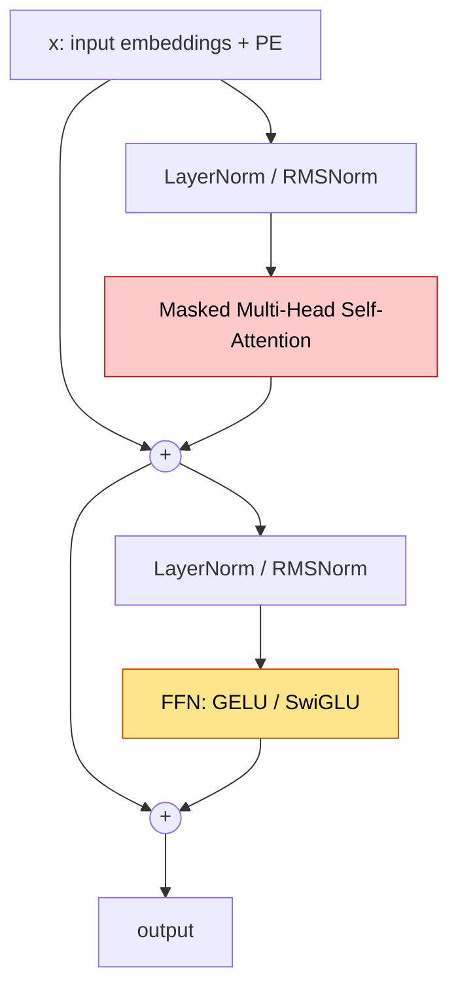
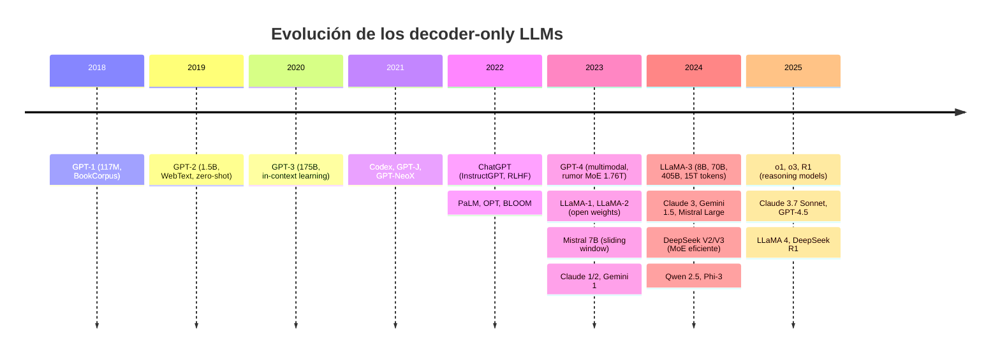
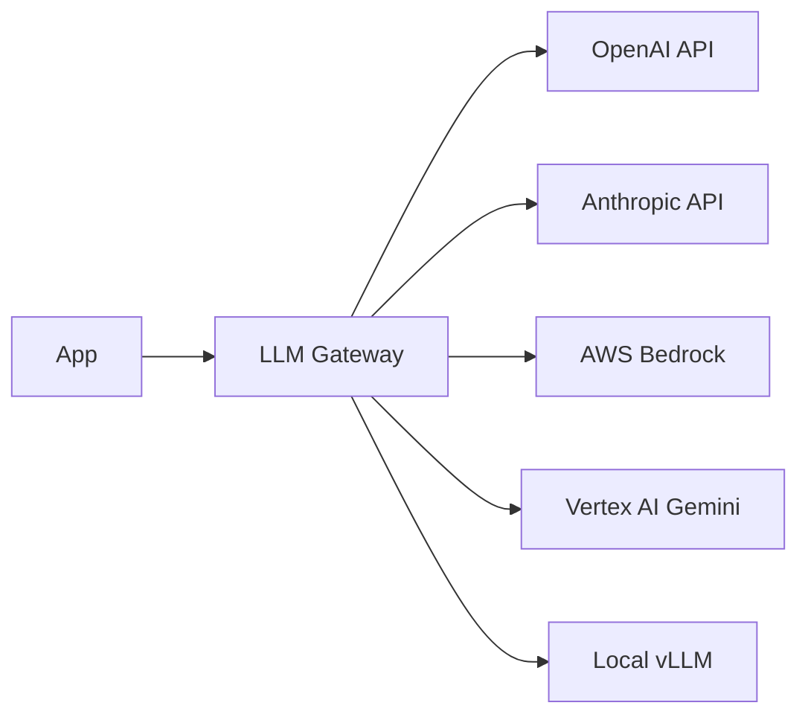

La **familia GPT** (Generative Pre-trained Transformer) es la rama **decoder-only autoregresiva** del Transformer original de Vaswani et al. (2017). Donde BERT mantuvo solo el encoder con atención bidireccional, GPT mantuvo solo el decoder con atención causal y se entrena con un único objetivo: **predecir el siguiente token**. Desde su primera versión en 2018 hasta los modelos de razonamiento de 2025 (o1, DeepSeek-R1, Claude 3.7), esta arquitectura pasó de 117M parámetros a más de 1T en menos de seis años, y se convirtió en la rama dominante de NLP a partir de 2020. ChatGPT, Claude, Gemini, LLaMA, Mistral, Qwen y DeepSeek son todos descendientes directos del bloque decoder-only.

Este fundamento cubre arquitectura, evolución histórica, mejoras modernas (RoPE, RMSNorm, SwiGLU, GQA, Flash Attention), pre-training y post-training, inferencia, leyes de escalamiento y la decisión arquitectónica encoder-only vs decoder-only.

---

## 1. Apertura: la rama autoregresiva del Transformer

El paper original *Attention is all you need* (Vaswani et al., 2017) introdujo un Transformer encoder-decoder para traducción. En 2018 esa arquitectura se bifurcó:

- **GPT-1** (Radford et al., OpenAI, junio 2018): conservó solo el stack del decoder, eliminó la cross-attention y entrenó con next-token prediction sobre BookCorpus.
- **BERT** (Devlin et al., Google, octubre 2018): conservó solo el stack del encoder, eliminó la máscara causal y entrenó con Masked Language Modeling.

Durante 2018-2021 BERT-like models dominaron casi todos los benchmarks de NLP. Pero a partir de GPT-3 (junio 2020), la rama decoder-only mostró una propiedad que cambió el campo: con suficiente escala, un modelo entrenado solo con next-token prediction adquiere **in-context learning** — la capacidad de resolver tareas nuevas a partir de ejemplos en el prompt, sin actualizar pesos. Esto eliminó la necesidad de fine-tunear un modelo distinto para cada tarea. ChatGPT (noviembre 2022) hizo masivo este paradigma, y desde entonces todos los modelos de frontera son decoder-only: GPT-4, Claude 3/4, Gemini 1.5/2, LLaMA 3, Mistral Large, Qwen 2.5, DeepSeek V3/R1.

La razón estructural del dominio decoder-only:

1. **Un solo objetivo** (next-token) escala mejor que MLM + NSP o span-corruption.
2. **Generación nativa**: el modelo produce texto sin necesidad de cabezas adicionales.
3. **In-context learning emergente**: solo aparece en decoders grandes.
4. **Eficiencia de inferencia**: KV-cache hace que cada token nuevo sea $O(n)$ en lugar de $O(n^2)$.
5. **Universalidad**: el mismo modelo sirve para chat, código, traducción, resumen y razonamiento — solo cambia el prompt.

---

## 2. Arquitectura decoder-only

### 2.1 El bloque GPT

Un modelo GPT moderno es un stack de $N$ bloques idénticos. Cada bloque tiene dos sub-bloques con residual + layer norm en formulación **pre-norm** (Xiong et al., 2020):



Formalmente, en pre-norm:

$$h' = x + \text{MaskedMHA}(\text{LN}(x))$$
$$h = h' + \text{FFN}(\text{LN}(h'))$$

No hay cross-attention (no hay encoder al cual atender). Solo hay **masked self-attention** sobre la propia secuencia. Toda la información temporal viaja por residual hacia arriba.

### 2.2 Atención causal: la diferencia esencial

El bloque GPT usa **masked multi-head self-attention** con máscara triangular superior. La posición $t$ solo puede atender a posiciones $\leq t$:

$$\text{mask}_{ij} = \begin{cases} 0 & \text{si } j \leq i \\ -\infty & \text{si } j > i \end{cases}$$

$$\text{Attention}(Q, K, V) = \text{softmax}\left(\frac{QK^T}{\sqrt{d_k}} + \text{mask}\right) V$$

Esta máscara es lo que distingue a GPT de BERT. En BERT no hay máscara: cada token ve a todos los demás. En GPT, durante training y inferencia, cada token solo ve el pasado. Es lo que permite:

- **Training paralelo**: toda la secuencia se procesa en una pasada con teacher forcing, pero el modelo no puede "hacer trampa" mirando el futuro.
- **Inferencia autoregresiva**: en cada paso, el modelo produce un token nuevo basándose solo en lo generado hasta ahora.
- **KV-caching**: como cada token solo depende del pasado, se puede cachear $K, V$ de tokens anteriores y solo computar $Q, K, V$ para el token nuevo.

### 2.3 Comparación con las otras dos ramas

| Familia | Atención | Pretraining | Cross-attention | Genera texto | Ejemplo |
|---|---|---|---|---|---|
| **Encoder-only** | Bidireccional | MLM (15% mask) | No | No | BERT, RoBERTa, DeBERTa |
| **Decoder-only** | Causal | Next-token | No | Sí (autoregresivo) | GPT, LLaMA, Claude, Mistral |
| **Encoder-Decoder** | Bi + Causal + Cross | Span corruption | Sí | Sí | T5, BART, mT5, Whisper |

La encoder-decoder fue dominante en 2019-2020 (T5, BART) pero perdió frente a decoder-only puro porque:

- Un decoder grande hace traducción zero-shot sin necesidad de la asimetría encoder-decoder.
- El span-corruption de T5 es más complejo de implementar y no escala tan bien como next-token.
- Tener dos stacks duplica costo de training y latencia de inferencia.

### 2.4 La distribución factorizada

El objetivo de un modelo decoder-only es modelar la distribución conjunta sobre secuencias de tokens. Esto se factoriza por la regla de la cadena de probabilidad:

$$P(x_1, x_2, \ldots, x_T) = \prod_{t=1}^{T} P(x_t \mid x_1, x_2, \ldots, x_{t-1}) = \prod_{t=1}^{T} P(x_t \mid x_{<t})$$

El modelo aprende $p_\theta(x_t \mid x_{<t})$, una distribución condicional parametrizada por $\theta$. La factorización autoregresiva es **exacta** (no hay aproximación), a diferencia de MLM que aproxima la conjunta con marginales independientes.

La log-likelihood del corpus es:

$$\mathcal{L}(\theta) = \sum_{t=1}^{T} \log p_\theta(x_t \mid x_{<t})$$

Minimizar la cross-entropy negativa equivale a maximizar esta log-likelihood. El loss por token es:

$$\ell_t = -\log p_\theta(x_t \mid x_{<t}) = -\log \text{softmax}(W_{\text{out}} h_t)_{x_t}$$

donde $h_t$ es la representación final del token en posición $t$ y $W_{\text{out}}$ es la matriz de proyección al vocabulario.

---

## 3. Evolución de la familia GPT



### 3.1 Tabla cronológica detallada

| Modelo | Año | Params | Tokens train | Contexto | Innovación clave |
|---|---|---|---|---|---|
| **GPT-1** | jun 2018 | 117M | ~5GB (BookCorpus) | 512 | Decoder-only + pretrain/fine-tune |
| **GPT-2** | feb 2019 | 1.5B | 40GB (WebText) | 1024 | Zero-shot transfer, pre-norm |
| **GPT-3** | jun 2020 | 175B | 570GB (CC filtrado) | 2048 | In-context learning, few-shot |
| **Codex** | jul 2021 | 12B | GitHub público | 4096 | Especialización a código |
| **InstructGPT** | mar 2022 | 175B | + RLHF data | 2048 | SFT + RLHF para alineamiento |
| **ChatGPT** | nov 2022 | ~175B | + diálogo + RLHF | 4096 | Producto masivo, conversación |
| **GPT-4** | mar 2023 | ~1.76T MoE (rumor) | ? | 8K-128K | Multimodal, razonamiento |
| **LLaMA-1** | feb 2023 | 7B, 13B, 33B, 65B | 1-1.4T tokens | 2048 | Open weights, RoPE, SwiGLU, RMSNorm |
| **LLaMA-2** | jul 2023 | 7B, 13B, 70B | 2T tokens | 4096 | GQA en 70B, RLHF público |
| **Mistral 7B** | sep 2023 | 7.3B | ? | 8192 (SWA) | Sliding window attention, GQA |
| **Claude 2** | jul 2023 | ? | ? | 100K | Constitutional AI, long context |
| **Gemini 1** | dic 2023 | Nano/Pro/Ultra | ? | 32K | Multimodal nativo, MoE |
| **Mixtral 8x7B** | dic 2023 | 47B (13B activos) | ? | 32K | MoE sparse, 2 expertos activos |
| **LLaMA-3** | abr 2024 | 8B, 70B, 405B | 15T tokens | 8K→128K | Sobre-entrenamiento, tiktoken-like BPE |
| **Gemini 1.5** | feb 2024 | ? MoE | ? | 1M-10M | Contexto extremo, recall efectivo |
| **Claude 3** | mar 2024 | Haiku/Sonnet/Opus | ? | 200K | Multimodal, razonamiento visual |
| **DeepSeek V3** | dic 2024 | 671B MoE (37B activos) | 14.8T | 128K | MLA + DeepSeekMoE, training eficiente |
| **o1 / o3** | sep 2024 / dic 2024 | ? | ? | 200K | Reasoning con chain-of-thought oculto |
| **DeepSeek R1** | ene 2025 | 671B MoE | + RL puro | 128K | RL sin SFT, razonamiento abierto |
| **Claude 3.7** | feb 2025 | ? | ? | 200K | Hybrid reasoning (extended thinking) |
| **LLaMA 4** | abr 2025 | Scout/Maverick/Behemoth MoE | ? | 10M (Scout) | MoE + long context masivo |

### 3.2 GPT-1 (2018): el punto de partida

Radford et al. (OpenAI, 2018) publicaron *Improving Language Understanding by Generative Pre-Training*. La arquitectura:

- 12 capas decoder-only
- $d_{\text{model}} = 768$, $d_{\text{ff}} = 3072$, 12 heads
- Pretraining: BookCorpus (~7000 libros, ~5GB)
- Fine-tuning supervisado por tarea (cabeza linear + LR bajo)
- Total: 117M parámetros

La contribución conceptual fue mostrar que **pretraining no supervisado + fine-tuning** funcionaba para tareas de NLP, anticipando lo que BERT formalizaría 4 meses después con bidireccionalidad. GPT-1 perdió frente a BERT en casi todos los benchmarks de la época por la asimetría de la atención causal en tareas de clasificación.

### 3.3 GPT-2 (2019): zero-shot y escala

Radford et al. (2019), *Language Models are Unsupervised Multitask Learners*. Cambios:

- Escala hasta 1.5B parámetros (vs 117M de GPT-1)
- WebText: 8M páginas web filtradas (~40GB)
- Pre-norm en lugar de post-norm (estabilidad en stacks profundos)
- LayerNorm en la salida final del stack
- Inicialización escalada por $1/\sqrt{N}$ para residuals
- Sin fine-tuning: solo prompting zero-shot

GPT-2 mostró que el mismo modelo, sin entrenamiento de tarea, podía hacer traducción, resumen y QA con solo un prompt apropiado. OpenAI inicialmente retuvo el modelo grande por "riesgo de mal uso" (decisión muy debatida).

### 3.4 GPT-3 (2020): in-context learning

Brown et al. (NeurIPS 2020), *Language Models are Few-Shot Learners*. El salto:

- 175B parámetros (117x más que GPT-2)
- 96 capas, $d_{\text{model}} = 12288$, 96 heads
- Common Crawl filtrado + WebText2 + Books1/2 + Wikipedia, ~570GB total
- ~300B tokens vistos
- **In-context learning emergente**: dar ejemplos en el prompt mejora dramáticamente el desempeño sin actualizar pesos
- Atención sparse alternada (densa y sparse) para reducir costo

La conclusión del paper: el desempeño zero/few-shot escala como ley de potencia con parámetros y compute. Esto inauguró la era del prompting y eliminó la necesidad de fine-tuning para muchas tareas.

### 3.5 InstructGPT y ChatGPT (2022): el giro al alineamiento

Ouyang et al. (NeurIPS 2022), *Training language models to follow instructions with human feedback*. El pipeline:

1. **SFT**: fine-tune supervisado sobre demostraciones humanas de instrucciones bien resueltas.
2. **Reward model**: entrenar un modelo que predice preferencias humanas entre dos respuestas (Bradley-Terry sobre rankings).
3. **RLHF**: PPO sobre el modelo SFT, optimizando el reward, con penalización KL hacia la política inicial para no colapsar.

ChatGPT (noviembre 2022) aplicó este pipeline al GPT-3.5 con datos de diálogo. El resultado fue masivo: 100M usuarios en 2 meses, el lanzamiento de producto consumer más rápido de la historia. Cambió la conversación pública sobre IA y aceleró la era de los LLM-as-product.

### 3.6 GPT-4 (2023): multimodal y MoE rumoreado

OpenAI nunca publicó la arquitectura oficial. Filtraciones y análisis (George Hotz, Semianalysis) sugieren:

- ~1.76T parámetros totales, ~280B activos por forward pass
- Mixture of Experts con 8-16 expertos, 2 activos por token
- Multimodal nativo (vision encoder + decoder de texto)
- Contexto inicial 8K, ampliado a 32K y 128K
- Entrenado en cluster de ~25k H100s

Sin paper, los detalles son especulación. Pero GPT-4 marcó el comienzo de la era multimodal mainstream.

### 3.7 LLaMA (Meta, 2023-2025): open weights con arquitectura moderna

Touvron et al. (2023). LLaMA-1 estableció el blueprint moderno:

- **RoPE** (Rotary Positional Embedding) en lugar de PE absoluto
- **RMSNorm** en lugar de LayerNorm
- **SwiGLU** en FFN en lugar de ReLU/GELU
- **Pre-norm** consistente
- Sin bias en linears (excepto algunos casos)

LLaMA-2 añadió GQA en el 70B. LLaMA-3 escaló a 405B y entrenó 15T tokens (deliberadamente sobre-entrenado respecto a Chinchilla optimal). LLaMA-4 (abril 2025) introdujo MoE (Scout/Maverick/Behemoth) y contexto extremo (10M en Scout).

El impacto de LLaMA: open weights de calidad frontier, lo que habilitó la era de **local LLMs** y modelos derivados (Vicuna, Alpaca, Mistral, Qwen).

### 3.8 Mistral, Claude, Gemini, DeepSeek, Qwen

- **Mistral** (Mistral AI, 2023): sliding window attention en 7B, MoE en Mixtral 8x7B. Open weights agresivo y modelos pequeños competitivos.
- **Claude** (Anthropic): Constitutional AI, foco en alineamiento, contexto largo (100K-1M). No publica arquitectura.
- **Gemini** (Google): multimodal nativo, contexto récord (1M-10M), MoE. Cierre en torno a TPUs.
- **DeepSeek** (China): DeepSeekMoE + MLA (Multi-head Latent Attention) para reducir KV-cache. DeepSeek-R1 (enero 2025) entrenó razonamiento con RL puro, sin SFT inicial.
- **Qwen** (Alibaba): open weights, fuerte en mandarín e inglés, MoE en versiones grandes (Qwen2.5-Max).

### 3.9 Modelos de razonamiento (2024-2025)

OpenAI o1 (septiembre 2024) introdujo una nueva clase: el modelo dedica **tokens internos de pensamiento** antes de responder. La cadena de razonamiento se entrena con RL sobre tareas verificables (matemáticas, código).

DeepSeek-R1 (enero 2025) replicó esto en open weights, mostrando que RL puro sobre un modelo base puede inducir razonamiento sin SFT inicial. Claude 3.7 Sonnet (febrero 2025) introdujo **hybrid reasoning**: el modelo puede activar "extended thinking" bajo demanda.

Este es el paradigma actual: **test-time compute** escala como complemento al training compute.

---

## 4. Mejoras arquitectónicas modernas

Las mejoras post-GPT-3 son refinamientos del bloque decoder-only. Casi todas vienen de la línea LLaMA y se adoptaron universalmente. Para fundamentos generales de bloques residuales y normalización, ver [Arquitectura Transformer](/fundamentos/transformer).

### 4.1 Pre-LN vs Post-LN

El paper original Vaswani 2017 usa **post-norm**:

$$x_{\ell+1} = \text{LayerNorm}(x_\ell + \text{Sublayer}(x_\ell))$$

A partir de GPT-2 todos los decoders modernos usan **pre-norm**:

$$x_{\ell+1} = x_\ell + \text{Sublayer}(\text{LayerNorm}(x_\ell))$$

Razón: en stacks profundos (24-96+ capas) post-norm es numéricamente inestable. Pre-norm mantiene la rama residual "limpia" (no normalizada) y el gradiente fluye mejor. Se requiere una LayerNorm final extra antes de la cabeza de salida.

### 4.2 RoPE (Rotary Positional Embedding)

Su et al. (2021), *RoFormer*. En lugar de sumar un PE absoluto, RoPE **rota** los vectores $Q$ y $K$ por un ángulo dependiente de la posición antes de calcular el dot product:

$$R_\theta(x_m) = \begin{pmatrix} \cos m\theta & -\sin m\theta \\ \sin m\theta & \cos m\theta \end{pmatrix} \begin{pmatrix} x_m^{(1)} \\ x_m^{(2)} \end{pmatrix}$$

Por pares de dimensiones, con $\theta_i = 10000^{-2i/d}$. La propiedad clave:

$$\langle R_m Q, R_n K \rangle = \langle Q, R_{n-m} K \rangle$$

El dot product depende solo de la **diferencia relativa** $n - m$. Esto da:

- Codificación relativa nativa, sin parámetros adicionales.
- Extrapolación parcial a contextos más largos que los vistos en training (con técnicas como NTK-scaling, YaRN).
- Mejor inductive bias que PE absoluto aprendido.

Usado en LLaMA, Mistral, DeepSeek, Qwen, casi todos los modernos. Ver [Positional Encoding](/fundamentos/positional-encoding) para detalles.

### 4.3 ALiBi (Attention with Linear Biases)

Press et al. (2022). Alternativa a RoPE: en lugar de rotar, suma un bias lineal a los logits de atención proporcional a la distancia relativa:

$$\text{logits}_{ij} = q_i \cdot k_j - m_h \cdot |i - j|$$

donde $m_h$ es una pendiente fija por head (geométricamente espaciada). Sin parámetros aprendibles. Funciona bien para extrapolación a contextos largos (BLOOM, MPT, Replit). Hoy menos usado que RoPE, pero conceptualmente simple.

### 4.4 RMSNorm vs LayerNorm

LayerNorm tradicional:

$$\text{LN}(x) = \gamma \cdot \frac{x - \mu}{\sqrt{\sigma^2 + \epsilon}} + \beta$$

RMSNorm (Zhang & Sennrich, 2019) elimina el centrado:

$$\text{RMSNorm}(x) = \gamma \cdot \frac{x}{\sqrt{\frac{1}{d}\sum_{i=1}^{d} x_i^2 + \epsilon}}$$

Ventajas:
- ~7-15% más rápido (no calcula $\mu$, no resta).
- Menos parámetros (no hay $\beta$).
- Resultados empíricamente equivalentes o mejores.

Adoptado por LLaMA, Mistral, Gemma, DeepSeek, Qwen. GPT-2/3 todavía usan LayerNorm clásica.

### 4.5 SwiGLU vs ReLU/GELU

FFN clásica (Vaswani):

$$\text{FFN}(x) = \max(0, x W_1) W_2$$

GPT-2/3 usaron GELU. LLaMA introdujo **SwiGLU** (Shazeer 2020), una variante con gate:

$$\text{SwiGLU}(x) = (\text{Swish}(x W_{\text{gate}}) \odot (x W_{\text{up}})) W_{\text{down}}$$

donde $\text{Swish}(x) = x \cdot \sigma(x)$ y $\odot$ es producto elemento-a-elemento. La FFN ahora tiene **3 matrices** en lugar de 2: $W_{\text{gate}}, W_{\text{up}}, W_{\text{down}}$. Para mantener el conteo de parámetros, se reduce $d_{\text{ff}}$ de $4 d_{\text{model}}$ a $\frac{8}{3} d_{\text{model}}$.

Empíricamente mejora la pérdida ~1-2% sin overhead significativo. Adoptado universalmente desde LLaMA.

### 4.6 GQA (Grouped Query Attention)

Ainslie et al. (2023). En MHA estándar hay $h$ heads independientes, cada una con su propio $Q, K, V$. Esto hace que el **KV-cache** crezca como $O(h \cdot d_k \cdot T)$ por capa, dominando la memoria en inferencia.

Variantes:

| Esquema | Heads de Q | Heads de K, V | Calidad | Velocidad inferencia |
|---|---|---|---|---|
| **MHA** (estándar) | $h$ | $h$ | Mejor | Lento |
| **MQA** (Shazeer 2019) | $h$ | 1 | Peor | Rápido |
| **GQA** | $h$ | $g$ con $1 < g < h$ | Casi MHA | Casi MQA |

GQA divide los heads de Q en $g$ grupos; cada grupo comparte un par $(K, V)$. LLaMA-2 70B usó $h=64, g=8$. Reduce KV-cache 8x con pérdida mínima de calidad. Hoy estándar en modelos grandes.

### 4.7 MLA (Multi-head Latent Attention)

DeepSeek V2/V3. Comprime $K, V$ a un vector latente de baja dimensión antes de cachear, y los reproyecta on-the-fly. Reduce KV-cache ~5-10x respecto a GQA con calidad equivalente. Es la innovación clave que permitió a DeepSeek entrenar V3 (671B MoE) con costo competitivo.

### 4.8 Flash Attention

Dao et al. (2022, 2023). Kernel CUDA que reorganiza el cómputo de attention para:

- **Tiling**: procesa bloques de $Q, K, V$ por separado, manteniendo todo en SRAM.
- **Online softmax**: calcula softmax incrementalmente sin materializar la matriz $QK^T$ completa en HBM.
- Reduce memoria de $O(N^2)$ a $O(N)$.
- 2-4x más rápido que attention naive en entrenamiento.

Flash Attention 2 (2023) y 3 (2024, optimizado para Hopper) son el estándar de facto. Sin Flash Attention, contextos largos (32K+) serían inviables económicamente.

### 4.9 MoE (Mixture of Experts)

Shazeer et al. (2017), revivido en GShard, Switch Transformer y luego en Mixtral, DeepSeek, GPT-4 (rumoreado), Gemini.

Idea: reemplazar la FFN densa por $E$ FFNs paralelas (expertos) y un **router** que selecciona los $k$ expertos más relevantes por token. Solo se computan $k$ expertos por token, no $E$.

Ejemplo Mixtral 8x7B: 8 expertos, $k=2$. Parámetros totales 47B, parámetros activos por forward pass ~13B. Calidad cercana a un modelo denso 47B, costo de inferencia cercano a uno 13B.

DeepSeek-MoE refina con expertos "shared" (siempre activos para conocimiento general) + expertos "routed" (especializados).

### 4.10 Sliding Window Attention

Mistral 7B. La atención se restringe a una ventana de $W$ tokens hacia atrás. Reduce complejidad de $O(N^2)$ a $O(N \cdot W)$. Información a más de $W$ se propaga a través de las capas (cada capa "ve" $W$ tokens más atrás efectivamente). Permite contextos largos con costo lineal, pero con recall imperfecto a distancias mayores que $L \cdot W$ (donde $L$ es el número de capas).

---

## 5. Tokenización: BPE

GPT usa **Byte Pair Encoding** (BPE), no WordPiece como BERT.

- **GPT-1, GPT-2**: BPE basado en bytes (byte-level BPE). Vocab ~50k tokens. Implementación en `tiktoken` (OpenAI).
- **GPT-3, GPT-3.5**: misma familia, vocab ampliado.
- **GPT-4, GPT-4o**: tokenizers `cl100k_base` y `o200k_base` con vocab más grande, mejor compresión para código y multilingüe.
- **LLaMA-1/2**: SentencePiece BPE, vocab 32k.
- **LLaMA-3**: tokenizer tipo tiktoken, vocab 128k. Mejor cobertura multilingüe.
- **Qwen, DeepSeek**: BPE con vocab grandes (150k+) y soporte fuerte de chino.

BPE funciona uniendo iterativamente el par de bytes/caracteres más frecuente. Garantiza:

- No hay tokens `[UNK]` (cualquier byte se representa).
- Compresión adaptativa: palabras frecuentes son tokens únicos, raras se descomponen en subwords.
- Cobertura multilingüe sin reentrenar.

Detalle práctico: la **calidad del tokenizer afecta directamente el contexto efectivo**. Un tokenizer eficiente para español comprime ~3.5 caracteres por token; uno malo, ~1.5. Es por esto que LLaMA-3 dobló el vocab respecto a LLaMA-2.

Ver [BPE](/fundamentos/bpe) para detalles del algoritmo.

---

## 6. Pre-training: corpus y compute

### 6.1 Corpus por modelo

| Modelo | Corpus | Tamaño | Filtros |
|---|---|---|---|
| GPT-1 | BookCorpus | ~5 GB | 7000 libros, ficción |
| GPT-2 | WebText | ~40 GB | Outlinks de Reddit con karma ≥ 3 |
| GPT-3 | CC + WebText2 + Books + Wiki | ~570 GB | Filtros de calidad ML-based |
| LLaMA-1 | CC + C4 + GitHub + Wiki + Books + ArXiv + StackExchange | 1.4T tokens | Filtros heurísticos |
| LLaMA-2 | Similar a LLaMA-1, más curado | 2T tokens | Filtros adicionales |
| LLaMA-3 | Web + código + multilingüe | 15T tokens | Filtros ML, dedup, calidad |
| DeepSeek V3 | Web + código + matemáticas | 14.8T tokens | Filtros específicos por dominio |

La tendencia: **más datos, más curados, más diversos**. LLaMA-3 con 15T tokens es 25x más datos que LLaMA-2.

### 6.2 Compute y FLOPs

Una heurística útil: $\text{FLOPs}_{\text{training}} \approx 6 \cdot N \cdot D$ donde $N$ son parámetros y $D$ tokens.

| Modelo | Params | Tokens | FLOPs estimados |
|---|---|---|---|
| GPT-3 | 175B | 300B | $3.1 \times 10^{23}$ |
| LLaMA-1 65B | 65B | 1.4T | $5.5 \times 10^{23}$ |
| LLaMA-2 70B | 70B | 2T | $8.4 \times 10^{23}$ |
| LLaMA-3 405B | 405B | 15T | $3.6 \times 10^{25}$ |
| GPT-4 (estimado) | ~280B activos | ~13T | $\sim 2 \times 10^{25}$ |

LLaMA-3 405B requirió ~30M horas H100. Solo Meta, Google, OpenAI, Anthropic, xAI y los hyperscalers chinos pueden permitirse esta escala.

---

## 7. Pre-training objective: next-token prediction

El objetivo es minimizar la cross-entropy negativa por token:

$$\mathcal{L} = -\frac{1}{T} \sum_{t=1}^{T} \log p_\theta(x_t \mid x_{<t})$$

Implementación con teacher forcing: la secuencia completa se procesa en una pasada, los logits del token $t$ se comparan con el token real $x_{t+1}$, y se promedia el loss.

```python
# Pseudo-código del loss
logits = model(input_ids)  # [B, T, V]
shift_logits = logits[:, :-1, :].contiguous()  # predicción
shift_labels = input_ids[:, 1:].contiguous()    # target shifted
loss = cross_entropy(shift_logits.view(-1, V), shift_labels.view(-1))
```

**Perplexity** es la métrica derivada: $\text{PPL} = \exp(\mathcal{L})$. Interpretable como "número efectivo de tokens entre los cuales el modelo está indeciso". GPT-3 alcanzó PPL ~3 en WebText (perfecto sería 1).

**Por qué funciona tan bien**: predecir el próximo token requiere, implícitamente, modelar sintaxis, semántica, hechos del mundo, razonamiento lógico, estructura de código, traducciones, etc. La compresión óptima del texto humano contiene casi todo el conocimiento útil. Esto es la tesis de Hutter / Sutskever: **compression is intelligence**.

---

## 8. Inferencia

### 8.1 Generación autoregresiva

En inferencia, el modelo produce un token a la vez:


Cada paso es $O(N)$ con KV-cache, $O(N^2)$ sin caché. Para una respuesta de 1000 tokens, esto significa 1000 forward passes secuenciales — **inferencia es latency-bound, no compute-bound**.

### 8.2 Estrategias de sampling

#### Greedy decoding

Tomar el argmax en cada paso:

$$x_{t+1} = \arg\max_v p_\theta(v \mid x_{\leq t})$$

Determinista. Tiende a producir texto repetitivo y poco creativo.

#### Beam search

Mantener las $B$ secuencias más probables en cada paso. Útil en traducción y resumen, raramente usado en chat (produce texto "promedio" poco interesante).

#### Temperature sampling

Dividir los logits por $\tau$ antes del softmax:

$$p_\theta(v \mid x_{\leq t}; \tau) = \frac{\exp(z_v / \tau)}{\sum_u \exp(z_u / \tau)}$$

- $\tau \to 0$: equivalente a greedy (distribución pico).
- $\tau = 1$: distribución original.
- $\tau \to \infty$: distribución uniforme.

Valores típicos: 0.7-1.0 para chat, 0.0-0.3 para tareas precisas (código, math).

#### Top-k sampling

Mantener solo los $k$ tokens con mayor probabilidad, renormalizar, samplear. Típico $k = 40-100$.

#### Top-p (nucleus) sampling

Holtzman et al. (2020). Mantener el conjunto mínimo de tokens cuya probabilidad acumulada $\geq p$:

$$V_p = \{v : \sum_{u \in V_p} p_\theta(u) \geq p\}$$

donde $V_p$ son los tokens ordenados por probabilidad. Adaptativo: en distribuciones agudas $|V_p|$ es pequeño; en distribuciones planas, grande. Típico $p = 0.9-0.95$.

#### Min-p sampling

Reciente (2024). Filtrar tokens con probabilidad menor a $p_{\min} \cdot \max_v p(v)$. Más estable que top-p en distribuciones muy planas.

#### Combinaciones

En la práctica se combinan: temperature → top-k → top-p. Cada API expone parámetros similares (`temperature`, `top_p`, `top_k`).

### 8.3 KV-caching

Sin caché: en el paso $t$, el modelo recomputa $Q, K, V$ para todos los tokens $1, \ldots, t$. Costo $O(t)$ por paso, $O(T^2)$ total.

Con KV-cache: solo se computa $Q, K, V$ del token nuevo. Los $K, V$ de tokens anteriores se cachean. La atención hace:

$$\text{Attention}(q_t, K_{1:t}, V_{1:t})$$

donde $K_{1:t} = [K_{1:t-1}; k_t]$ (concatenación con el caché previo). Costo $O(1)$ por paso, $O(T)$ total.

Trade-off: la memoria del KV-cache crece linealmente con $T$ y el batch size. Para LLaMA-3 70B con contexto 128K, el KV-cache solo puede ocupar ~40 GB en FP16. Por eso GQA y MLA son críticos.

### 8.4 Speculative decoding

Leviathan et al. (2023). Un modelo "draft" pequeño y rápido propone $k$ tokens; el modelo grande los verifica en una sola pasada. Si los acepta, ahorra $k$ forward passes. Si rechaza alguno, retrocede. Acelera inferencia 2-3x sin cambiar la distribución de salida.

---

## 9. Leyes de escalamiento

### 9.1 Kaplan et al. (2020): scaling is all you need

OpenAI mostró que el loss de un Transformer entrenado para next-token sigue una ley de potencia:

$$L(N) = \left(\frac{N_c}{N}\right)^{\alpha_N}$$

donde $N$ son parámetros, $N_c$ una constante, $\alpha_N \approx 0.076$. Similar para tokens $D$ y compute $C$. La conclusión de Kaplan: **escalar parámetros es más eficiente que escalar tokens**. Esto guió GPT-3 (175B, "solo" 300B tokens).

### 9.2 Hoffmann et al. (2022): Chinchilla

DeepMind reanalizó las leyes de escalamiento incluyendo la dependencia entre $N$ y $D$ óptimos:

$$L(N, D) = E + \frac{A}{N^\alpha} + \frac{B}{D^\beta}$$

con $\alpha \approx 0.34$, $\beta \approx 0.28$, $A = 406.4$, $B = 410.7$, $E = 1.69$.

Conclusión: para un compute fijo $C \approx 6ND$, el óptimo es **~20 tokens por parámetro**. GPT-3 (175B, 300B tokens) estaba sub-entrenado (~1.7 tokens/param). Chinchilla (70B, 1.4T tokens) con el mismo compute superó a GPT-3 en casi todos los benchmarks.

### 9.3 Sobre-entrenamiento deliberado: LLaMA-3

LLaMA-3 8B con 15T tokens es 1875 tokens/param, ~90x más que Chinchilla optimal. Por qué:

- Chinchilla optimiza loss de training **por compute de training**.
- Pero compute de **inferencia** depende solo de $N$ (parámetros), no de $D$.
- Un modelo pequeño y sobre-entrenado es más barato de servir.
- Para modelos open-weights distribuidos masivamente, esta es la optimización correcta.

LLaMA-3 8B se acerca a GPT-3 175B en muchas tareas, a una fracción del costo de inferencia. Esta es la tendencia 2024-2025: **modelos chicos sobre-entrenados** + **modelos grandes con MoE**.

### 9.4 Test-time compute scaling

OpenAI o1, DeepSeek-R1, Claude 3.7 introducen una dimensión nueva: el modelo puede gastar más compute **en inferencia** (chain-of-thought largo) para mejorar resultados. Esto añade un eje al gráfico de scaling:

- Eje 1: training compute (parámetros, tokens).
- Eje 2: inference compute (tokens de pensamiento).

Para problemas duros (matemáticas, código), test-time compute escala mejor que training compute por orden de magnitud. Es la frontera actual.

---

## 10. Capacidades emergentes

### 10.1 In-context learning

Brown et al. (2020). Un LLM grande puede aprender de ejemplos en el prompt **sin actualizar pesos**:

```
Tarea: traduce inglés a español.
Ejemplos:
- "The cat is on the mat" → "El gato está en la alfombra"
- "I love coffee" → "Me encanta el café"
Ahora traduce: "She reads a book" →
```

El modelo completa correctamente. No es magia: el modelo aprende durante pretraining a "extraer el patrón del contexto", una forma implícita de meta-aprendizaje. Aparece solo a partir de cierta escala (~10B params). Ver [In-Context Learning](/fundamentos/in-context-learning) para análisis profundo.

### 10.2 Chain-of-thought

Wei et al. (NeurIPS 2022). Pedir al modelo que **piense paso a paso** antes de responder mejora dramáticamente tareas de razonamiento:

```
Pregunta: Si tengo 5 manzanas y compro 3 cajas con 8 manzanas cada una, ¿cuántas tengo?
Pensemos paso a paso: ...
```

GPT-3 en problemas de aritmética: 17% accuracy zero-shot, 78% con CoT. Esto inauguró el paradigma "let's think step by step" y, eventualmente, los modelos de razonamiento.

### 10.3 Tool use y function calling

A partir de Toolformer (2023) y la API de function calling de OpenAI (junio 2023), los LLMs aprenden a invocar herramientas externas: búsqueda web, ejecución de código, calculadoras, APIs propias. El paradigma actual:

1. El modelo recibe descripciones de herramientas en el prompt (formato JSON Schema).
2. Decide cuándo llamarlas y con qué argumentos.
3. Recibe el resultado y continúa la generación.

Es la base del **agente**: un loop donde el LLM planifica, llama herramientas y observa resultados hasta completar una tarea. MCP (Model Context Protocol, Anthropic 2024) estandarizó la interfaz.

### 10.4 Razonamiento explícito

Modelos como o1, R1, Claude 3.7 producen una **cadena de razonamiento extensa** antes de la respuesta final. En o1 esta cadena está oculta; en R1 y Claude 3.7 con extended thinking es visible. Entrenamiento típico:

1. Modelo base con next-token prediction.
2. RL sobre tareas con verificador objetivo (matemáticas con respuesta numérica, código con tests).
3. El modelo aprende a producir CoT que maximizan la probabilidad de respuesta correcta.

DeepSeek-R1 mostró que se puede saltar la etapa SFT y entrenar razonamiento directamente con RL — un cambio importante respecto al pipeline InstructGPT clásico.

---

## 11. Post-training

El pretraining produce un modelo que predice tokens, no uno que sigue instrucciones. El **post-training** convierte un "base model" en un "instruct model" útil.

### 11.1 SFT (Supervised Fine-Tuning)

Fine-tune sobre pares (prompt, respuesta ideal) con next-token prediction, pero **loss masking**: solo se penalizan los tokens de la respuesta, no los del prompt. Datos típicos: demostraciones humanas de cómo resolver instrucciones (ShareGPT, OASST, demostraciones internas).

Ver [SFT](/fundamentos/sft) para detalles.

### 11.2 RLHF (Reinforcement Learning from Human Feedback)

Ouyang et al. (2022). Pipeline:

1. **Reward model**: entrenar un modelo $r_\phi(x, y)$ que predice preferencias humanas sobre rankings entre respuestas, usando objetivo Bradley-Terry:

$$\mathcal{L}_{RM} = -\mathbb{E}_{(x, y_w, y_l)} \left[ \log \sigma(r_\phi(x, y_w) - r_\phi(x, y_l)) \right]$$

donde $y_w$ es la respuesta preferida, $y_l$ la rechazada.

2. **Optimización con PPO**: maximizar el reward esperado, con penalización KL hacia la política inicial:

$$\mathcal{L}_{PPO} = \mathbb{E}_{x, y \sim \pi_\theta} \left[ r_\phi(x, y) - \beta \cdot \text{KL}(\pi_\theta(y \mid x) \| \pi_{\text{ref}}(y \mid x)) \right]$$

El término KL evita que la política se aleje demasiado del modelo base y empiece a hackear el reward model. Ver [RLHF](/fundamentos/rlhf).

### 11.3 DPO (Direct Preference Optimization)

Rafailov et al. (NeurIPS 2023). Elimina la necesidad de reward model y PPO: derivado matemático muestra que el óptimo de RLHF se puede expresar como un loss supervisado sobre pares de preferencia:

$$\mathcal{L}_{DPO} = -\mathbb{E}_{(x, y_w, y_l)} \left[ \log \sigma\left( \beta \log \frac{\pi_\theta(y_w \mid x)}{\pi_{\text{ref}}(y_w \mid x)} - \beta \log \frac{\pi_\theta(y_l \mid x)}{\pi_{\text{ref}}(y_l \mid x)} \right) \right]$$

Mucho más simple de implementar (no RL), resultados comparables o superiores a PPO en muchos casos. Adoptado por Mistral, Qwen, modelos open-weights. Ver [DPO](/fundamentos/dpo) y [KL implícito en DPO](/fundamentos/kl-implicito).

### 11.4 Constitutional AI (Anthropic)

Bai et al. (2022). En lugar de preferencias humanas directas, el modelo se autocritica usando una "constitución" (conjunto de principios escritos). Pipeline:

1. SFT como base.
2. Generar respuestas, autocriticarlas según la constitución, generar versiones revisadas.
3. Entrenar un modelo de preferencia sobre (respuesta original vs revisada).
4. RL contra ese modelo.

Reduce la dependencia de etiquetado humano masivo. Es la base de Claude.

### 11.5 RLAIF, GRPO y variantes recientes

- **RLAIF** (Bai et al., 2022): Reinforcement Learning from AI Feedback. Usa un LLM como labeler en lugar de humanos.
- **GRPO** (Group Relative Policy Optimization, DeepSeek): variante de PPO sin value function, usa el promedio del grupo como baseline. Más estable y barato. Usado en DeepSeek-R1.
- **RLVR** (Reinforcement Learning with Verifiable Rewards): para tareas con verificador objetivo (math, código), el reward viene del verificador, no de un modelo aprendido.

---

## 12. Encoder-only vs Decoder-only: cuándo elegir cuál

Aunque decoder-only domina la frontera, encoder-only no desapareció. La regla práctica:

| Caso | Mejor elección | Razón |
|---|---|---|
| Embeddings densos para retrieval | Encoder (BERT-like, Sentence-Transformers) | Bidireccionalidad mejora representación; los embeddings de decoders son asimétricos |
| Cross-encoder re-ranking en RAG | Encoder (BERT-like) | Atención bidireccional entre query y doc; mucho más preciso que similitud de vectores |
| Clasificación pura a escala (sentimiento, spam, idioma) | Encoder fine-tuned | Más barato por consulta que un LLM grande |
| NER, extracción de entidades estructurada | Encoder + cabezas | Output tipo "tagging" se ajusta naturalmente al encoder |
| Generación libre de texto | Decoder | Es lo único que el decoder hace nativamente |
| Conversación / chat | Decoder | Naturaleza autoregresiva del diálogo |
| Resumen, traducción, paráfrasis | Decoder grande zero-shot | Antes era encoder-decoder; hoy gana decoder-only |
| In-context learning, few-shot | Decoder | Capacidad emergente exclusiva |
| Razonamiento, código, matemáticas | Decoder + CoT/RL | Solo aparece a escala en decoders |
| Function calling, agentes | Decoder | Output estructurado generativo |
| Multimodal (visión + texto) | Decoder con vision encoder | Patrón "encoder por modalidad → decoder de texto" |

**Decisión rápida**: si la salida es **texto libre o decisiones secuenciales**, decoder. Si la salida es **un vector, etiqueta o score**, encoder. Si la salida es **texto pero corto y bien estructurado** (traducción, resumen), antes era encoder-decoder; hoy un decoder grande zero-shot lo hace igual o mejor sin la complejidad arquitectónica.

Ver [BERT](/fundamentos/bert) para el lado encoder.

---

## 13. Casos de uso prácticos

### 13.1 Asistencia conversacional

**ChatGPT, Claude, Gemini** son los productos consumer dominantes. Diferenciadores:

- **ChatGPT (OpenAI)**: ecosistema más amplio, plugins, GPTs personalizados, integración con Azure.
- **Claude (Anthropic)**: foco en seguridad, contexto largo (200K), Artifacts, Computer Use, Projects.
- **Gemini (Google)**: contexto extremo (1M-10M), integración con Workspace, multimodalidad nativa.

Para uso técnico, la elección depende de:
- Privacidad de datos (¿se entrena con tus prompts?).
- Costo por millón de tokens.
- Latencia y disponibilidad.
- Calidad en el dominio específico (código, math, escritura).

### 13.2 Asistencia de código

- **GitHub Copilot** (OpenAI Codex evolucionado, ahora GPT-4.1 / Claude): completion en IDE.
- **Cursor**: IDE rediseñado alrededor de LLMs (Claude, GPT-4).
- **Claude Code, Aider, Continue**: agentes de código en terminal/IDE.
- **DeepSeek Coder, Qwen Coder, Codestral**: modelos especializados en código, open weights.

Patrón típico: combinación de **completion local** (modelo chico, latencia baja) + **chat/agente grande** (modelo frontera, capacidad alta).

### 13.3 Local LLMs y soberanía de datos

Para datos sensibles (clínicos, financieros, legales) la opción correcta suele ser un modelo open-weights ejecutado on-premise o en cloud privado:

- **LLaMA-3 8B / 70B**: el estándar open-weights.
- **Mistral 7B / Mixtral 8x7B**: eficiencia y licencia Apache 2.0.
- **Phi-3 (Microsoft)**: modelos chicos (3.8B-14B) competitivos con LLaMA mucho más grandes.
- **Qwen 2.5 (Alibaba)**: fuerte en chino e inglés, open weights generosos.
- **DeepSeek V3, R1**: frontera open-weights, MoE eficiente.

Runtime: **llama.cpp** (CPU/GPU, gguf), **vLLM** (GPU, alto throughput), **TGI** (HuggingFace), **Ollama** (envoltorio amigable de llama.cpp), **MLX** (Apple Silicon).

Para Roberto en contexto FHIR/clínico: LLaMA-3 70B o Qwen 2.5 72B sobre A100/H100 son la base estándar para no enviar datos a OpenAI/Anthropic. Cuantización a INT4/INT8 reduce costo de inferencia 4-8x con pérdida mínima de calidad.

### 13.4 API gateway pattern

Producción seria suele exponer un **gateway interno** que abstrae el proveedor:



Beneficios:
- Fallback entre proveedores en caso de outage.
- Routing por costo/latencia.
- Logging centralizado, observabilidad.
- Rate limiting, budgets, política de retención.
- Caché de prompts repetidos.

Frameworks: **LiteLLM**, **OpenRouter** (gateway managed), **Bedrock** (gateway AWS), **Azure AI Foundry**.

### 13.5 Patrones de aplicación

- **RAG**: retrieval con encoder + generación con decoder. Para conocimiento dinámico o privado.
- **Agentes**: loop perceive-think-act con herramientas. Para tareas multi-paso.
- **Fine-tuning ligero (LoRA)**: para adaptar un modelo open-weights a dominio o estilo con poco compute.
- **Distillation**: entrenar un modelo chico para imitar uno grande. Para reducir costo de inferencia.
- **Structured output**: schema JSON forzado en la generación (constrained decoding, function calling, JSON mode). Para integración con sistemas downstream.

---

## 14. Lugar en el curso

- **[Clase 14](/clases/clase-14)** — Transformers y atención, Mini-GPT y Mini-LLaMA construidos paso a paso.
- **[Clase 20](/clases/clase-20)** — LLMs en producción, deployment y patrones.
- Caps 30-37 del curso construyen Mini-LLaMA con todas las decisiones modernas: pre-norm, RMSNorm, RoPE, SwiGLU, GQA, BPE.

### Fundamentos relacionados

- [Arquitectura Transformer](/fundamentos/transformer) — el bloque base original.
- [BERT](/fundamentos/bert) — la rama encoder-only complementaria.
- [Self-Attention](/fundamentos/self-attention) y [Mecanismo de Atención](/fundamentos/mecanismo-atencion) — el core matemático.
- [Positional Encoding](/fundamentos/positional-encoding) — RoPE, ALiBi y variantes.
- [BPE](/fundamentos/bpe) — tokenización de GPT.
- [In-Context Learning](/fundamentos/in-context-learning) — capacidad emergente clave.
- [Foundation Models](/fundamentos/foundation-models) — paradigma del que GPT es el ejemplo central.
- [SFT](/fundamentos/sft), [RLHF](/fundamentos/rlhf), [DPO](/fundamentos/dpo), [Bradley-Terry](/fundamentos/bradley-terry), [KL implícito](/fundamentos/kl-implicito) — post-training.
- [Loss masking](/fundamentos/loss-masking) — el truco común entre SFT y MLM.

### Papers clave

- [GPT-1: Improving Language Understanding by Generative Pre-Training](/papers/gpt-1) (Radford et al., 2018).
- [GPT-2: Language Models are Unsupervised Multitask Learners](/papers/gpt-2) (Radford et al., 2019).
- [GPT-3: Language Models are Few-Shot Learners](/papers/gpt-3) (Brown et al., NeurIPS 2020).
- [InstructGPT: Training language models to follow instructions with human feedback](/papers/instructgpt) (Ouyang et al., NeurIPS 2022).
- [Attention is All You Need](/papers/attention-is-all-you-need-vaswani-2017) (Vaswani et al., NeurIPS 2017).

---

## 15. Resumen

- **GPT** = stack de decoders Transformer con atención causal entrenados con next-token prediction.
- **Factorización autoregresiva exacta**: $P(x) = \prod_t p(x_t \mid x_{<t})$.
- **Evolución 2018-2025**: GPT-1 (117M) → GPT-3 (175B) → GPT-4 (~1.76T MoE rumor) → LLaMA-3 (405B, 15T tokens) → o1/R1 (razonamiento).
- **Mejoras arquitectónicas modernas** (línea LLaMA): pre-norm, RoPE, RMSNorm, SwiGLU, GQA, Flash Attention, MoE, MLA, sliding window.
- **Tokenización**: BPE (byte-level o SentencePiece), vocab 32k-200k.
- **Pre-training**: 1T-15T tokens, corpus web filtrado + código + multilingüe.
- **Leyes de escalamiento**: Kaplan 2020 (power law), Chinchilla 2022 (~20 tokens/param óptimo), LLaMA-3 (sobre-entrenamiento deliberado por costo de inferencia).
- **Inferencia**: greedy, top-k, top-p, temperature, KV-caching, speculative decoding.
- **Capacidades emergentes**: in-context learning, chain-of-thought, tool use, razonamiento.
- **Post-training**: SFT + RLHF (PPO o DPO) + Constitutional AI / RLAIF + RLVR/GRPO para razonamiento.
- **Encoder vs decoder**: decoder para generación e in-context learning; encoder sigue dominante en embeddings, retrieval, cross-encoder re-ranking.
- **Casos de uso**: ChatGPT/Claude/Gemini (chat), Copilot/Cursor (código), LLaMA/Mistral/Qwen local (soberanía de datos), gateway pattern para abstracción de proveedor.

La familia decoder-only es la arquitectura dominante de NLP desde 2022 y, vía multimodalidad y test-time compute, está expandiéndose a visión, audio, robótica y razonamiento simbólico. Es la columna vertebral de toda la era moderna de IA generativa.

---

**Referencias:**

- Vaswani, A. et al. (2017). *Attention Is All You Need*. NeurIPS 2017.
- Radford, A. et al. (2018). *Improving Language Understanding by Generative Pre-Training*. OpenAI Technical Report.
- Radford, A. et al. (2019). *Language Models are Unsupervised Multitask Learners*. OpenAI Technical Report.
- Brown, T. et al. (2020). *Language Models are Few-Shot Learners*. NeurIPS 2020.
- Ouyang, L. et al. (2022). *Training language models to follow instructions with human feedback*. NeurIPS 2022.
- Kaplan, J. et al. (2020). *Scaling Laws for Neural Language Models*.
- Hoffmann, J. et al. (2022). *Training Compute-Optimal Large Language Models* (Chinchilla).
- Touvron, H. et al. (2023). *LLaMA: Open and Efficient Foundation Language Models*.
- Touvron, H. et al. (2023). *Llama 2: Open Foundation and Fine-Tuned Chat Models*.
- Grattafiori, A. et al. (2024). *The Llama 3 Herd of Models*.
- Jiang, A. et al. (2023). *Mistral 7B*.
- DeepSeek-AI (2024). *DeepSeek-V3 Technical Report*.
- DeepSeek-AI (2025). *DeepSeek-R1: Incentivizing Reasoning Capability in LLMs via Reinforcement Learning*.
- Su, J. et al. (2021). *RoFormer: Enhanced Transformer with Rotary Position Embedding*.
- Press, O. et al. (2022). *Train Short, Test Long: Attention with Linear Biases Enables Input Length Extrapolation*.
- Zhang, B., Sennrich, R. (2019). *Root Mean Square Layer Normalization*.
- Shazeer, N. (2020). *GLU Variants Improve Transformer*.
- Ainslie, J. et al. (2023). *GQA: Training Generalized Multi-Query Transformer Models from Multi-Head Checkpoints*.
- Dao, T. et al. (2022). *FlashAttention: Fast and Memory-Efficient Exact Attention with IO-Awareness*.
- Wei, J. et al. (2022). *Chain-of-Thought Prompting Elicits Reasoning in Large Language Models*. NeurIPS 2022.
- Rafailov, R. et al. (2023). *Direct Preference Optimization: Your Language Model is Secretly a Reward Model*. NeurIPS 2023.
- Bai, Y. et al. (2022). *Constitutional AI: Harmlessness from AI Feedback*.
- Leviathan, Y. et al. (2023). *Fast Inference from Transformers via Speculative Decoding*.
- Holtzman, A. et al. (2020). *The Curious Case of Neural Text Degeneration* (nucleus sampling).
