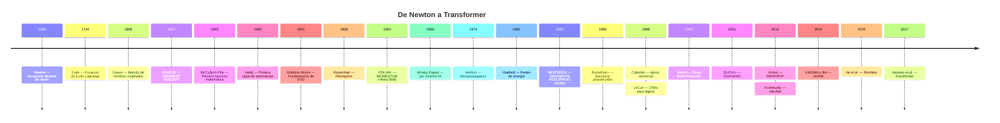
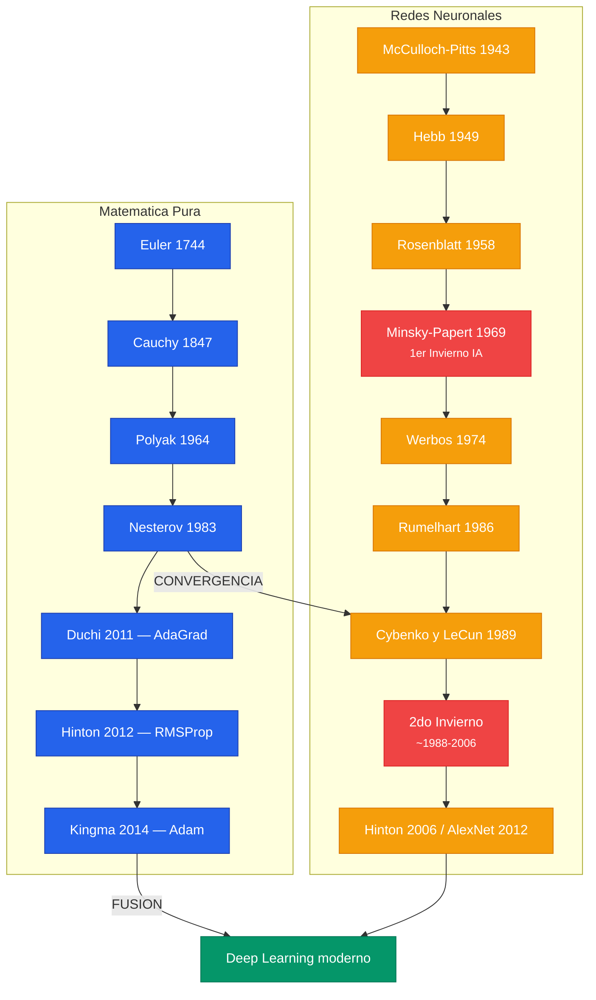

La historia del deep learning es una convergencia de dos lineas independientes: la **matematica pura de optimizacion** y las **redes neuronales artificiales**. Cada idea nacio como solucion a un problema concreto de su epoca, y cada generacion construyo sobre los fundamentos de sus predecesores.

Para el tratamiento completo, ver [Clase 10 - Historia Matematica](/clases/clase-10/historia-matematica/).

---

## Linea de Tiempo

---

## Hitos Fundamentales

### Cauchy y el Gradient Descent (1847)

En solo 3 paginas, Cauchy formulo el primer algoritmo explicito de optimizacion iterativa:

$$x^{(k+1)} = x^{(k)} - \alpha \nabla F(x^{(k)})$$


**La ecuacion de Cauchy de 1847 es exactamente lo que `loss.backward(); optimizer.step()` hace en PyTorch hoy.** La matematica no cambio -- lo que cambio es la escala.


### Robbins-Monro y los Cimientos de SGD (1951)

Establecieron las condiciones formales de convergencia: $\sum_n a_n = \infty$ (poder alcanzar el optimo) y $\sum_n a_n^2 < \infty$ (el ruido se promedia). Los learning rate schedules modernos estan motivados por estas condiciones.

### Rumelhart, Hinton, Williams (1986)

Reemplazaron la funcion escalon con el **sigmoid** diferenciable, haciendo la red entrenable de extremo a extremo con backpropagation. El XOR -- imposible para un perceptron -- se resolvio trivialmente con una red 2-2-1.

### De Polyak a Adam (1964-2015)

La evolucion de los optimizadores sigue un patron claro:

| Problema identificado | Solucion |
|---|---|
| GD es lento | **Momentum** (Polyak, 1964) -- inercia |
| Momentum es ciego | **Nesterov** (1983) -- mirar adelante |
| LR unico para todos los pesos | **AdaGrad** (2011) -- LR adaptativo |
| AdaGrad decae a cero | **RMSProp** (2012) -- media movil exponencial |
| Combinar lo mejor | **Adam** (2015) -- momentum + adaptividad |

---

## El Arco Narrativo


La historia muestra un patron recurrente: (1) la teoria matematica establece lo posible, (2) las limitaciones practicas se identifican, (3) breakthroughs algoritmicos las superan. Cada generacion construyo directamente sobre sus predecesores.


---

## Los Breakthroughs que Terminaron el Invierno

| Ano | Innovacion | Contribucion |
|---|---|---|
| 2006 | Deep Belief Networks (Hinton) | Pretraining no-supervisado |
| 2010 | ReLU (Nair & Hinton) | Derivada = 1, sin vanishing gradient |
| 2012 | AlexNet | CNN profunda en GPUs gano ImageNet |
| 2015 | Batch Normalization | Permite learning rates mas altos |
| 2015 | ResNets (He et al.) | Skip connections para profundidad arbitraria |
| 2015 | Adam (Kingma & Ba) | Momentum + adaptividad |
| 2017 | Transformer (Vaswani et al.) | "Attention is all you need" |

---

## Para el Tratamiento Completo

- [Clase 10 - Historia Matematica: De Cauchy a Adam](/clases/clase-10/historia-matematica/) -- Newton-Raphson, Euler-Lagrange, Gauss, metodos de segundo orden, McCulloch-Pitts, Perceptron, Hopfield, demostraciones formales
