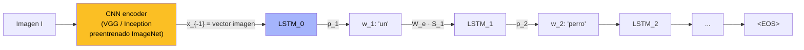
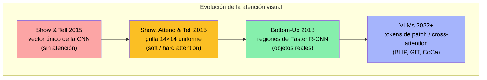
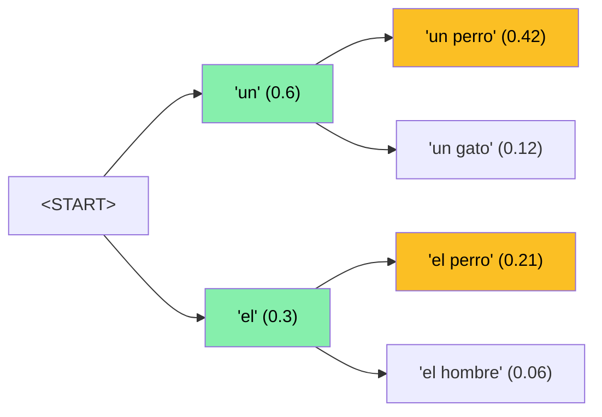

El **Image Captioning** consiste en generar una **descripción en lenguaje natural** a partir de una imagen: dada una fotografía, el sistema produce una oración como "un perro corre sobre la nieve" o "dos personas sentadas en un banco frente al mar". Es la tarea que tiende el **puente entre visión y lenguaje**: requiere simultáneamente *entender* el contenido visual (qué objetos hay, qué hacen, cómo se relacionan) y *expresarlo* como una secuencia de palabras gramaticalmente coherente. Por esa naturaleza dual, captioning fue históricamente el **primer terreno de prueba multimodal** del deep learning moderno: cuando en 2014-2015 maduraron por separado las CNN para visión y los modelos seq2seq para lenguaje, captioning fue la tarea natural donde unirlos, y dio origen al patrón "CNN encoder + RNN decoder" que dominó la disciplina antes de los Transformers.

Esta página consolida los conceptos transversales del área: la arquitectura encoder-decoder canónica, la atención visual, la atención sobre regiones, las estrategias de decodificación, las métricas de evaluación, los datasets dominantes y la era actual de los Vision-Language Models (VLMs). Es el fundamento transversal de la [Clase 23](/clases/clase-23) y se conecta directamente con el Laboratorio 23, donde se experimenta con **BLIP** para captioning zero-shot.

---

## 1. Qué es y por qué importa

Formalmente, captioning es un problema de **generación condicional de secuencias**: dado una imagen $I$, producir una secuencia de tokens $S = (S_1, S_2, \ldots, S_N)$ que la describa. No es clasificación (no hay un conjunto fijo de etiquetas) ni detección (no se devuelven cajas), sino **generación de texto de longitud variable** condicionada en una entrada visual. Esto lo hace estructuralmente parecido a la traducción automática, con la diferencia de que la "lengua fuente" es una imagen.

Importa por razones prácticas que van mucho más allá del laboratorio:

- **Accesibilidad**: lectores de pantalla para personas con discapacidad visual. Los `alt-text` automáticos de Facebook (Automatic Alt-Text, 2016), las descripciones de imágenes en VoiceOver de iOS y apps como Be My Eyes o Seeing AI dependen de captioning para narrar el contenido visual de una foto a quien no puede verla. Es probablemente la aplicación de mayor impacto social directo.
- **Image retrieval e indexación**: buscar imágenes por contenido sin tags manuales. Si cada imagen de un repositorio tiene un caption generado automáticamente, se puede buscar "personas andando en bicicleta bajo la lluvia" mediante búsqueda textual sobre los captions. Google Photos y los sistemas de stock photography lo usan masivamente.
- **Organización de medios**: agrupar y etiquetar bibliotecas de fotos personales, archivos periodísticos o colecciones médicas sin anotación humana.
- **Asistentes multimodales**: el captioning es la capacidad base sobre la que se montan tareas más complejas como [Visual Question Answering](/fundamentos/visual-question-answering), diálogo visual y razonamiento sobre imágenes.
- **Robótica y conducción autónoma**: describir la escena percibida en lenguaje es un paso hacia sistemas que explican su entorno y sus decisiones.


Captioning es la tarea **multimodal canónica**: combina un *encoder visual* (entender la imagen) con un *decoder de lenguaje* (generar texto). Todo el linaje moderno de modelos vision-language —de Show and Tell a BLIP, GPT-4V y Gemini— hereda este esquema de "comprimir la imagen en representaciones que un modelo de lenguaje pueda consumir".


---

## 2. La arquitectura encoder-decoder canónica (Show and Tell)

El blueprint fundacional lo estableció [Show and Tell (Vinyals 2015)](/papers/show-and-tell-vinyals-2015) con el modelo **NIC** (Neural Image Caption). La idea es una transposición directa del esquema [seq2seq](/fundamentos/seq2seq) de traducción neural: en lugar de codificar una oración fuente con un RNN, se codifica la **imagen** con una CNN, y un LSTM **decoder** genera la descripción palabra por palabra.

El objetivo es maximizar la log-verosimilitud condicional de la descripción dada la imagen:

$$\theta^* = \arg\max_\theta \sum_{(I, S)} \log p(S \mid I; \theta)$$

Por la **regla de la cadena de probabilidad**, la probabilidad conjunta de la oración se factoriza como producto de probabilidades condicionales token a token:

$$\log p(S \mid I) = \sum_{t=0}^{N} \log p(S_t \mid I, S_0, \ldots, S_{t-1})$$

Cada término se modela con un LSTM. El detalle de implementación más característico de NIC es **cómo se inyecta la imagen**:

$$
\begin{aligned}
x_{-1} &= \text{CNN}(I) \quad &\text{(la imagen entra UNA sola vez, en } t=-1) \\
x_t &= W_e \, S_t, \quad t \in \{0, \ldots, N-1\} \quad &\text{(word embeddings de tokens previos)} \\
p_{t+1} &= \text{LSTM}(x_t) \quad &\text{(softmax sobre el vocabulario)}
\end{aligned}
$$

Tres decisiones de diseño definieron el patrón:

1. **La imagen entra una sola vez, al inicio** (paso $t=-1$), no en cada paso. Vinyals et al. probaron alimentarla en cada token y el modelo **empeoraba**: sobre-explotaba la señal visual y memorizaba, en lugar de modelar la dependencia lingüística entre palabras.
2. **CNN preentrenado en ImageNet** (1.2M imágenes, 1000 clases). La última capa fully-connected se reemplaza por una proyección al espacio de embeddings del LSTM. Es un caso temprano y masivo de **transfer learning** multimodal: la red de visión aprende features genéricas en una tarea grande y se reutiliza para captioning.
3. **Loss de máxima verosimilitud** (negative log-likelihood) sobre las palabras de la oración de referencia:

$$L(I, S) = -\sum_{t=1}^{N} \log p_t(S_t)$$

NIC más que duplicó el BLEU-1 previo en Pascal VOC (59 vs 25, acercándose al humano 69) y fijó el estado del arte en MSCOCO (BLEU-4 = 27.7). Pero comprimía toda la imagen en **un único vector**: el decoder no podía "mirar" distintas partes de la imagen al generar cada palabra. Ese límite motivó la atención visual.

---

## 3. Atención visual (Show, Attend and Tell)

[Show, Attend and Tell (Xu 2015)](/papers/show-attend-tell-xu-2015) resolvió el cuello de botella del vector único aplicando el [mecanismo de atención](/fundamentos/mecanismo-atencion) —recién introducido por Bahdanau 2015 para traducción— al **eje espacial** de los features de la imagen.

En lugar de la salida fully-connected de la CNN (un solo vector), usan un **feature map intermedio**, típicamente el $14 \times 14 \times 512$ de la cuarta capa convolucional de VGG, reinterpretado como una secuencia de $L = 196$ **annotation vectors**:

$$a = \{a_1, a_2, \ldots, a_L\}, \quad a_i \in \mathbb{R}^D$$

Cada $a_i$ corresponde a una **región espacial** de la imagen (una celda de la grilla). El LSTM recibe en cada paso un context vector $\hat{z}_t$ que **cambia por paso** según dónde mire el modelo. Los pesos de atención $\alpha_{t,i}$ se computan con un alignment model entre el estado previo del decoder $h_{t-1}$ y cada annotation $a_i$:

$$e_{ti} = f_{\text{att}}(a_i, h_{t-1}), \qquad \alpha_{ti} = \frac{\exp(e_{ti})}{\sum_k \exp(e_{tk})}$$

El paper introduce **dos variantes**:

### 3.1 Soft attention (determinista)

El context vector es un **promedio ponderado** de todas las regiones:

$$\hat{z}_t = \sum_{i=1}^{L} \alpha_{ti}\, a_i$$

Es completamente diferenciable, así que entrena con backpropagation estándar. Es el **workhorse** en la práctica.

### 3.2 Hard attention (estocástica)

En cada paso se **muestrea una única región** según una distribución multinoulli $p(s_{t,i}=1 \mid a) = \alpha_{t,i}$, y el contexto es solo esa región:

$$\hat{z}_t = \sum_i s_{t,i}\, a_i \quad (\text{con } s_t \text{ one-hot})$$

No es diferenciable, así que requiere **REINFORCE** (policy gradient) o un variational lower bound. El entrenamiento es inestable y la mejora sobre soft es marginal, por lo que casi nadie la usa.

Para evitar que el modelo mire siempre la misma región, agregan un regularizador de **doubly stochastic attention** que empuja a que $\sum_t \alpha_{t,i} \approx 1$ para cada ubicación, obligando a "visitar" toda la imagen a lo largo de la oración:

$$L_d = -\log P(S \mid I) + \lambda \sum_{i=1}^{L} \Big(1 - \sum_{t=1}^{C} \alpha_{ti}\Big)^2$$

### 3.3 Las visualizaciones icónicas

El aporte más recordado de este paper no son los números (la mejora en BLEU sobre NIC es modesta) sino las **visualizaciones de attention maps** de su Figura 3: al generar "A **bird** flying over a body of **water**", el modelo atiende al pájaro cuando emite "bird" y al agua cuando emite "water". Por primera vez se podía **ver** qué miraba la red al producir cada palabra. Estas figuras se volvieron un ícono visual del deep learning y son la base conceptual directa de los tokens visuales del Vision Transformer y de todos los modelos multimodales posteriores. Cuando el modelo se equivoca, la visualización a menudo **explica por qué**: estaba mirando la región incorrecta.

---

## 4. Atención sobre regiones (Bottom-Up Top-Down)

La grilla $14 \times 14$ de Show, Attend and Tell es **uniforme**: no respeta los objetos reales de la imagen. Una celda puede caer a caballo entre dos objetos, y la atención opera sobre un enrejado arbitrario en lugar de sobre entidades semánticas.

[Bottom-Up and Top-Down Attention (Anderson 2018)](/papers/bottom-up-attention-anderson-2018) corrigió esto reemplazando la grilla por **regiones de objetos** propuestas por un detector **Faster R-CNN** (entrenado en Visual Genome). La idea es combinar dos tipos de atención:

- **Bottom-up** (de abajo hacia arriba, dirigida por datos): un detector propone un conjunto de regiones salientes $\{v_1, \ldots, v_k\}$, cada una un vector de features de un objeto o región de interés (por ejemplo, "el perro", "el plato", "la mesa"). En vez de 196 celdas de grilla, se tienen ~10-100 regiones que **corresponden a objetos reales**.
- **Top-down** (de arriba hacia abajo, dirigida por la tarea): el decoder de lenguaje aprende a ponderar esas regiones según el contexto de generación, igual que la soft attention pero ahora **sobre objetos en vez de sobre celdas arbitrarias**.

$$\alpha_{t,i} = \text{softmax}_i\big(w_a^\top \tanh(W_v v_i + W_h h_t)\big), \qquad \hat{v}_t = \sum_i \alpha_{t,i} v_i$$

El resultado fue un salto grande en todas las métricas y ganó el **VQA Challenge 2017**. El esquema "regiones de un detector como tokens visuales" se volvió el estándar de la era pre-Transformer y unificó captioning con [Visual Question Answering](/fundamentos/visual-question-answering): ambos consumen el mismo conjunto de region features, solo cambia el decoder/cabeza downstream.

---

## 5. Decoding: Greedy Search vs Beam Search

Una vez entrenado el modelo, generar el caption requiere **decodificar** la distribución de probabilidad token a token. El decoder produce, en cada paso $t$, una distribución $p_t$ sobre el vocabulario. ¿Cómo elegir la secuencia final? Esta es la mitad "generación" del problema (la otra mitad, "evaluación", la cubren las métricas de la sección 6). Para el tratamiento completo de muestreo (temperatura, top-k, nucleus) ver [decoding strategies](/fundamentos/decoding-strategies); aquí cubrimos las dos estrategias deterministas centrales en captioning.

### 5.1 Greedy Search

La estrategia más simple: en cada paso, elegir el token de **máxima probabilidad** (argmax) y avanzar. En el lenguaje del laboratorio:

$$\text{Caption} = \arg\max(\text{Out}, \dim=1)$$

es decir, tomar el índice del valor máximo a lo largo de la dimensión del vocabulario, en cada posición de la secuencia. Es rápido ($O(N)$ pasos, una sola hipótesis) y trivial de implementar.

El problema es que greedy es **localmente óptimo pero globalmente miope**: elegir la palabra más probable *ahora* puede llevar a un camino donde *todas* las continuaciones son malas. Una elección temprana subóptima no se puede deshacer. En la práctica esto produce **captions repetitivos y genéricos** ("a a a man man on on a a"), porque si un token de alta probabilidad refuerza su propia repetición, greedy queda atrapado en el bucle sin posibilidad de explorar una rama alternativa de mayor probabilidad conjunta.

### 5.2 Beam Search

Beam search mantiene las **$k$ hipótesis más probables** (los "beams") en cada paso, en lugar de una sola. La probabilidad de una secuencia se factoriza por la regla de la cadena:

$$P(y^1, y^2 \mid x) = p(y^1 \mid x) \cdot p(y^2 \mid x, y^1)$$

y, en general, para una secuencia completa:

$$P(y^1, \ldots, y^N \mid x) = \prod_{t=1}^{N} p(y^t \mid x, y^1, \ldots, y^{t-1})$$

El algoritmo: en cada paso, para cada uno de los $k$ beams actuales se consideran todas las extensiones posibles, se computa la probabilidad acumulada de cada secuencia candidata, y se **retienen solo las $k$ mejores** para el siguiente paso. Al final se devuelve la secuencia completa de mayor probabilidad conjunta.

*Con $k=2$: tras el primer paso se retienen "un" y "el"; tras el segundo, de las cuatro continuaciones se retienen las dos de mayor probabilidad acumulada ("un perro" = 0.42 y "el perro" = 0.21).*

**Trade-off**: beam search con $k>1$ explora más del espacio de búsqueda y encuentra secuencias de **mayor probabilidad conjunta**, evitando los callejones de greedy. En Show and Tell, un beam de tamaño 20 mejoró ~2 puntos de BLEU sobre greedy. El costo es **computacional** ($k$ veces más hipótesis y más memoria) y, curiosamente, beams muy grandes pueden empeorar la calidad subjetiva (captions excesivamente cortos y genéricos, un fenómeno conocido en NMT). En captioning, $k$ entre 3 y 5 suele ser el punto dulce. Greedy es el caso particular $k=1$.


Greedy es codicioso y miope: optimiza el paso actual y se queda atrapado en repeticiones. Beam search mantiene $k$ caminos en paralelo y elige el de mayor probabilidad **conjunta**, a costa de $k\times$ el cómputo. Para las estrategias estocásticas (temperatura, top-k, top-p / nucleus) que diversifican la generación, ver [decoding strategies](/fundamentos/decoding-strategies).


---

## 6. Métricas de evaluación

Evaluar un caption generado es difícil: una imagen admite **muchas descripciones correctas** que difieren en palabras y orden. El estándar es comparar el caption candidato contra **múltiples referencias humanas** (en MSCOCO, 5 por imagen) con métricas automáticas. Ninguna sola captura todo, por lo que los papers reportan varias a la vez.

| Métrica | Qué mide | Mecanismo | Origen | Debilidad principal |
| --- | --- | --- | --- | --- |
| **BLEU-1..4** | Precisión de n-gramas (1 a 4) | Conteo de n-gramas recortado (*clipping*) + brevity penalty | Traducción (Papineni 2002) | Premia genéricos; ciega a sinónimos y a relevancia visual |
| **METEOR** | Precisión + recall con sinónimos | Alineamiento con *stemming* y WordNet; media armónica | Traducción (Banerjee-Lavie 2005) | Depende de recursos léxicos por idioma |
| **ROUGE-L** | Recall vía subsecuencia común más larga (LCS) | Longest Common Subsequence | Summarization (Lin 2004) | Orientada a recall; favorece cobertura |
| **CIDEr** | Consenso ponderado por relevancia | n-gramas pesados por **TF-IDF** sobre las referencias | Captioning (Vedantam 2015) | Necesita un corpus grande de referencias |
| **SPICE** | Contenido semántico (objetos/atributos/relaciones) | Compara **grafos de escena** parseados del texto | Captioning (Anderson 2016) | Sensible a errores del parser; ignora fluidez |

Las dos métricas **específicas de captioning** atacan los agujeros de BLEU:

- **CIDEr** (Consensus-based Image Description Evaluation) pondera cada n-grama por su **TF-IDF** sobre el conjunto de referencias. Los n-gramas genéricos compartidos por casi todos los captions ("a man", "on a") pesan poco; los distintivos e informativos pesan mucho. Premia exactamente lo que BLEU castiga: describir lo *específico* de la imagen.
- **SPICE** (Semantic Propositional Image Caption Evaluation) parsea el caption a un **grafo de escena** (objetos, sus atributos y las relaciones entre ellos) y lo compara con los grafos de las referencias. Es la métrica que más se acerca a la **semántica visual**: dos captions con palabras distintas pero el mismo contenido proposicional puntúan alto.

**BLEU** sigue siendo la línea base obligatoria. Mide *similitud superficial de cadenas* (no significado), puntúa de 0 a 1, y en captioning hereda todas sus debilidades de forma agravada: premia repetir vocabulario frecuente, no tiene acceso a la imagen (un caption fluido de la imagen *equivocada* puede sacar un BLEU decente) y es ruidosa por imagen individual. Para el tratamiento exhaustivo —modified n-gram precision, clipping, brevity penalty, por qué media geométrica— ver el [fundamento BLEU](/fundamentos/bleu-metric) y el análisis de [BLEU (Papineni 2002)](/papers/bleu-papineni-2002).

---

## 7. Datasets

El progreso de captioning está atado a la disponibilidad de datasets con captions humanos. Los principales:

| Dataset | Tamaño | Captions/imagen | Características |
| --- | --- | --- | --- |
| **Flickr8k** (Hodosh 2013) | 8K imágenes | 5 | Pionero, escala pequeña. Escenas cotidianas de Flickr. |
| **Flickr30k** (Young 2014) | 31K imágenes | 5 | Extensión de Flickr8k. Estándar histórico. |
| **MSCOCO Captions** (Chen 2015) | 123K imágenes | 5 | **El benchmark dominante**. 80 categorías de objetos, escenas complejas. |
| **Conceptual Captions** (Sharma 2018) | 3.3M (CC3M), 12M (CC12M) | 1 | Captions de `alt-text` de la web, filtrados y limpiados. Ruidoso pero masivo. Clave para preentrenar VLMs. |
| **nocaps** (Agrawal 2019) | 15K imágenes (validación/test) | ~11 | "novel object captioning": objetos *no* presentes en COCO. Mide generalización a vocabulario nuevo. |

Distinción importante:

- **Curados y limpios** (MSCOCO, Flickr): captions escritos por anotadores humanos siguiendo guías. Pequeños pero de alta calidad. Sirven para entrenar modelos clásicos y para **evaluar** (las 5 referencias permiten BLEU/CIDEr/SPICE robustos).
- **Web-scale y ruidosos** (Conceptual Captions, LAION, ALT-text): pares imagen-texto recolectados de la web a gran escala. La calidad por par es baja, pero la **escala** (millones a miles de millones) es lo que hace posible el preentrenamiento de los VLMs modernos.
- **nocaps** existe específicamente para medir el **gap de generalización**: un modelo entrenado en las 80 clases de COCO, ¿sabe describir un ornitorrinco o un dron, que nunca vio en entrenamiento? Es donde los modelos clásicos fallan y los VLMs preentrenados con vocabulario abierto brillan.

---

## 8. La era de los VLMs

Desde ~2021, captioning dejó de ser una arquitectura dedicada para volverse una **capacidad emergente** de los **Vision-Language Models** (VLMs): modelos grandes preentrenados sobre cientos de millones de pares imagen-texto que resuelven captioning, VQA, retrieval y más con la misma red. El encoder dejó de ser una CNN y pasó a ser un **Vision Transformer** (parches de imagen como tokens); el decoder pasó de LSTM a Transformer estilo GPT.

- **BLIP** (Li 2022) — *el modelo del Laboratorio 23*. Bootstrapping Language-Image Pre-training: unifica comprensión y generación con tres objetivos (contrastive image-text, image-text matching, y generación de captions). Su innovación de datos es **CapFilt**: un *captioner* genera captions sintéticos para imágenes web y un *filter* descarta los malos, limpiando el ruido de los datos web a escala. BLIP hace captioning **zero-shot**: describe imágenes de dominios que nunca vio explícitamente.
- **GIT** (Wang 2022, Microsoft) — Generative Image-to-text Transformer: arquitectura minimalista de un solo encoder de imagen + un decoder de texto, escalada masivamente. Demostró que con suficientes datos, simplicidad arquitectural + escala superan a los diseños elaborados.
- **CoCa** (Yu 2022, Google) — Contrastive Captioner: combina en un mismo modelo el objetivo **contrastivo** (estilo CLIP, para retrieval y clasificación zero-shot) con el objetivo **generativo** (captioning). Un modelo, dos paradigmas.
- **GPT-4V, Gemini, Claude con visión** (2023+) — los LLM multimodales generales absorben captioning como un caso trivial de su capacidad de razonar sobre imágenes. Se les pide describir una imagen en lenguaje natural, con el nivel de detalle y estilo que se indique en el prompt, sin entrenamiento específico.

### 8.1 El problema de la alucinación

El talón de Aquiles de captioning, presente desde Show and Tell y *no resuelto* por los VLMs, es la **alucinación**: el modelo genera descripciones **plausibles pero no fieles** a la imagen, mencionando objetos que no están o malinterpretando los que sí. La causa es estructural: el decoder de lenguaje tiene un **prior lingüístico** fuerte aprendido del texto de entrenamiento, y cuando la señal visual es ambigua o desconocida, el prior "completa" con lo estadísticamente probable en lugar de con lo realmente presente.

El Laboratorio 23 ilustra esto de forma vívida: al pasarle a BLIP la foto de un **ornitorrinco bebé**, el modelo genera *"a baby bird is held in a box"* ("un pájaro bebé sostenido en una caja"). El ornitorrinco —un mamífero raro que casi con certeza no estaba en los datos de preentrenamiento— se reduce al concepto más cercano y frecuente que el modelo conoce: un pájaro bebé. La forma general (pequeño, con pico, sostenido en las manos) activa el prior "bird" porque el modelo nunca aprendió "platypus". Es un fallo de **generalización a objetos nuevos** (justo lo que mide nocaps) cruzado con el sesgo del prior lingüístico.


La alucinación es el riesgo central de captioning en producción: un caption fluido y gramaticalmente perfecto **puede ser completamente falso**. Por eso métricas como SPICE (semántica) y CIDEr (relevancia distintiva) importan más que BLEU, y por eso aplicaciones de accesibilidad o médicas requieren verificación. Un modelo que "suena seguro" no es un modelo que "ve bien".


---

## 9. Conexión con clases y laboratorio

Captioning conecta múltiples áreas del curso IA UC:

- **[Clase 23](/clases/clase-23)**: la clase principal de este fundamento. Cubre la arquitectura encoder-decoder, atención visual, las estrategias de decodificación (greedy vs beam, slides 24-26) y la evaluación con BLEU (slide 27).
- **Laboratorio 23**: experimentación práctica con **BLIP** para captioning zero-shot, incluyendo el caso del ornitorrinco que ilustra la alucinación.
- **[Mecanismo de atención](/fundamentos/mecanismo-atencion)** (Clase 15): la atención visual de Show, Attend and Tell es la atención de Bahdanau aplicada al eje espacial de la imagen.
- **[seq2seq](/fundamentos/seq2seq)**: captioning es seq2seq con la "lengua fuente" reemplazada por una imagen. El decoder y el loss MLE son idénticos.
- **[Visual Question Answering](/fundamentos/visual-question-answering)**: tarea hermana que comparte el encoder visual; Bottom-Up Attention unificó ambas.
- **[decoding strategies](/fundamentos/decoding-strategies)**: las estrategias de generación (greedy, beam, top-k, nucleus) son transversales a todo NLG, incluido captioning.

El arco histórico es nítido: **Show and Tell (2015)** estableció el patrón CNN+LSTM; **Show, Attend and Tell (2015)** agregó atención espacial y las visualizaciones icónicas; **Bottom-Up (2018)** cambió la grilla por objetos de un detector; y los **VLMs (2022+)** convirtieron captioning de una arquitectura dedicada en una capacidad de modelos foundation multimodales. Es un microcosmos de toda la trayectoria del [dominio Multimodal](/dominios/multimodal).

---

## 10. Resumen

1. **Captioning** = generar texto en lenguaje natural a partir de una imagen. Es la tarea multimodal canónica: encoder visual + decoder de lenguaje. Importa por accesibilidad, image retrieval e indexación.
2. **Show and Tell (Vinyals 2015)** fijó el patrón **CNN encoder + LSTM decoder**, factorizando $\log p(S \mid I)$ por la regla de la cadena, con la imagen inyectada una sola vez y entrenamiento por máxima verosimilitud.
3. **Show, Attend and Tell (Xu 2015)** agregó **atención visual** sobre la grilla $14\times14$ (soft diferenciable vs hard estocástica), con las visualizaciones de attention maps que se volvieron ícono del deep learning.
4. **Bottom-Up Top-Down (Anderson 2018)** reemplazó la grilla uniforme por **regiones de objetos** de un Faster R-CNN, alineando la atención con entidades semánticas reales.
5. **Decoding**: greedy ($\arg\max$, miope, repite) vs beam search ($k$ hipótesis, mayor probabilidad conjunta, $k\times$ cómputo). El trade-off calidad-cómputo se resuelve típicamente con $k \in [3,5]$.
6. **Métricas**: BLEU (precisión n-gramas, línea base), METEOR (sinónimos), ROUGE (recall/LCS), CIDEr (TF-IDF, lo distintivo) y SPICE (grafos de escena, semántica). Se reportan juntas.
7. **Datasets**: MSCOCO (benchmark dominante, 5 captions/imagen), Flickr8k/30k (clásicos), Conceptual Captions (web-scale para VLMs), nocaps (generalización a objetos nuevos).
8. **VLMs**: BLIP (el del lab), GIT, CoCa y GPT-4V/Gemini absorbieron captioning como capacidad zero-shot. El problema persistente es la **alucinación** (ej.: ornitorrinco descrito como "a baby bird"), un fallo de generalización cruzado con el prior lingüístico.

---

## Recursos relacionados

### Clases y laboratorio

- [Clase 23](/clases/clase-23) — clase principal del fundamento (Image Captioning).
- Laboratorio 23 — práctica con BLIP, captioning zero-shot y el caso de la alucinación.

### Papers

- [Show and Tell (Vinyals 2015)](/papers/show-and-tell-vinyals-2015) — arquitectura NIC, CNN+LSTM fundacional.
- [Show, Attend and Tell (Xu 2015)](/papers/show-attend-tell-xu-2015) — atención visual soft/hard sobre la grilla.
- [Bottom-Up Attention (Anderson 2018)](/papers/bottom-up-attention-anderson-2018) — atención sobre regiones de objetos.
- [BLEU (Papineni 2002)](/papers/bleu-papineni-2002) — la métrica de evaluación canónica.

### Fundamentos

- [fundamento BLEU](/fundamentos/bleu-metric) — métrica de evaluación en detalle.
- [decoding strategies](/fundamentos/decoding-strategies) — greedy, beam, top-k, nucleus sampling.
- [mecanismo de atención](/fundamentos/mecanismo-atencion) — base de la atención visual.
- [seq2seq](/fundamentos/seq2seq) — el esquema encoder-decoder que captioning hereda.
- [Visual Question Answering](/fundamentos/visual-question-answering) — tarea multimodal hermana.

### Dominio

- [dominio Multimodal](/dominios/multimodal) — el área del curso donde vive captioning.
