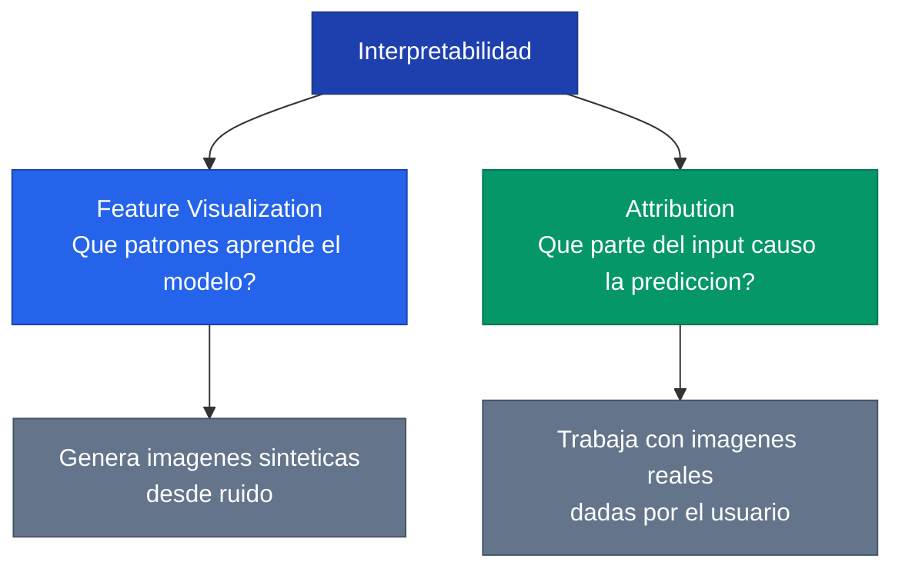
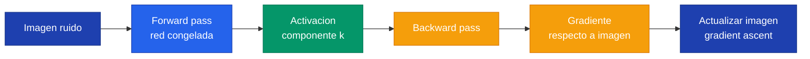
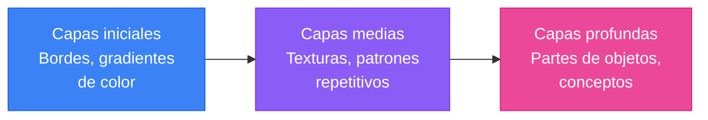
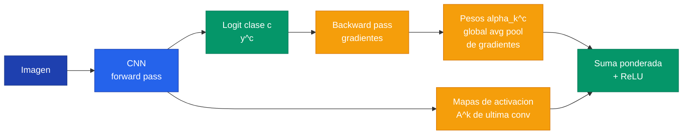
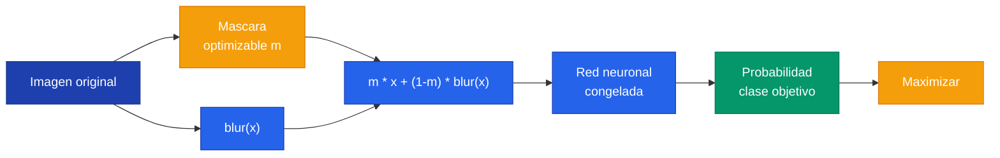

Las redes neuronales profundas alcanzan rendimiento sobresaliente en tareas de vision, lenguaje y decision, pero su funcionamiento interno permanece opaco. La **interpretabilidad** agrupa un conjunto de tecnicas que buscan abrir esta caja negra para entender que aprende un modelo, como toma sus decisiones y cuando falla por razones incorrectas.

---

## 1. Por que interpretar redes neuronales

Una red neuronal entrenada contiene millones de pesos que interactuan de formas no lineales. Desde el exterior solo observamos entradas y salidas -- el interior es una **caja negra** (*black box*). Esto genera problemas concretos:

| Problema | Descripcion | Ejemplo |
|---|---|---|
| **Confianza** | No podemos confiar en un sistema que no entendemos | Un modelo medico con 95% accuracy que basa sus predicciones en metadatos de la imagen, no en la patologia |
| **Debugging** | Sin visibilidad interna, los errores son inexplicables | Un clasificador que confunde gatos con perros solo cuando hay cesped en el fondo |
| **Sesgo** | Los modelos absorben sesgos del dataset sin que sea evidente | Un modelo de contratacion que penaliza genero porque el dataset historico lo refleja |
| **Regulacion** | En dominios criticos la explicabilidad es un requisito legal | GDPR exige "derecho a una explicacion" para decisiones automatizadas |


Un modelo puede tener alta accuracy y aun asi estar aprendiendo las cosas equivocadas. Solo las tecnicas de interpretabilidad revelan si el modelo resuelve el problema por las razones correctas.


Las tecnicas de interpretabilidad se dividen en dos grandes familias:



---

## 2. Feature Visualization

**Feature visualization** responde a la pregunta: *que input maximiza la respuesta de un componente de la red?* En lugar de observar como reacciona una neurona ante imagenes reales, generamos la imagen ideal que la activa al maximo.

### 2.1 Gradient Ascent sobre el Input

El mecanismo central es una inversion del proceso de entrenamiento. En entrenamiento normal optimizamos los **pesos** con gradient descent para minimizar la perdida. En feature visualization congelamos los pesos y optimizamos la **imagen** con gradient ascent para maximizar una activacion.

```text
Entrenamiento normal (gradient descent):
  Input FIJO --> Red --> Loss --> Actualizar PESOS
  Objetivo: minimizar el error

Feature Visualization (gradient ascent):
  Input VARIABLE --> Red CONGELADA --> Activacion objetivo --> Actualizar IMAGEN
  Objetivo: maximizar la activacion de un componente
```


x^* = \arg\max_x \; a_k(x) - \lambda \cdot R(x)


Donde:
- $x^*$ es la imagen optima que buscamos
- $a_k(x)$ es la activacion del componente objetivo $k$ (una neurona, un canal, una clase)
- $R(x)$ es un termino de regularizacion que evita soluciones degeneradas
- $\lambda$ controla la intensidad de la regularizacion

El flujo algoritmico es:



Los componentes que podemos visualizar incluyen:

- **Neurona individual**: una unidad especifica en un mapa de activacion
- **Canal** (mapa de activacion completo): todas las neuronas espaciales de un filtro
- **Capa completa**: la activacion total de una capa
- **Clase de salida**: el logit correspondiente a una clase (ej: `labels:162` para beagle)

### 2.2 Regularizacion

Sin regularizacion, el gradient ascent produce ruido de alta frecuencia: pixeles aleatorios que maximizan la activacion pero carecen de estructura visual. Las tecnicas de regularizacion fuerzan que la imagen generada tenga propiedades visuales coherentes.

| Tecnica | Mecanismo | Efecto |
|---|---|---|
| **Jitter** | Desplazar la imagen aleatoriamente antes de cada paso | Evita artefactos de alta frecuencia |
| **Blur** (gaussian) | Aplicar suavizado periodico | Elimina ruido pixel-a-pixel |
| **Weight decay** | Penalizar la norma de la imagen | Mantiene valores de pixel acotados |
| **Decorrelated space** | Optimizar en espacio de frecuencias | Produce imagenes mas naturales |
| **Transformation robustness** | Aplicar jitter, rotacion y escala | Genera features robustos a transformaciones |

Las librerias modernas como `torch-lucent` aplican estas tecnicas automaticamente, combinando decorrelated space y transformation robustness para producir visualizaciones de alta calidad.

### 2.3 Aprendizaje jerarquico composicional

Una de las revelaciones mas importantes de feature visualization es que las CNNs profundas aprenden de forma **jerarquica y composicional**. Al visualizar canales de distintas profundidades, se observa una progresion clara:



| Profundidad | Que aprende | Ejemplo |
|---|---|---|
| Primeras capas | Bordes, gradientes de color | Lineas horizontales, verticales, diagonales |
| Capas medias | Texturas, patrones repetitivos | Cuadriculas, circulos, pelaje |
| Ultimas capas | Partes de objetos, conceptos complejos | Ojos, patas, ruedas |


Las primeras capas son similares en TODAS las arquitecturas -- todas necesitan detectar los mismos bordes basicos. Las ultimas capas varian significativamente entre modelos. Arquitecturas mas profundas (ResNet) desarrollan features finales mucho mas complejos que arquitecturas menos profundas (AlexNet).


### 2.4 Codigo: Feature Visualization con Lucent



```python
import torch
import torchvision.models as models
from lucent.optvis import render
from lucent.modelzoo.util import get_model_layers

# Cargar modelo pre-entrenado
alexnet = models.alexnet(pretrained=True).eval().cuda()

# Ver capas disponibles
print(get_model_layers(alexnet))
# ['features_0', 'features_1', ..., 'features_11', 'classifier_1', ...]

# Visualizar canal 9 de la 5ta capa convolucional
_ = render.render_vis(alexnet, 'features_11:9', show_image=True)

# Visualizar una clase completa (clase 162 = beagle)
_ = render.render_vis(alexnet, 'labels:162', show_image=True)

# Channel visualization: multiples canales de una capa
import matplotlib.pyplot as plt

def get_images(model, layers, rows, cols, preprocess=True):
    fig = plt.figure(figsize=(4*len(layers)*cols, 4*rows))
    outer_grid = fig.add_gridspec(1, len(layers))
    for layer_index, layer in enumerate(layers):
        inner_grid = outer_grid[0, layer_index].subgridspec(
            rows, cols, wspace=0, hspace=0
        )
        axs = inner_grid.subplots()
        for i in range(rows):
            for j in range(cols):
                image = render.render_vis(
                    model, f'{layer}:{i*cols+j}',
                    preprocess=preprocess,
                    show_image=False
                )[0][0]
                axs[i][j].imshow(image)
                axs[i][j].axis('off')

# Visualizar 3 capas representativas de AlexNet
get_images(alexnet, ['features_1', 'features_7', 'features_11'], 3, 3)
```


```python
import tensorflow as tf
import numpy as np
import matplotlib.pyplot as plt

# Cargar modelo pre-entrenado
model = tf.keras.applications.VGG16(weights='imagenet')

# Crear modelo parcial para acceder a una capa intermedia
layer_name = 'block3_conv3'
feature_model = tf.keras.Model(
    inputs=model.input,
    outputs=model.get_layer(layer_name).output
)

# Gradient ascent sobre el input
def feature_visualization(model, channel_idx, steps=200, lr=0.01):
    # Imagen inicial: ruido aleatorio
    img = tf.Variable(tf.random.normal([1, 224, 224, 3]) * 0.01)

    for step in range(steps):
        with tf.GradientTape() as tape:
            activation = model(img)
            # Maximizar la media del canal objetivo
            loss = tf.reduce_mean(activation[:, :, :, channel_idx])

        grads = tape.gradient(loss, img)
        # Normalizar gradientes
        grads = grads / (tf.sqrt(tf.reduce_mean(grads**2)) + 1e-8)
        # Gradient ascent (sumar, no restar)
        img.assign_add(lr * grads)

    return img.numpy()[0]

# Visualizar canal 42 del bloque 3
result = feature_visualization(feature_model, channel_idx=42)
plt.imshow((result - result.min()) / (result.max() - result.min()))
plt.axis('off')
plt.show()
```


```python
import jax
import jax.numpy as jnp
from flax import linen as nn
import optax

# Gradient ascent conceptual en JAX
def feature_visualization(apply_fn, params, layer_name, channel_idx,
                          steps=200, lr=0.01):
    # Imagen inicial: ruido aleatorio
    key = jax.random.PRNGKey(0)
    img = jax.random.normal(key, (1, 224, 224, 3)) * 0.01

    # Funcion que extrae la activacion del canal objetivo
    def activation_fn(image):
        # Requiere modelo con capture_intermediates o similar
        activations = apply_fn(params, image, capture_intermediates=True)
        return jnp.mean(activations[layer_name][:, :, :, channel_idx])

    # Gradient ascent
    grad_fn = jax.grad(activation_fn)

    for step in range(steps):
        grads = grad_fn(img)
        grads = grads / (jnp.sqrt(jnp.mean(grads**2)) + 1e-8)
        img = img + lr * grads  # ascent: sumar

    return img[0]
```



---

## 3. Metodos de Attribution

Los metodos de **attribution** responden una pregunta complementaria a feature visualization: *dada una imagen real y una prediccion, que partes del input fueron responsables de esa decision?*

| Tecnica | Pregunta | Input |
|---|---|---|
| Feature Visualization | Que patron maximiza una neurona? | Imagen sintetica (generada desde ruido) |
| Attribution | Que parte de ESTA imagen causo la prediccion? | Imagen real (dada) |

### 3.1 Saliency Maps (Vanilla Gradients)

El metodo mas simple de attribution. Calcula el gradiente de la clase predicha respecto a cada pixel de entrada. Los pixeles con gradiente de mayor magnitud son los que mas influyen en la prediccion.


S(x) = \left| \frac{\partial y_c}{\partial x} \right|


Donde $y_c$ es el logit de la clase $c$ y $x$ es la imagen de entrada.

**Ventaja:** extremadamente rapido (un solo backward pass).
**Desventaja:** ruidoso, sensible a pequenas perturbaciones del input, no captura bien la importancia espacial.

### 3.2 Grad-CAM

**Grad-CAM** (Gradient-weighted Class Activation Mapping) produce mapas de calor de baja resolucion que destacan regiones importantes. A diferencia de saliency maps que operan a nivel de pixel, Grad-CAM opera sobre los mapas de activacion de la ultima capa convolucional.

El proceso tiene dos pasos:

1. Calcular los **pesos de importancia** $\alpha_k^c$ para cada canal $k$ respecto a la clase $c$:


\alpha_k^c = \frac{1}{Z} \sum_i \sum_j \frac{\partial y^c}{\partial A_{ij}^k}


2. Generar el mapa de calor como combinacion lineal ponderada de los mapas de activacion, seguida de ReLU:


L_{\text{Grad-CAM}}^c = \text{ReLU}\left(\sum_k \alpha_k^c \cdot A^k\right)


Donde $A^k$ es el mapa de activacion del canal $k$, $Z$ es el numero total de pixeles del mapa de activacion (para el global average pooling), y el ReLU descarta las contribuciones negativas.



### 3.3 Occlusion Sensitivity

Un metodo de fuerza bruta: se desliza un parche (tipicamente gris o negro) sobre la imagen y se mide como cambia la probabilidad de la clase predicha. Si al tapar una region la probabilidad cae significativamente, esa region es importante para la decision.

**Ventaja:** intuitivo, no requiere gradientes, funciona con modelos no diferenciables.
**Desventaja:** computacionalmente costoso (requiere un forward pass por cada posicion del parche).

### 3.4 Extremal Perturbation (TorchRay)

**Extremal perturbation** (Fong et al., 2019) busca la **mascara optima** de area fija que, aplicada sobre la imagen, maximiza la respuesta del modelo para una clase de interes. Es una formulacion mas rigurosa que occlusion sensitivity porque optimiza la mascara de forma continua.


m^* = \arg\max_m \; \phi\bigl(m \odot x + (1-m) \odot \text{blur}(x)\bigr), \quad \text{sujeto a } \text{area}(m) = a


Donde:
- $m$ es la mascara (valores continuos entre 0 y 1)
- $x$ es la imagen original
- $\phi$ es la salida del modelo para la clase de interes
- $\text{blur}(x)$ es la imagen perturbada (borrosa)
- $a$ es el area fija de la mascara (ej: 12% de la imagen)



La interpretacion del resultado es directa: zonas rojas/calidas indican alta importancia y zonas azules/frias indican baja importancia. Una mascara bien centrada en el objeto de interes indica que el modelo aprendio features correctos. Una mascara dispersa o enfocada en el fondo indica **shortcut learning** -- el modelo esta usando correlaciones espurias.



```python
import torch
import torchvision.models as models
from torchray.attribution.extremal_perturbation import extremal_perturbation
from torchray.benchmark import plot_example

# Cargar modelo
alexnet = models.alexnet(pretrained=True).eval().cuda()

# Preparar imagen (224x224, normalizada con ImageNet stats)
from torchvision.transforms import Compose, Resize, ToTensor, Normalize
from PIL import Image

transform = Compose([
    Resize(224),
    ToTensor(),
    Normalize(mean=[0.485, 0.456, 0.406], std=[0.229, 0.224, 0.225]),
])
img = Image.open('imagen.jpg')
x = transform(img).unsqueeze(0).cuda()

# Extremal perturbation para clase 245 (French Bulldog)
mask, _ = extremal_perturbation(
    alexnet, x,
    category_id=245,
    areas=[0.12],    # mascara cubre 12% de la imagen
    debug=True,
)

# Visualizar resultado
plot_example(x, mask, 'Extremal Perturbation - French Bulldog')
```


```python
import tensorflow as tf
import numpy as np
import matplotlib.pyplot as plt

# Grad-CAM en TensorFlow (equivalente conceptual)
model = tf.keras.applications.VGG16(weights='imagenet')

# Modelo que devuelve activaciones de la ultima conv + prediccion
grad_model = tf.keras.Model(
    inputs=model.input,
    outputs=[
        model.get_layer('block5_conv3').output,
        model.output
    ]
)

def grad_cam(img, class_idx):
    with tf.GradientTape() as tape:
        conv_output, predictions = grad_model(img)
        loss = predictions[:, class_idx]

    # Gradientes de la clase respecto a los mapas de activacion
    grads = tape.gradient(loss, conv_output)

    # Pesos: global average pooling de los gradientes
    weights = tf.reduce_mean(grads, axis=(1, 2))

    # Combinacion lineal ponderada
    cam = tf.reduce_sum(
        conv_output * weights[:, tf.newaxis, tf.newaxis, :],
        axis=-1
    )
    cam = tf.nn.relu(cam)
    cam = cam / (tf.reduce_max(cam) + 1e-8)
    return cam.numpy()[0]

# Aplicar sobre imagen preprocesada
heatmap = grad_cam(preprocessed_img, class_idx=245)
plt.imshow(heatmap, cmap='jet')
plt.show()
```


```python
import jax
import jax.numpy as jnp

# Saliency map en JAX (vanilla gradients)
def saliency_map(apply_fn, params, image, class_idx):
    def class_score(img):
        logits = apply_fn(params, img)
        return logits[0, class_idx]

    # Gradiente del logit respecto a la imagen
    grads = jax.grad(class_score)(image)

    # Tomar valor absoluto y maximo sobre canales
    saliency = jnp.max(jnp.abs(grads[0]), axis=-1)

    # Normalizar a [0, 1]
    saliency = saliency / (jnp.max(saliency) + 1e-8)
    return saliency

# Uso
heatmap = saliency_map(model.apply, params, img_batch, class_idx=245)
```



---

## 4. Acceso a capas internas

Para aplicar feature visualization y attribution necesitamos acceder a las **activaciones intermedias** de la red. En PyTorch, esto requiere entender como el framework nombra y organiza los modulos internos.

### 4.1 Inspeccion de capas con Lucent

La funcion `get_model_layers` de **lucent** retorna la lista de nombres de capas accesibles para visualizacion:

```python
from lucent.modelzoo.util import get_model_layers

get_model_layers(alexnet)
# ['features_0', 'features_1', ..., 'features_12', 'classifier_1', ...]

get_model_layers(resnet50)
# ['conv1', 'bn1', 'relu', 'maxpool', 'layer1', 'layer2', ...]
```


El indice en `nn.Sequential` NO es el numero de capa convolucional. `features_1` en AlexNet es un ReLU, no la primera convolucion. La convolucion es `features_0`, pero para visualizacion usamos la salida activada (`features_1`).


### 4.2 Hooks para activaciones intermedias

Cuando necesitamos acceder a activaciones sin usar lucent, PyTorch ofrece **forward hooks** que interceptan la salida de cualquier capa durante el forward pass:

```python
import torch
import torchvision.models as models

model = models.resnet50(pretrained=True).eval()
activations = {}

def hook_fn(name):
    def hook(module, input, output):
        activations[name] = output.detach()
    return hook

# Registrar hooks en capas de interes
model.layer2.register_forward_hook(hook_fn('layer2'))
model.layer4.register_forward_hook(hook_fn('layer4'))

# Forward pass
with torch.no_grad():
    output = model(input_tensor)

# Acceder a las activaciones capturadas
print(activations['layer2'].shape)  # ej: [1, 512, 28, 28]
print(activations['layer4'].shape)  # ej: [1, 2048, 7, 7]
```

### 4.3 Comparacion de arquitecturas

La estructura interna varia significativamente entre arquitecturas. Esto afecta como accedemos a las capas y que nombres usamos para feature visualization.

| Arquitectura | Estructura | Capas para visualizacion | Profundidad |
|---|---|---|---|
| **AlexNet** | `nn.Sequential` anonimo | `features_1`, `features_7`, `features_11` | 5 conv |
| **VGG19** | `nn.Sequential` anonimo | `features_1`, `features_17`, `features_35` | 16 conv |
| **GoogLeNet** | Modulos inception nombrados | `conv1`, `inception4b`, `inception5b` | 22 capas |
| **ResNet50** | Layer groups con bottleneck | `relu`, `layer2`, `layer4` | 50 capas |

La sintaxis de direccionamiento para lucent sigue el formato **`'nombre_capa:numero_canal'`**:

```python
# Canal especifico
render.render_vis(alexnet, 'features_11:9')       # AlexNet, conv5, canal 9
render.render_vis(vgg19, 'features_35:0')          # VGG19, conv16, canal 0
render.render_vis(googlenet, 'inception4b:3')      # GoogLeNet, inception4b, canal 3
render.render_vis(resnet50, 'layer4:10')            # ResNet50, layer4, canal 10

# Clase completa (genera imagen que maximiza probabilidad de esa clase)
render.render_vis(alexnet, 'labels:162')            # clase 162 = beagle
render.render_vis(resnet50, 'labels:8')             # clase 8 = gallina
```

---

## 5. Aplicaciones practicas

Las tecnicas de interpretabilidad no son solo herramientas academicas -- tienen aplicaciones directas en el desarrollo, auditoria y despliegue de modelos.

### 5.1 Auditoria de modelos y deteccion de shortcut learning


Attribution permite detectar **shortcut learning**: cuando un modelo obtiene alta accuracy aprendiendo correlaciones espurias en lugar de los patrones correctos. Un modelo puede predecir correctamente la clase pero basarse en el fondo de la imagen en vez del objeto.


El caso clasico: un modelo de clasificacion de flores entrenado sin fine-tuning adecuado. Al aplicar extremal perturbation sobre imagenes correctamente clasificadas, se descubre que el modelo base fija la atencion en el **fondo** (hojas, cesped) mientras que el modelo fine-tuned se enfoca en la **flor**.

| Escenario | Modelo base | Modelo fine-tuned |
|---|---|---|
| Train (ambos aciertan) | Mascara en el fondo | Mascara en la flor |
| Test (base falla) | Mascara dispersa/fondo | Mascara centrada en la flor |

Ambos modelos predicen bien en train, pero solo attribution revela que el modelo base esta haciendo trampa.

### 5.2 Debugging de clasificaciones erroneas

Cuando un modelo comete un error, attribution permite diagnosticar la causa. El procedimiento es:

1. Identificar una imagen mal clasificada
2. Aplicar attribution con la **clase predicha** (no la real) para ver que le hizo pensar al modelo que era esa clase
3. Aplicar attribution con la **clase real** para ver si el modelo tiene features para reconocerla

```python
# Que le hizo pensar al modelo que era la clase incorrecta?
mask_wrong, _ = extremal_perturbation(
    model, x, predicted_class,  # clase predicha
    areas=[0.2],
)

# Donde busca el modelo la clase correcta?
mask_correct, _ = extremal_perturbation(
    model, x, true_class,  # clase real
    areas=[0.2],
)
```

### 5.3 Fairness y sesgo

En aplicaciones sensibles (salud, justicia, finanzas), feature visualization y attribution permiten verificar que el modelo no basa sus decisiones en atributos protegidos como raza, genero o edad. Si un mapa de attribution muestra que un modelo de diagnostico medico se enfoca en la etiqueta del hospital en lugar de la radiografia, se ha detectado un sesgo de dataset.

### 5.4 Resumen de herramientas

| Herramienta | Libreria | Uso principal |
|---|---|---|
| `lucent` / `torch-lucent` | Feature Visualization | Visualizar que aprende cada capa/canal/neurona |
| `torchray` | Attribution | Extremal perturbation sobre imagenes reales |
| `captum` (Meta) | Attribution | Saliency maps, Grad-CAM, Integrated Gradients, SHAP |
| `tf-explain` | Attribution | Grad-CAM y occlusion para TensorFlow |
| `grad-cam` (PyPI) | Attribution | Implementacion standalone de Grad-CAM |

---

## Para Profundizar

Los laboratorios del curso contienen implementaciones completas de todas estas tecnicas con modelos pre-entrenados de ImageNet:

- [Acceso a capas de CNNs en PyTorch](/laboratorios/lab-09/capas/) -- inspeccion de arquitecturas (AlexNet, VGG19, GoogLeNet, ResNet50) y mapeo de nombres internos
- [Feature Visualization](/laboratorios/lab-09/feature-viz/) -- gradient ascent con lucent, channel visualization, aprendizaje jerarquico, label visualization
- [Attribution con Extremal Perturbation](/laboratorios/lab-09/attribution/) -- comparacion modelo base vs fine-tuned, diagnostico de errores, shortcut learning
