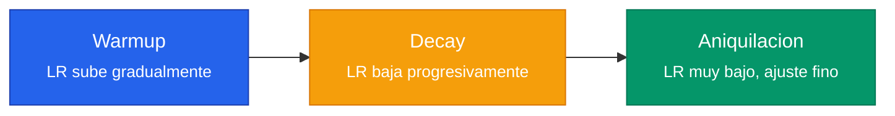
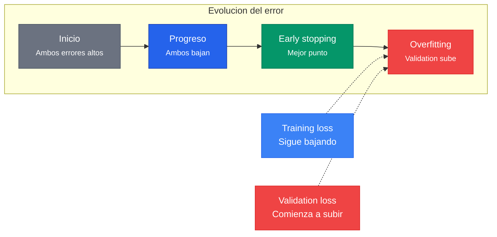

El learning rate ($\eta$) es el **hiperparametro mas importante** del entrenamiento de redes neuronales. Controla el tamano del paso en cada actualizacion de pesos y determina si el proceso converge, diverge o se estanca.

---

## 1. El Dilema Central

$$w^{new} = w^{old} - \eta \cdot \frac{\partial L}{\partial w}$$

| Learning Rate | Comportamiento |
|---|---|
| **Muy alto** | Diverge -- la loss sube |
| **Alto** | Converge rapido, luego oscila |
| **Muy bajo** | Converge extremadamente lento |
| **Bueno** | Converge rapido y estable |


Un learning rate demasiado grande hace que los pasos sobredimensionados salten sobre el minimo. Uno demasiado pequeno converge tan lento que el entrenamiento se vuelve impracticable. La teoria del Lema de Descenso establece los limites formales.


---

## 2. Teoria Formal: El Lema de Descenso

Una funcion $f$ es **L-smooth** si:

$$\|\nabla f(x) - \nabla f(y)\| \leq L \|x - y\|$$

Bajo esta condicion, el Lema de Descenso garantiza:


f(x - \eta \nabla f(x)) \leq f(x) - \eta \left(1 - \frac{L\eta}{2}\right) \|\nabla f(x)\|^2


Para que la funcion decrezca en cada paso se requiere que el factor $(1 - L\eta/2) > 0$:

$$\eta < \frac{2}{L}$$

El paso optimo fijo es $\eta^* = 1/L$, que maximiza el decrecimiento garantizado.

### Tasas de convergencia

| Escenario | Tasa | Iteraciones para precision $\epsilon$ |
|---|---|---|
| No-convexa, L-smooth | $\min \|\nabla f\|^2 = O(1/t)$ | $O(1/\epsilon)$ |
| Convexa, L-smooth | $f(x_t) - f^* = O(1/t)$ | $O(1/\epsilon)$ |
| $\mu$-fuertemente convexa | $f(x_t) - f^* = O((1-\mu/L)^t)$ | $O(\kappa \log(1/\epsilon))$ |

El ratio $\kappa = L/\mu$ es el **numero de condicion**: cuanto mayor es, mas dificil es el problema.

---

## 3. Saddle Points vs Minimos Locales

En un punto critico con $n$ parametros:

$$P(\text{minimo local}) \approx (1/2)^n$$

Con millones de parametros, los **saddle points superan vastamente en numero** a los minimos locales. El learning rate y el momentum son clave para escapar de ellos.

---

## 4. Estrategias de Learning Rate Scheduling

Un LR fijo puede no ser optimo durante todo el entrenamiento: al inicio queremos pasos grandes para avanzar rapido; cerca del optimo, pasos pequenos para ajustar fino.

### 4.1 Step Decay

Reduce el LR por un factor cada cierta cantidad de epocas:

$$\eta_t = \eta_0 \cdot \gamma^{\lfloor t / \text{step\_size} \rfloor}$$

Ejemplo con ResNet: $\eta = 0.1$ hasta la epoca 30, luego $0.01$, luego $0.001$, etc.



```python
import torch.optim as optim

# Definir optimizador con LR inicial
optimizer = optim.SGD(model.parameters(), lr=0.1, momentum=0.9)

# Reducir LR por factor 0.1 cada 30 epocas
scheduler = optim.lr_scheduler.StepLR(optimizer, step_size=30, gamma=0.1)

# Ciclo de entrenamiento
for epoch in range(90):
    train(model, loader, optimizer)
    scheduler.step()
    print(f"Epoca {epoch}, LR: {scheduler.get_last_lr()[0]:.4f}")
```


```python
import tensorflow as tf

# Definir schedule con reduccion escalonada
boundaries = [30, 60]  # epocas donde cambia el LR
values = [0.1, 0.01, 0.001]  # LR para cada tramo

lr_schedule = tf.keras.optimizers.schedules.PiecewiseConstantDecay(
    boundaries=boundaries, values=values
)

# Crear optimizador con el schedule
optimizer = tf.keras.optimizers.SGD(learning_rate=lr_schedule, momentum=0.9)

# Compilar modelo
model.compile(optimizer=optimizer, loss="categorical_crossentropy")
```


```python
import optax

# Definir schedule con reduccion escalonada
schedule = optax.join_schedules(
    schedules=[
        optax.constant_schedule(0.1),   # epocas 0-29
        optax.constant_schedule(0.01),  # epocas 30-59
        optax.constant_schedule(0.001), # epocas 60+
    ],
    boundaries=[30, 60],
)

# Crear optimizador con el schedule
optimizer = optax.sgd(learning_rate=schedule)
opt_state = optimizer.init(params)
```



### 4.2 Cosine Annealing


\eta_t = \eta_{\min} + \frac{1}{2}(\eta_{\max} - \eta_{\min})\left(1 + \cos\left(\frac{\pi t}{T}\right)\right)


Baja suavemente siguiendo una curva coseno, sin saltos abruptos.



```python
import torch.optim as optim

optimizer = optim.SGD(model.parameters(), lr=0.1, momentum=0.9)

# Cosine annealing: LR baja de 0.1 a 1e-5 en 200 epocas
scheduler = optim.lr_scheduler.CosineAnnealingLR(
    optimizer, T_max=200, eta_min=1e-5
)

for epoch in range(200):
    train(model, loader, optimizer)
    scheduler.step()
    print(f"Epoca {epoch}, LR: {scheduler.get_last_lr()[0]:.6f}")
```


```python
import tensorflow as tf
import math

# Definir schedule coseno manualmente
total_steps = 200
lr_max, lr_min = 0.1, 1e-5

cosine_schedule = tf.keras.optimizers.schedules.CosineDecay(
    initial_learning_rate=lr_max,
    decay_steps=total_steps,
    alpha=lr_min / lr_max,  # ratio minimo
)

# Crear optimizador con el schedule
optimizer = tf.keras.optimizers.SGD(learning_rate=cosine_schedule, momentum=0.9)
```


```python
import optax

# Cosine annealing de 0.1 a 1e-5 en 200 epocas
schedule = optax.cosine_decay_schedule(
    init_value=0.1,
    decay_steps=200,
    alpha=1e-5 / 0.1,  # ratio entre LR minimo y maximo
)

optimizer = optax.sgd(learning_rate=schedule)
opt_state = optimizer.init(params)
```



### 4.3 Warmup

$$\eta_t = \eta_{\text{target}} \cdot \frac{t}{T_{\text{warmup}}} \quad \text{para } t < T_{\text{warmup}}$$

Empieza con un LR bajo y sube gradualmente. Necesario porque:
1. Estabiliza el entrenamiento temprano cuando los pesos estan lejos del optimo
2. Permite LRs objetivo mas altos
3. **Critico para Transformers** y batches grandes

### 4.4 One-Cycle Policy (Leslie Smith, 2018)




**Super-convergencia**: Redes entrenadas con 1-cycle alcanzan la misma precision en **1/5 a 1/10** de las epocas, combinando warmup agresivo + decay + fase final con LR muy bajo.




```python
import torch.optim as optim

optimizer = optim.SGD(model.parameters(), lr=0.01, momentum=0.9)

# One-Cycle: sube hasta max_lr, luego baja progresivamente
scheduler = optim.lr_scheduler.OneCycleLR(
    optimizer,
    max_lr=0.1,             # LR maximo durante el ciclo
    epochs=30,              # total de epocas
    steps_per_epoch=len(train_loader),
    pct_start=0.3,          # 30% del tiempo en warmup
    anneal_strategy="cos",  # decaimiento coseno
)

# Llamar scheduler.step() despues de cada batch (no epoca)
for epoch in range(30):
    for batch in train_loader:
        loss = train_step(model, batch, optimizer)
        scheduler.step()
```


```python
import tensorflow as tf
import numpy as np

# Implementacion manual de One-Cycle para TF
class OneCycleSchedule(tf.keras.optimizers.schedules.LearningRateSchedule):
    def __init__(self, max_lr, total_steps, pct_start=0.3):
        self.max_lr = max_lr
        self.total_steps = total_steps
        self.pct_start = pct_start

    def __call__(self, step):
        # Fase warmup: sube linealmente hasta max_lr
        pct = tf.cast(step, tf.float32) / self.total_steps
        warmup_mask = tf.cast(pct < self.pct_start, tf.float32)
        warmup_lr = self.max_lr * (pct / self.pct_start)
        # Fase decay: baja con coseno
        decay_pct = (pct - self.pct_start) / (1.0 - self.pct_start)
        decay_lr = self.max_lr * 0.5 * (1 + tf.cos(np.pi * decay_pct))
        return warmup_mask * warmup_lr + (1 - warmup_mask) * decay_lr

total_steps = 30 * len(train_dataset) // batch_size
schedule = OneCycleSchedule(max_lr=0.1, total_steps=total_steps)
optimizer = tf.keras.optimizers.SGD(learning_rate=schedule, momentum=0.9)
```


```python
import optax

# One-Cycle con warmup coseno + decay coseno
total_steps = 30 * steps_per_epoch
warmup_steps = int(0.3 * total_steps)

schedule = optax.join_schedules(
    schedules=[
        # Fase warmup: sube de 0 a max_lr
        optax.linear_schedule(init_value=0.0, end_value=0.1,
                              transition_steps=warmup_steps),
        # Fase decay: baja de max_lr a ~0
        optax.cosine_decay_schedule(init_value=0.1,
                                     decay_steps=total_steps - warmup_steps),
    ],
    boundaries=[warmup_steps],
)

optimizer = optax.sgd(learning_rate=schedule)
```



### 4.5 ReduceLROnPlateau

Monitorea la validation loss. Si no mejora durante $n$ epocas consecutivas (patience), reduce el LR por un factor.

---

## 5. Batch Size y Learning Rate

### Regla de Escalamiento Lineal (Goyal et al., 2017)

$$\text{lr\_new} = \text{lr\_base} \cdot \frac{B_{\text{new}}}{B_{\text{base}}}$$

**Intuicion:** Duplicar el batch reduce la varianza del gradiente a la mitad ($\text{Var}(g_B) = \text{Var}(\nabla L_i) / B$), permitiendo pasos mas grandes.

**Escala de ruido SGD:**

$$\text{noise} \sim \sqrt{\text{lr}/B} \cdot \sigma$$

Para mantener el mismo nivel de ruido al aumentar $B$ por $k$, hay que aumentar el LR por $k$.


**Warmup es esencial con batches grandes.** Sin warmup, la regla de escalamiento lineal puede desestabilizar las primeras iteraciones cuando los pesos estan lejos del optimo.


---

## 6. Early Stopping

Si la validation loss comienza a subir mientras la training loss sigue bajando, es senal de **overfitting**:



Early stopping y LR scheduling son **complementarios**: el scheduler reduce el LR cuando el progreso se estanca; early stopping detiene completamente cuando ya no hay progreso posible.



```python
import copy

# Implementacion simple de early stopping
best_val_loss = float("inf")
best_model = None
patience, counter = 5, 0

for epoch in range(100):
    train(model, train_loader, optimizer)
    val_loss = evaluate(model, val_loader)

    if val_loss < best_val_loss:
        best_val_loss = val_loss
        best_model = copy.deepcopy(model.state_dict())
        counter = 0  # reiniciar contador
    else:
        counter += 1
        if counter >= patience:
            print(f"Early stopping en epoca {epoch}")
            break

# Restaurar mejores pesos
model.load_state_dict(best_model)
```


```python
import tensorflow as tf

# Early stopping integrado como callback
early_stopping = tf.keras.callbacks.EarlyStopping(
    monitor="val_loss",     # metrica a monitorear
    patience=5,             # epocas sin mejora antes de detener
    restore_best_weights=True,  # restaurar mejores pesos
    min_delta=1e-4,         # mejora minima significativa
)

# Entrenar con el callback
model.fit(
    train_dataset,
    validation_data=val_dataset,
    epochs=100,
    callbacks=[early_stopping],
)
```


```python
import jax
import jax.numpy as jnp

# Implementacion simple de early stopping para JAX
best_val_loss = float("inf")
best_params = None
patience, counter = 5, 0

for epoch in range(100):
    params, opt_state = train_epoch(params, opt_state, train_data)
    val_loss = eval_loss(params, val_data)

    if val_loss < best_val_loss:
        best_val_loss = val_loss
        best_params = jax.tree.map(jnp.copy, params)  # copiar pesos
        counter = 0
    else:
        counter += 1
        if counter >= patience:
            print(f"Early stopping en epoca {epoch}")
            break

params = best_params  # restaurar mejores pesos
```



---

## Para Profundizar

- [Clase 10 - Optimizacion y Learning Rate](/clases/clase-10/) -- Comportamiento visual de convergencia/divergencia, scheduling
- [Clase 10 - Profundizacion, Parte III](/clases/clase-10/profundizacion/) -- Lema de Descenso, L-suavidad, 1-cycle policy, escalamiento lineal
