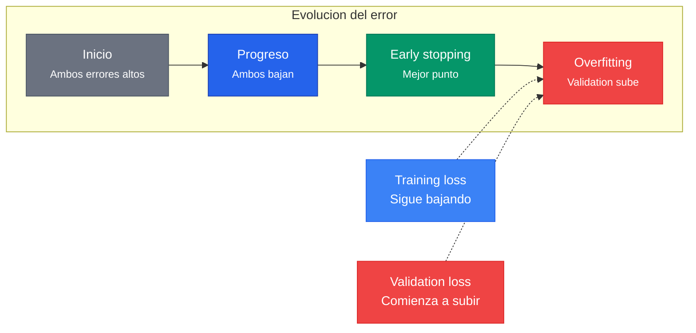

El learning rate ($\eta$) es el **hiperparametro mas importante** del entrenamiento de redes neuronales. Controla el tamano del paso en cada actualizacion de pesos y determina si el proceso converge, diverge o se estanca.

---

## 1. El Dilema Central

$$w^{new} = w^{old} - \eta \cdot \frac{\partial L}{\partial w}$$

| Learning Rate | Comportamiento |
|---|---|
| **Muy alto** | Diverge -- la loss sube |
| **Alto** | Converge rapido, luego oscila |
| **Muy bajo** | Converge extremadamente lento |
| **Bueno** | Converge rapido y estable |


Un learning rate demasiado grande hace que los pasos sobredimensionados salten sobre el minimo. Uno demasiado pequeno converge tan lento que el entrenamiento se vuelve impracticable. La teoria del Lema de Descenso establece los limites formales.


---

## 2. Teoria Formal: El Lema de Descenso

Una funcion $f$ es **L-smooth** si:

$$\|\nabla f(x) - \nabla f(y)\| \leq L \|x - y\|$$

Bajo esta condicion, el Lema de Descenso garantiza:


f(x - \eta \nabla f(x)) \leq f(x) - \eta \left(1 - \frac{L\eta}{2}\right) \|\nabla f(x)\|^2


Para que la funcion decrezca en cada paso se requiere que el factor $(1 - L\eta/2) > 0$:

$$\eta < \frac{2}{L}$$

El paso optimo fijo es $\eta^* = 1/L$, que maximiza el decrecimiento garantizado.

### Tasas de convergencia

| Escenario | Tasa | Iteraciones para precision $\epsilon$ |
|---|---|---|
| No-convexa, L-smooth | $\min \|\nabla f\|^2 = O(1/t)$ | $O(1/\epsilon)$ |
| Convexa, L-smooth | $f(x_t) - f^* = O(1/t)$ | $O(1/\epsilon)$ |
| $\mu$-fuertemente convexa | $f(x_t) - f^* = O((1-\mu/L)^t)$ | $O(\kappa \log(1/\epsilon))$ |

El ratio $\kappa = L/\mu$ es el **numero de condicion**: cuanto mayor es, mas dificil es el problema.

---

## 3. Saddle Points vs Minimos Locales

En un punto critico con $n$ parametros:

$$P(\text{minimo local}) \approx (1/2)^n$$

Con millones de parametros, los **saddle points superan vastamente en numero** a los minimos locales. El learning rate y el momentum son clave para escapar de ellos.

---

## 4. Estrategias de Learning Rate Scheduling

Un LR fijo puede no ser optimo durante todo el entrenamiento: al inicio queremos pasos grandes para avanzar rapido; cerca del optimo, pasos pequenos para ajustar fino.

### 4.1 Step Decay

Reduce el LR por un factor cada cierta cantidad de epocas:

$$\eta_t = \eta_0 \cdot \gamma^{\lfloor t / \text{step\_size} \rfloor}$$

Ejemplo con ResNet: $\eta = 0.1$ hasta la epoca 30, luego $0.01$, luego $0.001$, etc.

### 4.2 Cosine Annealing


\eta_t = \eta_{\min} + \frac{1}{2}(\eta_{\max} - \eta_{\min})\left(1 + \cos\left(\frac{\pi t}{T}\right)\right)


Baja suavemente siguiendo una curva coseno, sin saltos abruptos.

### 4.3 Warmup

$$\eta_t = \eta_{\text{target}} \cdot \frac{t}{T_{\text{warmup}}} \quad \text{para } t < T_{\text{warmup}}$$

Empieza con un LR bajo y sube gradualmente. Necesario porque:
1. Estabiliza el entrenamiento temprano cuando los pesos estan lejos del optimo
2. Permite LRs objetivo mas altos
3. **Critico para Transformers** y batches grandes

### 4.4 One-Cycle Policy (Leslie Smith, 2018)


**Super-convergencia**: Redes entrenadas con 1-cycle alcanzan la misma precision en **1/5 a 1/10** de las epocas, combinando warmup agresivo + decay + fase final con LR muy bajo.


### 4.5 ReduceLROnPlateau

Monitorea la validation loss. Si no mejora durante $n$ epocas consecutivas (patience), reduce el LR por un factor.

---

## 5. Batch Size y Learning Rate

### Regla de Escalamiento Lineal (Goyal et al., 2017)

$$\text{lr\_new} = \text{lr\_base} \cdot \frac{B_{\text{new}}}{B_{\text{base}}}$$

**Intuicion:** Duplicar el batch reduce la varianza del gradiente a la mitad ($\text{Var}(g_B) = \text{Var}(\nabla L_i) / B$), permitiendo pasos mas grandes.

**Escala de ruido SGD:**

$$\text{noise} \sim \sqrt{\text{lr}/B} \cdot \sigma$$

Para mantener el mismo nivel de ruido al aumentar $B$ por $k$, hay que aumentar el LR por $k$.


**Warmup es esencial con batches grandes.** Sin warmup, la regla de escalamiento lineal puede desestabilizar las primeras iteraciones cuando los pesos estan lejos del optimo.


---

## 6. Early Stopping

Si la validation loss comienza a subir mientras la training loss sigue bajando, es senal de **overfitting**:

Early stopping y LR scheduling son **complementarios**: el scheduler reduce el LR cuando el progreso se estanca; early stopping detiene completamente cuando ya no hay progreso posible.

---

## Para Profundizar

- [Clase 10 - Optimizacion y Learning Rate](/clases/clase-10/) -- Comportamiento visual de convergencia/divergencia, scheduling
- [Clase 10 - Profundizacion, Parte III](/clases/clase-10/profundizacion/) -- Lema de Descenso, L-suavidad, 1-cycle policy, escalamiento lineal
