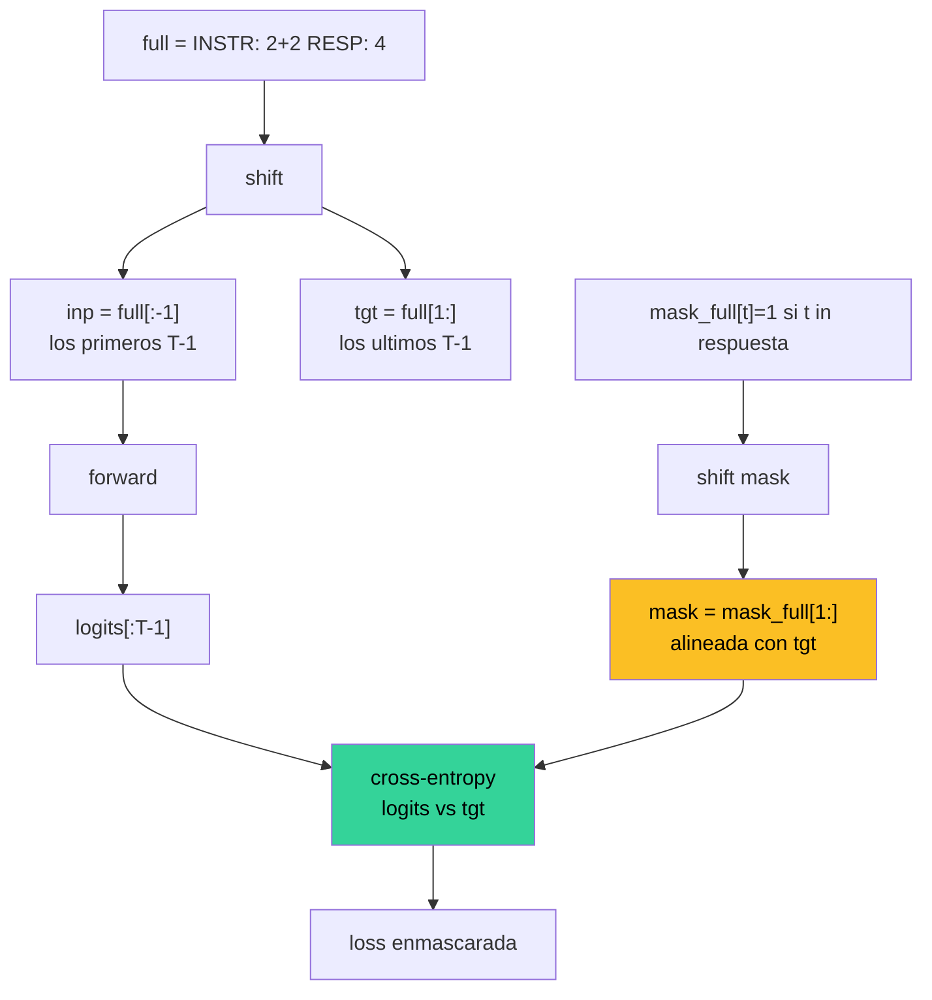

El **loss masking** es la tecnica que hace funcionar a [SFT](/fundamentos/sft) y que lo distingue tecnicamente del simple "pretraining sobre datos formateados". La idea es minima en una linea: **solo penalizar el cross-entropy sobre los tokens de la respuesta**, no sobre los tokens del prompt. La idea es sutil en su implementacion: el alineamiento con `tgt = full[1:]` y la construccion de la mascara binaria son donde casi todo el mundo se equivoca la primera vez.

Esta entrada disecciona el problema, la solucion mecanica, el alineamiento del shift, las variantes de mascara para system prompts y dialogo multi-turno, y muestra el snippet exacto que aparece en el cap 24 del curso.

---

## 1. El problema: todos los tokens vs solo respuesta

Tomemos un ejemplo SFT del curso, char-level:

```
prompt   = "INSTR: reverse 'cat'\nRESP: "
response = "tac\n"
full     = prompt + response
         = "INSTR: reverse 'cat'\nRESP: tac\n"
```

Si entrenamos con cross-entropy sobre **todos** los tokens de `full` (igual que pretraining), el modelo aprende dos cosas mezcladas:

- A generar prompts (porque los ve como target en su shifted prediction).
- A generar respuestas dado el prompt (lo que realmente queremos).

En inferencia, el usuario aporta el prompt; el modelo solo necesita generar la respuesta. Aprender a generar prompts es ruido: gasta capacidad y, peor, puede llevar al modelo a continuar con un nuevo `\nINSTR: ...` despues de su respuesta. Es el clasico bug "el modelo se autoresponde con mas preguntas".

---

## 2. Que pasa SIN loss masking: el bug clasico

Imagina un dataset SFT de 10k pares matematica/lenguaje. Sin masking, durante el training:

- El 60% de los tokens promediados son del prompt.
- El gradiente "tira" al modelo a memorizar la distribucion de prompts del dataset.
- En inferencia, el modelo termina la respuesta y, dado que `\n` despues de respuesta es estadisticamente seguido por `INSTR: ` en el dataset, **el modelo lo genera**.

Sintoma observable: das `INSTR: 2+2 \nRESP: ` y obtienes `4\nINSTR: 3+3\nRESP: 6\nINSTR: ...` -- el modelo se convirtio en un generador de dialogos completos en vez de un asistente.

Loss masking elimina el problema en su raiz: el gradiente nunca empuja al modelo a producir prompts.

---

## 3. Implementacion mecanica

Definimos una **mascara binaria** $m \in \{0, 1\}^T$ con la misma longitud que `full`:

$$
m_t = \begin{cases}
0 & \text{si } t \text{ pertenece al prompt} \\
1 & \text{si } t \text{ pertenece a la respuesta}
\end{cases}
$$

La loss SFT es cross-entropy ponderada por la mascara:

$$
\mathcal{L}_{\text{SFT}} = -\frac{1}{\sum_t m_t} \sum_{t=1}^{T} m_t \cdot \log p_\theta(y_t \mid y_{<t})
$$

Tres detalles importantes:

1. **El forward pass usa todos los tokens**. El modelo necesita el prompt como contexto via self-attention. Solo enmascaramos en el calculo de la loss, no en el input.
2. **Normalizamos por $\sum m_t$**, no por $T$. Si dividieramos por $T$, ejemplos con respuestas cortas tendrian gradientes mas pequenos artificialmente.
3. **Es matematicamente identico a borrar las posiciones**: enmascarar es equivalente a entrenar solo sobre las posiciones de respuesta, pero permite implementarlo con tensores de tamano fijo y batching eficiente.

---

## 4. Alineamiento con `tgt = full[1:]`: el detalle critico

Aqui es donde se equivoca casi todo el mundo. Recordemos que en next-token prediction:

- **Input**: $y_0, y_1, \ldots, y_{T-1}$ (los primeros $T$ tokens).
- **Target**: $y_1, y_2, \ldots, y_T$ (shifted por 1: lo que el modelo debe predecir).

Es decir, en el codigo aparece como `inp = full[:-1]; tgt = full[1:]`. La mascara $m$ debe alinearse con **tgt**, no con **full** ni con **inp**.



El shift de la mascara es **el mismo shift** que se aplica a tgt. Si `mask_full[i]` indica "la posicion $i$ pertenece a la respuesta", entonces `mask = mask_full[1:]` indica "la posicion **objetivo** $i$ pertenece a la respuesta". Eso es lo que queremos: la mascara filtra **predicciones** de respuesta, no **inputs** de respuesta.

Equivocar este shift por 1 posicion es un bug silencioso: la loss baja igual, pero el modelo aprende algo ligeramente desplazado del objetivo (ej. predecir el primer token de respuesta usa el ultimo token de prompt como input -- esa prediccion **debe** estar enmascarada con 1, no con 0). Si la mascara esta desplazada, ese gradiente se pierde.

Concretamente, en el ejemplo `prompt = "INSTR: 2+2\nRESP: "` (16 caracteres) y `response = "4\n"` (2 caracteres), `full` mide 18 caracteres:

```
full         = [I,N,S,T,R,:, ,2,+,2,\n,R,E,S,P,:, ,4,\n]   # 18 + 1 = 19 con BOS opcional
mask_full    = [0,0,0,0,0,0,0,0,0,0,0,0,0,0,0,0,0,1,1]
inp = full[:-1]                                            # 18 tokens
tgt = full[1:]                                             # 18 tokens, shifted
mask = mask_full[1:]                                       # 18 entries
              = [0,0,0,0,0,0,0,0,0,0,0,0,0,0,0,0,1,1]
```

El `mask[16]=1` corresponde a la posicion donde el modelo, dado todo hasta `RESP: ` mas espacio, debe predecir `4`. Esa es la primera prediccion de respuesta y debe contar.

---

## 5. Variantes de mascara

Tres variantes aparecen en sistemas reales:

### 5.1 System prompt fixed

En modelos con system prompt (`<|system|>You are helpful.<|user|>...<|assistant|>...`), el system prompt **siempre** se enmascara con 0. No queremos que el modelo aprenda a generar system prompts -- los provee el desarrollador en inferencia.

### 5.2 Multi-turn dialog

En conversaciones con varias rondas usuario-asistente, la convencion es enmascarar **todos los turnos del usuario y del system con 0**, **todos los turnos del asistente con 1**:

```
<|system|>...<|user|>q1<|assistant|>r1<|user|>q2<|assistant|>r2
mask        000000000  0000  1111111  0000  1111111
```

Asi un solo ejemplo de N turnos genera N "respuestas etiquetadas" de gradiente, todas en un mismo forward pass. Es una de las tecnicas que hace SFT eficiente sobre datasets de dialogo.

### 5.3 Loss completion-only vs prompt-loss-weighted

Algunas recetas (DeepSeek, Llama-3) experimentan con dar peso pequeno (no cero) al prompt: $m_t = 0.1$ en prompt, $m_t = 1$ en respuesta. La intuicion es preservar capacidades de modelado de lenguaje en el prompt sin saturar. Empiricamente, los resultados son mixtos -- la version dura ($m_t \in \{0, 1\}$) sigue siendo el default.

---

## 6. Conexion con SFT vs continuation pretrain

**Continuation pretrain** (a veces llamado *domain adaptation*) reentrena un base model sobre texto crudo de un dominio nuevo (ej. medicina, codigo, frances). Es **igual** que pretrain: cross-entropy sobre todos los tokens, sin masking. El objetivo es ampliar el dominio de lenguaje, no ensenar un formato.

**SFT** entrena sobre pares (instruccion, respuesta) **con loss masking**. El objetivo es ensenar el comportamiento de respuesta, asumiendo que el lenguaje base ya esta.

La diferencia mecanica unica entre los dos modos es la mascara. Mismo modelo, mismo loss, mismo optimizador, mismo formato de tensores -- solo cambia que `mask_full` sea todo 1's (continuation) o tenga 0's en el prompt (SFT).

---

## 7. Codigo PyTorch del cap 24 del curso

Snippet exacto del cap 24, simplificado para claridad:

```python
import torch
import torch.nn.functional as F

def build_example(prompt: str, response: str, char_to_id):
    """Construye full, mask_full alineadas."""
    p_ids = [char_to_id[c] for c in prompt]
    r_ids = [char_to_id[c] for c in response]
    full = torch.tensor(p_ids + r_ids, dtype=torch.long)
    mask = torch.zeros(len(full), dtype=torch.long)
    mask[len(p_ids):] = 1   # solo response cuenta
    return full, mask


def sft_loss(model, full_batch, mask_batch):
    """Cross-entropy enmascarada sobre tokens de respuesta."""
    inp = full_batch[:, :-1]            # (B, T-1)
    tgt = full_batch[:, 1:]             # (B, T-1)
    mask = mask_batch[:, 1:].float()    # (B, T-1) <- shift IMPORTANTE

    logits, _ = model(inp)              # (B, T-1, V)
    V = logits.size(-1)
    losses = F.cross_entropy(
        logits.reshape(-1, V),
        tgt.reshape(-1),
        reduction="none",
    )                                   # (B*(T-1),)
    losses = losses.view_as(tgt)        # (B, T-1)

    # Promedio enmascarado: solo tokens de respuesta cuentan
    loss = (losses * mask).sum() / mask.sum().clamp(min=1)
    return loss
```

Tres lineas son el corazon del masking:

- `mask[len(p_ids):] = 1` -- construccion de la mascara sobre `full`.
- `mask = mask_batch[:, 1:]` -- shift identico al de `tgt`.
- `(losses * mask).sum() / mask.sum()` -- promedio condicionado.

El resto es cross-entropy estandar.

---

## 8. Resumen

- **Loss masking** penaliza solo los tokens de **respuesta** en SFT, no los del prompt.
- Sin masking, el modelo aprende a generar prompts -- bug clasico que produce auto-dialogo en inferencia.
- La mascara es un tensor binario $m \in \{0, 1\}^T$, alineado con `tgt = full[1:]` (no con `full`).
- El forward pass **sigue usando todos los tokens** (el prompt es contexto via attention); solo se enmascara en el calculo de la loss.
- **Variantes**: system prompt siempre con $m=0$, dialogo multi-turno enmascara turnos de usuario, prompt-loss-weighted con $m \in [0, 1]$.
- La diferencia mecanica unica entre **continuation pretrain** y **SFT** es la mascara.
- Equivocar el shift de la mascara por 1 posicion es un bug silencioso: el loss baja pero el modelo aprende desplazado.

## Ver tambien

- [SFT](/fundamentos/sft) -- la fase de training en la que loss masking es central.
- [Transformer](/fundamentos/transformer) -- la arquitectura sobre la que se aplica.
- [DPO](/fundamentos/dpo) -- la fase posterior que refina con preferencias y reutiliza el modelo SFT como referencia.
- [Clase 14 cap 24 - SFT training](/clases/clase-14/practica/24-sft-training) -- implementacion completa con masking.
- [Clase 14 cap 23 - Dataset SFT](/clases/clase-14/practica/23-dataset-sft) -- construccion del dataset y mascaras.
