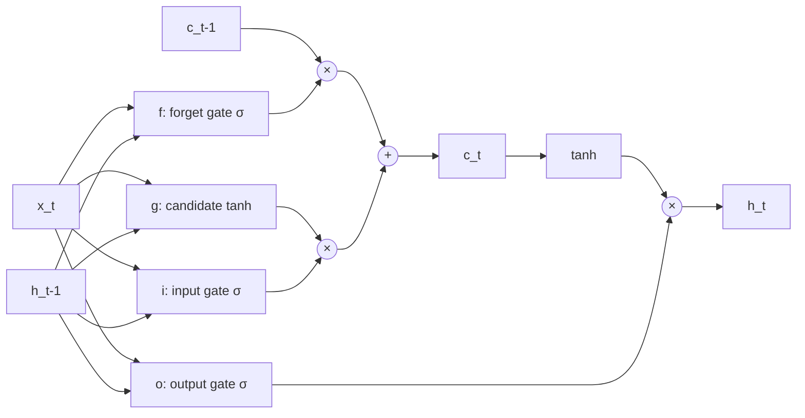
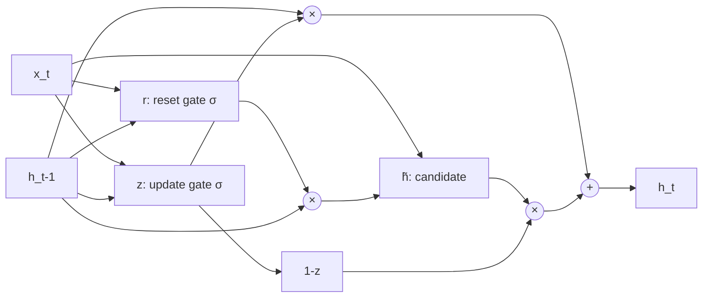

Las **arquitecturas recurrentes con compuertas** (gated RNNs) -- principalmente **LSTM** (Hochreiter & Schmidhuber 1997) y **GRU** (Cho et al. 2014) -- resuelven el problema de **vanishing gradient** que afecta a las RNNs vanilla, permitiendo aprender dependencias temporales de cientos a miles de pasos. Son la base de toda la era pre-Transformer en NLP, traduccion automatica, reconocimiento de voz e image captioning.

---

## 1. El Problema que Resuelven

Una RNN vanilla actualiza su estado segun:

$$h_t = \tanh(W_{hh} \, h_{t-1} + W_{xh} \, x_t)$$

Durante backpropagation through time, el gradiente que vuelve desde el paso $t$ al paso $k < t$ se multiplica $t-k$ veces por $W_{hh}^T \cdot \text{diag}(\tanh'(\cdot))$. Como $|\tanh'(\cdot)| \leq 1$, si los valores singulares de $W_{hh}$ son menores que 1, el producto **decae a cero exponencialmente**. La red no puede aprender que el sujeto del verbo aparece 50 palabras atras.


La solucion fundamental que introducen las compuertas es **reemplazar la multiplicacion repetida por matrices** con un **flujo aditivo del estado de la celda** ($c_t = f \odot c_{t-1} + i \odot g$). El gradiente se multiplica solo por la compuerta de olvido $f$ (elementwise), evitando el colapso exponencial.


---

## 2. LSTM (Long Short-Term Memory)

### 2.1 Idea central: Constant Error Carrousel (CEC)

Hochreiter y Schmidhuber observaron que para evitar vanishing gradient, el estado interno debe propagarse con un **factor multiplicativo de 1.0** (constante). Construyeron una "celda de memoria" lineal con auto-conexion de peso fijo 1.0 -- el **constant error carrousel (CEC)**. El error puede fluir indefinidamente sin decaer.

Pero un CEC sin control sufre de **conflictos de escritura/lectura**: la misma conexion debe a veces almacenar nueva informacion y a veces protegerla. La solucion: **compuertas multiplicativas** que aprenden cuando abrir y cerrar el acceso al CEC.

### 2.2 Arquitectura moderna (con forget gate)

La LSTM original (1997) tenia solo **input gate** y **output gate**. Gers, Schmidhuber y Cummins (2000) anadieron el **forget gate**, que es la version usada hoy. La celda mantiene dos estados:

- **Cell state** $c_t$ -- la "memoria de largo plazo" que fluye casi sin perturbar
- **Hidden state** $h_t$ -- la salida de la celda en el paso $t$



### 2.3 Ecuaciones

$$
\begin{aligned}
i_t &= \sigma(W_{hi} h_{t-1} + W_{xi} x_t + b_i) \quad \text{(input gate)} \\
f_t &= \sigma(W_{hf} h_{t-1} + W_{xf} x_t + b_f) \quad \text{(forget gate)} \\
g_t &= \tanh(W_{hg} h_{t-1} + W_{xg} x_t + b_g) \quad \text{(candidate)} \\
o_t &= \sigma(W_{ho} h_{t-1} + W_{xo} x_t + b_o) \quad \text{(output gate)} \\
c_t &= f_t \odot c_{t-1} + i_t \odot g_t \quad \text{(cell state update)} \\
h_t &= o_t \odot \tanh(c_t) \quad \text{(hidden state output)}
\end{aligned}
$$

donde $\odot$ es el producto elementwise (Hadamard) y $\sigma$ es la sigmoide.

### 2.4 Interpretacion de cada compuerta

| Compuerta | Rol | Valor extremo |
|---|---|---|
| **$i_t$** (input) | Cuanto del candidato $g_t$ se escribe en la celda | $i_t = 0$: ignora la entrada |
| **$f_t$** (forget) | Cuanto del estado previo $c_{t-1}$ se conserva | $f_t = 1$: memoria perfecta; $f_t = 0$: olvido total |
| **$g_t$** (candidate) | Que valor candidato escribir | $\in [-1, 1]$ |
| **$o_t$** (output) | Cuanto de $\tanh(c_t)$ se expone como salida $h_t$ | $o_t = 0$: oculta toda la celda |


El **forget gate** es lo que mas distingue a LSTM moderna. Inicializar $b_f$ con un valor positivo (ej. 1.0) hace que la celda "recuerde por defecto" al inicio del entrenamiento, mejorando significativamente la convergencia.


### 2.5 Por que evita vanishing gradient

La derivada del cell state respecto al anterior es:

$$\frac{\partial c_t}{\partial c_{t-1}} = f_t$$

Es **multiplicacion elementwise por $f_t$**, no producto matricial. Si $f_t \approx 1$, el gradiente fluye sin atenuacion arbitrariamente atras en el tiempo. Esto contrasta con la RNN vanilla donde el gradiente debe atravesar $W_{hh}^T$ repetidamente.

### 2.6 Costo computacional

Una LSTM tiene **4 conjuntos de pesos** por paso (uno por compuerta), ~4x el costo de una RNN vanilla en parametros y FLOPs. Por celda con dimension $d$ y entrada $d_x$:

$$\text{params} = 4 \cdot (d \cdot d_x + d \cdot d + d) = 4d(d + d_x + 1)$$

---

## 3. GRU (Gated Recurrent Unit)

### 3.1 Motivacion

Cho et al. (2014) propusieron una arquitectura simplificada: **dos compuertas en lugar de cuatro**, **un solo estado** (no separa $c_t$ de $h_t$), pero conservando la propiedad clave de flujo aditivo del estado.

### 3.2 Arquitectura



### 3.3 Ecuaciones

$$
\begin{aligned}
r_t &= \sigma(W_r x_t + U_r h_{t-1}) \quad \text{(reset gate)} \\
z_t &= \sigma(W_z x_t + U_z h_{t-1}) \quad \text{(update gate)} \\
\tilde{h}_t &= \tanh(W x_t + U(r_t \odot h_{t-1})) \quad \text{(candidate)} \\
h_t &= z_t \odot h_{t-1} + (1 - z_t) \odot \tilde{h}_t \quad \text{(state update)}
\end{aligned}
$$

### 3.4 Interpretacion

- **Reset gate $r_t$**: cuando $r_t \to 0$, ignora completamente $h_{t-1}$ al calcular el candidato. Permite "reiniciar" el estado, util para detectar el inicio de una nueva clausula.
- **Update gate $z_t$**: interpola entre conservar $h_{t-1}$ ($z_t = 1$) y adoptar el candidato $\tilde{h}_t$ ($z_t = 0$). Funciona como combinacion de input+forget gate de LSTM.

---

## 4. LSTM vs GRU: Comparacion

| Aspecto | LSTM | GRU |
|---|---|---|
| **Compuertas** | 3 (input, forget, output) + candidato | 2 (reset, update) + candidato |
| **Estados** | 2 ($c_t$ y $h_t$) | 1 ($h_t$) |
| **Parametros** | $4d(d + d_x + 1)$ | $3d(d + d_x + 1)$ |
| **Memoria largo plazo** | Excelente (CEC + forget gate) | Excelente |
| **Velocidad** | Mas lento | ~25% mas rapido |
| **Performance** | Marginalmente mejor en tareas grandes | Marginalmente mejor en datasets pequenos |

### Cuando usar cada uno


En la practica, la diferencia de performance entre LSTM y GRU es pequena. **Empezar con GRU** (mas rapido, menos parametros) y solo cambiar a LSTM si la tarea es muy compleja (traduccion long-form, generacion de texto larga). Para benchmarks y produccion en NLP moderno, **Transformers** han desplazado a ambos.


---

## 5. Variantes y Extensiones

### Peephole connections

Gers & Schmidhuber (2000) propusieron que las compuertas tambien observen el estado de celda $c_{t-1}$:

$$i_t = \sigma(W_{hi} h_{t-1} + W_{xi} x_t + W_{ci} c_{t-1} + b_i)$$

En la practica raramente mejora resultados.

### Coupled input-forget gate

Forzar $i_t = 1 - f_t$, asi solo escribe lo que olvida. Reduce parametros, ligero impacto en performance.

### LSTM bidireccional (BiLSTM)

Igual que en RNN bidireccional: dos LSTMs, una hacia adelante y otra hacia atras. Estandar en tareas de comprension de lectura, NER, POS tagging.

### Stacked LSTMs

Apilar 2-4 capas LSTM. Cada capa toma como entrada los $h_t$ de la capa anterior. Es la configuracion del modelo Seq2Seq de Sutskever (2014) -- 4 capas de 1000 celdas.

---

## 6. Implementacion en PyTorch

### LSTM y GRU con APIs de alto nivel



```python
import torch
import torch.nn as nn

# LSTM stacked + bidireccional
lstm = nn.LSTM(
    input_size=128,
    hidden_size=256,
    num_layers=2,
    bidirectional=True,
    batch_first=True,
    dropout=0.3,
)

x = torch.randn(32, 50, 128)
output, (h_n, c_n) = lstm(x)
# output: (32, 50, 512)  # 256 * 2 direcciones
# h_n, c_n: (4, 32, 256) # num_layers * 2 direcciones

# Trick: inicializar forget bias positivo
for name, param in lstm.named_parameters():
    if 'bias' in name:
        n = param.size(0)
        # PyTorch concatena (i, f, g, o), forget bias en [n/4, n/2)
        param.data[n//4:n//2].fill_(1.0)

# GRU
gru = nn.GRU(input_size=128, hidden_size=256, num_layers=2,
             bidirectional=True, batch_first=True)
output, h_n = gru(x)
```


```python
import jax
import jax.numpy as jnp
from flax import linen as nn

class LSTMModel(nn.Module):
    hidden_size: int

    @nn.compact
    def __call__(self, x):
        # Flax ofrece OptimizedLSTMCell y GRUCell
        lstm = nn.RNN(nn.OptimizedLSTMCell(features=self.hidden_size))
        return lstm(x)  # (batch, seq_len, hidden_size)

# Bidireccional
bi_lstm = nn.Bidirectional(
    forward_rnn=nn.RNN(nn.OptimizedLSTMCell(features=256)),
    backward_rnn=nn.RNN(nn.OptimizedLSTMCell(features=256)),
)

# GRU
class GRUModel(nn.Module):
    hidden_size: int

    @nn.compact
    def __call__(self, x):
        gru = nn.RNN(nn.GRUCell(features=self.hidden_size))
        return gru(x)

# Init y aplicar
key = jax.random.PRNGKey(0)
x = jnp.zeros((32, 50, 128))
model = LSTMModel(hidden_size=256)
params = model.init(key, x)
output = model.apply(params, x)
```


```python
import tensorflow as tf

# LSTM stacked + bidireccional
model = tf.keras.Sequential([
    tf.keras.layers.Bidirectional(
        tf.keras.layers.LSTM(256, return_sequences=True, dropout=0.3)),
    tf.keras.layers.Bidirectional(
        tf.keras.layers.LSTM(256, return_sequences=True)),
])

x = tf.random.normal((32, 50, 128))
output = model(x)  # (32, 50, 512)

# GRU
gru_model = tf.keras.Sequential([
    tf.keras.layers.Bidirectional(
        tf.keras.layers.GRU(256, return_sequences=True)),
    tf.keras.layers.Bidirectional(
        tf.keras.layers.GRU(256, return_sequences=True)),
])

# Trick: forget bias positivo (unit_forget_bias=True es el default en Keras)
lstm_layer = tf.keras.layers.LSTM(256, unit_forget_bias=True)
```



### Implementacion de una LSTMCell desde cero



```python
import torch
import torch.nn as nn

class LSTMCell(nn.Module):
    def __init__(self, input_size, hidden_size):
        super().__init__()
        self.W = nn.Linear(input_size + hidden_size, 4 * hidden_size)
        self.hidden_size = hidden_size

    def forward(self, x, state):
        h_prev, c_prev = state
        gates = self.W(torch.cat([x, h_prev], dim=-1))
        i, f, g, o = gates.chunk(4, dim=-1)
        i, f, o = torch.sigmoid(i), torch.sigmoid(f), torch.sigmoid(o)
        g = torch.tanh(g)
        c = f * c_prev + i * g
        h = o * torch.tanh(c)
        return h, (h, c)
```


```python
import jax
import jax.numpy as jnp
from flax import linen as nn

class LSTMCell(nn.Module):
    hidden_size: int

    @nn.compact
    def __call__(self, carry, x):
        h_prev, c_prev = carry
        # Una sola Dense produce las 4 compuertas
        gates = nn.Dense(4 * self.hidden_size)(jnp.concatenate([x, h_prev], axis=-1))
        i, f, g, o = jnp.split(gates, 4, axis=-1)
        i, f, o = jax.nn.sigmoid(i), jax.nn.sigmoid(f), jax.nn.sigmoid(o)
        g = jnp.tanh(g)
        c = f * c_prev + i * g
        h = o * jnp.tanh(c)
        return (h, c), h

# Usar scan para desplegar sobre la secuencia
def unroll(cell, params, xs, h0, c0):
    def step(carry, x):
        return cell.apply(params, carry, x)
    (h_final, c_final), ys = jax.lax.scan(step, (h0, c0), xs)
    return ys, (h_final, c_final)
```


```python
import tensorflow as tf

class LSTMCell(tf.keras.layers.Layer):
    def __init__(self, hidden_size):
        super().__init__()
        self.hidden_size = hidden_size

    def build(self, input_shape):
        self.W = self.add_weight(
            shape=(input_shape[-1] + self.hidden_size, 4 * self.hidden_size),
            initializer='glorot_uniform',
        )

    def call(self, x, states):
        h_prev, c_prev = states
        gates = tf.matmul(tf.concat([x, h_prev], axis=-1), self.W)
        i, f, g, o = tf.split(gates, 4, axis=-1)
        i, f, o = tf.sigmoid(i), tf.sigmoid(f), tf.sigmoid(o)
        g = tf.tanh(g)
        c = f * c_prev + i * g
        h = o * tf.tanh(c)
        return h, (h, c)
```



---

## 7. Trucos Practicos

| Truco | Por que |
|---|---|
| Inicializar $b_f$ a $+1$ o $+2$ | Hace que la celda recuerde por defecto |
| Gradient clipping (norm 5-10) | Evita explosion residual incluso con LSTM |
| Dropout solo entre capas (no recurrente) | Dropout recurrente naive corrompe la memoria |
| Layer normalization | Estabiliza entrenamiento en secuencias largas |
| Truncated BPTT | Limita backprop a $K$ pasos para tareas muy largas |
| Empaquetar batches por longitud | Reduce computo en padding |

---

## 8. Limitaciones

A pesar de su exito, LSTM/GRU tienen tres debilidades:

1. **No paralelizables** en el tiempo: la dependencia $h_t = f(h_{t-1}, x_t)$ obliga a procesar secuencialmente. Los Transformers son completamente paralelizables.
2. **Cuello de botella en seq2seq**: comprimir toda la oracion fuente en un vector $c$ de tamano fijo limita la traduccion de oraciones largas. Solucion: **mecanismo de atencion** (Bahdanau 2014, Luong 2015).
3. **Memoria implicita**: la informacion vive en un vector denso, dificil de inspeccionar o controlar.

Los Transformers (Vaswani et al. 2017) resolvieron las tres limitaciones simultaneamente y son el estandar actual.

---

## 9. Resumen

- **LSTM** introduce un **cell state $c_t$** con flujo aditivo controlado por compuertas $i, f, o$, evitando vanishing gradient.
- **GRU** simplifica a 2 compuertas y un solo estado, mas rapido con performance comparable.
- Ambas reemplazaron a las RNN vanilla en toda la era 1997-2017 para tareas secuenciales.
- Se entrenan con **BPTT** y se benefician de **gradient clipping** para residuos de exploding gradient.
- Hoy estan siendo reemplazadas por **Transformers** en NLP, pero siguen siendo relevantes en streaming, edge devices y series temporales.

Ver tambien: [Redes Recurrentes (RNNs)](redes-recurrentes) · [Backpropagation Through Time](backpropagation-through-time) · [Paper LSTM original](/papers/lstm-hochreiter-1997) · [Paper GRU](/papers/gru-cho-2014).
