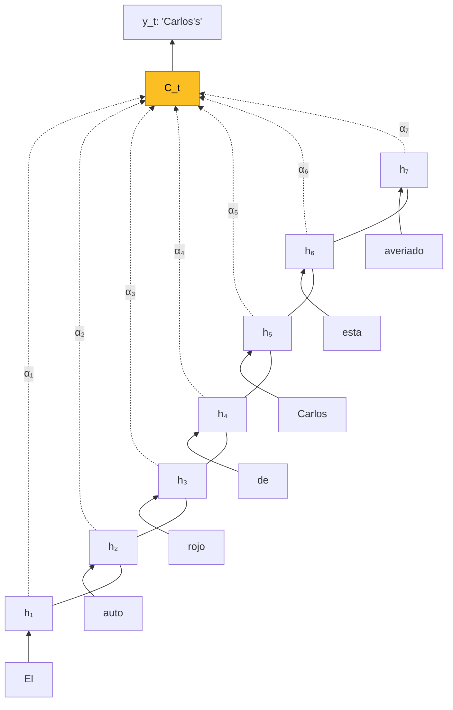

El **mecanismo de atencion** es la idea que rompio el cuello de botella de Seq2Seq y, extendida, dio origen a los **Transformers** y a todas las LLMs modernas. Permite que un modelo **enfoque selectivamente** distintas partes de la entrada al producir cada parte de la salida, en lugar de comprimir toda la informacion en un unico vector fijo.

Introducido por **Bahdanau, Cho y Bengio (ICLR 2015)** para traduccion, se generalizo rapidamente a image captioning, summarization, speech y, eventualmente, a toda la arquitectura Transformer.

---

## 1. El Problema que Resuelve

En una arquitectura [Seq2Seq](seq2seq) estandar, el encoder comprime toda la oracion fuente $x_1, \ldots, x_T$ en un **vector de contexto fijo** $c = h_T$. El decoder usa ese mismo $c$ en cada paso para generar $y_1, y_2, \ldots$

**Problema**: un vector de dimension fija (ej. 1000) no puede representar adecuadamente oraciones largas. Informacion crucial al inicio de la oracion fuente se **diluye** para cuando el decoder esta generando la parte final de la salida.

Empiricamente (Cho et al. 2014, Bahdanau 2015): el BLEU score cae dramaticamente en oraciones >30-40 palabras.

---

## 2. La Idea Central

En lugar de usar un unico vector $c$, dejar que el decoder **consulte todos los estados del encoder** en cada paso, dando **distintos pesos** a cada uno segun lo que sea relevante para producir el siguiente token.



Cuando el decoder esta generando `"Carlos's"`, el peso $\alpha_5$ (correspondiente a `"Carlos"`) deberia ser alto, y el resto bajos. Cuando genera `"red"`, $\alpha_3$ (correspondiente a `"rojo"`) deberia dominar.


**El mecanismo de atencion aprende un alineamiento soft** entre partes de la entrada y partes de la salida, **sin supervision explicita** de ese alineamiento. Solo recibe como senal el error de la traduccion final -- el alineamiento emerge como subproducto del training end-to-end.


---

## 3. Atencion Aditiva (Bahdanau et al. 2015)

### 3.1 Setup

Encoder: **BiLSTM**, produce anotaciones $h_j = [\overrightarrow{h_j}; \overleftarrow{h_j}]$ para cada posicion $j \in \{1, \ldots, T\}$.

Decoder: RNN unidireccional con estado $s_i$ en el paso $i$ de generacion.

### 3.2 Context vector por paso

El context vector **cambia en cada paso** $i$ del decoder:

$$c_i = \sum_{j=1}^{T} \alpha_{ij} h_j$$

donde $\alpha_{ij}$ es el peso de atencion que indica "cuanto mira la posicion $i$ de la salida a la posicion $j$ de la entrada".

### 3.3 Calculo de los pesos

**Alignment model** (feedforward NN):

$$e_{ij} = a(s_{i-1}, h_j) = V_a^T \tanh(W_a s_{i-1} + U_a h_j)$$

**Normalizacion softmax**:

$$\alpha_{ij} = \frac{\exp(e_{ij})}{\sum_{k=1}^{T} \exp(e_{ik})}$$

Propiedades:
- $\alpha_{ij} \in [0, 1]$
- $\sum_j \alpha_{ij} = 1$ (distribucion de probabilidad sobre posiciones del encoder)

### 3.4 Actualizacion del decoder

$$s_i = f(s_{i-1}, y_{i-1}, c_i)$$
$$p(y_i \mid y_{<i}, x) = g(y_{i-1}, s_i, c_i)$$

El decoder ahora depende no solo de su estado y el token previo, sino tambien del **context vector adaptado** $c_i$.

### 3.5 Por que funciona

- Elimina el bottleneck: la informacion se distribuye entre $T$ vectores, no uno solo.
- Soft alignment: $\alpha_{ij}$ es diferenciable, entrenable con SGD puro.
- Interpretabilidad: visualizar $\alpha$ muestra el alineamiento aprendido (figura 3 del paper: matrices con diagonal clara para pares ingles-frances).
- Resiste oraciones largas: RNNsearch-50 mantiene BLEU ~26 en oraciones de 60 palabras, donde RNNencdec-50 cae a ~10.

---

## 4. Variantes Principales

### 4.1 Atencion aditiva (Bahdanau)

$$e_{ij} = V^T \tanh(W s_{i-1} + U h_j)$$

- Dos matrices $W, U$ + vector $V$.
- Score concatenado y pasado por MLP.
- Mas expresivo, mas parametros.

### 4.2 Atencion multiplicativa / dot-product (Luong et al. 2015)

$$e_{ij} = s_i^T h_j$$

- Sin parametros propios.
- Mas rapida (simple producto punto).
- Requiere que $s_i$ y $h_j$ tengan la misma dimensionalidad.

### 4.3 Atencion scaled dot-product (Vaswani et al. 2017)

$$e_{ij} = \frac{s_i^T h_j}{\sqrt{d_k}}$$

- Escala por $\sqrt{d_k}$ para evitar que los productos punto crezcan en magnitud con la dimension.
- Estabiliza la softmax (evita saturacion).
- **Core operation del Transformer**.

### 4.4 Atencion general bilineal (Luong)

$$e_{ij} = s_i^T W_a h_j$$

- Matriz $W_a$ aprendible entre los dos vectores.
- Intermedio entre aditiva y dot-product.

| Variante | Expresividad | Parametros | Velocidad |
|---|---|---|---|
| Aditiva (Bahdanau) | Alta | Muchos | Lento |
| Dot-product (Luong) | Media | Cero extra | Rapido |
| Scaled dot-product | Media | Cero extra | Rapido |
| General bilineal | Alta | Matriz $W_a$ | Medio |

---

## 5. Soft vs Hard Attention

### 5.1 Soft attention

$\alpha_{ij}$ es una distribucion continua sobre posiciones: el decoder atiende a **todas** las posiciones, con distintos pesos. Diferenciable → backprop estandar. Es lo que se usa en Bahdanau y Transformer.

### 5.2 Hard attention (Xu et al. 2015)

El decoder **elige una sola posicion** por paso, muestreada de la distribucion $\alpha_{ij}$. Ventajas:
- Mas eficiente en memoria (no hay suma ponderada).
- Puede atender exactamente a una region en captioning.

Desventajas:
- **No diferenciable**. Requiere **REINFORCE** (estimador de policy gradient) o variational lower bounds.
- Training mas inestable.

En la practica, **soft attention domina** para training; hard attention se usa ocasionalmente en papers sobre vision que necesitan localizacion exacta.

### 5.3 Doubly stochastic attention (Xu 2015)

Penaliza que $\sum_t \alpha_{ti} \approx 1$ para cada posicion $i$ del encoder, forzando al modelo a **mirar todas las regiones** de la imagen al menos una vez a lo largo de la generacion del caption. Mejora calidad de captions.

---

## 6. Atencion para Image Captioning

### 6.1 Show, Attend and Tell (Xu et al. 2015)

Extiende [NIC de Vinyals 2015](/papers/show-and-tell-vinyals-2015) con atencion:

- CNN (VGG) extrae feature map $14 \times 14 \times 512$ → 196 annotation vectors $a_i \in \mathbb{R}^{512}$.
- LSTM decoder con atencion sobre los $a_i$.
- Context vector $\hat{z}_t = \phi(\{a_i\}, \{\alpha_{t,i}\})$.
- Variantes soft y hard.

Visualizacion: los mapas $\alpha_{t,i}$ muestran **donde mira el modelo** al generar cada palabra. Al generar "bird" atiende al pajaro, al generar "water" atiende al agua.

### 6.2 Bottom-up / Top-down attention (Anderson et al. 2018)

Observacion: usar un grid uniforme $14 \times 14$ (Xu 2015) no es ideal -- las regiones no se alinean con objetos.

**Bottom-up**: **Faster R-CNN** propone regiones (bounding boxes de objetos y regiones salientes), cada una con feature vector 2048-dim.

**Top-down**: atencion estandar sobre esas $k$ regiones, usando contexto de la tarea (language LSTM state) como query.

Resultados: CIDEr 117.9, SPICE 21.5, BLEU-4 36.9 en MSCOCO -- state-of-art en 2018. Gano VQA Challenge 2017.

---

## 7. Atencion para Summarization

### 7.1 Pointer-Generator (See, Liu & Manning 2017)

Para **summarization abstractiva**, el baseline Seq2Seq + atencion tiene tres problemas:

1. **Errores factuales** (detalles incorrectos).
2. **OOV** (palabras raras del articulo no en el vocabulario del decoder).
3. **Repetition** (generar la misma frase varias veces).

Soluciones en el mismo modelo:

**Pointer-generator**: interpolar entre generar del vocabulario y **copiar** palabras de la fuente:

$$P(w) = p_{\text{gen}} \cdot P_{\text{vocab}}(w) + (1 - p_{\text{gen}}) \cdot \sum_{i: w_i = w} \alpha_i^t$$

donde $p_{\text{gen}} = \sigma(w_{h^*}^T h_t^* + w_s^T s_t + w_x^T x_t + b_{\text{ptr}})$ es una "switch" aprendible. Resuelve OOV porque el modelo puede copiar palabras de la fuente directamente.

**Coverage**: mantener un vector de cobertura $c^t = \sum_{t'=0}^{t-1} \alpha^{t'}$ (suma de atenciones previas) e incorporarlo a la atencion:

$$e_i^t = v^T \tanh(W_h h_i + W_s s_t + w_c c_i^t + b_{\text{attn}})$$

Penalizacion auxiliar: $\text{cov\_loss} = \sum_i \min(\alpha_i^t, c_i^t)$. Evita atender repetidamente a las mismas posiciones, eliminando repetition.

---

## 8. Implementacion (Bahdanau)



```python
import torch
import torch.nn as nn

class BahdanauAttention(nn.Module):
    def __init__(self, hidden_size):
        super().__init__()
        self.W = nn.Linear(hidden_size, hidden_size, bias=False)
        self.U = nn.Linear(hidden_size, hidden_size, bias=False)
        self.V = nn.Linear(hidden_size, 1, bias=False)

    def forward(self, decoder_state, encoder_outputs):
        # decoder_state: (batch, hidden)
        # encoder_outputs: (batch, seq_len, hidden)
        s = self.W(decoder_state).unsqueeze(1)      # (batch, 1, hidden)
        h = self.U(encoder_outputs)                 # (batch, seq_len, hidden)
        scores = self.V(torch.tanh(s + h)).squeeze(-1)  # (batch, seq_len)
        alpha = torch.softmax(scores, dim=-1)       # (batch, seq_len)
        context = torch.bmm(alpha.unsqueeze(1), encoder_outputs).squeeze(1)
        # context: (batch, hidden)
        return context, alpha

class DecoderWithAttention(nn.Module):
    def __init__(self, vocab_size, embed_dim, hidden_size):
        super().__init__()
        self.embedding = nn.Embedding(vocab_size, embed_dim)
        self.attention = BahdanauAttention(hidden_size)
        self.gru = nn.GRU(embed_dim + hidden_size, hidden_size, batch_first=True)
        self.fc = nn.Linear(hidden_size + hidden_size, vocab_size)

    def forward_step(self, y_prev, hidden, encoder_outputs):
        emb = self.embedding(y_prev)                          # (batch, 1, embed)
        context, alpha = self.attention(hidden.squeeze(0), encoder_outputs)
        gru_in = torch.cat([emb.squeeze(1), context], dim=-1).unsqueeze(1)
        out, hidden = self.gru(gru_in, hidden)
        logits = self.fc(torch.cat([out.squeeze(1), context], dim=-1))
        return logits, hidden, alpha
```


```python
import jax
import jax.numpy as jnp
from flax import linen as nn

class BahdanauAttention(nn.Module):
    hidden_size: int

    @nn.compact
    def __call__(self, s, h):
        # s: (batch, hidden), h: (batch, seq_len, hidden)
        s_proj = nn.Dense(self.hidden_size, use_bias=False)(s)[:, None, :]
        h_proj = nn.Dense(self.hidden_size, use_bias=False)(h)
        scores = nn.Dense(1, use_bias=False)(jnp.tanh(s_proj + h_proj))
        scores = scores.squeeze(-1)
        alpha = nn.softmax(scores, axis=-1)
        context = jnp.einsum('bs,bsh->bh', alpha, h)
        return context, alpha
```


```python
import tensorflow as tf

class BahdanauAttention(tf.keras.layers.Layer):
    def __init__(self, hidden_size):
        super().__init__()
        self.W = tf.keras.layers.Dense(hidden_size, use_bias=False)
        self.U = tf.keras.layers.Dense(hidden_size, use_bias=False)
        self.V = tf.keras.layers.Dense(1, use_bias=False)

    def call(self, s, h):
        # s: (batch, hidden), h: (batch, seq_len, hidden)
        s = tf.expand_dims(self.W(s), 1)            # (batch, 1, hidden)
        h = self.U(h)                               # (batch, seq_len, hidden)
        scores = tf.squeeze(self.V(tf.tanh(s + h)), axis=-1)
        alpha = tf.nn.softmax(scores, axis=-1)      # (batch, seq_len)
        context = tf.reduce_sum(tf.expand_dims(alpha, -1) * h, axis=1)
        return context, alpha
```



---

## 9. Evolucion: Camino al Transformer

Bahdanau 2015 introdujo atencion como **adicion** a RNNs existentes. La evolucion radical:

| Paso | Contribucion |
|---|---|
| 2015 Bahdanau | Atencion aditiva para NMT, entre encoder y decoder |
| 2015 Luong | Dot-product attention, local vs global |
| 2016 Google GNMT | Production-grade NMT con atencion |
| 2017 Vaswani **Attention is All You Need** | **Quitar las RNNs** -- solo self-attention + FFN |
| 2018+ BERT, GPT | Encoder-only / decoder-only Transformers |
| 2020+ LLMs | Transformers escalados a 10^11+ parametros |

El insight clave del Transformer: si atencion funciona bien entre encoder y decoder (cross-attention), tambien puede funcionar **dentro** del encoder y del decoder (self-attention). Eliminar las recurrencias trae paralelismo masivo.

---

## 10. Self-Attention (Preview para Transformer)

Extension de la idea de Bahdanau al caso donde **query, key, value** vienen todas de la misma secuencia:

$$\text{Attention}(Q, K, V) = \text{softmax}\left(\frac{QK^T}{\sqrt{d_k}}\right) V$$

- $Q$: query ($s_{t-1}$ en Bahdanau).
- $K$: key ($h_j$).
- $V$: value ($h_j$ -- mismo que key en la formulacion simple).

En Bahdanau: query viene del decoder, keys/values del encoder → **cross-attention**. En Transformer, los tres vienen de la misma secuencia → **self-attention**.

Ver el fundamento dedicado de Transformers (futuro) para detalles.

---

## 11. Limitaciones

- **Complejidad cuadratica**: calcular atencion entre todos los pares de posiciones es $O(T \cdot T')$ operaciones y memoria $O(T \cdot T')$. Para secuencias >1000 tokens, esto se vuelve prohibitivo.
- **Soluciones eficientes**: Linformer, Performer, FlashAttention, Longformer -- todas reducen la complejidad a casi-lineal o mejoran constantes.
- **Interpretabilidad ilusoria**: visualizar attention weights sugiere explicabilidad, pero estudios (Jain & Wallace 2019) muestran que las attention weights **no necesariamente reflejan la contribucion causal** de cada posicion a la prediccion. Usarlas con cautela.

---

## 12. Resumen

- **Atencion** = weighted sum sobre estados del encoder, con pesos $\alpha_{ij}$ que dependen del estado del decoder y del encoder.
- **Bahdanau 2015** (additive) y **Luong 2015** (multiplicative) son las dos formulaciones clasicas; **scaled dot-product** (Vaswani 2017) es la usada hoy.
- Resuelve el **cuello de botella del vector fijo** en Seq2Seq.
- **Soft attention** (diferenciable) domina; hard attention (Xu 2015) se usa en contextos especificos.
- Aplicaciones: NMT, summarization (**pointer-generator**), image captioning (**Show, Attend and Tell**, **bottom-up attention**), VQA.
- Precursor directo de **Transformers**, que reemplazaron RNNs usando atencion como mecanismo unico.

Ver tambien: [Seq2Seq](seq2seq) · [Redes Recurrentes](redes-recurrentes) · [LSTM y GRU](lstm-gru) · [Paper Bahdanau 2015](/papers/bahdanau-attention-2015) · [Paper Show, Attend and Tell](/papers/show-attend-tell-xu-2015) · [Paper Pointer-Generator](/papers/pointer-generator-see-2017) · [Paper Bottom-Up Attention](/papers/bottom-up-attention-anderson-2018) · [Clase 13](/clases/clase-13).
