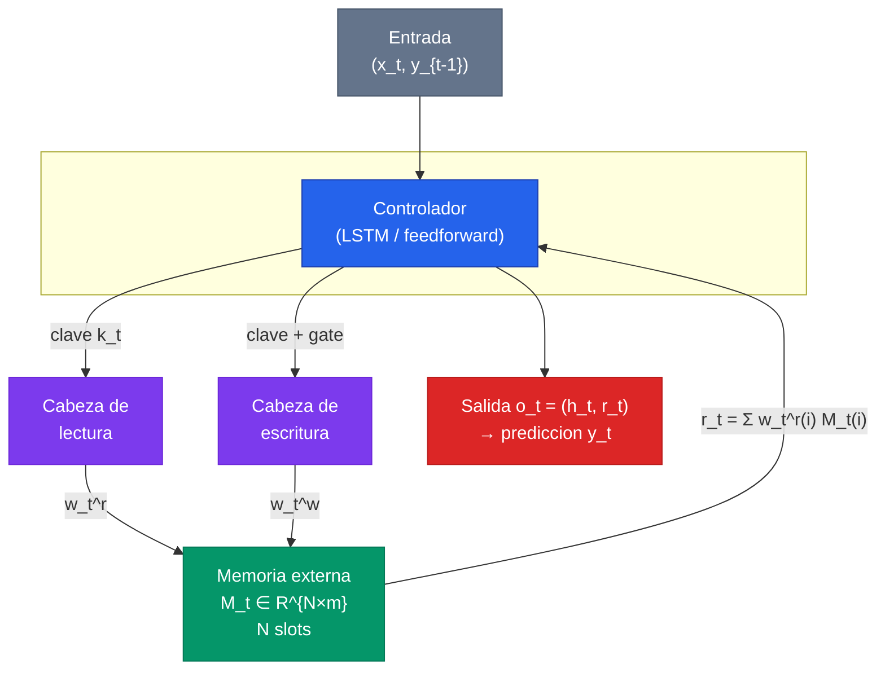
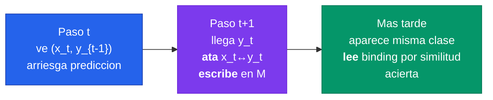

Las redes aumentadas con memoria (Memory-Augmented Neural Networks, MANN) separan explicitamente el **computo** de una red neuronal del **almacenamiento** en una memoria externa direccionable. La idea es poderosa y sencilla: en vez de guardar todo el conocimiento dentro de los pesos —algo lento de actualizar porque requiere descenso de gradiente— se le da a la red una libreta de notas que puede escribir y leer al instante. Esto permite incorporar informacion nueva en un solo paso, sin tocar los pesos, y es la clave para el aprendizaje one-shot. La misma intuicion, llevada al extremo, es la que sostiene hoy la atencion de los Transformers y los sistemas RAG sobre LLMs.

---


La idea central de las MANN es **desacoplar dos escalas temporales de aprendizaje**: un aprendizaje **lento** que vive en los pesos $\theta$ (entrenado por gradiente, captura conocimiento transversal a muchas tareas) y un aprendizaje **rapido** que vive en una memoria externa $M_t$ (escribible al instante, almacena lo recien visto en el episodio actual). El controlador neuronal aprende a *usar bien* la memoria; la memoria guarda el contenido especifico.


---

## 1. El Problema: el Conocimiento Atrapado en los Pesos

Una red neuronal clasica guarda todo lo que sabe en sus pesos. Esos pesos se aprenden lentamente, ejemplo a ejemplo, mediante miles de pasos de descenso de gradiente. Funciona muy bien cuando hay datos masivos y tiempo de sobra, pero falla en un escenario que abunda en la practica: **incorporar informacion nueva al instante**.

En el limite del **one-shot learning**, una sola observacion deberia producir un cambio correcto e inmediato de comportamiento. Para una red entrenada por gradiente, el camino obvio —reentrenar los pesos con los pocos ejemplos nuevos— produce dos patologias:

- **Aprendizaje pobre**: unos pocos pasos de gradiente sobre un punado de ejemplos no bastan para aprender nada robusto.
- **Interferencia catastrofica** (catastrophic forgetting): los nuevos gradientes sobrescriben representaciones utiles ya aprendidas. La red olvida lo viejo al aprender lo nuevo.

Por eso los metodos no parametricos como k-NN se consideran mejor adaptados a este regimen: no olvidan, porque simplemente **almacenan**. La pregunta de las MANN es: ¿podemos darle a una red profunda esa capacidad de almacenar y recuperar, manteniendo la riqueza de representacion del deep learning?


**La analogia neurocientifica.** El cerebro resuelve este mismo problema con dos sistemas complementarios. La **corteza** consolida conocimiento lentamente a lo largo de la vida (analoga a los pesos $\theta$). El **hipocampo** y la **memoria de trabajo** registran experiencias nuevas casi instantaneamente, sin tener que reconfigurar la corteza (analogos a la memoria externa $M_t$). Las MANN son esta *teoria de sistemas de memoria complementarios* traducida a una arquitectura diferenciable.


Una solucion escalable necesita dos propiedades que una LSTM no ofrece de forma natural. Primero, la informacion debe almacenarse de forma **estable** (recuperable de manera fiable) y **direccionable elemento a elemento** (acceso selectivo a piezas relevantes). Segundo, **el numero de parametros no debe estar atado al tamano de la memoria**. En una LSTM, ampliar la "memoria" significa ampliar el estado oculto, lo que infla los parametros y mezcla todo en un unico vector denso dificil de indexar. La memoria externa rompe ese acoplamiento.

---

## 2. Neural Turing Machines: el Antecedente

La pieza que cumple ambos requisitos es la **Neural Turing Machine** (NTM, Graves et al., 2014), antecedente directo de la MANN. Una NTM es una implementacion totalmente diferenciable de una computadora con memoria: combina un **controlador** neuronal con una **matriz de memoria externa** mediante **cabezas de lectura y escritura** (read/write heads).

La memoria es una matriz $M_t \in \mathbb{R}^{N\times m}$ de $N$ slots, cada uno un vector de tamano $m$. El controlador no accede a la memoria directamente: emite **claves** y **gates**, y las cabezas traducen esas senales en distribuciones de pesos sobre los slots. Todo el circuito es diferenciable, de modo que el gradiente puede ensenarle al controlador *que* leer y *donde* escribir.

La NTM admite dos modos de direccionamiento:

| Modo | Como funciona | Para que sirve |
|---|---|---|
| **Por contenido** (content-based) | Busca slots cuyo contenido se parezca a la clave (similitud coseno) | Recuperar informacion por *que es*, sin saber donde esta |
| **Por ubicacion** (location-based) | Avanza/retrocede por la "cinta" relativo a la posicion anterior | Tareas secuenciales: copiar, ordenar, recorrer en orden |

Lo crucial: **el tamano de $M_t$ es independiente del numero de parametros del controlador**. Agrandar la memoria no agranda la red. Esto convierte a la NTM en candidato natural para one-shot: largo plazo via actualizaciones lentas de pesos, corto plazo via memoria externa.

---

## 3. Acceso por Contenido: la Lectura como Atencion Suave

La lectura es donde la idea de MANN revela su parentesco con la atencion moderna. Dada una clave $k_t$ que produce el controlador, se calcula la **similitud coseno** entre $k_t$ y cada fila $M_t(i)$ de la memoria:


K\big(k_t, M_t(i)\big) = \frac{k_t \cdot M_t(i)}{\lVert k_t \rVert\, \lVert M_t(i)\rVert}


Estas similitudes se normalizan con un **softmax** para producir el vector de pesos de lectura $w_t^{r}$, que es una distribucion de probabilidad sobre los $N$ slots:


w_t^{r}(i) \leftarrow \frac{\exp\!\big(K(k_t, M_t(i))\big)}{\sum_j \exp\!\big(K(k_t, M_t(j))\big)}


Y el vector leido $r_t$ es la **combinacion convexa** de las filas, ponderada por esos pesos:


r_t \leftarrow \sum_i w_t^{r}(i)\, M_t(i)


Quien venga de los Transformers reconocera el patron de inmediato: $k_t$ es la **query**, las filas $M_t(i)$ son a la vez **keys** y **values**, la similitud coseno mas softmax produce la distribucion de atencion, y $r_t$ es el **contexto atendido**. Volveremos sobre esta equivalencia en la seccion 6, porque es la clave conceptual de todo el campo.

El numero de lecturas es un hiperparametro: el paper de Santoro usa **4 lecturas** simultaneas, cada una concatenada al vector de salida $o_t$. Son cuatro "ventanas" independientes a la memoria, analogas a las cabezas de la multi-head attention.

---

## 4. MANN y LRUA: una Escritura Pensada para One-Shot

El paper [One-shot Learning with Memory-Augmented Neural Networks](/papers/mann-santoro-2016) (Santoro et al., 2016) toma la NTM y le cambia el **modulo de escritura**. La pregunta es: cuando llega informacion nueva que hay que guardar, ¿en que slot escribir?

La NTM original mezcla direccionamiento por contenido y por ubicacion. Pero el direccionamiento por **ubicacion** introduce un sesgo posicional que es util en tareas secuenciales (copiar, ordenar) e **inutil** en one-shot. En clasificacion few-shot lo que importa es atar una representacion a su etiqueta —una codificacion conjuntiva independiente del orden temporal—, no recordar en que paso aparecio. Gastar grados de libertad modelando estructura secuencial degrada el rendimiento.

La solucion es **LRUA** (Least Recently Used Access): un escritor **puramente basado en contenido** que escribe en una de dos posiciones:

- el slot **menos usado** (least-used), preservando la informacion reciente almacenada en otros slots; o
- el slot **leido mas recientemente** (most recently used), que actua como una *actualizacion* de informacion reciente y relevante.

LRUA mantiene unos **usage weights** $w_t^{u}$ que registran que posiciones se leyeron o escribieron recientemente. Se actualizan decayendo el uso previo y sumando los pesos de lectura y escritura del paso actual:


w_t^{u} \leftarrow \gamma\, w_{t-1}^{u} + w_t^{r} + w_t^{w}


con $\gamma = 0.99$ en los experimentos. A partir del uso se define una mascara binaria de **least-used weights** $w_t^{lu}$, que marca con 1 los $n$ slots menos usados (donde $n$ = numero de lecturas):


w_t^{lu}(i) = \begin{cases} 1 & \text{si } w_t^{u}(i) \le m(w_t^{u}, n) \\ 0 & \text{si } w_t^{u}(i) > m(w_t^{u}, n) \end{cases}


donde $m(v,n)$ es el $n$-esimo valor mas pequeno de $v$. Finalmente, los **write weights** son una combinacion convexa entre los pesos de lectura previos y los least-used previos, modulada por una **compuerta sigmoidea aprendible** $\sigma(\alpha)$:


w_t^{w} \leftarrow \sigma(\alpha)\, w_{t-1}^{r} + \big(1 - \sigma(\alpha)\big)\, w_{t-1}^{lu}


La interpretacion del gate $\alpha$ es elegante:

- Si $\sigma(\alpha) \to 1$: se escribe en el slot **recien leido**, *actualizando* informacion reciente.
- Si $\sigma(\alpha) \to 0$: se escribe en el slot **menos usado**, depositando la novedad en un espacio "libre" sin pisar nada valioso.

Como $\alpha$ se aprende por gradiente, la red **descubre por si sola** la politica de escritura optima para la familia de tareas. La escritura efectiva pone a cero el slot menos usado y luego suma la clave de forma aditiva:


M_t(i) \leftarrow M_{t-1}(i) + w_t^{w}(i)\, k_t, \quad \forall i


El experimento lo confirma: en Omniglot con 15 clases, **MANN con LRUA** alcanza 62.6% de precision en la segunda presentacion de una clase, mientras que **MANN con el acceso location-based de la NTM** se queda en 35.4%. LRUA casi duplica la tasa de aciertos porque dedica toda su capacidad de direccionamiento al contenido relevante.

---

## 5. El Setup Episodico que Fuerza el Uso de la Memoria

La arquitectura por si sola no garantiza que la red use la memoria; un controlador podria intentar memorizar todo en sus pesos. El paper disena un **protocolo de meta-learning episodico** que hace esa estrategia imposible. El objetivo no es minimizar el costo sobre *un* dataset, sino sobre una **distribucion de datasets** $p(D)$:


\theta^{*} = \arg\min_{\theta}\; \mathbb{E}_{D\sim p(D)}\big[L(D;\theta)\big]


Dos trucos de diseno fuerzan el uso de la memoria:

**1. El offset temporal de las etiquetas.** En vez de presentar $(x_t, y_t)$ juntos, la secuencia que ve la red es:

$$(x_1, \text{null}),\; (x_2, y_1),\; (x_3, y_2),\; \ldots,\; (x_T, y_{T-1}).$$

En el paso $t$ la red recibe la nueva consulta $x_t$ junto con la **etiqueta del ejemplo anterior** $y_{t-1}$, y debe predecir $y_t$. Si recibiera $(x_t, y_t)$ a la vez, bastaria copiar la entrada a la salida: tarea trivial. El offset rompe ese atajo. La red ve $x_t$ sin conocer aun su etiqueta, debe arriesgar una prediccion, y solo en el paso siguiente recibe $y_t$ —el momento en que puede **atar** la representacion de $x_t$ con su etiqueta y **escribirla** en memoria.

**2. El barajado de clases y etiquetas entre episodios.** El mismo caracter de Omniglot puede ser "etiqueta 3" en un episodio y "etiqueta 1" en otro. Esto impide que la red aprenda asociaciones de *contenido* en sus pesos ("este caracter -> clase 3"). La unica asociacion estable que queda es **estructural**: "ata lo que veas a la etiqueta que venga despues, y recuperala despues". Ese es exactamente el meta-conocimiento que se quiere forzar a que viva en los pesos, mientras el contenido especifico vive en la memoria.

La consecuencia sobre el rendimiento ideal es nitida: en la **primera** presentacion de una clase, lo mejor que se puede hacer es adivinar (la etiqueta no es inferible por el barajado); de la **segunda** en adelante, la memoria deberia bastar para acertar. Esa es la firma del one-shot. En Omniglot el MANN salta de **36.4%** (primera instancia) a **82.8%** (segunda), llegando a **98.1%** en la decima —superando incluso a participantes humanos en todas las instancias. La memoria se **borra entre episodios** (wiping), porque cada episodio tiene clases nuevas y cualquier residuo seria interferencia.

---

## 6. La Conexion Profunda con la Atencion de los Transformers

Esta es la seccion que vuelve indispensable a las MANN para entender el deep learning moderno. Reescribamos la lectura de MANN al lado de la [self-attention](/fundamentos/self-attention) de los Transformers:

| | MANN (lectura) | Transformer (atencion) |
|---|---|---|
| Query | clave $k_t$ del controlador | $Q$ (proyeccion del token) |
| Keys | filas $M_t(i)$ de la memoria | $K$ (proyeccion de tokens del contexto) |
| Values | las mismas filas $M_t(i)$ | $V$ (proyeccion de tokens del contexto) |
| Score | similitud coseno | producto punto escalado $QK^\top/\sqrt{d_k}$ |
| Pesos | softmax de las similitudes | softmax de los scores |
| Salida | $r_t = \sum_i w_t^r(i)\, M_t(i)$ | $\sum_j \text{softmax}(\cdot)_j\, V_j$ |

Son **la misma operacion**. La atencion *es* un mecanismo de lectura de memoria key-value. Las unicas diferencias son cosmeticas (coseno vs producto punto escalado) y una de fondo:


Un **Transformer es una MANN sin escritura persistente**. Su "memoria" es el conjunto de tokens del contexto, recalculada desde cero en cada forward pass —una memoria de **solo lectura**. La MANN, en cambio, tiene una memoria $M_t$ **persistente y escribible** entre pasos. Esa es la unica diferencia conceptual entre ambos.


Esta equivalencia explica el fenomeno mas desconcertante de los LLMs: el **[in-context learning](/fundamentos/in-context-learning)**. Cuando le das ejemplos a un LLM en el prompt y "aprende" la tarea sin actualizar pesos, esta haciendo *exactamente* lo que hace una MANN: usa el contexto como memoria de la cual leer por similitud. El prompt es la memoria escrita; la atencion es la cabeza de lectura. Por eso los LLMs aprenden de los ejemplos del prompt al instante, sin gradiente: estan ejecutando el mecanismo MANN sobre su ventana de contexto.

La relacion es bidireccional. Los Transformers que **reintroducen escritura persistente** —Transformer-XL, Compressive Transformer, modelos con KV-cache de largo plazo, y los sistemas RAG— estan, en efecto, volviendo a la MANN completa: recuperan el componente de memoria escribible que Santoro ya proponia en 2016.

---

## 7. Otros Modelos de Memoria Externa

Las MANN inauguraron una familia de arquitecturas con memoria diferenciable:

| Modelo | Aporte clave | Tipo de memoria |
|---|---|---|
| **NTM** (Graves 2014) | Primer controlador + memoria diferenciable; addressing por contenido y ubicacion | Matriz escribible, una cabeza |
| **MANN / LRUA** (Santoro 2016) | Escritura content-based para one-shot; meta-learning episodico | Matriz escribible, borrada por episodio |
| **Memory Networks** (Weston 2014) | Memoria de hechos para QA; razonamiento multi-hop sobre texto | Banco de hechos, lectura iterativa |
| **End-to-End Memory Networks** (Sukhbaatar 2015) | Version totalmente diferenciable de Memory Networks, entrenable por backprop | Banco de hechos, atencion suave |
| **Differentiable Neural Computer** (Graves 2016) | Sucesor de la NTM; memoria con enlaces temporales y mecanismo de liberacion de slots | Matriz + grafo de uso |
| **Neural Episodic Control** (Pritzel 2017) | Memoria episodica para RL; acelera el aprendizaje guardando valores de estado | Tabla de Q-values por accion |
| **SNAIL** (Mishra 2018) | Reemplaza la memoria explicita por convoluciones temporales + atencion causal sobre la historia | Atencion sobre el episodio |

La **Memory Network** de Weston merece mencion aparte: nacio para responder preguntas sobre texto, almacenando hechos en una memoria y haciendo lecturas iterativas (multi-hop) para razonar. El **DNC** extendio la NTM con un mecanismo de enlaces temporales entre slots y una politica explicita de liberacion de memoria. Y **SNAIL** cierra el circulo: muestra que se puede prescindir de la memoria explicita y lograr el mismo efecto con atencion sobre toda la historia del episodio —un paso mas hacia la vision Transformer-centrica.

---

## 8. Aplicaciones y Legado

El legado de las MANN se reparte en tres frentes:

**Few-shot y meta-learning.** Junto con Matching Networks (Vinyals 2016), las MANN ayudaron a establecer Omniglot y miniImageNet como benchmarks estandar y a formalizar el protocolo *N-way K-shot* con episodios. El mismo marco episodico lo reutiliza luego MAML (Finn 2017), que mueve el "aprendizaje rapido" de la memoria a unos pasos de gradiente interno. Para profundizar en este marco, ver el [survey de meta-learning de Hospedales et al.](/papers/meta-learning-survey-hospedales-2020).

**El linaje de la atencion.** Como vimos, la lectura key-value de MANN es estructuralmente la atencion que un ano despues definio a los Transformers (ver [Attention Is All You Need](/papers/attention-is-all-you-need-vaswani-2017)). Entender MANN es entender *por que* la atencion funciona: es un mecanismo de recuperacion por contenido.

**Memoria sobre LLMs en produccion.** La moraleja de ingenieria es directa: cuando el problema exige incorporar informacion nueva rapido sin destruir lo aprendido, no reentrenes los pesos —dale al modelo una memoria externa direccionable y entrena los pesos para usarla bien. Esa es exactamente la intuicion que hoy sostiene **RAG** (retrieval-augmented generation), los KV-caches y los sistemas de memoria de largo plazo. MANN es donde esa intuicion se formalizo por primera vez de extremo a extremo y de forma diferenciable.


En aplicaciones de salud, el regimen one-shot es la realidad de las **enfermedades raras** (miles de condiciones con poquisimos casos cada una) y de la **adaptacion a un paciente nuevo** (cada paciente es un episodio: fisiologia compartida en los pesos, historia propia en la memoria). La memoria borrable por episodio evita que los datos de un paciente contaminen las predicciones de otro —una propiedad valiosa para record-linkage y scoring clinico, donde ademas la calibracion de incertidumbre que exhibe MANN ("saber cuando no sabe") es tan importante como acertar.


---

## Para Profundizar

- [Clase 26 - Memoria y meta-aprendizaje](/clases/clase-26) -- contexto y arco completo del tema
- [Clase 14 - Transformers](/clases/clase-14) -- donde la lectura key-value de MANN se vuelve self-attention
- [Paper Santoro et al. 2016 - MANN](/papers/mann-santoro-2016) -- el analisis exhaustivo del paper fundacional
- [Paper Vaswani et al. 2017 - Attention Is All You Need](/papers/attention-is-all-you-need-vaswani-2017) -- la atencion como memoria de solo lectura
- [Self-Attention](/fundamentos/self-attention) -- el mecanismo de lectura de memoria que domina hoy
- [In-Context Learning](/fundamentos/in-context-learning) -- por que los LLMs "aprenden" del prompt sin gradiente
- [LSTM y GRU](/fundamentos/lstm-gru) -- la memoria interna que las MANN superan con memoria externa
