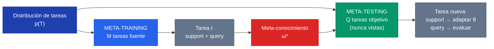
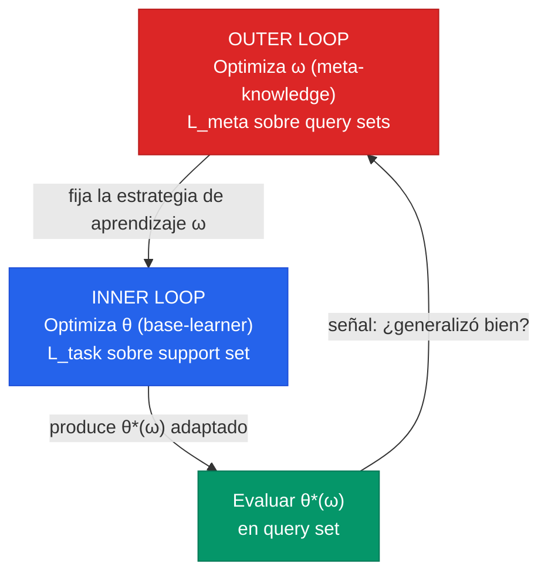
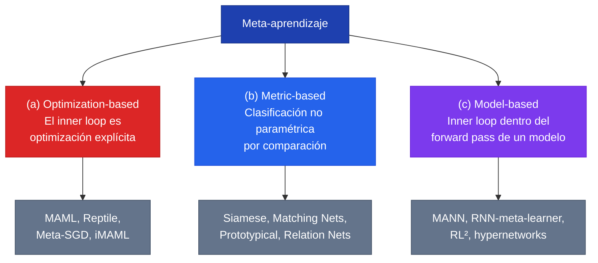

El **meta-aprendizaje** (meta-learning), también llamado **"aprender a aprender"** (learning to learn), es el paradigma en que un sistema no aprende a resolver una sola tarea, sino que aprende **el procedimiento mismo de aprender** a partir de la experiencia de resolver muchas tareas. El deep learning convencional entrena un modelo *desde cero* con un algoritmo de aprendizaje *fijo y diseñado a mano* (un optimizador concreto, una inicialización aleatoria, una regularización elegida por el ingeniero). El meta-aprendizaje da un paso más: trata ese "cómo aprender" como algo que también se puede **optimizar**. Es la siguiente capa de "joint learning" — el deep learning unió el aprendizaje de features y de modelo; el meta-aprendizaje aspira a unir features, modelo y **algoritmo**.

La motivación es directa y profundamente humana. Un adulto que ya domina tres idiomas aprende el cuarto mucho más rápido que un niño aprende el primero: no porque sepa el vocabulario nuevo, sino porque ha aprendido *cómo se aprende un idioma* — qué buscar, qué patrones esperar, cómo practicar. El meta-aprendizaje busca dotar a las máquinas de esa misma habilidad de segundo orden, y es el fundamento central de la **Clase 26** del curso IA UC.


La diferencia esencial entre aprendizaje convencional y meta-aprendizaje es **qué mejora con qué**. En ML clásico, el rendimiento mejora con **más datos de una tarea**. En meta-aprendizaje, el rendimiento mejora con **más tareas vistas** (Thrun & Pratt, 1998): cada tarea nueva se aprende mejor — más rápido, con menos datos — que la anterior, porque el sistema ha destilado un *inductive bias* sobre la familia entera de tareas.


---

## 1. El problema: por qué el supervised learning tradicional no basta

El deep learning supervisado ha tenido sus grandes éxitos exactamente donde abundan dos recursos: **datos masivos** y **cómputo**. ImageNet tiene 1.2 millones de imágenes; GPT se entrenó sobre trillones de tokens. Pero hay regímenes enteros del mundo real donde esos recursos simplemente **no existen por construcción**:

- **Pocos datos (few-shot)**: enfermedades raras con apenas un puñado de casos anotados; un robot que debe adaptarse a un terreno nunca visto en segundos; un idioma minoritario sin corpus grande. No hay millones de ejemplos y nunca los habrá.
- **Cola larga (long tail)**: la mayoría de las clases o situaciones del mundo real son infrecuentes. Un clasificador médico puede ver miles de casos del diagnóstico común y tres del subtipo histológico raro. Entrenar desde cero sobre tres ejemplos garantiza overfitting catastrófico.
- **Adaptación rápida**: el entorno cambia (nuevo hospital, nuevo escáner, nuevo usuario) y el sistema debe ajustarse con poquísima evidencia, sin re-entrenar días en un cluster.

El supervised learning tradicional falla en estos tres frentes porque está diseñado para **una tarea, muchos datos**. Cuando los datos escasean, un modelo profundo con millones de parámetros memoriza el conjunto de entrenamiento en lugar de generalizar.

### La analogía de aprender a aprender un idioma

Imaginemos enseñar a un sistema a clasificar caracteres de un alfabeto que nunca vio, con un solo ejemplo por carácter (one-shot). Un humano lo hace sin esfuerzo: ya sabe *qué es* un trazo, una curva, un componente repetido — ha aprendido a aprender símbolos. El supervised learning clásico, en cambio, necesitaría miles de ejemplos por carácter.

El meta-aprendizaje resuelve esto entrenando sobre **muchos alfabetos distintos**: cada alfabeto es una "tarea". El sistema no aprende los caracteres de ningún alfabeto en particular; aprende *cómo aprender un alfabeto nuevo a partir de un ejemplo*. Esto es precisamente lo que mide el benchmark Omniglot, y es la analogía operativa exacta del políglota que aprende su cuarto idioma rápido.


El meta-aprendizaje es una respuesta directa al teorema **"No Free Lunch"** de Wolpert: no existe un sesgo inductivo óptimo para *todos* los problemas. En lugar de elegir el inductive bias a mano, el meta-aprendizaje lo **busca automáticamente** para una familia específica de tareas. Es la herramienta para encontrar el sesgo mejor adaptado a *tu* distribución de problemas.


---

## 2. Definición formal: meta-training, meta-testing y la distribución de tareas

El punto de partida es el aprendizaje supervisado clásico. Dado un dataset $\mathcal{D} = \{(x_1, y_1), \ldots, (x_N, y_N)\}$, se entrena un modelo $\hat{y} = f_\theta(x)$ resolviendo:

$$\theta^* = \arg\min_\theta \mathcal{L}(\mathcal{D}; \theta, \omega)$$

La pieza clave es $\omega$: codifica **cómo aprender** (la inicialización, el optimizador, la clase de funciones, la regularización). El ML convencional fija $\omega$ a mano y resuelve la optimización *desde cero* para cada problema. **El meta-aprendizaje ataca exactamente esa asunción: en lugar de fijar $\omega$, lo aprende.**

### La distribución de tareas

El meta-aprendizaje no opera sobre una tarea, sino sobre una **distribución de tareas** $p(\mathcal{T})$. Una tarea se define laxamente como un par dataset + función de pérdida, $\mathcal{T} = \{\mathcal{D}, \mathcal{L}\}$. El objetivo es aprender un $\omega$ que generalice a través de tareas muestreadas de $p(\mathcal{T})$:

$$\min_\omega \mathbb{E}_{\mathcal{T} \sim p(\mathcal{T})}\, \mathcal{L}(\mathcal{D}; \omega)$$

### Meta-training y meta-testing

En la práctica se trabaja con dos colecciones de tareas, en perfecta analogía con el split train/test del ML clásico — pero **un nivel más arriba** (a nivel de tareas, no de ejemplos):

- **$\mathcal{D}_{meta\text{-}train}$**: un conjunto de $M$ **tareas fuente** (source tasks) muestreadas de $p(\mathcal{T})$. Sobre ellas se aprende el meta-conocimiento $\omega^*$.

$$\mathcal{D}_{source} = \{(\mathcal{D}^{train}_{source}, \mathcal{D}^{val}_{source})^{(i)}\}_{i=1}^{M}$$

- **$\mathcal{D}_{meta\text{-}test}$**: un conjunto de $Q$ **tareas objetivo** (target tasks) nunca vistas. Sobre cada una se usa $\omega^*$ para entrenar el modelo base y se mide su rendimiento.

$$\mathcal{D}_{target} = \{(\mathcal{D}^{train}_{target}, \mathcal{D}^{test}_{target})^{(i)}\}_{i=1}^{Q}$$

El paso de meta-training busca $\omega^* = \arg\max_\omega \log p(\omega \mid \mathcal{D}_{source})$, y en meta-test se aprende cada tarea objetivo *beneficiándose* del meta-conocimiento:

$$\theta^{*(i)} = \arg\max_\theta \log p(\theta \mid \omega^*, \mathcal{D}^{train(i)}_{target})$$

### Support set y query set

Dentro de **cada** tarea, los datos se parten en dos:

- **Support set** ($\mathcal{D}^{train}$): los pocos ejemplos etiquetados de los que el modelo *aprende* esa tarea concreta. En un escenario K-shot, son $K$ ejemplos por clase.
- **Query set** ($\mathcal{D}^{val}$): ejemplos *distintos* de la misma tarea, sobre los que se *evalúa* qué tan bien se aprendió.


La separación **support/query** es el corazón del meta-aprendizaje. Si el meta-objetivo se midiera sobre el mismo support usado para adaptar, el sistema aprendería a **memorizar** esos pocos ejemplos. Al exigir que la adaptación se evalúe sobre un query *disjunto*, se fuerza a aprender **generalización rápida** y no memorización. Es la lógica de un conjunto de validación, internalizada dentro del bucle de entrenamiento.


---

## 3. La vista de bilevel optimization: inner loop y outer loop

El survey de Hospedales et al. (2020) reconcilió las visiones dispersas del campo bajo una formalización única: el meta-aprendizaje es **optimización de dos niveles** (bilevel optimization), un concepto heredado de la teoría de juegos de Stackelberg y la programación matemática jerárquica.

Las dos ecuaciones centrales son:

$$\omega^* = \arg\min_\omega \sum_{i=1}^{M} \mathcal{L}^{meta}\!\left(\theta^{*(i)}(\omega),\, \omega,\, \mathcal{D}^{val(i)}_{source}\right) \quad \text{(nivel externo, outer loop)}$$

sujeto a:

$$\theta^{*(i)}(\omega) = \arg\min_\theta \mathcal{L}^{task}\!\left(\theta,\, \omega,\, \mathcal{D}^{train(i)}_{source}\right) \quad \text{(nivel interno, inner loop)}$$

### Base-learner $\theta$ vs meta-knowledge $\omega$

La distinción más importante de todo el campo:

| Símbolo | Nombre | Qué es | Dónde se optimiza | Sobre qué dato |
| --- | --- | --- | --- | --- |
| $\theta$ | **base-learner** | Los pesos del modelo que resuelve la tarea concreta (ej. un clasificador) | **Inner loop** | Support set de cada tarea |
| $\omega$ | **meta-knowledge** | El "cómo aprender": inicialización, optimizador, métrica, arquitectura, pérdida... | **Outer loop** | Query set, a través de todas las tareas |

- El **inner loop** ($\mathcal{L}^{task}$) entrena el base-learner $\theta$ sobre el support de una tarea — por ejemplo, cross-entropy.
- El **outer loop** ($\mathcal{L}^{meta}$) ajusta el meta-conocimiento $\omega$ midiendo, sobre el query, si los modelos $\theta^{*(i)}(\omega)$ que produjo *generalizan bien*.

### La asimetría líder-seguidor

La estructura crítica es **Stackelberg**: el nivel interno está *condicionado* a la estrategia $\omega$ que fija el nivel externo, pero **no puede cambiar $\omega$** durante su entrenamiento. $\omega$ es el **líder**; $\theta$ es el **seguidor**. El líder elige una estrategia de aprendizaje; el seguidor aprende bajo esa estrategia; el líder observa el resultado y mejora su estrategia.

El survey es honesto sobre el alcance: la vista bilevel es *estrictamente precisa solo para los métodos basados en optimización* (como MAML), pero sirve como herramienta para **visualizar la mecánica** del meta-aprendizaje en general, incluso para métodos feed-forward que sintetizan modelos en una sola pasada.

---

## 4. Las tres familias de métodos

Históricamente el meta-aprendizaje se ha organizado en tres familias según **dónde vive el inner loop**. Esta taxonomía didáctica es la que estructura la Clase 26.

### (a) Optimization-based: MAML

El inner loop se resuelve **literalmente como optimización por gradiente**. El ejemplo canónico es **MAML** (Model-Agnostic Meta-Learning; Finn et al., 2017): el meta-conocimiento $\omega$ es simplemente una **inicialización de pesos $\theta_0$** tal que, partiendo de ella, *unos pocos pasos de descenso de gradiente* sobre una tarea nueva produzcan buena generalización. La frase del abstract lo resume: el método "entrena el modelo para que sea fácil de fine-tunear".

El inner loop adapta con un paso de gradiente:

$$\theta_i' = \theta - \alpha \nabla_\theta \mathcal{L}_{\mathcal{T}_i}(f_\theta)$$

y el outer loop optimiza el desempeño del modelo *ya adaptado*:

$$\min_\theta \sum_{\mathcal{T}_i \sim p(\mathcal{T})} \mathcal{L}_{\mathcal{T}_i}\big(f_{\theta_i'}\big) = \sum_{\mathcal{T}_i \sim p(\mathcal{T})} \mathcal{L}_{\mathcal{T}_i}\big(f_{\theta - \alpha \nabla_\theta \mathcal{L}_{\mathcal{T}_i}(f_\theta)}\big)$$

El punto sutil: la meta-optimización es sobre $\theta$, pero el objetivo se evalúa con los parámetros actualizados $\theta'$. Esto implica un **"gradiente a través de un gradiente"** que introduce un término **Hessiano**:

$$\frac{\partial \theta_i'}{\partial \theta} = I - \alpha \nabla_\theta^2 \mathcal{L}_{\mathcal{T}_i}(f_\theta)$$

La aproximación de primer orden **FOMAML** ignora ese Hessiano ($I - \alpha\nabla^2 \approx I$) y resulta *casi idéntica* en rendimiento — porque las redes ReLU son localmente casi lineales (Hessiano ≈ 0), con un speed-up de ~33%. MAML es **model-agnostic** porque sirve para clasificación, regresión y RL sin cambiar el algoritmo, sin parámetros extra y sin imponer arquitectura. La intuición geométrica: no busca el *centroide* de los óptimos de las tareas, sino el punto de **máxima adaptabilidad direccional** — desde el cual un solo paso de gradiente cae cerca del óptimo de *cualquier* tarea.

### (b) Metric-based: aprendizaje por comparación

El inner loop es **no paramétrico**: en lugar de optimizar pesos, se clasifica un query comparándolo con los ejemplos del support en un **espacio de embeddings aprendido**. El meta-conocimiento $\omega$ es la **función de embedding** $g_\omega$.

- **Siamese Networks** (Koch, 2015): dos torres con pesos compartidos aprenden si dos imágenes son de la misma clase.
- **Matching Networks** (Vinyals et al., 2016): clasifican el query como una suma ponderada por atención de las etiquetas del support, en un espacio coseno.
- **Prototypical Networks** (Snell et al., 2017): calculan un **prototipo** (centroide) por clase en el espacio de embeddings y clasifican por distancia euclídea al prototipo más cercano. Elegantemente simple y muy efectivo.
- **Relation Networks** (Sung et al., 2018): aprenden además la *métrica de comparación* con una red.

El survey muestra que metric learning es un **caso especial de modelo feed-forward**: el embedding del support genera implícitamente los "pesos" (prototipos, similitudes) que interpretan el query, equivalente a una hypernetwork que sintetiza un clasificador lineal.

### (c) Model-based / memory-augmented

El inner loop está **envuelto dentro del forward pass de un modelo**, típicamente recurrente o con memoria explícita. El modelo "ingiere" el support set secuencialmente y queda *condicionado* para clasificar el query, sin un paso de optimización separado.

- **MANN — Memory-Augmented Neural Networks** (Santoro et al., 2016): una red controladora con una memoria externa direccionable (estilo Neural Turing Machine) que almacena ejemplos vistos y los recupera para clasificar nuevos.
- **RNN-meta-learners** y **RL²** (Duan et al., 2016): una RNN cuyo estado oculto *es* el resultado de aprender la tarea.
- **Hypernetworks**: una red genera directamente los pesos de otra, $\theta = g_\omega(\mathcal{D}^{train})$ (modelo **amortizado**: el costo de aprender se paga una vez durante el meta-training).

Ventaja: optimización más simple, sin gradientes de segundo orden. Desventaja observada: generalizan peor a tareas fuera de distribución y son asintóticamente más débiles, porque embeber un support grande en un modelo rico es difícil.

### Tabla comparativa

| Aspecto | (a) Optimization-based (MAML) | (b) Metric-based (Prototypical) | (c) Model-based (MANN) |
| --- | --- | --- | --- |
| **Meta-conocimiento $\omega$** | Inicialización $\theta_0$ | Función de embedding $g_\omega$ | Pesos del modelo con memoria |
| **Inner loop** | Pasos de gradiente explícitos | Comparación no paramétrica | Forward pass (memoria/RNN) |
| **Adaptación en meta-test** | Fine-tuning (pocos pasos) | Embeber support, comparar | Una pasada feed-forward |
| **Costo computacional** | Alto (Hessiano, 2.º orden) | Bajo | Bajo |
| **Generalidad de dominio** | Muy alta (clas./regr./RL) | Media (clasificación) | Media |
| **Extensión a RL** | Natural | Difícil | Natural |
| **Generalización out-of-distribution** | Buena | Buena | Más débil |
| **Ejemplos** | MAML, Reptile, Meta-SGD, iMAML | Siamese, Matching, Prototypical, Relation | MANN, RL², hypernetworks |

> El aporte conceptual del survey de Hospedales es mostrar que estas tres familias no son listas heterogéneas, sino **tres elecciones del mismo eje** ("qué se meta-aprende": inicialización vs embedding vs modelo), combinables con un mismo meta-optimizador (gradiente) y un mismo meta-objetivo (few-shot). La taxonomía se vuelve un **espacio de diseño** del que cualquier método es un punto.

---

## 5. Relación con campos vecinos

El meta-aprendizaje se confunde con frecuencia con paradigmas vecinos. El **criterio discriminante** del survey es nítido: *¿hay un meta-objetivo explícito optimizado end-to-end?* Si no lo hay, no es meta-aprendizaje en sentido estricto.

| Paradigma | Qué hace | Diferencia con meta-aprendizaje |
| --- | --- | --- |
| **[Transfer learning](/fundamentos/transfer-learning)** | Reutiliza pesos de una tarea fuente + fine-tuning | El prior se extrae por entrenamiento *vanilla*, **sin meta-objetivo** que evalúe el beneficio del prior al aprender una tarea nueva |
| **Few-shot learning** | Aprender de pocos ejemplos | Es el *problema/régimen*; el meta-aprendizaje es una de las *soluciones* (la más prominente) |
| **Multi-task learning (MTL)** | Aprende conjuntamente $N$ tareas **conocidas y fijas** | Optimización de un solo nivel, sin meta-objetivo; apunta a tareas conocidas, no a tareas **futuras no vistas** |
| **In-context learning (LLMs)** | El modelo "aprende" de ejemplos en el prompt sin actualizar pesos | Meta-aprendizaje *emergente*: el meta-training (pre-entrenamiento masivo) lo produjo implícitamente, sin bilevel explícito |
| **Domain adaptation / generalization** | Robustez al cambio de distribución | Vanilla no usa meta-objetivo; pero el meta-aprendizaje *puede usarse* para hacerlas (simulando el shift entre train/val) |
| **Hyperparameter optimization / NAS** | Tunear hiperparámetros / arquitectura | *Cae dentro* del meta-aprendizaje cuando se optimiza un meta-objetivo end-to-end (HPO por gradiente, DARTS); random search y Bayesian optimization quedan fuera |

La distinción **transfer learning vs meta-aprendizaje** es la más importante para fijar. Transfer learning toma un modelo preentrenado (en ImageNet, por ejemplo) y lo afina — el prior es "bueno por accidente" del entrenamiento source. El meta-aprendizaje, en cambio, optimiza explícitamente $\omega$ *para que el aprendizaje de la tarea nueva sea bueno*. MAML aprende una inicialización que está *diseñada* para adaptarse rápido; un checkpoint de ImageNet no.

---

## 6. Cómo se evalúa: protocolos y datasets

### El protocolo N-way K-shot

El protocolo estándar para evaluar meta-aprendizaje en clasificación es **N-way K-shot**:

- **N-way**: cada tarea (episodio) tiene $N$ clases.
- **K-shot**: el support set tiene $K$ ejemplos etiquetados por clase, para un total de $N \times K$ ejemplos.

Un episodio **5-way 1-shot** presenta 5 clases nuevas con un solo ejemplo cada una, y se mide la accuracy sobre el query set. Los casos extremos — 1-shot — son los que más estresan la capacidad de "aprender a aprender". El rendimiento se reporta con intervalos de confianza sobre cientos de episodios muestreados.

### Datasets canónicos

| Dataset | Dominio | Característica | Uso |
| --- | --- | --- | --- |
| **Omniglot** (Lake 2015) | 1623 caracteres de 50 alfabetos, 20 instancias c/u | El "MNIST transpuesto" del few-shot: muchas clases, pocos ejemplos | Benchmark más simple; MAML llega a 98.7% en 5-way 1-shot |
| **miniImageNet** (Ravi & Larochelle 2017) | 100 clases de ImageNet (64 train / 16 val / 20 test) | Imágenes naturales, más difícil | Benchmark dominante; MAML ~48.7% en 5-way 1-shot |
| **tieredImageNet** (Ren 2018) | 608 clases agrupadas por categorías | Splits que evitan fuga semántica entre train/test | Generalización más honesta |
| **Meta-Dataset** (Triantafillou 2020) | 10 datasets heterogéneos (ImageNet, hongos, aviones, texto...) | $p(\mathcal{T})$ **ancha y multi-modal** | Stress test de generalización cross-domain |

Un problema reconocido de los benchmarks clásicos (Omniglot, miniImageNet) es que su $p(\mathcal{T})$ es **demasiado estrecha**: todas las tareas se parecen, por lo que el rendimiento no refleja el mundo real. Meta-Dataset y el *cross-domain few-shot challenge* de CVPR (generalizar de ImageNet a imágenes médicas, satelitales, agrícolas) nacieron para corregir esto.

---

## 7. Aplicaciones

El meta-aprendizaje brilla en cualquier dominio donde aparezcan **familias de tareas con datos escasos por tarea**.

- **Visión few-shot**: la aplicación más estudiada. Clasificación, detección de objetos, predicción de landmarks (pose), segmentación y generación con pocos ejemplos.
- **Robótica e imitación**: el RL sufre extrema ineficiencia de muestras, pero abunda en familias naturales de tareas (locomoción a distintas velocidades, navegación en distintos laberintos, conducir distintos autos, lidiar con fallas en una extremidad). El meta-conocimiento del layout de un laberinto se transfiere a toda tarea que requiera navegarlo. MAML adapta políticas de locomoción (half-cheetah, ant) en *dos o tres pasos de gradiente*.
- **NLP**: adaptación rápida a **nuevos idiomas** (especialmente de bajos recursos), nuevos dominios, o personalización a un usuario nuevo con pocos ejemplos.
- **Medicina**: el caso más alineado con datos escasos por construcción.
  - **Enfermedades raras / subtipos infrecuentes**: meta-entrenar sobre patologías frecuentes (cada una una "tarea") produce una inicialización que se adapta a una entidad rara con un puñado de casos. El survey reporta detección de cáncer de mama con MAML + currículum, y predicción de toxicidad molecular one-shot.
  - **Segmentación multi-centro (domain shift)**: cada hospital, escáner o protocolo introduce una distribución distinta. Tratar cada sitio como una tarea y meta-optimizar para robustez al shift permite afinar a un centro nuevo con pocos casos etiquetados.
  - **Label noise**: las anotaciones clínicas (derivadas de registros o códigos) son ruidosas; meta-aprender pesos por muestra (down-weighting de ejemplos ruidosos) es directamente aplicable, p. ej. en segmentación de lesiones de piel.
- **AutoML / NAS**: cuando $\omega$ es la arquitectura misma. DARTS hace búsqueda de arquitectura diferenciable (softmax sobre operaciones candidatas, coeficientes meta-aprendidos). HPO por gradiente cae también dentro del paradigma.

---

## 8. Limitaciones y retos

El meta-aprendizaje es poderoso pero frágil. Los retos abiertos son varios y profundos.

- **Meta-overfitting y memorisation**: el análogo del overfitting, pero *a nivel de tareas*. Si hay pocas tareas fuente, el meta-conocimiento $\omega$ se ajusta a las soluciones de esas tareas concretas y **no generaliza** a tareas meta-test nuevas. Una falla específica es la *memorisation*: el modelo resuelve cada tarea de meta-train **sin siquiera mirar el support set**, porque memorizó las respuestas.
- **Costo computacional (second-order)**: la implementación naive del bilevel es cara en *tiempo* (cada paso externo requiere varios internos) y en *memoria* (reverse-mode differentiation almacena todos los estados intermedios del inner loop). El término Hessiano de MAML exige un backward pass extra. Soluciones: FOMAML (ignorar el 2.º orden), Reptile (sin meta-gradiente explícito), iMAML (teorema de la función implícita para desacoplar el costo del número de pasos), implicit/forward-mode differentiation.
- **Diseño de la familia de tareas (task family design)**: muchos frameworks *requieren* una familia de tareas para meta-entrenar, que a veces no está disponible. ¿Cómo se construyen tareas que sean diversas pero relacionadas? El unsupervised meta-learning (construir tareas sintéticas vía clustering) y el single-task meta-learning buscan aliviar este requisito.
- **Distribuciones multi-modales**: MAML asume implícitamente que $p(\mathcal{T})$ es *uni-modal* — un solo $\omega$ sirve para todas las tareas. Pero las distribuciones reales son multi-modales (imágenes médicas vs satelitales vs cotidianas), y distintos modos requieren distintas estrategias, con gradientes que entran en conflicto.
- **Generalización meta-train → meta-test**: el reto central. Hay dos sub-problemas: (i) generalizar a tareas nuevas de la *misma* $p(\mathcal{T})$ — agravado porque el número de tareas de meta-training suele ser bajo; (ii) generalizar a tareas de una distribución *distinta* (el domain-shift a nivel meta), inevitable al pasar de ImageNet a imágenes médicas.
- **Inestabilidad y sensibilidad a hiperparámetros**: el bilevel anidado es notoriamente sensible. MAML++ catalogó y corrigió una docena de patologías de entrenamiento (gradiente explosivo a través del inner loop, batch norm mal manejada). La etiqueta "model-agnostic" no significa "hyperparameter-free".

---

## 9. Conexión con la era moderna: in-context learning como meta-aprendizaje implícito

El survey de Hospedales (noviembre 2020) cierra justo antes de la ola que redefinió el campo: el **in-context learning** de los Large Language Models. GPT-3 (2020) mostró que un modelo suficientemente grande puede "aprender" una tarea nueva a partir de unos pocos ejemplos puestos **en el prompt**, sin actualizar un solo peso. Se le muestran tres pares (entrada → salida) y resuelve el cuarto. Esto es, funcionalmente, **few-shot learning** — pero sin inner loop de gradiente.

La lectura moderna es que el in-context learning es **meta-aprendizaje emergente**:

- El **pre-entrenamiento masivo** sobre trillones de tokens — predecir el siguiente token sobre billones de documentos heterogéneos — actúa como un gigantesco *meta-training* implícito. Cada documento es, en cierto sentido, una "tarea" distinta de modelado de lenguaje.
- El modelo aprende, como subproducto, un **algoritmo de aprendizaje en sus activaciones**: el forward pass sobre el prompt *implementa* algo análogo a un inner loop (hay evidencia de que los Transformers pueden implementar descenso de gradiente implícito en sus capas de atención).
- El meta-conocimiento $\omega$ son los **pesos del LLM**; el "aprendizaje" de la tarea nueva ocurre enteramente dentro del **contexto**, en una sola pasada feed-forward — exactamente la propiedad de los modelos **amortizados** del survey.

Esto conecta el meta-aprendizaje con la familia model-based / feed-forward: el LLM es, en efecto, un meta-learner amortizado a escala extrema. Es también el motivo por el que el cálculo costo-beneficio del few-shot clásico cambió: hoy, para muchas tareas, prompting un LLM grande supera a entrenar un MAML específico. La intuición de MAML — *un buen punto de partida que se especializa con poquísimos ejemplos* — es exactamente la que sustenta el éxito del fine-tuning eficiente y del prompting de foundation models, que MAML formalizó años antes de que se volviera dominante.


**El arco completo**: meta-aprendizaje explícito (MAML, 2017) → in-context learning emergente (GPT-3, 2020) → foundation models que se adaptan vía prompt (2022+). La pregunta "¿cómo hacer que un sistema aprenda rápido de pocos ejemplos?" recibió primero una respuesta de **bilevel optimization** y luego una respuesta de **escala**. Ambas comparten la misma esencia: separar el *cómo aprender* (el meta-conocimiento) del *qué se aprende* en cada tarea.


---

## 10. Resumen

1. **"Aprender a aprender"**: el meta-aprendizaje optimiza el procedimiento de aprendizaje mismo, a partir de la experiencia de muchas tareas. Mejora con *más tareas*, no con más datos de una tarea.
2. **El problema**: el supervised learning falla con pocos datos, cola larga y necesidad de adaptación rápida. El meta-aprendizaje es la respuesta al "No Free Lunch": busca el inductive bias óptimo para una familia de tareas.
3. **Formalismo**: distribución de tareas $p(\mathcal{T})$; meta-training sobre tareas fuente, meta-testing sobre tareas objetivo nunca vistas; dentro de cada tarea, support (aprender) y query (evaluar).
4. **Bilevel optimization**: inner loop optimiza el base-learner $\theta$ sobre el support; outer loop optimiza el meta-knowledge $\omega$ midiendo generalización sobre el query. Asimetría líder-seguidor (Stackelberg).
5. **Tres familias**: (a) optimization-based (MAML aprende una inicialización), (b) metric-based (Prototypical/Matching aprenden un embedding para comparar), (c) model-based (MANN/RNN embeben el aprendizaje en un forward pass).
6. **Campos vecinos**: se distingue de transfer learning, MTL, domain adaptation por la presencia de un **meta-objetivo explícito**; few-shot es el régimen, no el método; in-context learning es meta-aprendizaje emergente.
7. **Evaluación**: protocolo N-way K-shot; datasets Omniglot, miniImageNet, tieredImageNet, Meta-Dataset.
8. **Aplicaciones**: visión few-shot, robótica, NLP multilingüe, medicina (enfermedades raras, multi-centro, label noise), AutoML/NAS.
9. **Retos**: meta-overfitting/memorisation, costo de segundo orden, diseño de familias de tareas, distribuciones multi-modales, generalización meta-train→meta-test, inestabilidad.
10. **Era moderna**: el in-context learning de los LLMs es meta-aprendizaje implícito y amortizado a escala — el pre-entrenamiento es un meta-training gigante, los pesos son $\omega$, y la tarea se "aprende" en el contexto.

---

## Para profundizar

### Clase y papers

- **[Clase 26 — Meta-aprendizaje](/clases/clase-26)** — la clase principal de este fundamento.
- **[MAML (Finn et al., 2017)](/papers/maml-finn-2017)** — la piedra angular del meta-aprendizaje basado en gradiente.
- **[Matching Networks (Vinyals et al., 2016)](/papers/matching-networks-vinyals-2016)** — clasificación few-shot por atención sobre el support.
- **[Prototypical Networks (Snell et al., 2017)](/papers/prototypical-networks-snell-2017)** — prototipos de clase y distancia euclídea.
- **[Memory-Augmented Neural Networks (Santoro et al., 2016)](/papers/mann-santoro-2016)** — meta-aprendizaje model-based con memoria externa.
- **[Meta-Learning Survey (Hospedales et al., 2020)](/papers/meta-learning-survey-hospedales-2020)** — la referencia canónica y la taxonomía de tres ejes.

### Fundamentos relacionados

- **[Few-shot learning](/fundamentos/few-shot-learning)** — el régimen de datos escasos que motiva el meta-aprendizaje.
- **[Optimización binivel](/fundamentos/optimizacion-binivel)** — la maquinaria matemática del inner/outer loop.
- **[Metric learning](/fundamentos/metric-learning)** — base de la familia metric-based.
- **[Memory-augmented networks](/fundamentos/memory-augmented-networks)** — base de la familia model-based.
- **[Transfer learning](/fundamentos/transfer-learning)** — el pariente cercano sin meta-objetivo explícito.
- **[In-context learning](/fundamentos/in-context-learning)** — el meta-aprendizaje emergente de los LLMs.
