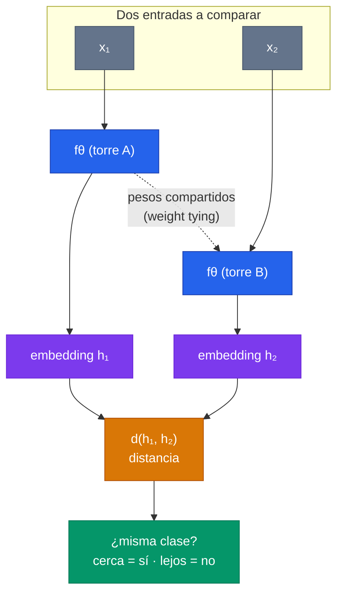
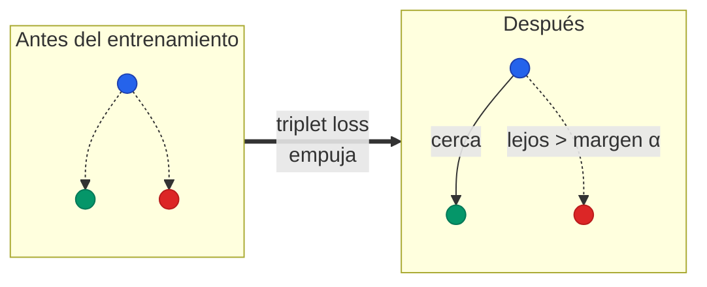
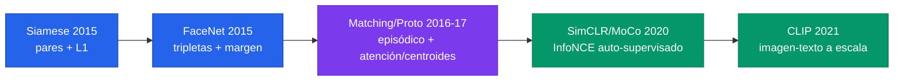

El **metric learning** (aprendizaje de métricas) es un cambio de objetivo: en vez de entrenar un clasificador que mapea una entrada a una de $N$ clases fijas, se entrena una red $f_\theta$ que produce un **espacio de embeddings** donde la **distancia codifica similitud semántica**. Dos entradas de la misma clase quedan cerca; dos de clases distintas, lejos. Una vez aprendido ese espacio, clasificar, recuperar o verificar se reduce a medir distancias. Es el motor del [few-shot learning](/fundamentos/few-shot-learning), de la verificación facial, del retrieval semántico y, de forma directa, del **record linkage / patient matching**.

---

## 1. El problema: clasificar con un número de clases ilimitado o cambiante

El aprendizaje supervisado clásico entrena un clasificador con una capa final softmax de $N$ salidas, una por clase:

$$
p(y = k \mid x) = \frac{\exp(w_k^\top h + b_k)}{\sum_{k'} \exp(w_{k'}^\top h + b_{k'})}, \qquad h = f_\theta(x).
$$

Cada clase $k$ tiene su propio vector de pesos $w_k$. Esto funciona bien cuando $N$ es **fijo y conocido de antemano**, y cada clase tiene **muchos ejemplos**. Pero se rompe en tres escenarios muy comunes:

- **Número de clases ilimitado o desconocido.** En verificación facial hay millones de identidades, y aparecen nuevas a diario. No se puede tener un $w_k$ por persona. Lo mismo en re-identificación de personas, en retrieval de productos, o al decidir si dos registros de pacientes son la misma entidad.
- **Clases que cambian tras el entrenamiento.** Agregar una clase nueva exigiría modificar la arquitectura (añadir una salida) y reentrenar. Inviable en producción.
- **Poquísimos ejemplos por clase** (el régimen [few-shot](/fundamentos/few-shot-learning)). Con 1 o 5 ejemplos, ajustar un $w_k$ por gradiente sobreajusta catastróficamente: los grados de libertad de la red superan ampliamente la información disponible.


Un softmax de $N$ clases fijas **ata el conocimiento del modelo a un conjunto cerrado de categorías**. El metric learning lo libera: aprende qué hace que dos cosas sean "iguales" o "distintas" a nivel de features, y eso se transfiere a clases que nunca vio. La regla de decisión deja de ser "qué peso de clase activa más" y pasa a ser "qué ejemplo de referencia está más cerca".


La idea unificadora es la de un **k-NN meta-aprendido**: el vecino más cercano clásico no requiere entrenamiento (solo guardar ejemplos), pero su desempeño depende por completo de la métrica usada. Comparar imágenes por píxeles crudos con distancia euclidiana es casi inútil. El metric learning **aprende la métrica** —o, equivalentemente, el espacio donde una métrica simple funciona— de modo que el k-NN sobre ese espacio sea poderoso. En Omniglot, un 1-NN sobre píxeles crudos logra 21.7%; sobre el embedding aprendido por una red siamesa, 92.0% ([Koch et al. 2015](/papers/siamese-networks-koch-2015)). Esa diferencia de ~70 puntos **es** el valor de aprender la métrica.

---

## 2. La idea central: aprender un espacio donde la distancia es semántica

El objetivo formal es aprender una función de embedding $f_\theta : \mathbb{R}^D \to \mathbb{R}^M$ tal que, para una distancia $d$ en el espacio de salida:

$$
d\big(f_\theta(x), f_\theta(x')\big) \;\text{ pequeña si } x, x' \text{ son de la misma clase},
$$
$$
d\big(f_\theta(x), f_\theta(x')\big) \;\text{ grande si } x, x' \text{ son de clases distintas}.
$$

La red no aprende a "etiquetar"; aprende a **estructurar geometría**. El espacio resultante tiene la propiedad de que la pertenencia a una clase se lee como proximidad. Toda la no linealidad y capacidad del modelo se concentra en $f_\theta$; la regla de clasificación final es deliberadamente simple (vecino más cercano, prototipo más cercano), porque es la única forma de generalizar a clases no vistas sin parámetros nuevos.

Hay una propiedad arquitectónica que hace esto posible y que reaparece en casi todas las variantes: el **weight tying** (compartir pesos). Cuando dos entradas se comparan, ambas pasan por **la misma** $f_\theta$. Esto garantiza dos cosas:

- **Consistencia local:** si $x \approx x'$, entonces $f_\theta(x) \approx f_\theta(x')$ por continuidad. Entradas similares no pueden caer en lugares arbitrariamente distantes.
- **Simetría:** la similitud $\text{sim}(x, x')$ no depende del orden, igual que la relación "ser de la misma clase" es simétrica.

Este patrón "embeber y comparar" (*embed-then-compare*) es la columna vertebral del metric learning, del retrieval por similitud y de los **bi-encoders** modernos.

---

## 3. Las distancias: euclidiana, coseno, y por qué la elección importa

Las dos distancias más usadas sobre los embeddings son:

| Distancia | Fórmula | Qué mide | Propiedad |
|---|---|---|---|
| **Euclidiana (L2)** | $\|u - v\|_2$ | Separación absoluta en el espacio | Sensible a magnitud y dirección |
| **Euclidiana cuadrada** | $\|u - v\|_2^2$ | Igual, sin la raíz | Divergencia de Bregman; corresponde a gaussianas esféricas |
| **Coseno** | $1 - \dfrac{u^\top v}{\|u\|\,\|v\|}$ | Ángulo entre vectores | Solo dirección; invariante a la norma |
| **Manhattan (L1)** | $\sum_j \|u_j - v_j\|$ | Suma de diferencias por dimensión | Preserva información por componente |

La elección **no es cosmética**. El resultado teórico más citado al respecto viene de [Prototypical Networks](/papers/prototypical-networks-snell-2017) (Snell et al. 2017): cuando una clase se representa por la **media** (centroide) de sus ejemplos, la distancia debe ser una **divergencia de Bregman** para que la media sea el representante óptimo del conjunto. La euclidiana cuadrada es de Bregman; el coseno **no lo es**.

La consecuencia práctica es brutal. En miniImageNet 5-shot, ProtoNets con coseno alcanza 51.48% y con euclidiana 68.20% —una brecha de **~17 puntos** solo por cambiar la distancia. El mecanismo: la media aritmética de varios vectores unitarios no vive sobre la hiperesfera donde el coseno opera, así que se construye el prototipo según un criterio (media euclidiana) y se mide según otro (ángulo). Esa incoherencia interna desaparece con euclidiana, donde la media *es* el minimizador de la distancia total. Más aún, bajo divergencias de Bregman ProtoNets resulta equivalente a una **estimación de densidad por mezcla** de la familia exponencial: la euclidiana cuadrada corresponde a suponer gaussianas esféricas por clase.


Cuando el prototipo se construye **promediando** embeddings, usar coseno rompe la coherencia entre cómo se forma el prototipo y cómo se mide la distancia. Por eso ProtoNets usa euclidiana. En cambio, cuando se comparan **puntos individuales** (sin promediar) o cuando los embeddings se normalizan explícitamente a la esfera unitaria (como en [triplet loss](/fundamentos/triplet-loss) / FaceNet), el coseno funciona bien. La regla: **la distancia debe ser coherente con cómo se agregan los ejemplos**.


---

## 4. Las arquitecturas clave

Cinco arquitecturas marcan la evolución del metric learning para few-shot, de la más simple a la más expresiva.

### 4.1 Siamese Networks (pares + verificación)

[Koch et al. (2015)](/papers/siamese-networks-koch-2015) entrenan **dos torres gemelas con pesos compartidos**. Cada torre embebe una imagen; al tope se computa la distancia $L_1$ componente a componente, ponderada por parámetros aprendidos $\alpha_j$ y pasada por una sigmoide para producir la probabilidad de "misma clase":

$$
p = \sigma\!\Big(\sum_j \alpha_j \,\big|\,h^{(j)}_1 - h^{(j)}_2\,\big|\Big), \qquad h_1 = f_\theta(x_1),\; h_2 = f_\theta(x_2).
$$

La tarea de entrenamiento es **verificación** (¿son iguales estas dos?). En test, para clasificar una query contra $C$ candidatos del support, se elige $C^* = \arg\max_c p(\text{query}, x_c)$: un vecino más cercano sobre la métrica aprendida. Logra 92.0% en Omniglot 20-way one-shot, cerca del 95.5% humano.

### 4.2 Triplet networks / FaceNet (anchor-positive-negative)

[FaceNet](/papers/facenet-schroff-2015) (Schroff et al. 2015) reemplaza los pares por **tripletas** $(x^a, x^p, x^n)$: un ancla, un positivo (misma clase) y un negativo (clase distinta). La pérdida fuerza que el ancla esté más cerca del positivo que del negativo, por un margen $\alpha$:

$$
\mathcal{L} = \max\!\Big(0,\ \|f(x^a) - f(x^p)\|^2 - \|f(x^a) - f(x^n)\|^2 + \alpha\Big).
$$

Los embeddings se normalizan a la esfera unitaria ($\|f(x)\|_2 = 1$). La ventaja sobre los pares: el modelo aprende un **ordenamiento relativo** (positivo más cerca que negativo) en vez de una decisión binaria absoluta, lo que evita calibrar un umbral global. Es el tema completo del fundamento de [triplet loss](/fundamentos/triplet-loss).

### 4.3 Matching Networks (atención sobre el support set)

[Vinyals et al. (2016)](/papers/matching-networks-vinyals-2016) introducen un clasificador **no paramétrico** que predice la etiqueta de una query como una suma ponderada por **atención** sobre todo el support set $S = \{(x_i, y_i)\}$:

$$
\hat{y} = \sum_{i=1}^{k} a(\hat{x}, x_i)\, y_i, \qquad a(\hat{x}, x_i) = \frac{\exp\big(\cos(f(\hat{x}), g(x_i))\big)}{\sum_j \exp\big(\cos(f(\hat{x}), g(x_j))\big)}.
$$

Es un **k-NN suave**: cada ejemplo del support vota con peso proporcional a su similitud coseno con la query. Esta forma subsume tanto k-NN como estimación de densidad por kernel. Su gran aporte además del modelo es el **entrenamiento episódico** (sección 5) y el principio "*test and train conditions must match*". La operación de atención —softmax de similitudes, suma ponderada de valores— es estructuralmente la misma de los Transformers.

### 4.4 Prototypical Networks (centroides + softmax sobre distancias)

[Snell et al. (2017)](/papers/prototypical-networks-snell-2017) simplifican Matching Networks: en vez de atender sobre todos los puntos, **promedian** los embeddings de cada clase en un **prototipo** (centroide):

$$
c_k = \frac{1}{|S_k|} \sum_{(x_i, y_i) \in S_k} f_\theta(x_i), \qquad
p(y = k \mid x) = \frac{\exp\big(-d(f_\theta(x), c_k)\big)}{\sum_{k'} \exp\big(-d(f_\theta(x), c_{k'})\big)}.
$$

La query se clasifica por el prototipo más cercano (con $d$ = euclidiana cuadrada). Ventajas: representación **concisa** ($K$ prototipos en vez de todo el support), costo de inferencia independiente del número de ejemplos, y el promedio **reduce el ruido** del prototipo (la varianza decae como $1/|S_k|$, por eso 5-shot supera a 1-shot). En el caso 1-shot, ProtoNets y Matching Networks **coinciden exactamente** (el prototipo es el único ejemplo).

### 4.5 Relation Networks (aprender la métrica en vez de fijarla)

Las arquitecturas anteriores **fijan** la distancia (L1, coseno, euclidiana). Relation Networks (Sung et al. 2018) dan el paso siguiente: reemplazan la métrica fija por una **red neuronal que aprende el score de similitud**. Toma el par concatenado (embedding de query, prototipo) y produce un score de relación $\in [0,1]$:

$$
r_k = g_\phi\big(\, [\,f_\theta(x),\ c_k\,]\,\big).
$$

Esto convierte la métrica misma en algo aprendible y no lineal, capturando relaciones que una distancia fija (que asume gaussianas esféricas) no puede.

### Tabla comparativa

| Arquitectura | Unidad de comparación | Métrica | Agregación por clase | Entrenamiento | Métrica aprendida |
|---|---|---|---|---|---|
| **Siamese** ([Koch 2015](/papers/siamese-networks-koch-2015)) | Pares (same/diff) | $L_1$ ponderada + sigmoide | — (par a par) | Por pares | Parcial ($\alpha_j$) |
| **Triplet / FaceNet** ([Schroff 2015](/papers/facenet-schroff-2015)) | Tripletas (a,p,n) | $L_2$ en esfera | — | Por tripletas + hard mining | No (margen fijo) |
| **Matching Nets** ([Vinyals 2016](/papers/matching-networks-vinyals-2016)) | Query vs todo el support | Coseno + atención | k-NN suave | Episódico | No |
| **Prototypical** ([Snell 2017](/papers/prototypical-networks-snell-2017)) | Query vs prototipos | Euclidiana cuadrada | Media (centroide) | Episódico | No |
| **Relation Nets** (Sung 2018) | Query vs prototipos | Red neuronal $g_\phi$ | Media | Episódico | **Sí** |

La progresión es clara: de comparar pares aislados, a comparar contra todo el support, a resumir el support en centroides, a aprender hasta la propia noción de "parecido".

---

## 5. Las funciones de pérdida

Toda función de pérdida de metric learning persigue lo mismo —acercar lo igual, alejar lo distinto— pero difieren en su unidad de cómputo y en cómo escalan.

### 5.1 Contrastive loss (pares)

Sobre un par con etiqueta $y \in \{0, 1\}$ (1 = misma clase), con $d = \|f(x_1) - f(x_2)\|$ y margen $m$:

$$
\mathcal{L} = y\, d^2 + (1 - y)\,\max(0,\ m - d)^2.
$$

Los pares iguales pagan por estar lejos; los distintos pagan solo si están **dentro** del margen $m$. La variante de Koch usa cross-entropy binaria sobre la sigmoide en vez de esta forma de energía, pero el principio es el mismo.

### 5.2 Triplet loss (tripletas)

$$
\mathcal{L} = \max\!\Big(0,\ \|f(x^a) - f(x^p)\|^2 - \|f(x^a) - f(x^n)\|^2 + \alpha\Big).
$$

El operador hinge $\max(0, \cdot)$ es clave: las tripletas "fáciles" (que ya cumplen el margen) no aportan gradiente, así que el modelo no malgasta capacidad en ellas. Detalle en [triplet loss](/fundamentos/triplet-loss).

### 5.3 N-pair loss

Generaliza la tripleta para usar **múltiples negativos a la vez**. En vez de un ancla, un positivo y un negativo, usa un ancla, un positivo y $N-1$ negativos, con un softmax sobre las similitudes:

$$
\mathcal{L} = \log\Big(1 + \sum_{i=1}^{N-1} \exp\big(f^\top f_{n_i} - f^\top f_p\big)\Big).
$$

Aprovechar muchos negativos por paso endurece la tarea y produce mejores representaciones —la misma idea que reaparece en InfoNCE y el aprendizaje contrastivo moderno.

### 5.4 Episodic cross-entropy (Prototypical)

La pérdida de ProtoNets es simplemente la log-verosimilitud negativa de la clase correcta, acumulada sobre las queries del episodio:

$$
J(\theta) = -\log p_\theta(y = k \mid x) = d(f_\theta(x), c_k) + \log \sum_{k'} \exp\big(-d(f_\theta(x), c_{k'})\big).
$$

El primer término empuja la query hacia su prototipo; el log-sum-exp la aleja de **todos** los prototipos ajenos. Cuantas más clases haya en el episodio (más "way"), más negativos por consulta y más fina debe ser la geometría —es regularización por dificultad de tarea.

---

## 6. El muestreo: la dificultad de elegir negativos

Hay una asimetría combinatoria que domina el entrenamiento: hay **muchos más pares negativos que positivos**. Con $C$ clases y pocos ejemplos cada una, los pares "distintos" superan ampliamente a los "iguales", y la mayoría de los negativos son **triviales** (dos cosas obviamente diferentes) que producen gradiente cero —ya cumplen el margen. Entrenar con negativos aleatorios significa que casi toda la señal se diluye en comparaciones inútiles.

La solución es el **hard negative mining**: buscar deliberadamente los negativos **difíciles** —ejemplos de clase distinta que el modelo *cree* cercanos. En FaceNet, esto significa elegir las tripletas donde el negativo casi viola el margen (semi-hard), porque son las que producen gradiente informativo. En patient matching, los hard negatives son los pares casi idénticos pero distintos: dos hermanos, un padre y un hijo con el mismo apellido, dos personas con nombres muy comunes.


El **muestreo de negativos** es a menudo tan importante como la arquitectura. Con negativos fáciles, una red excelente no aprende nada (gradiente cero). Con negativos difíciles bien elegidos, una red simple aprende un espacio discriminativo. El riesgo opuesto: negativos *demasiado* difíciles (o etiquetados con ruido) desestabilizan el entrenamiento —de ahí la preferencia por **semi-hard** negatives en FaceNet.


Las arquitecturas que comparan contra **todo el support** (Matching Nets) o que usan **muchas clases por episodio** (ProtoNets con "way" alto) mitigan parcialmente el problema: al normalizar el softmax sobre muchos distractores, fuerzan al modelo a separar la clase correcta de muchos competidores en cada paso, sin tener que minar negativos a mano.

---

## 7. Aplicaciones

El metric learning brilla precisamente donde el número de clases es abierto, cambiante o escaso.

| Aplicación | "Clase" | Por qué metric learning |
|---|---|---|
| **Verificación facial** | Identidad de persona | Millones de identidades, nuevas cada día; imposible un softmax por persona |
| **Re-identificación de personas** | Persona a través de cámaras | Galería abierta; se compara contra un conjunto que cambia |
| **Recuperación de imágenes** | Concepto visual | Búsqueda por similitud en un índice; sin clases fijas |
| **Few-shot classification** | Categoría con 1-5 ejemplos | Patologías raras, especies poco frecuentes; reentrenar sobreajusta |
| **Record linkage / patient matching** | Entidad (misma persona) | Decidir si dos registros son la misma entidad real |

### Record linkage y patient matching: el mismo paradigma

El problema de **MDM** (Master Data Management) en salud es conceptualmente idéntico a la verificación de Koch: dados dos registros de paciente —de sistemas distintos, con nombres tipeados diferente, fechas con errores, identificadores con dígitos transpuestos— decidir si son **la misma entidad**. Eso es exactamente $p(\text{misma clase} \mid x_1, x_2)$, salvo que $x_1, x_2$ son registros en vez de imágenes.

El mapeo a la arquitectura **bi-encoder + scorer** es casi uno a uno:

- Las **dos torres gemelas con pesos compartidos** son el bi-encoder: cada registro se mapea al mismo espacio de embeddings. El weight tying garantiza que registros similares caigan cerca —la propiedad que permite usar el bi-encoder como **blocker**, recuperando candidatos por vecindad (ANN) antes de scorear.
- La **distancia ponderada + decisión** es el scorer match/no-match. La $\sum_j \alpha_j |h_1^{(j)} - h_2^{(j)}|$ de Koch es una versión lineal de lo que un GBM hace de forma no lineal: combinar distancias por campo donde los pesos aprenden qué campos son más discriminativos para la identidad.
- El **muestreo de pares** enfrenta el mismo desbalance: hay muchísimos más pares no-match que match. De ahí el blocking (reducir candidatos) y el muestreo de hard negatives.
- El **costo del blocking domina**: el 1-NN crudo da 21.7% en Omniglot; el embedding aprendido hace el trabajo pesado de poner candidatos cerca, y el scorer afina. En MDM, el blocker (bi-encoder) y el scorer (GBM) son piezas complementarias.

La advertencia también transfiere: el **shift de dominio** (Omniglot → MNIST cae de 92% a 70%) anticipa que un bi-encoder entrenado en una población no transfiere perfectamente a otra con distintas convenciones de nombres. Y el scorer par a par no resuelve transitividad (si A=B y B=C entonces A=C); eso requiere clustering / resolución de entidades sobre el grafo de matches, análogo a cómo Matching/Prototypical Networks agregaron contexto del support.

---

## 8. Conexión con el aprendizaje contrastivo moderno (SimCLR, CLIP)

El metric learning clásico necesitaba **etiquetas** para saber qué pares son "iguales". El [aprendizaje contrastivo](/fundamentos/aprendizaje-contrastivo) auto-supervisado moderno extiende la misma maquinaria a **escala sin etiquetas**, generando los pares positivos de forma artificial.

- **SimCLR / MoCo.** El positivo de una imagen es **otra augmentación de sí misma** (recorte, color, flip); los negativos son las demás imágenes del batch. La pérdida **InfoNCE** es, estructuralmente, el N-pair loss de la sección 5.3 sobre embeddings normalizados con coseno y una temperatura $\tau$:

$$
\mathcal{L} = -\log \frac{\exp(\text{sim}(z_i, z_j)/\tau)}{\sum_{k \neq i} \exp(\text{sim}(z_i, z_k)/\tau)}.
$$

Es metric learning donde "misma clase" se redefine como "misma imagen, distinta vista". El tamaño del batch (miles de negativos) cumple el rol del hard negative mining a escala.

- **CLIP.** Aprende un **espacio compartido entre imágenes y texto**: el positivo de una imagen es su caption real; los negativos son los captions de las otras imágenes del batch. Es exactamente la variante zero-shot de ProtoNets —dos encoders ($f$ para imagen, $g$ para texto) que mapean a un espacio común donde la distancia mide correspondencia semántica— pero entrenada sobre cientos de millones de pares.


El hilo conductor desde 1993 (verificación de firmas) hasta CLIP es **uno solo**: aprender un espacio de embeddings donde la distancia es semántica, comparando ejemplos en vez de clasificarlos contra etiquetas fijas. Lo que cambió es la escala de los negativos (de un par a miles por batch) y la fuente de la supervisión (de etiquetas humanas a augmentaciones auto-generadas y pares imagen-texto de la web). El metric learning a escala **es** la base del pre-entrenamiento de los foundation models multimodales.


---

## Para Profundizar

- [Clase 26 - Métodos no-paramétricos y few-shot](/clases/clase-26) -- el contexto del curso donde se enmarca este fundamento
- [Few-Shot Learning](/fundamentos/few-shot-learning) -- el régimen de datos escasos que motiva el metric learning
- [Meta-Aprendizaje](/fundamentos/meta-aprendizaje) -- "aprender a aprender"; el metric learning es su rama basada en métricas
- [Triplet Loss](/fundamentos/triplet-loss) -- la función de pérdida canónica, con la geometría de la esfera unitaria
- [Aprendizaje Contrastivo](/fundamentos/aprendizaje-contrastivo) -- el metric learning auto-supervisado a escala (SimCLR, MoCo, CLIP)
- [Paper Koch 2015](/papers/siamese-networks-koch-2015) · [Vinyals 2016](/papers/matching-networks-vinyals-2016) · [Snell 2017](/papers/prototypical-networks-snell-2017) · [FaceNet Schroff 2015](/papers/facenet-schroff-2015)
