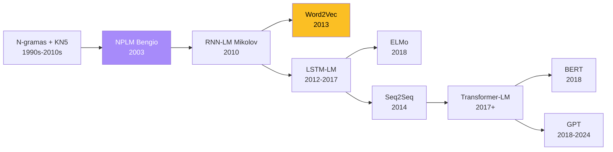

Un **modelo de lenguaje (LM)** es una distribucion de probabilidad sobre secuencias de tokens. Es el objeto matematico central de NLP moderno: desde n-gramas estadisticos de los 80s hasta GPT-4, todos comparten la misma formulacion -- diferenciandose solo en como parametrizan la distribucion.

Este fundamento cubre la teoria desde el LM clasico de n-gramas hasta su generalizacion neuronal, sirviendo como puente entre la [Clase 16 (Intro NLP)](/clases/clase-16) y la [Clase 18 (Word2Vec, GloVe, SkipThought)](/clases/clase-18).

---

## 1. Definicion

Dado un vocabulario $V$ y una secuencia $w_{1:T} = (w_1, w_2, \ldots, w_T)$ con $w_t \in V$, un **modelo de lenguaje** es una funcion:

$$P_\theta : V^* \to [0,1], \quad \sum_{w_{1:T} \in V^T} P_\theta(w_{1:T}) = 1 \text{ para cada } T$$

Asigna mas masa de probabilidad a secuencias bien formadas y semanticamente coherentes que a ruido.

**Ejemplos** (slide 6 de la Clase 18):

```
P(Hola) = 0.1
P(Hola, como estas?) = 0.05
P(Que bonito esta el dia) = 0.02
P(Se me atrofio el esternocleidooccipitomastoideo) = 0.00001
P(supernova flor barroco saltar hola chao) = 0.00000000001
```


**El objetivo del LM no es modelar gramatica explicitamente** -- es asignar masa de probabilidad consistente con la distribucion empirica del lenguaje. La "gramatica" emerge implicitamente como propiedad estadistica del corpus.


---

## 2. Regla de la cadena: la formulacion operativa

La regla de la cadena de probabilidades reduce el problema $|V|^T$-dimensional de la distribucion conjunta a una **funcion condicional univariable**:

$$P(w_1, \ldots, w_T) = \prod_{t=1}^{T} P(w_t \mid w_{1:t-1})$$

**Implicacion**: modelar el LM se reduce a parametrizar:

$$f_\theta : V^* \to \Delta^{|V|}, \quad f_\theta(w_{1:t-1}) = P_\theta(w_t \mid w_{1:t-1})$$

donde $\Delta^{|V|}$ es el simplice probabilistico sobre el vocabulario. **Toda** la maquinaria moderna -- n-gramas, RNN-LM, Transformer-LM, GPT -- parametriza exactamente esta funcion.

Ejemplo del slide 8 de la Clase 18:

$$P(\text{hola como estas}) = P(\text{hola}) \cdot P(\text{como} \mid \text{hola}) \cdot P(\text{estas} \mid \text{hola como})$$

---

## 3. Aplicaciones canonicas

| Aplicacion | Como usa el LM |
|---|---|
| **Generacion de texto** (NLG) | $w_t = \arg\max_w P(w \mid w_{<t})$ o sampling |
| **Traduccion** (MT) | LM condicional $P(Y \mid X)$ |
| **Speech recognition** | $\arg\max_w P(w) \cdot P(\text{audio} \mid w)$ (Bayes) |
| **Spelling correction** | Reranking de candidatos por $P$ |
| **Summarization** | LM condicional sobre el documento fuente |
| **Question answering** | LM extractivo (span) o generativo |
| **Information retrieval** | Query likelihood: $P(q \mid d)$ |
| **Code completion** | LM sobre tokens de codigo |

Todas las aplicaciones modernas de LLMs son variaciones de estas tareas a escala.

---

## 4. Estrategias de decoding

Cuando se usa el LM para **generar** texto, hay que elegir como muestrear de la distribucion condicional:

| Metodo | Idea | Trade-off |
|---|---|---|
| **Greedy** | $\arg\max$ por paso | Rapido, repetitivo, modo unico |
| **Beam search** ($k=B$) | Mantener $B$ hipotesis con mejor log-prob acumulada | Diverso, $O(B \cdot \|V\|)$, sigue siendo modo unico |
| **Sampling** | $w_t \sim P(\cdot \mid w_{<t})$ | Diverso pero ruidoso |
| **Top-k sampling** | Muestrear del top-$k$ | Compromiso |
| **Top-p / nucleus** | Muestrear del conjunto minimo con masa $\geq p$ | Adaptativo al pico |
| **Temperature** | $P_T(w) \propto \exp(\text{logit}(w)/T)$ | $T \to 0$: greedy; $T \to \infty$: uniforme |

La Clase 18 menciona solo greedy (slide 9). Pero **toda la era LLM moderna** usa top-p + temperature.

---

## 5. N-gramas: la aproximacion Markoviana

Truncar el contexto a las ultimas $n-1$ palabras:

$$P(w_t \mid w_{1:t-1}) \approx P(w_t \mid w_{t-n+1:t-1})$$

Estimador MLE por conteos:

$$P_{\text{MLE}}(w_t \mid w_{t-n+1:t-1}) = \frac{\text{count}(w_{t-n+1:t})}{\text{count}(w_{t-n+1:t-1})}$$

**Ejemplo** (slide 19): corpus de 3 oraciones (`the cat sat on the mat` / `the dog sat on the cat` / `the cat caught the mouse`), $P(\text{cat} \mid \text{the}) = 3/6 = 0.5$.

### El problema de sparsity y suavizado

La mayoria de los n-gramas posibles nunca se observan -> $P = 0$ rompe la regla de la cadena. Soluciones (no cubiertas en slides):

- **Laplace (add-one)**: $P_{\text{Lap}} = (\text{count} + 1)/(\text{count}_{\text{ctx}} + \|V\|)$.
- **Add-k**: reemplaza el "+1" por "+k" optimizado.
- **Katz backoff**: si trigrama no se vio, retroceder a bigrama.
- **Kneser-Ney modificado** (Chen-Goodman 1998): el **gold standard** estadistico pre-neural. Usa *continuation probability* en vez de frecuencia bruta.

### Limitaciones de n-gramas

1. **Representacion por IDs**: sin similitud semantica.
2. **N pequeno**: contextos efectivos rara vez superan 5.
3. **No generaliza** a combinaciones nuevas.
4. **Memoria escala $\|V\|^N$**: tablas hash gigantes (Google 5-gram = 30 GB).
5. **No captura dependencias largas**.

Estas limitaciones motivan el [NPLM de Bengio 2003](/papers/nplm-bengio-2003) y todo el camino hacia [Word2Vec](/papers/word2vec-efficient-mikolov-2013) y los LLMs modernos.

---

## 6. Perplejidad: la metrica fundamental

La **perplejidad** (PPL) es la metrica estandar para evaluar LMs. Sobre un test de $T$ tokens:

$$\text{PPL}(w_{1:T}) = P(w_{1:T})^{-1/T} = \exp\left( -\frac{1}{T} \sum_{t=1}^{T} \log P(w_t \mid w_{1:t-1}) \right)$$

Interpretacion: PPL es la **media geometrica inversa** de la probabilidad asignada a cada token. Equivalente al exponencial de la **cross-entropy promedio**. Un LM con PPL = $k$ "duda entre $k$ palabras igualmente probables" en cada paso.

**Valores de referencia historica en WikiText-103**:

| Modelo | PPL |
|---|---|
| 5-gram Kneser-Ney | ~80 |
| LSTM | ~50 |
| Transformer-XL | ~18 |
| GPT-3 (zero-shot) | ~10-15 |

PPL **se conecta directamente con la cross-entropy loss** de entrenamiento: minimizar CE es minimizar log-PPL. Por eso entrenar LMs neuronales con softmax + CE optimiza implicitamente PPL.

---

## 7. Del LM estadistico al LM neuronal

La transicion historica:



Cada paso elimina un cuello de botella del anterior:
- NPLM elimina el problema de sparsity.
- RNN-LM elimina el contexto fijo.
- Word2Vec abandona el LM completo para escalar a embeddings densos.
- Transformer-LM elimina las dependencias largas dificiles de RNNs.

---

## 8. Discreto vs distribuido (Clase 18)

El slide 14 de la Clase 18 plantea la tabla central:

| | Approach discreto | Approach continuo |
|---|---|---|
| **Representacion** | IDs / one-hot | Embeddings densos $\mathbb{R}^m$ |
| **Calculo de $P$** | Conteos de n-gramas | Red neuronal sobre embeddings |
| **Aprendizaje** | Statistics + smoothing | Machine learning (pesos aprendidos) |
| **Generalizacion** | Solo n-gramas vistos | Via similitud semantica |
| **Limite** | $n \leq 5$ practico | Contexto largo posible |

El **approach continuo** es el paradigma de LMs neuronales y motiva todo el bloque de la Clase 18.

---

## 9. Implementacion: cross-entropy en los 3 frameworks

### PyTorch

```python
import torch
import torch.nn as nn

# Logits del LM (output de un Transformer, RNN, etc.)
logits = model(input_ids)  # [B, T, V]
targets = input_ids[:, 1:]  # next-token prediction shift

# Cross-entropy
loss = nn.functional.cross_entropy(
    logits[:, :-1].reshape(-1, vocab_size),
    targets.reshape(-1),
)

# Perplejidad
ppl = torch.exp(loss)
```

### TensorFlow / Keras

```python
import tensorflow as tf

logits = model(input_ids)
targets = input_ids[:, 1:]

loss = tf.nn.sparse_softmax_cross_entropy_with_logits(
    labels=targets,
    logits=logits[:, :-1],
)
loss = tf.reduce_mean(loss)
ppl = tf.exp(loss)
```

### JAX (Flax + Optax)

```python
import jax
import jax.numpy as jnp
import optax

logits = model.apply(params, input_ids)
targets = input_ids[:, 1:]

# Cross-entropy via optax
loss = optax.softmax_cross_entropy_with_integer_labels(
    logits[:, :-1], targets
).mean()
ppl = jnp.exp(loss)
```

---

## 10. Conexion con el resto del curso

- **Clase 16**: introducción a NLP y bag-of-words como representacion discreta.
- **Clase 18 (esta)**: LM probabilistico, n-gramas, transicion a embeddings.
- **Clase 19**: LM contextual con ELMo/GPT/BERT.
- **Clases 11-12**: RNNs y LSTM como arquitecturas para LMs.
- **Clase 13-14**: Seq2seq y Transformer como arquitecturas modernas para LMs.

---

## Referencias

- [Bengio 2003 NPLM](/papers/nplm-bengio-2003): fundacion de LMs neuronales.
- [Mikolov 2010 RNN-LM](/papers/rnn-lm-mikolov-2010): primer RNN-LM exitoso.
- Jurafsky & Martin, *Speech and Language Processing* (3rd ed., draft), capitulos 3 (N-grams) y 7 (Neural LMs): https://web.stanford.edu/~jurafsky/slp3/
- Chen & Goodman 1998: *An Empirical Study of Smoothing Techniques for Language Modeling*.

## Fundamentos relacionados

- [Bag of Words](/fundamentos/bag-of-words) -- representacion discreta clasica.
- [Embeddings distribuidos](/fundamentos/embeddings-distribuidos) -- representacion continua.
- [Word2Vec](/fundamentos/word2vec), [GloVe](/fundamentos/glove), [Skip-Thought](/fundamentos/skip-thought) -- modelos concretos.
- [Redes recurrentes](/fundamentos/redes-recurrentes), [LSTM/GRU](/fundamentos/lstm-gru) -- arquitecturas para LMs.
