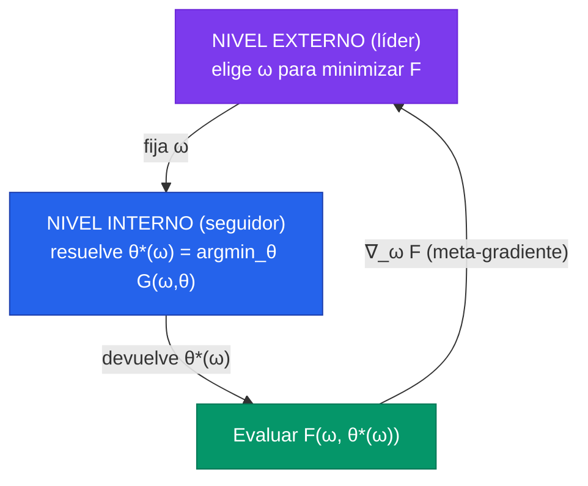
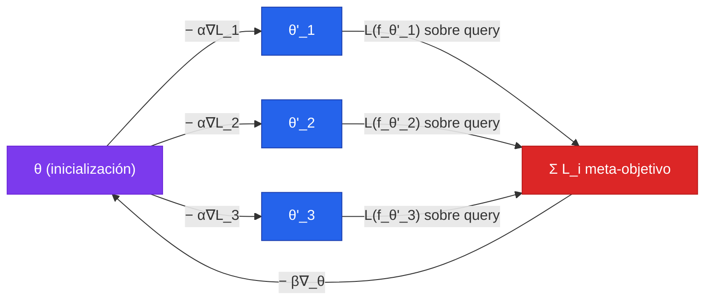

La optimización bi-nivel es el marco matemático que unifica todo el meta-aprendizaje basado en gradientes. La idea central es que aprender no es un solo problema de optimización, sino dos problemas anidados: un problema **interno** que adapta un modelo a una tarea concreta, y un problema **externo** que ajusta *cómo* se hace esa adaptación. Cuando MAML aprende una inicialización, cuando un sistema de AutoML busca hiperparámetros, o cuando NAS busca arquitecturas, todos resuelven la misma estructura formal: un argmin dentro de otro argmin.

---


Un problema bi-nivel tiene la forma $\min_\omega F(\omega, \theta^*(\omega))$ **sujeto a** $\theta^*(\omega) = \arg\min_\theta G(\omega, \theta)$. La dificultad no está en cada nivel por separado (ambos son optimizaciones ordinarias), sino en que la solución del externo **depende de la solución del interno**, y derivar a través de ese argmin produce la matemática del meta-gradiente: derivadas de segundo orden, Hessianos y diferenciación implícita.


---

## 1. Qué es un Problema Bi-nivel

Un problema de optimización bi-nivel es un problema donde la función objetivo de un problema (el **externo**, *outer* o *leader*) depende de la solución óptima de otro problema (el **interno**, *inner* o *follower*). Formalmente:


\min_{\omega,\ \theta^*} \quad F(\omega, \theta^*) \qquad \text{s.t.} \qquad \theta^* \in \arg\min_{\theta} G(\omega, \theta)


Aquí $F$ es el **objetivo externo** y $G$ el **objetivo interno**. La variable $\omega$ es controlada por el nivel externo; la variable $\theta$ por el interno. La restricción no es una igualdad ordinaria como $h(\omega,\theta)=0$: es una restricción de **optimalidad** que dice que $\theta$ debe ser, para cada $\omega$ fijo, una solución del problema interno. Por eso se escribe $\theta^*(\omega)$, subrayando que la respuesta interna es una **función** del valor externo elegido.

### La asimetría de Stackelberg

El nombre *leader-follower* viene de los **juegos de Stackelberg** en economía (von Stackelberg, 1934). En un duopolio de Stackelberg, una empresa líder fija su cantidad primero; la empresa seguidora observa esa decisión y responde de forma óptima. El líder, anticipando la reacción óptima del seguidor, elige su jugada para maximizar su propio beneficio *condicionado a* esa mejor respuesta.

La estructura es exactamente la del problema bi-nivel:

- El **líder** ($\omega$) mueve primero y no puede ser cambiado por el seguidor.
- El **seguidor** ($\theta$) observa $\omega$ y optimiza su propio objetivo $G(\omega, \cdot)$ tomando $\omega$ como dado.
- El líder elige $\omega$ sabiendo que el seguidor responderá con $\theta^*(\omega)$.

La asimetría es fundamental: **el nivel interno no puede modificar $\omega$**. Durante la optimización interna, $\omega$ es una constante. Solo el nivel externo decide $\omega$, y lo hace anticipando la respuesta del interno. Esta jerarquía rígida es lo que distingue un problema bi-nivel de un problema conjunto $\min_{\omega,\theta} F(\omega,\theta)$ (donde ambas variables se mueven libres a la vez) o de un juego simétrico (donde ambos mueven simultáneamente).

La consecuencia práctica: para evaluar el objetivo externo en un punto $\omega$, hay que **resolver completamente** el problema interno y obtener $\theta^*(\omega)$. Y para optimizar $\omega$ por gradiente, hay que saber cómo cambia $\theta^*(\omega)$ cuando cambia $\omega$ — es decir, derivar a través de un proceso de optimización. Ahí reside toda la dificultad matemática de las secciones siguientes.

---

## 2. El Meta-objetivo como Problema Bi-nivel

El meta-aprendizaje basado en gradientes es, literalmente, un problema bi-nivel. Siguiendo la formalización del [survey de Hospedales et al.](/papers/meta-learning-survey-hospedales-2020), el objetivo es aprender un **meta-conocimiento** $\omega$ (el "cómo aprender": una inicialización, un optimizador, hiperparámetros, una métrica) que produzca buenos modelos cuando se aplica a tareas nuevas.

Dado un conjunto de $M$ tareas fuente, cada una con su partición train/validación $(\mathcal{D}^{train}_i, \mathcal{D}^{val}_i)$, el meta-entrenamiento resuelve:


\omega^* = \arg\min_\omega \sum_{i=1}^{M} \mathcal{L}^{meta}\!\left(\theta^{*(i)}(\omega),\ \omega,\ \mathcal{D}^{val}_i\right)


sujeto a, para cada tarea $i$:


\theta^{*(i)}(\omega) = \arg\min_\theta \mathcal{L}^{task}\!\left(\theta,\ \omega,\ \mathcal{D}^{train}_i\right)


Desglose de los dos bucles:

**Inner loop (adaptación).** Para cada tarea $i$, partiendo del meta-conocimiento $\omega$, se optimiza el **base learner** $\theta$ sobre el conjunto de entrenamiento de la tarea ($\mathcal{D}^{train}_i$, el *support set*). El resultado $\theta^{*(i)}(\omega)$ es un modelo adaptado a esa tarea concreta. Este es el problema del seguidor: $\omega$ está fijo, solo se mueve $\theta$.

**Outer loop (meta-update).** Se evalúa cada modelo adaptado $\theta^{*(i)}(\omega)$ sobre el **conjunto de validación** de su tarea ($\mathcal{D}^{val}_i$, el *query set*), se suma esa pérdida sobre las $M$ tareas, y se ajusta $\omega$ para que esa suma baje. Este es el problema del líder: se mueve $\omega$, anticipando cómo responde cada $\theta^{*(i)}(\omega)$.

La distinción **support/query** (train/val por tarea) no es decorativa: es lo que fuerza al meta-objetivo a premiar la *generalización dentro de la tarea* en vez de la *memorización del support*. Si se evaluara $\mathcal{L}^{meta}$ sobre el mismo conjunto usado para adaptar, $\omega$ podría aprender a sobreajustar trivialmente esos pocos puntos. Al exigir que la pérdida post-adaptación se mida en datos disjuntos, se internaliza la lógica de un conjunto de validación dentro del bucle de entrenamiento.

| Componente | Símbolo | Nivel | Rol |
|---|---|---|---|
| Base learner | $\theta$ | interno (seguidor) | parámetros del modelo de la tarea |
| Meta-conocimiento | $\omega$ | externo (líder) | el "cómo aprender" compartido entre tareas |
| Objetivo interno | $\mathcal{L}^{task}$ | interno | pérdida sobre el support set |
| Objetivo externo | $\mathcal{L}^{meta}$ | externo | pérdida sobre el query set tras adaptar |


El survey de Hospedales es honesto en un punto: la imagen bi-nivel es *estrictamente precisa solo para los métodos basados en optimización* (como MAML). Para los métodos feed-forward/métricos (Matching Networks, Prototypical Networks) sirve como herramienta para visualizar la mecánica, pero la adaptación interna ahí no es una optimización iterativa sino una pasada feed-forward amortizada.


---

## 3. El Caso MAML

[MAML (Finn et al., 2017)](/papers/maml-finn-2017) es la instancia más limpia del problema bi-nivel: aquí $\omega = \theta$, es decir, **el meta-conocimiento es la propia inicialización de pesos**. El inner loop es literalmente uno o pocos pasos de descenso de gradiente desde esa inicialización; el outer loop ajusta la inicialización para que esa adaptación funcione.

### Inner loop: adaptación por gradiente

Partiendo de la inicialización $\theta$, la adaptación a la tarea $\mathcal{T}_i$ con **un solo paso** de gradiente produce los parámetros adaptados $\theta_i'$:


\theta_i' = \theta - \alpha \nabla_\theta \mathcal{L}_{\mathcal{T}_i}(f_\theta)


donde $\alpha$ es el step size interno (puede ser fijo o meta-aprendido, como en Meta-SGD). Con $k$ pasos, simplemente se itera:


\theta_i^{(0)} = \theta, \qquad \theta_i^{(j+1)} = \theta_i^{(j)} - \alpha \nabla_{\theta_i^{(j)}} \mathcal{L}_{\mathcal{T}_i}\!\left(f_{\theta_i^{(j)}}\right), \qquad \theta_i' = \theta_i^{(k)}


### Outer loop: meta-objetivo

El meta-objetivo optimiza el desempeño del modelo **ya adaptado** $f_{\theta_i'}$, pero respecto a la inicialización $\theta$:


\min_\theta \sum_{\mathcal{T}_i \sim p(\mathcal{T})} \mathcal{L}_{\mathcal{T}_i}\!\left(f_{\theta_i'}\right) = \sum_{\mathcal{T}_i \sim p(\mathcal{T})} \mathcal{L}_{\mathcal{T}_i}\!\left(f_{\theta - \alpha \nabla_\theta \mathcal{L}_{\mathcal{T}_i}(f_\theta)}\right)


El punto sutil, subrayado en el paper original: **la meta-optimización se realiza sobre $\theta$, pero el objetivo se evalúa con los parámetros actualizados $\theta_i'$**. La meta-actualización por SGD es:


\theta \leftarrow \theta - \beta \nabla_\theta \sum_{\mathcal{T}_i \sim p(\mathcal{T})} \mathcal{L}_{\mathcal{T}_i}\!\left(f_{\theta_i'}\right)


con $\beta$ el meta step size. Geométricamente, MAML no busca el centroide de los óptimos de las tareas, sino un punto $\theta$ desde el cual **un solo paso de gradiente cae cerca del óptimo de cada tarea**. Es el punto de máxima adaptabilidad direccional, no el promedio de las soluciones.

---

## 4. El Meta-gradiente y la Derivada de Segundo Orden

La meta-actualización "involucra un gradiente a través de un gradiente". Derivemos el meta-gradiente paso a paso para entender de dónde sale el Hessiano.

Consideremos la contribución de una tarea $\mathcal{T}_i$ al meta-objetivo, con **un paso** de inner loop, donde $\theta_i' = \theta - \alpha \nabla_\theta \mathcal{L}_{\mathcal{T}_i}(f_\theta)$. Queremos $\nabla_\theta \mathcal{L}_{\mathcal{T}_i}(f_{\theta_i'})$. Por la **regla de la cadena**, separamos la derivada de la pérdida respecto a sus argumentos directos ($\theta_i'$) de la derivada de $\theta_i'$ respecto a $\theta$:


\nabla_\theta \mathcal{L}_{\mathcal{T}_i}(f_{\theta_i'}) = \frac{\partial \theta_i'}{\partial \theta}^{\!\top} \nabla_{\theta_i'} \mathcal{L}_{\mathcal{T}_i}(f_{\theta_i'})


El primer factor es el **Jacobiano de la transformación de adaptación** $\theta \mapsto \theta_i'$. Lo computamos derivando la regla del inner loop término a término:

$$
\frac{\partial \theta_i'}{\partial \theta} = \frac{\partial}{\partial \theta}\Big[ \theta - \alpha \nabla_\theta \mathcal{L}_{\mathcal{T}_i}(f_\theta) \Big] = \frac{\partial \theta}{\partial \theta} - \alpha \frac{\partial}{\partial \theta}\Big[ \nabla_\theta \mathcal{L}_{\mathcal{T}_i}(f_\theta) \Big]
$$

El primer término es la identidad $I$. El segundo término es la derivada de un gradiente respecto a $\theta$, es decir, **el Hessiano** $\nabla_\theta^2 \mathcal{L}_{\mathcal{T}_i}(f_\theta)$:


\frac{\partial \theta_i'}{\partial \theta} = I - \alpha \nabla_\theta^2 \mathcal{L}_{\mathcal{T}_i}(f_\theta)


Sustituyendo en la regla de la cadena, el **meta-gradiente exacto** de una tarea es:


\nabla_\theta \mathcal{L}_{\mathcal{T}_i}(f_{\theta_i'}) = \big(I - \alpha \nabla_\theta^2 \mathcal{L}_{\mathcal{T}_i}(f_\theta)\big)\, \nabla_{\theta_i'} \mathcal{L}_{\mathcal{T}_i}(f_{\theta_i'})


Esta es la ecuación central. El factor $(I - \alpha \nabla_\theta^2 \mathcal{L})$ es lo que distingue al meta-gradiente de un gradiente ordinario: dice cómo se **deforma el espacio de parámetros** al dar el paso de adaptación. Multiplicado por el gradiente post-update $\nabla_{\theta_i'}\mathcal{L}$, MAML "pre-condiciona" la dirección de mejora teniendo en cuenta la curvatura local de la tarea: mueve $\theta$ no solo hacia donde la pérdida post-adaptación baja, sino hacia donde *el propio acto de adaptarse* es más productivo.

Computacionalmente, el Hessiano $\nabla_\theta^2 \mathcal{L}$ es una matriz $|\theta| \times |\theta|$ que jamás se materializa (sería intratable para millones de parámetros). En su lugar se computan **productos Hessiano-vector** (HVP), $\nabla^2 \mathcal{L} \cdot v$, que la diferenciación automática obtiene con un *backward pass adicional* a costo lineal en $|\theta|$. El meta-gradiente exacto requiere ese segundo backward, lo que es el origen de las "derivadas de segundo orden" de MAML.


Con $k$ pasos de inner loop, el Jacobiano $\partial \theta_i'/\partial \theta$ se convierte en un **producto de $k$ factores** $\prod_{j=0}^{k-1}\big(I - \alpha \nabla^2 \mathcal{L}_{\mathcal{T}_i}(f_{\theta_i^{(j)}})\big)$, uno por cada paso. El meta-gradiente debe retropropagarse a través de toda la trayectoria de optimización interna. De ahí que el costo de memoria crezca linealmente con $k$ (Sección 6).


---

## 5. Aproximaciones del Meta-gradiente

El Hessiano es caro. Tres líneas de trabajo lo evitan de formas distintas.

### 5.1 First-Order MAML (FOMAML)

La aproximación más directa: **ignorar el término Hessiano**, es decir, asumir $I - \alpha \nabla^2 \mathcal{L} \approx I$. El meta-gradiente se reduce a evaluar el gradiente de la pérdida directamente en los parámetros post-adaptación:


\nabla_\theta \mathcal{L}_{\mathcal{T}_i}(f_{\theta_i'}) \approx \nabla_{\theta_i'} \mathcal{L}_{\mathcal{T}_i}(f_{\theta_i'})


Es decir: se adapta el modelo, se computa el gradiente de la pérdida de validación *en el punto adaptado*, y se usa ese gradiente directamente para actualizar $\theta$, sin retropropagar a través del paso de adaptación. Crucialmente, el meta-gradiente sigue evaluándose en los valores post-update $\theta_i'$, lo que provee meta-aprendizaje efectivo.

**¿Por qué casi no degrada?** El paper de MAML observa que las redes ReLU son "localmente casi lineales" (Goodfellow et al., 2015), y el Hessiano de una función localmente lineal es $\approx 0$, así que $I - \alpha\nabla^2 \approx I$ es buena aproximación. Empíricamente FOMAML es estadísticamente indistinguible de MAML exacto en MiniImagenet (48.07% vs 48.70% en 1-shot), con un **speed-up de ~33%** al eliminar los productos Hessiano-vector. La brecha reaparece, eso sí, en arquitecturas con curvatura significativa (activaciones suaves) o con muchos pasos de inner loop.

### 5.2 Reptile

[Reptile (Nichol et al., 2018, OpenAI)](/papers/maml-finn-2017) es aún más simple y, notablemente, **no separa support/query ni computa meta-gradiente explícito**. Ejecuta $k$ pasos de SGD ordinario en cada tarea para obtener $\theta_i'$, y luego mueve la inicialización *hacia* esos pesos adaptados:


\theta \leftarrow \theta + \epsilon\,(\theta_i' - \theta)


El vector $(\theta_i' - \theta)$ actúa como un "meta-gradiente" implícito. **¿Por qué funciona sin Hessiano?** El análisis de Nichol et al. muestra que, con $k>1$ pasos, la esperanza de $(\theta_i' - \theta)$ contiene dos términos: uno que minimiza la pérdida esperada de la tarea (como joint training), y otro proporcional al **producto interno entre gradientes de minibatches distintos de la misma tarea**, $\mathbb{E}[\nabla\mathcal{L}^{(a)}\cdot\nabla\mathcal{L}^{(b)}]$. Maximizar ese producto interno empuja los gradientes de distintos lotes a *alinearse*, lo que mejora la generalización dentro de la tarea — el mismo efecto que MAML busca con el término de segundo orden, pero obtenido como subproducto de hacer varios pasos de SGD. Por eso Reptile necesita $k \geq 2$: con un solo paso el término de alineamiento desaparece y se reduce a joint training.

### 5.3 Implicit Differentiation (iMAML)

[iMAML (Rajeswaran et al., 2019)](/papers/maml-finn-2017) ataca el problema desde otro ángulo: en vez de desenrollar el inner loop, usa el **teorema de la función implícita**. Si el inner loop converge a un mínimo $\theta^*(\omega)$ donde el gradiente interno se anula y se añade un regularizador proximal $\frac{\lambda}{2}\|\theta - \omega\|^2$ que ancla la solución a $\omega$, entonces en el óptimo:

$$
\nabla_\theta \mathcal{L}^{task}(\theta^*) + \lambda(\theta^* - \omega) = 0
$$

Derivando implícitamente esta condición de optimalidad respecto a $\omega$ se obtiene el meta-gradiente **sin almacenar la trayectoria interna**:


\frac{d\theta^*}{d\omega} = \left(I + \frac{1}{\lambda}\nabla_\theta^2 \mathcal{L}^{task}(\theta^*)\right)^{-1}


El meta-gradiente solo depende de la **solución final** $\theta^*$, no de cómo se llegó a ella. El costo de memoria queda **desacoplado del número de pasos** de adaptación. El precio: hay que resolver un sistema lineal con el Hessiano (vía gradiente conjugado, que de nuevo usa HVPs) y el inner loop debe converger razonablemente cerca del óptimo para que la condición de optimalidad sea válida.

### 5.4 Comparativa

| Método | Hessiano | Memoria | Separación support/query | Calidad meta-grad | Costo |
|---|---|---|---|---|---|
| **MAML** | exacto (HVP) | $O(k)$ — desenrolla todo | Sí | exacta | alto |
| **FOMAML** | ignorado ($\approx I$) | $O(1)$ | Sí | aproximada (1er orden) | bajo (~33% más rápido) |
| **Reptile** | implícito (vía $k$ pasos SGD) | $O(1)$ | No | implícita (alinea gradientes) | muy bajo |
| **iMAML** | invertido en el óptimo | $O(1)$ — independiente de $k$ | Sí | exacta en el óptimo | medio (resuelve sistema lineal) |


Las tres aproximaciones atacan dos costos distintos del meta-gradiente exacto. **FOMAML** y **Reptile** evitan el costo de cómputo del Hessiano (segundo backward). **iMAML** ataca el costo de **memoria** de desenrollar la trayectoria interna, permitiendo inner loops largos ($k$ grande) sin que la memoria explote. La elección depende de cuál de los dos costos sea el cuello de botella.


---

## 6. El Truco de la Diferenciación: Forward-mode vs Reverse-mode

Calcular el meta-gradiente $\frac{d\mathcal{L}^{meta}}{d\omega}$ a través del inner loop es un problema de diferenciación automática, y la elección de **modo** determina el costo.

### Reverse-mode (backpropagation desenrollada)

El enfoque por defecto de MAML: tratar los $k$ pasos del inner loop como un grafo de cómputo profundo (cada paso es una "capa") y retropropagar a través de él. El meta-gradiente se obtiene aplicando la regla de la cadena hacia atrás por toda la trayectoria $\theta^{(0)} \to \theta^{(1)} \to \cdots \to \theta^{(k)}$.

- **Costo de cómputo:** un forward de $k$ pasos + un backward de $k$ pasos. Eficiente cuando $\dim(\omega)$ es grande (que es el caso típico: $\omega$ tiene tantos parámetros como la red).
- **Costo de memoria:** hay que **almacenar todos los estados intermedios** $\theta^{(0)}, \ldots, \theta^{(k)}$ (y activaciones asociadas) para el backward. La memoria crece **linealmente con $k$**. Este es el cuello de botella que iMAML resuelve.

### Forward-mode

Propaga las derivadas *hacia adelante* junto con el cómputo. Mantiene una matriz de sensibilidad $\frac{\partial \theta^{(j)}}{\partial \omega}$ que se actualiza en cada paso.

- **Costo de memoria:** $O(1)$ en el número de pasos — no almacena la trayectoria. Es **exacto** y sin las restricciones de iMAML.
- **Costo de cómputo:** escala mal con $\dim(\omega)$, porque hay que propagar una columna por cada dimensión de $\omega$. Solo es competitivo cuando $\omega$ es de baja dimensión (pocos hiperparámetros), no cuando $\omega$ es una red entera.

| Modo | Memoria en $k$ | Cómputo en $\dim(\omega)$ | Cuándo conviene |
|---|---|---|---|
| Reverse-mode | $O(k)$ | barato (independiente de $\dim\omega$) | $\omega$ grande (MAML: inicialización completa) |
| Forward-mode | $O(1)$ | caro (lineal en $\dim\omega$) | $\omega$ pequeño (pocos hiperparámetros) |
| Implícito (iMAML) | $O(1)$ | medio (sistema lineal) | inner loops largos, $\omega$ grande |

### Gradient checkpointing

Un compromiso para reverse-mode: en vez de guardar **todos** los estados intermedios, se guardan solo algunos *checkpoints* y se **recomputan** los estados faltantes durante el backward. Reduce la memoria de $O(k)$ a $O(\sqrt{k})$ a cambio de un forward extra. Es la técnica estándar para hacer viable el desenrollado de inner loops moderadamente largos cuando iMAML no es aplicable (por ejemplo, cuando el inner loop no converge a un mínimo limpio).


La regla mnemónica: **reverse-mode es barato cuando hay muchas variables de entrada y pocas de salida** (un escalar de pérdida); **forward-mode es barato cuando hay pocas entradas y muchas salidas**. El meta-gradiente va de muchísimos parámetros $\omega$ a un escalar $\mathcal{L}^{meta}$, así que reverse-mode gana en cómputo — pero paga el precio en memoria, que es exactamente lo que checkpointing y diferenciación implícita mitigan.


---

## 7. Conexión con Hyperparameter Optimization y NAS

La estructura bi-nivel no es exclusiva del meta-aprendizaje few-shot. Es el mismo molde de dos problemas vecinos.

### Optimización de hiperparámetros (HPO)

Los **hiperparámetros son, literalmente, variables del nivel externo**. Si $\omega$ es el weight decay, el learning rate o un coeficiente de regularización, el problema es:


\min_\omega\ \mathcal{L}^{val}\!\big(\theta^*(\omega)\big) \qquad \text{s.t.} \qquad \theta^*(\omega) = \arg\min_\theta\ \mathcal{L}^{train}(\theta, \omega)


El inner loop entrena el modelo con los hiperparámetros $\omega$ fijos; el outer loop ajusta $\omega$ para minimizar la pérdida de validación del modelo entrenado. Cuando esto se resuelve **por gradiente** (diferenciando a través del entrenamiento, *hypergradient descent*), cae dentro del meta-learning según el survey de Hospedales. La distinción clave del survey: random search y Bayesian Optimization quedan *fuera* del meta-learning porque no optimizan un meta-objetivo diferenciable end-to-end. MAML es el caso especial de HPO donde el "hiperparámetro" optimizado es la inicialización completa $\theta_0$.

### Neural Architecture Search (NAS)

En NAS, $\omega$ **especifica la arquitectura**. El inner loop entrena los pesos de una arquitectura dada; el outer loop busca arquitecturas con buen rendimiento de validación. **DARTS** lo vuelve diferenciable: relaja la elección discreta de operaciones a un softmax sobre todas las operaciones candidatas de cada bloque, ponderadas por coeficientes meta-aprendidos $\omega$, y alterna descenso sobre $\omega$ (arquitectura) y $\theta$ (pesos) — un meta-learning *online*. En meta-test se discretiza quedándose con los coeficientes más altos. El reto propio de NAS: evaluar el inner loop es carísimo (entrenar una red completa), de ahí las aproximaciones de terminación temprana y descenso intercalado.

| Aplicación | Qué es $\omega$ (externo) | Qué es $\theta$ (interno) | $\mathcal{L}^{meta}$ |
|---|---|---|---|
| MAML | inicialización $\theta_0$ | pesos adaptados a la tarea | pérdida val tras $k$ pasos |
| HPO por gradiente | learning rate, weight decay, regularización | pesos entrenados | pérdida de validación |
| NAS (DARTS) | coeficientes de arquitectura | pesos de la red | pérdida val de la arquitectura |
| Aprender pérdidas | parámetros de $\mathcal{L}^{task}_\omega$ | pesos del base learner | pérdida val "verdadera" |

Estos cuatro casos son **el mismo problema bi-nivel** con distinta elección de qué vive en el nivel externo. Es la lección unificadora del survey: la taxonomía de "qué se meta-aprende" ($\omega$) es simplemente la lista de candidatos para la variable líder.

---

## 8. Dificultades Prácticas

El bi-nivel anidado es matemáticamente elegante pero notoriamente difícil de entrenar. Las patologías recurrentes:

**Inestabilidad de entrenamiento.** El paper original de MAML lo delata en sus propios detalles: durante evaluación en RL, "reducir a la mitad el learning rate después del primer paso de gradiente produjo mejor desempeño", y para *ant goal velocity* hubo que añadir un bonus de recompensa para evitar que el episodio terminara prematuramente. La interacción entre dos optimizaciones acopladas amplifica cualquier mala elección de hiperparámetros. MAML++ (Antoniou et al., 2019) catalogó y corrigió una docena de patologías: batch norm mal manejada en el inner loop, $\alpha$ que debería ser por capa y por paso, y gradientes inestables.

**Vanishing/exploding meta-gradients.** El meta-gradiente atraviesa el producto de $k$ Jacobianos $\prod_j (I - \alpha \nabla^2 \mathcal{L}^{(j)})$. Igual que en una RNN profunda (ver [backpropagation through time](/fundamentos/backpropagation-through-time)), ese producto puede **desvanecerse o explotar** a medida que crece $k$. El survey lo nombra como "degradación del gradiente que empeora con el número de pasos internos". Soluciones: *warp layers*, promediado de gradientes, gradient clipping, o cambiar a diferenciación implícita (iMAML), que no sufre este problema porque no propaga a través de la trayectoria.

**Costo computacional.** Cada paso externo requiere resolver (parcial o totalmente) el problema interno para cada tarea del batch. En el caso naive de reverse-mode, además, la memoria crece con $k$. En RL el costo es doble: por ser on-policy, cada paso de adaptación exige *muestrear nuevas trayectorias* del ambiente, encareciendo tanto train como test.

**Meta-overfitting y memorización.** Análogo al overfitting clásico pero en el meta-nivel: el meta-conocimiento $\omega$ aprendido sobre las tareas fuente puede **no generalizar** a tareas objetivo, sobre todo cuando hay pocas tareas de meta-training. La patología extrema es la **memorización**: el meta-learner aprende a resolver cada tarea de meta-train *sin siquiera mirar su support set*, colapsando el inner loop. Esto rompe el supuesto bi-nivel de que la adaptación interna importa.

**Conflicto entre tareas y multi-modalidad.** Frameworks como MAML asumen que $p(\mathcal{T})$ es *uni-modal* y que un solo $\omega$ sirve para todas las tareas. Cuando las tareas son heterogéneas (imágenes médicas vs satelitales), los gradientes de distintas tareas **entran en conflicto** y el meta-gradiente promedio apunta a un compromiso que no sirve bien a ninguna. De ahí variantes con mixturas de inicializaciones o meta-learning modular.


La generalidad "model-agnostic" de MAML **no significa "hyperparameter-free"**. Los step sizes $\alpha$ varían fuertemente entre benchmarks (0.4 en Omniglot 5-way, 0.01 en MiniImagenet), el número de pasos de inner loop difiere entre train y test, y los meta batch sizes cambian. Antes de cualquier uso clínico u operativo, el bi-nivel exige validación cuidadosa: la fragilidad del entrenamiento es la contracara del poder del marco.


---

## Para Profundizar

- [Clase 26 — Meta-aprendizaje](/clases/clase-26) — la clase donde este marco vertebra MAML, métodos métricos y memory-augmented
- [Meta-aprendizaje](/fundamentos/meta-aprendizaje) — el panorama de las tres familias de meta-learning
- [Optimizadores](/fundamentos/optimizadores) — SGD, Adam y los step sizes que pueblan los inner/outer loops
- [Backpropagation](/fundamentos/backpropagation) — la regla de la cadena que el meta-gradiente extiende a un grafo de optimización
- [Backpropagation Through Time](/fundamentos/backpropagation-through-time) — el mismo problema de gradientes a través de una trayectoria desenrollada
- [Paper MAML (Finn et al., 2017)](/papers/maml-finn-2017) — el caso canónico de bi-nivel con $\omega = \theta_0$
- [Paper Meta-Learning Survey (Hospedales et al., 2020)](/papers/meta-learning-survey-hospedales-2020) — la formulación bi-nivel unificada y la taxonomía de tres ejes
- [Paper MetaSeg (Vyas et al., 2025)](/papers/metaseg-vyas-2025) — aplicación del marco a segmentación
