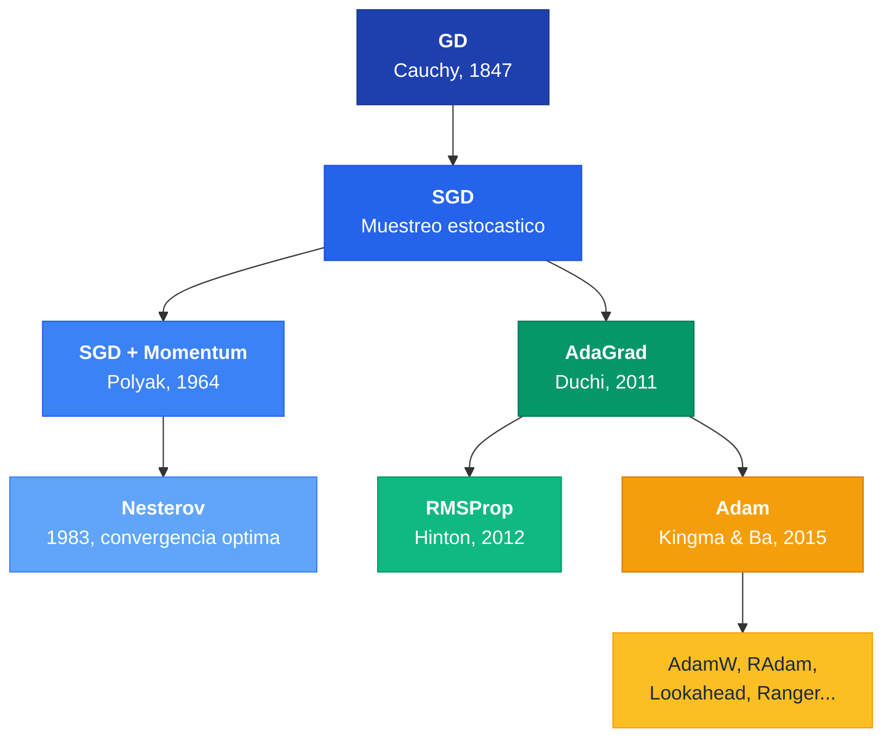
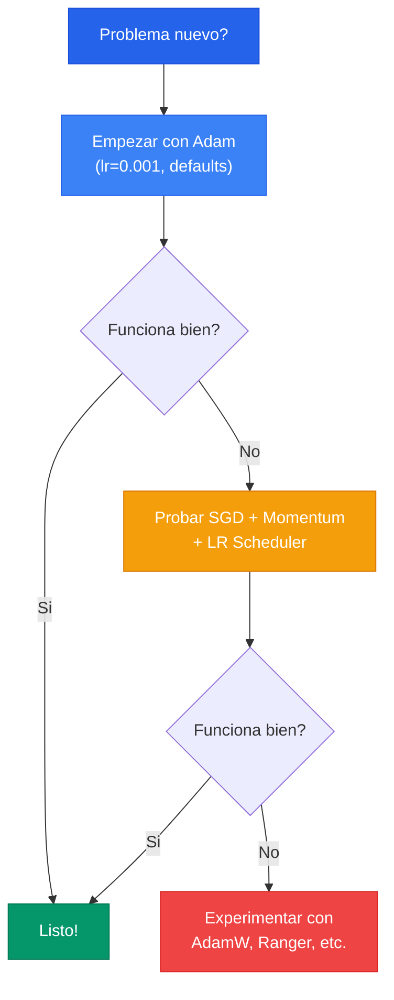

El optimizador es el algoritmo que **ajusta los pesos** de la red para minimizar la funcion de perdida. La historia de los optimizadores es una evolucion desde Gradient Descent (Cauchy, 1847) hasta Adam (Kingma & Ba, 2015), donde cada innovacion resuelve un problema concreto de su predecesor.

---

## 1. Gradient Descent (GD)

La regla de actualizacion fundamental:


w^{new} = w^{old} - \eta \frac{\partial L}{\partial w}


El signo negativo es crucial: nos movemos en la direccion **opuesta** al gradiente para descender hacia el minimo.

En GD clasico, el gradiente se calcula sobre **todo el dataset**:

$$L(W) = \sum_{n} \mathcal{L}(f(x_n), y_n; W) + \alpha \Omega(W)$$

**Problema:** Con datasets grandes, cada iteracion es computacionalmente prohibitiva.

---

## 2. SGD (Stochastic Gradient Descent)

SGD muestrea **mini-batches** en vez de usar todos los datos:

| Concepto | Definicion |
|---|---|
| **Epoca** | Un ciclo completo por todo el dataset |
| **Iteracion** | Una actualizacion usando un mini-batch |
| **Batch size** | Tamano del mini-batch |

La naturaleza estocastica introduce ruido, lo cual puede ser beneficioso: ayuda a **escapar de minimos locales** y saddle points.

**Problemas de SGD:** El gradiente depende solo del batch actual (alta variabilidad), puede quedar atascado en saddle points, y el learning rate es el mismo para todos los pesos.

---

## 3. SGD con Momentum

### Idea central

Momentum incorpora **historia**: mantiene la direccion de actualizaciones pasadas, como un objeto con inercia.


v_{t+1} = \rho \, v_t + \nabla f(x_t), \quad w_{t+1} = w_t - \eta \, v_{t+1}


Donde $\rho$ es el coeficiente de momentum (tipicamente 0.9).

### Efecto

- Gradientes en la misma direccion: momentum **amplifica** el paso
- Gradientes que cambian de direccion: momentum **amortigua** las oscilaciones

---

## 4. Nesterov Accelerated Gradient (NAG)

Nesterov es una variante "predictiva": primero se mueve en la direccion del momentum, luego calcula el gradiente desde esa posicion avanzada.


\begin{aligned}
w_t' &= w_t - \rho \, v_t & \text{(mirar adelante)} \\
v_{t+1} &= \rho \, v_t - \alpha \frac{\partial L}{\partial w_t'} & \text{(correccion)} \\
w_{t+1} &= w_t + v_{t+1} & \text{(update final)}
\end{aligned}


- **Momentum clasico**: bola ciega bajando un cerro
- **Nesterov**: esquiador que mira adelante para frenar antes de una curva

Nesterov logra la tasa de convergencia optima $O(1/k^2)$ para metodos de primer orden -- demostrado como cota inferior por Nemirovski y Yudin (1983).

---

## 5. AdaGrad (Adaptive Gradient)


**AdaGrad da a cada peso su propio learning rate**, que se adapta segun la historia acumulada de sus gradientes. Features poco frecuentes reciben pasos grandes; features frecuentes reciben pasos pequenos.


$$\eta_{w^i} = \frac{\eta}{\sqrt{\sum_{j=1}^{t} G_j^2}}, \quad w_t^i = w_{t-1}^i - \eta_{w^i} \frac{\partial L}{\partial w^i}$$

**Problema fatal:** El denominador $\sqrt{\sum G_j^2}$ siempre crece, el learning rate tiende a cero y el entrenamiento se detiene prematuramente.

---

## 6. RMSProp

Hinton (2012, Coursera -- nunca publicado formalmente) resolvio el problema de AdaGrad usando una **media movil exponencial** en lugar de una suma acumulativa:

$$E[g^2]_t = \rho \, E[g^2]_{t-1} + (1 - \rho) g_t^2$$

$$\theta_{t+1} = \theta_t - \frac{\eta}{\sqrt{E[g^2]_t + \epsilon}} g_t$$

La EMA da una ventana deslizante: el learning rate ya no decae a cero.

---

## 7. Adam (Adaptive Moment Estimation)

Adam combina lo mejor de Momentum (primer momento) y RMSProp (segundo momento):

**Primer momento** (media de gradientes = momentum):

$$r_t = \beta_1 \, r_{t-1} + (1 - \beta_1) g_t$$

**Segundo momento** (varianza de gradientes = adaptividad):

$$v_t = \beta_2 \, v_{t-1} + (1 - \beta_2) g_t^2$$

**Correccion de sesgo** (ambos estimadores parten de cero):

$$\hat{r}_t = \frac{r_t}{1 - \beta_1^t}, \quad \hat{v}_t = \frac{v_t}{1 - \beta_2^t}$$

**Actualizacion:**


w_t = w_{t-1} - \eta \frac{\hat{r}_t}{\sqrt{\hat{v}_t} + \epsilon}



**Adam es el optimizador por defecto en deep learning moderno.** Requiere pocos hiperparametros y los defaults ($\eta=0.001$, $\beta_1=0.9$, $\beta_2=0.999$, $\epsilon=10^{-8}$) funcionan bien en la mayoria de los casos.


---

## 8. Tabla Comparativa

| Optimizador | LR Adaptativo | Momentum | Ventaja principal | Desventaja |
|---|---|---|---|---|
| **GD** | No | No | Gradiente exacto | Muy lento con datasets grandes |
| **SGD** | No | No | Rapido por iteracion | Ruidoso, puede oscilar |
| **SGD + Momentum** | No | Si | Suaviza oscilaciones | Puede sobrepasar minimos |
| **Nesterov** | No | Si (predictivo) | Convergencia $O(1/k^2)$ | Mas complejo |
| **AdaGrad** | Si (por peso) | No | Adapta LR automaticamente | LR tiende a cero |
| **RMSProp** | Si (por peso) | No | Resuelve problema de AdaGrad | Sin correccion de sesgo |
| **Adam** | Si (por peso) | Si | Robusto, pocos hiperparametros | Puede generalizar peor que SGD |

---

## 9. Arbol Evolutivo

---

## 10. Flujo de Decision


**No hay optimizador universalmente mejor.** La arquitectura y la tarea importan mas: CNNs en vision suelen preferir SGD + Momentum; Transformers/NLP requieren Adam/AdamW.


---

## Para Profundizar

- [Clase 10 - Optimizacion y Learning Rate](/clases/clase-10/) -- Formulas completas, ejemplos numericos, papers modernos
- [Clase 10 - Historia Matematica](/clases/clase-10/historia-matematica/) -- De Cauchy (1847) a Adam (2015)
- [Paper: Adam (Kingma & Ba, 2015)](/papers/adam-kingma-2015/)
- [Paper: Lookahead (Zhang et al., 2019)](/papers/lookahead-zhang-2019/)
