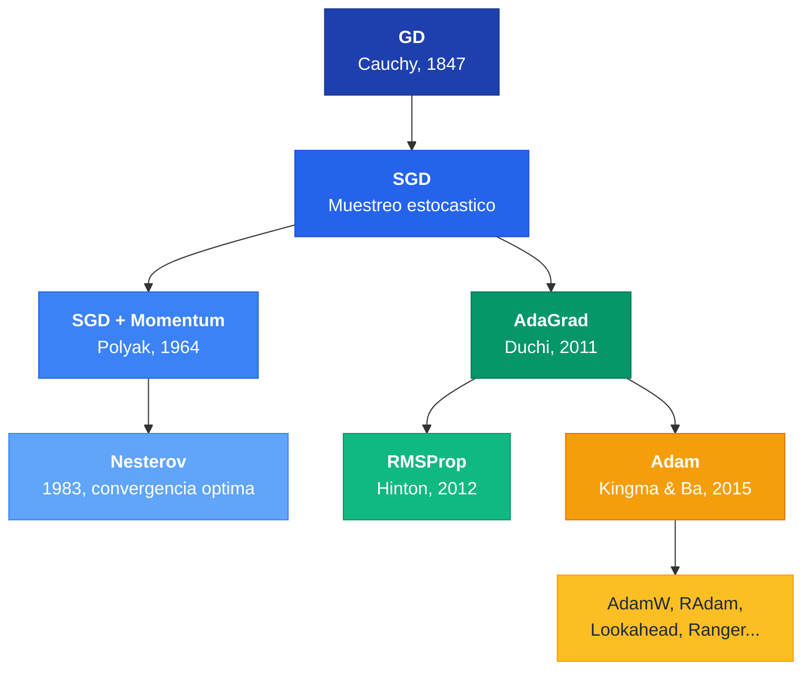
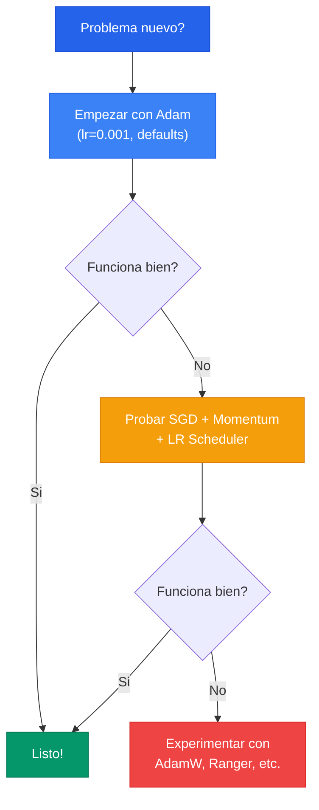

El optimizador es el algoritmo que **ajusta los pesos** de la red para minimizar la funcion de perdida. La historia de los optimizadores es una evolucion desde Gradient Descent (Cauchy, 1847) hasta Adam (Kingma & Ba, 2015), donde cada innovacion resuelve un problema concreto de su predecesor.

---

## 1. Gradient Descent (GD)

La regla de actualizacion fundamental:


w^{new} = w^{old} - \eta \frac{\partial L}{\partial w}


El signo negativo es crucial: nos movemos en la direccion **opuesta** al gradiente para descender hacia el minimo.

En GD clasico, el gradiente se calcula sobre **todo el dataset**:

$$L(W) = \sum_{n} \mathcal{L}(f(x_n), y_n; W) + \alpha \Omega(W)$$

**Problema:** Con datasets grandes, cada iteracion es computacionalmente prohibitiva.

---

## 2. SGD (Stochastic Gradient Descent)

SGD muestrea **mini-batches** en vez de usar todos los datos:

| Concepto | Definicion |
|---|---|
| **Epoca** | Un ciclo completo por todo el dataset |
| **Iteracion** | Una actualizacion usando un mini-batch |
| **Batch size** | Tamano del mini-batch |

La naturaleza estocastica introduce ruido, lo cual puede ser beneficioso: ayuda a **escapar de minimos locales** y saddle points.

**Problemas de SGD:** El gradiente depende solo del batch actual (alta variabilidad), puede quedar atascado en saddle points, y el learning rate es el mismo para todos los pesos.



```python
import torch
import torch.nn as nn

# Definir modelo simple
modelo = nn.Linear(10, 1)

# SGD basico con learning rate 0.01
optimizador = torch.optim.SGD(modelo.parameters(), lr=0.01)

# Paso de entrenamiento
salida = modelo(torch.randn(32, 10))
perdida = nn.MSELoss()(salida, torch.randn(32, 1))
perdida.backward()
optimizador.step()       # Actualizar pesos
optimizador.zero_grad()  # Limpiar gradientes
```


```python
import tensorflow as tf

# SGD basico con learning rate 0.01
optimizador = tf.keras.optimizers.SGD(learning_rate=0.01)

# Definir y compilar modelo simple
modelo = tf.keras.layers.Dense(1, input_shape=(10,))
modelo = tf.keras.Sequential([modelo])
modelo.compile(optimizer=optimizador, loss='mse')

# Paso de entrenamiento
x = tf.random.normal((32, 10))
y = tf.random.normal((32, 1))
modelo.fit(x, y, epochs=1, verbose=0)
```


```python
import jax
import jax.numpy as jnp
import optax

# SGD basico con learning rate 0.01
optimizador = optax.sgd(learning_rate=0.01)

# Inicializar parametros y estado del optimizador
parametros = {'w': jnp.zeros((10, 1)), 'b': jnp.zeros((1,))}
estado_opt = optimizador.init(parametros)

# Calcular gradientes y actualizar (ejemplo conceptual)
gradientes = jax.tree.map(jnp.ones_like, parametros)
actualizaciones, estado_opt = optimizador.update(gradientes, estado_opt)
parametros = optax.apply_updates(parametros, actualizaciones)
```



---

## 3. SGD con Momentum

### Idea central

Momentum incorpora **historia**: mantiene la direccion de actualizaciones pasadas, como un objeto con inercia.


v_{t+1} = \rho \, v_t + \nabla f(x_t), \quad w_{t+1} = w_t - \eta \, v_{t+1}


Donde $\rho$ es el coeficiente de momentum (tipicamente 0.9).

### Efecto

- Gradientes en la misma direccion: momentum **amplifica** el paso
- Gradientes que cambian de direccion: momentum **amortigua** las oscilaciones



```python
import torch
import torch.nn as nn

modelo = nn.Sequential(nn.Linear(10, 32), nn.ReLU(), nn.Linear(32, 1))

# SGD con momentum=0.9 (valor tipico)
optimizador = torch.optim.SGD(modelo.parameters(), lr=0.01, momentum=0.9)

# Entrenamiento con momentum acumulado
for epoca in range(100):
    salida = modelo(torch.randn(64, 10))
    perdida = nn.MSELoss()(salida, torch.randn(64, 1))
    optimizador.zero_grad()
    perdida.backward()
    optimizador.step()  # El momentum suaviza las actualizaciones
```


```python
import tensorflow as tf

# SGD con momentum=0.9
optimizador = tf.keras.optimizers.SGD(learning_rate=0.01, momentum=0.9)

modelo = tf.keras.Sequential([
    tf.keras.layers.Dense(32, activation='relu', input_shape=(10,)),
    tf.keras.layers.Dense(1)
])
modelo.compile(optimizer=optimizador, loss='mse')

# El momentum acumula velocidad durante el entrenamiento
modelo.fit(tf.random.normal((200, 10)), tf.random.normal((200, 1)),
           epochs=100, verbose=0)
```


```python
import jax
import jax.numpy as jnp
import optax

# SGD con momentum=0.9
optimizador = optax.sgd(learning_rate=0.01, momentum=0.9)

# Inicializar parametros y estado (incluye buffer de velocidad)
parametros = {'w': jnp.zeros((10, 1))}
estado_opt = optimizador.init(parametros)

# Cada update acumula momentum internamente
gradientes = jax.tree.map(jnp.ones_like, parametros)
actualizaciones, estado_opt = optimizador.update(gradientes, estado_opt)
parametros = optax.apply_updates(parametros, actualizaciones)
```



---

## 4. Nesterov Accelerated Gradient (NAG)

Nesterov es una variante "predictiva": primero se mueve en la direccion del momentum, luego calcula el gradiente desde esa posicion avanzada.


\begin{aligned}
w_t' &= w_t - \rho \, v_t & \text{(mirar adelante)} \\
v_{t+1} &= \rho \, v_t - \alpha \frac{\partial L}{\partial w_t'} & \text{(correccion)} \\
w_{t+1} &= w_t + v_{t+1} & \text{(update final)}
\end{aligned}


- **Momentum clasico**: bola ciega bajando un cerro
- **Nesterov**: esquiador que mira adelante para frenar antes de una curva

Nesterov logra la tasa de convergencia optima $O(1/k^2)$ para metodos de primer orden -- demostrado como cota inferior por Nemirovski y Yudin (1983).

---

## 5. AdaGrad (Adaptive Gradient)


**AdaGrad da a cada peso su propio learning rate**, que se adapta segun la historia acumulada de sus gradientes. Features poco frecuentes reciben pasos grandes; features frecuentes reciben pasos pequenos.


$$\eta_{w^i} = \frac{\eta}{\sqrt{\sum_{j=1}^{t} G_j^2}}, \quad w_t^i = w_{t-1}^i - \eta_{w^i} \frac{\partial L}{\partial w^i}$$

**Problema fatal:** El denominador $\sqrt{\sum G_j^2}$ siempre crece, el learning rate tiende a cero y el entrenamiento se detiene prematuramente.

---

## 6. RMSProp

Hinton (2012, Coursera -- nunca publicado formalmente) resolvio el problema de AdaGrad usando una **media movil exponencial** en lugar de una suma acumulativa:

$$E[g^2]_t = \rho \, E[g^2]_{t-1} + (1 - \rho) g_t^2$$

$$\theta_{t+1} = \theta_t - \frac{\eta}{\sqrt{E[g^2]_t + \epsilon}} g_t$$

La EMA da una ventana deslizante: el learning rate ya no decae a cero.

---

## 7. Adam (Adaptive Moment Estimation)

Adam combina lo mejor de Momentum (primer momento) y RMSProp (segundo momento):

**Primer momento** (media de gradientes = momentum):

$$r_t = \beta_1 \, r_{t-1} + (1 - \beta_1) g_t$$

**Segundo momento** (varianza de gradientes = adaptividad):

$$v_t = \beta_2 \, v_{t-1} + (1 - \beta_2) g_t^2$$

**Correccion de sesgo** (ambos estimadores parten de cero):

$$\hat{r}_t = \frac{r_t}{1 - \beta_1^t}, \quad \hat{v}_t = \frac{v_t}{1 - \beta_2^t}$$

**Actualizacion:**


w_t = w_{t-1} - \eta \frac{\hat{r}_t}{\sqrt{\hat{v}_t} + \epsilon}



**Adam es el optimizador por defecto en deep learning moderno.** Requiere pocos hiperparametros y los defaults ($\eta=0.001$, $\beta_1=0.9$, $\beta_2=0.999$, $\epsilon=10^{-8}$) funcionan bien en la mayoria de los casos.




```python
import torch
import torch.nn as nn

modelo = nn.Sequential(nn.Linear(10, 64), nn.ReLU(), nn.Linear(64, 1))

# Adam con hiperparametros tipicos (defaults recomendados)
optimizador = torch.optim.Adam(
    modelo.parameters(),
    lr=0.001,         # Learning rate
    betas=(0.9, 0.999),  # Coeficientes de momento 1 y 2
    eps=1e-8          # Estabilidad numerica
)

# Bucle de entrenamiento
for epoca in range(100):
    salida = modelo(torch.randn(64, 10))
    perdida = nn.MSELoss()(salida, torch.randn(64, 1))
    optimizador.zero_grad()
    perdida.backward()
    optimizador.step()
```


```python
import tensorflow as tf

# Adam con hiperparametros tipicos
optimizador = tf.keras.optimizers.Adam(
    learning_rate=0.001,
    beta_1=0.9,       # Media movil del primer momento
    beta_2=0.999,     # Media movil del segundo momento
    epsilon=1e-8      # Estabilidad numerica
)

modelo = tf.keras.Sequential([
    tf.keras.layers.Dense(64, activation='relu', input_shape=(10,)),
    tf.keras.layers.Dense(1)
])
modelo.compile(optimizer=optimizador, loss='mse')
modelo.fit(tf.random.normal((200, 10)), tf.random.normal((200, 1)),
           epochs=100, verbose=0)
```


```python
import jax
import jax.numpy as jnp
import optax

# Adam con hiperparametros tipicos
optimizador = optax.adam(
    learning_rate=0.001,
    b1=0.9,    # Decaimiento del primer momento
    b2=0.999,  # Decaimiento del segundo momento
    eps=1e-8   # Estabilidad numerica
)

parametros = {'w1': jnp.zeros((10, 64)), 'w2': jnp.zeros((64, 1))}
estado_opt = optimizador.init(parametros)

# Adam mantiene internamente las medias moviles de momentos
gradientes = jax.tree.map(jnp.ones_like, parametros)
actualizaciones, estado_opt = optimizador.update(gradientes, estado_opt)
parametros = optax.apply_updates(parametros, actualizaciones)
```



---

## 8. Tabla Comparativa

| Optimizador | LR Adaptativo | Momentum | Ventaja principal | Desventaja |
|---|---|---|---|---|
| **GD** | No | No | Gradiente exacto | Muy lento con datasets grandes |
| **SGD** | No | No | Rapido por iteracion | Ruidoso, puede oscilar |
| **SGD + Momentum** | No | Si | Suaviza oscilaciones | Puede sobrepasar minimos |
| **Nesterov** | No | Si (predictivo) | Convergencia $O(1/k^2)$ | Mas complejo |
| **AdaGrad** | Si (por peso) | No | Adapta LR automaticamente | LR tiende a cero |
| **RMSProp** | Si (por peso) | No | Resuelve problema de AdaGrad | Sin correccion de sesgo |
| **Adam** | Si (por peso) | Si | Robusto, pocos hiperparametros | Puede generalizar peor que SGD |

---

## 9. Arbol Evolutivo



---

## 10. Flujo de Decision




**No hay optimizador universalmente mejor.** La arquitectura y la tarea importan mas: CNNs en vision suelen preferir SGD + Momentum; Transformers/NLP requieren Adam/AdamW.




```python
import torch
import torch.nn as nn

# Problema simple: aproximar y = 2x + 3
torch.manual_seed(42)
x = torch.linspace(-5, 5, 200).unsqueeze(1)
y = 2 * x + 3 + torch.randn_like(x) * 0.5

# Crear dos modelos identicos para comparar
modelo_sgd = nn.Sequential(nn.Linear(1, 16), nn.ReLU(), nn.Linear(16, 1))
modelo_adam = nn.Sequential(nn.Linear(1, 16), nn.ReLU(), nn.Linear(16, 1))
modelo_adam.load_state_dict(modelo_sgd.state_dict())  # Mismos pesos iniciales

opt_sgd = torch.optim.SGD(modelo_sgd.parameters(), lr=0.01, momentum=0.9)
opt_adam = torch.optim.Adam(modelo_adam.parameters(), lr=0.001)
criterio = nn.MSELoss()

# Entrenar ambos y comparar convergencia
for epoca in range(200):
    for modelo, opt, nombre in [(modelo_sgd, opt_sgd, "SGD"),
                                 (modelo_adam, opt_adam, "Adam")]:
        pred = modelo(x)
        perdida = criterio(pred, y)
        opt.zero_grad()
        perdida.backward()
        opt.step()

    if (epoca + 1) % 50 == 0:
        loss_sgd = criterio(modelo_sgd(x), y).item()
        loss_adam = criterio(modelo_adam(x), y).item()
        print(f"Epoca {epoca+1:3d} | SGD: {loss_sgd:.4f} | Adam: {loss_adam:.4f}")
# Adam tipicamente converge mas rapido en las primeras epocas
```


```python
import tensorflow as tf
import numpy as np

# Problema simple: aproximar y = 2x + 3
np.random.seed(42)
x = np.linspace(-5, 5, 200).reshape(-1, 1).astype(np.float32)
y = (2 * x + 3 + np.random.randn(*x.shape) * 0.5).astype(np.float32)

# Funcion para crear modelo con pesos reproducibles
def crear_modelo():
    tf.random.set_seed(42)
    return tf.keras.Sequential([
        tf.keras.layers.Dense(16, activation='relu', input_shape=(1,)),
        tf.keras.layers.Dense(1)
    ])

# Comparar SGD vs Adam
resultados = {}
for nombre, opt in [("SGD+Momentum", tf.keras.optimizers.SGD(0.01, momentum=0.9)),
                     ("Adam", tf.keras.optimizers.Adam(0.001))]:
    modelo = crear_modelo()
    modelo.compile(optimizer=opt, loss='mse')
    hist = modelo.fit(x, y, epochs=200, verbose=0)
    resultados[nombre] = hist.history['loss']
    print(f"{nombre:>12s} | Loss final: {hist.history['loss'][-1]:.4f}")

# Comparar perdida cada 50 epocas
for epoca in [49, 99, 149, 199]:
    sgd_l = resultados["SGD+Momentum"][epoca]
    adam_l = resultados["Adam"][epoca]
    print(f"Epoca {epoca+1:3d} | SGD: {sgd_l:.4f} | Adam: {adam_l:.4f}")
```


```python
import jax
import jax.numpy as jnp
import optax

# Problema simple: aproximar y = 2x + 3
key = jax.random.PRNGKey(42)
x = jnp.linspace(-5, 5, 200).reshape(-1, 1)
y = 2 * x + 3 + jax.random.normal(key, x.shape) * 0.5

# Modelo lineal simple: y = Wx + b
def predecir(params, x):
    return x @ params['w'] + params['b']

def perdida_fn(params, x, y):
    return jnp.mean((predecir(params, x) - y) ** 2)

# Inicializar mismos parametros para ambos
params_init = {'w': jnp.array([[0.1]]), 'b': jnp.array([0.0])}
grad_fn = jax.grad(perdida_fn)

# Comparar SGD con momentum vs Adam
for nombre, optimizador in [("SGD+Mom", optax.sgd(0.01, momentum=0.9)),
                             ("Adam", optax.adam(0.001))]:
    params = params_init.copy()
    estado = optimizador.init(params)

    for epoca in range(200):
        grads = grad_fn(params, x, y)
        updates, estado = optimizador.update(grads, estado)
        params = optax.apply_updates(params, updates)

        if (epoca + 1) % 50 == 0:
            loss = perdida_fn(params, x, y)
            print(f"{nombre:>7s} | Epoca {epoca+1:3d} | Loss: {loss:.4f}")
```



---

## Para Profundizar

- [Clase 10 - Optimizacion y Learning Rate](/clases/clase-10/) -- Formulas completas, ejemplos numericos, papers modernos
- [Clase 10 - Historia Matematica](/clases/clase-10/historia-matematica/) -- De Cauchy (1847) a Adam (2015)
- [Paper: Adam (Kingma & Ba, 2015)](/papers/adam-kingma-2015/)
- [Paper: Lookahead (Zhang et al., 2019)](/papers/lookahead-zhang-2019/)
