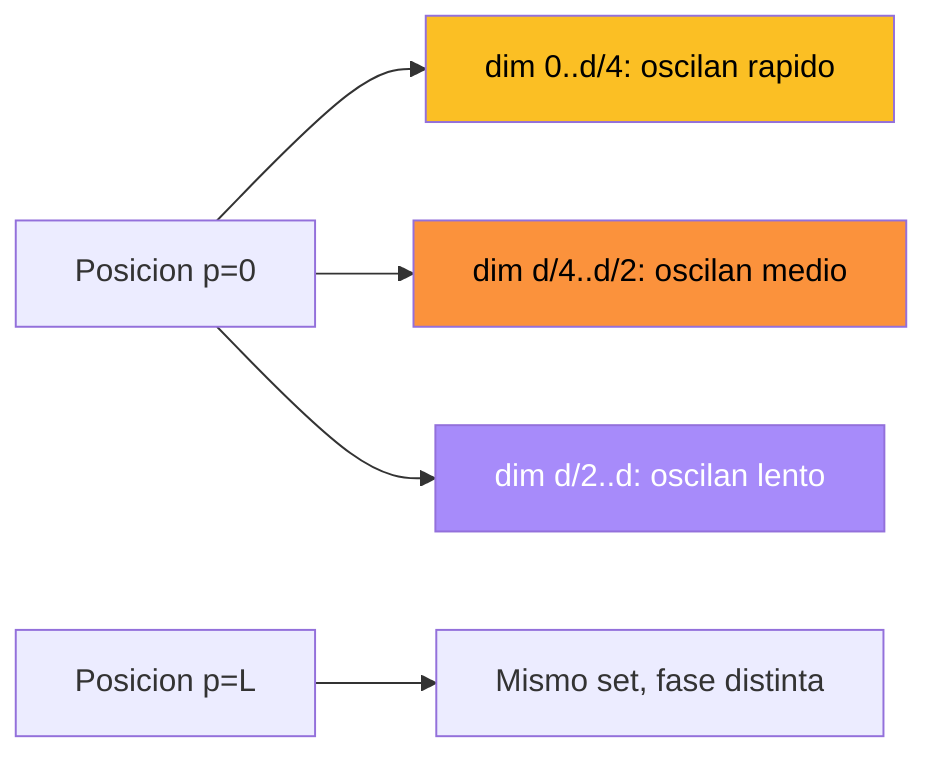
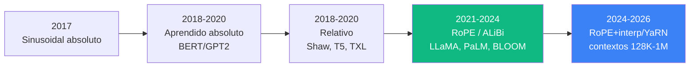

El **positional encoding** es el mecanismo que inyecta informacion de **orden** en los embeddings de un Transformer. Sin el, el modelo seria incapaz de distinguir "el perro mordio al hombre" de "el hombre mordio al perro": para self-attention, ambas oraciones son **idénticas**.

Este fundamento revisa el diseno original sinusoidal de Vaswani et al. (2017), las alternativas aprendidas usadas en BERT/GPT, y las variantes modernas (relativos, **RoPE**, **ALiBi**) que dominan los LLMs de 2024-2026.

---

## 1. Motivacion: Self-Attention es Permutation Invariant

La operacion central del Transformer es:

$$\text{Attention}(Q, K, V) = \text{softmax}\left(\frac{QK^T}{\sqrt{d_k}}\right) V$$

Si permutamos las filas de $X$ (la matriz de embeddings de entrada), las matrices $Q, K, V = XW^Q, XW^K, XW^V$ se permutan de la misma manera, y el output sale permutado en consecuencia. **No hay ninguna senal de orden**.

Concretamente, considerar:

| Oracion A | Oracion B |
|---|---|
| el perro mordio al hombre | el hombre mordio al perro |

Las dos contienen exactamente los mismos tokens. Para una capa de self-attention pura, sus representaciones internas serian permutaciones de las mismas, y un clasificador (por ej. de sentimiento) que use la suma o el promedio de las posiciones, las trataria como **iguales**. Esto es catastrofico para cualquier tarea de lenguaje natural.


Self-attention es **permutation-equivariant**: si permutas la entrada, sale la salida permutada. Por eso necesitamos una senal explicita de posicion. La solucion estandar: **inyectar un vector $PE(p)$ que codifique la posicion $p$**, sumado al token embedding antes de la primera capa.


A diferencia de las RNNs (donde la posicion emerge de la recurrencia temporal) y las CNNs (donde la posicion emerge del kernel local + stride), el Transformer es **agnostico al orden por construccion**. Hay que dárselo de afuera.

---

## 2. Diseno Deseado

Un buen positional encoding deberia satisfacer:

1. **Unicidad**: cada posicion $p$ tiene un encoding distinto $PE(p) \neq PE(p')$ para $p \neq p'$.
2. **Generalizacion a longitudes mayores**: durante inferencia, queremos manejar secuencias mas largas que las vistas en entrenamiento (extrapolacion).
3. **Distancias relativas**: el modelo deberia poder computar facilmente "estoy 5 tokens antes de aquel" -- los offsets son una senal lingüistica clave.
4. **Diferenciable o constante**: si es aprendido debe ser entrenable; si es fijo no agrega parametros.
5. **Dimensionalidad razonable**: idealmente $d_{model}$ (igual al embedding), no mas.
6. **Numericamente estable**: valores acotados, sin explotar para $p$ grande.

Estos criterios entran en tension. Sinusoidal cumple 1, 2, 3, 5 y 6 a costa de no ser entrenable. Los aprendidos cumplen 4 pero fallan en 2. Las variantes relativas y RoPE intentan combinar lo mejor de ambos.

---

## 3. Encoding Sinusoidal (Vaswani et al. 2017)

La propuesta original del paper **Attention Is All You Need**: un mapeo deterministico de la posicion a un vector de dimension $d_{model}$, usando senos y cosenos de frecuencias geometricamente espaciadas.

$$PE(p, 2i) = \sin\left(\frac{p}{10000^{2i/d_{model}}}\right)$$

$$PE(p, 2i+1) = \cos\left(\frac{p}{10000^{2i/d_{model}}}\right)$$

Donde:
- $p \in \{0, 1, 2, \ldots\}$: la posicion absoluta del token en la secuencia.
- $i \in \{0, 1, \ldots, d_{model}/2 - 1\}$: el indice del par de dimensiones.
- $d_{model}$: la dimension del embedding (ej. 512 en el paper original).
- La constante $10000$ controla el rango de longitudes de onda.

Cada par de dimensiones $(2i, 2i+1)$ es una sinusoide con **longitud de onda**:

$$\lambda_i = 2\pi \cdot 10000^{2i/d_{model}}$$

Para $i = 0$: $\lambda_0 = 2\pi$ (oscila rapido, una rotacion completa cada ~6 posiciones).
Para $i = d_{model}/2$: $\lambda_{max} = 10000 \cdot 2\pi \approx 62832$ (oscila lentamente).

Es decir, las **dimensiones bajas** capturan posicion fina (proximidad inmediata), y las **dimensiones altas** capturan posicion gruesa (region en la oracion). Una pluralidad de escalas, por construccion.

---

## 4. Por Que Sin/Cos Juntos: Linealidad de Offsets

La razon **no trivial** por la que Vaswani usa pares $(\sin, \cos)$ es la siguiente propiedad: para cualquier offset fijo $k$, $PE(p+k)$ se puede expresar como una **combinacion lineal de $PE(p)$**.

Demostracion. Para una dimension dada con frecuencia $\omega_i = 10000^{-2i/d_{model}}$:

$$\sin(\omega_i (p + k)) = \sin(\omega_i p)\cos(\omega_i k) + \cos(\omega_i p)\sin(\omega_i k)$$

$$\cos(\omega_i (p + k)) = \cos(\omega_i p)\cos(\omega_i k) - \sin(\omega_i p)\sin(\omega_i k)$$

En forma matricial:

$$\begin{pmatrix} PE(p+k, 2i) \\ PE(p+k, 2i+1) \end{pmatrix} = \begin{pmatrix} \cos(\omega_i k) & \sin(\omega_i k) \\ -\sin(\omega_i k) & \cos(\omega_i k) \end{pmatrix} \begin{pmatrix} PE(p, 2i) \\ PE(p, 2i+1) \end{pmatrix}$$

La matriz de transformacion **depende solo de $k$, no de $p$**. Esto significa que el modelo puede aprender un set de transformaciones lineales que codifican "moverse $k$ posiciones a la derecha", **independiente de donde estamos**. Esa es la base teorica de por que el Transformer captura **patrones relativos** aunque solo le inyectemos posicion absoluta.

---

## 5. Visualizacion del Encoding

Imaginar un heatmap de la matriz $PE$ de tamano $L \times d_{model}$, con posicion en filas y dimension en columnas:



Caracteristicas observables:

- Las **primeras columnas** (dimensiones bajas) cambian de signo cada pocas posiciones -- alta frecuencia.
- Las **ultimas columnas** (dimensiones altas) varian suavemente a lo largo de toda la secuencia -- baja frecuencia.
- El **producto punto** $PE(p) \cdot PE(p+k)$ depende casi exclusivamente de $k$ y decae suavemente con $|k|$. Es la senal que el modelo usa para inferir distancia relativa via attention.

Esta similitud al esquema de **codificacion binaria multi-escala** no es casual: representar enteros con una mezcla de bits de bajo y alto orden es robusto y permite distancias bien definidas.

---

## 6. Inyeccion: Suma vs Concatenacion

El positional encoding se **suma** al token embedding antes de la primera capa:

$$x_p = E(\text{token}_p) + PE(p)$$

Donde $E$ es la tabla de embeddings de tokens. Ambos vectores tienen dimension $d_{model}$.

**Por que suma y no concatenacion**:

| Aspecto | Suma | Concatenacion |
|---|---|---|
| Dimension resultante | $d_{model}$ | $d_{model} + d_{pos}$ |
| Costo en parametros | 0 extra | Aumenta $W^Q, W^K, W^V$ |
| Flexibilidad | El modelo aprende, via $W^Q,W^K,W^V$, qué dimensiones priorizan posicion vs contenido | Rígido: dimensiones de posicion son fijas |
| Subespacios | El subespacio $\text{span}(E)$ y $\text{span}(PE)$ pueden ser **casi ortogonales** en alta dim, asi suma ≈ concat efectivo | -- |

En alta dimension, dos vectores aleatorios son casi ortogonales (concentracion de la medida en la esfera). Por eso en la practica, sumar un encoding $PE$ pre-fijado al embedding de token **no destruye la informacion del token**: el modelo aprende a proyectar selectivamente cada subespacio donde lo necesita.

---

## 7. Encodings Aprendidos

Una alternativa simple: en vez de fijar $PE$ con sinusoides, dejar que sea una matriz de **embeddings entrenable**:

$$PE \in \mathbb{R}^{L_{max} \times d_{model}}$$

Inicializada aleatoriamente y aprendida por SGD junto con el resto del modelo. Cada fila $PE[p]$ es el embedding aprendido para la posicion $p$. Se suma al token embedding igual que antes.

**Quien lo usa**: BERT, GPT-2, GPT-3, RoBERTa, ViT (en la mayoria de configs). Todos los modelos pre-LLaMA "grandes" usan posicion aprendida.

**Pros**:
- El modelo puede ajustar el encoding a la distribucion de sus datos -- no esta atado a una eleccion arbitraria de longitudes de onda.
- Implementacion trivial: es un `nn.Embedding(L_max, d_model)`.
- Empiricamente competitivo o ligeramente mejor que sinusoidal en benchmarks dentro del rango de longitudes vistas.

**Contras**:
- **No extrapola**: si entrenaste con $L_{max} = 512$ (BERT), no podes correr el modelo en secuencias de 1024 tokens sin re-entrenar el bloque de positional embeddings.
- **Costo en parametros**: $L_{max} \cdot d_{model}$. Con $L_{max} = 4096, d = 4096$ son ~16M parametros solo para posicion (manejable, pero no gratis).
- No hay garantia de que las distancias relativas se codifiquen de forma consistente: el modelo descubre lo que funciona para sus datos.

---

## 8. Encodings Relativos (Shaw et al. 2018, T5)

Insight de Shaw et al. 2018: en muchas tareas, lo que importa es la **diferencia** $r_{ij} = i - j$ entre tokens, no su posicion absoluta. Inyectar posicion relativa **directamente en el calculo de attention** es mas natural.

### 8.1 Formulacion (Shaw 2018)

Score modificado:

$$e_{ij} = \frac{(x_i W^Q)(x_j W^K + a_{ij}^K)^T}{\sqrt{d_k}}$$

donde $a_{ij}^K \in \mathbb{R}^{d_k}$ es un sesgo aprendido que depende **solo del desplazamiento relativo** $r = i - j$. Se mantiene una tabla pequena $a^K[-K, \ldots, +K]$ con clipping para offsets grandes.

Tambien se modifica el value:

$$z_i = \sum_j \alpha_{ij} (x_j W^V + a_{ij}^V)$$

### 8.2 T5 (Raffel et al. 2020)

Simplifica aun mas: en vez de modificar $K, V$, agrega un **bias escalar aprendido por par (relative bucket, head)** directamente al score logit:

$$e_{ij} = \frac{(x_i W^Q)(x_j W^K)^T}{\sqrt{d_k}} + b_{\text{bucket}(i-j), h}$$

Los desplazamientos se agrupan en buckets logaritmicos (los desplazamientos cercanos tienen su propio bucket; los lejanos comparten buckets). Notable porque T5 **no usa positional encoding aditivo** en el embedding -- toda la informacion de posicion vive en el bias de attention.

**Usado por**: T5, Transformer-XL, mT5.

---

## 9. RoPE: Rotary Position Embeddings (Su et al. 2021)

**RoPE** es la familia dominante en LLMs modernos: LLaMA-1/2/3, PaLM, GPT-NeoX, Falcon, Qwen, Mistral. La idea es elegante: en vez de **sumar** un vector de posicion, **rotar** las queries y keys en planos 2D segun la posicion.

### 9.1 Formulacion

Para cada par de dimensiones $(2i, 2i+1)$ y posicion $p$, se aplica una rotacion 2D:

$$\begin{pmatrix} \tilde q_{p, 2i} \\ \tilde q_{p, 2i+1} \end{pmatrix} = \begin{pmatrix} \cos(p\theta_i) & -\sin(p\theta_i) \\ \sin(p\theta_i) & \cos(p\theta_i) \end{pmatrix} \begin{pmatrix} q_{p, 2i} \\ q_{p, 2i+1} \end{pmatrix}$$

Con frecuencias geometricas:

$$\theta_i = 10000^{-2i/d}$$

(igual base que sinusoidal). La misma rotacion se aplica a $K$, **no** a $V$.

### 9.2 Propiedad Clave

El producto punto entre query rotada en posicion $p$ y key rotada en posicion $q$:

$$\tilde q_p \cdot \tilde k_q = \text{Re}\left[\sum_i (q_{p,2i} + i \cdot q_{p,2i+1})(k_{q,2i} - i \cdot k_{q,2i+1}) e^{i(p-q)\theta_i}\right]$$

depende de $p$ y $q$ **solo a traves de su diferencia $p - q$**. RoPE codifica posicion **absoluta** en cada token pero produce attention scores que solo dependen de la **posicion relativa**. Lo mejor de los dos mundos.

### 9.3 Ventajas Practicas

- **Extrapolacion**: $p$ puede ser arbitrario, no hay $L_{max}$ -- aunque en la practica el rendimiento degrada gradualmente fuera del rango de entrenamiento. **Position interpolation** (Chen et al. 2023) y **YaRN** (Peng et al. 2023) extienden RoPE a contextos 4-32x mas largos sin re-entrenamiento extensivo.
- **Sin parametros**: $\theta_i$ es deterministico.
- **Multiplicativo en el subespacio Q,K**: no contamina el residual stream con senal de posicion.
- **Implementable eficientemente**: la rotacion 2D se computa en bloques.

Es por estas razones que RoPE es **la opcion default en los LLMs de codigo abierto de 2024-2026**.

---

## 10. ALiBi: Attention with Linear Biases (Press et al. 2021)

**ALiBi** ataca el problema de la extrapolacion desde otro angulo: **no usar positional encoding en absoluto** en los embeddings, y simplemente penalizar el score de attention proporcional a la distancia:

$$\text{score}_{ij} = q_i k_j^T - m_h \cdot |i - j|$$

donde $m_h$ es una constante **pre-fijada por cabeza de attention**. Las pendientes $m_h$ se eligen como una progresion geometrica decreciente -- algunas cabezas se enfocan a corto plazo (pendiente alta), otras tienen vista larga (pendiente baja).

**Pros**:
- **Cero parametros** entrenables para posicion.
- **Extrapolacion gratuita**: el sesgo lineal es bien definido para cualquier $|i-j|$.
- Mas simple de implementar que RoPE.

**Contras**:
- Menos flexible que RoPE para patrones no-monotonicos en distancia.
- Empiricamente, RoPE supera a ALiBi en perplexity en escala grande -- por eso la mayoria de LLMs SOTA prefieren RoPE.

**Usado por**: BLOOM, MPT, parte de la familia Falcon.

---

## 11. Comparacion

| Tipo | Params | Extrapola | Captura relatividad | Donde se inyecta | Usado por |
|---|---|---|---|---|---|
| Sinusoidal (absoluto) | 0 | si (teorico) | indirectamente | embedding (suma) | Vaswani 2017 |
| Aprendido (absoluto) | $L_{max} \cdot d$ | no | no | embedding (suma) | BERT, GPT-2/3, ViT |
| Relativo (Shaw) | $O(d)$ | parcial | si | attention (Q,K,V) | Transformer-XL |
| Relativo (T5 bias) | $O(\text{buckets} \cdot H)$ | parcial | si | attention (logits) | T5, mT5 |
| RoPE | 0 | si (con interp.) | si | attention (Q,K rotacion) | LLaMA, PaLM, Qwen, Mistral |
| ALiBi | 0 | si | si (lineal) | attention (logits) | BLOOM, MPT |

Tendencia historica:



---

## 12. Implementacion



```python
import torch
import torch.nn as nn

def sinusoidal_positional_encoding(seq_len: int, d_model: int) -> torch.Tensor:
    """Devuelve PE de shape (seq_len, d_model) determinista."""
    pe = torch.zeros(seq_len, d_model)
    position = torch.arange(0, seq_len).unsqueeze(1).float()
    div_term = torch.exp(torch.arange(0, d_model, 2).float() *
                         -(torch.log(torch.tensor(10000.0)) / d_model))
    pe[:, 0::2] = torch.sin(position * div_term)
    pe[:, 1::2] = torch.cos(position * div_term)
    return pe


class LearnedPositionalEmbedding(nn.Module):
    def __init__(self, max_len: int, d_model: int):
        super().__init__()
        self.pe = nn.Embedding(max_len, d_model)

    def forward(self, x: torch.Tensor) -> torch.Tensor:
        # x: (batch, seq_len, d_model)
        seq_len = x.size(1)
        positions = torch.arange(seq_len, device=x.device)
        return x + self.pe(positions).unsqueeze(0)


def precompute_rope_freqs(dim: int, max_len: int, base: float = 10000.0):
    """freqs_cis: (max_len, dim/2) en complejos."""
    freqs = 1.0 / (base ** (torch.arange(0, dim, 2).float() / dim))
    t = torch.arange(max_len).float()
    freqs = torch.outer(t, freqs)            # (max_len, dim/2)
    return torch.polar(torch.ones_like(freqs), freqs)  # complejos unitarios


def apply_rope(x: torch.Tensor, freqs_cis: torch.Tensor) -> torch.Tensor:
    """x: (batch, seq, heads, head_dim). Aplica rotacion RoPE."""
    x_complex = torch.view_as_complex(
        x.float().reshape(*x.shape[:-1], -1, 2)
    )
    freqs_cis = freqs_cis[: x.size(1)].unsqueeze(0).unsqueeze(2)
    x_rotated = torch.view_as_real(x_complex * freqs_cis).flatten(-2)
    return x_rotated.type_as(x)
```


```python
import jax.numpy as jnp
from flax import linen as nn


def sinusoidal_positional_encoding(seq_len: int, d_model: int) -> jnp.ndarray:
    position = jnp.arange(seq_len)[:, None]
    div_term = jnp.exp(jnp.arange(0, d_model, 2) *
                       -(jnp.log(10000.0) / d_model))
    pe = jnp.zeros((seq_len, d_model))
    pe = pe.at[:, 0::2].set(jnp.sin(position * div_term))
    pe = pe.at[:, 1::2].set(jnp.cos(position * div_term))
    return pe


class LearnedPositionalEmbedding(nn.Module):
    max_len: int
    d_model: int

    @nn.compact
    def __call__(self, x):
        seq_len = x.shape[1]
        pe = self.param('pe', nn.initializers.normal(0.02),
                        (self.max_len, self.d_model))
        return x + pe[:seq_len][None, :, :]


def apply_rope(x: jnp.ndarray, freqs_cis: jnp.ndarray) -> jnp.ndarray:
    # x: (..., seq, head_dim). freqs_cis complejos.
    x_pair = x.reshape(*x.shape[:-1], -1, 2)
    x_complex = x_pair[..., 0] + 1j * x_pair[..., 1]
    rotated = x_complex * freqs_cis
    out = jnp.stack([rotated.real, rotated.imag], axis=-1)
    return out.reshape(x.shape)
```


```python
import tensorflow as tf
import numpy as np


def sinusoidal_positional_encoding(seq_len: int, d_model: int) -> tf.Tensor:
    pos = np.arange(seq_len)[:, None]
    i = np.arange(d_model)[None, :]
    angle_rates = 1.0 / np.power(10000.0, (2 * (i // 2)) / np.float32(d_model))
    angles = pos * angle_rates
    angles[:, 0::2] = np.sin(angles[:, 0::2])
    angles[:, 1::2] = np.cos(angles[:, 1::2])
    return tf.cast(angles, tf.float32)


class LearnedPositionalEmbedding(tf.keras.layers.Layer):
    def __init__(self, max_len: int, d_model: int):
        super().__init__()
        self.pe = tf.keras.layers.Embedding(max_len, d_model)

    def call(self, x):
        seq_len = tf.shape(x)[1]
        positions = tf.range(seq_len)
        return x + self.pe(positions)[tf.newaxis, :, :]


def apply_rope(x: tf.Tensor, freqs_cos: tf.Tensor, freqs_sin: tf.Tensor):
    # x: (batch, seq, heads, head_dim). head_dim par.
    x1, x2 = tf.split(x, 2, axis=-1)
    rotated = tf.concat([x1 * freqs_cos - x2 * freqs_sin,
                         x1 * freqs_sin + x2 * freqs_cos], axis=-1)
    return rotated
```



---

## 13. Resumen

- Self-attention es **permutation invariant**: necesitamos inyectar orden explicitamente.
- **Sinusoidal** (Vaswani 2017): senos y cosenos en frecuencias geometricas, sumados al embedding. Sin parametros, extrapolable, distancias relativas codificadas via linealidad de offsets.
- **Aprendido** (BERT, GPT-2/3): tabla `Embedding(L_max, d_model)`. Mas flexible pero **no extrapola** mas alla de $L_{max}$.
- **Relativos** (Shaw 2018, T5): codifican $i - j$ directamente en el calculo de attention. Mejor para tareas donde lo que importa son distancias.
- **RoPE** (Su 2021): rotaciones 2D en Q,K. Codifica posicion absoluta pero produce scores que dependen solo de $p - q$. Default en LLaMA/PaLM/Mistral.
- **ALiBi** (Press 2021): bias lineal $-m_h |i - j|$ en el score. Cero params, extrapolacion gratuita. Usado en BLOOM/MPT.
- En 2026, **RoPE + interpolacion (YaRN, NTK-aware)** es la combinacion estandar para LLMs con contextos largos (128K-1M tokens).

Ver tambien: [Self-Attention](/fundamentos/self-attention) · [Transformer](/fundamentos/transformer) · [Mecanismo de Atencion](/fundamentos/mecanismo-atencion) · [Paper Attention Is All You Need](/papers/attention-is-all-you-need-vaswani-2017) · [Clase 14](/clases/clase-14).

Lecturas recomendadas (sin ficha aun):
- Shaw, Uszkoreit, Vaswani (2018), *Self-Attention with Relative Position Representations* (NAACL).
- Su et al. (2021), *RoFormer: Enhanced Transformer with Rotary Position Embedding*.
- Press, Smith, Lewis (2021), *Train Short, Test Long: Attention with Linear Biases Enables Input Length Extrapolation* (ALiBi).
- Chen et al. (2023), *Extending Context Window of Large Language Models via Positional Interpolation*.
- Peng et al. (2023), *YaRN: Efficient Context Window Extension of Large Language Models*.
