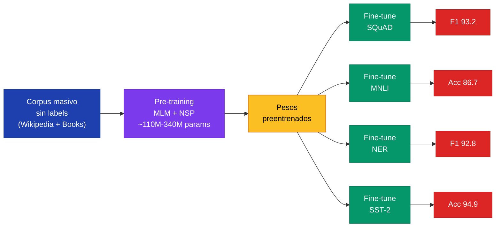
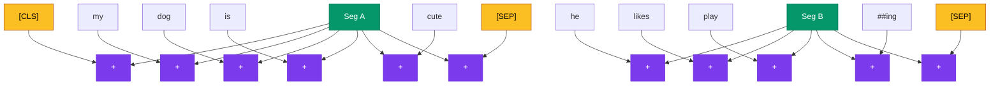

**BERT** (Bidirectional Encoder Representations from Transformers, Devlin et al. 2018) marca el momento en que el paradigma **pretrain + finetune** se vuelve dominante en NLP. No invento la idea de pre-training (word2vec 2013, ELMo 2018 ya la usaban), pero la elevo a una escala y profundidad nuevas: bidireccional, basado en Transformers, y transferible a casi cualquier tarea downstream con minimo esfuerzo arquitectonico.

---

## 1. Contexto Historico

El pre-training en NLP tiene una trayectoria larga:

| Ano | Modelo | Idea clave | Limitacion |
|---|---|---|---|
| 2013 | **word2vec** (Mikolov) | Embeddings densos de palabras (skip-gram, CBOW) | Una sola representacion por palabra (no contextual) |
| 2014 | **GloVe** (Pennington) | Factorizacion de matriz de coocurrencia | Idem, no contextual |
| 2017 | **CoVe** (McCann) | Embeddings contextuales desde NMT supervisado | Requiere corpus paralelo |
| 2018 | **ELMo** (Peters) | BiLSTM con LM bidireccional, embeddings contextuales | LSTM, shallow combination de directions |
| 2018 | **GPT-1** (Radford) | Transformer decoder + LM unidireccional | Solo izquierda-a-derecha |
| 2018 | **BERT** (Devlin) | Transformer encoder + MLM bidireccional **deep** | Establece nuevo estado del arte en 11 tareas |

BERT consolido tres ideas: (1) usar el **Transformer encoder** como columna vertebral, (2) entrenar con un objetivo **bidireccional profundo** (no concatenar dos LMs unidireccionales como ELMo), y (3) hacer fine-tuning end-to-end con minimos parametros nuevos por tarea. El resultado: +4.5 puntos en GLUE, +5.1 en SQuAD, +7.6 en MultiNLI. Cambio el campo.

---

## 2. El Paradigma Pretrain-Finetune



Dos fases:

1. **Pre-training**: tarea **auto-supervisada** masiva sobre texto sin etiquetar. Aprovecha los billones de palabras disponibles en Wikipedia, libros, web. El modelo aprende sintaxis, semantica, pragmatica y conocimiento del mundo solo prediciendo palabras faltantes.

2. **Fine-tuning**: ajuste **end-to-end** del modelo (todos los pesos) sobre el dataset etiquetado de la tarea downstream (clasificacion, QA, NER). Pocos epochs, learning rate pequeno, una capa adicional minima encima del encoder.

Es el analogo en NLP de lo que ImageNet pretraining hizo para vision computacional. Ver [Transfer Learning](transfer-learning) para el paralelo conceptual completo.


La diferencia de BERT con ELMo y GPT-1 esta en la **bidireccionalidad profunda**. ELMo concatena un LM forward y un LM backward solo en la capa final. GPT-1 es estrictamente forward. BERT permite que **cada token vea contexto izquierdo y derecho en todas las capas**, gracias al Masked Language Model.


---

## 3. Arquitectura BERT

BERT es un **encoder-only Transformer** (sin decoder, sin causal mask). Apila bloques identicos de:

- Multi-head **self-attention** (sin mascara causal: cada token atiende a toda la secuencia)
- Feed-forward de dos capas con GELU
- Residual + LayerNorm

Dos tamanos canonicos en el paper:

| Modelo | Capas $L$ | Hidden $H$ | Heads $A$ | FFN | Parametros |
|---|---|---|---|---|---|
| **BERT-base** | 12 | 768 | 12 | 3072 | ~110M |
| **BERT-large** | 24 | 1024 | 16 | 4096 | ~340M |

BERT-base fue elegido para igualar el tamano de GPT-1 y permitir comparacion directa. BERT-large empuja el limite de escala factible en 2018.

---

## 4. Input Representation

El input a BERT es la suma de **tres embeddings** por posicion:

$$\text{Input}_i = E_{\text{token}}(t_i) + E_{\text{segment}}(s_i) + E_{\text{pos}}(i)$$

| Componente | Vocab | Funcion |
|---|---|---|
| **Token embedding** $E_{\text{token}}$ | 30,522 (WordPiece) | Identidad lexica del token |
| **Segment embedding** $E_{\text{segment}}$ | 2 (A o B) | Pertenencia a primera o segunda oracion (pair tasks) |
| **Positional embedding** $E_{\text{pos}}$ | 512 (max) | Orden secuencial. **Aprendido**, no sinusoidal como Transformer original |



**Tokens especiales:**

- `[CLS]`: prepended a cada secuencia. Su representacion final es la **representacion agregada** usada para clasificacion de oracion.
- `[SEP]`: separador entre oracion A y oracion B (y al final).
- `[MASK]`: token usado durante pre-training para MLM.
- `[PAD]`: padding hasta longitud maxima.
- `[UNK]`: out-of-vocabulary (raro con WordPiece bien entrenado).

---

## 5. WordPiece Tokenization

BERT usa **WordPiece** (Schuster & Nakajima 2012, popularizado por Google NMT 2016): un tokenizer **subword** que divide palabras raras en piezas frecuentes.

Ejemplos:

| Palabra | Tokens WordPiece |
|---|---|
| `playing` | `play`, `##ing` |
| `unhappiness` | `un`, `##happi`, `##ness` |
| `embeddings` | `em`, `##bed`, `##ding`, `##s` |
| `Bahdanau` | `Bah`, `##dan`, `##au` |

El prefijo `##` marca **continuacion** (no inicio de palabra). Ventajas:

- **Vocab fijo y manejable**: 30k subwords cubre cualquier texto en ingles.
- **Sin OOV**: cualquier palabra se puede componer de subwords (en peor caso, caracter por caracter).
- **Eficiencia**: mejor balance entre vocab size y largo de secuencia que char-level o word-level.

WordPiece se entrena maximizando la verosimilitud de los datos bajo un modelo unigrama subword, similar a BPE pero con criterio diferente.

---

## 6. Masked Language Model (MLM)

Es el objetivo de pre-training **principal** de BERT. Resuelve el dilema de bidireccionalidad: un LM estandar no puede ser bidireccional sin "ver" el token a predecir, pero un MLM si.

### 6.1 Procedimiento

Para cada secuencia de entrada, **15% de los tokens** se seleccionan aleatoriamente. De ese 15%:

| Tratamiento | Probabilidad | Razon |
|---|---|---|
| Reemplazar por `[MASK]` | 80% | Tarea principal |
| Reemplazar por token random | 10% | Fuerza al modelo a no confiar ciegamente en `[MASK]` |
| Mantener token original | 10% | Sesgo del modelo hacia la representacion correcta del token actual |

Esta mezcla **80/10/10** evita un sesgo severo: si todos los tokens enmascarados fueran `[MASK]`, el modelo solo aprenderia a procesar `[MASK]`, que **nunca aparece en fine-tuning**. La mezcla obliga al modelo a producir buenas representaciones para **todos** los tokens, no solo los enmascarados.

### 6.2 Loss

Sea $M$ el conjunto de posiciones enmascaradas y $t_{\setminus M}$ el contexto visible:

$$\mathcal{L}_{\text{MLM}} = -\sum_{i \in M} \log P(t_i \mid t_{\setminus M})$$

La probabilidad se calcula con softmax sobre el vocabulario completo, usando los pesos del **token embedding** (weight tying) en la cabeza de prediccion para reducir parametros.


MLM es **mas dificil** que un LM autoregressivo: el modelo debe predecir un token usando contexto de **ambos lados**, no solo izquierdo. Esto fuerza representaciones mas ricas y aprovecha el doble de senal en cada posicion. Pero solo el 15% de tokens contribuye al loss por secuencia, lo que hace el pre-training menos eficiente en muestras que un LM autoregressivo (que predice el 100% de tokens). RoBERTa compenso esto entrenando mas tiempo.


---

## 7. Next Sentence Prediction (NSP)

Objetivo de pre-training **secundario**. Para tareas que requieren entender relaciones entre oraciones (QA, NLI), BERT introduce NSP: clasificacion binaria sobre la representacion final de `[CLS]`.

### 7.1 Construccion de pares

Cada ejemplo de pre-training consiste en dos segmentos `(A, B)`:

- **50% IsNext**: B sigue a A en el corpus original.
- **50% NotNext**: B es una oracion aleatoria de otro documento.

### 7.2 Loss combinado

$$\mathcal{L}_{\text{total}} = \mathcal{L}_{\text{MLM}} + \mathcal{L}_{\text{NSP}}$$

donde $\mathcal{L}_{\text{NSP}}$ es cross-entropy binaria sobre la salida de un MLP de 2 clases aplicado a $h_{\text{[CLS]}}$.

### 7.3 Evidencia posterior contra NSP

**RoBERTa** (Liu et al. 2019) mostro empiricamente que NSP **no aporta**: eliminarlo y entrenar mas tiempo solo con MLM mejora todos los benchmarks. Hipotesis: NSP es **demasiado facil** (detectar tema/estilo distinto) y no fuerza razonamiento profundo entre oraciones. Modelos posteriores (RoBERTa, DeBERTa) lo eliminaron; ALBERT lo reemplazo por **Sentence Order Prediction** (predecir si A y B estan en orden o intercambiados, ambas del mismo documento).

---

## 8. Corpus y Compute de Pre-training

| Hiperparametro | Valor BERT-base | Valor BERT-large |
|---|---|---|
| Corpus | BookCorpus (800M palabras) + English Wikipedia (2.5B palabras) | Idem |
| Steps | 1,000,000 | 1,000,000 |
| Batch size | 256 secuencias | 256 secuencias |
| Sequence length | 512 tokens (90% steps con 128, 10% con 512) | Idem |
| Optimizer | Adam, $\beta_1=0.9$, $\beta_2=0.999$, lr 1e-4 | Idem |
| Weight decay | 0.01 | 0.01 |
| Warmup | 10,000 steps lineal | Idem |
| Hardware | 16 TPUs, ~4 dias | 64 TPUs, ~4 dias |

Total tokens vistos: ~$256 \times 512 \times 10^6 \approx 1.3 \times 10^{11}$ tokens. RoBERTa luego entreno con ~10x mas datos y 4-8x mas compute.

---

## 9. Fine-tuning para Tareas Downstream


| Familia de tareas | Input | Output | Cabeza nueva |
|---|---|---|---|
| Sentence-pair classification | `[CLS] A [SEP] B [SEP]` | Clase | Linear + softmax sobre $h_{[CLS]}$ |
| Single sentence classification | `[CLS] sentence [SEP]` | Clase | Linear + softmax sobre $h_{[CLS]}$ |
| Question answering | `[CLS] question [SEP] context [SEP]` | Span (start, end) | Dos vectores aprendidos $S, E$ que producen $P_i = \text{softmax}(S \cdot h_i)$ |
| Token classification (NER) | `[CLS] tok1 ... tokN [SEP]` | Etiqueta por token | Linear + softmax sobre cada $h_i$ |

**Hiperparametros tipicos de fine-tuning** (Devlin):

- Epochs: 3 o 4
- Batch size: 16 o 32
- Learning rate: 2e-5, 3e-5 o 5e-5
- Optimizer: Adam con linear warmup + linear decay
- Dropout: 0.1

Casi siempre un grid pequeno sobre estos pocos valores basta. La adaptacion a una tarea con 10k ejemplos toma minutos en una sola GPU.

---

## 10. Resultados Clave

Devlin et al. reportaron resultados estado-del-arte en 11 benchmarks de NLP. Highlights:

| Benchmark | Tarea | SOTA previo | BERT-base | BERT-large |
|---|---|---|---|---|
| **GLUE** (avg) | 8 tareas NLU | 75.1 (OpenAI GPT) | 79.6 | **82.1** |
| **MNLI** | NLI | 82.1 | 84.6 | **86.7** |
| **QQP** | Paraphrase | 71.2 | 89.2 | **89.3** |
| **SQuAD 1.1** | QA F1 | 91.7 | 88.5 | **93.2** (ensemble) |
| **SQuAD 2.0** | QA F1 | 79.6 | -- | **83.1** |
| **SWAG** | Commonsense | 59.2 | 81.6 | **86.3** |
| **CoNLL NER** | Token class. F1 | 92.6 | 92.4 | **92.8** |

Una mejora simultanea en tantas tareas tan distintas, con la **misma arquitectura** y **mismos pesos pretrained**, fue lo que sello la influencia de BERT.

---

## 11. Variantes y Sucesores

| Modelo | Ano | Cambio principal | Resultado |
|---|---|---|---|
| **RoBERTa** (Liu) | 2019 | Mas datos (160GB), mas training, sin NSP, dynamic masking, batch grande (8k) | +2-4% sobre BERT |
| **ALBERT** (Lan) | 2019 | Factorized embedding ($E \neq H$), cross-layer parameter sharing, SOP en vez de NSP | 18x menos params, mejor performance |
| **DistilBERT** (Sanh) | 2019 | Knowledge distillation desde BERT-base | 40% menos params, 60% mas rapido, 97% performance |
| **DeBERTa** (He) | 2020 | Disentangled attention (content y posicion separados), enhanced mask decoder | Estado del arte SuperGLUE |
| **ELECTRA** (Clark) | 2020 | Replaced Token Detection: generador propone tokens, discriminador detecta cuales son reales | Mas eficiente en compute que MLM |
| **SpanBERT** (Joshi) | 2020 | Mascarar **spans** contiguos en vez de tokens individuales | Mejor en QA y coreferencia |
| **mBERT, XLM-R** | 2018-2020 | Multilingual (104 lenguas) | Cross-lingual transfer |
| **BioBERT, SciBERT, ClinicalBERT** | 2019+ | Pre-training en corpus de dominio (medico, cientifico) | Mejor en NER medico, QA cientifico |

ELECTRA merece nota especial: en lugar de MLM, entrena un **discriminador** que predice por cada token si fue reemplazado por un generador adversarial. Aprovecha el 100% de tokens (no solo el 15%), siendo mucho mas eficiente en compute por igual quality.

---

## 12. Implementacion en 3 Frameworks

A continuacion: (a) la funcion de masking 80/10/10, (b) un esqueleto de modelo BERT con MLM y NSP heads, (c) un training step con loss combinado.



```python
import torch
import torch.nn as nn
import torch.nn.functional as F

VOCAB_SIZE = 30522
MASK_ID = 103
CLS_ID = 101
PAD_ID = 0

# --- (a) Masking 80/10/10 ---
def mlm_mask(input_ids, mask_prob=0.15):
    labels = input_ids.clone()
    prob_matrix = torch.full(labels.shape, mask_prob)
    # No enmascarar tokens especiales
    special = (input_ids == CLS_ID) | (input_ids == PAD_ID)
    prob_matrix.masked_fill_(special, 0.0)

    masked_idx = torch.bernoulli(prob_matrix).bool()
    labels[~masked_idx] = -100  # ignorar en loss

    # 80% -> [MASK]
    idx_mask = torch.bernoulli(torch.full(labels.shape, 0.8)).bool() & masked_idx
    input_ids[idx_mask] = MASK_ID

    # 10% -> random token
    idx_rand = torch.bernoulli(torch.full(labels.shape, 0.5)).bool() & masked_idx & ~idx_mask
    rand_tokens = torch.randint(VOCAB_SIZE, labels.shape, dtype=torch.long)
    input_ids[idx_rand] = rand_tokens[idx_rand]

    # 10% restante: dejar token original
    return input_ids, labels


# --- (b) Modelo BERT con cabezas MLM y NSP ---
class BERT(nn.Module):
    def __init__(self, vocab=VOCAB_SIZE, h=768, layers=12, heads=12, max_len=512):
        super().__init__()
        self.tok_emb = nn.Embedding(vocab, h, padding_idx=PAD_ID)
        self.seg_emb = nn.Embedding(2, h)
        self.pos_emb = nn.Embedding(max_len, h)
        self.ln = nn.LayerNorm(h)
        self.drop = nn.Dropout(0.1)
        encoder_layer = nn.TransformerEncoderLayer(h, heads, 4*h, 0.1,
                                                    activation='gelu',
                                                    batch_first=True)
        self.encoder = nn.TransformerEncoder(encoder_layer, layers)
        # MLM head con weight tying
        self.mlm_dense = nn.Linear(h, h)
        self.mlm_ln = nn.LayerNorm(h)
        self.mlm_bias = nn.Parameter(torch.zeros(vocab))
        # NSP head
        self.nsp = nn.Linear(h, 2)

    def forward(self, ids, segs):
        pos = torch.arange(ids.size(1), device=ids.device).unsqueeze(0)
        x = self.tok_emb(ids) + self.seg_emb(segs) + self.pos_emb(pos)
        x = self.drop(self.ln(x))
        mask = (ids == PAD_ID)
        h = self.encoder(x, src_key_padding_mask=mask)

        # MLM logits (weight tying con tok_emb)
        m = F.gelu(self.mlm_dense(h))
        m = self.mlm_ln(m)
        mlm_logits = m @ self.tok_emb.weight.T + self.mlm_bias

        # NSP logits desde [CLS]
        nsp_logits = self.nsp(torch.tanh(h[:, 0]))
        return mlm_logits, nsp_logits


# --- (c) Training step ---
def train_step(model, batch, optimizer):
    ids, segs, nsp_labels = batch
    masked_ids, mlm_labels = mlm_mask(ids.clone())
    mlm_logits, nsp_logits = model(masked_ids, segs)

    loss_mlm = F.cross_entropy(mlm_logits.view(-1, VOCAB_SIZE),
                                mlm_labels.view(-1), ignore_index=-100)
    loss_nsp = F.cross_entropy(nsp_logits, nsp_labels)
    loss = loss_mlm + loss_nsp

    optimizer.zero_grad()
    loss.backward()
    optimizer.step()
    return loss.item(), loss_mlm.item(), loss_nsp.item()
```


```python
import jax
import jax.numpy as jnp
from flax import linen as nn
import optax

VOCAB_SIZE = 30522
MASK_ID = 103
PAD_ID = 0

# --- (a) Masking 80/10/10 ---
def mlm_mask(rng, ids, mask_prob=0.15):
    rng_sel, rng_choice, rng_rand = jax.random.split(rng, 3)
    selected = jax.random.bernoulli(rng_sel, mask_prob, ids.shape)
    selected = selected & (ids != PAD_ID)

    r = jax.random.uniform(rng_choice, ids.shape)
    is_mask = (r < 0.8) & selected
    is_rand = (r >= 0.8) & (r < 0.9) & selected

    rand_tokens = jax.random.randint(rng_rand, ids.shape, 0, VOCAB_SIZE)
    new_ids = jnp.where(is_mask, MASK_ID,
              jnp.where(is_rand, rand_tokens, ids))
    labels = jnp.where(selected, ids, -100)
    return new_ids, labels


# --- (b) Modelo BERT con MLM y NSP ---
class BERT(nn.Module):
    vocab: int = VOCAB_SIZE
    h: int = 768
    layers: int = 12
    heads: int = 12
    max_len: int = 512

    @nn.compact
    def __call__(self, ids, segs, train=True):
        tok = nn.Embed(self.vocab, self.h)
        x = tok(ids) + nn.Embed(2, self.h)(segs)
        pos = jnp.arange(ids.shape[1])[None, :]
        x = x + nn.Embed(self.max_len, self.h)(pos)
        x = nn.LayerNorm()(x)
        x = nn.Dropout(0.1, deterministic=not train)(x)

        for _ in range(self.layers):
            x = nn.SelfAttention(num_heads=self.heads,
                                  deterministic=not train)(x) + x
            x = nn.LayerNorm()(x)
            ff = nn.Dense(4*self.h)(x)
            ff = nn.gelu(ff)
            ff = nn.Dense(self.h)(ff)
            x = nn.LayerNorm()(x + ff)

        # MLM head con weight tying
        m = nn.gelu(nn.Dense(self.h)(x))
        m = nn.LayerNorm()(m)
        mlm_logits = m @ tok.embedding.T

        # NSP desde [CLS]
        nsp_logits = nn.Dense(2)(jnp.tanh(x[:, 0]))
        return mlm_logits, nsp_logits


# --- (c) Training step ---
def loss_fn(params, rng, ids, segs, nsp_labels, model):
    rng_mask, rng_drop = jax.random.split(rng)
    masked_ids, mlm_labels = mlm_mask(rng_mask, ids)
    mlm_logits, nsp_logits = model.apply(params, masked_ids, segs,
                                          rngs={'dropout': rng_drop})
    valid = mlm_labels != -100
    mlm_loss = optax.softmax_cross_entropy_with_integer_labels(
        mlm_logits, jnp.where(valid, mlm_labels, 0))
    mlm_loss = (mlm_loss * valid).sum() / valid.sum().clip(1)
    nsp_loss = optax.softmax_cross_entropy_with_integer_labels(
        nsp_logits, nsp_labels).mean()
    return mlm_loss + nsp_loss
```


```python
import tensorflow as tf

VOCAB_SIZE = 30522
MASK_ID = 103
PAD_ID = 0

# --- (a) Masking 80/10/10 ---
def mlm_mask(ids, mask_prob=0.15):
    shape = tf.shape(ids)
    selected = tf.random.uniform(shape) < mask_prob
    selected = selected & (ids != PAD_ID)

    r = tf.random.uniform(shape)
    is_mask = (r < 0.8) & selected
    is_rand = (r >= 0.8) & (r < 0.9) & selected
    rand_tokens = tf.random.uniform(shape, 0, VOCAB_SIZE, dtype=tf.int32)

    new_ids = tf.where(is_mask, MASK_ID,
              tf.where(is_rand, rand_tokens, ids))
    labels = tf.where(selected, ids, -100)
    return new_ids, labels


# --- (b) Modelo BERT con MLM y NSP ---
class BERT(tf.keras.Model):
    def __init__(self, vocab=VOCAB_SIZE, h=768, layers=12, heads=12, max_len=512):
        super().__init__()
        self.tok = tf.keras.layers.Embedding(vocab, h)
        self.seg = tf.keras.layers.Embedding(2, h)
        self.pos = tf.keras.layers.Embedding(max_len, h)
        self.ln = tf.keras.layers.LayerNormalization()
        self.drop = tf.keras.layers.Dropout(0.1)
        self.blocks = [
            tf.keras.layers.MultiHeadAttention(heads, h//heads)
            for _ in range(layers)
        ]
        self.ffns = [
            tf.keras.Sequential([
                tf.keras.layers.Dense(4*h, activation='gelu'),
                tf.keras.layers.Dense(h),
            ]) for _ in range(layers)
        ]
        self.lns = [tf.keras.layers.LayerNormalization() for _ in range(2*layers)]
        self.mlm_dense = tf.keras.layers.Dense(h, activation='gelu')
        self.mlm_ln = tf.keras.layers.LayerNormalization()
        self.nsp = tf.keras.layers.Dense(2)
        self.h = h

    def call(self, ids, segs, training=False):
        pos = tf.range(tf.shape(ids)[1])[None, :]
        x = self.tok(ids) + self.seg(segs) + self.pos(pos)
        x = self.drop(self.ln(x), training=training)
        for i, (att, ffn) in enumerate(zip(self.blocks, self.ffns)):
            x = self.lns[2*i](x + att(x, x))
            x = self.lns[2*i+1](x + ffn(x))
        m = self.mlm_ln(self.mlm_dense(x))
        mlm_logits = tf.matmul(m, self.tok.embeddings, transpose_b=True)
        nsp_logits = self.nsp(tf.tanh(x[:, 0]))
        return mlm_logits, nsp_logits


# --- (c) Training step ---
@tf.function
def train_step(model, optimizer, ids, segs, nsp_labels):
    masked_ids, mlm_labels = mlm_mask(ids)
    with tf.GradientTape() as tape:
        mlm_logits, nsp_logits = model(masked_ids, segs, training=True)
        valid = tf.cast(mlm_labels != -100, tf.float32)
        mlm_loss = tf.keras.losses.sparse_categorical_crossentropy(
            tf.maximum(mlm_labels, 0), mlm_logits, from_logits=True)
        mlm_loss = tf.reduce_sum(mlm_loss * valid) / tf.reduce_sum(valid)
        nsp_loss = tf.reduce_mean(
            tf.keras.losses.sparse_categorical_crossentropy(
                nsp_labels, nsp_logits, from_logits=True))
        loss = mlm_loss + nsp_loss
    grads = tape.gradient(loss, model.trainable_variables)
    optimizer.apply_gradients(zip(grads, model.trainable_variables))
    return loss
```



---

## 13. Conexion con LLMs Modernos

BERT precedio a GPT-3 (2020) y la era de los LLMs por scale. La industria, sin embargo, **no se quedo con MLM**: los LLMs modernos (GPT-3/4, LLaMA, Claude, Gemini) usan **next-token prediction** (decoder-only autoregressivo), no MLM.

| Aspecto | BERT (encoder-only, MLM) | GPT-style (decoder-only, NTP) |
|---|---|---|
| Direccion | Bidireccional | Unidireccional (causal) |
| Objetivo | Predecir 15% de tokens | Predecir cada token siguiente |
| Eficiencia de pre-training | Baja (15% senal) | Alta (100% senal) |
| Fuerte en | Encoding de oracion completa, NLU | Generacion abierta, in-context learning |
| Fine-tuning | Rapido, supervisado por tarea | Instruction tuning, RLHF, prompting |
| Tareas | Clasificacion, NER, QA span | Generacion, dialogo, razonamiento |

Pero el **paradigma estructural** es identico:

1. Pre-train **masivo** sobre texto sin etiquetar.
2. Adaptar **economicamente** (fine-tune, prompt, LoRA, RLHF) a la tarea final.

BERT establecio que pre-training es el camino. Los LLMs lo escalaron 1000x. Y ambos comparten el mismo bloque base: el [Transformer encoder/decoder](transformer) con [self-attention](self-attention) y [embeddings distribuidos](embeddings-distribuidos) como input.


La leccion duradera de BERT no es "usen MLM" (los LLMs hoy usan NTP). Es **"el conocimiento linguistico se aprende auto-supervisado a escala, y se transfiere a casi cualquier tarea con minimo fine-tuning"**. Esa idea sigue intacta y subyace a todo modelo de fundacion moderno.


---

## 14. Resumen

- **BERT** (Devlin 2018) es un Transformer **encoder-only** entrenado con **MLM bidireccional** + **NSP** sobre Wikipedia + BookCorpus.
- Tres embeddings (token WordPiece + segmento + posicional aprendido) se suman como input. `[CLS]` agrega la representacion de oracion.
- **MLM 80/10/10**: 15% de tokens enmascarados, de los cuales 80% se reemplazan por `[MASK]`, 10% por random y 10% se mantienen, para evitar sesgo hacia `[MASK]`.
- **NSP** clasifica si dos oraciones son consecutivas; **RoBERTa** mostro que se puede prescindir de NSP.
- **Fine-tuning** end-to-end con `[CLS]` (clasificacion) o por token (NER, QA span). Pocos epochs, lr ~2e-5.
- Estado del arte en 11 benchmarks NLP simultaneamente: GLUE, SQuAD, NER, NLI.
- Variantes: **RoBERTa**, **ALBERT**, **DistilBERT**, **DeBERTa**, **ELECTRA**, **SpanBERT**, **mBERT**, **BioBERT**.
- Los LLMs modernos heredaron el paradigma pretrain-finetune pero usan decoder-only + next-token prediction. La idea de fondo (transferir conocimiento aprendido auto-supervisado) sigue dominante.

Ver tambien: [Transformer](transformer) | [Self-Attention](self-attention) | [Transfer Learning](transfer-learning) | [Embeddings Distribuidos](embeddings-distribuidos) | [Paper BERT - Devlin 2018](/papers/bert-devlin-2018) | [Clase 14](/clases/clase-14).
