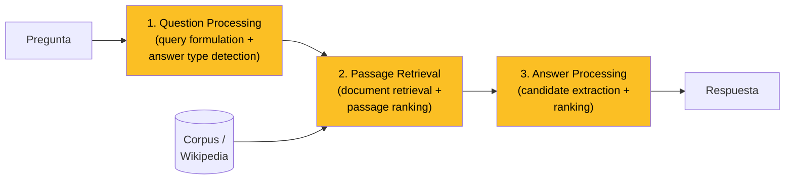

**Question Answering (QA)** es la tarea de construir sistemas que **responden preguntas formuladas en lenguaje natural**. Es una de las metas más antiguas y más fundacionales de la inteligencia artificial: aparece ya en el **Test de Turing** (1950) como criterio operativo de inteligencia — una máquina inteligente es aquella que responde preguntas de forma indistinguible de un humano — y atraviesa toda la historia del procesamiento de lenguaje natural, desde los sistemas de tarjetas perforadas de los años 60 hasta los LLMs actuales. Esta página consolida los conceptos transversales del área — definición, por qué es "AI-complete", taxonomía, las cuatro grandes familias de QA, el pipeline canónico IR-based, datasets, evolución de arquitecturas y la era de los modelos de lenguaje grandes — y sirve de fundamento transversal de la **[Clase 24](/clases/clase-24)** del curso IA UC.

---

## 1. Definición y orígenes

Un sistema de QA recibe una **pregunta** $q$ en lenguaje natural y, opcionalmente, una **fuente de información** (un texto, una base de conocimiento, una imagen, un corpus), y produce una **respuesta** $a$. Formalmente, casi todos los enfoques modernos estiman una distribución condicional

$$p(a \mid q, c),$$

donde $c$ es el contexto o fuente. La respuesta puede ser un hecho atómico, una frase, un párrafo, un documento, e incluso otra pregunta. Lo que distingue QA de la simple búsqueda (information retrieval) es que el sistema no devuelve **documentos relevantes** sino **la respuesta concreta** a lo que se preguntó.

QA es una de las tareas más antiguas del NLP, y su genealogía es un recorrido por la historia de la IA:

- **Test de Turing (1950)**: Alan Turing propone el "imitation game", donde una máquina debe sostener una conversación de preguntas y respuestas indistinguible de la humana. QA queda así inscrito en la definición misma de inteligencia artificial.
- **BASEBALL (1961)**: uno de los primeros sistemas de QA de dominio cerrado. Respondía preguntas en inglés sobre partidos de béisbol de la liga americana de un año, traduciendo la pregunta a una consulta estructurada sobre una base de datos. Funcionaba sobre tarjetas perforadas.
- **LUNAR (1973)**: sistema de Woods et al. que permitía a geólogos hacer preguntas en lenguaje natural sobre las muestras de roca traídas por las misiones Apollo. Otro QA de dominio cerrado sobre base de datos, con un parser semántico sofisticado para la época.
- **SHRDLU (1972)**: el "mundo de bloques" de Terry Winograd, que respondía preguntas y ejecutaba comandos sobre un microcosmos simulado de objetos geométricos.

Estos sistemas tempranos eran **simbólicos y de dominio cerrado**: dependían de gramáticas hechas a mano y de bases de datos estructuradas. Funcionaban impresionantemente bien dentro de su micromundo y colapsaban fuera de él — la tensión "mundo cerrado vs. lenguaje natural real" que recorre toda la historia del campo.


QA no es búsqueda: la búsqueda devuelve **documentos donde quizás esté la respuesta**; QA devuelve **la respuesta**. La diferencia parece sutil pero exige al sistema comprender la pregunta, localizar o recuperar la evidencia, razonar sobre ella y producir una respuesta precisa.


---

## 2. Por qué QA es "AI-complete"

Se dice que un problema es **AI-complete** cuando resolverlo plenamente implica resolver buena parte de la inteligencia artificial general. QA es el ejemplo clásico, y la razón es que **responder preguntas arbitrarias requiere componer muchas capacidades distintas**:

- **Comprensión del lenguaje**: entender qué se está preguntando exige analizar sintaxis, semántica, correferencia, presuposiciones, ambigüedad. "¿Quién mató a quién?" requiere parsing de roles semánticos.
- **Recuperación de información**: encontrar dónde está la evidencia entre millones de documentos o en una base de conocimiento gigante.
- **Razonamiento**: muchas preguntas no se contestan con un solo hecho. "¿Qué edad tenía Einstein cuando publicó la relatividad especial?" exige encontrar dos fechas y restarlas. Razonamiento multi-hop, numérico, temporal, causal, de sentido común.
- **Conocimiento del mundo**: "¿Puede un pingüino volar a Marte?" no está escrito en ningún documento; requiere conocimiento de fondo sobre pingüinos, vuelo y viajes espaciales.
- **Generación de lenguaje**: formular la respuesta de forma fluida y apropiada al contexto y a la audiencia.
- **Calibración y abstención**: saber cuándo **no** se sabe la respuesta, en lugar de inventar.

Cada una de estas sub-capacidades es por sí misma un subcampo entero del NLP/IA. Por eso un sistema de QA verdaderamente general es indistinguible de un sistema de IA general: para responder cualquier pregunta sobre cualquier cosa, hay que entender, recuperar, razonar y comunicar como un humano. Esta es la razón profunda por la cual QA ha sido históricamente el banco de pruebas predilecto para medir el progreso de la IA — y por qué cada avance arquitectónico mayor (atención, Transformers, pre-entrenamiento, LLMs) se mide contra benchmarks de QA.

---

## 3. Taxonomía: las dimensiones de QA

QA no es una tarea única sino una familia. Se descompone en varios ejes ortogonales; un sistema concreto fija una combinación específica.

### 3.1 Por tipo de pregunta

- **Factoid / factual**: preguntas con respuesta corta y verificable. "¿Cuál es la capital de Chile?" → "Santiago". Dominantes en los benchmarks por ser fáciles de evaluar.
- **Complex / narrative**: preguntas que exigen explicación, síntesis o razonamiento multi-paso. "¿Por qué cayó el Imperio Romano?" no tiene una respuesta de una palabra.
- **Information retrieval**: preguntas cuya "respuesta" es realmente encontrar el documento o pasaje relevante. La frontera con la búsqueda es difusa.

### 3.2 Por fuente de la respuesta

- **Context / corpus**: la respuesta está en un texto dado (un párrafo, un documento, un corpus completo). Es el caso de la comprensión lectora.
- **Knowledge base (KB)**: la respuesta se deriva de una base de conocimiento estructurada (Freebase, Wikidata, DBpedia). La pregunta se traduce a una consulta lógica.
- **Non-linguistic**: la respuesta está en una fuente no textual — una **imagen** (Visual QA), un video, datos de sensores, una tabla, un gráfico.

### 3.3 Por tipo de respuesta

- **Single fact**: una entidad o valor atómico ("gravity", "1905", "graupel").
- **Sentence / paragraph**: una oración o párrafo, ya sea **extraído** literalmente de la fuente o **generado**.
- **Document**: un documento entero (frontera con IR).
- **Another question**: en sistemas conversacionales, la respuesta apropiada puede ser una repregunta de clarificación.
- **Object / image**: en QA multimodal o robótica, señalar un objeto o región.

### 3.4 Tabla resumen

| Dimensión | Opciones |
| --- | --- |
| **Tipo de pregunta** | factoid · complex/narrative · information retrieval |
| **Fuente** | contexto/corpus · knowledge base · no-lingüística (imagen, sensores) |
| **Tipo de respuesta** | single fact · oración/párrafo (extraído o generado) · documento · otra pregunta · objeto/imagen |
| **Dominio** | cerrado (closed-domain) · abierto (open-domain) |
| **Acceso a la fuente** | open-book (con documento) · closed-book (de memoria) |
| **Generación** | extractivo · abstractivo/generativo · cloze |

---

## 4. Las cuatro grandes áreas de QA

El campo se organiza en cuatro familias según cómo se obtiene la respuesta. Cada una tiene su propia tradición de modelos y benchmarks.

### 4.1 Information Retrieval (IR) based QA

También llamado **open-domain QA**. El sistema busca la respuesta en una colección masiva de documentos (la web, Wikipedia entera, un corpus corporativo). No hay un pasaje dado de antemano: primero hay que **recuperar** los documentos relevantes y luego **extraer** la respuesta. Es la familia de los buscadores con "respuesta directa" (Google answer box) y de los asistentes. Su pipeline canónico se detalla en la sección 5.

### 4.2 Reading Comprehension (Machine Reading Comprehension, MRC)

Se da al sistema un **pasaje específico** y una pregunta sobre él; el sistema debe leer y comprender ese texto para responder. Es la formulación de [SQuAD](/papers/squad-rajpurkar-2016) y de CNN/Daily Mail. La fuente está acotada; el desafío es la **comprensión** del texto, no la recuperación. Es el banco de pruebas más limpio para medir comprensión lectora. Ver el fundamento dedicado [Machine Reading Comprehension](/fundamentos/machine-reading-comprehension).

### 4.3 Semantic Parsing sobre Knowledge Bases

El sistema traduce la pregunta en lenguaje natural a una **forma lógica** (logical form) — una consulta estructurada tipo SPARQL, SQL o lambda-calculus — que se ejecuta sobre una base de conocimiento. "¿Quién dirigió Titanic?" se compila a una query sobre Freebase. Es el linaje directo de BASEBALL y LUNAR, modernizado. Maneja muy bien preguntas composicionales ("¿Qué actrices nacidas en Chile ganaron un Oscar?") pero está limitado a lo que la KB contiene y a lo que el parser sabe traducir.

### 4.4 Visual QA (VQA)

La fuente es una **imagen** (o video). "¿De qué color es el auto de la izquierda?", "¿Cuántas personas hay en la foto?". Combina visión por computador (entender la imagen) con NLP (entender la pregunta y generar la respuesta). Es el caso paradigmático de QA con fuente no-lingüística y un puente natural hacia los modelos multimodales actuales.


Las cuatro áreas comparten la interfaz (pregunta en NL → respuesta) pero difieren radicalmente en la **fuente** y, por tanto, en la maquinaria: IR-QA necesita un retriever, MRC un lector, semantic parsing un compilador a forma lógica, y VQA un encoder visual. Los LLMs modernos empiezan a unificar las cuatro bajo una sola arquitectura.


---

## 5. Pipeline canónico: IR-based Factoid QA

El pipeline clásico de open-domain factoid QA, anterior a los LLMs, se descompone en tres grandes etapas. Aunque hoy muchos sistemas lo colapsan en un solo modelo, entender este esqueleto sigue siendo fundamental porque **RAG (retrieval-augmented generation) es exactamente este pipeline con un LLM en la etapa final**.

### 5.1 Question processing

Transforma la pregunta en algo accionable. Dos sub-tareas:

- **Query formulation**: convertir la pregunta en una consulta para el motor de búsqueda. "¿Dónde nació Pablo Neruda?" se reescribe a la query `Pablo Neruda born` o `Pablo Neruda lugar nacimiento`. Puede incluir reescritura, expansión de sinónimos, eliminación de stopwords.
- **Answer type detection**: predecir **qué tipo de cosa** es la respuesta. "¿Dónde...?" → una ubicación; "¿Cuándo...?" → una fecha; "¿Quién...?" → una persona. Esta señal restringe drásticamente el espacio de candidatos en la etapa final. Tradicionalmente se usaba una taxonomía de tipos de respuesta (la jerarquía de Li & Roth, 2002) y un clasificador.

### 5.2 Passage retrieval

Recupera el material donde probablemente esté la respuesta. Dos sub-pasos:

- **Document retrieval**: traer los documentos más relevantes del corpus. Clásicamente con **TF-IDF** o **BM25** (retrieval disperso, basado en solapamiento léxico). Modernamente con **dense retrieval** ([DPR](/papers/dpr-karpukhin-2020)), que codifica pregunta y pasajes en vectores densos y recupera por similitud en el espacio de embeddings, capturando paráfrasis que BM25 pierde. Ver [dense retrieval](/fundamentos/dense-retrieval).
- **Passage ranking**: dividir los documentos en pasajes y reordenarlos por probabilidad de contener la respuesta, a menudo con un re-ranker neuronal (cross-encoder) más caro pero más preciso que el retriever inicial.

### 5.3 Answer processing

De los pasajes top, extrae la respuesta final:

- **Candidate extraction**: identificar los spans candidatos compatibles con el answer type detectado (si esperamos una fecha, extraer todas las fechas de los pasajes).
- **Candidate ranking**: puntuar y elegir el mejor candidato. En la era pre-neuronal se usaban features de solapamiento, distancia, frecuencia; modernamente, un modelo de span prediction tipo BERT que predice las posiciones de inicio y fin de la respuesta dentro del pasaje.

Este esqueleto de tres etapas es el ancestro directo de RAG: el retriever (etapas 1-2) recupera el contexto, y el "answer processing" (etapa 3) lo realiza un LLM generativo.

---

## 6. Ejes de diseño: closed/open, book, extractivo/generativo/cloze

Más allá de las cuatro áreas, hay tres distinciones transversales que conviene tener claras porque definen el comportamiento del sistema.

### 6.1 Closed-domain vs open-domain

| | Closed-domain QA | Open-domain QA |
| --- | --- | --- |
| **Alcance** | Un dominio acotado (béisbol, rocas lunares, soporte de un producto) | Cualquier tema |
| **Fuente** | Base de conocimiento o corpus pequeño y específico | Web, Wikipedia entera, corpus masivo |
| **Ejemplos históricos** | BASEBALL, LUNAR | Watson de IBM, buscadores con answer box |
| **Dificultad** | Vocabulario controlado, alta precisión posible | Recuperación a escala, ambigüedad, ruido |
| **Necesita retriever** | Normalmente no (todo cabe) | Sí, indispensable |

### 6.2 Open-book vs closed-book

- **Open-book QA**: el sistema tiene acceso a documentos en tiempo de respuesta (como un examen con libro abierto). MRC, RAG y el pipeline IR-based son open-book. La respuesta se **fundamenta** (grounding) en evidencia recuperable.
- **Closed-book QA**: el sistema responde **de memoria**, usando solo el conocimiento codificado en sus parámetros durante el pre-entrenamiento. Es la modalidad que popularizaron los LLMs: preguntarle a GPT-4 una fecha histórica sin darle ningún documento. Flexible pero propenso a alucinaciones y sin trazabilidad de la fuente.

### 6.3 Extractivo vs abstractivo/generativo vs cloze

| Modalidad | Cómo se produce la respuesta | Ejemplo de dataset |
| --- | --- | --- |
| **Extractivo** | La respuesta es un **span literal** copiado de la fuente. El sistema localiza inicio y fin. | [SQuAD](/papers/squad-rajpurkar-2016) |
| **Abstractivo / generativo** | El sistema **genera** la respuesta palabra a palabra; puede parafrasear y sintetizar. | [MS MARCO](/papers/ms-marco-nguyen-2016), Natural Questions (long answer) |
| **Cloze** | La pregunta es una oración con una palabra/entidad **enmascarada** que hay que rellenar leyendo el pasaje. | [CNN/Daily Mail](/papers/cnn-dailymail-hermann-2015), CBT, LAMBADA |

El extractivo es fiel por construcción (no puede alucinar: la respuesta estaba en el texto) pero rígido. El generativo es flexible y más natural, pero arriesga inventar. El cloze es una simplificación que permitió generar datasets enormes automáticamente, y fue el puente histórico hacia el QA extractivo moderno.

---

## 7. Datasets canónicos

El campo de QA, como el resto del NLP moderno, avanza al ritmo de sus benchmarks. Un buen dataset define una métrica, una baseline y un techo humano, y deja que cientos de equipos compitan en un leaderboard público.

| Dataset | Año | Modalidad | Fuente | Tamaño | Característica |
| --- | --- | --- | --- | --- | --- |
| **[CNN/Daily Mail](/papers/cnn-dailymail-hermann-2015)** | 2015 | Cloze | Noticias | ~1.4M | Bullets abstractivos → query cloze con entidad anonimizada. Primer corpus de MRC a gran escala. |
| **CBT** (Children's Book Test) | 2015 | Cloze | Libros infantiles | 688K | Predecir palabra borrada dadas 20 oraciones de contexto. |
| **LAMBADA** | 2016 | Cloze | Novelas | ~10K | Predecir la última palabra de un pasaje; requiere contexto amplio. Mide modelado de lenguaje a largo alcance. |
| **[bAbI](/papers/babi-weston-2015)** | 2015 | Sintético | Generado | ilimitado | 20 tareas de razonamiento estratificadas (inducción, deducción, conteo, paths). Diagnóstico controlado. |
| **[SQuAD](/papers/squad-rajpurkar-2016)** | 2016 | Extractivo | Wikipedia | 107K | La respuesta es un span. Métricas EM/F1. Benchmark dominante de MRC 2016-2019. |
| **SQuAD 2.0** | 2018 | Extractivo + abstención | Wikipedia | 150K | Agrega 50K+ preguntas **no respondibles** adversariales: el sistema debe saber abstenerse. |
| **[MS MARCO](/papers/ms-marco-nguyen-2016)** | 2016 | Generativo | Bing queries reales | 1M | Preguntas reales de usuarios, respuestas escritas por humanos, multi-documento. Realista. |
| **Natural Questions** | 2019 | Extractivo + generativo | Google queries + Wikipedia | 307K | Preguntas reales de búsqueda; respuesta corta (span) + larga (párrafo). El estándar de open-domain QA realista. |
| **TriviaQA, HotpotQA** | 2017/18 | Extractivo / multi-hop | Web / Wikipedia | 95K / 113K | HotpotQA exige razonamiento multi-documento (multi-hop) con supervisión de las oraciones de apoyo. |

La progresión es instructiva: de los **cloze sintéticos** (CNN/DM, CBT) — grandes pero fáciles de "hackear" con pattern matching — se pasó a los **extractivos con preguntas humanas** (SQuAD) — más realistas pero con preguntas formuladas mirando el pasaje — y de ahí a los **generativos con preguntas reales** (MS MARCO, Natural Questions) — donde el usuario hizo la pregunta sin haber leído la respuesta, el escenario más fiel al uso real. En paralelo, **bAbI** ofrece un banco sintético para diagnosticar tipos específicos de razonamiento de forma controlada.

---

## 8. Evolución de las arquitecturas

La historia de los modelos de QA es un microcosmos de la historia del NLP neuronal. Cada salto arquitectónico mayor se validó primero en QA.

### 8.1 Simbólico / basado en reglas (1960s-2000s)

Gramáticas hechas a mano, parsers semánticos, extracción de información a triples, consultas a bases de datos. BASEBALL, LUNAR, sistemas frame-semantic. Precisos en dominio cerrado, frágiles fuera de él, imposibles de escalar.

### 8.2 Attentive Readers (2015)

El paper [Teaching Machines to Read and Comprehend (Hermann et al., 2015)](/papers/cnn-dailymail-hermann-2015) introduce los primeros lectores neuronales con atención sobre la tarea cloze de CNN/Daily Mail. El **Deep LSTM Reader** comprime documento + query en un vector y sufre el cuello de botella del vector fijo; el **Attentive Reader** y el **Impatient Reader** introducen [atención](/fundamentos/mecanismo-atencion) sobre los tokens del documento, condicionada por la query. La ablación clave del paper — el **Uniform Reader** (atención uniforme) cae a ~39% mientras el Attentive llega a ~63% — aísla causalmente el valor de la atención. El **Stanford Attentive Reader** (Chen et al., 2016) simplifica el mecanismo con una atención bilineal y se vuelve el modelo canónico de enseñanza.

### 8.3 Bidirectional Attention (2016-2017)

[BiDAF (Seo et al., 2017)](/papers/bidaf-seo-2017) — Bi-Directional Attention Flow — introduce atención en **ambas direcciones**: del contexto a la query (qué palabras del pasaje son relevantes para la pregunta) y de la query al contexto (qué palabras de la pregunta son las más importantes). Mantiene una representación por token sin colapsar en un vector fijo, y deja la "fusión" para capas posteriores. Junto con R-Net, DrQA y QANet, esta familia llevó SQuAD del 70% al 80%+ de F1.

### 8.4 Transformer-based: BERT y span prediction (2018-2019)

[BERT](/fundamentos/bert) (Devlin et al., 2018) marca el punto de inflexión. El fine-tuning de un [Transformer](/fundamentos/transformer) pre-entrenado sobre SQuAD se reduce a aprender dos vectores — uno de **inicio** y uno de **fin** — que se combinan con las representaciones contextuales de cada token para predecir el span de respuesta:

$$p_{\text{start}}(i) = \frac{\exp(\mathbf{s}^\top \mathbf{h}_i)}{\sum_j \exp(\mathbf{s}^\top \mathbf{h}_j)}, \qquad p_{\text{end}}(i) = \frac{\exp(\mathbf{e}^\top \mathbf{h}_i)}{\sum_j \exp(\mathbf{e}^\top \mathbf{h}_j)},$$

donde $\mathbf{h}_i$ es la representación contextual del token $i$, y $\mathbf{s}, \mathbf{e}$ son los vectores aprendidos de inicio y fin. El span predicho es el par $(i, j)$ con $i \le j$ que maximiza $p_{\text{start}}(i)\, p_{\text{end}}(j)$. Con este esquema, BERT **superó el rendimiento humano** (F1 86.8%) en SQuAD v1.1, hito ampliamente citado como evidencia del poder del pre-entrenamiento contextual.

### 8.5 Generativo: GPT, BART, T5 (2019-2020)

Los modelos encoder-decoder y decoder-only reformulan QA como **generación de texto**. T5 trata todo como text-to-text: la entrada es `question: ... context: ...` y la salida es la respuesta generada. Esto permite QA abstractivo (la respuesta no tiene por qué ser un span literal) y unifica QA con summarization, traducción y clasificación bajo una sola interfaz.

### 8.6 Retrieval-augmented (2020)

[DPR (Karpukhin et al., 2020)](/papers/dpr-karpukhin-2020) reemplaza BM25 por un retriever denso de doble encoder, mejorando drásticamente la recuperación en open-domain QA. **RAG** (Lewis et al., 2020) acopla un retriever denso con un generador (BART): recupera pasajes relevantes y los pasa como contexto al generador. Es la combinación de open-book + generativo que domina la producción actual.

### 8.7 LLMs (2022+)

GPT-3.5/4, Claude, Gemini hacen QA closed-book (de memoria) o open-book (con RAG o tool use) vía prompt, sin fine-tuning específico. Ver sección 9.

| Era | Modelo representativo | Innovación |
| --- | --- | --- |
| 1960s-2000s | BASEBALL, LUNAR | Simbólico, dominio cerrado, KB |
| 2015 | Attentive Reader (Hermann), Stanford AR (Chen) | Atención neuronal sobre el pasaje |
| 2017 | [BiDAF](/papers/bidaf-seo-2017) | Atención bidireccional contexto↔query |
| 2018 | [BERT](/fundamentos/bert) | Span prediction sobre Transformer pre-entrenado; supera humano en SQuAD |
| 2020 | T5, BART | QA generativo text-to-text |
| 2020 | [DPR](/papers/dpr-karpukhin-2020), RAG | Retrieval denso + generación aumentada |
| 2022+ | GPT-4, Claude | Closed-book + RAG + tool use vía prompt |

---

## 9. QA en la era de los LLMs

Los modelos de lenguaje grandes reconfiguraron QA. Tres modalidades coexisten hoy:

### 9.1 Closed-book QA

El LLM responde de memoria, usando el conocimiento codificado en sus parámetros durante el pre-entrenamiento. Es asombrosamente competente en preguntas factoid populares, pero tiene tres debilidades estructurales: **alucina** hechos plausibles pero falsos, su conocimiento tiene **fecha de corte** (no sabe de eventos posteriores), y **no puede citar la fuente**. Para hechos verificables o críticos, closed-book es insuficiente por sí solo.

### 9.2 Retrieval-Augmented Generation (RAG)

La modalidad dominante en producción. Es exactamente el **pipeline IR-based de la sección 5 con un LLM en la etapa de answer processing**: un [retriever denso](/fundamentos/dense-retrieval) recupera pasajes relevantes de un corpus (la documentación de la empresa, la base de conocimiento clínica, etc.) y se los inyecta al LLM como contexto en el prompt. El LLM genera la respuesta **fundamentada** en esos pasajes, lo que reduce alucinaciones, permite conocimiento actualizado sin re-entrenar, y habilita citaciones. RAG es donde convergen casi todos los conceptos de esta página: question processing, dense retrieval, passage ranking y generación condicionada.

### 9.3 Tool use

El LLM, en lugar de responder directamente, decide **llamar a una herramienta**: una búsqueda web, una calculadora, una API, una consulta SQL a una base de datos. Es la versión moderna del semantic parsing (sección 4.3): el LLM traduce la pregunta a una acción ejecutable y razona sobre el resultado. Permite responder preguntas que requieren cómputo exacto, datos en tiempo real o acceso a sistemas externos.

### 9.4 Por qué importa la abstención

La capacidad de **decir "no sé"** es, quizás, lo más subestimado de QA. Un sistema que siempre responde algo es peligroso: en medicina, derecho o finanzas, una respuesta inventada con tono seguro es peor que ninguna respuesta. **SQuAD 2.0** elevó esto a primer plano al añadir 50K+ preguntas no respondibles: el sistema debe decidir no solo *qué* responder sino *si* responder. La abstención calibrada — devolver "la fuente no contiene esta información" en lugar de alucinar — es un requisito de seguridad central de los sistemas de QA en producción, y un área activa de investigación (calibración de confianza, detección de no-respondibilidad, RAG con verificación).


El gran cambio de la era LLM no es que las máquinas respondan mejor, sino que ahora el reto central es la **fidelidad y la trazabilidad**: ¿la respuesta está fundamentada en evidencia real? ¿El sistema sabe cuándo no sabe? RAG y la abstención calibrada son la respuesta de ingeniería a estas preguntas.


---

## 10. Conexión con el curso y aplicaciones

QA integra prácticamente todo el módulo de NLP del curso IA UC.

- **[Clase 24 (Question Answering)](/clases/clase-24)**: la clase principal de este fundamento. Presenta SQuAD (extractive QA, "the answer is a span", ejemplo de Marco Polo), el Stanford Attentive Reader sobre la tarea cloze de CNN/Daily Mail, y las métricas EM/F1.
- **[Mecanismo de atención](/fundamentos/mecanismo-atencion)**: los Attentive Readers y BiDAF son aplicaciones directas de la atención al QA. Es el ingrediente que destrabó el campo en 2015.
- **[Transformer](/fundamentos/transformer)** y **[BERT](/fundamentos/bert)**: la arquitectura y el modelo pre-entrenado que superaron el rendimiento humano en SQuAD vía span prediction.
- **[Machine Reading Comprehension](/fundamentos/machine-reading-comprehension)**: la sub-área de QA sobre un pasaje dado, con su propio desarrollo de modelos y datasets.
- **[QA evaluation metrics](/fundamentos/qa-evaluation-metrics)**: Exact Match, F1 token-level y las métricas de QA generativo y abstención.
- **[Dense retrieval](/fundamentos/dense-retrieval)**: el componente de recuperación de open-domain QA y RAG.

### Aplicaciones

QA es una de las tareas de NLP con mayor impacto aplicado:

- **Buscadores**: el "answer box" de Google, Bing y Perplexity es IR-based QA a escala web.
- **Asistentes virtuales**: Siri, Alexa, Google Assistant resuelven factoid QA sobre KB y web.
- **Soporte y atención al cliente**: bots que responden sobre la documentación de un producto vía RAG.
- **Medicina y FHIR**: QA sobre registros clínicos — "¿cuál fue la última HbA1c del paciente?", "¿qué medicamentos está tomando?" — exige recuperación sobre recursos [Observation](https://www.hl7.org/fhir/observation.html) y [MedicationRequest](https://www.hl7.org/fhir/medicationrequest.html), y es un caso donde la **abstención y la fidelidad** son críticas: una respuesta inventada sobre una dosis puede dañar a un paciente. RAG con citación al recurso fuente es el patrón apropiado.
- **Legal y financiero**: QA sobre contratos, regulaciones, reportes financieros, con trazabilidad obligatoria a la cláusula o párrafo de origen.

---

## 11. Resumen

1. **Definición**: QA construye sistemas que responden preguntas en lenguaje natural; estima $p(a \mid q, c)$. Tarea fundacional de la IA desde el Test de Turing (1950), BASEBALL (1961), LUNAR (1973).
2. **AI-complete**: responder preguntas arbitrarias exige comprensión, recuperación, razonamiento, conocimiento del mundo, generación y abstención — cada una un subcampo entero.
3. **Taxonomía**: ejes por tipo de pregunta (factoid/complex/IR), por fuente (contexto/KB/no-lingüística), por tipo de respuesta (fact/oración/documento/imagen), por dominio (cerrado/abierto), por acceso (open/closed-book) y por generación (extractivo/abstractivo/cloze).
4. **Cuatro áreas**: IR-based QA (open-domain), Reading Comprehension (MRC), Semantic Parsing sobre KB, Visual QA.
5. **Pipeline IR-based**: question processing (query formulation + answer type detection) → passage retrieval (document retrieval + ranking) → answer processing (candidate extraction + ranking). Es el ancestro directo de RAG.
6. **Ejes de diseño**: closed vs open-domain, open vs closed-book, extractivo vs abstractivo vs cloze.
7. **Datasets**: cloze (CNN/DM, CBT, LAMBADA), extractivo (SQuAD, SQuAD 2.0), generativo/real (MS MARCO, Natural Questions), sintético (bAbI).
8. **Evolución**: simbólico → Attentive Readers (2015) → BiDAF (2017) → BERT span prediction (2018) → generativo T5/BART (2020) → DPR/RAG (2020) → LLMs (2022+).
9. **Era LLM**: closed-book QA, RAG (pipeline IR-based con LLM), tool use; la abstención calibrada es requisito de seguridad central.
10. **Aplicaciones**: buscadores, asistentes, soporte, medicina/FHIR, legal, financiero — donde la fidelidad y la trazabilidad importan tanto como la accuracy.

---

## Recursos relacionados

### Clases
- [Clase 24 (Question Answering)](/clases/clase-24) — la clase principal de este fundamento.

### Fundamentos relacionados
- [Machine Reading Comprehension](/fundamentos/machine-reading-comprehension) — QA sobre un pasaje dado.
- [QA evaluation metrics](/fundamentos/qa-evaluation-metrics) — Exact Match, F1 token-level y métricas de abstención.
- [Dense retrieval](/fundamentos/dense-retrieval) — recuperación densa para open-domain QA y RAG.
- [BERT](/fundamentos/bert) — span prediction y pre-entrenamiento contextual.
- [Mecanismo de atención](/fundamentos/mecanismo-atencion) — base de los Attentive Readers y BiDAF.
- [Transformer](/fundamentos/transformer) — arquitectura backbone de los modelos modernos de QA.
- [Seq2seq](/fundamentos/seq2seq) — paradigma encoder-decoder del QA generativo.

### Papers
- [SQuAD (Rajpurkar et al., 2016)](/papers/squad-rajpurkar-2016) — extractive QA, "the answer is a span", métricas EM/F1.
- [CNN/Daily Mail (Hermann et al., 2015)](/papers/cnn-dailymail-hermann-2015) — primer corpus de MRC a gran escala, tarea cloze, Attentive Readers.
- [BiDAF (Seo et al., 2017)](/papers/bidaf-seo-2017) — atención bidireccional contexto↔query.
- [DPR (Karpukhin et al., 2020)](/papers/dpr-karpukhin-2020) — dense passage retrieval para open-domain QA.
- [MS MARCO (Nguyen et al., 2016)](/papers/ms-marco-nguyen-2016) — QA generativo sobre queries reales de Bing.
- [bAbI (Weston et al., 2015)](/papers/babi-weston-2015) — tareas sintéticas de razonamiento estratificadas.

*Última actualización: 2026-06-07.*
