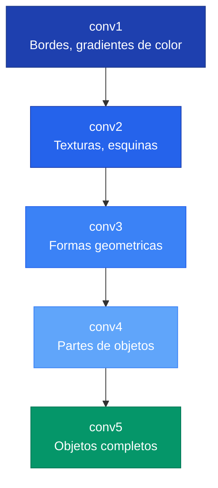
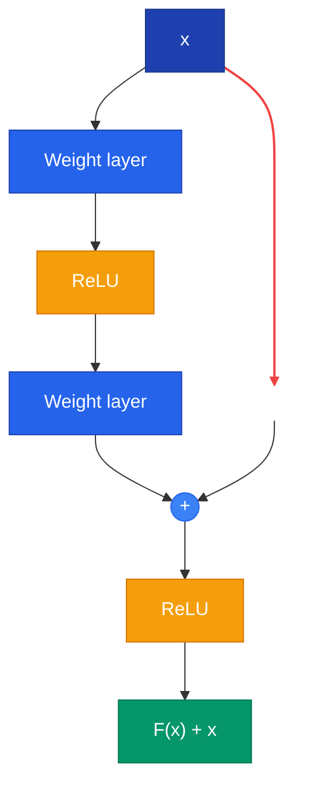

Las redes convolucionales (CNNs) son la arquitectura dominante para procesamiento de imagenes. Explotan la estructura espacial de los datos visuales mediante tres principios: **conectividad local**, **comparticion de pesos** y **equivarianza traslacional**.

---

## 1. Por que CNNs y no MLPs

Un MLP que recibe una imagen de 224x224x3 necesitaria 150,528 pesos **por neurona** en la primera capa -- ineficiente e incapaz de generalizar. Las CNNs resuelven esto usando **filtros** pequenos que se deslizan sobre la imagen:

- **Conectividad local:** cada neurona ve solo un parche pequeno de la imagen
- **Comparticion de pesos:** el mismo filtro se aplica en todas las posiciones
- **Equivarianza traslacional:** si el objeto se mueve, las activaciones se mueven igual

---

## 2. La Operacion de Convolucion

Un filtro es una pequena matriz de pesos aprendibles. En cada posicion, se calcula el **producto punto** entre el filtro y el parche de imagen:

```text
Imagen (3x3):        Filtro (3x3):         Resultado:
+---+---+---+        +----+----+----+
| 1 | 2 | 3 |        |  0 | -1 |  0 |
+---+---+---+   x    +----+----+----+   =   5
| 4 | 5 | 6 |        | -1 |  5 | -1 |
+---+---+---+        +----+----+----+
| 7 | 8 | 9 |        |  0 | -1 |  0 |
+---+---+---+        +----+----+----+
```

### Dimension de salida


O = \left\lfloor \frac{I - K + 2P}{S} \right\rfloor + 1


Donde $I$ = entrada, $K$ = kernel, $P$ = padding, $S$ = stride.

### Parametros por capa

$$\text{params} = C_{\text{out}} \times (C_{\text{in}} \times K_H \times K_W + 1)$$

---

## 3. Jerarquia de Caracteristicas

Cada capa ve la salida de la anterior. Esto produce una jerarquia emergente:




El **campo receptivo** de una neurona crece con la profundidad. Apilar capas 3x3 es mas eficiente que usar filtros grandes: 2 capas de 3x3 cubren un campo de 5x5 con 28% menos parametros y una no-linealidad extra.


---

## 4. MaxPooling e Invarianza

**MaxPool** reduce el tamano espacial y proporciona invarianza a pequenos desplazamientos: aunque la activacion se mueva un pixel, el maximo de la ventana sigue siendo el mismo.

---

## 5. Timeline de Arquitecturas

### AlexNet (2012) -- El Big Bang del Deep Learning

- 60M parametros, 8 capas
- Innovaciones: ReLU, Dropout, entrenamiento en GPU
- Redujo el error Top-5 en ImageNet de 26% a 16.4%

### VGG (2014) -- Profundidad con Simplicidad

Uso exclusivamente filtros 3x3, demostrando que la profundidad importa mas que el tamano del filtro.

```text
Bloques: conv3-64 x2 -> conv3-128 x2 -> conv3-256 x3 -> conv3-512 x3 -> conv3-512 x3
Espacio: 224 -> 112 -> 56 -> 28 -> 14 -> 7
Canales:   3 ->  64 -> 128 -> 256 -> 512 -> 512
```

Patron clave: doblar canales al reducir espacio.

### GoogLeNet / Inception (2014) -- Eficiencia


**Inception usa filtros de multiples escalas en paralelo** (1x1, 3x3, 5x5) y los concatena. Las **convoluciones 1x1** antes de los filtros grandes reducen canales, logrando ~90% menos parametros. GoogLeNet tiene solo 6.8M parametros (vs 138M de VGG-16).


Otras innovaciones:
- **Global Average Pooling** en vez de capas FC (reduce 122M a 1M parametros)
- **Clasificadores auxiliares** en capas intermedias para combatir vanishing gradient

### ResNet (2015) -- Profundidad Sin Limites

El problema: una red plain de 56 capas tiene **mayor error** que una de 20 (no es overfitting, es un problema de optimizacion).

La solucion: **conexiones residuales** (skip connections):


H(x) = F(x) + x




Si la identidad es optima, basta con llevar $F(x)$ a cero -- mucho mas facil que aprender la identidad directamente.

**ResNet-50+** usa **Bottleneck blocks** (1x1 reduce, 3x3 convolucion, 1x1 restaura) para eficiencia.

### Resumen Comparativo

| Arquitectura | Ano | Parametros | Top-5 Error | Innovacion clave |
|---|---|---|---|---|
| AlexNet | 2012 | ~60M | 16.4% | ReLU, Dropout, GPU |
| VGG-16 | 2014 | 138M | 7.3% | Profundidad + filtros 3x3 |
| GoogLeNet | 2014 | 6.8M | 6.7% | Inception + 1x1 conv |
| ResNet-50 | 2015 | 25M | 3.57% | Skip connections |

En 2015, ResNet supero el rendimiento humano (~5% Top-5 error) en ImageNet.

---

## 6. Interpretabilidad

Despues de entrenar, podemos preguntar: **que aprendio realmente la red?**

### Feature Visualization

Actualizar la imagen (no los pesos) para maximizar activaciones -- **gradient ascent en el input**:

$$x^* = \arg\max_x \; \text{activacion}(\text{red}(x))$$

### Attribution

Responde: que region de **esta** imagen causo **esta** prediccion.

| Metodo | Tipo | Descripcion |
|---|---|---|
| Gradient | Backprop | $\partial\text{output}/\partial\text{input}$ |
| Grad-CAM | Backprop | Mapas de calor semanticos |
| Occlusion | Perturbacion | Desliza parche negro, mide caida |
| Extremal Perturbation | Perturbacion | Aprende mascara optima |


La interpretabilidad es critica para detectar **sesgos**. Ejemplo real: una red clasificaba "caballo" basandose en un watermark de copyright, no en el animal. Los metodos de attribution lo revelaron.


---

## Para Profundizar

- [Clase 05 - AlexNet](/clases/clase-05/) -- Arquitectura original, adaptaciones
- [Clase 09 - Arquitecturas Profundas](/clases/clase-09/) -- VGG, Inception, ResNet, interpretabilidad
- [Paper: VGGNet (Simonyan & Zisserman, 2014)](/papers/vggnet-simonyan-2014/)
- [Paper: GoogLeNet (Szegedy et al., 2014)](/papers/googlenet-szegedy-2014/)
- [Paper: ResNet (He et al., 2015)](/papers/resnet-he-2015/)
