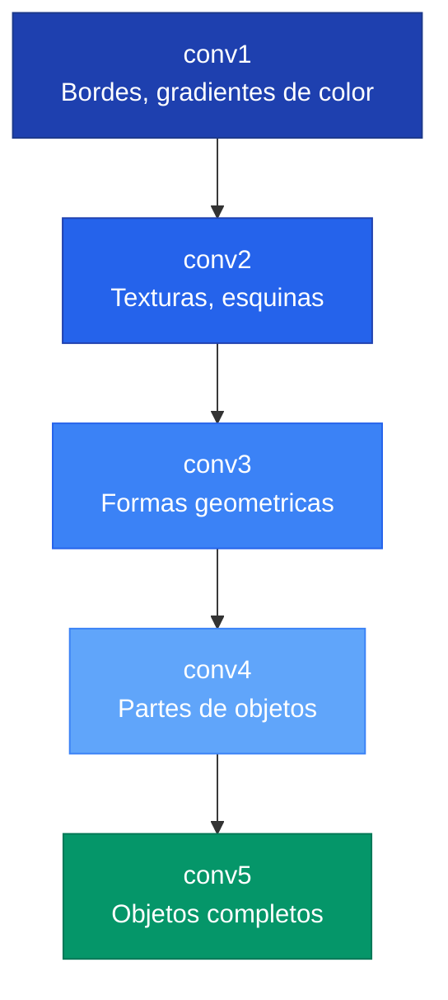
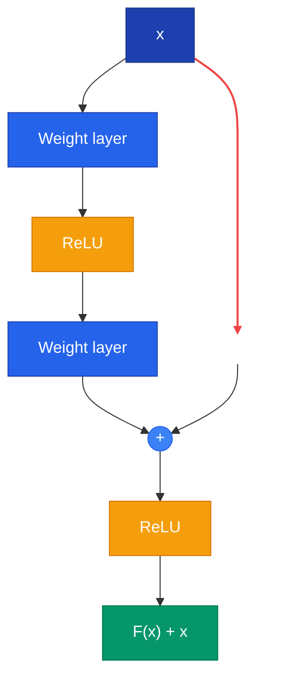

Las redes convolucionales (CNNs) son la arquitectura dominante para procesamiento de imagenes. Explotan la estructura espacial de los datos visuales mediante tres principios: **conectividad local**, **comparticion de pesos** y **equivarianza traslacional**.

---

## 1. Por que CNNs y no MLPs

Un MLP que recibe una imagen de 224x224x3 necesitaria 150,528 pesos **por neurona** en la primera capa -- ineficiente e incapaz de generalizar. Las CNNs resuelven esto usando **filtros** pequenos que se deslizan sobre la imagen:

- **Conectividad local:** cada neurona ve solo un parche pequeno de la imagen
- **Comparticion de pesos:** el mismo filtro se aplica en todas las posiciones
- **Equivarianza traslacional:** si el objeto se mueve, las activaciones se mueven igual

---

## 2. La Operacion de Convolucion

Un filtro es una pequena matriz de pesos aprendibles. En cada posicion, se calcula el **producto punto** entre el filtro y el parche de imagen:

```text
Imagen (3x3):        Filtro (3x3):         Resultado:
+---+---+---+        +----+----+----+
| 1 | 2 | 3 |        |  0 | -1 |  0 |
+---+---+---+   x    +----+----+----+   =   5
| 4 | 5 | 6 |        | -1 |  5 | -1 |
+---+---+---+        +----+----+----+
| 7 | 8 | 9 |        |  0 | -1 |  0 |
+---+---+---+        +----+----+----+
```

### Dimension de salida


O = \left\lfloor \frac{I - K + 2P}{S} \right\rfloor + 1


Donde $I$ = entrada, $K$ = kernel, $P$ = padding, $S$ = stride.

### Parametros por capa

$$\text{params} = C_{\text{out}} \times (C_{\text{in}} \times K_H \times K_W + 1)$$



```python
import torch
import torch.nn as nn

# Crear una capa Conv2d con kernel personalizado
conv = nn.Conv2d(in_channels=1, out_channels=1, kernel_size=3, bias=False)

# Definir un filtro detector de bordes manualmente
filtro_bordes = torch.tensor([[[[0., -1., 0.],
                                [-1.,  5., -1.],
                                [0., -1., 0.]]]])
conv.weight = nn.Parameter(filtro_bordes)

# Aplicar a una imagen de ejemplo (batch=1, canales=1, 5x5)
imagen = torch.randn(1, 1, 5, 5)
salida = conv(imagen)
print(f"Entrada: {imagen.shape} -> Salida: {salida.shape}")
```


```python
import tensorflow as tf
import numpy as np

# Crear una capa Conv2D con kernel personalizado
filtro_bordes = np.array([[[[0.]], [[-1.]], [[0.]]],
                           [[[-1.]], [[5.]], [[-1.]]],
                           [[[0.]], [[-1.]], [[0.]]]], dtype=np.float32)

conv = tf.keras.layers.Conv2D(filters=1, kernel_size=3, use_bias=False,
                               kernel_initializer=tf.constant_initializer(filtro_bordes))

# Aplicar a una imagen de ejemplo (batch=1, 5x5, canales=1)
imagen = tf.random.normal((1, 5, 5, 1))
salida = conv(imagen)
print(f"Entrada: {imagen.shape} -> Salida: {salida.shape}")
```


```python
import jax
import jax.numpy as jnp
from jax import lax

# Definir un filtro detector de bordes manualmente
filtro_bordes = jnp.array([[[[0., -1., 0.],
                             [-1.,  5., -1.],
                             [0., -1., 0.]]]])

# Imagen de ejemplo (batch=1, canales=1, 5x5)
imagen = jax.random.normal(jax.random.PRNGKey(0), (1, 1, 5, 5))

# Aplicar convolucion usando lax.conv
salida = lax.conv(imagen, filtro_bordes, window_strides=(1, 1), padding='VALID')
print(f"Entrada: {imagen.shape} -> Salida: {salida.shape}")
```



---

## 3. Jerarquia de Caracteristicas

Cada capa ve la salida de la anterior. Esto produce una jerarquia emergente:




El **campo receptivo** de una neurona crece con la profundidad. Apilar capas 3x3 es mas eficiente que usar filtros grandes: 2 capas de 3x3 cubren un campo de 5x5 con 28% menos parametros y una no-linealidad extra.


---

## 4. MaxPooling e Invarianza

**MaxPool** reduce el tamano espacial y proporciona invarianza a pequenos desplazamientos: aunque la activacion se mueva un pixel, el maximo de la ventana sigue siendo el mismo.

---

## 5. Timeline de Arquitecturas

### AlexNet (2012) -- El Big Bang del Deep Learning

- 60M parametros, 8 capas
- Innovaciones: ReLU, Dropout, entrenamiento en GPU
- Redujo el error Top-5 en ImageNet de 26% a 16.4%



```python
import torch
from torchvision import models

# Cargar AlexNet preentrenado con los pesos de ImageNet
alexnet = models.alexnet(weights=models.AlexNet_Weights.IMAGENET1K_V1)
alexnet.eval()

# Imagen ficticia (batch=1, 3 canales, 224x224)
imagen = torch.randn(1, 3, 224, 224)

# Inferencia sin calcular gradientes
with torch.no_grad():
    prediccion = alexnet(imagen)

print(f"Forma de salida: {prediccion.shape}")  # [1, 1000] clases ImageNet
print(f"Clase predicha: {prediccion.argmax(dim=1).item()}")
```


```python
import tensorflow as tf
import numpy as np

# TF no tiene AlexNet nativo; usar modelo desde tf.keras.applications
# Alternativa: cargar desde tensorflow_hub o definir manualmente
# Aqui usamos un modelo similar disponible nativamente
from tensorflow.keras.applications import VGG16

# Nota: para AlexNet especifico, ver implementaciones en TF Hub
modelo = tf.keras.applications.VGG16(weights='imagenet', include_top=True)

# Imagen ficticia (batch=1, 224x224, 3 canales)
imagen = np.random.randn(1, 224, 224, 3).astype(np.float32)
prediccion = modelo.predict(imagen)
print(f"Clase predicha: {np.argmax(prediccion)}")
```


```python
import jax
import jax.numpy as jnp
from flax import linen as nn

# Definir una version simplificada de AlexNet en Flax
class AlexNetSimple(nn.Module):
    num_clases: int = 1000

    @nn.compact
    def __call__(self, x):
        x = nn.Conv(64, (11, 11), strides=4, padding='VALID')(x)
        x = nn.relu(x)
        x = nn.max_pool(x, (3, 3), strides=(2, 2))
        x = x.reshape((x.shape[0], -1))  # Aplanar
        x = nn.Dense(self.num_clases)(x)
        return x

# Inicializar modelo con imagen ficticia
modelo = AlexNetSimple()
params = modelo.init(jax.random.PRNGKey(0), jnp.ones((1, 224, 224, 3)))
```



### VGG (2014) -- Profundidad con Simplicidad

Uso exclusivamente filtros 3x3, demostrando que la profundidad importa mas que el tamano del filtro.

```text
Bloques: conv3-64 x2 -> conv3-128 x2 -> conv3-256 x3 -> conv3-512 x3 -> conv3-512 x3
Espacio: 224 -> 112 -> 56 -> 28 -> 14 -> 7
Canales:   3 ->  64 -> 128 -> 256 -> 512 -> 512
```

Patron clave: doblar canales al reducir espacio.

### GoogLeNet / Inception (2014) -- Eficiencia


**Inception usa filtros de multiples escalas en paralelo** (1x1, 3x3, 5x5) y los concatena. Las **convoluciones 1x1** antes de los filtros grandes reducen canales, logrando ~90% menos parametros. GoogLeNet tiene solo 6.8M parametros (vs 138M de VGG-16).


Otras innovaciones:
- **Global Average Pooling** en vez de capas FC (reduce 122M a 1M parametros)
- **Clasificadores auxiliares** en capas intermedias para combatir vanishing gradient

### ResNet (2015) -- Profundidad Sin Limites

El problema: una red plain de 56 capas tiene **mayor error** que una de 20 (no es overfitting, es un problema de optimizacion).

La solucion: **conexiones residuales** (skip connections):


H(x) = F(x) + x




Si la identidad es optima, basta con llevar $F(x)$ a cero -- mucho mas facil que aprender la identidad directamente.

**ResNet-50+** usa **Bottleneck blocks** (1x1 reduce, 3x3 convolucion, 1x1 restaura) para eficiencia.



```python
import torch
import torch.nn as nn

# Bloque residual basico con skip connection
class BloqueResidual(nn.Module):
    def __init__(self, canales):
        super().__init__()
        self.conv1 = nn.Conv2d(canales, canales, 3, padding=1)
        self.bn1 = nn.BatchNorm2d(canales)
        self.conv2 = nn.Conv2d(canales, canales, 3, padding=1)
        self.bn2 = nn.BatchNorm2d(canales)
        self.relu = nn.ReLU()

    def forward(self, x):
        residual = x  # Guardar entrada para skip connection
        out = self.relu(self.bn1(self.conv1(x)))
        out = self.bn2(self.conv2(out))
        out += residual  # Sumar skip connection
        return self.relu(out)

bloque = BloqueResidual(64)
x = torch.randn(1, 64, 32, 32)
print(f"Entrada: {x.shape} -> Salida: {bloque(x).shape}")
```


```python
import tensorflow as tf

# Bloque residual basico con skip connection
class BloqueResidual(tf.keras.layers.Layer):
    def __init__(self, canales):
        super().__init__()
        self.conv1 = tf.keras.layers.Conv2D(canales, 3, padding='same')
        self.bn1 = tf.keras.layers.BatchNormalization()
        self.conv2 = tf.keras.layers.Conv2D(canales, 3, padding='same')
        self.bn2 = tf.keras.layers.BatchNormalization()

    def call(self, x):
        residual = x  # Guardar entrada para skip connection
        out = tf.nn.relu(self.bn1(self.conv1(x)))
        out = self.bn2(self.conv2(out))
        out += residual  # Sumar skip connection
        return tf.nn.relu(out)

bloque = BloqueResidual(64)
x = tf.random.normal((1, 32, 32, 64))
print(f"Entrada: {x.shape} -> Salida: {bloque(x).shape}")
```


```python
import jax
import jax.numpy as jnp
from flax import linen as nn

# Bloque residual basico con skip connection
class BloqueResidual(nn.Module):
    canales: int

    @nn.compact
    def __call__(self, x, train=True):
        residual = x  # Guardar entrada para skip connection
        out = nn.Conv(self.canales, (3, 3), padding='SAME')(x)
        out = nn.BatchNorm(use_running_average=not train)(out)
        out = nn.relu(out)
        out = nn.Conv(self.canales, (3, 3), padding='SAME')(out)
        out = nn.BatchNorm(use_running_average=not train)(out)
        out += residual  # Sumar skip connection
        return nn.relu(out)

bloque = BloqueResidual(canales=64)
variables = bloque.init(jax.random.PRNGKey(0), jnp.ones((1, 32, 32, 64)))
```



### Resumen Comparativo

| Arquitectura | Ano | Parametros | Top-5 Error | Innovacion clave |
|---|---|---|---|---|
| AlexNet | 2012 | ~60M | 16.4% | ReLU, Dropout, GPU |
| VGG-16 | 2014 | 138M | 7.3% | Profundidad + filtros 3x3 |
| GoogLeNet | 2014 | 6.8M | 6.7% | Inception + 1x1 conv |
| ResNet-50 | 2015 | 25M | 3.57% | Skip connections |

En 2015, ResNet supero el rendimiento humano (~5% Top-5 error) en ImageNet.

---

## 6. Interpretabilidad

Despues de entrenar, podemos preguntar: **que aprendio realmente la red?**

### Feature Visualization

Actualizar la imagen (no los pesos) para maximizar activaciones -- **gradient ascent en el input**:

$$x^* = \arg\max_x \; \text{activacion}(\text{red}(x))$$

### Attribution

Responde: que region de **esta** imagen causo **esta** prediccion.

| Metodo | Tipo | Descripcion |
|---|---|---|
| Gradient | Backprop | $\partial\text{output}/\partial\text{input}$ |
| Grad-CAM | Backprop | Mapas de calor semanticos |
| Occlusion | Perturbacion | Desliza parche negro, mide caida |
| Extremal Perturbation | Perturbacion | Aprende mascara optima |


La interpretabilidad es critica para detectar **sesgos**. Ejemplo real: una red clasificaba "caballo" basandose en un watermark de copyright, no en el animal. Los metodos de attribution lo revelaron.




```python
import torch
from torchvision import models, transforms
from PIL import Image

# Cargar modelo preentrenado
modelo = models.resnet50(weights=models.ResNet50_Weights.IMAGENET1K_V1)
modelo.eval()

# Registrar hook para capturar activaciones y gradientes
activaciones = {}
def hook_forward(module, input, output):
    activaciones['valor'] = output.detach()
def hook_backward(module, grad_in, grad_out):
    activaciones['gradiente'] = grad_out[0].detach()

# Hook en la ultima capa convolucional
modelo.layer4[-1].register_forward_hook(hook_forward)
modelo.layer4[-1].register_full_backward_hook(hook_backward)

# Imagen de ejemplo (reemplazar con imagen real)
imagen = torch.randn(1, 3, 224, 224, requires_grad=True)
salida = modelo(imagen)
clase_pred = salida.argmax(dim=1)

# Backprop desde la clase predicha
modelo.zero_grad()
salida[0, clase_pred].backward()

# Calcular Grad-CAM: promediar gradientes y ponderar activaciones
pesos = activaciones['gradiente'].mean(dim=[2, 3], keepdim=True)
gradcam = (pesos * activaciones['valor']).sum(dim=1, keepdim=True)
gradcam = torch.relu(gradcam)  # Solo contribuciones positivas
print(f"Mapa Grad-CAM: {gradcam.shape}")  # [1, 1, 7, 7]
```


```python
import tensorflow as tf
import numpy as np

# Cargar modelo preentrenado
modelo = tf.keras.applications.ResNet50(weights='imagenet')

# Crear sub-modelo que devuelve activaciones + prediccion
ultima_conv = modelo.get_layer('conv5_block3_out')
modelo_gradcam = tf.keras.Model(
    inputs=modelo.input,
    outputs=[ultima_conv.output, modelo.output]
)

# Imagen de ejemplo (reemplazar con imagen real)
imagen = tf.random.normal((1, 224, 224, 3))

# Calcular gradientes con GradientTape
with tf.GradientTape() as tape:
    tape.watch(imagen)
    activaciones, prediccion = modelo_gradcam(imagen)
    clase_pred = tf.argmax(prediccion[0])
    score = prediccion[0, clase_pred]

# Gradientes respecto a las activaciones
gradientes = tape.gradient(score, activaciones)
pesos = tf.reduce_mean(gradientes, axis=[1, 2], keepdims=True)
gradcam = tf.nn.relu(tf.reduce_sum(pesos * activaciones, axis=-1))
print(f"Mapa Grad-CAM: {gradcam.shape}")  # (1, 7, 7)
```


```python
import jax
import jax.numpy as jnp
from flax import linen as nn

# Grad-CAM conceptual en JAX/Flax
# Requiere acceso a activaciones intermedias via capture_intermediates

class ModeloConCaptura(nn.Module):
    @nn.compact
    def __call__(self, x):
        # Capa convolucional cuyas activaciones queremos inspeccionar
        x = nn.Conv(64, (3, 3), padding='SAME', name='ultima_conv')(x)
        x = nn.relu(x)
        activaciones = x  # Capturar para Grad-CAM
        x = jnp.mean(x, axis=(1, 2))  # Global average pooling
        x = nn.Dense(1000)(x)
        return x, activaciones

# Funcion para calcular Grad-CAM
def gradcam(params, imagen, clase):
    def score_fn(img):
        logits, acts = modelo.apply(params, img)
        return logits[0, clase], acts
    (score, activaciones), gradientes = jax.value_and_grad(
        lambda img: score_fn(img)[0], has_aux=False)(imagen)
    # Ponderar activaciones por gradientes promedio
    return jnp.maximum(activaciones * gradientes, 0)
```



---

## Para Profundizar

- [Clase 05 - AlexNet](/clases/clase-05/) -- Arquitectura original, adaptaciones
- [Clase 09 - Arquitecturas Profundas](/clases/clase-09/) -- VGG, Inception, ResNet, interpretabilidad
- [Paper: VGGNet (Simonyan & Zisserman, 2014)](/papers/vggnet-simonyan-2014/)
- [Paper: GoogLeNet (Szegedy et al., 2014)](/papers/googlenet-szegedy-2014/)
- [Paper: ResNet (He et al., 2015)](/papers/resnet-he-2015/)
