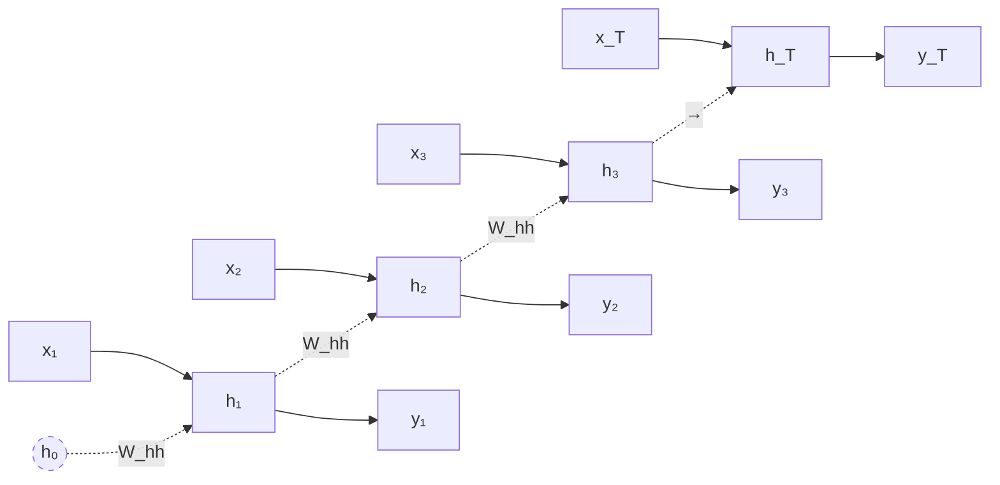
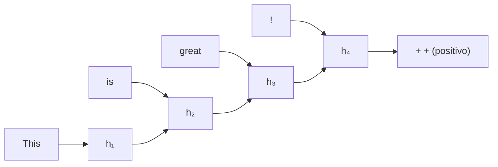
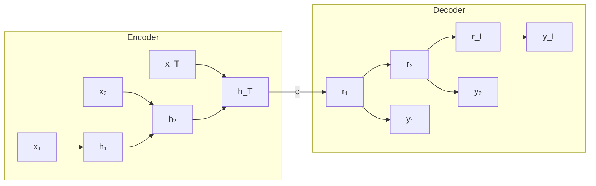
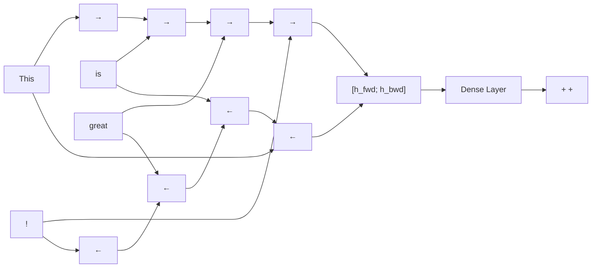

Las **redes neuronales recurrentes** (RNNs) son la familia de arquitecturas dominante para procesamiento de **datos secuenciales** -- texto, audio, video, series temporales. A diferencia de las CNNs, que asumen entradas de dimension fija y explotan estructura espacial, las RNNs procesan secuencias de **longitud variable** explotando estructura temporal mediante un **estado oculto** que persiste entre pasos.

---

## 1. Por que RNNs y no MLPs/CNNs

Una MLP requiere entrada de dimension fija. Una CNN procesa entradas espaciales con patrones locales pero no captura naturalmente dependencias temporales arbitrariamente largas. Para problemas como traduccion automatica, reconocimiento de voz o generacion de texto, la longitud de la entrada y la salida no es conocida a priori.

Las RNNs resuelven esto con tres propiedades clave:

| Propiedad | Que aporta |
|---|---|
| **Estado oculto recurrente** | Resumen acumulativo de la historia de la secuencia |
| **Comparticion de pesos en el tiempo** | Mismos parametros aplicados en cada paso $t$, permite secuencias de longitud variable |
| **Profundidad implicita** | La red desplegada en el tiempo es equivalente a una red feedforward muy profunda |


La **comparticion profunda de parametros** ("deep parameter sharing") es la propiedad fundamental que distingue a las RNNs. La misma matriz $W_{hh}$ se aplica en todos los pasos temporales, lo que permite generalizar a secuencias de cualquier longitud y modelar interacciones entre elementos arbitrariamente distantes.


---

## 2. Definicion Formal

Dada una secuencia de entrada $X = \{x_1, x_2, \ldots, x_T\}$ con $x_t \in \mathbb{R}^{d_x}$, una RNN mantiene un **estado oculto** $h_t \in \mathbb{R}^{d_h}$ actualizado segun:

$$h_t = f(h_{t-1}, x_t; \theta)$$

donde $f$ es una funcion parametrica diferenciable y $\theta$ son los parametros aprendidos. El estado inicial $h_0$ suele ser cero o aprendible.

### Configuracion clasica (vanilla RNN)

La parametrizacion mas simple usa una transformacion afin seguida de una no linealidad:

$$h_t = \sigma(W_{hh} \, h_{t-1} + W_{xh} \, x_t + b_h)$$

donde:

- $W_{xh} \in \mathbb{R}^{d_h \times d_x}$ -- matriz **entrada → oculto**
- $W_{hh} \in \mathbb{R}^{d_h \times d_h}$ -- matriz **oculto → oculto** (recurrente)
- $b_h \in \mathbb{R}^{d_h}$ -- bias
- $\sigma$ -- no linealidad, tipicamente $\tanh$ o sigmoide

Para producir una salida $y_t$ se anade una capa lineal con softmax o sigmoide segun la tarea:

$$y_t = \text{softmax}(W_{hy} \, h_t + b_y)$$

---

## 3. Despliegue en el Tiempo

El concepto crucial es que una RNN se puede **desplegar** ("unroll") en una red feedforward profunda donde cada capa corresponde a un paso temporal. Todas las "capas" comparten los mismos pesos.



Esta vista desplegada es la base del algoritmo de entrenamiento ([backpropagation through time](backpropagation-through-time)).

---

## 4. Configuraciones Tipicas

Segun la relacion entre la longitud de la entrada y la salida, las RNNs se clasifican en cinco patrones canonicos:

| Configuracion | Entrada → Salida | Ejemplo |
|---|---|---|
| **One-to-one** | $1 \to 1$ | Clasificacion estandar (no requiere RNN) |
| **One-to-many** | $1 \to T$ | Generacion de texto desde una imagen, music generation |
| **Many-to-one** | $T \to 1$ | Sentiment analysis, clasificacion de secuencia |
| **Many-to-many (sincronico)** | $T \to T$ | Etiquetado POS, video frame labeling |
| **Many-to-many (asincronico / seq2seq)** | $T \to T'$ | Traduccion automatica, resumen, Q&A |

### Many-to-one (sentiment analysis)

Solo el ultimo estado oculto $h_T$ se usa para producir la prediccion:



### Encoder-decoder (seq2seq)

La entrada se codifica en un vector de contexto $c$ (ultimo estado del encoder), que inicializa al decoder. Es la arquitectura fundamental para traduccion automatica antes de la era Transformer.



Ver [Sutskever et al. 2014](/papers/seq2seq-sutskever-2014) para los detalles experimentales originales.

---

## 5. RNN Bidireccional

En tareas donde el contexto **futuro** tambien es informativo (etiquetado, comprension de lectura), se usan dos RNNs en paralelo: una procesa la secuencia hacia adelante y otra hacia atras. Las salidas se concatenan:

$$h_t = [\overrightarrow{h_t}; \overleftarrow{h_t}]$$



Las RNNs bidireccionales **no son aplicables** a tareas online (generacion en streaming) porque requieren conocer toda la secuencia.

---

## 6. RNN Profunda (Stacked)

Apilar varias capas recurrentes aumenta la capacidad representacional. La salida de la capa $\ell$ en el paso $t$ alimenta la capa $\ell+1$ en el mismo paso:

$$h_t^{(\ell)} = \sigma(W_{hh}^{(\ell)} h_{t-1}^{(\ell)} + W_{xh}^{(\ell)} h_t^{(\ell-1)})$$

con $h_t^{(0)} = x_t$. En la practica, **2-4 capas** suelen ser suficientes; mas capas raramente compensan el costo de entrenamiento.

---

## 7. Aplicaciones Canonicas

### Modelo de lenguaje a nivel de caracter

Vocabulario $V = \{h, e, l, o\}$, secuencia de entrada `"hell"`, target `"ello"`. Cada paso predice el siguiente caracter mediante softmax. En tiempo de inferencia se **muestrea** un caracter y se realimenta:

```text
input:  h → e → l → l
                          \
output: e   l   l   o ...  → secuencia generada
```

Este patron entrenado sobre las obras de Shakespeare produce texto que conserva la estructura sintactica del original (ver Karpathy 2015, "The Unreasonable Effectiveness of RNNs").

### Image captioning

Un **CNN** (ej. VGG sin las dos ultimas capas FC) extrae un embedding de la imagen $v \in \mathbb{R}^{4096}$. Una RNN/LSTM toma $v$ como contexto inicial y genera la descripcion palabra por palabra:

$$h_t = \tanh(W_{xh} \, x_t + W_{hh} \, h_{t-1} + W_{ih} \, v)$$

Ver [Show and Tell, Vinyals et al. 2015](/papers/show-and-tell-vinyals-2015) para el modelo NIC original.

### Otras aplicaciones

- **Reconocimiento de voz** (audio → transcripcion)
- **Traduccion automatica** (seq2seq)
- **Q&A end-to-end** (texto → texto)
- **Target tracking en video** (secuencia de frames → bounding boxes)
- **Generacion musical** (one-to-many)

---

## 8. Limitaciones de la RNN Vanilla

Aunque elegante, la RNN basica tiene dos problemas serios cuando las secuencias son largas:

### 8.1 Vanishing gradient

Durante backpropagation through time, el gradiente se multiplica repetidamente por $W_{hh}^T \, \text{diag}(\sigma'(h))$. Si el mayor valor singular de $W_{hh}$ es $< 1/\gamma$ (donde $\gamma = 1$ para tanh, $\gamma = 1/4$ para sigmoide), las contribuciones de pasos lejanos **decaen exponencialmente** y la red no puede aprender dependencias largas.

### 8.2 Exploding gradient

Si el mayor valor singular es $> 1/\gamma$, las contribuciones **explotan**, generando actualizaciones de pesos catastroficas y perdida NaN.


**Pascanu et al. 2013** dieron la condicion formal: $\lambda_1 < 1/\gamma$ es **suficiente** para vanishing y $\lambda_1 > 1/\gamma$ es **necesario** para exploding. La solucion practica para exploding es **gradient clipping**; la solucion para vanishing son las **arquitecturas con compuertas** (LSTM, GRU).


Ver el fundamento dedicado: [Backpropagation Through Time](backpropagation-through-time).

### 8.3 Soluciones

| Problema | Solucion |
|---|---|
| Exploding gradient | **Gradient norm clipping** (Pascanu 2013) |
| Vanishing gradient | **LSTM** (Hochreiter & Schmidhuber 1997), **GRU** (Cho 2014) |
| Inicializacion mala | Inicializacion ortogonal de $W_{hh}$, identity initialization |
| Saturacion de tanh/sigmoide | ReLU recurrente con cuidado (IRNN, Le et al. 2015) |

---

## 9. RNN vs CNN para Secuencias

Las CNNs 1D tambien procesan secuencias (ej. WaveNet, ByteNet). Comparacion:

| Aspecto | RNN | CNN 1D |
|---|---|---|
| **Longitud variable** | Nativa | Requiere padding/truncado |
| **Paralelizable en el tiempo** | No (dependencia secuencial) | Si |
| **Receptive field** | Teoricamente infinito | Limitado por profundidad y dilatacion |
| **Modela orden** | Si, intrinsecamente | Solo dentro del kernel |
| **Memoria de largo plazo** | Dificil (vanishing) | Dilataciones causales |

En la practica moderna, los **Transformers** (que veremos mas adelante) reemplazaron tanto RNNs como CNNs para la mayoria de tareas de NLP.

---

## 10. Implementacion en PyTorch



```python
import torch
import torch.nn as nn

class VanillaRNN(nn.Module):
    def __init__(self, input_size, hidden_size, num_classes):
        super().__init__()
        self.rnn = nn.RNN(input_size, hidden_size, batch_first=True, nonlinearity='tanh')
        self.fc = nn.Linear(hidden_size, num_classes)

    def forward(self, x):
        # x: (batch, seq_len, input_size)
        out, h_n = self.rnn(x)        # out: (batch, seq_len, hidden_size)
        return self.fc(out[:, -1, :])  # tomar el ultimo paso

# Bidireccional
rnn_bi = nn.RNN(input_size=10, hidden_size=32, bidirectional=True, batch_first=True)

# Stacked
rnn_deep = nn.RNN(input_size=10, hidden_size=32, num_layers=3, batch_first=True)
```


```python
import jax
import jax.numpy as jnp
from flax import linen as nn

class VanillaRNN(nn.Module):
    hidden_size: int
    num_classes: int

    @nn.compact
    def __call__(self, x):
        # x: (batch, seq_len, input_size)
        # Flax nn.RNN envuelve una celda recurrente
        cell = nn.SimpleCell(features=self.hidden_size)
        rnn = nn.RNN(cell)
        out = rnn(x)                  # (batch, seq_len, hidden_size)
        return nn.Dense(self.num_classes)(out[:, -1, :])

# Bidireccional
bi_rnn = nn.Bidirectional(
    forward_rnn=nn.RNN(nn.SimpleCell(features=32)),
    backward_rnn=nn.RNN(nn.SimpleCell(features=32)),
)

# Stacked: apilar varias celdas
deep_rnn = nn.RNN(nn.SimpleCell(features=32), reverse=False)
# En la practica se define como una secuencia de modulos RNN
```


```python
import tensorflow as tf

model = tf.keras.Sequential([
    tf.keras.layers.SimpleRNN(32, return_sequences=False, activation='tanh'),
    tf.keras.layers.Dense(num_classes, activation='softmax')
])

# Bidireccional
bi = tf.keras.layers.Bidirectional(tf.keras.layers.SimpleRNN(32))

# Stacked: return_sequences=True para todas excepto la ultima
deep = tf.keras.Sequential([
    tf.keras.layers.SimpleRNN(32, return_sequences=True),
    tf.keras.layers.SimpleRNN(32, return_sequences=True),
    tf.keras.layers.SimpleRNN(32),
])
```



---

## 11. Resumen

- **RNN** = red con estado oculto recurrente $h_t = f(h_{t-1}, x_t)$ que comparte parametros en el tiempo.
- **Cinco configuraciones**: one-to-one, one-to-many, many-to-one, many-to-many sincronico, encoder-decoder.
- **Bidireccional**: combina contexto pasado y futuro, no aplicable online.
- **Stacked/Deep**: apilar capas recurrentes aumenta capacidad.
- **Limitacion principal**: vanishing/exploding gradient en secuencias largas.
- **Soluciones**: gradient clipping para exploding, LSTM/GRU para vanishing.

Ver tambien: [LSTM y GRU](lstm-gru) · [Backpropagation Through Time](backpropagation-through-time) · [Clase 11 - RNNs](/clases/clase-11).
