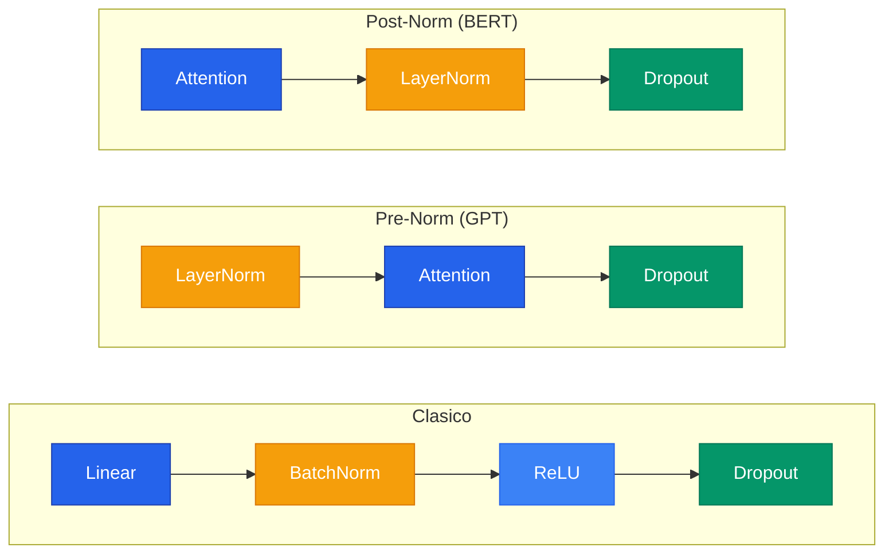

La regularizacion es el conjunto de tecnicas que previene el **overfitting**: cuando un modelo memoriza los datos de entrenamiento en vez de aprender patrones generalizables. Es especialmente critica en redes profundas, que tienen la capacidad de memorizar datasets enteros.

```text
Sin regularizacion:   Train 100%, Test 60%  <- memorizo
Con regularizacion:   Train 95%,  Test 85%  <- generaliza
```

---

## 1. L2 Regularizacion (Ridge / Weight Decay)

Penaliza la magnitud cuadratica de los pesos, incentivando pesos pequenos y distribuidos:


F(\theta) = \frac{1}{N} \sum_i L(y_i, \hat{y}_i) + \frac{\lambda}{2} \|\theta\|_2^2


La actualizacion de pesos se convierte en:

$$\theta_j \leftarrow \theta_j (1 - \eta\lambda) - \eta \frac{\partial J}{\partial \theta_j}$$

El factor $(1 - \eta\lambda)$ **encoge multiplicativamente** los pesos en cada paso -- por eso se llama "weight decay".

**Interpretacion Bayesiana:** L2 equivale a colocar un **prior Gaussiano** sobre los pesos: $P(\theta) \propto \exp(-\lambda\|\theta\|^2/2)$. Pesos grandes son a priori improbables.

```python
# L2 en PyTorch: un solo parametro en el optimizador
optimizer = optim.Adam(model.parameters(), lr=0.001, weight_decay=0.001)
```



```python
import torch
import torch.nn as nn
import torch.optim as optim

# Definir modelo simple
modelo = nn.Sequential(nn.Linear(784, 256), nn.ReLU(), nn.Linear(256, 10))

# Weight decay aplica regularizacion L2 directamente en el optimizador
optimizador = optim.AdamW(modelo.parameters(), lr=1e-3, weight_decay=1e-2)

# Entrenar normalmente - L2 se aplica automaticamente
for datos, etiquetas in dataloader:
    salida = modelo(datos)
    perdida = nn.CrossEntropyLoss()(salida, etiquetas)
    optimizador.zero_grad()
    perdida.backward()
    optimizador.step()  # weight decay se aplica aqui
```


```python
import tensorflow as tf
from tensorflow.keras import layers, regularizers

# Aplicar L2 directamente en las capas
modelo = tf.keras.Sequential([
    layers.Dense(256, activation="relu",
                 kernel_regularizer=regularizers.l2(1e-2),  # lambda = 0.01
                 input_shape=(784,)),
    layers.Dense(10)
])

# La perdida de regularizacion se agrega automaticamente
modelo.compile(optimizer=tf.keras.optimizers.Adam(1e-3),
               loss=tf.keras.losses.SparseCategoricalCrossentropy(from_logits=True))
modelo.fit(x_train, y_train, epochs=10)
```


```python
import jax
import jax.numpy as jnp
import optax

# Usar weight decay de optax (equivalente a L2)
optimizador = optax.adamw(learning_rate=1e-3, weight_decay=1e-2)

# Alternativa: calcular penalizacion L2 manualmente
def l2_penalty(params, lambda_reg=1e-2):
    """Calcula la penalizacion L2 sobre todos los parametros."""
    hojas = jax.tree_util.tree_leaves(params)
    return lambda_reg * sum(jnp.sum(p ** 2) for p in hojas)

def loss_fn(params, x, y):
    logits = modelo.apply(params, x)
    perdida = optax.softmax_cross_entropy_with_integer_labels(logits, y).mean()
    return perdida + l2_penalty(params)
```



---

## 2. L1 Regularizacion (Lasso)

$$F(\theta) = \frac{1}{N} \sum_i L(y_i, \hat{y}_i) + \lambda \|\theta\|_1$$


**L2 hace pesos chicos pero nunca cero. L1 produce sparsity:** muchos pesos se hacen exactamente cero, como si la red seleccionara automaticamente que features importan. L1 equivale a un **prior de Laplace** sobre los pesos.




```python
import torch
import torch.nn as nn

# L1 se implementa manualmente sumando la norma absoluta de los pesos
def calcular_l1(modelo, lambda_l1=1e-4):
    penalizacion = sum(p.abs().sum() for p in modelo.parameters())
    return lambda_l1 * penalizacion

# En el loop de entrenamiento
for datos, etiquetas in dataloader:
    salida = modelo(datos)
    perdida = nn.CrossEntropyLoss()(salida, etiquetas)
    perdida_total = perdida + calcular_l1(modelo)  # agregar termino L1
    optimizador.zero_grad()
    perdida_total.backward()
    optimizador.step()
```


```python
import tensorflow as tf
from tensorflow.keras import layers, regularizers

# TensorFlow/Keras tiene L1 integrado en las capas
modelo = tf.keras.Sequential([
    layers.Dense(256, activation="relu",
                 kernel_regularizer=regularizers.l1(1e-4),  # lambda = 0.0001
                 input_shape=(784,)),
    layers.Dense(10)
])

# La penalizacion L1 se suma automaticamente a la loss
modelo.compile(optimizer="adam",
               loss=tf.keras.losses.SparseCategoricalCrossentropy(from_logits=True))
```


```python
import jax
import jax.numpy as jnp

# Calcular penalizacion L1 manualmente sobre los parametros
def l1_penalty(params, lambda_l1=1e-4):
    """Suma de valores absolutos de todos los pesos."""
    hojas = jax.tree_util.tree_leaves(params)
    return lambda_l1 * sum(jnp.sum(jnp.abs(p)) for p in hojas)

def loss_fn(params, x, y):
    logits = modelo.apply(params, x)
    perdida = optax.softmax_cross_entropy_with_integer_labels(logits, y).mean()
    return perdida + l1_penalty(params)  # agregar termino L1
```



---

## 3. Elastic Net (L1 + L2)

$$R(\theta) = \alpha \|\theta\|_1 + \frac{1-\alpha}{2} \|\theta\|_2^2$$

Combina la sparsity de L1 con la estabilidad de L2.

| Regularizador | Sparsity | Diferenciable | Prior Bayesiano |
|---|---|---|---|
| **L2 (Ridge)** | No (encoge, nunca cero) | Si | Gaussiano |
| **L1 (Lasso)** | Si (ceros exactos) | No (en 0) | Laplace |
| **Elastic Net** | Si (parcial) | No (en 0) | Mixto |

---

## 4. Dropout

En cada iteracion de entrenamiento, cada neurona tiene una probabilidad $p$ de ser "apagada" (su valor se pone en 0). Esto fuerza **redundancia**: todas las neuronas deben aprender a ser utiles.

| Tipo | Que apaga | Uso |
|---|---|---|
| `Dropout(p=0.5)` | Neuronas individuales | Capas lineales |
| `Dropout2d(p=0.25)` | Canales completos | Capas convolucionales |

### Inverted Dropout

PyTorch usa **inverted dropout**: escala durante entrenamiento (divide por $1-p$) para que en inferencia no haya que hacer nada.

```text
ENTRENAMIENTO (p=0.5):
  Valores:         [2.0, 4.0, 1.0, 3.0]
  Mascara:         [1,   0,   1,   0  ]
  Aplicar mascara: [2.0, 0.0, 1.0, 0.0]
  Dividir por 0.5: [4.0, 0.0, 2.0, 0.0]  <- escala AQUI

INFERENCIA:
  Valores:         [2.0, 4.0, 1.0, 3.0]  <- no hace NADA
```

Para una cobertura completa de Dropout, ver el [paper de Srivastava et al. (2014)](/papers/dropout-srivastava-2014/).



```python
import torch.nn as nn

# Modelo con Dropout en capas lineales y Dropout2d en convolucionales
modelo = nn.Sequential(
    nn.Conv2d(3, 32, 3, padding=1), nn.ReLU(),
    nn.Dropout2d(p=0.25),          # apaga canales completos (para CNNs)
    nn.Flatten(),
    nn.Linear(32 * 32 * 32, 256), nn.ReLU(),
    nn.Dropout(p=0.5),             # apaga neuronas individuales
    nn.Linear(256, 10)
)

# IMPORTANTE: cambiar a eval() en inferencia para desactivar dropout
modelo.eval()
```


```python
import tensorflow as tf
from tensorflow.keras import layers

# Dropout se agrega como capa; Keras maneja train/eval automaticamente
modelo = tf.keras.Sequential([
    layers.Conv2D(32, 3, padding="same", activation="relu", input_shape=(32, 32, 3)),
    layers.SpatialDropout2D(0.25),  # apaga canales completos (para CNNs)
    layers.Flatten(),
    layers.Dense(256, activation="relu"),
    layers.Dropout(0.5),            # apaga neuronas individuales
    layers.Dense(10)
])

# En inferencia, Keras desactiva dropout automaticamente con model.predict()
```


```python
import flax.linen as nn
import jax

# Modelo con Dropout usando Flax
class MiModelo(nn.Module):
    @nn.compact
    def __call__(self, x, training: bool = False):
        x = nn.Dense(256)(x)
        x = nn.relu(x)
        x = nn.Dropout(rate=0.5, deterministic=not training)(x)  # necesita flag
        x = nn.Dense(10)(x)
        return x

# Dropout en JAX requiere una clave PRNG separada
salida = modelo.apply(params, datos, training=True, rngs={"dropout": jax.random.key(0)})
```



---

## 5. Batch Normalization

Normaliza las activaciones de cada capa para tener media ~0 y varianza ~1, resolviendo el problema de **Internal Covariate Shift**.

$$y = \gamma \cdot \frac{x - \mu_B}{\sigma_B} + \beta$$

Donde $\gamma$ y $\beta$ son parametros aprendibles que permiten a la red "deshacerlo" si normalizar no ayuda.


**BatchNorm normaliza por feature (columna) a traves del batch.** LayerNorm normaliza por muestra (fila). BatchNorm es ideal para CNNs; LayerNorm es ideal para Transformers. La diferencia es critica: `model.eval()` cambia el comportamiento de BatchNorm (usa running stats en vez de stats del batch actual).


| | BatchNorm | LayerNorm |
|---|---|---|
| **Ideal para** | Imagenes (CNNs) | Texto (Transformers) |
| **Normaliza** | Por feature (columna) | Por muestra (fila) |
| **Depende del batch** | Si | No |
| **train vs eval** | Distintos | Iguales |

Para mas detalles, ver el [paper de Ioffe & Szegedy (2015)](/papers/batch-norm-ioffe-2015/).



```python
import torch.nn as nn

# BatchNorm para CNNs (normaliza por canal a traves del batch)
cnn = nn.Sequential(
    nn.Conv2d(3, 64, 3, padding=1),
    nn.BatchNorm2d(64),   # entrada: (B, 64, H, W) -> normaliza por canal
    nn.ReLU(),
)

# LayerNorm para Transformers (normaliza por muestra, independiente del batch)
transformer_block = nn.Sequential(
    nn.LayerNorm(512),    # entrada: (B, seq_len, 512) -> normaliza ultima dim
    nn.MultiheadAttention(512, 8, batch_first=True),
)

# CRITICO: cambiar a eval() para que BatchNorm use running stats
cnn.eval()
```


```python
import tensorflow as tf
from tensorflow.keras import layers

# BatchNorm para CNNs
cnn = tf.keras.Sequential([
    layers.Conv2D(64, 3, padding="same", input_shape=(32, 32, 3)),
    layers.BatchNormalization(),  # normaliza por canal
    layers.ReLU(),
])

# LayerNorm para Transformers
# Normaliza las ultimas dimensiones de cada muestra
capa_norm = layers.LayerNormalization(axis=-1)  # normaliza ultima dimension
salida = capa_norm(tensor_de_entrada)  # (B, seq_len, 512) -> norm por muestra
```


```python
import flax.linen as nn

# BatchNorm en Flax requiere manejar estado mutable (running stats)
class BloqueCNN(nn.Module):
    @nn.compact
    def __call__(self, x, training: bool = False):
        x = nn.Conv(64, (3, 3), padding="SAME")(x)
        x = nn.BatchNorm(use_running_average=not training)(x)  # flag explicito
        x = nn.relu(x)
        return x

# LayerNorm no necesita estado mutable
class BloqueTransformer(nn.Module):
    @nn.compact
    def __call__(self, x):
        x = nn.LayerNorm()(x)  # normaliza ultima dimension, sin estado
        return x
```



---

## 6. Early Stopping

Monitorea la validation loss durante el entrenamiento. Si no mejora durante `patience` epocas, detiene el entrenamiento y restaura el mejor checkpoint. Ver detalles en [Learning Rate](/fundamentos/learning-rate/).

---

## 7. Data Augmentation

Genera variaciones artificiales de los datos de entrenamiento (rotaciones, flips, crops, color jitter) para aumentar efectivamente el tamano del dataset sin recolectar mas datos.



```python
from torchvision import transforms

# Pipeline de aumento para imagenes de entrenamiento
transformaciones_train = transforms.Compose([
    transforms.RandomResizedCrop(224, scale=(0.8, 1.0)),  # recorte aleatorio
    transforms.RandomHorizontalFlip(p=0.5),               # espejo horizontal
    transforms.RandomRotation(15),                         # rotacion +-15 grados
    transforms.ColorJitter(brightness=0.2, contrast=0.2),  # variacion de color
    transforms.ToTensor(),
    transforms.Normalize(mean=[0.485, 0.456, 0.406],       # normalizar ImageNet
                         std=[0.229, 0.224, 0.225]),
])

# En validacion/test NO se aplica aumento, solo resize y normalizar
transformaciones_eval = transforms.Compose([
    transforms.Resize(256),
    transforms.CenterCrop(224),
    transforms.ToTensor(),
    transforms.Normalize(mean=[0.485, 0.456, 0.406], std=[0.229, 0.224, 0.225]),
])
```


```python
import tensorflow as tf
from tensorflow.keras import layers

# Pipeline de aumento como capas del modelo (solo activas en training)
aumento = tf.keras.Sequential([
    layers.RandomFlip("horizontal"),                    # espejo horizontal
    layers.RandomRotation(0.05),                        # rotacion +-5%
    layers.RandomZoom((-0.1, 0.0)),                     # zoom aleatorio
    layers.RandomContrast(0.2),                         # variacion de contraste
])

# Integrar en el modelo directamente
modelo = tf.keras.Sequential([
    layers.Resizing(224, 224),
    aumento,                    # solo activo durante model.fit(), no en predict()
    layers.Rescaling(1.0 / 255),
    # ... resto del modelo
])
```


```python
import jax
import jax.numpy as jnp

# Aumento manual con operaciones JAX (permite JIT compilation)
def aumentar_imagen(key, imagen):
    """Aplica aumento aleatorio a una imagen (H, W, C)."""
    k1, k2, k3 = jax.random.split(key, 3)

    # Espejo horizontal aleatorio
    if jax.random.bernoulli(k1):
        imagen = jnp.flip(imagen, axis=1)

    # Brillo aleatorio (+-20%)
    factor = 1.0 + jax.random.uniform(k2, minval=-0.2, maxval=0.2)
    imagen = jnp.clip(imagen * factor, 0.0, 1.0)

    # Recorte aleatorio (de 256 a 224)
    y = jax.random.randint(k3, (), 0, 32)
    x = jax.random.randint(k3, (), 0, 32)
    imagen = jax.lax.dynamic_slice(imagen, (y, x, 0), (224, 224, 3))
    return imagen
```



---

## 8. Orden Tipico en una Capa



> NUNCA poner normalizacion en la ultima capa.

---

## 9. Combinacion de Tecnicas

Las tecnicas de regularizacion son **complementarias** y se combinan frecuentemente:

| Tecnica | Que controla | Hiperparametro clave |
|---|---|---|
| **L2 / Weight Decay** | Magnitud de pesos | $\lambda$ (0.0001 - 0.01) |
| **Dropout** | Co-adaptacion de neuronas | $p$ (0.1 - 0.5) |
| **Batch Norm** | Distribucion de activaciones | Posicion en la red |
| **Early Stopping** | Numero de epocas | patience |
| **Data Augmentation** | Tamano efectivo del dataset | Tipos de transformacion |

---

## Para Profundizar

- [Clase 07 - Conceptos](/clases/clase-07/) -- Dropout, BatchNorm, LayerNorm
- [Clase 08 - Regularizacion](/clases/clase-08/) -- L1/L2, tareas auxiliares
- [Clase 10 - Profundizacion](/clases/clase-10/profundizacion/) -- Elastic Net, interpretacion Bayesiana
- [Paper: Dropout (Srivastava et al., 2014)](/papers/dropout-srivastava-2014/)
- [Paper: Batch Normalization (Ioffe & Szegedy, 2015)](/papers/batch-norm-ioffe-2015/)
