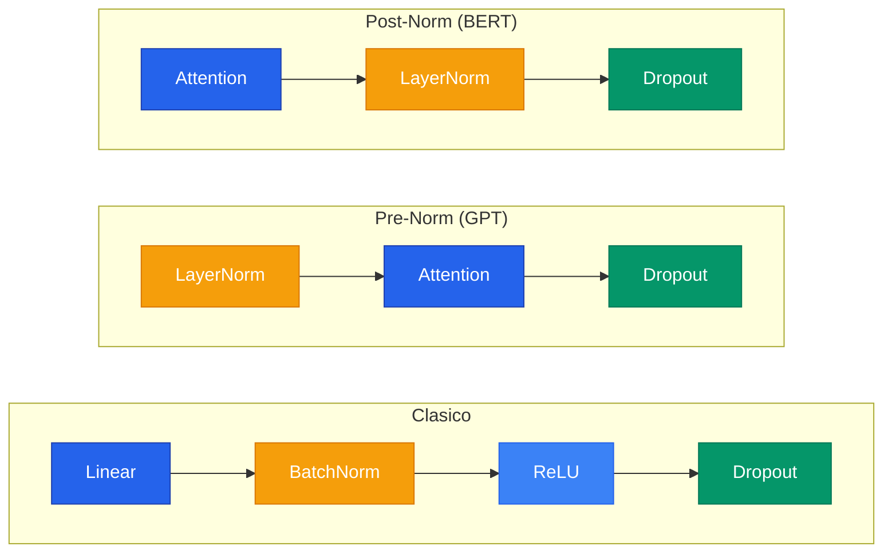

La regularizacion es el conjunto de tecnicas que previene el **overfitting**: cuando un modelo memoriza los datos de entrenamiento en vez de aprender patrones generalizables. Es especialmente critica en redes profundas, que tienen la capacidad de memorizar datasets enteros.

```text
Sin regularizacion:   Train 100%, Test 60%  <- memorizo
Con regularizacion:   Train 95%,  Test 85%  <- generaliza
```

---

## 1. L2 Regularizacion (Ridge / Weight Decay)

Penaliza la magnitud cuadratica de los pesos, incentivando pesos pequenos y distribuidos:


F(\theta) = \frac{1}{N} \sum_i L(y_i, \hat{y}_i) + \frac{\lambda}{2} \|\theta\|_2^2


La actualizacion de pesos se convierte en:

$$\theta_j \leftarrow \theta_j (1 - \eta\lambda) - \eta \frac{\partial J}{\partial \theta_j}$$

El factor $(1 - \eta\lambda)$ **encoge multiplicativamente** los pesos en cada paso -- por eso se llama "weight decay".

**Interpretacion Bayesiana:** L2 equivale a colocar un **prior Gaussiano** sobre los pesos: $P(\theta) \propto \exp(-\lambda\|\theta\|^2/2)$. Pesos grandes son a priori improbables.

```python
# L2 en PyTorch: un solo parametro en el optimizador
optimizer = optim.Adam(model.parameters(), lr=0.001, weight_decay=0.001)
```

---

## 2. L1 Regularizacion (Lasso)

$$F(\theta) = \frac{1}{N} \sum_i L(y_i, \hat{y}_i) + \lambda \|\theta\|_1$$


**L2 hace pesos chicos pero nunca cero. L1 produce sparsity:** muchos pesos se hacen exactamente cero, como si la red seleccionara automaticamente que features importan. L1 equivale a un **prior de Laplace** sobre los pesos.


---

## 3. Elastic Net (L1 + L2)

$$R(\theta) = \alpha \|\theta\|_1 + \frac{1-\alpha}{2} \|\theta\|_2^2$$

Combina la sparsity de L1 con la estabilidad de L2.

| Regularizador | Sparsity | Diferenciable | Prior Bayesiano |
|---|---|---|---|
| **L2 (Ridge)** | No (encoge, nunca cero) | Si | Gaussiano |
| **L1 (Lasso)** | Si (ceros exactos) | No (en 0) | Laplace |
| **Elastic Net** | Si (parcial) | No (en 0) | Mixto |

---

## 4. Dropout

En cada iteracion de entrenamiento, cada neurona tiene una probabilidad $p$ de ser "apagada" (su valor se pone en 0). Esto fuerza **redundancia**: todas las neuronas deben aprender a ser utiles.

| Tipo | Que apaga | Uso |
|---|---|---|
| `Dropout(p=0.5)` | Neuronas individuales | Capas lineales |
| `Dropout2d(p=0.25)` | Canales completos | Capas convolucionales |

### Inverted Dropout

PyTorch usa **inverted dropout**: escala durante entrenamiento (divide por $1-p$) para que en inferencia no haya que hacer nada.

```text
ENTRENAMIENTO (p=0.5):
  Valores:         [2.0, 4.0, 1.0, 3.0]
  Mascara:         [1,   0,   1,   0  ]
  Aplicar mascara: [2.0, 0.0, 1.0, 0.0]
  Dividir por 0.5: [4.0, 0.0, 2.0, 0.0]  <- escala AQUI

INFERENCIA:
  Valores:         [2.0, 4.0, 1.0, 3.0]  <- no hace NADA
```

Para una cobertura completa de Dropout, ver el [paper de Srivastava et al. (2014)](/papers/dropout-srivastava-2014/).

---

## 5. Batch Normalization

Normaliza las activaciones de cada capa para tener media ~0 y varianza ~1, resolviendo el problema de **Internal Covariate Shift**.

$$y = \gamma \cdot \frac{x - \mu_B}{\sigma_B} + \beta$$

Donde $\gamma$ y $\beta$ son parametros aprendibles que permiten a la red "deshacerlo" si normalizar no ayuda.


**BatchNorm normaliza por feature (columna) a traves del batch.** LayerNorm normaliza por muestra (fila). BatchNorm es ideal para CNNs; LayerNorm es ideal para Transformers. La diferencia es critica: `model.eval()` cambia el comportamiento de BatchNorm (usa running stats en vez de stats del batch actual).


| | BatchNorm | LayerNorm |
|---|---|---|
| **Ideal para** | Imagenes (CNNs) | Texto (Transformers) |
| **Normaliza** | Por feature (columna) | Por muestra (fila) |
| **Depende del batch** | Si | No |
| **train vs eval** | Distintos | Iguales |

Para mas detalles, ver el [paper de Ioffe & Szegedy (2015)](/papers/batch-norm-ioffe-2015/).

---

## 6. Early Stopping

Monitorea la validation loss durante el entrenamiento. Si no mejora durante `patience` epocas, detiene el entrenamiento y restaura el mejor checkpoint. Ver detalles en [Learning Rate](/fundamentos/learning-rate/).

---

## 7. Data Augmentation

Genera variaciones artificiales de los datos de entrenamiento (rotaciones, flips, crops, color jitter) para aumentar efectivamente el tamano del dataset sin recolectar mas datos.

---

## 8. Orden Tipico en una Capa



> NUNCA poner normalizacion en la ultima capa.

---

## 9. Combinacion de Tecnicas

Las tecnicas de regularizacion son **complementarias** y se combinan frecuentemente:

| Tecnica | Que controla | Hiperparametro clave |
|---|---|---|
| **L2 / Weight Decay** | Magnitud de pesos | $\lambda$ (0.0001 - 0.01) |
| **Dropout** | Co-adaptacion de neuronas | $p$ (0.1 - 0.5) |
| **Batch Norm** | Distribucion de activaciones | Posicion en la red |
| **Early Stopping** | Numero de epocas | patience |
| **Data Augmentation** | Tamano efectivo del dataset | Tipos de transformacion |

---

## Para Profundizar

- [Clase 07 - Conceptos](/clases/clase-07/) -- Dropout, BatchNorm, LayerNorm
- [Clase 08 - Regularizacion](/clases/clase-08/) -- L1/L2, tareas auxiliares
- [Clase 10 - Profundizacion](/clases/clase-10/profundizacion/) -- Elastic Net, interpretacion Bayesiana
- [Paper: Dropout (Srivastava et al., 2014)](/papers/dropout-srivastava-2014/)
- [Paper: Batch Normalization (Ioffe & Szegedy, 2015)](/papers/batch-norm-ioffe-2015/)
