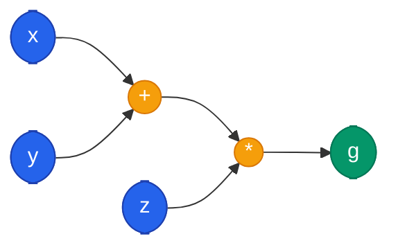

Una red neuronal nunca ve fotos, palabras ni sonidos. **Solo ve arrays de numeros con una forma (shape) especifica.** Antes de que cualquier modelo pueda aprender, los datos del mundo real deben transformarse en tensores numericos que la red pueda procesar.

---

## 1. Tensores: la Estructura Fundamental

Un **tensor** es la generalizacion de escalares, vectores y matrices a dimensiones arbitrarias:

| Dimensiones | Nombre | Ejemplo |
|-------------|--------|---------|
| 0 | Escalar | `5.0` |
| 1 | Vector | `[1, 2, 3]` |
| 2 | Matriz | `[[1, 2], [3, 4]]` |
| 3+ | Tensor | Imagen RGB: alto x ancho x 3 canales |

En PyTorch, los tensores tienen dos superpoderes: pueden ejecutarse en **GPU** y pueden rastrear operaciones para calcular **gradientes automaticamente** (autograd).



```python
import torch

# Escalar (0 dimensiones)
escalar = torch.tensor(5.0)

# Vector (1 dimension)
vector = torch.tensor([1.0, 2.0, 3.0])

# Matriz (2 dimensiones)
matriz = torch.tensor([[1.0, 2.0], [3.0, 4.0]])

# Tensor 3D (por ejemplo, una imagen RGB 4x4)
tensor_3d = torch.randn(3, 4, 4)

print(f"Escalar: shape={escalar.shape}, dtype={escalar.dtype}")
print(f"Vector:  shape={vector.shape}")
print(f"Matriz:  shape={matriz.shape}")
print(f"Tensor:  shape={tensor_3d.shape}")
```


```python
import tensorflow as tf

# Escalar (0 dimensiones)
escalar = tf.constant(5.0)

# Vector (1 dimension)
vector = tf.constant([1.0, 2.0, 3.0])

# Matriz (2 dimensiones)
matriz = tf.constant([[1.0, 2.0], [3.0, 4.0]])

# Tensor 3D (por ejemplo, una imagen RGB 4x4)
tensor_3d = tf.random.normal((3, 4, 4))

print(f"Escalar: shape={escalar.shape}, dtype={escalar.dtype}")
print(f"Vector:  shape={vector.shape}")
print(f"Matriz:  shape={matriz.shape}")
print(f"Tensor:  shape={tensor_3d.shape}")
```


```python
import jax.numpy as jnp
import jax

# Escalar (0 dimensiones)
escalar = jnp.float32(5.0)

# Vector (1 dimension)
vector = jnp.array([1.0, 2.0, 3.0])

# Matriz (2 dimensiones)
matriz = jnp.array([[1.0, 2.0], [3.0, 4.0]])

# Tensor 3D (por ejemplo, una imagen RGB 4x4)
key = jax.random.PRNGKey(0)
tensor_3d = jax.random.normal(key, (3, 4, 4))

print(f"Escalar: shape={escalar.shape}, dtype={escalar.dtype}")
print(f"Vector:  shape={vector.shape}")
print(f"Matriz:  shape={matriz.shape}")
print(f"Tensor:  shape={tensor_3d.shape}")
```



---

## 2. Tipos de Datos de Entrada

Cada tipo de dato tiene un shape estandar y un preproceso particular:

| Tipo | Shape tipico | Preproceso |
|------|-------------|-----------|
| Tabular (CSV) | `(batch, features)` | Ya son numeros |
| Imagenes | `(batch, canales, alto, ancho)` | Dividir por 255, normalizar |
| Texto | `(batch, tokens, embedding_dim)` | Tokenizar + Embedding |
| Audio | `(batch, 1, frecuencias, tiempo)` | Muestreo + Espectrograma |


**Imagenes como tensores:** Una imagen RGB de 224x224 se representa como un tensor de shape `(3, 224, 224)` -- 3 canales (rojo, verde, azul), 224 filas, 224 columnas. Cada valor es un numero entre 0 y 255 que se normaliza a [0, 1] dividiendo por 255.


---

## 3. Normalizacion de Datos

La normalizacion asegura que todas las features tengan escalas comparables, lo cual es esencial para que el entrenamiento converja de forma estable.

### Z-score (estandarizacion)


x_{\text{norm}} = \frac{x - \mu}{\sigma}


Transforma los datos para que tengan media 0 y varianza 1.

### Min-Max

$$x_{\text{norm}} = \frac{x - x_{\min}}{x_{\max} - x_{\min}}$$

Transforma los datos al rango $[0, 1]$.


**Las imagenes se normalizan por canal.** En ImageNet, la normalizacion estandar usa `mean = [0.485, 0.456, 0.406]` y `std = [0.229, 0.224, 0.225]` para los canales RGB respectivamente. Esto garantiza que cada canal tenga distribucion similar.




```python
import torch

# Datos de ejemplo
datos = torch.tensor([10.0, 20.0, 30.0, 40.0, 50.0])

# Z-score: media 0, varianza 1
media = datos.mean()
std = datos.std()
z_score = (datos - media) / std
print(f"Z-score: {z_score}")

# Min-Max: escalar al rango [0, 1]
min_val = datos.min()
max_val = datos.max()
min_max = (datos - min_val) / (max_val - min_val)
print(f"Min-Max: {min_max}")
```


```python
import tensorflow as tf

# Datos de ejemplo
datos = tf.constant([10.0, 20.0, 30.0, 40.0, 50.0])

# Z-score: media 0, varianza 1
media = tf.reduce_mean(datos)
std = tf.math.reduce_std(datos)
z_score = (datos - media) / std
print(f"Z-score: {z_score.numpy()}")

# Min-Max: escalar al rango [0, 1]
min_val = tf.reduce_min(datos)
max_val = tf.reduce_max(datos)
min_max = (datos - min_val) / (max_val - min_val)
print(f"Min-Max: {min_max.numpy()}")
```


```python
import jax.numpy as jnp

# Datos de ejemplo
datos = jnp.array([10.0, 20.0, 30.0, 40.0, 50.0])

# Z-score: media 0, varianza 1
media = jnp.mean(datos)
std = jnp.std(datos)
z_score = (datos - media) / std
print(f"Z-score: {z_score}")

# Min-Max: escalar al rango [0, 1]
min_val = jnp.min(datos)
max_val = jnp.max(datos)
min_max = (datos - min_val) / (max_val - min_val)
print(f"Min-Max: {min_max}")
```



---

## 4. Grafos de Computo

Los frameworks de deep learning representan las operaciones sobre tensores como **grafos de computo**: grafos dirigidos donde los nodos son operaciones y las aristas representan el flujo de datos.



Estos grafos son fundamentales porque permiten:

1. **Forward pass**: evaluar la funcion en orden topologico
2. **Backward pass**: calcular gradientes automaticamente recorriendo el grafo en orden inverso (ver [Backpropagation](/fundamentos/backpropagation/))

PyTorch construye el grafo dinamicamente durante cada forward pass, lo que facilita el debugging y permite arquitecturas condicionales.

---

## 5. De Datos Crudos a Batches

El flujo tipico de preparacion de datos es:


El **batch size** determina cuantos ejemplos se procesan juntos en cada iteracion. Esto impacta directamente la eficiencia computacional y la dinamica del entrenamiento (ver [Optimizadores](/fundamentos/optimizadores/) y [Learning Rate](/fundamentos/learning-rate/)).



```python
import torch
from torch.utils.data import Dataset, DataLoader

# Definir un Dataset personalizado
class MiDataset(Dataset):
    def __init__(self, n_muestras=100):
        self.X = torch.randn(n_muestras, 4)  # 4 features
        self.y = torch.randint(0, 2, (n_muestras,))  # etiquetas binarias

    def __len__(self):
        return len(self.X)

    def __getitem__(self, idx):
        return self.X[idx], self.y[idx]

# Crear Dataset y DataLoader
dataset = MiDataset(n_muestras=100)
loader = DataLoader(dataset, batch_size=16, shuffle=True)

# Iterar sobre mini-batches
for batch_X, batch_y in loader:
    print(f"Batch: X={batch_X.shape}, y={batch_y.shape}")
    break  # solo mostramos el primero
```


```python
import tensorflow as tf
import numpy as np

# Crear datos de ejemplo
X = np.random.randn(100, 4).astype("float32")  # 4 features
y = np.random.randint(0, 2, size=(100,))  # etiquetas binarias

# Crear un tf.data.Dataset
dataset = tf.data.Dataset.from_tensor_slices((X, y))

# Configurar pipeline: mezclar, agrupar en batches, precarga
loader = dataset.shuffle(buffer_size=100).batch(16).prefetch(tf.data.AUTOTUNE)

# Iterar sobre mini-batches
for batch_X, batch_y in loader:
    print(f"Batch: X={batch_X.shape}, y={batch_y.shape}")
    break  # solo mostramos el primero
```


```python
import jax
import jax.numpy as jnp

# Crear datos de ejemplo
key = jax.random.PRNGKey(0)
X = jax.random.normal(key, (100, 4))  # 4 features
y = jax.random.bernoulli(key, shape=(100,)).astype(jnp.int32)

# Funcion generadora de mini-batches
def crear_batches(X, y, batch_size, key):
    n = len(X)
    indices = jax.random.permutation(key, n)  # mezclar indices
    for i in range(0, n, batch_size):
        idx = indices[i:i + batch_size]
        yield X[idx], y[idx]

# Iterar sobre mini-batches
for batch_X, batch_y in crear_batches(X, y, batch_size=16, key=key):
    print(f"Batch: X={batch_X.shape}, y={batch_y.shape}")
    break  # solo mostramos el primero
```



---

## Para Profundizar

- [Clase 07 - Conceptos y Definiciones](/clases/clase-07/) -- Tipos de datos, normalizaciones, frameworks
- [Clase 06 - Grafos de Computo](/clases/clase-06/) -- Grafos computacionales y tensores en PyTorch
