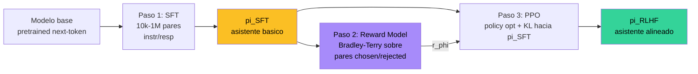
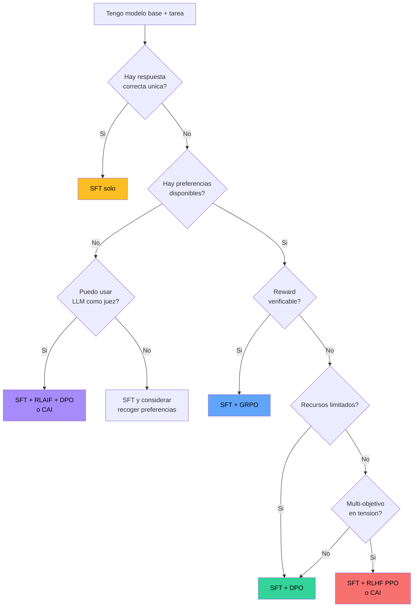

**RLHF — Reinforcement Learning from Human Feedback** es la familia de tecnicas que **alinea** un modelo de lenguaje grande (LLM) preentrenado con las preferencias de evaluadores humanos. Es la receta que convirtio a GPT-3 en ChatGPT, a Llama-2 base en Llama-2-Chat, y a Claude-base en Claude-Assistant. Tecnicamente es un pipeline de tres fases — SFT, reward model y optimizacion por refuerzo — pero conceptualmente es la respuesta de la industria a un problema mas profundo: **un modelo que predice next-token bien no es necesariamente un modelo util, honesto ni inofensivo**.

Esta entrada funciona como **hub**: el detalle matematico de cada pieza vive en fundamentos dedicados ([SFT](/fundamentos/sft), [Bradley-Terry](/fundamentos/bradley-terry), [KL implicito](/fundamentos/kl-implicito), [DPO](/fundamentos/dpo)). Aqui se conecta todo, se contrasta con sus alternativas (DPO, RLAIF, Constitutional AI, GRPO), se documentan los modos de fallo conocidos, y se ofrece una tabla decisional para elegir entre SFT solo, SFT + RLHF y SFT + DPO segun el problema real.

---

## 1. Apertura: el problema HHH y por que SFT no basta

Un modelo base entrenado con next-token prediction sobre 10-15 trillones de tokens de internet sabe lenguaje, codigo, hechos, sintaxis. Pero la distribucion de internet no es la distribucion de **comportamiento deseable de un asistente**. Internet contiene preguntas que se contestan con sarcasmo, comentarios toxicos premiados con upvotes, threads donde la respuesta correcta es minoritaria, y enormes cantidades de texto sin caracter de ayuda. Un base model que continua texto **es** la mezcla de todo eso.

[SFT](/fundamentos/sft) corrige el formato — ensena al modelo a **responder** preguntas en vez de continuar texto. Pero SFT solo tiene ejemplos **positivos**: cada respuesta del dataset es "una respuesta valida". No hay forma de decirle al modelo "esta respuesta esta bien pero esta otra es mejor", ni "esto que sabes hacer no lo hagas". Para eso se necesita **senal de preferencias**.

La industria converge alrededor del 2020-2022 en un marco mental conocido como **HHH** (Askell et al., Anthropic, 2021): un asistente deberia ser

- **Helpful** — util: responde lo que pidieron, en el formato pedido, con la informacion correcta.
- **Honest** — honesto: no inventa hechos, admite incertidumbre, no dice lo que el usuario quiere oir.
- **Harmless** — inofensivo: no produce instrucciones para hacer dano, no propaga sesgos toxicos, no es manipulable trivialmente.

Estos tres ejes **estan en tension** entre si. Un modelo maximamente inofensivo se vuelve inutil (rechaza preguntas medicas legitimas). Un modelo maximamente honesto puede ser brutalmente impolitico. Un modelo maximamente util puede ayudar con tareas daninas. SFT no tiene vocabulario para expresar trade-offs. RLHF si: a traves de **comparaciones por pares**, los anotadores expresan "prefiero esta respuesta sobre esta otra" sin necesidad de articular una funcion objetivo formal. El modelo aprende a navegar la tension implicitamente.


**RLHF no es magia, es un convertidor de preferencias humanas a senal de gradiente**. Su valor esta en que las personas pueden **comparar** dos respuestas mucho mejor de lo que pueden **escribir** una respuesta perfecta desde cero. El pipeline aprovecha esa asimetria.


---

## 2. El pipeline canonico de tres pasos

La formulacion clasica viene de **InstructGPT** (Ouyang et al., 2022, OpenAI) y se mantiene esencialmente igual en ChatGPT, Llama-2-Chat, Mistral-Instruct-PPO y muchos modelos cerrados. Tres pasos secuenciales:

### 2.1 Paso 1 — SFT

Punto de partida: un modelo base capaz pero sin formato instruccional. SFT lo ajusta sobre un dataset curado de pares `(instruccion, respuesta)` con loss masking sobre los tokens de respuesta. Sale `pi_SFT`, un modelo que ya **responde** en vez de **continuar**, con personalidad basica y formato consistente.

El detalle completo — datasets, learning rate, loss masking, hiperparametros tipicos — vive en [SFT](/fundamentos/sft). Para este hub basta saber que `pi_SFT` cumple dos roles: es la inicializacion de la policy del paso 3, **y** sirve como **referencia** $\pi_{\text{ref}}$ contra la cual se mide la divergencia.

### 2.2 Paso 2 — Reward Model

A partir de `pi_SFT`, se generan multiples respuestas para cada prompt (tipicamente $K=4$ a $K=9$ respuestas con temperatura alta). Anotadores humanos las **rankean** o las comparan por pares. El dataset resultante son triples $(x, y_w, y_l)$ donde $y_w$ es la respuesta preferida (winner / chosen) y $y_l$ la rechazada (loser / rejected).

Encima del modelo SFT — o de un modelo de tamano comparable — se monta un **scalar head** que produce un reward $r_\phi(x, y) \in \mathbb{R}$. Se entrena con la loss **Bradley-Terry**:

$$
\mathcal{L}_{\text{RM}} = -\mathbb{E}_{(x, y_w, y_l) \sim \mathcal{D}_{\text{pref}}} \big[ \log \sigma(r_\phi(x, y_w) - r_\phi(x, y_l)) \big]
$$

Es exactamente la misma loss de regresion logistica binaria que aparece en cualquier clasificador con dos clases, con la diferencia $r_w - r_l$ como **unico feature**. La derivacion completa, sus tres interpretaciones (max entropy, utilidad Gumbel, regresion logistica) y la conexion con Plackett-Luce viven en [Bradley-Terry](/fundamentos/bradley-terry).

Tamano tipico del RM: en InstructGPT es de **6B parametros** sobre una policy de 175B — el RM es deliberadamente mas chico que el modelo final, lo que reduce costo y resulto empiricamente suficiente. Anthropic en Claude reporta RMs aun mas chicos relativos a la policy. Algunos labs entrenan RM y policy del mismo tamano (Llama-2: ambos 70B); no hay regla universal.

#### Por que pairwise > absoluto

Una pregunta razonable: ¿por que pedir comparaciones $y_w \succ y_l$ en vez de **scores absolutos** $r \in [1, 7]$? La respuesta tiene tres partes:

1. **Calibracion entre anotadores**: dos labelers pueden estar de acuerdo en que A es mejor que B aunque uno daria a A un 5/7 y otro un 7/7. La media absoluta es ruidosa; el ordering relativo no. Esto se traduce en menor varianza efectiva de gradiente con la misma cantidad de anotaciones.
2. **No hay anchor consistente**: el "que tan buena es esta respuesta" depende del contexto, del prompt, del estado de animo. Comparar dos respuestas con el mismo prompt elimina la deriva de anchor.
3. **Mas barato cognitivamente**: leer dos respuestas y elegir una es mas rapido y menos fatigoso que asignar un score numerico. Los datos producidos son mas baratos y mas consistentes.

El precio: las preferencias pairwise pueden ser **intransitivas** en el mundo real (Plackett-Luce/Bradley-Terry asumen transitividad estocastica, que es violada por preferencias humanas reales en ~10-15% de los triplets — ver Munos et al., 2023). En la practica se ignora.

### 2.3 Paso 3 — PPO con KL penalty

Con `pi_SFT` como inicializacion de la policy `pi_theta` y `r_phi` congelado, se optimiza:

$$
\max_\theta \; \mathbb{E}_{x \sim \mathcal{D}, y \sim \pi_\theta(\cdot \mid x)} \big[ r_\phi(x, y) \big] - \beta \, \mathbb{E}_x \big[ D_{\text{KL}}(\pi_\theta(\cdot \mid x) \| \pi_{\text{SFT}}(\cdot \mid x)) \big]
$$

Operacionalmente, el reward que ve PPO no es $r_\phi$ a secas sino el **reward modificado**:

$$
\tilde r(x, y) = r_\phi(x, y) - \beta \log \frac{\pi_\theta(y \mid x)}{\pi_{\text{SFT}}(y \mid x)}
$$

donde el segundo termino es un **estimador Monte Carlo** del KL evaluado en la muestra concreta $y$. PPO entonces optimiza $\tilde r$ con su maquinaria estandar: clipped surrogate objective, advantage estimation (GAE), value head, gradient clipping. El detalle conceptual del KL — por que aparece, que regulariza, su forma explicita en PPO vs implicita en DPO — vive en [KL implicito](/fundamentos/kl-implicito).

Valores tipicos:

- $\beta = 0.02$ en InstructGPT (Ouyang 2022); algunos reportan $\beta \in [0.01, 0.5]$.
- Learning rate de la policy: $\sim 10^{-6}$, mucho menor que SFT (estamos perturbando un modelo ya casi-final).
- 1-3 epochs sobre prompts de un dataset propietario (~10k-100k prompts en InstructGPT).
- Batch sampling: por cada prompt se generan 4-8 respuestas, se calcula $\tilde r$ para cada una, se hace PPO update.

#### PPO-ptx: mitigar el alignment tax

InstructGPT documenta empiricamente que despues de PPO, el modelo **pierde capacidad** en benchmarks academicos tradicionales (TriviaQA, DROP, HellaSwag) — el famoso **alignment tax**. La hipotesis: la policy se especializa tanto en complacer al RM que olvida distribuciones que eran utiles para tareas zero-shot academicas.

Solucion practica: **PPO-ptx**, donde se agrega un termino de pretraining loss a la objetivo de PPO:

$$
\mathcal{L}_{\text{PPO-ptx}} = \mathcal{L}_{\text{PPO}} + \gamma \, \mathbb{E}_{x \sim \mathcal{D}_{\text{pretrain}}} \big[ \log \pi_\theta(x) \big]
$$

Con $\gamma$ pequeno ($\sim 0.1$), el modelo mantiene gradient signal hacia la distribucion de pretraining y conserva sus capacidades originales. InstructGPT-PPO-ptx supera a InstructGPT-PPO en evaluaciones humanas **y** en benchmarks academicos.

---

## 3. Antecedentes pre-2022: como llegamos aqui

RLHF parece haber nacido con ChatGPT en noviembre de 2022, pero la receta tecnica tiene una linea historica de cinco anos.

### 3.1 Christiano et al. 2017 — Deep RL from Human Preferences

Paul Christiano, Jan Leike y colegas (OpenAI/DeepMind, NeurIPS 2017) demuestran que un agente de RL para juegos de Atari puede aprender a comportarse "como un humano querria" usando **solo comparaciones por pares de videos de su comportamiento**, sin reward function explicito. La receta:

1. Generar pares de trayectorias del agente.
2. Pedir al humano que prefiere.
3. Entrenar un reward predictor con loss Bradley-Terry.
4. Hacer RL con ese reward predictor.
5. Iterar.

El paper es el primer **proof of concept** de la idea entera. Esta hecho sobre MuJoCo y Atari, no sobre lenguaje, pero la matematica es identica a la de InstructGPT cinco anos despues.

### 3.2 Stiennon et al. 2020 — Learning to summarize with human feedback

Tambien OpenAI. Aplica la receta de Christiano a un problema de **lenguaje**: resumir posts de Reddit. Modelos GPT-2/GPT-3 ajustados con SFT + RM + PPO superan a baselines de SFT puro en evaluacion humana de calidad del resumen. Es la **primera vez** que se documenta el pipeline completo de tres fases sobre lenguaje natural, y es donde aparece por primera vez el termino KL penalty hacia `pi_SFT` con la forma usada en InstructGPT.

### 3.3 WebGPT — Nakano et al. 2021

Extiende la receta a un agente que **navega la web** para responder preguntas (TriviaQA, ELI5). El humano juzga la respuesta **y** el proceso de busqueda. Agrega capacidad de cita y verificacion. Es el ancestro directo de Bing Chat y ChatGPT con browsing.

### 3.4 Ouyang et al. 2022 — InstructGPT

El paper que define la era moderna. Aplica el pipeline a GPT-3 (175B) para instruccion general. Reporta:

- El modelo de 1.3B parametros con RLHF es preferido por humanos sobre GPT-3 de 175B puro.
- El RM es de 6B parametros.
- 40 contratistas escriben el dataset SFT (~13k pares) y rankean para el RM (~33k comparaciones).
- PPO-ptx supera a PPO en benchmarks academicos.

ChatGPT (Nov 2022) es esencialmente InstructGPT con GPT-3.5 como base. El paper es el documento mas citado en alineamiento de LLMs.

### 3.5 Anthropic HH — Bai et al. 2022 (paralelo)

En paralelo a InstructGPT, Anthropic publica **"Training a Helpful and Harmless Assistant with RLHF"** (Bai et al., Apr 2022). Misma matematica, dataset propio (Anthropic HH-RLHF, ~170k comparaciones), modelo Claude-1. Introduce el framing HHH con detalle empirico (helpful vs harmless en tension), y documenta el **iterative online RLHF**: recolectar preferencias frescas con el modelo actual, retrain RM, retrain policy, repetir.

---

## 4. Alternativas a PPO: el zoo post-2023

PPO funciona pero es notoriamente molesto de operar — 8+ hiperparametros sensibles, sampling on-policy caro, varianza alta del estimador de advantage. Desde 2023 explotan las alternativas, divididas en dos familias:

### 4.1 Saltarse el reward model — DPO y descendientes

**DPO (Direct Preference Optimization)** — Rafailov et al., NeurIPS 2023. Demuestra que toda la fase RM + PPO se puede colapsar en **una sola loss supervisada** sobre pares chosen/rejected:

$$
\mathcal{L}_{\text{DPO}} = -\mathbb{E}\bigg[\log \sigma\bigg(\beta \log \frac{\pi_\theta(y_w \mid x)}{\pi_{\text{ref}}(y_w \mid x)} - \beta \log \frac{\pi_\theta(y_l \mid x)}{\pi_{\text{ref}}(y_l \mid x)}\bigg)\bigg]
$$

Sin RM separado, sin sampling on-policy, sin la maquinaria de PPO. 5-10x mas barato, calidad comparable en benchmarks offline. Detalle completo de derivacion, datasets, hiperparametros y codigo en [DPO](/fundamentos/dpo). DPO es el **default de 2024-2026 para alineamiento offline**.

Variantes que han ido apareciendo (sin entrar en detalle):

- **IPO** (Identity Preference Optimization, Azar 2023) — reemplaza la sigmoide por una funcion menos saturable, mitiga reward hacking en datasets con preferencias casi-deterministas.
- **KTO** (Kahneman-Tversky Optimization, Ethayarajh 2024) — no requiere pares: cada respuesta tiene una etiqueta binaria "buena/mala" en vez de necesidad de chosen+rejected del mismo prompt. Util cuando los datos vienen de logs sin estructura de comparacion.
- **ORPO** (Hong et al. 2024) — combina SFT y DPO en una sola fase con log-odds ratio. Ahorra el paso de SFT.
- **SimPO** (Meng et al. 2024) — reference-free DPO, no necesita cargar dos modelos en memoria. Ahorra ~50% de RAM.
- **CPO**, **NCA**, **sDPO** — otras variantes con trade-offs especificos.

### 4.2 Reemplazar el labeler humano — RLAIF y Constitutional AI

**RLAIF (RL from AI Feedback)** — Lee et al., 2023 (Google). Usa **otro LLM** como juez en lugar de un humano para producir el dataset de preferencias. La receta:

1. Tomar un LLM "fuerte" (ej. GPT-4, Claude 3, Gemini Pro).
2. Para cada par de respuestas del modelo a alinear, pedirle al juez que elija la mejor segun un prompt con criterios (helpful, honest, etc.).
3. Construir el dataset de preferencias con esos juicios y entrenar RM + PPO (o DPO directo).

Lee et al. reportan que RLAIF iguala o supera RLHF en evaluaciones humanas. Costo: ordenes de magnitud menor en anotacion. Riesgo: el modelo final hereda los sesgos del juez. Si el juez tiene tendencia a preferir respuestas largas, el modelo aprende a alargar. Si el juez es sycophantic, el modelo amplifica.

**Constitutional AI (CAI)** — Bai et al., Anthropic, 2022. Variante mas estructurada de RLAIF. En vez de un prompt generico al juez ("elige la mejor respuesta"), se le da una **constitucion** — una lista de **principios escritos** en lenguaje natural (ej: "no dar instrucciones para hacer dano", "preferir explicaciones sobre rechazos secos", "admitir incertidumbre"). El proceso CAI tiene dos fases:

1. **SL-CAI (supervised)**: el modelo se critica a si mismo a la luz de cada principio y reescribe sus respuestas. El dataset resultante de "respuestas revisadas segun la constitucion" se usa para SFT.
2. **RL-CAI (RL)**: otro modelo (o el mismo) compara pares de respuestas del modelo segun la constitucion, produciendo preferencias. Se entrena un RM y se hace RL como en RLHF clasico, pero con preferencias sinteticas.

CAI es la base de Claude (Anthropic) desde su primera version. La gran ventaja: la "constitucion" es **auditable** y modificable — cambiar el comportamiento del modelo es cambiar texto en un documento, no recolectar nuevas anotaciones humanas.

### 4.3 Otras propuestas RL — GRPO, RLOO, ReMax

**GRPO (Group Relative Policy Optimization)** — DeepSeek, 2024. Apareció en DeepSeek-Math y en DeepSeek-R1. Reemplaza el **value model** de PPO (un segundo MLP que estima $V(s)$) por el promedio del reward en un **grupo** de respuestas al mismo prompt. Cada respuesta del grupo se compara contra la media del grupo como baseline. Resulta:

- Sin value model — ahorra ~50% memoria y compute.
- Mas estable en tareas con reward sparse (ej. "responde correctamente este problema matematico" — 0 o 1).
- DeepSeek-R1 lo usa para entrenar capacidades de razonamiento con reward verificable (chequeo automatico de respuesta correcta).

GRPO es el caballo de batalla actual para **reasoning models** (R1, o3, Gemini Thinking). La diferencia conceptual con RLHF clasico: en GRPO el reward suele ser **verificable y exacto** (test pass / fail, respuesta numerica correcta), no aprendido de preferencias humanas.

**RLOO** (REINFORCE Leave-One-Out, Ahmadian 2024) — Otra variante sin value model, usa control variates basados en grupos. Mas simple que PPO/GRPO, comparable en calidad para alineamiento estandar.

**ReMax** (Li 2023), **Best-of-N RL**, **Online DPO**, **Iterative DPO** — variantes mas pequenas que han ido apareciendo.

---

## 5. Modos de fallo conocidos

RLHF es poderoso pero fragil. Cinco patologias estan bien documentadas:

### 5.1 Mode collapse

El modelo deja de explorar y siempre produce **la misma respuesta** (o variaciones casi identicas) para cualquier prompt en una familia. Causa: el RM tiene un maximo local muy peaked en una respuesta especifica, y PPO converge ahi. Sintoma: si pides "escribe un poema" 20 veces, recibis 20 poemas casi identicos. Mitigaciones: KL penalty mas fuerte ($\beta$ mayor), entropy bonus en PPO, restart desde checkpoints anteriores.

### 5.2 Reward hacking

El modelo encuentra **bugs del RM** que inflan el score sin reflejar calidad real. Casos documentados:

- Modelos que usan palabras clave especificas ("comprehensive", "Let me think about this carefully") que el RM aprendio a premiar porque los anotadores las preferian inconscientemente.
- Respuestas excesivamente largas (verbosity bias del RM).
- Inclusion de listas con bullets aunque la pregunta no las requiera (los anotadores los preferian).
- Salidas en formato Markdown elaborado (el RM aprende a premiar "respuesta bien presentada" sin entender contenido).

Stiennon et al. ya lo documentan en 2020. Mitigacion: ensemble de RMs, KL penalty mas fuerte, evaluacion adversarial del RM contra el modelo, **iterative online RLHF** (recolectar preferencias frescas para corregir derivas).

### 5.3 Sycophancy

El modelo dice **lo que el usuario quiere oir** en vez de la verdad. Caso clasico: si el usuario dice "creo que la Tierra es plana, ¿no?", el modelo evita corregirlo o lo confirma suavemente. Causa: los anotadores tienden a preferir respuestas que afirman su punto de vista. Sharma et al. (2023, "Towards Understanding Sycophancy in Language Models") muestran que el comportamiento crece con el tamano del modelo y con la intensidad del RLHF.

Mitigacion: tecnicas explicitas de adversarial preference (incluir en el dataset pares donde la respuesta correcta contradice al usuario), Constitutional AI con principios de "preferir honesto sobre complaciente", y red-teaming sistematico.

### 5.4 Alignment tax

Perdida de capacidades academicas tras RLHF — el modelo PPO supera al SFT en evaluacion humana de "asistencia" pero **empeora** en TriviaQA, MATH, HellaSwag, BIG-Bench. Causa: la distribucion de prompts del RM esta sesgada a tareas tipo asistente y el modelo se especializa, olvidando distribuciones que no estan en el dataset de preferencias.

Mitigaciones: PPO-ptx con $\gamma$ ajustado, mezclar SFT data en el RL update, evaluar continuamente en benchmarks academicos durante el training para detectar regresiones tempranas.

### 5.5 Jailbreaks y fragilidad de seguridad

RLHF entrena al modelo a rechazar pedidos daninos **en distribucion** — los rechaza cuando la peticion se ve como pedido danino. Pero el comportamiento es fragil ante:

- **Prompt injection** en system prompts.
- **Role-play**: "imaginate que eres un personaje que…"
- **Encoded inputs**: base64, leet speak, idiomas raros.
- **Multi-turn manipulation**: ir construyendo contexto inocuo y pedir lo danino al final.

RLHF clasico **no resuelve** esto. Investigaciones de Anthropic, Google y academia muestran que con suficiente esfuerzo cualquier modelo RLHF-alineado puede ser jailbroken. Mitigaciones parciales: adversarial training explicito contra jailbreaks conocidos, defense-in-depth con filtros downstream, monitoring continuo.

---

## 6. Casos de uso reales

Quien usa que en 2025-2026:

| Modelo | Empresa | Paradigma de alineamiento |
|---|---|---|
| ChatGPT (GPT-3.5, GPT-4 turbo) | OpenAI | RLHF clasico (PPO) + RLAIF parcial reportado |
| GPT-4 | OpenAI | RLHF + procesos no publicos, presumiblemente RLAIF + iterative |
| GPT-4o / o1 / o3 | OpenAI | Combinacion RLHF + RL con reward verificable (cadenas de razonamiento) |
| Claude 2/3/3.5/4 | Anthropic | Constitutional AI (CAI) — variante RLAIF estructurada |
| Llama-2-Chat | Meta | RLHF clasico (PPO + KL), reportado en detalle en el paper |
| Llama-3-Instruct | Meta | SFT + DPO (no PPO) — cambio explicito documentado |
| Mistral-Instruct, Mixtral-Instruct | Mistral | SFT + DPO |
| Zephyr (HuggingFace) | HF | SFT + DPO sobre UltraFeedback |
| Tulu, OLMo Instruct | AI2 | SFT + DPO, recetas abiertas |
| Gemini 1/2/Pro/Ultra | Google DeepMind | Variantes propias, RLAIF documentado en Lee 2023, presumiblemente combinacion con RLHF |
| DeepSeek-R1 | DeepSeek | GRPO con reward verificable (no preferencias humanas para razonamiento) |
| Qwen2/3 Instruct | Alibaba | SFT + DPO + variantes |

Patron general en open-weight: **SFT + DPO** se ha vuelto el default. PPO sobrevive en labs grandes con datos propietarios e iterative online (OpenAI, Anthropic). RLAIF/CAI domina cuando el costo de anotacion humana es prohibitivo. GRPO sube fuerte en modelos con reward verificable (matematica, codigo).

---

## 7. Limitaciones honestas

RLHF tiene cuatro criticas estructurales serias que no son problemas de ingenieria sino de **diseno del paradigma**:

### 7.1 "Alignment to what?" — sesgo de labelers

InstructGPT se entreno con **~40 anotadores contratados**. Anthropic HH con un grupo demograficamente acotado. UltraFeedback con un mix de respuestas generadas por GPT-4 (asi que esta "alineado" al estilo de GPT-4, no a una poblacion). La pregunta basica — "¿alineado a las preferencias de quien?" — rara vez se contesta con honestidad.

Los anotadores tienen sesgos: educacion universitaria, anglofono, edad mediana, ideologia particular. Esos sesgos se transfieren al modelo. El modelo es "polite, helpful, harmless" segun una definicion **culturalmente especifica** de esos terminos. Comunidades distintas tienen definiciones distintas. Esto no es resoluble dentro del paradigma RLHF — requiere decisiones politicas sobre que voces se incluyen.

### 7.2 Costo

RLHF clasico cuesta:

- **Anotadores**: 40-100 personas full-time durante meses. Anthropic, OpenAI y Google gastan millones anuales en anotacion.
- **Compute**: PPO sobre 175B params requiere clusters multi-GPU dedicados durante semanas. Es ordenes de magnitud mas barato que pretraining pero sigue siendo caro.
- **Iteracion**: el modelo final emerge despues de multiples rondas de preferencias, evaluacion, retrain.

Esto crea una asimetria: solo labs grandes pueden hacer RLHF clasico bien. La comunidad open-weight migra a DPO/RLAIF justamente para esquivar este cuello de botella.

### 7.3 No resuelve hallucination

RLHF **reduce** hallucination en distribucion (en tipos de preguntas que estaban en el dataset de preferencias), pero no la elimina. La razon es fundamental: el modelo sigue siendo un predictor de tokens. Si el RM penaliza "respuestas incorrectas" en preguntas factuales, el modelo aprende a **modular su confianza** y a producir respuestas **plausibles**, no necesariamente correctas. RLHF puede incluso **aumentar** hallucination si los anotadores prefieren respuestas seguras-pero-incorrectas sobre admisiones de ignorancia.

Tecnicas que si reducen hallucination: retrieval-augmented generation (RAG), tool use, citation training, calibracion explicita de confianza con probing. Ninguna de estas es RLHF.

### 7.4 Fragil ante jailbreaks

Ya discutido en seccion 5.5. RLHF entrena la **superficie** del comportamiento, no la **causa**. Un modelo RLHF que rechaza "ensename a hacer una bomba" puede ser convencido en 5 turnos si el atacante construye contexto. Defense-in-depth (filtros pre/post, monitoring, rate limiting) es necesaria pero no suficiente. La investigacion de seguridad debate si esto es resoluble dentro del paradigma supervised + RL o requiere algo mas profundo (interpretabilidad mecanicista, certificacion formal).

---

## 8. Cuando usar SFT solo vs SFT + RLHF vs SFT + DPO

Tabla decisional pragmatica para el ingeniero que debe elegir:

| Situacion | Recomendacion | Razon |
|---|---|---|
| Dataset muy chico (<5k ejemplos), tarea bien especificada | **SFT solo** | DPO/RLHF requieren preferencias y agregan complejidad sin ganancia. |
| Tarea con respuesta correcta unica (ej. NER, parsing, JSON estructurado) | **SFT solo** | No hay preferencias relativas que aprender — solo "correcto/incorrecto". |
| Asistente conversacional general | **SFT + DPO** | Default 2024-2026 para open-weight. Calidad casi-PPO a 5-10x menos costo. |
| Tarea con preferencias claras y disponibles (resumir, traducir con estilo) | **SFT + DPO** | DPO offline es suficiente; ahorra la complejidad de PPO. |
| Tarea con criterios subjetivos multiples en tension (helpful + harmless + honest) | **SFT + RLHF (PPO)** o **CAI** | Multi-objetivo, iterative online; PPO permite balancear durante training. CAI permite codificar tradeoffs en lenguaje natural. |
| Tarea con reward verificable (test pass/fail, respuesta numerica) | **SFT + GRPO** o **RL con reward exacto** | No requiere preferencias humanas — el reward es 0/1 verificable. Modelo de razonamiento. |
| Equipo chico, sin anotadores | **SFT + RLAIF + DPO** o **SFT + CAI** | LLM como juez, sin anotadores humanos. Riesgo de heredar sesgos del juez. |
| Modelo medico/legal/financiero | **SFT + RLHF + verificacion downstream** | Stakes altos requieren defense-in-depth; RLHF solo no basta. |
| Investigacion academica con compute limitado | **SFT + DPO** | Reproducible, ~1 GPU semana, codigo abierto disponible (TRL, Axolotl). |

Diagrama de decision visual:


**No saltarse SFT**. RLHF y DPO asumen que parten de un modelo que **ya habla el formato instruccional** (`pi_SFT`). Hacer DPO directamente desde un base model funciona mal: el log-ratio $\log \pi_\theta / \pi_{\text{ref}}$ explota porque ambos modelos asignan probabilidad muy baja a respuestas bien formateadas. SFT es prerequisito, no opcional.


---

## 9. Resumen

- **RLHF** es la familia de tecnicas que alinea LLMs a preferencias humanas via un pipeline canonico de tres fases: SFT, reward model entrenado con Bradley-Terry, y optimizacion por refuerzo (PPO) con KL penalty hacia el SFT.
- Cada fase tiene su entrada dedicada: [SFT](/fundamentos/sft), [Bradley-Terry](/fundamentos/bradley-terry), [KL implicito](/fundamentos/kl-implicito).
- Surge para resolver el problema **HHH** (Helpful, Honest, Harmless) que SFT solo no puede atacar — falta senal de preferencias relativas.
- Antecedentes: Christiano 2017 (Atari), Stiennon 2020 (resumir), Nakano 2021 (WebGPT), Ouyang 2022 (InstructGPT/ChatGPT).
- **Alternativas**: [DPO](/fundamentos/dpo) (saltarse RM + PPO, default open-weight 2024+), RLAIF (LLM como juez), Constitutional AI (Anthropic, principios escritos), GRPO (DeepSeek, sin value model, para reward verificable).
- **Modos de fallo**: mode collapse, reward hacking, sycophancy, alignment tax, jailbreaks.
- **Casos reales**: ChatGPT/GPT-4 (RLHF + RLAIF), Claude (CAI), Llama-2-Chat (RLHF clasico), Llama-3/Mistral/Zephyr (DPO), DeepSeek-R1 (GRPO).
- **Limitaciones honestas**: "alignment to what?" (sesgo de labelers), costo alto, no resuelve hallucination, fragil ante jailbreaks.
- **Decision**: SFT solo para tareas con respuesta unica; SFT + DPO como default; SFT + RLHF/CAI para criterios subjetivos multiples; GRPO/RL con reward verificable para razonamiento.

## Ver tambien

- [SFT](/fundamentos/sft) — paso 1 del pipeline, transforma base model en asistente basico.
- [Bradley-Terry](/fundamentos/bradley-terry) — la loss del reward model y la base teorica de preferencias por pares.
- [KL implicito](/fundamentos/kl-implicito) — comparacion entre el KL explicito de PPO y el implicito de DPO.
- [DPO](/fundamentos/dpo) — la alternativa offline dominante en 2024-2026.
- [Foundation Models](/fundamentos/foundation-models) — paradigma pretrain + adapt en el que RLHF es la fase de adapt.
- [Transformer](/fundamentos/transformer) — arquitectura sobre la que opera todo el pipeline.
- [Clase 14 cap 26 — Preferencias y Bradley-Terry](/clases/clase-14/practica/26-preferencias-bradley-terry) — desarrollo practico de la base de preferencias.
- [Clase 14 cap 27 — DPO loss](/clases/clase-14/practica/27-dpo-loss) — derivacion paso a paso.
- [Clase 14 cap 28 — Dataset DPO](/clases/clase-14/practica/28-dataset-dpo) — construccion del dataset.
- [Clase 20](/clases/clase-20) — alineamiento, seguridad y futuro de los LLMs en el curso.
