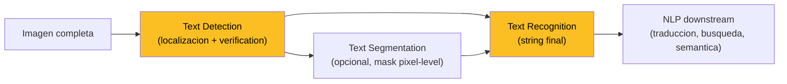
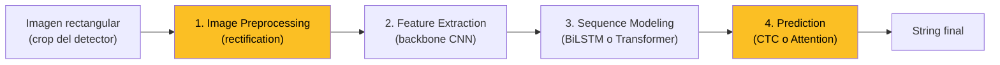

El **Scene Text Recognition (STR)** consiste en detectar, segmentar y transcribir texto que aparece **incidentalmente en imágenes del mundo real**: fotografías de calles, señalética, fachadas, productos, capturas de pantalla, manuscritos modernos. A diferencia del OCR clásico que opera sobre documentos escaneados (Tesseract, ABBYY), STR enfrenta texto **embebido en escenas naturales** con variabilidad extrema de fondo, fuente, orientación, escala, iluminación y oclusión.

Esta página consolida los conceptos transversales del área: la diferencia entre OCR documental y STR, el pipeline canónico de cuatro etapas, las arquitecturas de reconocimiento (rectificación, backbone, sequence modeling, prediction), las métricas (Word Recognition Accuracy, Normalized Edit Distance, Levenshtein), los datasets dominantes (Synth90k, SynthText, Total-Text, ICDAR) y la evolución histórica desde CRNN (2015) hasta TrOCR y PARSeq.

Es el fundamento transversal de la [Clase 21](/clases/clase-21) y del [Laboratorio 21](/laboratorios/lab-21).

---

## 1. STR vs OCR clásico: el gap fundamental

El **OCR clásico** (Optical Character Recognition) lleva más de medio siglo resuelto razonablemente bien. Tesseract, ABBYY FineReader o los motores comerciales bancarios procesan documentos escaneados con tasas de error por carácter (CER) por debajo del 1%. La razón: el dominio está **controlado**.

El **Scene Text Recognition (STR)**, en cambio, opera sobre imágenes capturadas en condiciones no controladas. El gap no es una cuestión de afinar mejor los mismos algoritmos: cambian las suposiciones subyacentes.

### 1.1 Tabla comparativa

| Eje | OCR documental | Scene Text Recognition |
| --- | --- | --- |
| **Background** | Plano, generalmente blanco. Contraste muy alto. | Cualquier cosa: pared con grafiti, vegetación, cielo, otro texto. |
| **Form (forma)** | Líneas rectas, fuente regular y consistente, layout estructurado. | Texto curvado, inclinado, perspectivo, en diferentes fuentes simultáneas. |
| **Noise (ruido)** | Mínimo: motas de polvo, dobleces, baja resolución de escaneo. | Sombras, motion blur, oclusión parcial, reflejos, lluvia, fuera de foco. |
| **Color** | Generalmente negro sobre blanco. | Colores arbitrarios, gradientes, transparencias, texto sobre texto. |
| **Orientación** | Horizontal o conocida por layout. | Cualquier ángulo, multi-dirección, vertical (chino, japonés). |
| **Lenguaje** | Generalmente uno solo por documento. | Multilingüe, scripts mezclados (latín + chino + emojis). |
| **Resolución** | Alta (300 dpi típico). | Variable, frecuentemente baja (texto pequeño en la escena). |


**OCR clásico** asume layout conocido, contraste alto, fuente regular y fondo plano. **STR** asume **nada** de eso. El cambio de dominio justifica arquitecturas completamente distintas, con explícita robustez a variabilidad geométrica y de apariencia.


### 1.2 Por qué no basta con re-entrenar Tesseract

Tesseract aplica binarización adaptativa, segmentación por filas y por caracteres, y un clasificador per-carácter. Cada uno de esos pasos asume que el dominio es documental. En una foto de una señal de tránsito a contraluz, la binarización pierde el texto; la segmentación por filas no aplica si la palabra está rotada; el clasificador no fue entrenado con esa fuente decorativa.

Los métodos STR resuelven el problema **end-to-end**, aprendiendo de datos donde la variabilidad ya está presente. Por eso el campo despegó cuando aparecieron los datasets sintéticos masivos (Synth90k, 2014) y las arquitecturas CNN+RNN+CTC (CRNN, 2015).

### 1.3 Tipologías de complicación en escenas reales

Vale la pena descomponer las fuentes de dificultad que enfrenta un sistema STR en producción, porque cada una motiva decisiones arquitecturales específicas:

- **Variabilidad tipográfica**: una sola imagen de un menú puede tener serif, sans-serif y manuscritas mezcladas. El modelo debe aprender una representación de "letra" agnóstica al estilo.
- **Geometría no canónica**: texto en perspectiva (un cartel visto de costado), en arco (logos), curvado (etiquetas cilíndricas en latas) o invertido (reflejos en vidrio).
- **Interferencia visual**: oclusiones parciales (hojas tapando un cartel), sombras duras, reflejos especulares, transparencias.
- **Condiciones de captura**: motion blur (foto desde un auto en movimiento), bajo contraste (texto blanco sobre cielo), bajo SNR (sensores móviles en penumbra), compresión JPEG agresiva.
- **Densidad y agrupamiento**: un anuncio publicitario con 20 palabras en distintos tamaños y orientaciones. La segmentación entre palabras (¿una bbox o varias?) puede ser ambigua incluso para anotadores humanos.

Estas tipologías motivan, respectivamente: **datasets diversos** (Synth90k mezcla fuentes), **rectification networks** (TPS, ASTER), **augmentaciones agresivas** (CutOut, RandAugment para STR), **super-resolution previa** y **detección polígono-aware** (Total-Text, ABCNet).

---

## 2. Aplicaciones prácticas

STR no es un nicho académico: alimenta sistemas en producción en varios dominios críticos.

- **Conducción autónoma**: lectura de señales de tránsito (Stop, Yield, límites de velocidad), nombres de calles, números en placas. Tesla, Waymo y Mobileye incorporan módulos STR como parte de su stack de percepción.
- **Realidad aumentada**: traducción en vivo de menús (Google Lens, Microsoft Translator). El pipeline detecta texto, lo reconoce, lo traduce y lo renderiza superpuesto sobre la imagen original. Latencia objetivo: <100 ms por frame.
- **Asistencia a personas con discapacidad visual**: apps como Seeing AI (Microsoft) o Be My Eyes leen en voz alta el texto que la cámara enfoca. Requiere robustez a movimiento de la cámara y a planos cercanos.
- **Multimedia retrieval**: búsqueda por texto en imágenes y video. "Encuentra el frame del documental donde aparece el cartel de la cárcel" — Google Photos y Apple Photos lo soportan vía STR + indexación textual.
- **Digitización de manuscritos modernos**: archivos históricos del siglo XX en adelante, donde la letra manuscrita combina con texto impreso, sellos, anotaciones marginales. La Biblioteca Nacional de Chile y el Archivo Histórico aplican variantes STR para colecciones digitalizadas.
- **Industrial inspection**: lectura de **números de serie**, **códigos QR/Datamatrix** combinados con texto plano, **expiry dates** en envases de alimentos, **VIN numbers** en vehículos. La industria automotriz y farmacéutica usa STR para trazabilidad.
- **E-commerce y publicidad**: extracción de texto de imágenes de productos para indexación y compliance (políticas de claims en etiquetas).

Todas comparten un patrón: **el texto es información crítica, pero aparece embebido en una escena visual compleja**.

---

## 3. Pipeline canónico (4 stages)

El pipeline clásico de STR descompone el problema en **detección**, **segmentación opcional**, **reconocimiento** y **NLP downstream**.



### 3.1 Text Detection

Localiza **cada instancia de texto** en la imagen y devuelve una región — típicamente un **bounding box** axis-aligned o un **polígono** (4 a 14 vértices) para texto inclinado o curvado.

Los detectores clásicos heredan arquitecturas de [detección de objetos](/fundamentos/deteccion-de-objetos): Faster R-CNN adaptado (Mask TextSpotter), variantes anchor-free (EAST, FCOS-aplicado), y los más modernos basados en segmentación (PSENet, DBNet, TextSnake). El **output** es típicamente:

- **Word-level**: una región por palabra. Estándar en ICDAR, COCO-Text.
- **Line-level**: una región por línea completa. Estándar en RCTW, MLT.
- **Character-level**: una región por carácter. Menos común, usado en CharNet.

Incluye un paso de **verification** (descartar falsos positivos: gráficos, texturas que parecen letras pero no lo son) que en sistemas modernos está implícito en el score de confianza del detector.

### 3.2 Text Segmentation (opcional)

Produce una **máscara pixel-level** del texto dentro del bbox. Mejora la alineación para reconocimiento posterior, especialmente cuando el bbox contiene mucho fondo (textos delgados sobre fondos coloridos). Es costosa: duplica el número de cabezas a entrenar. La mayoría de pipelines modernos la omiten o la integran implícitamente vía atención.

### 3.3 Text Recognition

Recibe el crop rectificado (idealmente un rectángulo con texto horizontal) y devuelve un **string** de longitud variable. El vocabulario es **abierto**: no se trata de clasificar entre N palabras predefinidas, sino de emitir secuencias arbitrarias sobre un alfabeto de caracteres (típicamente ~95 ASCII printable + dígitos para latín, ~7000 para chino simplificado).

Esta es la etapa con más arquitectura propia del campo. La detallamos en la sección 4.

### 3.4 End-to-end approaches

Los métodos modernos integran detección + reconocimiento en una **única red entrenada conjuntamente**:

- **Mask TextSpotter** (Lyu 2018, He 2018): Mask R-CNN + reconocedor por carácter.
- **CharNet** (Xing 2019): predicción simultánea de regiones, caracteres y palabras.
- **ABCNet** (Liu 2020): **Bezier curves** para representar texto curvado, BezierAlign para extracción de features.
- **TextSpotter v3** (Liao 2020): atención dinámica end-to-end.

Ventaja: las dos tareas comparten features y se optimizan conjuntamente. Desventaja: pierdes modularidad — no puedes cambiar el reconocedor sin re-entrenar todo.

---

## 4. Recognition stage en detalle (4 sub-stages)

Casi todos los métodos modernos de text recognition (la **caja R** del pipeline) descomponen el problema en **cuatro sub-etapas**, popularizadas por el survey de Baek et al. (2019) "What Is Wrong With Scene Text Recognition Model Comparisons?":



### 4.1 Image preprocessing (rectification)

El crop del detector puede venir torcido, curvo, o con perspectiva. Los **rectification networks** lo normalizan a una forma rectangular alineada con texto horizontal.

- **Spatial Transformer Network (STN)** ([Jaderberg 2015](/papers/stn-jaderberg-2015)): aprende una transformación afín o más general (homografía, TPS) **diferenciable** que se inserta dentro de la red. La cabeza de localización predice los parámetros; la sampler aplica la deformación inversa al input para producir un crop normalizado.
- **Thin Plate Splines (TPS)** (Bookstein 1989, aplicado en Shi 2016 / ASTER): generaliza STN a deformaciones más flexibles especificadas por **puntos de control** (típicamente 20 puntos). Captura texto curvado mucho mejor que afín.
- **Background removal / super-resolution**: módulos pre-rectification que limpian artefactos. Menos comunes en SOTA, integrados implícitamente vía atención.

La rectification es **opcional**: hay pipelines (TrOCR, PARSeq) que prescinden de ella y dejan que el Transformer aprenda la geometría implícitamente.

### 4.2 Feature extraction (backbone)

Una CNN convierte la imagen rectificada $H \times W \times 3$ en un mapa de features $h \times w \times C$ donde típicamente $h = 1$ o muy pequeño (la altura se colapsa para producir una secuencia 1D).

Backbones canónicos:

- **VGG** ([Simonyan 2014](/papers/vggnet-simonyan-2014)): el backbone original de CRNN. Simple, eficiente. Usado en muchos baselines.
- **ResNet** ([He 2015](/papers/resnet-he-2015)): residual connections, mejor convergencia. Standard en TPS-ResNet-BiLSTM-Attn de Baek et al. 2019.
- **DenseNet** (Huang 2017): feature reuse exhaustivo, parámetros eficientes.
- **Recursive CNN, Gated CNN**: variantes con conexiones recurrentes o gating dentro de la convolución, útiles para sequence-aware features.
- **ViT** ([Dosovitskiy 2020](/papers/vit-dosovitskiy-2020)): backbone para los métodos modernos basados puramente en Transformers (TrOCR, PARSeq).

Ver [redes convolucionales](/fundamentos/redes-convolucionales) para el detalle de backbones.

### 4.3 Sequence modeling

La salida de la backbone es una **secuencia de features** $\{f_1, f_2, \ldots, f_T\}$ (un vector por columna del feature map). Esta secuencia entra a un modelo que captura **dependencias temporales** entre columnas — necesarias porque una "m" parcial en la columna $t$ depende de lo que hay en $t-1$ y $t+1$.

- **BiLSTM** (Hochreiter 1997 / Graves 2005): el estándar de 2015-2020. Dos LSTM en direcciones opuestas, concatenación de hidden states. Ver [LSTM y GRU](/fundamentos/lstm-gru).
- **CNN sliding window**: alternativa pura-convolucional sin recurrencia, más rápida pero con menos contexto.
- **Transformer**: la frontera moderna (NRTR, SATRN, MASTER). Self-attention captura dependencias globales sin secuencialidad. Ver [Transformer](/fundamentos/transformer) y [mecanismo de atención](/fundamentos/mecanismo-atencion).

### 4.4 Prediction

El modelo de secuencia produce, por cada paso $t$, una distribución sobre el vocabulario de caracteres + un símbolo especial (blank en CTC, $\langle\text{EOS}\rangle$ en attention). El decoder genera el string final.

Hay **dos familias dominantes**:

- **CTC (Connectionist Temporal Classification)** ([Graves 2006](/papers/ctc-graves-2006)): permite alinear secuencias de longitud variable sin alineamientos explícitos. Introduce un símbolo "blank" y marginaliza sobre todas las alineaciones consistentes. Loss diferenciable computable en $O(T \cdot |V|)$ vía forward-backward dinámico. Decoding: greedy o beam search. Es la base de CRNN.
- **Attention-based decoder** ([Bahdanau 2015](/papers/bahdanau-attention-2015)): el decoder emite un carácter por paso, atendiendo dinámicamente a la secuencia de encoder. Más flexible (puede saltar, repetir), pero más lento (autoregresivo) y propenso a "attention drift" en secuencias largas.

#### CTC: intuición y trade-offs

CTC introduce un símbolo especial $\langle\text{blank}\rangle$ y define la probabilidad de una secuencia objetivo $y$ marginalizando sobre todas las alineaciones $\pi$ de longitud $T$ que se reducen a $y$ al colapsar repeticiones consecutivas y remover blanks:

$$P(y | x) = \sum_{\pi \in \mathcal{B}^{-1}(y)} \prod_{t=1}^{T} P(\pi_t | x)$$

donde $\mathcal{B}$ es el operador de colapso. Por ejemplo, las alineaciones `--HE-LL-O-` y `H-E-L--LO-` ambas se reducen a `HELLO`. CTC computa esta marginalización vía un algoritmo **forward-backward dinámico** análogo al de HMMs.

**Ventajas de CTC**:

- Sin alineamiento explícito en el ground-truth (no necesitas anotar dónde está cada letra en la secuencia de features).
- Decoding rápido (greedy: argmax por paso, luego colapsar).
- Loss diferenciable, entrenamiento estable.

**Desventajas**:

- Asume independencia condicional entre pasos dado el input (no modela bigramas explícitamente).
- Sufre con palabras donde la misma letra se repite (la "LL" en `HELLO` requiere un blank entre las dos L para no colapsar).

#### Attention: intuición y trade-offs

El attention decoder emite caracteres uno a uno. En el paso $t$, computa pesos de atención sobre la secuencia de features del encoder y produce un contexto $c_t$ que combina con el estado del decoder para predecir el siguiente carácter:

$$\alpha_{t,i} = \frac{\exp(\text{score}(h_t, f_i))}{\sum_j \exp(\text{score}(h_t, f_j))}, \quad c_t = \sum_i \alpha_{t,i} f_i$$

**Ventajas**:

- Captura dependencias largas (la "i" en "rain" puede atender a la "r" para desambiguar de "ruin").
- Naturalmente soporta texto curvado: la atención puede ser no-monotónica.
- Compatible con teacher forcing y label smoothing.

**Desventajas**:

- Autoregresivo: $O(L)$ pasos secuenciales donde $L$ es la longitud del string.
- **Attention drift**: en strings largos, los pesos pueden colapsar a una posición incorrecta sin recuperación. Mitigaciones: forced attention, coverage loss, focusing networks.
- Loss más sensible a la inicialización.

### 4.5 Tabla comparativa de métodos representativos

| Stage | Métodos representativos |
| --- | --- |
| **Rectification** | STN ([Jaderberg 2015](/papers/stn-jaderberg-2015)), TPS (Bookstein 1989 / [Shi ASTER 2016](/papers/crnn-shi-2017)) |
| **Backbone** | VGG ([Simonyan 2014](/papers/vggnet-simonyan-2014)), ResNet ([He 2015](/papers/resnet-he-2015)), DenseNet (Huang 2017), ViT (Dosovitskiy 2020) |
| **Sequence** | BiLSTM (Graves 2005), Transformer (NRTR, SATRN, MASTER) |
| **Prediction** | CTC ([Graves 2006](/papers/ctc-graves-2006)), Attention ([Bahdanau 2015](/papers/bahdanau-attention-2015)) |

CRNN ([Shi 2017](/papers/crnn-shi-2017)) — la arquitectura seminal — es **VGG + BiLSTM + CTC**, sin rectification. ASTER (Shi 2018) le agrega TPS y attention. SATRN, NRTR y PARSeq son las versiones puramente Transformer.


La descomposición en cuatro sub-etapas (**Rectify - Extract - Sequence - Predict**) es el patrón mental dominante del campo desde 2015. Casi todos los papers post-CRNN pueden ubicarse llenando estos cuatro slots con módulos distintos.


---

## 5. Datasets canónicos

El campo STR vive de la disponibilidad de datasets a gran escala. Los podemos clasificar en cuatro categorías.

### 5.1 Synthetic (entrenamiento)

Datasets generados sintéticamente, sin anotación humana. Permiten escalas masivas.

| Dataset | Tamaño | Características |
| --- | --- | --- |
| **Synth90k** (Jaderberg 2014) | 9M crops | Palabras inglesas sobre fondos naturales. Revolucionó el campo. |
| **SynthText** (Gupta 2016) | 6M imágenes, 800K palabras embebidas | Texto con depth-aware blending sobre fotos COCO. |
| **Verisimilar Image Synthesis** (Zhan 2018) | 5M | Mejor verismo, texturas y oclusiones realistas. |
| **UnrealText** (Long 2020) | 12M | Generado en Unreal Engine con física, iluminación, materiales 3D. |

### 5.2 Realistic regular latin (evaluación estándar)

Texto natural, horizontal o casi-horizontal, alfabeto latino.

| Dataset | Caso | Tamaño |
| --- | --- | --- |
| **IIIT5K** (Mishra 2012) | Búsqueda Google + Yahoo | 5K palabras |
| **SVT** (Wang 2011) | Street View | 250 imágenes, 647 palabras |
| **IC03** (Lucas 2003) | ICDAR 2003 robust reading | 251 imágenes |
| **IC11** (Shahab 2011) | ICDAR 2011 | 484 imágenes |
| **IC13** (Karatzas 2013) | ICDAR 2013 | 462 imágenes |
| **SVHN** (Netzer 2011) | Street View House Numbers | 600K dígitos |

### 5.3 Realistic irregular latin (curved / oriented)

El subconjunto difícil: texto curvado, perspectivo, multi-oriented.

| Dataset | Características |
| --- | --- |
| **SVT-P** (Quy 2013) | SVT con perspectiva |
| **CUTE80** (Risnumawan 2014) | 80 imágenes con texto curvado |
| **IC15** (Karatzas 2015) | ICDAR 2015 Incidental Text, Google Glass capturas |
| **COCO-Text** (Veit 2016) | 63K imágenes COCO con texto anotado |
| **Total-Text** (Ch'ng 2017) | 1555 imágenes, polígonos de 4-12 vértices |

### 5.4 Chinese / multilingual

Scripts no-latinos, donde los métodos necesitan adaptarse al vocabulario masivo.

| Dataset | Lengua / Caso |
| --- | --- |
| **RCTW-17** (Shi 2017) | Chinese in the wild, 12K imágenes |
| **MTWI** (He 2018) | Multi-type web images chinas |
| **CTW** (Yuan 2019) | Chinese Text in the Wild |
| **CTW1500** (Liu 2017) | 1500 imágenes con texto curvado chino |
| **LSVT** (Sun 2019) | Large-Scale Street View Text — 450K imágenes |
| **ArT** (Chng 2019) | Arbitrary-shaped text |
| **ReCTS** (Zhang 2019) | Reading Chinese Text on Signboards |
| **MLT** (Nayef 2017, 2019) | Multi-Lingual: 9 scripts, ICDAR |

El **gap sintético vs real** es uno de los desafíos abiertos del campo: modelos entrenados solo con sintético sufren ~5-10 puntos de drop al evaluar en real, lo que motivó técnicas de domain adaptation y entrenamientos mixtos.

---

## 6. Métricas de evaluación

### 6.1 Text Detection

Hereda de [detección de objetos](/fundamentos/deteccion-de-objetos): **Precision, Recall, F-score (Hmean)** basados en IoU de bounding box (o polígono, para texto curvado).

$$\text{Precision} = \frac{TP}{TP + FP}, \quad \text{Recall} = \frac{TP}{TP + FN}, \quad \text{Hmean} = \frac{2 \cdot P \cdot R}{P + R}$$

ICDAR usa típicamente IoU $\geq 0.5$ como criterio de match. Para texto curvado se usa IoU **de polígonos** (no de cajas), computado vía intersección de áreas poligonales.

### 6.2 Text Recognition

Aquí aparecen métricas propias del campo.

**Word Recognition Accuracy (WRA)**: fracción de palabras correctamente reconocidas (string completo idéntico, case-sensitive o case-insensitive según protocolo):

$$\text{WRA} = \frac{W_r}{W}$$

donde $W_r$ es el número de palabras correctamente reconocidas y $W$ el total de palabras evaluadas. Es la métrica primaria en IIIT5K, SVT, IC13, etc.

**Normalized Edit Distance (NED)**: más informativa cuando WRA es baja, porque captura el grado de error:

$$\text{NED} = \frac{1}{N} \sum_{i=1}^{N} \frac{D(s_i, \hat{s}_i)}{\max(|s_i|, |\hat{s}_i|)}$$

donde $D(\cdot, \cdot)$ es la distancia de Levenshtein, $s_i$ el string predicho, $\hat{s}_i$ el ground-truth, y $|\cdot|$ la longitud. Normalizada al $[0, 1]$: 0 = perfecto, 1 = totalmente incorrecto. Se reporta también como $1 - \text{NED}$ para que "más alto" sea "mejor".

### 6.3 End-to-end

Detección + reconocimiento combinados. Una predicción cuenta como TP si **ambos** el polígono y el string son correctos.

Los benchmarks (ICDAR) reportan en **cuatro modos de lexicon** que reflejan distintos escenarios de despliegue:

| Modo | Lexicon |
| --- | --- |
| **None** | Sin diccionario, vocabulario completamente abierto. |
| **Weak** | Diccionario de ~1K palabras (todas las del test set). |
| **Strong** | Diccionario de 100 palabras por imagen. |
| **Full** | Diccionario de ~90K palabras del lenguaje. |

El modo "None" es el más realista para producción; los otros aproximan escenarios con prior contextual (apps de turismo con vocabulario predefinido, por ejemplo).

---

## 7. Levenshtein distance (math)

La distancia de Levenshtein entre dos strings $s_1$ y $s_2$ es el **número mínimo de operaciones de edición** necesarias para transformar uno en el otro. Las tres operaciones permitidas son:

- **Insertion**: agregar un carácter ($\emptyset \to c$).
- **Deletion**: borrar un carácter ($c \to \emptyset$).
- **Substitution**: reemplazar un carácter por otro ($c \to c'$).

Cada operación tiene costo 1 (en variantes ponderadas, se asignan costos distintos).

### 7.1 Ejemplo canónico

$$s_1 = \text{INTENTION}, \quad s_2 = \text{EXECUTION}$$

Una transformación óptima usa **5 operaciones**:

| Paso | Operación | Resultado |
| --- | --- | --- |
| 0 | (estado inicial) | INTENTION |
| 1 | Delete 'I' | NTENTION |
| 2 | Substitute 'N' → 'E' | ETENTION |
| 3 | Substitute 'T' → 'X' | EXENTION |
| 4 | Substitute 'N' → 'C' | EXECTION |
| 5 | Insert 'U' después de 'C' | EXECUTION |

Por lo tanto $D(\text{INTENTION}, \text{EXECUTION}) = 5$.

### 7.2 Algoritmo dinámico

La recursión clásica define $D(i, j)$ como la distancia entre los prefijos $s_1[1{:}i]$ y $s_2[1{:}j]$:

$$D(i, j) = \begin{cases}
j & \text{si } i = 0 \\
i & \text{si } j = 0 \\
D(i-1, j-1) & \text{si } s_1[i] = s_2[j] \\
1 + \min \begin{cases}
D(i-1, j) & \text{(delete)} \\
D(i, j-1) & \text{(insert)} \\
D(i-1, j-1) & \text{(substitute)}
\end{cases} & \text{en otro caso}
\end{cases}$$

```python
def levenshtein(s1, s2):
    m, n = len(s1), len(s2)
    D = [[0] * (n + 1) for _ in range(m + 1)]
    for i in range(m + 1):
        D[i][0] = i
    for j in range(n + 1):
        D[0][j] = j
    for i in range(1, m + 1):
        for j in range(1, n + 1):
            if s1[i - 1] == s2[j - 1]:
                D[i][j] = D[i - 1][j - 1]
            else:
                D[i][j] = 1 + min(D[i - 1][j],     # delete
                                  D[i][j - 1],     # insert
                                  D[i - 1][j - 1]) # substitute
    return D[m][n]
```

Complejidad temporal y espacial: $O(|s_1| \cdot |s_2|)$. Para strings cortos (palabras típicas en STR, $|s| < 30$), esto es trivial. El espacio se puede reducir a $O(\min(|s_1|, |s_2|))$ guardando solo dos filas.


La distancia de Levenshtein es la **base de NED** y de la mayoría de métricas string-level en STR. También aparece en speech recognition (WER), bioinformática (alineamiento de secuencias) y en autocompletado.


---

## 8. Retos abiertos del campo

A pesar del progreso, STR sigue siendo un problema abierto en varias dimensiones.

- **Texto curvado / multi-oriented**: parcialmente resuelto con Total-Text, [ABCNet](#abcnet), TextSnake y representaciones poligonales arbitrarias. Pero la rectificación TPS pierde precisión cuando el texto tiene curvaturas extremas o auto-intersecciones.
- **Resolución baja, oclusiones, motion blur**: STR a 16x32 píxeles (texto pequeño en una escena lejana) sigue siendo extremadamente difícil. Las técnicas de **super-resolution previa** ayudan parcialmente.
- **Multilingüe + scripts no-latinos**: chino simplificado ~7K caracteres, kanji japonés ~3K, devanagari, árabe (right-to-left, ligaduras), tailandés (sin espacios). Los modelos foundation multilingual ([TrOCR](#trocr), PaLI) son la frontera.
- **Texto sintético vs real gap**: modelos entrenados con Synth90k + SynthText sufren 5-10 puntos de WRA al evaluar en datasets reales. Domain adaptation y self-supervised pretraining sobre imágenes reales (PARSeq) mitigan parte del gap.
- **Vocabulario abierto sin lexicon**: en modo "None" (sin diccionario), los modelos cometen errores en palabras raras o nombres propios. La línea LLM-aware (incorporar conocimiento lingüístico vía decoders pre-entrenados) es la solución emergente.
- **Real-time constraints**: mobile (Apple Vision Pro, AR glasses), conducción autónoma y multimedia retrieval exigen <100 ms por frame. El trade-off accuracy-latencia sigue siendo activo: PARSeq, MobileTextSpotter y arquitecturas distilled compiten en este eje.
- **Few-shot adaptation**: cómo adaptar un modelo entrenado en inglés a, por ejemplo, mapudungun escrito sin re-entrenar de cero. La transferencia eficiente entre lenguajes y dominios sigue siendo investigación activa.

---

## 9. Evolución histórica

Una línea de tiempo resumida del campo:

| Año | Hito | Contribución |
| --- | --- | --- |
| 2003 | **ICDAR Robust Reading Competition** (Lucas et al.) | Primer benchmark estándar para text in the wild. |
| 2010 | **SVT** (Wang et al.) | Dataset Street View Text, marca el inicio de STR moderno. |
| 2014 | **Synth90k** (Jaderberg) | 9M crops sintéticos revolucionan el entrenamiento. |
| 2014 | **DeepText** (Jaderberg) | Primera CNN end-to-end para text recognition. |
| 2015 | **CRNN** ([Shi et al.](/papers/crnn-shi-2017)) | CNN + BiLSTM + CTC, la arquitectura seminal. |
| 2015 | **STN** ([Jaderberg](/papers/stn-jaderberg-2015)) | Habilita rectification diferenciable. |
| 2016 | **SynthText** (Gupta) | Texto embebido con depth blending sobre fotos COCO. |
| 2016 | **ASTER** (Shi) | TPS rectification + attention decoder. |
| 2017 | **Total-Text** (Ch'ng & Chan) | Primer dataset con texto curvado anotado por polígonos. |
| 2017 | **EAST** (Zhou) | Efficient and Accurate Scene Text detector — anchor-free. |
| 2017 | **TextSnake** (Long) | Detección de texto curvado vía centerline + radii. |
| 2018 | **Mask TextSpotter** (Lyu, He) | End-to-end con máscaras Mask R-CNN. |
| 2018 | **PSENet** (Wang) | Progressive Scale Expansion para texto curvado. |
| 2019 | **CRAFT** (Baek) | Character region awareness con afinidad entre caracteres. |
| 2019 | **DBNet** (Liao) | Differentiable Binarization, eficiencia para producción. |
| 2019 | **FCOS** aplicado a texto (Tian et al.) | Anchor-free entra al campo. <a name="abcnet"></a> |
| 2020 | **ABCNet** (Liu) | **Bezier curves** end-to-end para texto curvado. |
| 2020 | **SATRN, NRTR, MASTER** | Transformers entran a recognition. <a name="trocr"></a> |
| 2021 | **TrOCR** (Li, Microsoft) | ViT encoder + Transformer decoder pre-entrenados. |
| 2022 | **PARSeq** (Bautista) | Permuted autoregressive sequence model — SOTA STR pure-text. |
| 2023+ | **PaLI, Gemini, GPT-4V** | Foundation models multimodales absorben STR como capability. |

El campo ha pasado por **tres olas claras**: CNN+RNN+CTC (2015-2018), Transformer-based (2019-2022) y foundation models multimodales (2023+). Cada ola redefinió tanto las arquitecturas como las métricas relevantes.

---

## 10. Conexiones con el resto del curso

STR conecta múltiples áreas cubiertas en el curso IA UC:

- **[Clase 09 (CNN)](/clases/clase-09)**: los backbones de feature extraction (VGG, ResNet, DenseNet) son los mismos vistos en clasificación de imágenes.
- **[Clase 14 (Transformers)](/clases/clase-14)**: el sequence modeling moderno (NRTR, SATRN, TrOCR) usa exactamente las arquitecturas Transformer estudiadas para NLP. Ver [fundamento Transformer](/fundamentos/transformer).
- **[Clase 15 (Mecanismo de atención)](/clases/clase-15)**: los decoders attention-based heredan directamente de Bahdanau 2015. Ver [mecanismo de atención](/fundamentos/mecanismo-atencion).
- **[Clase 17 (Pose Recognition)](/clases/clase-17)**: comparte con STR el patrón de localización + reconocimiento en escenas naturales. Ver [pose estimation](/fundamentos/pose-estimation).
- **[Clase 21 (Scene Text Recognition)](/clases/clase-21)**: clase principal del fundamento.
- **[Laboratorio 21](/laboratorios/lab-21)**: implementación práctica con CRNN o variante moderna.

### Fundamentos relacionados

- **[Redes convolucionales](/fundamentos/redes-convolucionales)**: backbones de feature extraction.
- **[Mecanismo de atención](/fundamentos/mecanismo-atencion)**: base de los decoders attention-based.
- **[Transformer](/fundamentos/transformer)**: sequence modeling moderno.
- **[LSTM y GRU](/fundamentos/lstm-gru)**: BiLSTM como sequence modeler clásico.
- **[Detección de objetos](/fundamentos/deteccion-de-objetos)**: arquitecturas de text detection (Faster R-CNN, anchor-free).
- **[Pose estimation](/fundamentos/pose-estimation)**: otro problema de localización en escenas naturales.
- **CTC loss** (`/fundamentos/ctc-loss`): el loss canónico de la era CRNN.
- **Bezier curves** (`/fundamentos/bezier-curves`): representación de texto curvado en ABCNet.
- **Anchor-free detection** (`/fundamentos/anchor-free-detection`): EAST, FCOS, DBNet.

### Papers relevantes

- [CRNN (Shi 2017)](/papers/crnn-shi-2017) — la arquitectura seminal.
- [STN (Jaderberg 2015)](/papers/stn-jaderberg-2015) — rectification diferenciable.
- [CTC (Graves 2006)](/papers/ctc-graves-2006) — loss para alineación variable.
- [Bahdanau Attention (2015)](/papers/bahdanau-attention-2015) — decoders attention-based.
- [VGGNet (Simonyan 2014)](/papers/vggnet-simonyan-2014), [ResNet (He 2015)](/papers/resnet-he-2015) — backbones.

---

## 11. Resumen

1. **STR ≠ OCR clásico**: cambia background, form y noise. Por eso requiere arquitecturas dedicadas, no afinaciones de Tesseract.
2. **Pipeline canónico**: Detection → (Segmentation opcional) → Recognition → NLP downstream. End-to-end approaches (Mask TextSpotter, ABCNet) integran las dos primeras.
3. **Recognition se descompone en 4 sub-stages**: Rectification, Feature Extraction, Sequence Modeling, Prediction. Todo paper post-CRNN se ubica llenando estos slots.
4. **CTC vs Attention** son las dos familias de predicción. CTC es rápido y no autoregresivo; attention es flexible pero lento.
5. **Datasets**: el campo vive de sintéticos masivos (Synth90k, SynthText, UnrealText) para entrenamiento y benchmarks reales (IIIT5K, SVT, Total-Text, IC15) para evaluación.
6. **Métricas**: Word Recognition Accuracy y Normalized Edit Distance (basado en Levenshtein) son las dominantes en recognition; Precision/Recall/Hmean sobre IoU en detection.
7. **Levenshtein distance** se computa con DP en $O(|s_1| \cdot |s_2|)$. Es la base de NED, WER (speech), y métricas de alineamiento en general.
8. **Retos abiertos**: texto curvado extremo, low-resolution, multilingüe non-latin, gap sintético-real, real-time mobile.
9. **Evolución histórica**: tres olas — CNN+RNN+CTC (2015-2018), Transformer (2019-2022), Foundation multimodales (2023+).
10. **Conexión con el curso**: STR consolida CNNs (Clase 09), Transformers (Clase 14), atención (Clase 15) y localización (Clase 17) en un problema visual integrado.

---

## Referencias clave

- [CRNN (Shi 2017)](/papers/crnn-shi-2017) — la arquitectura seminal CNN+BiLSTM+CTC.
- [STN (Jaderberg 2015)](/papers/stn-jaderberg-2015) — Spatial Transformer Networks.
- [CTC (Graves 2006)](/papers/ctc-graves-2006) — Connectionist Temporal Classification.
- [Bahdanau Attention (2015)](/papers/bahdanau-attention-2015) — decoder attention-based original.
- [ResNet (He 2015)](/papers/resnet-he-2015) — backbone canónica.
- [VGGNet (Simonyan 2014)](/papers/vggnet-simonyan-2014) — backbone original de CRNN.

Para el recorrido teórico ver [Clase 21](/clases/clase-21) y su [profundización](/clases/clase-21/profundizacion). Para código aplicado, ver [Laboratorio 21](/laboratorios/lab-21).
