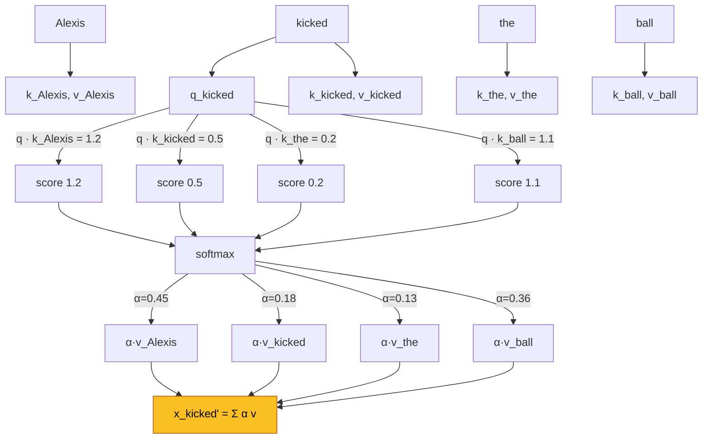
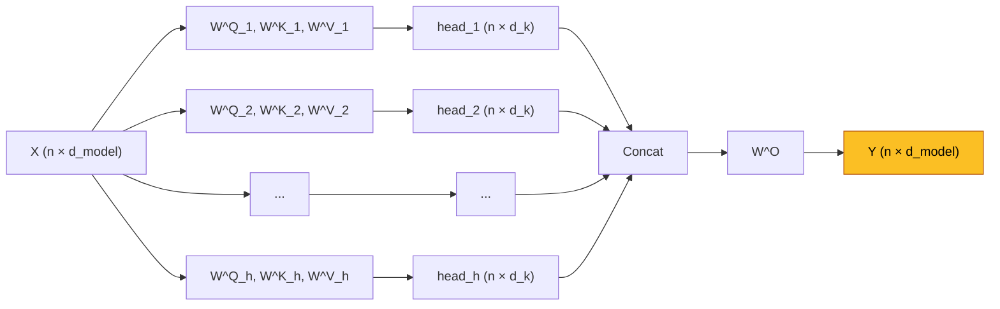

**Self-attention** es la operacion central del Transformer y el ladrillo basico de toda la era moderna de LLMs. Generaliza el [mecanismo de atencion](/fundamentos/mecanismo-atencion) de Bahdanau (cross-attention entre encoder y decoder) al caso donde **query, key y value provienen de la misma secuencia**: cada token redefine su representacion como combinacion ponderada del resto de los tokens, en una sola operacion paralelizable.

Introducida masivamente por **Vaswani et al. (NeurIPS 2017)** en *Attention is All You Need*, eliminando recurrencias y convoluciones del modelo Seq2Seq y dejando solo atencion + feedforward. Es la operacion que escala a 10^11+ parametros y domina NLP, vision, multimodal y biologia computacional.

---

## 1. Motivacion: Limitaciones de las RNNs

Las [RNNs](/fundamentos/redes-recurrentes) (incluido [LSTM y GRU](/fundamentos/lstm-gru)) procesan secuencias **paso a paso**:

$$h_t = f(h_{t-1}, x_t)$$

Tres problemas estructurales emergen:

1. **No paralelizable**: cada $h_t$ depende de $h_{t-1}$. En una GPU con miles de cores, debemos esperar $T$ pasos secuenciales para procesar una oracion de longitud $T$.
2. **Cuello de botella del hidden state**: toda la informacion del pasado se comprime en un vector $h_t$ de dimension fija. Detalles tempranos se diluyen.
3. **Distancia $O(n)$ entre tokens**: la senal del token 1 al token 100 debe atravesar 99 multiplicaciones matriciales, sufriendo vanishing gradients y mezcla con todo lo intermedio.

Self-attention resuelve los tres simultaneamente: distancia $O(1)$ entre cualquier par de tokens, paralelizable trivialmente sobre $T$, y apilable jerarquicamente como bloques.


**La revolucion del 2017 no es atencion en si** -- ya existia desde 2015. Es darse cuenta de que **atencion sola, sin RNN ni CNN, basta** para modelar secuencias, y que ademas es radicalmente mas paralelizable.


---

## 2. De Cross-Attention a Self-Attention

En **Bahdanau (cross-attention)**:

- Query $q$ proviene del **decoder** (estado $s_{i-1}$).
- Keys y values $k_j, v_j$ provienen del **encoder** (anotaciones $h_j$).
- Es una atencion **entre dos secuencias distintas**.

En **self-attention**:

- Query, key y value se derivan **todas de la misma secuencia** $X = (x_1, \ldots, x_n)$.
- Cada token $x_i$ produce su propio $q_i, k_i, v_i$.
- El token $x_i$ se redefine como combinacion ponderada de los $v_j$ de toda la secuencia, donde los pesos miden cuanto $x_i$ "se interesa" por $x_j$.

Conceptualmente: cada palabra **pregunta** (query) a todas las demas palabras de la oracion **quien soy yo en este contexto**, y reune sus **valores** (value) ponderados por la **similitud** (key vs query).

---

## 3. Query, Key, Value como Acceso a Memoria

Una analogia util: pensar en un diccionario Python como memoria externa:

```python
memory = {"Alexis": "agente", "kicked": "accion", "ball": "objeto"}
result = memory["kicked"]  # acceso exacto por key
```

En self-attention el acceso es **soft**: en lugar de una key exacta, la query se compara con **todas** las keys, y se devuelve una combinacion ponderada de todos los values.

Cada token $x_i \in \mathbb{R}^{d_{model}}$ se proyecta linealmente a tres espacios:

$$q_i = W^Q x_i, \quad k_i = W^K x_i, \quad v_i = W^V x_i$$

donde $W^Q, W^K \in \mathbb{R}^{d_k \times d_{model}}$ y $W^V \in \mathbb{R}^{d_v \times d_{model}}$ son matrices aprendibles.

- $q_i$: "que estoy buscando".
- $k_i$: "que ofrezco como identificador".
- $v_i$: "que contenido entrego si me eligen".

Apilando filas para los $n$ tokens obtenemos $Q, K \in \mathbb{R}^{n \times d_k}$ y $V \in \mathbb{R}^{n \times d_v}$.

---

## 4. Producto Punto y Similitud

La similitud entre query $q$ y key $k$ se mide con **producto punto**:

$$q \cdot k = |q||k| \cos\theta$$

- Si $q$ y $k$ apuntan en la misma direccion, $\cos\theta = 1$ → score alto.
- Si son ortogonales, $\cos\theta = 0$ → score cero.
- Si son opuestos, score negativo.

El producto punto $QK^T$ produce una matriz $n \times n$ donde la entrada $(i, j)$ es el score "cuanto le importa al token $i$ el token $j$".

---

## 5. Ecuacion Central: Scaled Dot-Product Attention

La operacion completa es:

$$\text{Attention}(Q, K, V) = \text{softmax}\left(\frac{QK^T}{\sqrt{d_k}}\right) V$$

Desglose:

1. $QK^T \in \mathbb{R}^{n \times n}$: matriz de scores crudos.
2. Division por $\sqrt{d_k}$: normalizacion de varianza (justificada abajo).
3. Softmax fila por fila: cada fila se vuelve una distribucion sobre los $n$ tokens, con $\sum_j \alpha_{ij} = 1$.
4. Multiplicacion por $V$: cada token recibe la combinacion ponderada de los values de toda la secuencia.

### 5.1 Por que dividir por $\sqrt{d_k}$

Si $q, k \in \mathbb{R}^{d_k}$ son vectores aleatorios con $q_i, k_i \sim \mathcal{N}(0, 1)$ independientes, entonces:

$$E[q^T k] = \sum_{i=1}^{d_k} E[q_i] E[k_i] = 0$$
$$\text{Var}(q^T k) = \sum_{i=1}^{d_k} \text{Var}(q_i k_i) = d_k$$

Es decir, la **desviacion estandar del producto punto crece como $\sqrt{d_k}$**. Para $d_k = 64$, los logits crudos pueden tener magnitud $\sim 8$.

Cuando entregamos a softmax logits muy grandes en magnitud, la salida se **satura** (pasa a ser casi one-hot) y los gradientes con respecto a las entradas tienden a cero. Esto colapsa el aprendizaje.

Dividir por $\sqrt{d_k}$ devuelve la varianza a 1 y mantiene la softmax operando en un regimen sano.


**El factor $1/\sqrt{d_k}$ no es cosmetico**. Sin el, para $d_{model}$ grande la softmax se satura y el entrenamiento no converge. Es una correccion estadistica fundamental.


---

## 6. Diagrama Operativo

Ejemplo: oracion *"Alexis kicked the ball"*. El token query es **kicked**.



Interpretacion: la nueva representacion de **kicked** mezcla principalmente la informacion de **Alexis** (sujeto) y **ball** (objeto), porque sus keys son las mas afines a la query de **kicked**. Hemos hecho que el verbo "absorba" su contexto sintactico-semantico en una sola operacion.

---

## 7. Por que Self-Attention Funciona Tan Bien

Cuatro propiedades estructurales:

1. **Paralelizable**: $QK^T$ es una multiplicacion matricial densa. Toda la matriz $n \times n$ se computa en una sola pasada en GPU/TPU. Comparado con RNN ($T$ pasos secuenciales), es 10-100x mas rapido en hardware moderno.
2. **Distancia constante entre tokens**: cualquier par $(i, j)$ se conecta directamente via $q_i^T k_j$. No hay "ruta indirecta" como en RNN ni "ventana receptiva limitada" como en CNN.
3. **Apilable**: salida de un bloque de self-attention tiene la misma forma $\mathbb{R}^{n \times d_{model}}$ que la entrada → se apilan $L$ bloques (BERT-base: 12, GPT-3: 96).
4. **Inductive bias debil**: el modelo ve la secuencia como un **grafo totalmente conectado** entre tokens, sin asumir orden ni localidad. Eso es flexibilidad pura, pero exige aprenderlo todo desde datos (de ahi la necesidad de [positional encoding](/fundamentos/positional-encoding) y de mucho training data).

---

## 8. Multi-Head Attention

### 8.1 Motivacion

Una sola softmax por posicion produce **una sola distribucion de atencion**: el modelo solo puede "mirar" un patron por capa. Pero linguisticamente, la palabra **kicked** debe atender simultaneamente a:

- su **sujeto** (Alexis),
- su **objeto** (ball),
- su **modificador** (the en el sintagma nominal).

Tres patrones distintos. Con una sola cabeza, la softmax fuerza a comprometer entre ellos.

### 8.2 Definicion

Multi-head attention proyecta $Q, K, V$ a $h$ subespacios distintos, calcula atencion en paralelo, y concatena:

$$\text{MultiHead}(Q, K, V) = W^O \cdot \text{Concat}(\text{head}_1, \ldots, \text{head}_h)$$
$$\text{head}_i = \text{Attention}(Q W_i^Q, K W_i^K, V W_i^V)$$

con $W_i^Q, W_i^K \in \mathbb{R}^{d_{model} \times d_k}$, $W_i^V \in \mathbb{R}^{d_{model} \times d_v}$, $W^O \in \mathbb{R}^{h d_v \times d_{model}}$.

### 8.3 Hiperparametros del paper Vaswani

| Simbolo | Valor (base) | Significado |
|---|---|---|
| $d_{model}$ | 512 | Dimension de embedding |
| $h$ | 8 | Numero de cabezas |
| $d_k = d_v$ | 64 | Dimension por cabeza ($d_{model}/h$) |
| Capas $L$ | 6 | Bloques apilados (encoder/decoder) |

Observacion: como $d_k = d_{model}/h$, el costo total de multi-head es **comparable** al de single-head con $d_{model}$ completo. Multi-head no agrega costo, agrega expresividad.



### 8.4 Que aprenden las cabezas

Estudios post-hoc (Clark et al. 2019, Voita et al. 2019) muestran que distintas cabezas se especializan en:

- **Atencion sintactica**: una cabeza atiende al objeto directo de cada verbo.
- **Atencion posicional**: cabezas que atienden al token anterior, dos atras, etc.
- **Atencion a tokens raros**: cabezas que atienden a entidades nombradas o tokens con baja frecuencia.

No hay supervision explicita -- estos roles emergen del pretraining.

---

## 9. Costos Computacionales

Comparacion de las tres operaciones clasicas para procesar una secuencia de longitud $n$ con dimension $d$:

| Operacion | Complejidad temporal | Memoria | Pasos secuenciales | Camino max |
|---|---|---|---|---|
| Self-attention | $O(n^2 \cdot d)$ | $O(n^2)$ | $O(1)$ | $O(1)$ |
| Recurrent (RNN) | $O(n \cdot d^2)$ | $O(n)$ | $O(n)$ | $O(n)$ |
| Convolutional (kernel $k$) | $O(k \cdot n \cdot d^2)$ | $O(n)$ | $O(1)$ | $O(\log_k n)$ |

(Tabla 1 del paper Vaswani 2017)

Lectura clave: **self-attention gana cuando $n < d$**, lo cual es tipico en NLP (oraciones de 50 tokens, $d = 512$). Cuando $n \gg d$ (audio largo, ADN), la complejidad cuadratica se vuelve prohibitiva → motivacion para variantes eficientes (seccion 13).

---

## 10. Variantes de Masking

Self-attention permite tres tipos de mascara, que se aplican **antes** de la softmax sumando $-\infty$ a las posiciones bloqueadas (asi su softmax sera 0).

### 10.1 Padding mask

Las secuencias en un batch tienen distinta longitud → se rellenan con tokens `[PAD]`. La padding mask **bloquea atencion hacia tokens PAD** para que no contribuyan al output.

### 10.2 Causal / triangular mask

En el **decoder autoregresivo** de un Transformer (o en GPT), el token $i$ solo puede atender a tokens $j \leq i$, no al futuro. Se implementa con una matriz triangular inferior:

$$M_{ij} = \begin{cases} 0 & j \leq i \\ -\infty & j > i \end{cases}$$

Sin esta mascara, el modelo "vee" su propia respuesta durante training.

### 10.3 Cross-attention (encoder-decoder)

En el bloque que conecta encoder y decoder del Transformer original, los queries vienen del decoder y keys/values del encoder. **No hay mascara causal** sobre las keys del encoder (se puede atender a toda la oracion fuente), pero si hay padding mask para PADs del encoder.

---

## 11. Implementacion



```python
import torch
import torch.nn as nn
import torch.nn.functional as F

def scaled_dot_product_attention(Q, K, V, mask=None):
    # Q, K: (batch, heads, n, d_k)
    # V: (batch, heads, n, d_v)
    d_k = Q.size(-1)
    scores = torch.einsum('bhid,bhjd->bhij', Q, K) / (d_k ** 0.5)
    if mask is not None:
        scores = scores.masked_fill(mask == 0, float('-inf'))
    alpha = F.softmax(scores, dim=-1)
    out = torch.einsum('bhij,bhjd->bhid', alpha, V)
    return out, alpha

class MultiHeadAttention(nn.Module):
    def __init__(self, d_model, num_heads):
        super().__init__()
        assert d_model % num_heads == 0
        self.h = num_heads
        self.d_k = d_model // num_heads
        self.W_Q = nn.Linear(d_model, d_model, bias=False)
        self.W_K = nn.Linear(d_model, d_model, bias=False)
        self.W_V = nn.Linear(d_model, d_model, bias=False)
        self.W_O = nn.Linear(d_model, d_model, bias=False)

    def forward(self, x_q, x_k, x_v, mask=None):
        b, n, _ = x_q.size()
        Q = self.W_Q(x_q).view(b, n, self.h, self.d_k).transpose(1, 2)
        K = self.W_K(x_k).view(b, -1, self.h, self.d_k).transpose(1, 2)
        V = self.W_V(x_v).view(b, -1, self.h, self.d_k).transpose(1, 2)
        out, alpha = scaled_dot_product_attention(Q, K, V, mask)
        out = out.transpose(1, 2).contiguous().view(b, n, self.h * self.d_k)
        return self.W_O(out), alpha
```


```python
import jax
import jax.numpy as jnp
from flax import linen as nn

def scaled_dot_product_attention(Q, K, V, mask=None):
    d_k = Q.shape[-1]
    scores = jnp.einsum('bhid,bhjd->bhij', Q, K) / jnp.sqrt(d_k)
    if mask is not None:
        scores = jnp.where(mask == 0, -1e9, scores)
    alpha = jax.nn.softmax(scores, axis=-1)
    out = jnp.einsum('bhij,bhjd->bhid', alpha, V)
    return out, alpha

class MultiHeadAttention(nn.Module):
    d_model: int
    num_heads: int

    @nn.compact
    def __call__(self, x_q, x_k, x_v, mask=None):
        assert self.d_model % self.num_heads == 0
        d_k = self.d_model // self.num_heads
        b, n, _ = x_q.shape

        Q = nn.Dense(self.d_model, use_bias=False)(x_q)
        K = nn.Dense(self.d_model, use_bias=False)(x_k)
        V = nn.Dense(self.d_model, use_bias=False)(x_v)

        Q = Q.reshape(b, n, self.num_heads, d_k).transpose(0, 2, 1, 3)
        K = K.reshape(b, -1, self.num_heads, d_k).transpose(0, 2, 1, 3)
        V = V.reshape(b, -1, self.num_heads, d_k).transpose(0, 2, 1, 3)

        out, alpha = scaled_dot_product_attention(Q, K, V, mask)
        out = out.transpose(0, 2, 1, 3).reshape(b, n, self.d_model)
        return nn.Dense(self.d_model, use_bias=False)(out), alpha
```


```python
import tensorflow as tf

def scaled_dot_product_attention(Q, K, V, mask=None):
    d_k = tf.cast(tf.shape(Q)[-1], tf.float32)
    scores = tf.einsum('bhid,bhjd->bhij', Q, K) / tf.sqrt(d_k)
    if mask is not None:
        scores += (1.0 - tf.cast(mask, tf.float32)) * -1e9
    alpha = tf.nn.softmax(scores, axis=-1)
    out = tf.einsum('bhij,bhjd->bhid', alpha, V)
    return out, alpha

class MultiHeadAttention(tf.keras.layers.Layer):
    def __init__(self, d_model, num_heads):
        super().__init__()
        assert d_model % num_heads == 0
        self.h = num_heads
        self.d_k = d_model // num_heads
        self.d_model = d_model
        self.W_Q = tf.keras.layers.Dense(d_model, use_bias=False)
        self.W_K = tf.keras.layers.Dense(d_model, use_bias=False)
        self.W_V = tf.keras.layers.Dense(d_model, use_bias=False)
        self.W_O = tf.keras.layers.Dense(d_model, use_bias=False)

    def split_heads(self, x):
        b = tf.shape(x)[0]
        n = tf.shape(x)[1]
        x = tf.reshape(x, (b, n, self.h, self.d_k))
        return tf.transpose(x, perm=[0, 2, 1, 3])

    def call(self, x_q, x_k, x_v, mask=None):
        Q = self.split_heads(self.W_Q(x_q))
        K = self.split_heads(self.W_K(x_k))
        V = self.split_heads(self.W_V(x_v))
        out, alpha = scaled_dot_product_attention(Q, K, V, mask)
        out = tf.transpose(out, perm=[0, 2, 1, 3])
        b = tf.shape(out)[0]
        n = tf.shape(out)[1]
        out = tf.reshape(out, (b, n, self.d_model))
        return self.W_O(out), alpha
```



Notas de implementacion:

- En produccion se usan kernels fusionados (`torch.nn.functional.scaled_dot_product_attention` desde PyTorch 2.0, que internamente puede llamar a **FlashAttention**).
- Las tres proyecciones $W^Q, W^K, W^V$ suelen fusionarse en una unica matriz $W^{QKV} \in \mathbb{R}^{d_{model} \times 3 d_{model}}$ por eficiencia.

---

## 12. Self-Attention como Inductive Bias Relacional

Una lectura conceptual potente: self-attention ve la entrada como un **conjunto de entidades** sin orden a priori, y modela un **grafo totalmente conectado** entre ellas. Cada arista lleva un peso $\alpha_{ij}$ aprendido de los datos.

Esto la conecta directamente con las **Relation Networks** de Santoro et al. (NeurIPS 2017), que computan:

$$\text{RN}(X) = f_\phi\left(\sum_{i,j} g_\theta(x_i, x_j)\right)$$

es decir, una agregacion sobre todos los pares de entidades. Self-attention es una instancia particularmente eficiente de esta idea, donde $g_\theta$ se factoriza como $\langle q_i, k_j \rangle$ y la agregacion es una suma ponderada por softmax.

Implicacion: los Transformers son **arquitecturas relacionales**. Es la razon por la que funcionan bien en grafos, conjuntos, programas, biologia molecular, ademas de texto.

---

## 13. Limitaciones y Eficiencia

La complejidad $O(n^2)$ en tiempo y memoria es el principal cuello de botella. Para $n = 4096$ tokens, la matriz de atencion ya pesa $4096^2 = 16.7M$ entradas por cabeza por capa.

Familias de soluciones:

- **Linformer (Wang et al. 2020)**: proyecta $K, V$ a una dimension $k \ll n$ → complejidad $O(n \cdot k)$.
- **Performer (Choromanski et al. 2021)**: aproxima softmax con kernels random features → $O(n \cdot d)$ exacto en expectativa.
- **Longformer (Beltagy et al. 2020)**: atencion con ventana local + algunos tokens globales → $O(n \cdot w)$.
- **FlashAttention (Dao et al. 2022)**: no reduce la complejidad asintotica, pero **reorganiza la computacion** para evitar materializar la matriz $n \times n$ en HBM, logrando 2-4x speedup y $10\times$ menos memoria. Es exacto, no aproximado.
- **Sliding-window + recurrencia (Mistral, Mamba)**: hibridos con state-space models que recuperan procesamiento lineal.

Otra critica importante: las **attention weights no son explicaciones causales**. Visualizarlas es util como heuristica, pero estudios (Jain & Wallace 2019) muestran que distintos patrones de $\alpha$ pueden producir las mismas predicciones, por lo que no son un mapa fiable de "donde mira el modelo".

---

## 14. Resumen

- **Self-attention** es atencion donde $Q, K, V$ provienen de la **misma secuencia**, generalizando la idea de Bahdanau a un grafo totalmente conectado entre tokens.
- Operacion central: $\text{Attention}(Q,K,V) = \text{softmax}(QK^T/\sqrt{d_k}) V$. El factor $1/\sqrt{d_k}$ normaliza varianza para evitar saturacion de softmax.
- **Ventajas** sobre RNN: paralelizable, distancia $O(1)$ entre tokens, apilable, inductive bias debil pero expresivo.
- **Multi-head**: $h$ proyecciones independientes que se concatenan permiten al modelo atender a varios patrones simultaneamente. Vaswani: $d_{model}=512$, $h=8$, $d_k=64$.
- **Costo**: $O(n^2 d)$ tiempo, $O(n^2)$ memoria. Optima cuando $n < d$.
- **Variantes de masking**: padding (ignorar PADs), causal (decoder autoregresivo), cross (encoder-decoder).
- **Bias relacional**: self-attention modela tokens como nodos de un grafo completo, conectandola con Relation Networks.
- **Limitaciones**: complejidad cuadratica → familia de variantes eficientes (Linformer, Performer, FlashAttention, Longformer).

## Ver tambien

- [Mecanismo de Atencion](/fundamentos/mecanismo-atencion) -- la formulacion original de Bahdanau (cross-attention).
- [Transformer](/fundamentos/transformer) -- la arquitectura completa que usa self-attention como bloque central.
- [Positional Encoding](/fundamentos/positional-encoding) -- el complemento necesario para inyectar orden a self-attention.
- [Redes Recurrentes](/fundamentos/redes-recurrentes) y [LSTM y GRU](/fundamentos/lstm-gru) -- las arquitecturas que self-attention reemplazo.
- [Paper Attention is All You Need (Vaswani 2017)](/papers/attention-is-all-you-need-vaswani-2017) -- paper seminal.
- [Clase 14](/clases/clase-14) -- introduccion a Transformers en el curso.
