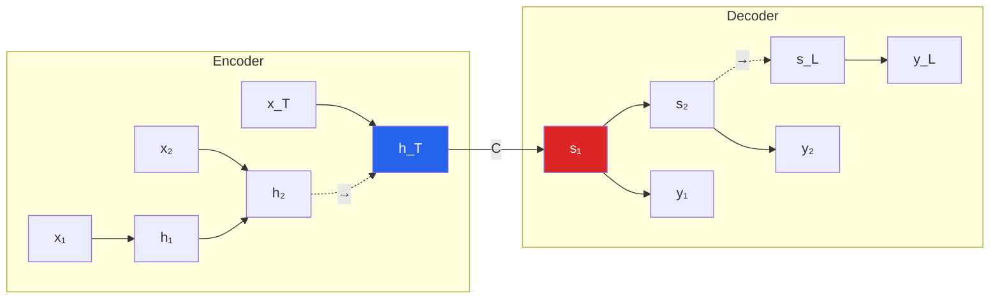

**Sequence-to-Sequence (Seq2Seq)** es el paradigma que generalizo las RNNs recurrentes al problema de mapear una **secuencia de entrada** de longitud $T$ a una **secuencia de salida** de longitud $T'$ (donde $T \neq T'$). Es la base de la traduccion automatica neural, resumen, dialogo, image captioning, speech-to-text y, en general, toda transformacion de un dominio secuencial a otro. Su contribucion conceptual central -- la **arquitectura encoder-decoder** -- sobrevivio al reemplazo de RNNs por Transformers y sigue siendo el patron dominante de las LLMs modernas.

---

## 1. El Problema que Resuelve

Las RNNs clasicas (many-to-one, many-to-many sincronicas) requieren que la entrada y la salida tengan **alineacion fija**: cada input $x_t$ se corresponde con un output $y_t$ en el mismo paso. Pero muchas tareas reales no cumplen esto:

- **Traduccion**: "I like cats" (3 palabras) → "Me gustan los gatos" (4 palabras). No hay alineacion uno-a-uno.
- **Resumen**: articulo de 1000 palabras → resumen de 50 palabras.
- **Image captioning**: imagen (entrada no secuencial) → frase (secuencia).
- **Speech-to-text**: audio de duracion variable → texto de longitud distinta.

Seq2Seq resuelve esto separando la tarea en **dos redes recurrentes acopladas**: una que entiende la entrada (encoder) y otra que genera la salida (decoder).

---

## 2. Arquitectura Encoder-Decoder

### 2.1 Vista general



### 2.2 Encoder

Lee la secuencia fuente y la comprime en un **vector de contexto** $c$ (typically el ultimo estado oculto):

$$h_t = f(h_{t-1}, x_t), \quad c = q(h_1, \ldots, h_T)$$

En la formulacion estandar: $c = h_T$. $f$ es tipicamente una LSTM/GRU (vanilla RNN no funciona bien en secuencias largas por vanishing gradient).

### 2.3 Decoder

Genera la secuencia objetivo **autoregresivamente** condicionado en $c$:

$$s_t = g(s_{t-1}, y_{t-1}, c)$$
$$p(y_t \mid y_{<t}, c) = \text{softmax}(W_y s_t + b_y)$$

En cada paso, el decoder:
1. Toma su estado previo $s_{t-1}$.
2. Toma el token generado en el paso anterior $y_{t-1}$ (durante inferencia) o el ground truth (durante entrenamiento, **teacher forcing**).
3. Consulta el contexto $c$.
4. Produce una distribucion sobre el vocabulario y muestrea/selecciona $y_t$.

### 2.4 Objetivo de entrenamiento

Maximiza la **log-verosimilitud conditional** sobre los pares $(x_i, y_i)$ del training set:

$$\max_\theta \; \frac{1}{|TS|} \sum_{(x_i, y_i) \in TS} \log P(y_i \mid x_i; \theta)$$

Descompuesto por regla de la cadena:

$$\log P(y \mid x) = \sum_{t=1}^{T'} \log P(y_t \mid y_{<t}, c)$$

Loss: negative log-likelihood (cross-entropy).

---

## 3. El Vector de Contexto como Espacio Semantico

Un insight sorprendente de Sutskever et al. 2014: el vector $c$ termina codificando el **significado** de la oracion fuente en un espacio continuo. Proyecciones PCA 2D muestran:

- `"John admires Mary"`, `"Mary admires John"` → proxies pero **distintos** (orden de palabras preservado).
- `"John is in love with Mary"`, `"John admires Mary"` → cerca (similitud semantica).
- Oraciones con misma estructura gramatical pero distintos nombres → agrupadas.

Esto **no podria capturarse con un bag-of-words**: el orden de palabras importa, y el modelo lo refleja en la geometria del embedding.

---

## 4. Teacher Forcing

Durante el entrenamiento, el decoder recibe **el ground truth** $y_{t-1}^*$ (no su propia prediccion $\hat{y}_{t-1}$) como input en cada paso. Esto:

**Ventajas**:
- Training paralelizable: todas las predicciones se calculan en una sola pasada.
- Convergencia mas rapida: no se acumulan errores a lo largo de la secuencia.
- Gradiente mas estable.

**Desventaja**: **exposure bias**. En inferencia, el modelo nunca ha visto sus propios errores, asi que cuando comete uno (y inevitable lo hace), la distribucion de inputs cambia y el modelo performa peor. Soluciones parciales: **scheduled sampling** (Bengio 2015), curriculum learning, o modelos no autoregresivos.

---

## 5. Inferencia: Beam Search

En inferencia no tenemos el ground truth. Opciones:

### 5.1 Greedy decoding

En cada paso elegir $\hat{y}_t = \arg\max P(y_t \mid y_{<t}, c)$. Rapido pero suboptimo: elecciones locales no garantizan la secuencia mas probable global.

### 5.2 Beam search

Mantener los $B$ **mejores prefijos** (hipothesis). En cada paso:
1. Expandir cada hipothesis con cada palabra del vocabulario.
2. Calcular log-prob de cada expansion.
3. Seleccionar los $B$ con mayor log-prob acumulada.
4. Detener cuando todas las hipothesis generen `<EOS>`.

Con $B = 4$ a $20$, mejora sustancialmente sobre greedy sin costo computacional prohibitivo.

### 5.3 Length normalization

Beam search favorece secuencias cortas (cada log-prob es negativo, suma mas larga = mas negativo). Se aplica normalizacion por longitud:

$$\text{score}(y) = \frac{\log P(y \mid x)}{L^\alpha}$$

con $\alpha \in [0.6, 0.8]$.

---

## 6. Sutskever et al. 2014: El Modelo Canonico

El paper fundacional de Seq2Seq ([ver ficha](/papers/seq2seq-sutskever-2014)) tiene detalles tecnicos importantes:

| Componente | Detalle |
|---|---|
| Arquitectura | 4-layer stacked LSTM (encoder) + 4-layer LSTM (decoder) |
| Hidden size | 1000 cells por capa |
| Vocabulario | 160K fuente, 80K objetivo (ingles-frances WMT'14) |
| Embeddings | 1000-dim, aprendidos |
| Parametros totales | 384M |
| Entrenamiento | 10 dias en 8 GPUs |
| Truco clave | **Invertir la secuencia fuente**: `"ABC"` → `"CBA"` antes de encoder. BLEU sube de 25.9 a 30.6 |
| Beam size | 12 |

El **reversal trick** funciona porque reduce la "minimum time lag" entre la primera palabra fuente y la primera palabra target, facilitando el flujo de gradientes en el LSTM.

---

## 7. Cuello de Botella del Vector Fijo

El problema fundamental de Seq2Seq vanilla: **comprimir toda la oracion fuente en un vector $c$ de dimension fija** limita el rendimiento en oraciones largas.

Empiricamente (Cho et al. 2014):
- Oraciones cortas (<10 palabras): baseline seq2seq funciona bien.
- Oraciones medianas (15-30 palabras): performance degrada.
- Oraciones largas (>40 palabras): BLEU cae dramaticamente.

Bahdanau, Cho & Bengio (2015) documentaron que RNNencdec-50 (entrenado en oraciones ≤50 palabras) cae de BLEU ~25 a ~10 cuando la oracion de test tiene >50 palabras.

**Solucion**: [mecanismo de atencion](mecanismo-atencion) -- permitir al decoder "mirar" directamente a los estados del encoder en cada paso, sin el cuello de botella.

---

## 8. Aplicaciones Canonicas

### 8.1 Traduccion automatica (NMT)

La aplicacion historica. Sutskever 2014, Bahdanau 2015, Google's GNMT (Wu et al. 2016), Transformer (Vaswani 2017) -- todos usan encoder-decoder.

### 8.2 Resumen abstractivo

Generar resumenes que pueden incluir palabras no presentes en el texto fuente. See, Liu & Manning (2017) con **pointer-generator networks** mitigan OOV combinando atencion sobre fuente con generacion de vocabulario.

### 8.3 Image captioning

"Show, Attend and Tell" (Xu et al. 2015): CNN como encoder → secuencia de annotation vectors → LSTM decoder con atencion sobre las regiones de la imagen.

### 8.4 Speech recognition

"Listen, Attend and Spell" (Chan et al. 2016): audio spectrogram → pyramidal BiLSTM encoder → attention decoder → transcripcion.

### 8.5 Dialogo y chat

Primera generacion de chatbots seq2seq (Vinyals & Le 2015). Evolucionaron a Transformers y finalmente LLMs modernas.

### 8.6 Code generation, SQL generation, formula parsing

Cualquier tarea de traduccion "linguistica" formal es naturalmente seq2seq.

---

## 9. Implementacion Basica



```python
import torch
import torch.nn as nn

class Encoder(nn.Module):
    def __init__(self, vocab_size, embed_dim, hidden_size, num_layers=2):
        super().__init__()
        self.embedding = nn.Embedding(vocab_size, embed_dim)
        self.lstm = nn.LSTM(embed_dim, hidden_size, num_layers, batch_first=True)

    def forward(self, x):
        emb = self.embedding(x)  # (batch, seq, embed)
        outputs, (h, c) = self.lstm(emb)
        return outputs, (h, c)  # h, c: (num_layers, batch, hidden)

class Decoder(nn.Module):
    def __init__(self, vocab_size, embed_dim, hidden_size, num_layers=2):
        super().__init__()
        self.embedding = nn.Embedding(vocab_size, embed_dim)
        self.lstm = nn.LSTM(embed_dim, hidden_size, num_layers, batch_first=True)
        self.fc = nn.Linear(hidden_size, vocab_size)

    def forward(self, y, hidden):
        emb = self.embedding(y)
        outputs, hidden = self.lstm(emb, hidden)
        logits = self.fc(outputs)
        return logits, hidden

class Seq2Seq(nn.Module):
    def __init__(self, encoder, decoder):
        super().__init__()
        self.encoder = encoder
        self.decoder = decoder

    def forward(self, src, tgt, teacher_forcing=1.0):
        _, hidden = self.encoder(src)
        # Teacher forcing: alimentar ground truth
        logits, _ = self.decoder(tgt, hidden)
        return logits
```


```python
import jax
import jax.numpy as jnp
from flax import linen as nn

class Encoder(nn.Module):
    hidden_size: int

    @nn.compact
    def __call__(self, x):
        embed = nn.Embed(num_embeddings=10000, features=128)(x)
        lstm = nn.RNN(nn.OptimizedLSTMCell(features=self.hidden_size))
        return lstm(embed)

class Decoder(nn.Module):
    hidden_size: int
    vocab_size: int

    @nn.compact
    def __call__(self, y, h0, c0):
        embed = nn.Embed(num_embeddings=self.vocab_size, features=128)(y)
        lstm = nn.RNN(nn.OptimizedLSTMCell(features=self.hidden_size))
        h = lstm(embed, initial_carry=(h0, c0))
        return nn.Dense(self.vocab_size)(h)
```


```python
import tensorflow as tf

class Encoder(tf.keras.Model):
    def __init__(self, vocab_size, embed_dim, hidden_size):
        super().__init__()
        self.embedding = tf.keras.layers.Embedding(vocab_size, embed_dim)
        self.lstm = tf.keras.layers.LSTM(hidden_size, return_state=True,
                                          return_sequences=True)

    def call(self, x):
        emb = self.embedding(x)
        outputs, h, c = self.lstm(emb)
        return outputs, [h, c]

class Decoder(tf.keras.Model):
    def __init__(self, vocab_size, embed_dim, hidden_size):
        super().__init__()
        self.embedding = tf.keras.layers.Embedding(vocab_size, embed_dim)
        self.lstm = tf.keras.layers.LSTM(hidden_size, return_state=True,
                                          return_sequences=True)
        self.fc = tf.keras.layers.Dense(vocab_size)

    def call(self, y, state):
        emb = self.embedding(y)
        outputs, h, c = self.lstm(emb, initial_state=state)
        return self.fc(outputs), [h, c]
```



---

## 10. Evolucion y Reemplazo por Transformers

El pipeline historico:

| Ano | Modelo | Innovacion |
|---|---|---|
| 2014 | Sutskever Seq2Seq | Encoder-decoder LSTM, reversal trick |
| 2014 | Cho GRU + Encoder-decoder | GRU simplificada, phrase scoring |
| 2015 | Bahdanau Attention | Elimina cuello de botella del vector $c$ |
| 2015 | Luong Attention | Variantes dot-product y multiplicative |
| 2016 | Google GNMT | Deep stacked LSTMs + attention + coverage, produccion |
| 2017 | **Transformer** | **Atencion pura, sin recurrencia** |

Los Transformers (Vaswani et al. 2017) mantienen el patron encoder-decoder pero reemplazan las RNNs por **self-attention**:

- Encoder: N layers de (Self-Attention + FFN).
- Decoder: N layers de (Masked Self-Attention + Cross-Attention + FFN).
- **Cross-attention** es el "attention" de Bahdanau, pero ahora es el **unico** conector entre encoder y decoder.

Los LLMs modernos (GPT, Claude, Gemini) son **decoder-only Transformers** -- variantes sin encoder, entrenadas con masked language modeling autoregresivo sobre trillions de tokens.

---

## 11. Resumen

- **Seq2Seq** = dos RNNs acopladas: **encoder** comprime la entrada en $c$, **decoder** genera la salida autoregresivamente.
- Resuelve tareas **many-to-many asincronicas** (entradas y salidas de distinta longitud).
- Entrenamiento con **teacher forcing** y **cross-entropy**; inferencia con **beam search**.
- El vector de contexto aprende un **espacio semantico continuo** que preserva el orden.
- **Cuello de botella** del vector fijo → motivo para introducir **atencion**.
- Aplicaciones: traduccion, resumen, image captioning, speech, dialogo, code generation.
- Evolucion natural: **Transformers** reemplazan las RNNs manteniendo el patron encoder-decoder.

Ver tambien: [Mecanismo de Atencion](mecanismo-atencion) · [Redes Recurrentes](redes-recurrentes) · [LSTM y GRU](lstm-gru) · [Paper Sutskever 2014](/papers/seq2seq-sutskever-2014) · [Paper Bahdanau 2015](/papers/bahdanau-attention-2015) · [Clase 13](/clases/clase-13).
