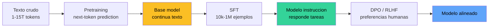

**Supervised Fine-Tuning (SFT)** es la fase del pipeline de un LLM moderno en la que un modelo **base** -- entrenado con next-token prediction sobre texto crudo -- se ajusta a un dataset de **pares (instruccion, respuesta)** para que aprenda a **comportarse como asistente**. Es el paso que transforma un modelo que **continua** texto en un modelo que **responde** preguntas.

SFT no inventa una arquitectura nueva ni un loss nuevo: usa el mismo Transformer y el mismo cross-entropy del pretraining. Lo que cambia son tres cosas concretas: el dataset es supervisado y curado, el learning rate es mucho menor, y la **loss se enmascara** para penalizar solo los tokens de la respuesta. Esa ultima pieza -- el [loss masking](/fundamentos/loss-masking) -- es la diferencia tecnicamente sutil entre "continuar el texto" y "aprender a responder".

---

## 1. Donde encaja SFT en el pipeline LLM

El pipeline tipico de un LLM moderno (Llama 3, Mistral, Claude, GPT) tiene tres fases conceptuales:



- **Pretraining**: aprende lenguaje, hechos del mundo, sintaxis, codigo. Es el 99% del compute. Salida: un modelo que **continua** lo que le des, sin distinguir tarea de continuacion.
- **SFT**: ensena el **formato instruccional** y los comportamientos basicos (responder preguntas, resumir, traducir, seguir instrucciones de sistema). Es el 0.1-1% del compute, pero define la "personalidad" basica.
- **DPO/RLHF**: ajusta a preferencias humanas (ser util, no daniño, honesto). Refina el modelo SFT contra pares chosen/rejected.

SFT es el puente entre "modelo que sabe lenguaje" y "modelo que sabe seguir instrucciones". Sin SFT, un base model como `Llama-3-8B-base` responde a `What is 2+2?` con algo como `\n\nWhat is 3+3?\n\nWhat is 4+4?` -- continua el patron de pregunta-pregunta-pregunta porque eso vio en internet, no respuestas.


**SFT no agrega capacidades nuevas**, las **selecciona**. El base model ya sabe responder; SFT le ensena que cuando ve el patron `INSTR: ... RESP:` debe completar con la respuesta, no con otra instruccion.


---

## 2. Diferencias concretas con pretrain

Mismo modelo, mismo loss base, mismo optimizador (AdamW). Tres diferencias operativas:

| Aspecto | Pretraining | SFT |
|---|---|---|
| Dataset | Texto crudo, ~10^12 tokens | Pares (instruccion, respuesta), ~10^4 - 10^6 ejemplos |
| Learning rate | $\sim 3 \cdot 10^{-4}$ con warmup largo | $\sim 1$ - $5 \cdot 10^{-5}$, casi sin warmup |
| Loss | Cross-entropy sobre **todos los tokens** | Cross-entropy **solo sobre tokens de respuesta** (loss masking) |
| Epochs | 1 (cada token visto una vez) | 1-3 (overfitting es real con pocos datos) |
| Compute | Miles a millones de GPU-hours | Decenas a miles de GPU-hours |
| Init | Pesos aleatorios | Pesos del base model |

El **learning rate** menor es importante: estamos perturbando una solucion ya buena (el base model). Si lr es muy alto, "quemamos" capacidades adquiridas durante pretraining (catastrophic forgetting).

---

## 3. El dataset SFT

Cada ejemplo es un dict con al menos dos campos:

```python
{
    "prompt":   "INSTR: traduce 'hello' al espanol\nRESP: ",
    "response": "hola\n",
}
```

El **prompt** incluye el formato (los marcadores `INSTR:` / `RESP:`) y la instruccion. La **response** es lo que el modelo debe aprender a generar tras el prompt.

Tres familias de datasets SFT en la practica:

- **Human-curated**: anotadores humanos escriben pares (Anthropic HH, OpenAssistant, Dolly). Calidad alta, costo alto, escala chica.
- **Sintetico via LLM mas grande**: un modelo "profesor" (GPT-4, Claude) genera respuestas para instrucciones (Alpaca, Vicuna, WizardLM). Escala barata, riesgo de heredar sesgos del profesor.
- **Filtrado de logs reales**: conversaciones de usuarios pulidas (ShareGPT, datos propietarios). Realismo alto, problemas de privacidad y filtrado.

El formato del prompt es **una convencion del proyecto**, no una propiedad del modelo. Llama usa `[INST] ... [/INST]`, ChatML usa `<|im_start|>user ... <|im_end|>`, en el curso usamos `INSTR: ... \nRESP: ...\n`. La regla: ser consistente entre training e inferencia, y no usar tokens que aparezcan organicamente en respuestas.

---

## 4. Loss masking: el corazon de SFT

Esta es la pieza que distingue SFT de "pretraining sobre datos formateados". Si entrenamos con cross-entropy sobre **todos** los tokens del ejemplo concatenado, el modelo aprende dos cosas a la vez:

1. **Generar instrucciones** (porque las ve en el target).
2. **Responder instrucciones** (lo que queremos).

El primer comportamiento es ruido puro: en inferencia el usuario provee la instruccion, el modelo solo debe responder. Si el modelo aprendio a generar instrucciones, dedicara probabilidad a continuar con `\nINSTR: ...` despues de su respuesta -- el bug clasico del SFT mal hecho.

Solucion: una **mascara binaria** $m_t \in \{0, 1\}$ por token, donde $m_t = 1$ si el token $t$ pertenece a la respuesta y $m_t = 0$ si pertenece al prompt. La loss se vuelve:

$$
\mathcal{L}_{\text{SFT}} = -\frac{1}{\sum_t m_t} \sum_{t} m_t \cdot \log p_\theta(y_t \mid y_{<t})
$$

Es decir, **promediamos cross-entropy solo sobre los tokens de respuesta**. Los tokens del prompt entran al forward (porque el modelo necesita su contexto via attention), pero no contribuyen al gradiente.

Para una explicacion mecanica con diagrama y codigo, ver [loss masking](/fundamentos/loss-masking) -- es una entrada dedicada porque el detalle de alineamiento con `tgt = full[1:]` se equivoca facil.

---

## 5. Hyperparametros tipicos en produccion

Valores reportados en papers y blog posts (Llama, Mistral, Zephyr):

| Hiperparametro | Valor tipico | Comentario |
|---|---|---|
| Learning rate | $1$ - $5 \cdot 10^{-5}$ | Mucho menor que pretrain |
| Batch size (tokens) | $0.5$ - $4$ M | A menudo via gradient accumulation |
| Epochs | 1 - 3 | Overfitting real con datasets chicos |
| Warmup | 3 - 10% del total | Mas corto que pretrain |
| Sequence length | 2048 - 8192 | Cubrir respuestas completas |
| Weight decay | 0.0 - 0.1 | Bajo para no daniar pesos pretrained |
| LR scheduler | Cosine a 10% del peak | Estandar |
| Optimizer | AdamW | $\beta_1=0.9$, $\beta_2=0.95$ o $0.999$ |

Para datasets chicos (10k - 100k ejemplos) en modelos grandes (7B+), tecnicas como **LoRA** son comunes para evitar entrenar todos los parametros.

---

## 6. Implementacion en PyTorch

Esqueleto minimo del paso de training con loss masking, sobre Mini-LLaMA del curso:

```python
import torch
import torch.nn.functional as F

def sft_step(model, batch, optimizer):
    """Un paso de SFT con loss masking."""
    inp = batch["input_ids"][:, :-1]   # (B, T-1)
    tgt = batch["input_ids"][:, 1:]    # (B, T-1)  shift por 1
    mask = batch["mask"][:, 1:]        # (B, T-1)  alineada con tgt

    logits, _ = model(inp)             # (B, T-1, V)
    logits = logits.view(-1, logits.size(-1))
    tgt = tgt.reshape(-1)
    mask = mask.reshape(-1).float()

    # Cross-entropy por token, sin reduccion
    losses = F.cross_entropy(logits, tgt, reduction="none")  # (B*(T-1),)

    # Promediar solo sobre tokens enmascarados con 1
    loss = (losses * mask).sum() / mask.sum().clamp(min=1)

    optimizer.zero_grad()
    loss.backward()
    torch.nn.utils.clip_grad_norm_(model.parameters(), 1.0)
    optimizer.step()
    return loss.item()
```

El `mask = batch["mask"][:, 1:]` es el detalle clave: la mascara se construye sobre el ejemplo completo, pero al alinear con `tgt = full[1:]` debe **shiftear igual**. Equivocar esto enmascara los tokens equivocados y rompe el training.

---

## 7. Limitaciones de SFT

SFT es necesario pero **no suficiente**. Tres limitaciones estructurales empujan a la fase siguiente (DPO/RLHF):

1. **No aprende preferencias relativas**. SFT solo conoce "esta es una respuesta correcta". No tiene forma de expresar "esta es mejor que esta otra". Cuando hay multiples respuestas validas con calidad distinta, SFT promedia y diluye.
2. **Satura facil**. Despues de 1-2 epochs, el loss baja pero la calidad subjetiva no mejora -- el modelo memoriza las respuestas exactas del dataset y pierde diversidad. Tecnicas como sample packing y dropout ayudan poco.
3. **No corrige fallos sutiles** (alucinaciones, sycophancy, refusals incorrectos). Estos son patrones aprendidos del pretraining que SFT no penaliza explicitamente: solo da ejemplos positivos, nunca dice "esto no".

DPO y RLHF resuelven (1) directamente con un loss sobre **pares** (chosen, rejected). Para (3), agregan ejemplos negativos que SFT no puede usar.


**SFT define el formato y los comportamientos basicos**. **DPO/RLHF refina la calidad** dentro de ese formato. Saltarse SFT y hacer DPO directo desde un base model funciona mal -- DPO necesita un punto de partida razonable que ya hable el formato.


---

## 8. Resumen

- **SFT** ajusta un base model con pares (instruccion, respuesta) para que aprenda a **responder** en vez de **continuar** texto.
- Mismo modelo, mismo loss base que pretrain. Cambia el dataset, el learning rate (mucho menor), y se introduce **loss masking** sobre tokens de respuesta.
- El **dataset** son pares formateados con marcadores; existen variantes human-curated, sinteticos y filtrados de logs.
- **Loss masking** evita que el modelo aprenda a generar instrucciones; solo penaliza tokens de la respuesta.
- **Hiperparametros** tipicos: lr $\sim 10^{-5}$, 1-3 epochs, batch grande via gradient accumulation.
- **Limitaciones**: no aprende preferencias relativas, satura facil, no corrige fallos sutiles. Por eso despues viene DPO/RLHF.

## Ver tambien

- [Loss Masking](/fundamentos/loss-masking) -- la pieza mecanica que hace funcionar a SFT.
- [DPO](/fundamentos/dpo) -- la fase siguiente que refina con preferencias.
- [Bradley-Terry](/fundamentos/bradley-terry) -- el modelo de preferencias que sustenta a DPO.
- [Transformer](/fundamentos/transformer) -- la arquitectura sobre la que opera SFT.
- [Foundation Models](/fundamentos/foundation-models) -- el paradigma pretrain + adapt al que SFT pertenece.
- [Clase 14 cap 24 - SFT training](/clases/clase-14/practica/24-sft-training) -- implementacion paso a paso en el curso.
- [Clase 14 cap 23 - Dataset SFT](/clases/clase-14/practica/23-dataset-sft) -- construccion del dataset.
