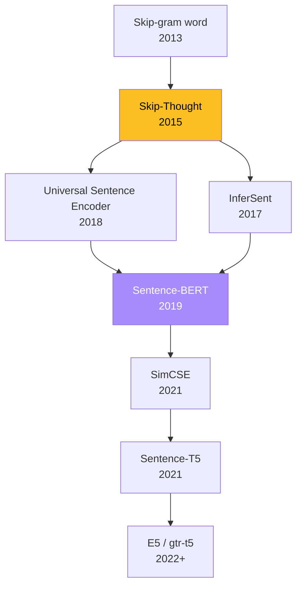

**Skip-Thought Vectors** (Kiros et al. 2015) es el primer modelo no-supervisado de **sentence embeddings transferibles**. Generaliza la idea de Word2Vec Skip-gram del nivel palabra al nivel oracion. Es el **ancestro directo** de toda la familia moderna de sentence encoders -- InferSent, USE, Sentence-BERT, SimCSE.

Este fundamento cubre Skip-Thought + el espacio mas amplio de sentence embeddings que motivo.

---

## 1. La idea -- Skip-gram al nivel de oracion

| Skip-gram (Word2Vec) | Skip-Thought |
|---|---|
| Unidad: palabra $w_t$ | Unidad: oracion $s_i$ |
| Predecir: palabras del contexto $w_{t \pm j}$ | Predecir: oraciones adyacentes $s_{i \pm 1}$ |
| Encoder: lookup en matriz $C$ | Encoder: GRU |
| Decoder: softmax sobre $\|V\|$ | Decoder: GRU palabra-por-palabra |
| Resultado: word embeddings | Resultado: **sentence embeddings** |

**Setup**: dada una oracion $s_i$ en un corpus de texto continuo (BookCorpus), codificarla y predecir las oraciones $s_{i-1}$ y $s_{i+1}$.

---

## 2. Arquitectura

### 2.1 Encoder GRU

Procesar la oracion $s_i = (w_i^1, \ldots, w_i^N)$ con un GRU estandar:

$$\mathbf{r}^t = \sigma(\mathbf{W}_r \mathbf{x}^t + \mathbf{U}_r \mathbf{h}^{t-1})$$

$$\mathbf{z}^t = \sigma(\mathbf{W}_z \mathbf{x}^t + \mathbf{U}_z \mathbf{h}^{t-1})$$

$$\bar{\mathbf{h}}^t = \tanh(\mathbf{W} \mathbf{x}^t + \mathbf{U}(\mathbf{r}^t \odot \mathbf{h}^{t-1}))$$

$$\mathbf{h}^t = (1 - \mathbf{z}^t) \odot \mathbf{h}^{t-1} + \mathbf{z}^t \odot \bar{\mathbf{h}}^t$$

El **sentence embedding** es $\mathbf{h}_i = \mathbf{h}^N$ (estado tras procesar toda la oracion).

### 2.2 Conditional GRU decoder

Dos decoders (uno por oracion adyacente) con **conditional GRU**: el embedding $\mathbf{h}_i$ se inyecta en cada gate del decoder via matrices $\mathbf{C}_r, \mathbf{C}_z, \mathbf{C}$:

$$\mathbf{r}^t = \sigma(\mathbf{W}_r^d \mathbf{x}^{t-1} + \mathbf{U}_r^d \mathbf{h}^{t-1} + \mathbf{C}_r \mathbf{h}_i)$$

(analogo para $\mathbf{z}^t$ y $\bar{\mathbf{h}}^t$). Decoders separados pero **comparten la matriz de vocabulario** $V$.

### 2.3 Variantes

| Modelo | Encoder | Dimension |
|---|---|---|
| **uni-skip** | Unidireccional | 2400 |
| **bi-skip** | Bidireccional (forward + backward 1200 c/u) | 1200 + 1200 |
| **combine-skip** | concat(uni, bi) | 4800 |

`combine-skip` es el ganador empirico en la mayoria de evaluaciones.

---

## 3. Vocabulary expansion

El corpus de entrenamiento (BookCorpus) tiene vocab ~20k. Pero en test queremos encodear oraciones con palabras nuevas.

**Solucion**: aprender una **regresion lineal** $\mathbf{W}_{\text{exp}}: \mathbb{R}^{300} \to \mathbb{R}^{620}$ que mapea Word2Vec preentrenado (cobertura 3M+) a los embeddings del encoder de Skip-Thought.

```python
# Pseudo-codigo
shared_words = vocab_skip_thought & vocab_w2v
X = np.array([w2v[w] for w in shared_words])       # [N, 300]
Y = np.array([skip_thought[w] for w in shared_words])  # [N, 620]
W_exp = np.linalg.lstsq(X, Y, rcond=None)[0]       # [300, 620]

# Para nueva palabra w' en w2v pero no en skip_thought:
new_emb = W_exp @ w2v[w_new]
```

Vocabulario efectivo expandido de **20k a 930.911** palabras.

---

## 4. Objetivo y entrenamiento

$$\mathcal{L} = \sum_t \log P(w_{i+1}^t \mid w_{i+1}^{<t}, \mathbf{h}_i) + \sum_t \log P(w_{i-1}^t \mid w_{i-1}^{<t}, \mathbf{h}_i)$$

- **Corpus**: BookCorpus, 11k libros, 74M oraciones, 1B palabras.
- **Encoder dim**: 2400 (uni) o 1200+1200 (bi).
- **Embedding word dim**: 620.
- **Optimizer**: Adam.
- **Tiempo**: ~2 semanas en GPU.

---

## 5. Aplicaciones downstream evaluadas

Skip-Thought se evalua **sin fine-tuning**: extraer sentence embeddings y entrenar un clasificador lineal encima.

### Semantic Relatedness (SICK)

Pearson $r = 0.858$ con humanos. Compite con Tree-LSTM supervisado que requiere parser dependencial.

### Paraphrase Detection (MSR Paraphrase Corpus)

F1 = 82.0 (combine-skip). Competitivo con SOTA supervisado de la epoca.

### Clasificacion de oraciones

5 datasets: MR (movie reviews), CR (customer reviews), SUBJ, MPQA, TREC. Competitivo con CNN supervisado (Kim 2014).

### Image-sentence ranking

Como text encoder en VSE++ para image retrieval. R@10 = 75.8%.

---

## 6. Nearest sentences -- analisis cualitativo

Tabla 2 del paper muestra ejemplos de nearest sentences en 500k oraciones por cosine similarity:

| Query | Vecino |
|---|---|
| "he ran his hand inside his coat, double-checking that the unopened letter was still there." | "he slipped his hand between his coat and his shirt, where the folded copies lay in a brown envelope." |
| "an annoying buzz started to ring in my ears, becoming louder and louder as my vision began to swim." | "a weighty pressure landed on my lungs and my vision blurred at the edges, threatening my consciousness altogether." |

Captura **semantica de eventos y emociones**, no solo palabras compartidas.

---

## 7. Limitaciones de Skip-Thought

1. **Costo de entrenamiento**: 2 semanas en GPU.
2. **Vocabulary expansion** es un hack.
3. **Composicionalidad fina**: falla en distinguir "tricks on a motorcycle" vs "tricking a person on a motorcycle".
4. **Solo ingles**: requiere corpus narrativo continuo.
5. **Encoder secuencial**: lento, dependencias largas dificiles.

---

## 8. Sucesores -- la genealogia de sentence embeddings



| Modelo | Innovacion sobre Skip-Thought |
|---|---|
| **InferSent** (Conneau 2017) | Supervision en SNLI (NLI dataset). Mejor calidad downstream. |
| **Universal Sentence Encoder** (Cer 2018) | Transformer encoder + multi-task. |
| **Sentence-BERT** (Reimers 2019) | BERT siames + contrastive. SOTA en STS. |
| **SimCSE** (Gao 2021) | Contrastive con dropout como augmentation. |
| **gtr-t5 / E5** (2022+) | Embedding models para retrieval, base de RAG. |

---

## 9. Skip-Thought vs Sentence-BERT moderno

| Aspecto | Skip-Thought | Sentence-BERT |
|---|---|---|
| Encoder | RNN-GRU | Transformer encoder pretrained |
| Entrenamiento | Autosupervisado (oraciones adyacentes) | Contrastive supervisado (SNLI/MNLI) |
| Vocabulario | Fijo + W_exp hack | WordPiece, abierto |
| Dependencias largas | Limitadas (RNN) | Excelentes (self-attention) |
| Calidad STS | Pearson ~0.86 (SICK) | Pearson ~0.88 (STS-B) |
| Tiempo de entrenamiento | 2 semanas | Horas (con BERT pretrained) |
| Estado en 2026 | Historico | **Estandar de produccion** (RAG, semantic search) |

---

## 10. Implementacion: Skip-Thought encoder (PyTorch)

```python
import torch
import torch.nn as nn

class SkipThoughtEncoder(nn.Module):
    def __init__(self, vocab_size: int, emb_dim: int = 620, hidden_dim: int = 2400):
        super().__init__()
        self.embedding = nn.Embedding(vocab_size, emb_dim, padding_idx=0)
        self.gru = nn.GRU(emb_dim, hidden_dim, batch_first=True)

    def forward(self, token_ids, lengths):
        emb = self.embedding(token_ids)
        packed = nn.utils.rnn.pack_padded_sequence(
            emb, lengths.cpu(), batch_first=True, enforce_sorted=False
        )
        _, h_T = self.gru(packed)
        return h_T.squeeze(0)  # [B, hidden_dim]


class ConditionalGRUCell(nn.Module):
    """GRU cell con condicionamiento de la oracion fuente."""
    def __init__(self, input_dim, hidden_dim, cond_dim):
        super().__init__()
        self.W_r = nn.Linear(input_dim, hidden_dim, bias=False)
        self.U_r = nn.Linear(hidden_dim, hidden_dim, bias=False)
        self.C_r = nn.Linear(cond_dim, hidden_dim)
        # ... similar para z y h_tilde
        self.W_z = nn.Linear(input_dim, hidden_dim, bias=False)
        self.U_z = nn.Linear(hidden_dim, hidden_dim, bias=False)
        self.C_z = nn.Linear(cond_dim, hidden_dim)
        self.W = nn.Linear(input_dim, hidden_dim, bias=False)
        self.U = nn.Linear(hidden_dim, hidden_dim, bias=False)
        self.C = nn.Linear(cond_dim, hidden_dim)

    def forward(self, x_t, h_prev, h_cond):
        r = torch.sigmoid(self.W_r(x_t) + self.U_r(h_prev) + self.C_r(h_cond))
        z = torch.sigmoid(self.W_z(x_t) + self.U_z(h_prev) + self.C_z(h_cond))
        h_tilde = torch.tanh(self.W(x_t) + self.U(r * h_prev) + self.C(h_cond))
        return (1 - z) * h_prev + z * h_tilde
```

---

## 11. Cuando usar sentence embeddings hoy

| Use case | Recomendacion 2026 |
|---|---|
| Semantic search / RAG | **Sentence-BERT** (`all-MiniLM-L6-v2`, `gtr-t5-large`) |
| Paraphrase detection | SBERT con fine-tuning ligero |
| Clustering de documentos | SBERT + UMAP/HDBSCAN |
| Cross-lingual retrieval | **mUSE**, **LaBSE** |
| Multimodal text-image | **CLIP** text encoder |
| Embeddings de oraciones cortas (FAQ) | SBERT pequeno |
| Historico / baseline | Skip-Thought |

---

## Referencias

- [Skip-Thought paper (Kiros 2015)](/papers/skip-thought-kiros-2015).
- [Word2Vec Distributed (Mikolov 2013)](/papers/word2vec-distributed-mikolov-2013) -- predecesor conceptual.
- Sentence-BERT (Reimers 2019): https://arxiv.org/abs/1908.10084
- SimCSE (Gao 2021): https://arxiv.org/abs/2104.08821

## Fundamentos relacionados

- [Word2Vec](/fundamentos/word2vec), [Modelos de lenguaje](/fundamentos/modelos-de-lenguaje), [Redes recurrentes](/fundamentos/redes-recurrentes), [LSTM/GRU](/fundamentos/lstm-gru), [BERT](/fundamentos/bert).

## Clases relacionadas

- [Clase 18 - Modelos de lenguaje, Word2Vec, GloVe y SkipThought](/clases/clase-18).
